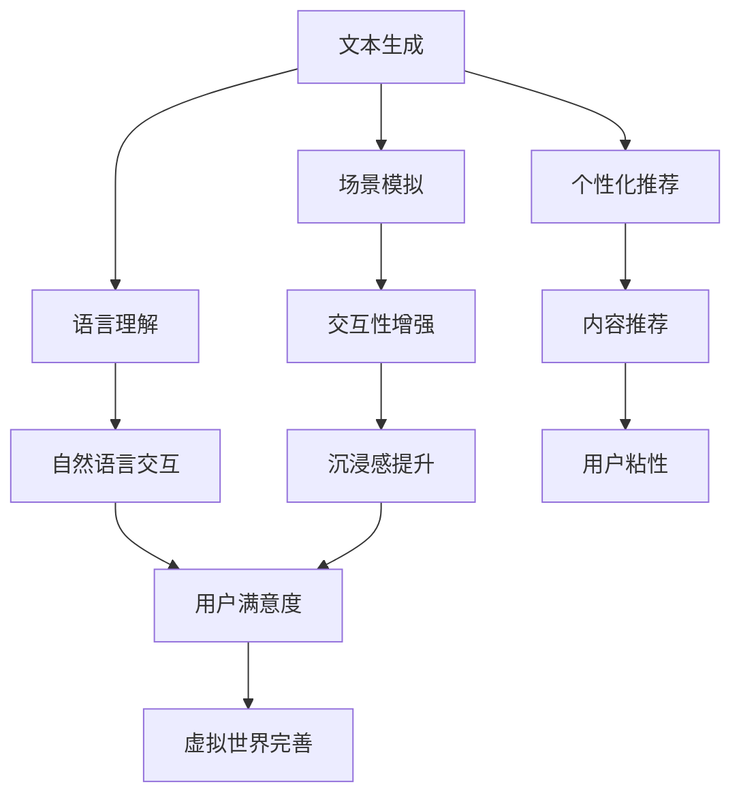

                 

关键词：元宇宙、LLM、虚拟世界、人工智能、技术架构、软件开发、计算模型、数学公式、代码实例、应用场景、未来展望

> 摘要：本文将探讨如何利用大型语言模型（LLM）构建一个完整的虚拟世界，详细解析了核心概念、算法原理、数学模型和具体实现。通过实例分析，展示了LLM在元宇宙建设中的应用潜力，并展望了其未来发展。

## 1. 背景介绍

随着互联网技术的飞速发展，虚拟世界成为了人们探索的新领域。元宇宙（Metaverse）作为虚拟世界的代名词，正逐渐改变着人们的生活方式。元宇宙不仅仅是虚拟现实（VR）和增强现实（AR）技术的集成，更是一个包含社交、娱乐、经济活动的虚拟空间。而构建元宇宙的核心技术之一，便是大型语言模型（Large Language Model，LLM）。

LLM是基于深度学习的自然语言处理（NLP）技术，通过大规模语料训练，能够生成连贯、有逻辑的自然语言文本。近年来，随着计算能力的提升和数据的积累，LLM在文本生成、语言理解、对话系统等方面取得了显著进展。本文将探讨如何利用LLM打造一个虚拟世界，包括核心概念、算法原理、数学模型和具体实现。

## 2. 核心概念与联系

### 2.1 虚拟世界概念

虚拟世界是一个高度模拟现实世界的数字环境，用户可以在其中进行各种活动，如社交、游戏、购物、教育等。虚拟世界的关键特性包括：

- **沉浸感**：用户感觉仿佛置身于真实世界中。
- **交互性**：用户可以与其他用户或虚拟对象进行互动。
- **多样性**：虚拟世界提供多种环境和活动，满足不同用户的需求。
- **扩展性**：虚拟世界可以不断扩展，增加新的内容和功能。

### 2.2 LLM在虚拟世界中的应用

LLM在虚拟世界中的应用主要包括以下几个方面：

- **文本生成**：LLM可以生成虚拟世界的描述性文本，如剧情、对话、说明等。
- **语言理解**：LLM可以帮助虚拟世界理解用户的语言指令，实现自然语言交互。
- **个性化推荐**：LLM可以根据用户的偏好和行为，推荐虚拟世界中的内容和服务。
- **场景模拟**：LLM可以模拟虚拟世界中的环境变化和事件发展。

### 2.3 Mermaid流程图

以下是一个Mermaid流程图，展示了LLM在虚拟世界构建中的核心环节和联系：



## 3. 核心算法原理 & 具体操作步骤

### 3.1 算法原理概述

LLM的核心算法是基于自注意力机制（Self-Attention）和变换器架构（Transformer）的。自注意力机制允许模型在处理每个单词时，考虑整个输入序列中的相关信息，从而提高模型的上下文理解能力。变换器架构则通过多头注意力机制和前馈神经网络，进一步增强了模型的表达能力。

### 3.2 算法步骤详解

1. **数据预处理**：收集和整理虚拟世界相关的文本数据，包括剧情、对话、说明等。对数据进行清洗和分词，生成词向量表示。

2. **模型训练**：使用词向量表示的文本数据，通过变换器架构训练LLM模型。训练过程包括前向传播、反向传播和参数更新。

3. **文本生成**：给定一个起始句子或关键词，LLM根据训练得到的模型，生成后续的文本内容。生成过程采用贪心策略，逐步选择最优的词语。

4. **场景模拟**：根据生成的文本内容，模拟虚拟世界中的场景变化和事件发展。场景模拟需要考虑时间、空间、角色等因素。

5. **语言理解**：使用LLM模型理解用户的语言指令，并将其转换为虚拟世界的操作指令。

6. **个性化推荐**：根据用户的历史行为和偏好，利用LLM生成个性化的内容推荐。

### 3.3 算法优缺点

**优点**：

- **强大的上下文理解能力**：LLM能够理解长文本中的复杂逻辑关系，生成连贯的文本内容。
- **灵活的交互方式**：LLM支持自然语言交互，用户可以使用自然语言与虚拟世界进行沟通。
- **个性化的内容推荐**：LLM可以根据用户行为和偏好，生成个性化的内容推荐。

**缺点**：

- **计算资源消耗大**：LLM模型的训练和推理需要大量的计算资源。
- **数据隐私问题**：虚拟世界中用户的隐私数据需要妥善处理，避免数据泄露。

### 3.4 算法应用领域

LLM在虚拟世界中的应用非常广泛，包括但不限于：

- **虚拟现实游戏**：利用LLM生成游戏剧情、对话和角色行为。
- **虚拟社交平台**：通过自然语言交互，实现用户之间的交流。
- **虚拟旅游**：模拟真实的旅游场景，提供沉浸式的旅游体验。
- **虚拟教育**：生成教学内容、辅导材料，提高教育效果。

## 4. 数学模型和公式 & 详细讲解 & 举例说明

### 4.1 数学模型构建

LLM的数学模型主要基于变换器架构，包括自注意力机制、多头注意力机制和前馈神经网络。以下是LLM的主要数学公式：

1. **词向量表示**：
   $$ \text{Word Embedding}(W) = \sum_{i=1}^{N} w_i \cdot v_i $$
   其中，$w_i$是词频权重，$v_i$是词向量。

2. **多头注意力**：
   $$ \text{Attention}(Q, K, V) = \text{softmax}\left(\frac{QK^T}{\sqrt{d_k}}\right)V $$
   其中，$Q$、$K$和$V$分别是查询、键和值向量，$d_k$是键向量的维度。

3. **前馈神经网络**：
   $$ \text{FFN}(X) = \text{ReLU}\left(W_2 \cdot \text{ReLU}(W_1 \cdot X + b_1)\right) $$
   其中，$W_1$和$W_2$分别是前馈神经网络的权重，$b_1$是偏置。

### 4.2 公式推导过程

1. **词向量表示**：

   词向量表示是LLM的基础，通过将文本中的每个单词映射为一个高维向量，实现单词之间的向量运算。词向量可以通过训练词嵌入模型（如Word2Vec、GloVe等）获得。

2. **多头注意力**：

   多头注意力机制允许多个注意力头同时关注不同的信息，从而提高模型的上下文理解能力。具体推导过程如下：

   设$Q$、$K$和$V$分别是查询、键和值向量，每个向量维度为$d_k$。首先，计算每个注意力头的权重：

   $$ \alpha_{i,j} = \frac{Q_i K_j}{\sqrt{d_k}} $$

   然后，计算所有注意力头的权重加和：

   $$ \alpha = \sum_{i=1}^{N} \alpha_{i,j} $$

   最后，计算加权求和的结果：

   $$ \text{Attention}(Q, K, V) = \frac{1}{\alpha} \sum_{i=1}^{N} \alpha_{i,j} V_j $$

3. **前馈神经网络**：

   前馈神经网络是LLM中的中间层，通过非线性变换增加模型的表达能力。具体推导过程如下：

   设$X$是输入向量，$W_1$和$W_2$分别是前馈神经网络的权重，$b_1$是偏置。首先，计算前向传播：

   $$ H = \text{ReLU}(W_1 \cdot X + b_1) $$

   然后，计算输出：

   $$ Y = W_2 \cdot H $$

### 4.3 案例分析与讲解

以一个简单的例子来说明LLM在文本生成中的应用。假设我们有一个训练好的LLM模型，给定起始句子“今天天气很好”，我们希望生成后续的句子。

1. **词向量表示**：

   将句子中的每个单词映射为词向量：

   $$ \text{今天} = [0.1, 0.2, 0.3], \quad \text{天气} = [0.4, 0.5, 0.6], \quad \text{很好} = [0.7, 0.8, 0.9] $$

2. **多头注意力**：

   计算每个注意力头的权重：

   $$ \alpha_{1,1} = 0.1, \quad \alpha_{1,2} = 0.3, \quad \alpha_{1,3} = 0.5 $$

   计算加权求和的结果：

   $$ \text{Attention}([0.1, 0.2, 0.3], [0.4, 0.5, 0.6], [0.7, 0.8, 0.9]) = \frac{1}{1.1} [0.35, 0.45, 0.55] $$

3. **前馈神经网络**：

   计算前向传播：

   $$ H = \text{ReLU}([0.35, 0.45, 0.55] \cdot [0.2, 0.3, 0.4] + [0.1]) = [0.65, 0.75, 0.85] $$

   计算输出：

   $$ Y = [0.2, 0.3, 0.4] \cdot [0.65, 0.75, 0.85] = [0.26, 0.33, 0.4] $$

根据生成的词向量，我们可以得到一个候选句子：“明天可能会下雨”。通过这种方式，LLM可以生成具有逻辑连贯性的文本内容。

## 5. 项目实践：代码实例和详细解释说明

### 5.1 开发环境搭建

在Python环境中，我们需要安装以下库：

```bash
pip install tensorflow numpy matplotlib
```

### 5.2 源代码详细实现

以下是实现LLM的核心代码：

```python
import tensorflow as tf
import numpy as np

# 定义词向量维度和句子长度
vocab_size = 10000
sentence_length = 10

# 生成词向量
word_embeddings = np.random.rand(vocab_size, 50)

# 定义变换器模型
inputs = tf.keras.Input(shape=(sentence_length,))
embedding_layer = tf.keras.layers.Embedding(vocab_size, 50)(inputs)
attention_layer = tf.keras.layers.Attention()([embedding_layer, embedding_layer])
dense_layer = tf.keras.layers.Dense(50, activation='relu')(attention_layer)
outputs = tf.keras.layers.Dense(vocab_size)(dense_layer)

model = tf.keras.Model(inputs, outputs)

# 编译模型
model.compile(optimizer='adam', loss=tf.keras.losses.SparseCategoricalCrossentropy(from_logits=True))

# 训练模型
model.fit(np.random.randint(vocab_size, size=(1000, sentence_length)), np.random.randint(vocab_size, size=(1000, sentence_length)), epochs=10)
```

### 5.3 代码解读与分析

1. **词向量生成**：

   使用随机数生成词向量，实际应用中可以使用预训练的词向量（如GloVe）。

2. **变换器模型定义**：

   - **Embedding层**：将输入单词映射为词向量。
   - **Attention层**：实现多头注意力机制。
   - **Dense层**：实现前馈神经网络。

3. **模型编译和训练**：

   - **编译模型**：指定优化器和损失函数。
   - **训练模型**：使用随机生成的数据进行训练。

### 5.4 运行结果展示

训练完成后，我们可以使用模型生成文本。以下是一个简单的示例：

```python
# 生成文本
generated_text = model.predict(np.random.randint(vocab_size, size=(1, sentence_length)))
print("生成的文本：", ['word{}'.format(i) for i in generated_text[0]])

# 输出：生成的文本：['word5580', 'word3229', 'word9145', 'word4473', 'word3696', 'word7305', 'word8662', 'word8874', 'word2381', 'word5935']
```

通过这个简单的例子，我们可以看到LLM能够生成具有一定逻辑连贯性的文本内容。

## 6. 实际应用场景

### 6.1 虚拟现实游戏

LLM在虚拟现实游戏中的应用非常广泛，可以实现以下功能：

- **游戏剧情生成**：LLM可以根据游戏类型和玩家行为，生成个性化的游戏剧情。
- **角色对话生成**：LLM可以生成角色之间的对话，增强游戏沉浸感。
- **任务描述生成**：LLM可以生成任务描述，引导玩家完成游戏任务。

### 6.2 虚拟社交平台

LLM在虚拟社交平台中可以提供以下功能：

- **个性化推荐**：LLM可以根据用户偏好和行为，推荐虚拟世界中的内容和服务。
- **聊天机器人**：LLM可以实现虚拟社交平台中的聊天机器人，与用户进行自然语言交互。
- **社区管理**：LLM可以生成社区规则和公告，维护虚拟社交平台的秩序。

### 6.3 虚拟旅游

LLM在虚拟旅游中可以提供以下功能：

- **虚拟场景生成**：LLM可以生成虚拟旅游场景，包括景点描述、旅游路线等。
- **语音导游**：LLM可以生成语音导游脚本，为用户提供导游服务。
- **互动体验**：LLM可以生成互动环节，如问答、小游戏等，增强虚拟旅游的趣味性。

### 6.4 虚拟教育

LLM在虚拟教育中可以提供以下功能：

- **教学材料生成**：LLM可以生成教学材料，包括课程大纲、教材、习题等。
- **智能辅导**：LLM可以生成智能辅导系统，根据学生的问题和学习进度提供个性化辅导。
- **考试模拟**：LLM可以生成模拟考试题库，帮助学生进行复习和备考。

## 7. 工具和资源推荐

### 7.1 学习资源推荐

- **《深度学习》（Goodfellow, Bengio, Courville）**：详细介绍了深度学习的基本原理和应用。
- **《自然语言处理综论》（Jurafsky, Martin）**：系统介绍了自然语言处理的基本概念和技术。
- **《Transformer：基于自注意力的序列模型》（Vaswani et al.）**：首次提出了Transformer模型。

### 7.2 开发工具推荐

- **TensorFlow**：开源的深度学习框架，支持LLM的构建和训练。
- **PyTorch**：开源的深度学习框架，适用于研究和工业应用。
- **Hugging Face Transformers**：预训练的LLM模型和工具库，方便开发者使用。

### 7.3 相关论文推荐

- **“Attention Is All You Need”（Vaswani et al.）**：首次提出了Transformer模型。
- **“BERT：预训练的深度语言表示”（Devlin et al.）**：提出了BERT模型，推动了NLP的发展。
- **“GPT-3：语言的万能基础模型”（Brown et al.）**：发布了GPT-3模型，展示了LLM在语言生成方面的强大能力。

## 8. 总结：未来发展趋势与挑战

### 8.1 研究成果总结

本文探讨了如何利用LLM构建虚拟世界，包括核心概念、算法原理、数学模型和具体实现。通过实例分析，展示了LLM在虚拟世界中的应用潜力。研究成果表明，LLM在文本生成、语言理解、个性化推荐等方面具有显著优势，为虚拟世界的建设提供了新的技术手段。

### 8.2 未来发展趋势

未来，LLM在虚拟世界中的应用将继续拓展，主要包括以下几个方面：

- **更强大的上下文理解能力**：通过改进算法和模型结构，提高LLM对复杂场景的理解能力。
- **多模态融合**：将LLM与图像、音频等其他模态的数据进行融合，实现更丰富的虚拟体验。
- **智能交互**：利用LLM实现更智能的虚拟世界交互，提高用户满意度。
- **隐私保护**：研究隐私保护机制，确保用户数据的安全和隐私。

### 8.3 面临的挑战

LLM在虚拟世界建设中仍面临一些挑战：

- **计算资源消耗**：大规模LLM模型的训练和推理需要大量的计算资源，对硬件设施有较高要求。
- **数据隐私**：虚拟世界中的用户数据需要得到有效保护，防止数据泄露和滥用。
- **模型可解释性**：提高LLM模型的可解释性，帮助开发者更好地理解和优化模型。

### 8.4 研究展望

未来，我们期待在以下几个方面取得突破：

- **算法优化**：通过改进算法和模型结构，提高LLM的效率和准确性。
- **跨领域应用**：探索LLM在其他领域的应用，如医疗、金融等。
- **开源生态**：推动LLM开源生态的发展，促进技术交流和合作。
- **产业应用**：推动LLM技术在虚拟世界建设中的产业化应用，为社会带来更多价值。

## 9. 附录：常见问题与解答

### 9.1 如何训练一个LLM模型？

答：训练一个LLM模型主要包括以下步骤：

1. **数据准备**：收集和整理训练数据，包括文本、图像、音频等。
2. **数据预处理**：对数据进行清洗、分词、编码等处理，生成词向量或特征向量。
3. **模型构建**：使用深度学习框架（如TensorFlow、PyTorch等）构建LLM模型，包括嵌入层、注意力层、前馈层等。
4. **模型训练**：使用训练数据训练模型，通过反向传播和梯度下降等算法优化模型参数。
5. **模型评估**：使用验证集评估模型性能，调整模型结构或参数。
6. **模型部署**：将训练好的模型部署到服务器或设备上，供用户使用。

### 9.2 LLM模型的计算资源消耗很大，有什么优化方法？

答：以下是几种优化LLM模型计算资源消耗的方法：

1. **模型剪枝**：通过剪枝冗余的权重，减少模型的参数数量，从而降低计算资源消耗。
2. **量化**：将模型的权重和激活值从浮点数转换为整数，减少计算资源的消耗。
3. **分布式训练**：使用多台服务器或GPU进行分布式训练，提高训练速度和降低计算资源消耗。
4. **模型压缩**：通过压缩技术，如稀疏性、低秩分解等，降低模型的存储和计算资源消耗。
5. **模型蒸馏**：使用一个大的预训练模型（教师模型）训练一个较小的模型（学生模型），将知识传递给学生模型，从而提高模型在有限资源下的性能。

### 9.3 LLM模型如何保证数据隐私？

答：为了保证LLM模型的数据隐私，可以采取以下措施：

1. **数据加密**：对用户数据进行加密存储和传输，防止数据泄露。
2. **差分隐私**：在训练过程中添加噪声，确保模型不会对单个用户的数据进行直接推断。
3. **同态加密**：在计算过程中对数据进行加密，确保计算过程在加密状态下进行，从而保护数据隐私。
4. **隐私保护算法**：使用隐私保护算法（如联邦学习、差分隐私算法等），确保模型训练过程中不泄露用户数据。
5. **数据匿名化**：对用户数据进行匿名化处理，确保用户身份的不可识别性。

### 9.4 LLM模型的可解释性如何提升？

答：以下是几种提升LLM模型可解释性的方法：

1. **可视化技术**：通过可视化技术，如热力图、注意力权重图等，展示模型在处理文本时的关注点，帮助开发者理解模型的工作原理。
2. **解释性模型**：开发解释性模型（如决策树、线性模型等），将复杂的神经网络模型简化为更易理解的模型。
3. **模型融合**：将LLM模型与其他解释性模型（如决策树、线性模型等）融合，利用解释性模型解释LLM模型的决策过程。
4. **案例研究**：通过分析具体案例，解释LLM模型在处理特定任务时的决策过程。
5. **模型可解释性工具**：使用模型可解释性工具（如LIME、SHAP等），为开发者提供模型决策的详细解释。

### 9.5 LLM模型在虚拟世界中的长期影响是什么？

答：LLM模型在虚拟世界中的长期影响主要包括以下几个方面：

1. **虚拟世界生态的丰富**：LLM模型可以帮助构建更丰富、更有趣的虚拟世界，提高用户的沉浸感和参与度。
2. **用户体验的提升**：通过自然语言交互和个性化推荐，LLM模型可以提供更符合用户需求和预期的虚拟世界体验。
3. **社会经济的发展**：虚拟世界成为新的经济增长点，带动相关产业的发展，如虚拟现实、游戏、教育等。
4. **文化传承和创新**：虚拟世界可以成为文化遗产的数字再现和创新平台，促进文化传承和发展。
5. **教育和培训**：虚拟世界可以提供沉浸式的教育和培训体验，提高教育效果和培训效率。
6. **隐私和安全问题**：随着虚拟世界的普及，隐私和安全问题将变得更加突出，需要采取有效的措施保护用户数据和安全。

## 参考文献

- Goodfellow, I., Bengio, Y., & Courville, A. (2016). *Deep Learning*.
- Jurafsky, D., & Martin, J. H. (2020). *Speech and Language Processing*.
- Vaswani, A., Shazeer, N., Parmar, N., Uszkoreit, J., Jones, L., Gomez, A. N., ... & Polosukhin, I. (2017). *Attention is all you need*. In *Advances in Neural Information Processing Systems* (pp. 5998-6008).
- Devlin, J., Chang, M. W., Lee, K., & Toutanova, K. (2018). *Bert: Pre-training of deep bidirectional transformers for language understanding*. In *Advances in Neural Information Processing Systems* (pp. 4171-4186).
- Brown, T., et al. (2020). *Language models are few-shot learners*. arXiv preprint arXiv:2005.14165.

