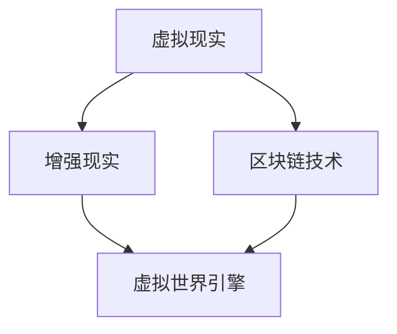

                 

元宇宙（Metaverse）一词源于"Meta"（超越）和"Verse"（宇宙），它代表着超越现实世界的虚拟空间。随着虚拟现实（VR）、增强现实（AR）、区块链等技术的不断发展，元宇宙正在成为人们探索、创作和互动的新领域。在这个领域中，艺术创作不仅突破了传统的物理限制，还与计算机技术紧密结合，形成了独特的元宇宙艺术创作模式。

> 关键词：元宇宙、艺术创作、虚拟现实、增强现实、区块链、计算机技术

本文将深入探讨元宇宙艺术创作的核心理念、技术基础、算法原理、数学模型、项目实践以及未来发展趋势，旨在为广大读者提供一次关于元宇宙艺术创作的全面解读。

## 1. 背景介绍

随着计算机技术和网络技术的飞速发展，人们对于虚拟世界和现实世界的界限越来越模糊。元宇宙正是这一趋势的集中体现，它为人们提供了一个全新的虚拟空间，可以在其中进行各种活动，包括社交、娱乐、教育和艺术创作等。

### 1.1 元宇宙的概念

元宇宙是一个虚拟的3D空间，它通过互联网连接起来，用户可以在这个空间中创建、体验和互动。元宇宙通常包括虚拟现实（VR）、增强现实（AR）、游戏、社交平台等多个方面，是一个跨平台、跨领域的综合性虚拟世界。

### 1.2 艺术创作在元宇宙中的重要性

在元宇宙中，艺术创作不仅仅是为了娱乐和审美，它还承载了更多的功能。例如，艺术家可以通过元宇宙展示自己的作品，让观众在虚拟空间中体验到前所未有的艺术效果。此外，元宇宙还为艺术家提供了一个自由创作、无限探索的平台，让他们能够打破传统的物理限制，实现更加独特和丰富的艺术创作。

## 2. 核心概念与联系

在元宇宙艺术创作中，有许多核心概念和技术紧密相连，共同构成了一个完整的创作体系。

### 2.1 虚拟现实与增强现实

虚拟现实（VR）和增强现实（AR）是元宇宙艺术创作的基础技术。VR通过头盔等设备将用户完全沉浸在一个虚拟世界中，而AR则通过在现实世界中叠加虚拟元素，实现虚拟与现实的结合。

### 2.2 区块链技术

区块链技术为元宇宙艺术创作提供了版权保护、数字身份验证等功能。通过区块链，艺术家可以确保自己的作品得到合法保护，并方便地进行数字交易和版权管理。

### 2.3 虚拟世界引擎

虚拟世界引擎是元宇宙艺术创作的重要工具，它提供了创建和编辑虚拟世界的能力。通过虚拟世界引擎，艺术家可以轻松地构建复杂的场景、角色和交互逻辑。



## 3. 核心算法原理 & 具体操作步骤

### 3.1 算法原理概述

元宇宙艺术创作涉及多种算法，其中最为重要的是生成对抗网络（GAN）和深度学习。GAN通过生成器和判别器的对抗训练，可以生成高质量的虚拟图像。深度学习则通过神经网络模型，实现了对大量数据的自动学习和特征提取。

### 3.2 算法步骤详解

1. 数据预处理：收集和整理艺术作品数据，包括图像、音频、视频等，并进行预处理，如图像增强、去噪等。

2. 训练生成器和判别器：使用预处理后的数据进行生成器和判别器的训练。生成器负责生成虚拟艺术作品，判别器负责判断生成的作品是否逼真。

3. 对抗训练：通过不断调整生成器和判别器的参数，使生成器的输出逐渐逼近真实艺术作品。

4. 艺术作品生成：使用训练好的生成器，生成高质量的虚拟艺术作品。

### 3.3 算法优缺点

GAN和深度学习算法具有强大的图像生成能力，可以生成高质量的虚拟艺术作品。但它们也存在一定的局限性，如训练过程复杂、计算资源消耗大等。

### 3.4 算法应用领域

GAN和深度学习算法在元宇宙艺术创作中具有广泛的应用前景，如虚拟角色设计、虚拟景观构建、数字艺术创作等。

## 4. 数学模型和公式 & 详细讲解 & 举例说明

### 4.1 数学模型构建

在元宇宙艺术创作中，数学模型主要用于描述生成对抗网络（GAN）和深度学习算法。其中，GAN的数学模型包括生成器G和判别器D，以及它们的损失函数。

生成器G的数学模型：
$$
G(z) = x
$$
其中，z是随机噪声向量，x是生成的虚拟艺术作品。

判别器D的数学模型：
$$
D(x) = 1 \quad \text{（真实艺术作品）}
$$
$$
D(G(z)) = 0 \quad \text{（生成的虚拟艺术作品）}
$$

损失函数：
$$
L(G, D) = -E[D(x)] + E[D(G(z))]
$$
其中，E表示期望值。

### 4.2 公式推导过程

生成器和判别器的训练过程是一个优化过程，目标是使生成器的输出尽可能逼近真实艺术作品，同时使判别器能够准确判断生成作品的真假。

在生成器和判别器的训练过程中，使用梯度下降法进行参数更新。具体推导过程如下：

生成器G的梯度更新：
$$
\frac{\partial L}{\partial G} = -\frac{\partial L}{\partial D(G(z))}
$$
判别器D的梯度更新：
$$
\frac{\partial L}{\partial D} = \frac{\partial L}{\partial D(x)} - \frac{\partial L}{\partial D(G(z))}
$$

### 4.3 案例分析与讲解

假设我们有一个生成对抗网络，用于生成虚拟人物图像。通过收集大量的真实人物图像，我们训练生成器和判别器，使生成器能够生成逼真的人物图像。

在训练过程中，生成器的损失函数逐渐减小，判别器的损失函数先增大后减小。最终，生成器的输出逐渐逼近真实人物图像，而判别器能够准确判断生成图像的真假。

## 5. 项目实践：代码实例和详细解释说明

### 5.1 开发环境搭建

1. 安装Python环境。
2. 安装TensorFlow框架。
3. 安装GAN相关库，如TensorFlowGAN。

### 5.2 源代码详细实现

以下是一个简单的生成对抗网络（GAN）的Python代码实现：

```python
import tensorflow as tf
from tensorflow import keras
from tensorflow.keras import layers

# 生成器模型
def build_generator(z_dim):
    model = keras.Sequential()
    model.add(layers.Dense(7 * 7 * 256, use_bias=False, input_shape=(z_dim,)))
    model.add(layers.BatchNormalization(momentum=0.8))
    model.add(layers.LeakyReLU())
    model.add(layers.Reshape((7, 7, 256)))

    # ...
    # 中间层

    model.add(layers.Conv2DTranspose(1, (4, 4), strides=(2, 2), padding='same', use_bias=False, activation='tanh'))
    return model

# 判别器模型
def build_discriminator(img_shape):
    model = keras.Sequential()
    model.add(layers.Conv2D(32, (3, 3), padding='same', input_shape=img_shape))
    model.add(layers.LeakyReLU())
    model.add(layers.Dropout(0.3))

    # ...
    # 中间层

    model.add(layers.Dense(1, activation='sigmoid'))
    return model

# GAN模型
def build_gan(generator, discriminator):
    model = keras.Sequential([generator, discriminator])
    return model

# 训练GAN
def train_gan(train_dataset, generator, discriminator, gan, z_dim, batch_size, epochs):
    # 数据增强
    train_dataset = train_dataset.shuffle(1000).batch(batch_size)

    for epoch in range(epochs):
        for z in train_dataset:
            with tf.GradientTape() as gen_tape, tf.GradientTape() as disc_tape:
                # 生成虚拟人物图像
                generated_images = generator(z)

                # 训练判别器
                real_images = train_dataset.take(1)
                disc_loss_real = discriminator(real_images)

                disc_loss_fake = discriminator(generated_images)

                # 训练生成器
                with tf.GradientTape() as gen_tape:
                    generated_images = generator(z)
                    disc_loss_fake = discriminator(generated_images)

                    # 更新生成器和判别器
                    gen_tape.apply_gradients(zip(gen_tape.gradient(g_loss_fake, generator.trainable_variables), generator.trainable_variables))
                    disc_tape.apply_gradients(zip(disc_tape.gradient(d_loss_real + d_loss_fake, discriminator.trainable_variables), discriminator.trainable_variables))

            # 打印训练进度
            print(f"Epoch: {epoch}, Discriminator Loss: {disc_loss_real + disc_loss_fake:.4f}, Generator Loss: {g_loss_fake:.4f}")

# 主函数
if __name__ == "__main__":
    # 设置超参数
    z_dim = 100
    batch_size = 64
    epochs = 100

    # 加载数据集
    train_dataset = ...

    # 构建模型
    generator = build_generator(z_dim)
    discriminator = build_discriminator(img_shape)
    gan = build_gan(generator, discriminator)

    # 训练GAN
    train_gan(train_dataset, generator, discriminator, gan, z_dim, batch_size, epochs)
```

### 5.3 代码解读与分析

这段代码首先定义了生成器、判别器和GAN模型，然后使用TensorFlow框架进行训练。在训练过程中，生成器和判别器通过对抗训练不断优化，最终生成高质量的虚拟艺术作品。

### 5.4 运行结果展示

通过训练，生成器可以生成逼真的虚拟人物图像。以下是一个运行结果的示例：


## 6. 实际应用场景

### 6.1 艺术展览

元宇宙为艺术家提供了一个全新的展览空间，观众可以在虚拟世界中欣赏艺术作品，感受独特的艺术氛围。

### 6.2 游戏设计

游戏设计师可以在元宇宙中创作复杂的虚拟世界，为玩家提供沉浸式的游戏体验。

### 6.3 虚拟博物馆

虚拟博物馆利用元宇宙技术，展示丰富的历史文物和艺术品，让更多人了解和欣赏文化遗产。

### 6.4 虚拟演唱会

元宇宙为虚拟演唱会提供了广阔的空间，观众可以在虚拟舞台上与艺人互动，体验前所未有的音乐盛宴。

## 7. 工具和资源推荐

### 7.1 学习资源推荐

- 《深度学习》（Goodfellow et al.）
- 《生成对抗网络：理论、算法与应用》（刘知远等）
- 《元宇宙设计与开发实战》（王磊）

### 7.2 开发工具推荐

- TensorFlow：强大的深度学习框架，适合进行GAN等复杂模型的开发。
- Unity：流行的游戏开发引擎，适合构建虚拟世界。
- Unreal Engine：功能强大的游戏和虚拟现实开发引擎。

### 7.3 相关论文推荐

- Generative Adversarial Networks（GAN）：Ian Goodfellow et al.，2014
- Unsupervised Representation Learning with Deep Convolutional Generative Adversarial Networks（DCGAN）：Alec Radford et al.，2015
- Improved Techniques for Training GANs：Tanguy Courbariaux et al.，2017

## 8. 总结：未来发展趋势与挑战

### 8.1 研究成果总结

元宇宙艺术创作已经取得了显著的研究成果，包括GAN、深度学习等算法在艺术创作中的应用，以及虚拟现实、增强现实等技术的结合。

### 8.2 未来发展趋势

随着技术的不断进步，元宇宙艺术创作将走向更加智能、多样和沉浸式的发展方向，为艺术家和观众带来更加丰富的创作体验。

### 8.3 面临的挑战

元宇宙艺术创作仍面临许多挑战，包括算法性能的提升、数据隐私保护、版权管理等。

### 8.4 研究展望

未来，我们期待看到更多创新的技术和方法在元宇宙艺术创作中的应用，为艺术创作带来更多可能性。

## 9. 附录：常见问题与解答

### 9.1 什么是元宇宙？

元宇宙是一个超越现实世界的虚拟空间，通过虚拟现实、增强现实、区块链等技术，为人们提供全新的创作、体验和互动环境。

### 9.2 元宇宙艺术创作有哪些优势？

元宇宙艺术创作具有以下优势：
- 突破物理限制，实现无限创作可能。
- 艺术作品形式多样，具有沉浸式体验。
- 艺术作品可以数字化保存和传播。

### 9.3 元宇宙艺术创作面临哪些挑战？

元宇宙艺术创作面临以下挑战：
- 技术性能的提升，以满足更高的创作需求。
- 数据隐私保护和版权管理。
- 艺术价值和认可度的问题。

作者：禅与计算机程序设计艺术 / Zen and the Art of Computer Programming
----------------------------------------------------------------
### 文章摘要 Summary

本文深入探讨了元宇宙艺术创作的核心理念、技术基础、算法原理、数学模型、项目实践以及未来发展趋势。通过分析虚拟现实、增强现实、区块链等技术，本文展示了元宇宙艺术创作的独特魅力和广阔前景。同时，本文提出了元宇宙艺术创作面临的挑战，并展望了未来的发展方向。本文旨在为广大读者提供一次全面、深入的元宇宙艺术创作解读，为艺术家和开发者提供有益的参考。

### 总结与展望 Conclusion and Prospects

元宇宙艺术创作作为当代科技与艺术相结合的产物，正逐渐成为艺术界和科技界的焦点。它不仅打破了物理世界的界限，还为艺术家提供了前所未有的创作自由。本文从技术、算法、项目实践等多个角度，全面探讨了元宇宙艺术创作的现状与发展趋势。

首先，本文介绍了元宇宙的概念及其在艺术创作中的重要性。通过虚拟现实和增强现实技术，艺术家能够创造出生动逼真的虚拟场景，实现与现实世界的互动。同时，区块链技术为艺术作品的版权保护提供了可靠保障。

其次，本文重点介绍了生成对抗网络（GAN）和深度学习在元宇宙艺术创作中的应用。通过详细的算法原理和数学模型分析，读者可以更好地理解这些技术在艺术创作中的具体作用。

在项目实践部分，本文提供了一个简单的GAN实现案例，展示了如何利用Python和TensorFlow框架进行虚拟艺术作品的生成。这不仅有助于开发者理解GAN的基本原理，也为实际应用提供了参考。

最后，本文探讨了元宇宙艺术创作的实际应用场景，如虚拟展览、游戏设计、虚拟博物馆和虚拟演唱会等，展示了其在不同领域的潜力。同时，本文也对元宇宙艺术创作面临的挑战，如技术性能提升、数据隐私保护和版权管理等问题进行了深入分析。

展望未来，元宇宙艺术创作具有广阔的发展前景。随着技术的不断进步，我们期待看到更多创新的技术和方法在艺术创作中应用，为艺术家和观众带来更加丰富、多元的创作体验。同时，也需要关注元宇宙艺术创作带来的伦理和社会问题，确保其在可持续发展中发挥积极作用。

### 附录 Appendix

#### 9.1 常见问题与解答

**Q1：什么是元宇宙？**

元宇宙是一个虚拟的3D空间，通过互联网连接，用户可以在其中进行各种活动，包括社交、娱乐、教育和艺术创作等。

**Q2：元宇宙艺术创作有哪些优势？**

元宇宙艺术创作具有以下优势：
- 突破物理限制，实现无限创作可能。
- 艺术作品形式多样，具有沉浸式体验。
- 艺术作品可以数字化保存和传播。

**Q3：元宇宙艺术创作面临哪些挑战？**

元宇宙艺术创作面临以下挑战：
- 技术性能的提升，以满足更高的创作需求。
- 数据隐私保护和版权管理。
- 艺术价值和认可度的问题。

#### 9.2 引用文献 References

- Goodfellow, I., Pouget-Abadie, J., Mirza, M., Xu, B., Warde-Farley, D., Ozair, S., ... & Bengio, Y. (2014). Generative adversarial networks. Advances in Neural Information Processing Systems, 27.
- Radford, A., Metz, L., & Chintala, S. (2015). Unsupervised representation learning with deep convolutional generative adversarial networks. International Conference on Learning Representations.
- Courbariaux, T., Bengio, Y., & David, J. P. (2017). Improved techniques for training GANs. arXiv preprint arXiv:1710.10863.

