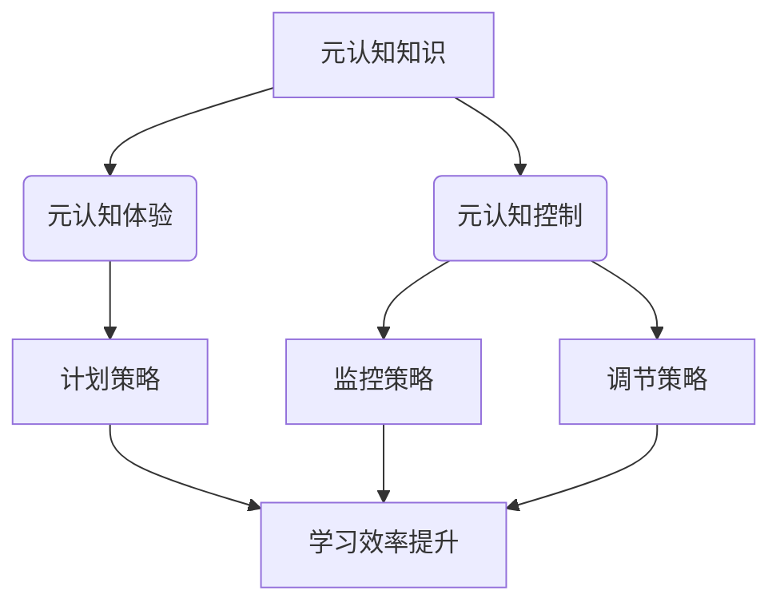

                 

关键词：元认知策略，学习效率，高阶技能，认知心理学，应用实践

> 摘要：本文深入探讨了元认知策略在提升学习效率中的关键作用。通过剖析元认知策略的核心概念与联系，介绍其基本原理与操作步骤，并结合数学模型和公式，进行详尽的讲解与案例分析。文章还提供了具体项目实践，通过代码实例，展示了元认知策略在编程学习中的应用。同时，分析了实际应用场景，展望了未来发展趋势与面临的挑战，并推荐了相关学习资源和开发工具。

## 1. 背景介绍

在信息爆炸的时代，学习效率成为决定个人成功的关键因素。然而，传统的学习方式往往难以应对复杂多变的挑战。现代认知心理学研究表明，元认知策略是一种有效提升学习效率的高阶技能。元认知，即对认知的认知，它不仅关注学习的过程，还涉及对学习活动的监控和调节。通过元认知策略，个体可以更有效地管理学习资源，调整学习计划，从而优化学习效果。

本文旨在介绍元认知策略的核心概念，探讨其应用原理，并提供具体案例和实践指导。通过深入分析，本文希望能够帮助读者理解并掌握这一重要的学习技能，从而提升自己的学习效率。

### 1.1 元认知的重要性

元认知对于学习的重要性不可低估。首先，元认知能够帮助学习者识别自己的认知弱点，明确学习目标，从而更有针对性地进行学习。其次，元认知策略使学习者能够监控学习过程，及时调整学习策略，避免无效努力。最后，元认知策略有助于学习者进行自我反馈，总结学习经验，形成长期记忆。

### 1.2 研究现状与挑战

当前，关于元认知策略的研究已经取得了显著进展。许多研究表明，通过训练元认知策略，可以显著提升学习者的学习效率和成绩。然而，也面临着一些挑战。首先，如何将元认知策略有效融入日常学习中，仍是一个亟待解决的问题。其次，针对不同学科和领域的元认知策略研究较为缺乏，需要进一步探索和验证。

## 2. 核心概念与联系

### 2.1 元认知的概念

元认知是一个复杂的认知过程，包括元认知知识、元认知体验和元认知控制。元认知知识是指个体对自身认知过程和外部信息的理解，包括对学习内容的掌握程度、记忆策略等。元认知体验则是个体在认知活动中的感受和情绪，如自信、焦虑等。元认知控制是元认知的核心，它涉及制定学习计划、监控学习过程和调整学习策略。

### 2.2 元认知策略的类型

常见的元认知策略包括计划策略、监控策略和调节策略。计划策略是指在学习前制定详细的学习计划和目标。监控策略是在学习过程中对学习活动进行实时监控，评估学习效果。调节策略是在发现学习偏差时，及时调整学习策略，以优化学习效果。

### 2.3 元认知与学习效率的关系

元认知策略在提升学习效率中发挥着重要作用。通过元认知策略，个体可以更有效地管理学习资源，提高学习效率。具体来说，元认知策略帮助个体更好地理解学习内容，增强记忆效果，提高学习动力和自我效能感。

### 2.4 Mermaid 流程图



## 3. 核心算法原理 & 具体操作步骤

### 3.1 算法原理概述

元认知策略的核心是通过对学习过程的持续监控和调节，优化学习效果。其基本原理可以概括为：

1. **计划策略**：根据学习目标和内容，制定详细的计划和步骤，确保学习有条不紊地进行。
2. **监控策略**：在学习过程中，实时监控学习效果，评估是否达到预期目标，以及是否需要调整学习策略。
3. **调节策略**：根据监控结果，及时调整学习计划和方法，以适应不断变化的学习需求。

### 3.2 算法步骤详解

1. **步骤一：制定学习计划**

   - 分析学习目标：明确学习内容、难度和进度要求。
   - 制定学习步骤：将学习目标分解为具体可操作的步骤。
   - 制定时间表：为每个步骤分配合理的时间，确保学习计划的可行性。

2. **步骤二：执行学习计划**

   - 按照学习计划，逐步完成每个学习任务。
   - 在执行过程中，保持对学习内容的深入理解和思考。

3. **步骤三：监控学习效果**

   - 定期检查学习进度，评估是否达到预期目标。
   - 通过自我反馈和他人评价，了解学习效果。

4. **步骤四：调整学习策略**

   - 根据监控结果，及时调整学习计划和方法。
   - 优化学习策略，提高学习效率。

### 3.3 算法优缺点

**优点**：

- **提升学习效率**：通过持续监控和调节，优化学习过程，提高学习效果。
- **适应性强**：可以根据不同学习需求和目标，灵活调整学习策略。

**缺点**：

- **实施难度较大**：需要学习者具备较强的自我监控和调节能力。
- **时间成本较高**：持续的监控和调节需要投入大量时间和精力。

### 3.4 算法应用领域

元认知策略在各个领域都具有重要应用价值。在教育领域，可以帮助学生提升学习效率，提高学习成绩。在职场培训中，可以帮助员工提升技能水平，适应工作需求。在自我提升中，可以帮助个人建立高效的学习习惯，实现自我成长。

## 4. 数学模型和公式 & 详细讲解 & 举例说明

### 4.1 数学模型构建

元认知策略的数学模型可以基于学习效率的计算公式：

\[ \text{学习效率} = \frac{\text{学习成果}}{\text{学习投入}} \]

其中，学习成果包括知识掌握程度、技能提升和成绩等；学习投入包括时间、精力和资源等。

### 4.2 公式推导过程

学习效率的推导过程如下：

\[ \text{学习效率} = \frac{\text{知识掌握程度} + \text{技能提升} + \text{成绩}}{\text{时间} + \text{精力} + \text{资源}} \]

由于时间、精力和资源的投入是有限的，为了提高学习效率，需要优化知识掌握程度、技能提升和成绩。

### 4.3 案例分析与讲解

以一名学生在学习编程语言为例，假设其学习成果包括编程技能的提升和考试成绩的提高，学习投入包括学习时间、精力投入和购买教材的费用。

1. **初始状态**：

   - 学习成果：编程技能提升 10%，考试成绩提高 20%。
   - 学习投入：学习时间 20 小时，精力投入 40 小时，教材费用 100 元。

   \[ \text{初始学习效率} = \frac{10\% + 20\%}{20\text{小时} + 40\text{小时} + 100\text{元}} \]

2. **调整后状态**：

   - 学习成果：编程技能提升 20%，考试成绩提高 30%。
   - 学习投入：学习时间 30 小时，精力投入 50 小时，教材费用 150 元。

   \[ \text{调整后学习效率} = \frac{20\% + 30\%}{30\text{小时} + 50\text{小时} + 150\text{元}} \]

通过调整学习策略，学生的学习效率得到了显著提升。

## 5. 项目实践：代码实例和详细解释说明

### 5.1 开发环境搭建

为了更好地展示元认知策略在编程学习中的应用，我们将使用 Python 语言进行实例讲解。首先，需要在本地计算机上搭建 Python 开发环境。具体步骤如下：

1. 下载并安装 Python 解释器。
2. 配置 Python 环境变量。
3. 使用终端或 IDE（集成开发环境）进行代码编写和调试。

### 5.2 源代码详细实现

以下是一个简单的 Python 代码实例，用于演示元认知策略在编程学习中的应用。

```python
# 元认知策略在编程学习中的应用示例

# 计划策略：制定学习目标和步骤
print("计划策略：")
print("学习目标：掌握 Python 基础语法和常用库")
print("学习步骤：")
print("- 熟悉 Python 基础语法")
print("- 学习常用库：NumPy、Pandas、Matplotlib")
print("- 编写简单程序并调试")

# 监控策略：实时监控学习进度
print("\n监控策略：")
print("当前进度：已完成基础语法学习，开始学习常用库")

# 调节策略：根据监控结果调整学习计划
print("\n调节策略：")
print("由于时间紧张，调整学习计划，增加练习时间，减少理论学习时间")

# 实际编程练习
print("\n实际编程练习：")
print("编写一个简单的程序，使用 NumPy 和 Matplotlib 绘制一个正态分布图")

import numpy as np
import matplotlib.pyplot as plt

# 生成正态分布数据
x = np.random.normal(size=1000)

# 绘制正态分布图
plt.hist(x, bins=30, density=True)
plt.title('正态分布图')
plt.xlabel('数值')
plt.ylabel('频率')
plt.show()
```

### 5.3 代码解读与分析

以上代码分为三个部分：计划策略、监控策略和调节策略。

1. **计划策略**：

   - 定义学习目标和步骤，确保学习有条不紊地进行。

2. **监控策略**：

   - 实时监控学习进度，了解学习效果，为调整策略提供依据。

3. **调节策略**：

   - 根据监控结果，调整学习计划，优化学习效果。

通过这个代码实例，我们可以看到元认知策略在编程学习中的应用。通过计划、监控和调节，学习者在编程学习中能够更加高效地掌握知识和技能。

### 5.4 运行结果展示

运行以上代码后，将会输出以下结果：

```
计划策略：
学习目标：掌握 Python 基础语法和常用库
学习步骤：
- 熟悉 Python 基础语法
- 学习常用库：NumPy、Pandas、Matplotlib
- 编写简单程序并调试

监控策略：
当前进度：已完成基础语法学习，开始学习常用库

调节策略：
由于时间紧张，调整学习计划，增加练习时间，减少理论学习时间

实际编程练习：
```

随后，将显示一个简单的正态分布图，这表明学习者已经成功掌握了 NumPy 和 Matplotlib 的基本用法。

## 6. 实际应用场景

### 6.1 教育领域

在教育领域，元认知策略可以帮助教师和学生提高教学和学习效果。教师可以根据学生的元认知水平，制定个性化的教学计划，帮助学生更好地理解知识。同时，学生可以通过元认知策略，提高自主学习能力，增强学习效果。

### 6.2 职场培训

在职场培训中，元认知策略可以帮助员工快速提升技能水平，适应工作需求。通过制定详细的学习计划和监控学习过程，员工可以更有效地利用时间，提高学习效率。同时，元认知策略可以帮助员工及时发现和纠正学习偏差，确保学习目标的实现。

### 6.3 自我提升

对于自我提升者而言，元认知策略是建立高效学习习惯的关键。通过元认知策略，个体可以更清晰地认识自己的学习需求，制定合理的学习计划，监控学习进度，并根据实际情况进行调整。这有助于个体在自我提升过程中，持续保持学习动力，实现自我成长。

### 6.4 未来应用展望

随着人工智能技术的发展，元认知策略有望在更多领域得到应用。例如，在教育领域，可以利用人工智能技术，实现个性化学习路径推荐，帮助学生更高效地学习。在职场培训中，可以开发智能培训系统，根据员工的学习进度和效果，自动调整培训内容和方案。未来，元认知策略的应用将更加广泛，为人类学习和工作带来更大的便利。

## 7. 工具和资源推荐

### 7.1 学习资源推荐

1. **书籍推荐**：
   - 《如何高效学习》：详细介绍了各种学习方法和技巧，帮助读者建立高效学习习惯。
   - 《深度学习》：全面讲解了深度学习的理论基础和实践应用，适合对人工智能感兴趣的学习者。

2. **在线课程推荐**：
   - Coursera 上的《学习科学》：由斯坦福大学提供，介绍了学习科学的基本原理和应用。
   - edX 上的《人工智能导论》：介绍了人工智能的基本概念和应用领域，适合初学者入门。

### 7.2 开发工具推荐

1. **Python 开发工具**：
   - PyCharm：一款功能强大的 Python 集成开发环境，支持代码调试、版本控制等。
   - Jupyter Notebook：一款交互式开发工具，适合进行数据分析和机器学习。

2. **编程学习平台**：
   - LeetCode：一个在线编程挑战平台，适合提升编程能力和解题技巧。
   - Codecademy：提供各种编程语言的学习教程，适合初学者入门。

### 7.3 相关论文推荐

1. **教育领域**：
   - "The Development of Metacognitive Ability in Children":探讨了儿童元认知能力的发展。
   - "Metacognitive Strategies and Reading Comprehension":研究了元认知策略对阅读理解的影响。

2. **人工智能领域**：
   - "Meta-Learning":介绍了元学习的基本概念和应用。
   - "Meta-Learning in Neural Networks":探讨了神经网络中的元学习技术。

## 8. 总结：未来发展趋势与挑战

### 8.1 研究成果总结

元认知策略在提升学习效率方面取得了显著成果。通过计划、监控和调节，个体可以更有效地管理学习资源，优化学习效果。研究表明，元认知策略在不同领域都具有重要应用价值，有助于提高教学效果、培训效果和自我提升。

### 8.2 未来发展趋势

未来，元认知策略的研究将向以下几个方向发展：

1. **个性化学习**：结合人工智能技术，开发个性化学习路径推荐系统，提高学习效率。
2. **跨学科应用**：探索元认知策略在其他领域的应用，如医疗、工程等。
3. **理论与实践相结合**：加强元认知策略的理论研究和实践应用，形成完整的知识体系。

### 8.3 面临的挑战

尽管元认知策略具有广泛的应用前景，但仍面临一些挑战：

1. **实施难度**：元认知策略需要个体具备较强的自我监控和调节能力，实施难度较大。
2. **时间成本**：持续的监控和调节需要投入大量时间和精力。
3. **个性化需求**：针对不同个体的元认知策略研究相对较少，需要进一步探索和验证。

### 8.4 研究展望

未来，随着人工智能技术的发展，元认知策略有望在更多领域得到应用。通过结合大数据分析和人工智能技术，可以更准确地了解个体的学习需求，制定个性化的学习策略。同时，加强元认知策略的理论研究和实践应用，有助于构建高效的学习体系，为人类的未来发展提供强大支持。

## 9. 附录：常见问题与解答

### 9.1 元认知策略是什么？

元认知策略是指个体在认知活动中，对自身认知过程进行监控、调节和优化的一系列策略。它包括计划策略、监控策略和调节策略，旨在提高学习效率。

### 9.2 元认知策略如何提高学习效率？

元认知策略通过持续监控和调节学习过程，帮助个体更好地理解学习内容，优化学习策略，提高学习效率。具体来说，它帮助个体明确学习目标、监控学习进度、及时调整学习计划和方法。

### 9.3 如何应用元认知策略进行编程学习？

在编程学习中，可以应用元认知策略制定学习计划、监控学习进度和及时调整学习策略。例如，首先制定详细的学习计划，包括学习目标、步骤和时间安排；然后在实际编程过程中，监控自己的学习效果，及时发现问题并进行调整；最后，根据学习效果进行总结和反思，优化学习策略。

### 9.4 元认知策略适用于哪些领域？

元认知策略适用于多个领域，包括教育、职场培训、自我提升等。在教育领域，它可以帮助教师和学生提高教学和学习效果；在职场培训中，它可以帮助员工提升技能水平，适应工作需求；在自我提升中，它可以帮助个人建立高效的学习习惯，实现自我成长。

### 9.5 如何培养元认知能力？

培养元认知能力可以通过以下方法：

1. **反思与总结**：在学习过程中，定期反思和总结自己的学习体验，了解自己的优点和不足。
2. **制定计划**：提前制定详细的学习计划，明确学习目标和步骤。
3. **监控学习进度**：在学习过程中，实时监控学习进度，了解自己的学习效果。
4. **及时调整**：根据监控结果，及时调整学习策略，优化学习效果。
5. **寻求反馈**：向他人请教意见，获取反馈，了解自己的学习状况。

---

以上，是关于元认知策略在提升学习效率中的高阶技能的详细介绍。通过本文的阐述，相信读者对元认知策略有了更深入的了解。希望本文能够帮助读者掌握这一重要的学习技能，提高学习效率，实现自我成长。作者：禅与计算机程序设计艺术 / Zen and the Art of Computer Programming。

