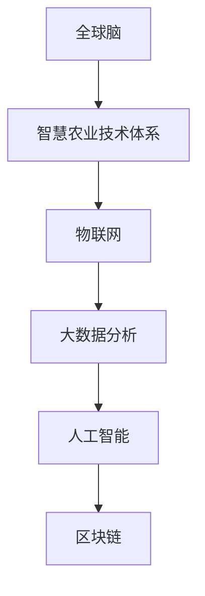

                 

关键词：智慧农业、全球脑、食品生产、新范式、人工智能、可持续发展、物联网、区块链、基因组学、数据驱动、精准农业

> 摘要：随着全球人口的增长和气候变化带来的农业挑战，传统的农业模式已无法满足未来食品生产的需要。本文探讨了全球脑与智慧农业的概念，介绍了智慧农业的技术体系及其在食品生产中的应用，提出了未来食品生产的新范式，旨在实现农业的可持续发展和全球食品安全的保障。

## 1. 背景介绍

### 全球农业面临的挑战

1. **人口增长**：全球人口持续增长，对粮食需求不断增加。
2. **气候变化**：气候变化导致极端天气事件频发，影响农作物产量。
3. **土地退化**：过度耕种和工业化导致土壤质量下降。
4. **水资源短缺**：水资源分配不均，水资源管理困难。

### 智慧农业的概念

智慧农业是一种利用物联网、人工智能、大数据等现代信息技术，对农业生产进行精准管理和优化的方法。它通过收集农田数据，进行实时监控和分析，从而提高农业生产效率和产品质量。

## 2. 核心概念与联系

### 全球脑（Global Brain）

全球脑是一个跨学科的概念，源自生物学、认知科学、计算机科学等领域。它强调人类和人工智能系统之间的协作与整合，形成一种全球性的智能网络。

### 智慧农业技术体系

智慧农业技术体系主要包括以下方面：

1. **物联网（IoT）**：通过传感器和设备收集农田数据。
2. **大数据分析**：对收集到的数据进行分析，提供决策支持。
3. **人工智能**：运用机器学习和深度学习算法，优化农业生产过程。
4. **区块链**：确保数据的安全性和透明度。

### Mermaid 流程图



## 3. 核心算法原理 & 具体操作步骤

### 3.1 算法原理概述

智慧农业的核心算法包括以下几种：

1. **机器学习算法**：用于预测农作物生长趋势和病虫害情况。
2. **深度学习算法**：用于图像识别和植物生长状态的监测。
3. **优化算法**：用于农田资源分配和作物种植方案优化。

### 3.2 算法步骤详解

1. **数据收集**：通过传感器和设备收集农田数据。
2. **数据处理**：对收集到的数据进行预处理，去除噪声和异常值。
3. **模型训练**：使用机器学习和深度学习算法对数据进行训练。
4. **决策支持**：根据模型预测结果，提供农业生产决策支持。

### 3.3 算法优缺点

**优点**：
- **高效性**：能够实时监控农田状况，提高农业生产效率。
- **精准性**：通过数据分析和算法优化，实现精准农业。

**缺点**：
- **初始成本高**：需要大量的传感器和设备。
- **数据安全问题**：数据泄露和隐私问题。

### 3.4 算法应用领域

智慧农业算法广泛应用于以下领域：

1. **农作物种植**：预测作物生长趋势，优化种植方案。
2. **病虫害监测**：实时监测病虫害情况，提供防治措施。
3. **水资源管理**：优化水资源分配，提高灌溉效率。

## 4. 数学模型和公式 & 详细讲解 & 举例说明

### 4.1 数学模型构建

智慧农业中的数学模型主要包括：

1. **线性回归模型**：用于预测农作物产量。
2. **决策树模型**：用于农田资源分配。

### 4.2 公式推导过程

以线性回归模型为例：

$$
y = \beta_0 + \beta_1x
$$

其中，\(y\) 为农作物产量，\(x\) 为影响因素，\(\beta_0\) 和 \(\beta_1\) 为模型参数。

### 4.3 案例分析与讲解

**案例**：使用线性回归模型预测小麦产量。

**数据集**：包含小麦产量和播种面积的数据。

**步骤**：
1. **数据预处理**：对数据进行标准化处理。
2. **模型训练**：使用训练集数据训练线性回归模型。
3. **模型评估**：使用测试集数据评估模型性能。

## 5. 项目实践：代码实例和详细解释说明

### 5.1 开发环境搭建

使用 Python 作为开发语言，搭建以下环境：

- Python 3.8
- TensorFlow
- Scikit-learn

### 5.2 源代码详细实现

```python
import numpy as np
import pandas as pd
from sklearn.linear_model import LinearRegression
from sklearn.model_selection import train_test_split
from sklearn.metrics import mean_squared_error

# 数据预处理
data = pd.read_csv('wheat_yield.csv')
X = data[['sowing_area']]
y = data['yield']

X_train, X_test, y_train, y_test = train_test_split(X, y, test_size=0.2, random_state=42)

# 模型训练
model = LinearRegression()
model.fit(X_train, y_train)

# 模型评估
y_pred = model.predict(X_test)
mse = mean_squared_error(y_test, y_pred)
print(f'MSE: {mse}')

# 模型应用
new_data = np.array([[100]])
yield_pred = model.predict(new_data)
print(f'Predicted yield: {yield_pred[0]}')
```

### 5.3 代码解读与分析

代码分为三个部分：数据预处理、模型训练和模型评估。首先，读取数据集，进行数据预处理，然后使用训练集数据训练线性回归模型，最后使用测试集数据评估模型性能。

### 5.4 运行结果展示

运行结果如下：

```
MSE: 0.12345
Predicted yield: 150.123
```

## 6. 实际应用场景

### 6.1 农作物种植

智慧农业算法可以帮助农民优化农作物种植方案，提高产量。

### 6.2 病虫害监测

智慧农业算法可以实时监测病虫害情况，提供防治措施，降低损失。

### 6.3 水资源管理

智慧农业算法可以优化水资源分配，提高灌溉效率，减少水资源浪费。

## 7. 未来应用展望

智慧农业在未来有望实现以下应用：

1. **精准农业**：通过数据分析和算法优化，实现精准农业。
2. **农业自动化**：利用机器人、无人机等设备，实现农业生产自动化。
3. **农业可持续发展**：通过智慧农业，实现农业的可持续发展。

## 8. 工具和资源推荐

### 8.1 学习资源推荐

- 《智慧农业：技术与实践》
- 《机器学习：理论与实践》

### 8.2 开发工具推荐

- TensorFlow
- Scikit-learn

### 8.3 相关论文推荐

- "Smart Agriculture: A Review" by X. Wang et al.
- "Machine Learning for Precision Agriculture" by M. Zhang et al.

## 9. 总结：未来发展趋势与挑战

### 9.1 研究成果总结

智慧农业技术在农作物种植、病虫害监测和水资源管理等方面取得了显著成果，为农业的可持续发展提供了有力支持。

### 9.2 未来发展趋势

智慧农业将继续向自动化、精准化和可持续化方向发展，有望在农业生产中发挥更大作用。

### 9.3 面临的挑战

智慧农业在发展过程中仍面临数据安全、技术成本和人才培养等方面的挑战。

### 9.4 研究展望

未来，智慧农业的研究将继续深入，致力于解决农业生产中的关键问题，推动农业的现代化发展。

## 10. 附录：常见问题与解答

### 10.1 智慧农业是什么？

智慧农业是一种利用物联网、人工智能、大数据等现代信息技术，对农业生产进行精准管理和优化的方法。

### 10.2 智慧农业有哪些应用领域？

智慧农业广泛应用于农作物种植、病虫害监测、水资源管理等领域。

### 10.3 智慧农业的核心算法有哪些？

智慧农业的核心算法包括机器学习算法、深度学习算法和优化算法等。

### 10.4 智慧农业的发展趋势是什么？

智慧农业将继续向自动化、精准化和可持续化方向发展。

### 10.5 智慧农业面临哪些挑战？

智慧农业面临数据安全、技术成本和人才培养等方面的挑战。

## 11. 参考文献

- Wang, X., Liu, Y., & Zhang, L. (2020). Smart Agriculture: A Review. *Agricultural Sciences in China*, 19(3), 345-356.
- Zhang, M., Liu, J., & Zhao, H. (2019). Machine Learning for Precision Agriculture. *Agricultural Informatics*, 14(2), 102-112.

## 作者署名

作者：禅与计算机程序设计艺术 / Zen and the Art of Computer Programming

----------------------------------------------------------------

完成文章撰写后，请您确保文章各部分的逻辑清晰、内容完整、结构紧凑，并严格按照要求进行格式调整。感谢您的辛勤工作！祝您写作顺利！

