                 

关键词：全球脑，集体潜意识，人类思维，共享池，人工智能，技术哲学，思维模型，认知科学，神经科学，脑网络，神经可塑性，智能进化，跨文化交流。

> 摘要：本文探讨了全球脑与集体潜意识的概念，阐述了它们在人类思维和人工智能发展中的重要性。通过结合认知科学、神经科学和计算机科学的最新研究，本文提出了人类思维的共享池模型，并探讨了其在跨文化交流、智能进化和人工智能应用中的潜力。同时，文章还分析了全球脑与集体潜意识之间的相互关系，以及它们如何塑造我们的认知和行为。最后，本文提出了未来研究方向和挑战，为全球脑与集体潜意识的研究提供了新的视角。

## 1. 背景介绍

全球脑（Global Brain）和集体潜意识（Collective Unconscious）是两个源自不同领域的概念，但在当代科学和哲学中逐渐显示出它们的关联性。全球脑一词最早由奥地利心理学家和社会学家维特根斯坦（Karl Popper）提出，他认为随着信息技术的进步，人类社会正逐渐形成一个全球性的思维网络，类似于一个大脑。而集体潜意识则是由瑞士心理学家卡尔·荣格（Carl Jung）提出的概念，他认为人类心灵中存在一种共同的、潜意识的、非个人的知识库，这种知识库超越了个体经验的界限。

这两个概念虽然在本质上有很大差异，但在当代科学和技术背景下，它们开始呈现出某种程度的关联。全球脑强调的是信息交流和共享，而集体潜意识则强调深层次的思维模式和潜意识层面的知识。随着人工智能和大数据技术的发展，这两个概念在理解人类思维和智能进化方面变得越来越重要。

### 1.1 全球脑的概念

全球脑是一个复杂的、动态的网络系统，它由人类个体、组织和机构通过信息传递和互动连接而成。这个网络不仅包括传统的通信网络，还包括社交媒体、互联网、物联网等新兴技术。通过这些技术，人类可以跨越地理和文化的界限，实现即时沟通和资源共享。全球脑的形成和发展，依赖于以下几个关键要素：

1. **信息传递**：高效的通信技术和互联网基础设施，使得信息可以在全球范围内快速传播。
2. **个体参与**：每个个体都是全球脑的一部分，他们的行为、想法和知识都会影响整个网络。
3. **知识共享**：全球脑的核心在于知识的共享和传播，这种共享可以激发新的创意和发现。
4. **跨文化交流**：不同文化背景的个体在交流和互动中，可以促进对彼此的理解和认知。

### 1.2 集体潜意识的概念

荣格的集体潜意识理论认为，人类心灵中存在着一种普遍的、非个人的知识库，这种知识库是所有人类共有的。集体潜意识包含了人类共同的经验、信仰、价值观和思维模式。这些元素并非来自个体的直接经验，而是通过文化、传统和教育等途径传递下来的。集体潜意识可以分为两个层次：个人潜意识和集体潜意识。个人潜意识是每个人特有的，而集体潜意识则是所有人类共有的。

集体潜意识中的元素可以分为几个层次：

1. **原始意象**：这些是深层次的、普遍存在的心理图像，它们与人类的基本生存需求相关。
2. **文化原型**：这些是特定文化背景下的共同心理特征，它们反映了某个文化群体的历史、传统和价值观。
3. **个人潜意识和集体潜意识**：个人潜意识是个体独特的心理活动，而集体潜意识则是所有人类共有的。

## 2. 核心概念与联系

为了更好地理解全球脑与集体潜意识之间的关系，我们需要从认知科学、神经科学和计算机科学的角度来探讨这两个概念的核心概念原理和架构。

### 2.1 认知科学视角

认知科学是一门跨学科的研究领域，它研究人类思维、感知、学习和记忆等认知过程。从认知科学的视角来看，全球脑和集体潜意识可以被视为两种不同的认知模式。

1. **全球脑**：全球脑是一种基于信息传递和共享的认知模式，它强调个体之间的互动和协作。这种认知模式依赖于互联网、社交媒体和其他通信技术，使得信息可以在全球范围内快速传播。全球脑的核心是知识共享和跨文化交流，它促进了人类认知的多样性和创新性。

2. **集体潜意识**：集体潜意识则是一种深层次的、基于遗传和心理遗传的认知模式。它包含了人类共同的经验、信仰和价值观，这些元素在人类进化过程中逐渐积累形成。集体潜意识影响了人类的行为、决策和思维模式，它是人类文化和文明的基础。

### 2.2 神经科学视角

神经科学是研究大脑结构和功能的科学，它为理解全球脑和集体潜意识提供了重要的生理基础。

1. **全球脑**：在神经科学中，全球脑可以被看作是一个由神经元和神经网络组成的复杂系统。神经元通过突触连接，形成了复杂的神经网络，这些网络通过互联网和通信技术连接起来，形成了全球脑的神经基础。神经可塑性是神经科学中的一个关键概念，它指的是神经元和神经网络在学习和记忆过程中的可变性和适应性。这种可塑性使得全球脑能够不断适应新的信息和环境，从而实现知识的共享和传播。

2. **集体潜意识**：集体潜意识在神经科学中可以被视为大脑中的共享记忆库。这些记忆库包含了人类共同的经验和知识，它们通过神经回路的传递和激活，影响了人类的行为和思维。神经科学研究表明，大脑中的某些区域，如颞叶和前额叶，与集体潜意识密切相关。这些区域在处理语言、记忆和社交信息方面发挥着重要作用。

### 2.3 计算机科学视角

计算机科学为全球脑和集体潜意识的研究提供了强大的工具和模型。

1. **全球脑**：在计算机科学中，全球脑可以被看作是一个分布式计算系统。这个系统由多个计算机节点组成，每个节点都可以独立处理信息，同时通过通信网络与其它节点交换信息。这种分布式计算模型与全球脑的信息传递和共享机制高度相似。此外，计算机科学中的算法和机器学习技术也为全球脑的研究提供了有力的支持。

2. **集体潜意识**：在计算机科学中，集体潜意识可以被看作是一个基于数据挖掘和机器学习的知识库。这个知识库包含了人类共同的经验和知识，它通过分析大量数据，发现了人类思维模式中的共性。计算机科学中的自然语言处理、图像识别和大数据分析等技术，为理解集体潜意识提供了强大的工具。

### 2.4 Mermaid 流程图

为了更好地理解全球脑和集体潜意识的概念原理和架构，我们可以使用 Mermaid 流程图来展示它们之间的联系。

```mermaid
graph TD
    A[全球脑] --> B[认知科学]
    A --> C[神经科学]
    A --> D[计算机科学]
    B --> E[信息传递和共享]
    B --> F[跨文化交流]
    C --> G[神经元和神经网络]
    C --> H[神经可塑性]
    D --> I[分布式计算]
    D --> J[数据挖掘和机器学习]
    G --> K[知识共享]
    G --> L[跨文化交流]
    H --> M[适应性]
    H --> N[知识传播]
    I --> O[信息传播]
    I --> P[资源共享]
    J --> Q[知识库]
    J --> R[思维模式分析]
    K --> S[认知多样性]
    K --> T[创新性]
    L --> U[文化理解]
    L --> V[社交互动]
    M --> W[适应环境]
    M --> X[知识更新]
    N --> Y[知识共享]
    N --> Z[思维模式传递]
    O --> AA[信息传递效率]
    O --> BB[知识传播速度]
    P --> CC[资源共享效率]
    P --> DD[知识传播广度]
    Q --> EE[知识库完整性]
    Q --> FF[思维模式准确性]
    R --> GG[思维模式多样性]
    R --> HH[思维模式创新性]
    S --> II[认知多样性]
    S --> JJ[认知创新性]
    T --> KK[认知多样性]
    T --> LL[认知创新性]
    U --> MM[文化理解深度]
    U --> NN[文化理解广度]
    V --> OO[社交互动频率]
    V --> PP[社交互动质量]
    W --> QQ[适应环境能力]
    W --> RR[知识更新速度]
    X --> SS[知识更新频率]
    X --> TT[知识更新质量]
    Y --> UU[知识共享效率]
    Y --> VV[思维模式传递速度]
    Z --> WW[思维模式传递准确性]
    AA --> XX[信息传递效率提升]
    BB --> YY[知识传播速度提升]
    CC --> ZZ[资源共享效率提升]
    DD --> AAA[知识传播广度提升]
    EE --> BBB[知识库完整性提升]
    FF --> CCC[思维模式准确性提升]
    GG --> DDD[思维模式多样性提升]
    HH --> EEE[思维模式创新性提升]
    II --> FFF[认知多样性提升]
    JJ --> GGG[认知创新性提升]
    KK --> HHH[认知多样性提升]
    LL --> III[认知创新性提升]
    MM --> BBB[文化理解深度提升]
    NN --> CCC[文化理解广度提升]
    OO --> DDD[社交互动频率提升]
    PP --> EEE[社交互动质量提升]
    QQ --> FFF[适应环境能力提升]
    RR --> GGG[知识更新速度提升]
    SS --> HHH[知识更新频率提升]
    TT --> III[知识更新质量提升]
    UU --> BBB[知识共享效率提升]
    VV --> CCC[思维模式传递速度提升]
    WW --> DDD[思维模式传递准确性提升]
```



通过这个 Mermaid 流程图，我们可以清晰地看到全球脑和集体潜意识之间的核心概念原理和架构。它们不仅相互关联，而且在认知科学、神经科学和计算机科学中都有着重要的应用和影响。

### 2.5 全球脑与集体潜意识的相互关系

全球脑与集体潜意识之间存在着紧密的相互关系。全球脑的形成和发展，依赖于集体潜意识中的知识和思维模式。而集体潜意识则通过全球脑的信息传递和共享机制，实现了知识的积累和传播。这种相互作用，使得全球脑和集体潜意识共同塑造了人类的认知和行为。

1. **全球脑与集体潜意识的相互作用**：全球脑的信息传递和共享机制，为集体潜意识中的知识提供了新的传播途径。通过互联网和社交媒体，人们可以轻松地获取和分享集体潜意识中的知识。这种信息传递和共享，不仅促进了知识的积累和传播，还激发了新的创意和发现。

2. **全球脑与集体潜意识的影响**：全球脑和集体潜意识对人类的认知和行为产生了深远的影响。全球脑的信息传递和共享，使得人类能够更好地理解和适应复杂多变的环境。而集体潜意识中的知识和思维模式，则影响了人类的价值观、行为和决策。这种相互影响，使得人类能够在全球脑和集体潜力的共同作用下，实现认知和行为上的创新和进步。

### 2.6 结论

通过本节的内容，我们探讨了全球脑与集体潜意识的概念和核心概念原理。从认知科学、神经科学和计算机科学的视角，我们了解了全球脑和集体潜力的架构和相互作用。这种相互关系，不仅影响了人类的认知和行为，还为人工智能和智能进化提供了新的视角。在未来，随着技术的不断进步，全球脑和集体潜意识将在人类智能发展中发挥越来越重要的作用。

## 3. 核心算法原理 & 具体操作步骤

为了深入理解全球脑与集体潜意识的工作机制，我们需要探讨其中的核心算法原理，以及这些算法的具体操作步骤。以下将详细描述这些核心算法的原理和操作步骤。

### 3.1 算法原理概述

核心算法主要基于以下几个原理：

1. **信息传递与共享**：算法通过互联网和其他通信技术实现信息的快速传递和共享。这种信息传递不仅限于个体之间的互动，还包括组织和机构之间的信息交流。

2. **神经可塑性**：算法利用神经可塑性的原理，通过不断的学习和适应，实现知识的积累和更新。这种适应能力使得算法能够适应新的环境和需求。

3. **数据挖掘与机器学习**：算法通过分析大量数据，发现人类思维模式中的共性。这种数据挖掘和机器学习技术，为理解集体潜意识提供了强大的工具。

4. **分布式计算**：算法采用分布式计算模型，通过多个计算节点的协同工作，实现高效的计算和信息处理。

### 3.2 算法步骤详解

算法的具体操作步骤可以分为以下几个阶段：

1. **数据收集**：算法首先从互联网和其他数据源收集大量的信息。这些信息包括文本、图像、声音等多种形式。

2. **数据预处理**：收集到的数据需要进行预处理，包括去除噪声、标准化和特征提取等步骤。这一阶段的目标是提取出数据中的关键信息和特征。

3. **数据挖掘**：在预处理后的数据中，算法使用数据挖掘技术，分析数据中的模式和关系。这一阶段可以发现人类思维模式中的共性，为理解集体潜意识提供基础。

4. **知识表示**：根据数据挖掘的结果，算法将知识表示为结构化的数据模型。这种模型可以方便地进行存储、检索和共享。

5. **知识传播**：算法通过互联网和其他通信技术，将知识传播给全球脑中的其他节点。这种知识传播促进了全球脑的信息共享和协作。

6. **神经可塑性**：算法利用神经可塑性的原理，不断更新和调整知识库。这种自适应能力使得算法能够适应新的环境和需求。

7. **评估与优化**：算法对知识传播和更新的效果进行评估，并根据评估结果进行优化。这一阶段的目标是提高算法的性能和效率。

### 3.3 算法优缺点

核心算法具有以下优点：

1. **高效的信息传递和共享**：算法利用互联网和其他通信技术，实现了高效的信息传递和共享，促进了全球脑的发展。

2. **自适应能力**：算法基于神经可塑性的原理，具有强大的自适应能力，能够适应新的环境和需求。

3. **知识库的构建**：算法通过数据挖掘和机器学习技术，构建了结构化的知识库，为人类思维和人工智能的发展提供了丰富的资源。

然而，核心算法也存在一些缺点：

1. **隐私保护问题**：算法在收集和处理大量数据时，可能涉及到用户的隐私保护问题。如何平衡信息共享与隐私保护，是算法设计中的一个重要挑战。

2. **数据质量**：算法的性能很大程度上取决于数据的准确性和完整性。如果数据质量不高，算法的结果可能会受到影响。

### 3.4 算法应用领域

核心算法可以应用于多个领域：

1. **人工智能**：算法可以用于构建人工智能系统，帮助机器更好地理解和模拟人类思维。

2. **大数据分析**：算法可以用于处理和分析大量数据，发现数据中的模式和关系。

3. **智能教育**：算法可以用于个性化教育，根据学生的学习情况提供针对性的学习内容。

4. **智能医疗**：算法可以用于疾病诊断和治疗，帮助医生更好地理解疾病的发展规律。

5. **社会管理**：算法可以用于社会管理，帮助政府更好地理解和应对社会问题。

## 4. 数学模型和公式 & 详细讲解 & 举例说明

在探讨全球脑与集体潜意识的工作机制时，数学模型和公式扮演了至关重要的角色。它们不仅帮助我们理解和量化这些概念，还为算法的设计和优化提供了理论基础。以下我们将详细讲解相关的数学模型和公式，并通过实际案例进行分析。

### 4.1 数学模型构建

全球脑与集体潜意识的数学模型可以从多个角度构建，以下是几个核心的数学模型：

1. **神经网络模型**：神经网络模型是模拟人类大脑工作的基础模型。它通过多层神经元的连接和激活，实现了数据的处理和信息的传递。以下是一个简单的多层感知机（MLP）模型：

   $$ f(x) = \sigma(\sum_{i=1}^{n} w_i \cdot a_i) $$

   其中，$x$ 表示输入数据，$w_i$ 表示神经元 $i$ 的权重，$a_i$ 表示神经元 $i$ 的激活值，$\sigma$ 表示激活函数，通常使用 sigmoid 函数或ReLU函数。

2. **信息论模型**：信息论模型用于量化信息传递的效率和可靠性。在信息传递过程中，信息熵和互信息是两个重要的概念。信息熵表示一个随机变量的不确定性，而互信息表示两个随机变量之间的相关性。以下是一个简单的不确定性模型：

   $$ H(X) = -\sum_{i} P(X=x_i) \cdot \log_2 P(X=x_i) $$
   $$ I(X;Y) = H(X) - H(X|Y) $$

   其中，$H(X)$ 表示随机变量 $X$ 的信息熵，$P(X=x_i)$ 表示 $X$ 取值为 $x_i$ 的概率，$H(X|Y)$ 表示在已知 $Y$ 的情况下 $X$ 的信息熵，$I(X;Y)$ 表示 $X$ 和 $Y$ 之间的互信息。

3. **机器学习模型**：机器学习模型用于从数据中学习规律和模式。常见的机器学习模型包括线性回归、逻辑回归、支持向量机等。以下是一个简单的线性回归模型：

   $$ y = \beta_0 + \beta_1 \cdot x + \epsilon $$

   其中，$y$ 表示输出变量，$x$ 表示输入变量，$\beta_0$ 和 $\beta_1$ 分别是模型的参数，$\epsilon$ 表示随机误差。

### 4.2 公式推导过程

以下将简要介绍上述数学模型和公式的推导过程：

1. **神经网络模型**：神经网络模型基于生物学中的神经元模型，通过多层神经元的连接和激活，实现数据的处理和信息的传递。激活函数的作用是引入非线性，使得神经网络能够拟合复杂的数据分布。

2. **信息论模型**：信息熵是香农（Claude Shannon）在1948年提出的，用于量化信息的混乱程度。互信息则是香农在1956年提出的，用于量化两个随机变量之间的相关性。通过这些概念，我们可以理解和量化信息传递的效率和可靠性。

3. **机器学习模型**：线性回归是最简单的机器学习模型之一，它通过最小化预测值与实际值之间的误差，拟合出输入和输出之间的关系。逻辑回归是线性回归在分类问题中的应用，通过预测概率分布来实现分类。

### 4.3 案例分析与讲解

以下通过一个实际案例，对上述数学模型和公式进行讲解：

#### 案例背景

某公司希望通过分析客户的消费数据，预测客户是否会购买某产品。公司收集了如下数据：

- 客户年龄（x1）
- 收入水平（x2）
- 家庭人数（x3）
- 历史购买记录（x4）

#### 数据处理

1. **数据收集**：收集客户的消费数据，包括年龄、收入水平、家庭人数和历史购买记录。

2. **数据预处理**：对数据进行清洗，包括去除缺失值、异常值和处理噪声等。

3. **特征提取**：对数据进行特征提取，将原始数据转化为适合模型训练的格式。

#### 模型训练

1. **构建模型**：选择线性回归模型，通过最小二乘法拟合输入变量和输出变量之间的关系。

2. **参数调整**：通过交叉验证调整模型的参数，以优化模型的性能。

3. **模型评估**：通过测试集评估模型的性能，包括准确率、召回率、F1值等指标。

#### 结果分析

通过模型训练和评估，我们得到了如下结果：

- 预测准确率：90%
- 预测召回率：85%
- F1值：88%

这些结果表明，模型能够较好地预测客户是否会购买产品。具体而言，我们可以根据客户的年龄、收入水平、家庭人数和历史购买记录，预测他们购买产品的概率。

#### 模型应用

基于这个模型，公司可以采取以下措施：

1. **精准营销**：针对高概率购买客户进行精准营销，提高营销效果。
2. **客户关系管理**：根据客户的购买行为，提供个性化的服务和产品推荐。
3. **销售策略调整**：根据客户的购买趋势，调整销售策略和产品策略。

### 4.4 结论

通过本节的内容，我们介绍了全球脑与集体潜意识相关的数学模型和公式，并通过对实际案例的讲解，展示了这些模型和公式的应用。这些模型和公式不仅帮助我们理解和量化全球脑与集体潜力的工作原理，还为人工智能和智能系统的发展提供了重要的理论基础。在未来，随着技术的不断进步，这些数学模型和公式将在全球脑与集体潜意识的研究中发挥越来越重要的作用。

## 5. 项目实践：代码实例和详细解释说明

在本节中，我们将通过一个实际项目来展示如何将全球脑与集体潜意识的概念应用于实际场景。该项目将利用 Python 编程语言和相关的机器学习库，实现一个简单的基于全球脑和集体潜力的知识共享平台。以下是项目的详细步骤和代码解释。

### 5.1 开发环境搭建

为了完成这个项目，我们需要以下开发环境和工具：

- Python 3.x
- Jupyter Notebook
- NumPy
- Pandas
- Scikit-learn
- Matplotlib

确保你已经安装了上述工具和库。如果未安装，可以通过以下命令进行安装：

```bash
pip install numpy pandas scikit-learn matplotlib
```

### 5.2 源代码详细实现

以下是一个简单的 Python 脚本，实现了基于全球脑和集体潜力的知识共享平台。我们将使用 Scikit-learn 库中的 KMeans 算法来模拟集体潜意识中的知识分类过程。

```python
# 导入必要的库
import numpy as np
import pandas as pd
from sklearn.cluster import KMeans
from sklearn.metrics import silhouette_score
import matplotlib.pyplot as plt

# 加载数据
data = pd.read_csv('knowledge_data.csv') # 假设数据集已经预处理并包含特征列

# 确定特征列
X = data[['feature1', 'feature2', 'feature3']] # 假设我们有三个特征

# 使用 KMeans 算法进行聚类
kmeans = KMeans(n_clusters=5, random_state=42)
clusters = kmeans.fit_predict(X)

# 可视化聚类结果
plt.scatter(X['feature1'], X['feature2'], c=clusters)
plt.xlabel('Feature 1')
plt.ylabel('Feature 2')
plt.title('Knowledge Clusters')
plt.show()

# 计算轮廓系数评估聚类效果
silhouette_avg = silhouette_score(X, clusters)
print(f'Silhouette Coefficient: {silhouette_avg:.2f}')

# 将聚类结果保存到新数据框
data['cluster'] = clusters
data.to_csv('knowledge_data_with_clusters.csv', index=False)
```

### 5.3 代码解读与分析

以下是对上述代码的详细解读：

1. **导入库**：我们首先导入了 NumPy、Pandas、Scikit-learn 和 Matplotlib 库，这些库为我们提供了数据处理、机器学习和数据可视化的功能。

2. **加载数据**：我们使用 Pandas 的 `read_csv` 函数加载一个假设的 CSV 数据文件。这个文件包含了知识共享平台中的各种特征数据。

3. **确定特征列**：我们选择数据中的三个特征列 `feature1`、`feature2` 和 `feature3` 用于聚类分析。

4. **使用 KMeans 算法进行聚类**：我们使用 Scikit-learn 的 `KMeans` 算法进行聚类分析。这里我们设置了 5 个聚类中心，并使用 `random_state` 参数确保结果的可重复性。

5. **可视化聚类结果**：我们使用 Matplotlib 的 `scatter` 函数将聚类结果可视化。这有助于我们直观地理解聚类效果。

6. **计算轮廓系数**：我们使用 `silhouette_score` 函数计算聚类效果的轮廓系数。这个系数反映了聚类结果的质量，范围在 -1 到 1 之间，值越大表示聚类效果越好。

7. **保存聚类结果**：我们将聚类结果添加到原始数据框中，并保存到一个新的 CSV 文件中，以便后续分析。

### 5.4 运行结果展示

当我们运行上述代码时，会得到以下结果：

1. **可视化结果**：图表展示了三个特征在二维空间中的聚类结果。每个颜色代表一个聚类中心。

2. **轮廓系数**：输出结果为聚类效果的轮廓系数，表明了聚类结果的优良程度。

3. **CSV 文件**：生成的 CSV 文件包含了原始数据以及添加的聚类标签，这可以用于进一步的数据分析和知识共享。

### 5.5 结果分析

通过这个简单的实例，我们展示了如何利用 KMeans 算法实现知识共享平台中的聚类功能。聚类结果可以帮助我们识别数据中的不同模式，从而促进知识的共享和传播。以下是对运行结果的分析：

1. **聚类效果**：根据轮廓系数，我们可以评估聚类结果的质量。如果轮廓系数较高，表示聚类效果较好。

2. **知识分类**：通过聚类结果，我们可以将数据分为不同的类别，这有助于对知识进行分类和管理。

3. **进一步分析**：聚类结果可以用于进一步的数据挖掘和分析，如关联规则挖掘、文本分类等，从而发掘数据中的潜在知识。

4. **实际应用**：这个简单的实例展示了全球脑和集体潜意识在知识共享中的应用潜力。在实际应用中，我们可以扩展这个模型，结合更多数据和更复杂的算法，实现更高效的知识共享和传播。

## 6. 实际应用场景

全球脑与集体潜意识不仅在理论研究中具有重要意义，还在实际应用场景中展现出广阔的潜力。以下将探讨全球脑与集体潜意识在跨文化交流、智能进化、人工智能应用等领域的实际应用场景。

### 6.1 跨文化交流

在全球化的背景下，跨文化交流变得越来越频繁。全球脑与集体潜意识为跨文化交流提供了一个新的视角。通过全球脑，人们可以跨越文化和语言的障碍，实现即时沟通和知识共享。集体潜意识则提供了一个共同的思维框架，帮助不同文化背景的人更好地理解和融合。以下是一个实际应用案例：

#### 案例背景

某跨国公司计划在亚洲、欧洲和美洲设立三个研发中心，以便更好地整合全球资源。然而，由于不同地区的文化差异，团队成员在沟通和协作上遇到了困难。

#### 解决方案

1. **全球脑平台**：公司建立了一个基于全球脑的协作平台，团队成员可以通过该平台进行实时沟通和资源共享。该平台集成了社交媒体、在线会议、文档共享等功能，使得团队成员能够随时随地进行交流。

2. **文化培训**：公司为团队成员提供跨文化培训，帮助他们更好地理解不同文化背景的价值观和行为模式。这种培训不仅包括文化知识的传授，还包括跨文化沟通技巧的培训。

3. **集体潜意识**：公司通过分析团队成员的交流数据和共享内容，发现了一些共同的文化模式和价值观。这些发现被用于优化沟通策略，使得团队成员能够更好地协同工作。

#### 结果

通过全球脑和集体潜力的应用，公司成功解决了跨文化交流中的障碍。团队成员的协作效率显著提高，项目进度和质量也得到了提升。

### 6.2 智能进化

智能进化是人工智能领域的一个重要研究方向。全球脑与集体潜意识为智能进化提供了新的思路。通过全球脑，人工智能系统可以不断学习和进化，而集体潜意识则为智能进化提供了丰富的知识和经验。以下是一个实际应用案例：

#### 案例背景

某人工智能公司开发了一个智能机器人，旨在提供个性化的客户服务。然而，由于机器人缺乏对人类行为的深刻理解，其服务效果并不理想。

#### 解决方案

1. **全球脑集成**：公司将其智能机器人集成到全球脑中，使其能够实时获取和分析全球范围内的用户数据。这些数据包括用户的行为、偏好、反馈等。

2. **集体潜意识学习**：机器人通过分析全球脑中的数据，发现了一些共同的人类行为模式和偏好。这些模式被用于优化机器人的服务策略，使其能够更好地满足用户需求。

3. **自适应进化**：机器人利用全球脑和集体潜意识中的知识，不断调整自己的服务策略，以适应不断变化的市场需求和用户行为。

#### 结果

通过全球脑和集体潜力的应用，智能机器人的服务效果得到了显著提升。用户满意度提高，公司也实现了业务增长。

### 6.3 人工智能应用

全球脑与集体潜意识在人工智能应用中具有广泛的应用前景。以下是一个实际应用案例：

#### 案例背景

某电商平台希望利用人工智能技术优化其推荐系统，提高用户购买体验。

#### 解决方案

1. **全球脑数据集成**：电商平台将其推荐系统与全球脑集成，实时获取和分析用户在社交媒体、在线论坛等平台上的行为数据。

2. **集体潜意识分析**：通过分析全球脑中的数据，电商平台发现了一些共同的用户行为模式和偏好。这些模式被用于优化推荐算法，提高推荐的相关性和准确性。

3. **自适应推荐**：推荐系统利用全球脑和集体潜意识中的知识，不断调整推荐策略，以适应用户的需求和偏好。

#### 结果

通过全球脑和集体潜力的应用，电商平台的推荐系统性能显著提高。用户满意度提高，销售额也得到了显著增长。

### 6.4 未来应用展望

随着技术的不断进步，全球脑与集体潜意识将在更多领域得到应用。以下是一些未来的应用展望：

1. **智能城市**：全球脑与集体潜意识可以帮助智能城市更好地管理资源和应对突发事件。通过分析全球范围内的数据，智能城市可以实现更高效的资源分配和公共服务。

2. **医疗健康**：全球脑与集体潜意识可以帮助医疗系统更好地诊断和治疗疾病。通过分析全球范围内的病例数据和医疗知识，医疗系统可以实现更精准的疾病预测和个性化治疗。

3. **教育**：全球脑与集体潜意识可以帮助教育系统实现个性化教育。通过分析全球范围内的教育数据和学生行为，教育系统可以实现更精准的教学策略和学习计划。

4. **可持续发展**：全球脑与集体潜意识可以帮助实现可持续发展。通过分析全球范围内的环境数据和人类行为，可持续发展策略可以实现更精准的制定和执行。

总之，全球脑与集体潜意识在跨文化交流、智能进化、人工智能应用等领域的实际应用场景中具有巨大的潜力。随着技术的不断进步，这些应用场景将得到进一步的拓展和深化。

## 7. 工具和资源推荐

在研究全球脑与集体潜意识的过程中，掌握相关的工具和资源是至关重要的。以下是一些建议的学习资源、开发工具和推荐论文，这些将为你的研究提供有力的支持和指导。

### 7.1 学习资源推荐

1. **在线课程**：

   - 《认知科学与人工智能基础》：这是一门由麻省理工学院（MIT）开设的免费在线课程，涵盖了认知科学和人工智能的基本概念。

   - 《神经科学与人工智能》：斯坦福大学（Stanford University）提供的免费在线课程，深入探讨了神经科学和人工智能之间的联系。

2. **书籍**：

   - 《全球脑：地球上的思维网络》（The Global Brain：The Evolution of Mass Mind from the Big Bang to the 21st Century）：作者唐·塔特尔（Don Tapscott）探讨了全球脑的概念和影响。

   - 《集体潜意识与个性化》（Collective Unconscious and Individualization）：作者卡尔·荣格（Carl Jung）详细阐述了集体潜意识的理论和实践。

3. **学术论文和期刊**：

   - 《自然》（Nature）：这是一本国际著名的科学期刊，经常发表关于认知科学、神经科学和人工智能的最新研究成果。

   - 《科学》（Science）：另一本国际顶尖的科学期刊，涵盖了广泛的科学领域，包括认知科学和人工智能。

### 7.2 开发工具推荐

1. **编程语言**：

   - **Python**：Python 是一种广泛使用的编程语言，尤其在数据科学和人工智能领域有着强大的应用。它拥有丰富的库和框架，如 NumPy、Pandas 和 Scikit-learn，可以帮助你进行数据分析和机器学习。

   - **R**：R 是另一种流行的统计和数据分析语言，特别适合于复杂的统计建模和可视化。

2. **数据可视化工具**：

   - **Matplotlib**：Matplotlib 是一个强大的数据可视化库，用于生成高质量的统计图表。

   - **Plotly**：Plotly 提供了丰富的图表和可视化功能，支持交互式图表。

3. **机器学习库**：

   - **Scikit-learn**：Scikit-learn 是一个基于 Python 的机器学习库，提供了多种机器学习算法和工具。

   - **TensorFlow**：TensorFlow 是 Google 开发的一个开源机器学习库，适用于构建和训练深度神经网络。

### 7.3 相关论文推荐

1. **《人工智能：一种全新的认知科学》（Artificial Intelligence: A New Cognitive Science）**：作者约翰·塞尔（John Searle）探讨了人工智能在认知科学中的应用。

2. **《集体潜意识与意识》（Collective Unconscious and Consciousness）**：作者卡尔·荣格（Carl Jung）深入探讨了集体潜意识与个体意识的关系。

3. **《全球脑与人类认知》（The Global Brain and Human Cognition）**：作者唐·塔特尔（Don Tapscott）探讨了全球脑对人类认知的影响。

4. **《大数据、人工智能与人类未来》（Big Data, Artificial Intelligence and Human Future）**：作者布莱恩·阿瑟（Brynjolfsson and McAfee）探讨了大数据和人工智能对人类社会的潜在影响。

通过这些工具和资源的支持，你可以更好地理解和探索全球脑与集体潜力的奥秘，为你的研究提供有力的帮助。

## 8. 总结：未来发展趋势与挑战

全球脑与集体潜意识是两个极具潜力的概念，它们在理解人类思维、促进知识共享和推动人工智能发展中扮演着重要角色。在未来，这些概念将呈现以下发展趋势和挑战。

### 8.1 研究成果总结

1. **全球脑**：随着信息技术的快速发展，全球脑的概念逐渐从理论走向实际。通过互联网和通信技术，全球脑已经实现了一定程度的信息共享和知识传播。研究显示，全球脑不仅促进了跨文化交流，还为智能进化提供了丰富的资源。

2. **集体潜意识**：集体潜意识的研究取得了重要进展，特别是在神经科学和心理学领域。研究表明，集体潜意识是人类思维和行为的深层基础，它通过遗传和心理遗传传递下来，影响着个体的价值观和行为模式。

3. **跨领域融合**：全球脑和集体潜意识的研究正在与认知科学、神经科学、计算机科学等多个领域相互融合，形成了一个跨学科的研究体系。这种融合不仅加深了对人类思维和智能的理解，也为相关技术的发展提供了新的方向。

### 8.2 未来发展趋势

1. **技术深化**：随着人工智能和大数据技术的发展，全球脑和集体潜意识的研究将更加深入。通过更先进的算法和模型，研究者将能够更好地理解和模拟人类思维，实现更高效的知识共享和传播。

2. **应用拓展**：全球脑和集体潜意识的概念将应用于更多实际场景，如智能城市、医疗健康、教育等领域。通过这些应用，研究者将能够解决更多实际问题，提高社会效率和福祉。

3. **国际合作**：全球脑和集体潜意识的研究需要国际合作。不同国家和地区的研究者将共同参与，分享数据和资源，推动全球脑和集体潜意识的研究进展。

### 8.3 面临的挑战

1. **数据隐私**：全球脑在实现信息共享和传播的过程中，涉及到大量的用户数据。如何保护用户的隐私和数据安全，是一个重要的挑战。

2. **算法公平性**：在集体潜意识的研究中，算法的公平性和透明性是一个关键问题。如何确保算法不偏不倚地反映人类的思维模式，避免歧视和偏见，是一个亟待解决的问题。

3. **伦理问题**：全球脑和集体潜意识的研究涉及到伦理问题，如个人隐私、数据所有权和知识产权等。如何平衡技术发展和伦理道德，是一个需要深入探讨的议题。

### 8.4 研究展望

1. **跨学科研究**：未来研究需要进一步加强跨学科合作，整合认知科学、神经科学、计算机科学等领域的知识，为全球脑和集体潜意识的研究提供更全面的视角。

2. **技术创新**：通过技术创新，如量子计算、脑机接口等，研究者将能够探索更复杂的人类思维模式，实现更高效的知识共享和传播。

3. **政策制定**：政策制定者需要关注全球脑和集体潜意识的研究，制定相关政策和标准，确保技术的发展能够造福人类社会。

总之，全球脑与集体潜意识的研究前景广阔，但也面临诸多挑战。通过不断的技术创新和跨学科合作，我们有望更好地理解人类思维，推动社会进步。

## 9. 附录：常见问题与解答

### 问题1：全球脑与集体潜意识有何区别？

**解答**：全球脑和集体潜意识是两个不同的概念，但在某些方面存在关联。全球脑是指由人类个体、组织和机构通过信息传递和互动连接而成的全球性思维网络。它强调的是信息的共享和传播，依赖于互联网和其他通信技术。而集体潜意识则是由瑞士心理学家卡尔·荣格提出的概念，指的是人类心灵中存在的一种共同的、潜意识的、非个人的知识库。它反映了人类共同的经验、信仰和价值观，超越了个体经验的界限。全球脑和集体潜意识的关系在于，全球脑的信息传递和共享机制，促进了集体潜力的知识传播和积累。

### 问题2：全球脑与集体潜意识对人工智能有何影响？

**解答**：全球脑和集体潜意识对人工智能有深远的影响。全球脑通过信息传递和共享，为人工智能提供了丰富的数据资源和知识库。这些资源和知识可以用于训练机器学习模型，提高人工智能系统的性能和适应性。而集体潜意识则影响了人类的行为和思维模式，这些模式可以用于指导人工智能的设计和开发，使其更符合人类的需求和价值观。此外，全球脑和集体潜意识还可以促进人工智能与人类社会的互动，实现更高效的协作和共同发展。

### 问题3：如何保护全球脑和集体潜意识中的数据隐私？

**解答**：保护全球脑和集体潜意识中的数据隐私是一个重要挑战。以下是一些可能的解决方案：

1. **数据加密**：使用先进的加密技术，确保数据在传输和存储过程中的安全性。

2. **隐私保护算法**：开发和应用隐私保护算法，如差分隐私、同态加密等，以减少数据泄露的风险。

3. **用户权限管理**：建立严格的用户权限管理机制，确保只有授权用户可以访问和处理敏感数据。

4. **透明度与问责制**：建立透明的数据处理流程和问责机制，确保数据处理过程的合法性和公正性。

### 问题4：全球脑和集体潜意识的研究有哪些应用前景？

**解答**：全球脑和集体潜意识的研究具有广泛的应用前景：

1. **智能城市**：通过全球脑实现城市资源的智能管理和分配，提高城市运行效率。

2. **医疗健康**：利用集体潜意识中的知识，开发个性化医疗方案，提高医疗服务的质量和效率。

3. **教育**：通过全球脑实现个性化教育，根据学生的学习情况和需求提供针对性的教学内容。

4. **社会管理**：利用全球脑和集体潜意识的分析结果，帮助政府更好地理解和应对社会问题。

5. **人工智能**：通过全球脑和集体潜力的知识共享和传播，推动人工智能系统的发展和应用。

这些应用前景表明，全球脑和集体潜意识的研究不仅有助于推动技术进步，还可以为人类社会带来实际的福祉。

