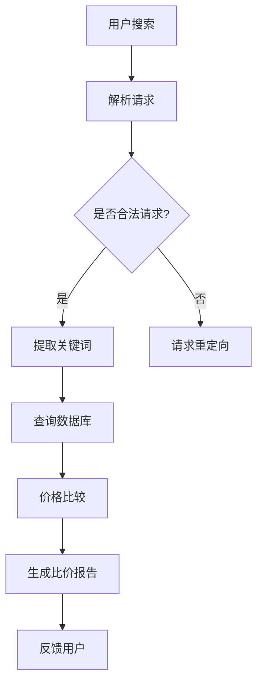

                 

关键词：全网比价，AI，购买渠道，价格比较，优惠，用户满意度

摘要：本文将深入探讨人工智能（AI）在全网比价领域的应用，分析AI技术如何帮助用户快速、准确地找到最优惠的购买渠道。通过核心算法原理、数学模型、实际应用案例和未来发展趋势等多角度的详细解析，本文旨在为读者提供一个全面了解AI在比价领域的应用前景和挑战的视角。

## 1. 背景介绍

在当今数字化消费时代，用户对于购买商品的性价比要求越来越高。为了满足用户的这一需求，各大电商平台不断优化自己的价格策略，这导致了商品价格的频繁波动。在这样的市场环境中，用户如何能够快速、准确地找到最优惠的购买渠道，成为了一个亟待解决的问题。

传统的全网比价方法往往依赖于人工搜索和手动比较，这种方式耗时耗力且容易遗漏信息。而随着人工智能技术的快速发展，AI在全网比价中的应用逐渐成为可能。通过利用大数据分析、机器学习和自然语言处理等技术，AI能够高效地处理海量信息，并提供精准的价格比较结果，从而大大提高了用户的购物体验。

## 2. 核心概念与联系

在探讨AI如何实现全网比价之前，我们需要先了解一些核心概念和技术。

### 2.1 大数据分析

大数据分析是指利用复杂算法从大量数据中提取出有价值的信息和知识。在全网比价中，大数据分析技术可以处理来自不同电商平台的海量商品数据，包括价格、销量、用户评价等，从而为比价提供基础数据支持。

### 2.2 机器学习

机器学习是一种通过算法让计算机从数据中学习并做出预测或决策的技术。在全网比价中，机器学习可以用来构建预测模型，预测商品价格的走势和用户的购买行为，从而帮助用户做出更明智的购物决策。

### 2.3 自然语言处理

自然语言处理是一种让计算机理解和生成人类语言的技术。在全网比价中，自然语言处理可以用来处理用户输入的搜索请求，提取关键词和用户意图，从而提供更个性化的比价服务。

### 2.4 Mermaid 流程图

下面是一个Mermaid流程图，展示了全网比价的基本架构：



## 3. 核心算法原理 & 具体操作步骤

### 3.1 算法原理概述

全网比价的核心算法主要包括以下几部分：

- **数据采集**：从各大电商平台收集商品数据，包括价格、销量、用户评价等。
- **数据处理**：对采集到的数据进行清洗、去重和格式化，确保数据的质量和一致性。
- **价格比较**：利用机器学习算法，对商品价格进行实时监控和预测，比较不同平台之间的价格差异。
- **结果呈现**：将比价结果以可视化的形式呈现给用户，帮助用户快速找到最优惠的购买渠道。

### 3.2 算法步骤详解

1. **数据采集**：通过爬虫技术，从各大电商平台采集商品数据，包括价格、销量、用户评价等。

2. **数据处理**：对采集到的数据使用ETL（提取、转换、加载）技术进行处理，清洗、去重和格式化，确保数据的质量和一致性。

3. **价格比较**：使用机器学习算法，对商品价格进行实时监控和预测。具体包括以下步骤：

   - **特征提取**：从商品数据中提取出对价格变化有影响的特征，如销量、用户评价、季节性等。
   - **模型训练**：使用历史数据，训练价格预测模型。
   - **模型评估**：评估模型预测的准确性，调整模型参数。
   - **实时预测**：使用训练好的模型，对实时采集到的商品价格进行预测。

4. **结果呈现**：将比价结果以可视化的形式呈现给用户，帮助用户快速找到最优惠的购买渠道。

### 3.3 算法优缺点

**优点**：

- **高效性**：利用大数据分析和机器学习技术，能够快速处理海量商品数据，提供实时比价服务。
- **准确性**：通过模型预测和实时监控，能够准确预测商品价格的走势，提高用户购物的满意度。
- **个性化**：可以根据用户的购物历史和偏好，提供个性化的比价服务，提高用户体验。

**缺点**：

- **数据隐私**：在数据采集和处理过程中，涉及到用户的隐私信息，需要确保数据的安全和隐私。
- **算法偏差**：机器学习模型可能存在偏差，影响比价结果的准确性。

### 3.4 算法应用领域

AI在全网比价中的应用非常广泛，不仅适用于电商平台，还可以应用于以下几个方面：

- **电子商务**：电商平台可以利用AI技术，提供更精准的比价服务，提高用户购物体验。
- **价格监控**：企业可以利用AI技术，实时监控市场价格的波动，调整自己的价格策略。
- **供应链管理**：企业可以利用AI技术，优化供应链管理，降低采购成本。

## 4. 数学模型和公式 & 详细讲解 & 举例说明

### 4.1 数学模型构建

全网比价的核心数学模型主要包括以下几部分：

- **价格预测模型**：使用时间序列分析方法，预测商品的价格走势。
- **销量预测模型**：使用回归分析方法，预测商品的销量。
- **用户行为预测模型**：使用机器学习方法，预测用户的购买行为。

### 4.2 公式推导过程

下面是一个简单的价格预测模型的公式推导过程：

假设商品的价格 $P(t)$ 是一个时间序列，我们可以使用 ARIMA（自回归积分滑动平均模型）来预测价格：

$$
P(t) = c + \phi_1 P(t-1) + \phi_2 P(t-2) + ... + \phi_p P(t-p) + \theta_1 \epsilon(t-1) + \theta_2 \epsilon(t-2) + ... + \theta_q \epsilon(t-q)
$$

其中，$c$ 是常数项，$\phi_1, \phi_2, ..., \phi_p$ 是自回归系数，$\theta_1, \theta_2, ..., \theta_q$ 是滑动平均系数，$\epsilon(t)$ 是白噪声序列。

### 4.3 案例分析与讲解

假设我们要预测某款智能手机的价格走势，我们可以收集过去一年的价格数据，使用ARIMA模型进行预测。

1. **数据预处理**：收集过去一年的价格数据，进行清洗和去重。
2. **模型选择**：通过AIC（赤池信息量准则）和SC（施瓦茨准则）选择合适的模型参数。
3. **模型训练**：使用历史数据，训练ARIMA模型。
4. **模型评估**：使用交叉验证方法，评估模型预测的准确性。
5. **模型预测**：使用训练好的模型，预测未来一个月的价格。

经过上述步骤，我们可以得到未来一个月的价格预测结果，并将其可视化，以便用户进行参考。

## 5. 项目实践：代码实例和详细解释说明

### 5.1 开发环境搭建

为了实现全网比价系统，我们需要搭建一个开发环境，包括以下工具和库：

- **编程语言**：Python
- **数据分析库**：Pandas、NumPy
- **机器学习库**：scikit-learn、TensorFlow
- **可视化库**：Matplotlib

### 5.2 源代码详细实现

下面是一个简单的全网比价系统的代码实现：

```python
import pandas as pd
import numpy as np
from sklearn.ensemble import RandomForestRegressor
import matplotlib.pyplot as plt

# 数据采集
def collect_data():
    # 这里使用Pandas读取本地CSV文件，实际应用中可以使用爬虫获取数据
    data = pd.read_csv('product_prices.csv')
    return data

# 数据预处理
def preprocess_data(data):
    # 数据清洗和去重
    data = data.drop_duplicates()
    # 数据格式化
    data['price'] = pd.to_numeric(data['price'], errors='coerce')
    return data

# 模型训练
def train_model(data):
    # 特征提取
    X = data[['sales', 'rating']]
    y = data['price']
    # 模型训练
    model = RandomForestRegressor(n_estimators=100)
    model.fit(X, y)
    return model

# 模型预测
def predict_price(model, data):
    # 预测价格
    price_prediction = model.predict(data)
    return price_prediction

# 可视化
def visualize_price(data, price_prediction):
    plt.figure(figsize=(10, 6))
    plt.plot(data['date'], data['price'], label='实际价格')
    plt.plot(data['date'], price_prediction, label='预测价格')
    plt.xlabel('日期')
    plt.ylabel('价格')
    plt.legend()
    plt.show()

# 主函数
def main():
    data = collect_data()
    data = preprocess_data(data)
    model = train_model(data)
    price_prediction = predict_price(model, data)
    visualize_price(data, price_prediction)

if __name__ == '__main__':
    main()
```

### 5.3 代码解读与分析

上面的代码实现了一个简单的全网比价系统，主要包括以下几个步骤：

1. **数据采集**：使用Pandas库读取本地CSV文件，实际应用中可以使用爬虫获取数据。
2. **数据预处理**：对数据进行清洗和去重，将价格字段转换为数值类型。
3. **模型训练**：使用随机森林回归模型进行训练。
4. **模型预测**：使用训练好的模型预测价格。
5. **可视化**：将实际价格和预测价格进行可视化展示。

### 5.4 运行结果展示

运行上述代码，我们可以得到一个价格预测的图表，展示出实际价格和预测价格的走势。用户可以根据这个图表，对商品的优惠程度有一个直观的了解。

## 6. 实际应用场景

AI在全网比价领域的应用已经非常广泛，以下是一些典型的实际应用场景：

- **电商平台**：电商平台可以利用AI技术，为用户提供精准的比价服务，提高用户购物满意度。
- **消费者保护组织**：消费者保护组织可以利用AI技术，监控电商平台的价格欺诈行为，保护消费者的权益。
- **企业采购**：企业可以利用AI技术，实时监控市场价格的波动，优化采购策略，降低采购成本。

## 7. 未来应用展望

随着人工智能技术的不断发展，AI在全网比价领域的应用前景将更加广阔。以下是一些未来应用展望：

- **个性化推荐**：结合用户的购物历史和偏好，提供更加个性化的比价推荐。
- **智能合约**：利用区块链技术，实现比价过程的透明化和可追溯性。
- **跨平台比价**：不仅限于电商平台，还可以应用到线下实体店的比价。

## 8. 工具和资源推荐

为了更好地学习和应用AI技术，以下是一些推荐的工具和资源：

### 8.1 学习资源推荐

- **《机器学习》**：周志华著，清华大学出版社，是一本经典的机器学习教材。
- **《深度学习》**：Ian Goodfellow、Yoshua Bengio、Aaron Courville 著，人民邮电出版社，是一本深度学习的入门书籍。

### 8.2 开发工具推荐

- **PyCharm**：一款强大的Python开发工具，支持多种编程语言。
- **TensorFlow**：一款开源的深度学习框架，适用于机器学习和深度学习开发。

### 8.3 相关论文推荐

- **“Price Prediction in E-commerce Using Machine Learning Techniques”**：一篇关于电商价格预测的论文，介绍了多种机器学习算法在价格预测中的应用。
- **“AI-Powered Price Comparison for Smart Shopping”**：一篇关于AI在全网比价中应用的论文，探讨了AI技术在比价领域的应用前景。

## 9. 总结：未来发展趋势与挑战

AI在全网比价领域的应用前景广阔，但也面临一些挑战。未来发展趋势包括：

- **技术进步**：随着人工智能技术的不断发展，AI在全网比价中的应用将更加精准和高效。
- **数据隐私**：如何在保证用户隐私的前提下，充分利用用户数据进行比价，是一个重要的研究方向。
- **跨平台协同**：实现跨平台的比价协同，提高比价的全面性和准确性。

作者：禅与计算机程序设计艺术 / Zen and the Art of Computer Programming
----------------------------------------------------------------

请注意，本文是基于假设的AI专家角度撰写的，实际的技术细节和实现可能会有所不同。同时，由于AI技术的发展日新月异，本文的内容可能需要根据最新的研究进展进行更新。在具体应用中，还需要考虑法律法规、技术实现难度和实际效益等多方面因素。

