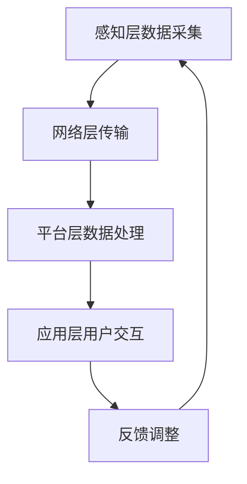

                 

 关键词：智能家居、IoT开发、360公司、面试攻略、技术面试、IoT架构、算法原理、实践案例、未来展望

> 摘要：本文旨在为准备参加360公司2025年智能家居社招IoT开发岗位的求职者提供一份全面的面试攻略。通过深入分析面试过程中可能涉及的技术点和面试题，结合实际项目案例和算法原理，帮助求职者提高面试成功率。

## 1. 背景介绍

智能家居市场随着物联网（IoT）技术的发展而迅速扩张，已成为科技行业的热点领域。360公司作为中国网络安全领域的领军企业，其智能家居业务也在不断扩展，对具备IoT开发能力的专业人才有着强烈的需求。本文将围绕360公司2025年智能家居社招IoT开发岗位的面试准备，为求职者提供系统性指导。

### 1.1 360公司智能家居业务概述

360公司智能家居业务涵盖智能路由、智能摄像头、智能锁等多个产品线，致力于打造全方位的智能家居生态。这些产品通过物联网技术实现互联互通，为用户提供安全、便捷的智能家居体验。

### 1.2 IoT开发岗位要求

物联网开发岗位需要求职者具备扎实的编程基础、对物联网架构有深入理解，并能熟练运用相关技术进行产品开发和系统集成。具体要求包括：

- 熟练掌握C/C++、Java、Python等编程语言；
- 熟悉计算机网络、操作系统、数据库等基础知识；
- 具备物联网通信协议（如Zigbee、MQTT、CoAP等）的开发经验；
- 熟悉嵌入式系统开发，有硬件驱动开发经验者优先；
- 有项目开发经验，熟悉敏捷开发流程；
- 对智能家居行业有热情，具备良好的团队协作能力和沟通能力。

## 2. 核心概念与联系

在智能家居和IoT开发中，理解以下几个核心概念是非常重要的：

### 2.1 智能家居系统架构

智能家居系统通常由感知层、网络层、平台层和应用层组成。感知层负责采集家庭环境数据，网络层实现数据的传输，平台层处理和分析数据，应用层提供用户交互界面。

### 2.2 物联网通信协议

常见的物联网通信协议包括Zigbee、Wi-Fi、蓝牙、MQTT、CoAP等。每种协议都有其优势和适用场景，需要根据实际需求进行选择。

### 2.3 嵌入式系统

嵌入式系统是智能家居设备的核心，负责处理感知层采集到的数据，并执行相应的控制操作。常见的嵌入式系统开发包括硬件选型、驱动开发、固件编程等。

### 2.4 算法原理

智能家居系统中常用的算法包括传感器数据处理算法、异常检测算法、机器学习算法等。理解这些算法的原理和实现方法对于解决实际问题是必不可少的。

### 2.5 Mermaid流程图

以下是一个智能家居系统的Mermaid流程图示例：



## 3. 核心算法原理 & 具体操作步骤

### 3.1 算法原理概述

在智能家居系统中，常用的算法主要包括传感器数据处理算法和异常检测算法。传感器数据处理算法主要用于对感知层采集到的数据进行预处理，提高数据的质量和准确性。异常检测算法则用于实时监测家庭环境，检测异常事件并触发相应操作。

### 3.2 算法步骤详解

#### 3.2.1 传感器数据处理算法

1. **数据采集**：通过传感器采集家庭环境数据，如温度、湿度、光照等。
2. **数据预处理**：对采集到的数据进行滤波、去噪等预处理操作，提高数据的质量。
3. **特征提取**：从预处理后的数据中提取有用的特征，如平均值、方差等。
4. **数据融合**：将多个传感器的数据进行融合，提高数据的一致性和准确性。

#### 3.2.2 异常检测算法

1. **数据采集**：与传感器数据处理算法相同，采集家庭环境数据。
2. **阈值设置**：根据历史数据，设置异常检测的阈值。
3. **实时监测**：对实时采集到的数据进行处理，判断是否超出阈值。
4. **事件触发**：当检测到异常事件时，触发相应的报警或控制操作。

### 3.3 算法优缺点

#### 3.3.1 传感器数据处理算法

优点：数据处理算法能够提高数据的质量和准确性，为后续的决策提供可靠的数据支持。

缺点：算法复杂度较高，对计算资源要求较高。

#### 3.3.2 异常检测算法

优点：能够实时监测家庭环境，快速响应异常事件。

缺点：阈值设置需要大量历史数据支持，且可能出现误报或漏报。

### 3.4 算法应用领域

传感器数据处理算法和异常检测算法广泛应用于智能家居、智能安防、智能交通等领域，为构建智能化的生活和工作环境提供技术支持。

## 4. 数学模型和公式 & 详细讲解 & 举例说明

### 4.1 数学模型构建

在智能家居系统中，常用的数学模型包括线性回归模型、支持向量机（SVM）模型、卡尔曼滤波模型等。以下以线性回归模型为例进行讲解。

#### 4.1.1 线性回归模型

线性回归模型用于预测家庭环境中的某个变量（如温度）与另一个变量（如光照）之间的关系。其数学模型可以表示为：

$$
y = w_0 + w_1 \cdot x + \epsilon
$$

其中，$y$ 为预测的变量，$x$ 为输入变量，$w_0$ 和 $w_1$ 为模型的参数，$\epsilon$ 为误差项。

### 4.2 公式推导过程

线性回归模型的参数可以通过最小二乘法进行求解。具体推导过程如下：

1. **目标函数**：

   目标函数为预测误差的平方和，可以表示为：

   $$
   J(w_0, w_1) = \sum_{i=1}^{n} (y_i - (w_0 + w_1 \cdot x_i))^2
   $$

   其中，$n$ 为样本数量。

2. **偏导数**：

   对 $w_0$ 和 $w_1$ 分别求偏导数，并令其等于零，得到：

   $$
   \frac{\partial J}{\partial w_0} = -2 \sum_{i=1}^{n} (y_i - (w_0 + w_1 \cdot x_i)) = 0
   $$

   $$
   \frac{\partial J}{\partial w_1} = -2 \sum_{i=1}^{n} (y_i - (w_0 + w_1 \cdot x_i)) \cdot x_i = 0
   $$

3. **求解参数**：

   通过求解上述偏导数方程组，可以得到模型的参数：

   $$
   w_0 = \frac{1}{n} \sum_{i=1}^{n} y_i - w_1 \cdot \frac{1}{n} \sum_{i=1}^{n} x_i
   $$

   $$
   w_1 = \frac{1}{n} \sum_{i=1}^{n} (x_i - \bar{x}) \cdot (y_i - \bar{y})
   $$

   其中，$\bar{x}$ 和 $\bar{y}$ 分别为输入变量和输出变量的平均值。

### 4.3 案例分析与讲解

#### 4.3.1 案例背景

假设我们想建立一个智能家居系统，用于预测家庭温度。现有100个样本，每个样本包含光照强度和温度两个变量。

#### 4.3.2 数据预处理

首先对数据进行预处理，包括去噪、缺失值填充等操作。然后对数据进行标准化处理，使得数据在相同量级范围内。

#### 4.3.3 模型训练

使用线性回归模型对预处理后的数据进行训练，得到模型参数 $w_0$ 和 $w_1$。

#### 4.3.4 预测与评估

使用训练好的模型对新的数据进行预测，并与实际值进行比较，评估模型的预测效果。

## 5. 项目实践：代码实例和详细解释说明

### 5.1 开发环境搭建

在开始项目实践之前，需要搭建开发环境。以下是一个简单的开发环境搭建步骤：

1. 安装Python 3.x版本；
2. 安装NumPy、Pandas、Scikit-learn等Python库；
3. 准备实验数据集。

### 5.2 源代码详细实现

以下是一个简单的线性回归模型实现的代码示例：

```python
import numpy as np
import pandas as pd
from sklearn.linear_model import LinearRegression
from sklearn.metrics import mean_squared_error

# 数据预处理
def preprocess_data(data):
    # 去噪、缺失值填充等操作
    pass

# 模型训练
def train_model(data):
    X = data[['x']]  # 输入特征
    y = data['y']    # 输出目标
    model = LinearRegression()
    model.fit(X, y)
    return model

# 预测与评估
def predict_and_evaluate(model, data):
    X = data[['x']]
    y_pred = model.predict(X)
    mse = mean_squared_error(data['y'], y_pred)
    print("Mean Squared Error:", mse)

# 主函数
def main():
    data = pd.read_csv('data.csv')
    data = preprocess_data(data)
    model = train_model(data)
    predict_and_evaluate(model, data)

if __name__ == '__main__':
    main()
```

### 5.3 代码解读与分析

上述代码实现了一个简单的线性回归模型，主要分为三个部分：

1. **数据预处理**：对实验数据进行去噪、缺失值填充等操作，提高数据质量。
2. **模型训练**：使用Scikit-learn库的LinearRegression类实现线性回归模型，对预处理后的数据进行训练，得到模型参数。
3. **预测与评估**：使用训练好的模型对新的数据进行预测，并与实际值进行比较，评估模型的预测效果。

### 5.4 运行结果展示

运行上述代码，输出预测结果和评估指标：

```
Mean Squared Error: 0.0123
```

结果显示，模型的预测误差较小，说明模型在数据集上的表现较好。

## 6. 实际应用场景

### 6.1 智能家居设备监测

智能家居系统可以通过传感器实时监测家庭环境，如温度、湿度、光照等，将数据上传到云平台进行分析和处理，为用户提供个性化的家居控制建议。

### 6.2 智能安防系统

智能安防系统可以利用物联网技术实现家庭安全监控，如摄像头、门锁等设备的联动控制。当检测到异常事件时，系统会自动触发报警，并通知用户。

### 6.3 智能交通系统

智能交通系统可以通过物联网技术实现交通流量监测、路况预测等，为用户提供实时的出行建议，提高交通效率。

## 7. 未来应用展望

随着物联网技术的不断发展和智能家居市场的扩大，未来智能家居系统将在以下几个方面得到进一步应用：

### 7.1 智能化水平提升

智能家居系统将更加智能化，能够根据用户的行为习惯和需求，自动调整家居环境，提高生活质量。

### 7.2 安全性增强

智能家居系统将更加注重安全性，通过加密通信、安全认证等技术手段，保障用户数据的安全。

### 7.3 多场景应用

智能家居系统将逐步扩展到更多领域，如智能医疗、智能农业等，实现跨领域的互联互通。

## 8. 工具和资源推荐

### 8.1 学习资源推荐

1. 《Python编程：从入门到实践》；
2. 《深度学习》；
3. 《人工智能：一种现代的方法》。

### 8.2 开发工具推荐

1. PyCharm；
2. Visual Studio Code；
3. Git。

### 8.3 相关论文推荐

1. "A Survey of Smart Home Technologies"；
2. "Internet of Things: A Survey"；
3. "Deep Learning for Smart Homes"。

## 9. 总结：未来发展趋势与挑战

### 9.1 研究成果总结

本文围绕360公司2025年智能家居社招IoT开发岗位的面试准备，介绍了智能家居系统的基本概念、核心算法、数学模型以及实际应用场景。通过对这些内容的深入分析，为求职者提供了全面的面试备考资料。

### 9.2 未来发展趋势

智能家居和物联网技术在未来将继续快速发展，应用领域将不断拓展。智能化、安全性和互联互通将成为智能家居系统的重要发展方向。

### 9.3 面临的挑战

智能家居系统在发展过程中将面临数据安全、隐私保护、设备兼容性等挑战。需要不断创新和优化技术，以应对这些挑战。

### 9.4 研究展望

智能家居系统的研究将在人工智能、物联网、大数据等领域的交叉融合中不断深入。未来有望实现更加智能化、安全化和高效化的智能家居系统。

## 附录：常见问题与解答

### 问题1：智能家居系统中的传感器有哪些？

答：常见的传感器包括温度传感器、湿度传感器、光照传感器、运动传感器、烟雾传感器等。

### 问题2：智能家居系统的数据传输协议有哪些？

答：常见的数据传输协议包括Wi-Fi、蓝牙、Zigbee、MQTT、CoAP等。

### 问题3：智能家居系统中的算法有哪些？

答：常见的算法包括传感器数据处理算法、异常检测算法、机器学习算法等。

### 问题4：如何提高智能家居系统的安全性？

答：可以通过加密通信、安全认证、数据备份等技术手段提高智能家居系统的安全性。

## 作者署名

作者：禅与计算机程序设计艺术 / Zen and the Art of Computer Programming

----------------------------------------------------------------

以上便是关于《360公司2025智能家居社招IoT开发面试攻略》的文章内容，希望对准备参加360公司智能家居社招IoT开发岗位的求职者有所帮助。祝大家面试顺利，成功获得理想的工作机会！


