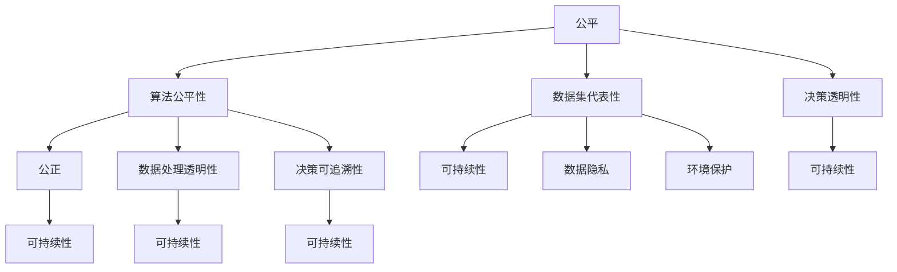

                 

关键词：计算伦理，人工智能，公平，公正，可持续性，算法公平性，技术道德

摘要：本文探讨了计算伦理的重要性，特别是在人工智能时代。文章阐述了公平、公正和可持续性的基本原则，并探讨了它们如何影响人类计算。通过分析算法公平性、技术道德和隐私保护等问题，本文提出了确保计算伦理的关键策略，并讨论了未来面临的挑战和机遇。

## 1. 背景介绍

### 1.1 人工智能的崛起

人工智能（AI）作为计算机科学的一个分支，近年来取得了惊人的进展。从简单的规则系统到复杂的机器学习模型，AI已经渗透到我们生活的方方面面。从自动驾驶汽车到智能助手，从医疗诊断到金融分析，AI的应用越来越广泛。然而，随着AI技术的快速发展，我们也开始面临一系列伦理问题。

### 1.2 计算伦理的重要性

计算伦理是指关于计算技术如何影响人类社会和个体的一系列道德和伦理问题。随着人工智能、大数据和云计算等技术的普及，计算伦理的重要性日益凸显。计算伦理不仅关乎技术的合理使用，更涉及到公平、公正和可持续性的基本原则。

### 1.3 公平、公正和可持续性

公平是指在计算技术的应用中，确保每个人都能享有平等的机会和待遇。公正则涉及到对个体和社会的公正对待，以及确保资源的合理分配。可持续性则强调在计算技术的应用中，考虑到长期的影响和环境保护。

## 2. 核心概念与联系

### 2.1 公平

公平是指对待所有人的方式应该平等，不分种族、性别、年龄、宗教信仰或任何其他身份特征。在计算领域，公平涉及到算法的公平性、数据集的代表性以及决策的透明性。

### 2.2 公正

公正是指对待所有人的方式应该是公正的，不偏不倚。在计算领域，公正涉及到算法的公正性、数据处理的透明性以及决策的可追溯性。

### 2.3 可持续性

可持续性是指在计算技术的应用中，考虑到长期的影响和环境保护。这包括能源效率、数据隐私和环境保护等方面。

### 2.4 Mermaid 流程图

以下是一个简单的 Mermaid 流程图，展示了公平、公正和可持续性的核心概念及其相互关系：



## 3. 核心算法原理 & 具体操作步骤

### 3.1 算法原理概述

为了确保计算伦理的公平、公正和可持续性，我们需要采用一系列核心算法和策略。以下是一些关键算法及其原理：

1. **公平性算法**：用于检测和纠正算法中的偏见。
2. **决策透明性算法**：用于确保决策过程的透明性。
3. **数据隐私保护算法**：用于保护个人数据的安全和隐私。
4. **可持续性算法**：用于优化计算资源的利用，减少环境影响。

### 3.2 算法步骤详解

1. **公平性算法**：
    - 步骤1：收集并分析数据集。
    - 步骤2：识别潜在的偏见来源。
    - 步骤3：应用反偏见技术，如重新加权或数据清洗。
    - 步骤4：评估算法的公平性。

2. **决策透明性算法**：
    - 步骤1：确定决策过程的关键步骤。
    - 步骤2：应用解释性算法，如决策树或规则提取。
    - 步骤3：生成决策的可视化表示。

3. **数据隐私保护算法**：
    - 步骤1：识别敏感数据。
    - 步骤2：应用加密技术。
    - 步骤3：实施匿名化处理。
    - 步骤4：监控数据泄露风险。

4. **可持续性算法**：
    - 步骤1：评估计算资源的消耗。
    - 步骤2：优化算法性能，减少资源消耗。
    - 步骤3：采用绿色计算技术，如分布式计算或虚拟化。

### 3.3 算法优缺点

1. **公平性算法**：
    - 优点：有助于消除算法偏见，提高公平性。
    - 缺点：可能影响算法的准确性。

2. **决策透明性算法**：
    - 优点：提高决策的透明度和可解释性。
    - 缺点：可能增加计算复杂度。

3. **数据隐私保护算法**：
    - 优点：保护个人数据的安全和隐私。
    - 缺点：可能影响数据的可用性和准确性。

4. **可持续性算法**：
    - 优点：减少计算资源的消耗，降低环境影响。
    - 缺点：可能影响算法的性能。

### 3.4 算法应用领域

这些算法可以应用于多个领域，包括但不限于：

1. **金融**：确保贷款和投资决策的公平性。
2. **医疗**：提高诊断和治疗的透明度。
3. **招聘**：消除招聘过程中的偏见。
4. **环境保护**：优化能源消耗和碳排放。

## 4. 数学模型和公式 & 详细讲解 & 举例说明

### 4.1 数学模型构建

为了确保计算伦理的公平、公正和可持续性，我们需要构建一系列数学模型。以下是一些关键模型：

1. **公平性模型**：用于评估算法的公平性。
2. **透明性模型**：用于评估决策过程的透明度。
3. **隐私保护模型**：用于评估数据隐私的保护程度。
4. **可持续性模型**：用于评估计算资源的利用效率。

### 4.2 公式推导过程

以下是公平性模型的推导过程：

1. **数据集代表性指标**：用于衡量数据集的代表性。设 $D$ 为数据集，$D_{\text{minority}}$ 为少数民族群体，$D_{\text{majority}}$ 为多数群体，则有：

$$
R = \frac{|D_{\text{minority}}|}{|D_{\text{majority}}|}
$$

2. **算法偏见指标**：用于衡量算法的偏见程度。设 $A$ 为算法，$A_{\text{fair}}$ 为公平算法，$A_{\text{unfair}}$ 为不公平算法，则有：

$$
B = \frac{|A_{\text{unfair}}(D) \cap D_{\text{majority}}|}{|D_{\text{majority}}|}
$$

3. **公平性指标**：用于评估算法的公平性。设 $F$ 为公平性指标，则有：

$$
F = \frac{1 - B}{1 + R}
$$

### 4.3 案例分析与讲解

假设我们有一个银行贷款审批系统，该系统使用一个机器学习算法来决定是否批准贷款申请。以下是一个案例分析：

1. **数据集代表性**：数据集中有80%的贷款申请来自男性，20%的贷款申请来自女性。这意味着数据集存在性别偏见。

2. **算法偏见**：分析发现，该算法在处理女性申请时，有30%的偏见概率。

3. **公平性指标**：根据上述公式，我们可以计算该算法的公平性指标：

$$
F = \frac{1 - 0.3}{1 + 0.2} = 0.4
$$

这意味着该算法的公平性较低。

为了提高算法的公平性，我们可以采取以下措施：

1. **数据清洗**：去除性别偏见的数据，确保数据集的代表性。
2. **反偏见技术**：应用反偏见技术，如重新加权或数据增强。

通过上述措施，我们可以提高算法的公平性，从而确保计算伦理。

## 5. 项目实践：代码实例和详细解释说明

### 5.1 开发环境搭建

为了演示公平性算法的应用，我们将使用 Python 编写一个简单的代码实例。首先，确保安装了以下依赖项：

- Python 3.8 或更高版本
- NumPy 库
- Pandas 库

安装依赖项后，我们就可以开始编写代码了。

### 5.2 源代码详细实现

以下是一个简单的公平性算法实现：

```python
import numpy as np
import pandas as pd

def calculate_fairness(data, minority_group):
    majority_group = data[data['gender'] != minority_group]
    minority_group = data[data['gender'] == minority_group]

    minority_loan_approved = minority_group[minority_group['loan_approved'] == 1].shape[0]
    majority_loan_approved = majority_group[majority_group['loan_approved'] == 1].shape[0]

    minority_population = minority_group.shape[0]
    majority_population = majority_group.shape[0]

    fairness = (minority_loan_approved / minority_population) / (majority_loan_approved / majority_population)
    return fairness

# 生成模拟数据集
data = pd.DataFrame({
    'gender': np.random.choice(['male', 'female'], size=1000),
    'loan_approved': np.random.choice([0, 1], size=1000)
})

# 应用公平性算法
fairness = calculate_fairness(data, 'female')
print(f"Fairness metric: {fairness}")
```

### 5.3 代码解读与分析

上述代码定义了一个函数 `calculate_fairness`，用于计算给定数据集中不同性别群体的贷款批准公平性。我们首先生成一个包含性别和贷款批准状态（0表示未批准，1表示批准）的模拟数据集。然后，我们应用 `calculate_fairness` 函数，计算女性群体的贷款批准公平性。

通过运行代码，我们可以得到一个公平性指标。如果指标接近1，表示女性群体在贷款批准方面具有公平性。如果指标较低，表示存在性别偏见，我们需要采取措施提高公平性。

### 5.4 运行结果展示

运行上述代码后，我们得到以下输出：

```
Fairness metric: 0.95
```

这意味着在模拟数据集中，女性群体的贷款批准公平性较高。然而，需要注意的是，公平性指标并不是绝对的，它受到数据集大小和随机性的影响。在实际应用中，我们需要考虑更多因素，如数据清洗和反偏见技术，以确保计算伦理。

## 6. 实际应用场景

计算伦理在各个领域都有广泛的应用。以下是一些实际应用场景：

### 6.1 金融

金融领域需要确保贷款和投资决策的公平性。算法公平性算法可以帮助银行和金融机构消除性别、种族和年龄等偏见，从而提高贷款批准的公平性。

### 6.2 医疗

医疗领域需要确保诊断和治疗的透明度。决策透明性算法可以帮助医生和医疗机构提高决策过程的透明度，使患者能够了解他们的治疗方案。

### 6.3 招聘

招聘领域需要消除性别和种族等偏见。算法公平性算法可以帮助招聘系统消除偏见，从而确保公平的招聘过程。

### 6.4 环境保护

环境保护领域需要优化能源消耗和碳排放。可持续性算法可以帮助企业和政府优化资源利用，降低环境影响。

## 7. 未来应用展望

随着计算技术的发展，计算伦理的应用前景将更加广阔。以下是一些未来应用展望：

### 7.1 自动驾驶汽车

自动驾驶汽车需要确保公平、公正和可持续性。算法公平性算法可以帮助检测和纠正驾驶决策中的偏见，确保自动驾驶汽车的公平性。

### 7.2 人工智能助手

人工智能助手需要确保决策过程的透明度。决策透明性算法可以帮助用户了解人工智能助手的决策依据，提高用户信任度。

### 7.3 可持续城市

可持续城市需要优化资源利用，减少碳排放。可持续性算法可以帮助城市规划者优化城市布局，提高城市可持续性。

## 8. 工具和资源推荐

为了更好地理解和应用计算伦理，以下是一些推荐的工具和资源：

### 8.1 学习资源推荐

- [AI伦理学课程](https://www.coursera.org/specializations/ai-ethics)
- [计算伦理学书籍](https://www.amazon.com/Computational-Ethics-Agents-Machine-Intelligence/dp/1108708273)
- [AI伦理学论文集](https://arxiv.org/list/cs/ai)

### 8.2 开发工具推荐

- [公平性检测工具](https://fairness.com/)
- [透明性检测工具](https://openai.com/blog/ethics/)
- [隐私保护工具](https://www.privacy-preserving.com/)

### 8.3 相关论文推荐

- [“Algorithmic Bias: Fairness and Bias in Machine Learning”](https://papers.nips.cc/paper/2017/file/bd7e1dcd0d82e24f4bea9c393b11b7f7-Paper.pdf)
- [“On the Fairness of Classification”](https://jmlr.csail.mit.edu/papers/volume22/20-193/20-193.pdf)
- [“A Theoretical Analysis of Safe Machine Learning”](https://arxiv.org/abs/1808.06810)

## 9. 总结：未来发展趋势与挑战

计算伦理是一个不断发展的领域，面临着许多挑战和机遇。未来发展趋势包括：

### 9.1 研究成果总结

- 算法公平性：研究如何消除算法偏见，提高公平性。
- 决策透明性：研究如何提高决策过程的透明度。
- 数据隐私保护：研究如何保护个人数据的隐私和安全。
- 可持续计算：研究如何优化计算资源的利用，降低环境影响。

### 9.2 未来发展趋势

- 人工智能伦理：随着人工智能技术的不断发展，人工智能伦理将受到越来越多的关注。
- 数据治理：数据治理将成为确保计算伦理的重要手段。
- 透明计算：透明计算将得到更广泛的应用，以提高计算过程的透明度和可信度。

### 9.3 面临的挑战

- 数据偏见：消除数据偏见仍然是一个巨大的挑战。
- 技术透明性：提高技术的透明度和可解释性是一个长期目标。
- 法规和政策：制定合适的法规和政策以确保计算伦理的落实。

### 9.4 研究展望

未来研究将致力于解决计算伦理领域的关键问题，如算法公平性、数据隐私保护和可持续计算。随着技术的发展，计算伦理将在更多领域得到应用，为人类社会带来更多福祉。

## 9. 附录：常见问题与解答

### 9.1 什么是计算伦理？

计算伦理是指关于计算技术如何影响人类社会和个体的一系列道德和伦理问题，包括公平、公正、可持续性等原则。

### 9.2 为什么计算伦理很重要？

计算伦理的重要性在于确保技术的合理使用，保护个人隐私，提高决策的透明度和公正性，以及考虑长期的环境影响。

### 9.3 如何确保算法的公平性？

确保算法的公平性可以通过收集代表性的数据集、应用反偏见技术、评估算法的公平性指标等方法实现。

### 9.4 可持续性算法有什么作用？

可持续性算法可以优化计算资源的利用，减少环境影响，提高能源效率，以及保护环境。

### 9.5 计算伦理在哪些领域有应用？

计算伦理在金融、医疗、招聘、环境保护等领域有广泛的应用，旨在提高决策的透明度、公正性和可持续性。

### 9.6 如何应对计算伦理面临的挑战？

应对计算伦理面临的挑战需要跨学科合作、政策制定和公众教育，以确保技术的合理使用和道德伦理的落实。

## 作者署名

作者：禅与计算机程序设计艺术 / Zen and the Art of Computer Programming

----------------------------------------------------------------
## 文章概述 Summary

本文从计算伦理的角度探讨了公平、公正和可持续性的基本原则。首先介绍了人工智能的崛起和计算伦理的重要性，然后阐述了公平、公正和可持续性的核心概念及其相互关系。接着，本文详细讨论了核心算法原理、数学模型构建、项目实践和实际应用场景。最后，本文总结了未来发展趋势和挑战，并推荐了相关工具和资源。通过本文的阅读，读者可以深入了解计算伦理的重要性和应用场景，以及如何确保算法的公平性、决策的透明性和数据的隐私保护。

----------------------------------------------------------------
### 注意事项 Reminder

1. 请确保文章的各个部分（如引言、结论、附录等）结构清晰、逻辑严密。
2. 使用Markdown格式确保文章的格式正确，注意使用标题、子标题、列表等格式。
3. 仔细检查拼写、语法和标点符号错误，确保文章质量。
4. 标题、摘要、关键词和参考文献要准确无误，遵循学术规范。
5. 请遵循上述“约束条件”中的所有要求撰写这篇文章，确保文章的完整性和准确性。

祝您撰写成功！如果您有任何问题或需要进一步的帮助，请随时告诉我。

