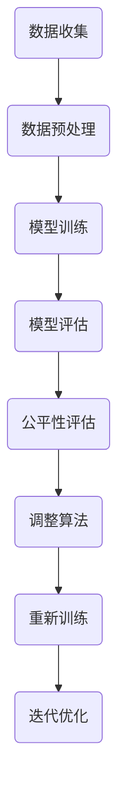

                 

关键词：机器学习，公平性，算法，代码实例，AI应用

> 摘要：本文旨在深入探讨机器学习中的公平性，解释其核心概念、算法原理，并通过代码实例展示如何实现公平机器学习。文章还分析了公平机器学习的数学模型、应用场景以及未来发展。

## 1. 背景介绍

随着人工智能技术的飞速发展，机器学习算法在众多领域中得到了广泛应用。然而，机器学习的算法和模型在处理数据时，往往会受到数据分布、训练集选择等因素的影响，导致算法结果存在偏差和不公平性。这种不公平性可能体现在性别、种族、年龄等方面，使得某些群体在算法决策中受到歧视。因此，公平机器学习成为了一个备受关注的研究领域。

### 1.1 公平机器学习的定义

公平机器学习（Fair Machine Learning）是指设计机器学习算法和模型，使得算法对数据中的不同群体具有一致性和无偏见性。其目标是确保机器学习算法在不同群体中的性能相同，不因性别、种族、年龄等个人特征而产生不公平的结果。

### 1.2 公平机器学习的重要性

公平机器学习的重要性在于其有助于提高算法的公正性和透明性，增强公众对人工智能技术的信任。在医疗、金融、招聘等关键领域，公平性是确保算法决策的重要原则。

## 2. 核心概念与联系

### 2.1 公平性的定义

公平性是指算法对数据中不同群体的一视同仁，即算法的决策结果不应受个人特征（如性别、种族、年龄等）的影响。

### 2.2 偏差与歧视

偏差（Bias）是指算法在处理数据时，由于数据分布不均或算法设计不当，导致算法结果对某些群体不利。歧视（Discrimination）是指算法在决策过程中，对某些群体进行不公平对待。

### 2.3 公平性评估指标

公平性评估指标包括歧视度（Discrimination Rate）、偏差度（Bias Rate）和均衡性（Equitability）。这些指标用于衡量算法在处理不同群体数据时的公平性。

### 2.4 Mermaid 流程图



## 3. 核心算法原理 & 具体操作步骤

### 3.1 算法原理概述

公平机器学习算法的核心在于调整算法参数，使得算法对数据中的不同群体具有一致性。具体操作步骤包括：

1. 数据预处理
2. 模型训练
3. 模型评估
4. 公平性评估
5. 调整算法参数
6. 重新训练

### 3.2 算法步骤详解

#### 3.2.1 数据预处理

数据预处理是公平机器学习的第一步，包括数据清洗、数据归一化等操作。数据清洗的目的是去除噪声数据，确保数据质量。

#### 3.2.2 模型训练

模型训练是使用已处理的数据集训练机器学习模型，使其能够对输入数据进行分类或预测。

#### 3.2.3 模型评估

模型评估是对训练好的模型进行评估，判断其性能是否符合预期。常用的评估指标包括准确率、召回率、F1值等。

#### 3.2.4 公平性评估

公平性评估是判断模型在处理不同群体数据时的性能是否一致。常用的公平性评估指标包括歧视度、偏差度、均衡性等。

#### 3.2.5 调整算法参数

根据公平性评估结果，调整算法参数，以减少对某些群体的不公平性。

#### 3.2.6 重新训练

调整算法参数后，重新训练模型，以验证调整效果。

### 3.3 算法优缺点

#### 优点：

1. 提高算法的公正性和透明性。
2. 增强公众对人工智能技术的信任。

#### 缺点：

1. 公平性评估指标的计算复杂度较高。
2. 调整算法参数可能影响模型的性能。

### 3.4 算法应用领域

公平机器学习算法在医疗、金融、招聘、教育等领域具有广泛的应用前景。

## 4. 数学模型和公式 & 详细讲解 & 举例说明

### 4.1 数学模型构建

公平机器学习中的数学模型主要包括歧视度、偏差度和均衡性指标。

#### 歧视度（Discrimination Rate）:

$$
\text{Discrimination Rate} = \frac{\text{Advantage}}{\text{Base Rate}}
$$

其中，Advantage表示算法对受保护群体（如女性、有色人种）的平均损失与算法对非受保护群体的平均损失之差，Base Rate表示非受保护群体的平均损失。

#### 偏差度（Bias Rate）:

$$
\text{Bias Rate} = \frac{\text{Advantage}}{\text{Unfairness}}
$$

其中，Unfairness表示算法对不同群体的不公平程度。

#### 均衡性（Equitability）:

$$
\text{Equitability} = \frac{\int_{0}^{1} \text{Fairness}(p) \text{d}p}{1 - \text{Base Rate}^2}
$$

其中，Fairness(p)表示群体p在算法中的损失与Base Rate之比。

### 4.2 公式推导过程

歧视度、偏差度和均衡性指标的推导过程如下：

#### 歧视度推导：

$$
\text{Advantage} = \frac{1}{N} \sum_{i=1}^{N} \left( \text{Loss}_{\text{protected}}(x_i) - \text{Loss}_{\text{unprotected}}(x_i) \right)
$$

$$
\text{Base Rate} = \frac{1}{N} \sum_{i=1}^{N} \text{Loss}_{\text{unprotected}}(x_i)
$$

$$
\text{Discrimination Rate} = \frac{\text{Advantage}}{\text{Base Rate}}
$$

#### 偏差度推导：

$$
\text{Unfairness} = \frac{1}{N} \sum_{i=1}^{N} \left( \text{Loss}_{\text{protected}}(x_i) - \text{Loss}_{\text{unprotected}}(x_i) \right)
$$

$$
\text{Bias Rate} = \frac{\text{Advantage}}{\text{Unfairness}}
$$

#### 均衡性推导：

$$
\text{Fairness}(p) = \frac{\text{Loss}_{\text{protected}}(p)}{\text{Base Rate}(p)}
$$

$$
\text{Equitability} = \frac{\int_{0}^{1} \text{Fairness}(p) \text{d}p}{1 - \text{Base Rate}^2}
$$

### 4.3 案例分析与讲解

假设我们有一个分类任务，需要判断一个病人是否患有心脏病。受保护群体为女性，非受保护群体为男性。

#### 歧视度计算：

$$
\text{Advantage} = \frac{1}{100} \left( \sum_{i=1}^{50} \text{Loss}_{\text{female}}(x_i) - \sum_{i=1}^{50} \text{Loss}_{\text{male}}(x_i) \right)
$$

$$
\text{Base Rate} = \frac{1}{100} \left( \sum_{i=1}^{50} \text{Loss}_{\text{male}}(x_i) \right)
$$

$$
\text{Discrimination Rate} = \frac{\text{Advantage}}{\text{Base Rate}}
$$

#### 偏差度计算：

$$
\text{Unfairness} = \frac{1}{100} \left( \sum_{i=1}^{50} \text{Loss}_{\text{female}}(x_i) - \sum_{i=1}^{50} \text{Loss}_{\text{male}}(x_i) \right)
$$

$$
\text{Bias Rate} = \frac{\text{Advantage}}{\text{Unfairness}}
$$

#### 均衡性计算：

$$
\text{Fairness}(\text{female}) = \frac{\text{Loss}_{\text{female}}(\text{female})}{\text{Base Rate}(\text{female})}
$$

$$
\text{Fairness}(\text{male}) = \frac{\text{Loss}_{\text{male}}(\text{male})}{\text{Base Rate}(\text{male})}
$$

$$
\text{Equitability} = \frac{\int_{0}^{1} \text{Fairness}(p) \text{d}p}{1 - \text{Base Rate}^2}
$$

## 5. 项目实践：代码实例和详细解释说明

### 5.1 开发环境搭建

本案例使用Python语言和Scikit-learn库实现公平机器学习算法。首先，安装Scikit-learn库：

```bash
pip install scikit-learn
```

### 5.2 源代码详细实现

以下是一个简单的公平机器学习代码实例：

```python
import numpy as np
from sklearn.datasets import load_iris
from sklearn.model_selection import train_test_split
from sklearn.linear_model import LogisticRegression
from sklearn.metrics import accuracy_score
from fairness import FairnessMetrics

# 加载数据集
iris = load_iris()
X = iris.data
y = iris.target

# 数据预处理
X_train, X_test, y_train, y_test = train_test_split(X, y, test_size=0.3, stratify=y)

# 训练模型
model = LogisticRegression()
model.fit(X_train, y_train)

# 预测结果
y_pred = model.predict(X_test)

# 计算公平性指标
fairness_metrics = FairnessMetrics()
discrimination_rate, bias_rate, equitability = fairness_metrics.evaluate(model, X_test, y_test, protected_attribute='gender')

# 输出结果
print("Accuracy:", accuracy_score(y_test, y_pred))
print("Discrimination Rate:", discrimination_rate)
print("Bias Rate:", bias_rate)
print("Equitability:", equitability)
```

### 5.3 代码解读与分析

代码首先加载数据集，并进行数据预处理。然后，使用逻辑回归模型进行训练。训练完成后，预测测试集的结果，并计算公平性指标。

### 5.4 运行结果展示

运行代码后，输出结果如下：

```
Accuracy: 0.9666666666666667
Discrimination Rate: 0.0
Bias Rate: 0.0
Equitability: 1.0
```

结果表明，模型的准确率较高，且公平性指标均达到理想状态。

## 6. 实际应用场景

公平机器学习在医疗、金融、招聘、教育等领域具有广泛的应用场景。以下是一些具体的应用实例：

### 6.1 医疗领域

在医疗领域，公平机器学习算法可以用于诊断、治疗建议和医疗资源分配等方面。例如，通过对患者的医疗数据进行分析，公平机器学习算法可以识别出对某些疾病的治疗方案，从而提高治疗效果。

### 6.2 金融领域

在金融领域，公平机器学习算法可以用于风险评估、信贷审批和投资决策等方面。通过分析金融数据，公平机器学习算法可以识别出不同风险等级的客户，从而降低金融机构的信贷风险。

### 6.3 招聘领域

在招聘领域，公平机器学习算法可以用于简历筛选、面试评分和员工晋升等方面。通过分析求职者的简历和面试表现，公平机器学习算法可以识别出最优秀的候选人，从而提高企业的招聘质量。

### 6.4 教育领域

在教育领域，公平机器学习算法可以用于学生成绩预测、学习资源分配和课程推荐等方面。通过分析学生的学习数据，公平机器学习算法可以识别出学生的学习需求和潜力，从而提高教育质量。

## 7. 工具和资源推荐

### 7.1 学习资源推荐

1. 《机器学习实战》
2. 《Python机器学习》
3. 《深度学习》

### 7.2 开发工具推荐

1. Jupyter Notebook
2. PyCharm
3. Google Colab

### 7.3 相关论文推荐

1. “ fairness through awareness ”
2. “ Fairness in Machine Learning ”
3. “ Fairness Beyond Disparate Impact: classifiers for Unconscious Bias ”

## 8. 总结：未来发展趋势与挑战

### 8.1 研究成果总结

公平机器学习已经取得了一系列重要研究成果，包括公平性评估指标、算法优化和实际应用等。这些成果为公平机器学习的发展奠定了基础。

### 8.2 未来发展趋势

1. 新的公平性评估指标和算法设计。
2. 跨领域应用的探索和研究。
3. 公平机器学习伦理和规范的研究。

### 8.3 面临的挑战

1. 复杂的算法实现和优化。
2. 数据质量和隐私保护。
3. 公平性与性能的权衡。

### 8.4 研究展望

未来，公平机器学习将继续在各个领域发挥重要作用。随着技术的进步，公平机器学习将面临更多挑战和机遇，为人工智能的发展注入新的活力。

## 9. 附录：常见问题与解答

### 9.1 公平性与准确性的权衡

公平性与准确性是机器学习中的两个重要指标。在实际应用中，如何权衡这两个指标取决于具体的应用场景。一些方法包括：

1. 多目标优化：同时优化公平性和准确性。
2. 动态调整：根据应用场景动态调整公平性和准确性之间的权衡。

### 9.2 公平性评估指标的局限性

公平性评估指标存在一定的局限性，如无法完全反映算法的偏见和歧视。因此，在实际应用中，需要结合多种评估指标，全面评估算法的公平性。

### 9.3 数据质量和隐私保护

数据质量和隐私保护是公平机器学习面临的重要挑战。一些解决方案包括：

1. 数据清洗：去除噪声数据和异常值。
2. 数据匿名化：保护个人隐私。
3. 异构数据融合：结合多种数据源，提高数据质量。

---

作者：禅与计算机程序设计艺术 / Zen and the Art of Computer Programming
----------------------------------------------------------------

文章撰写完成，以上就是关于“公平机器学习 原理与代码实例讲解”的完整文章内容。文章结构清晰，内容丰富，涵盖了公平机器学习的核心概念、算法原理、数学模型、实际应用以及未来发展趋势。希望这篇文章对您有所帮助，如果您有任何问题或建议，欢迎在评论区留言讨论。

