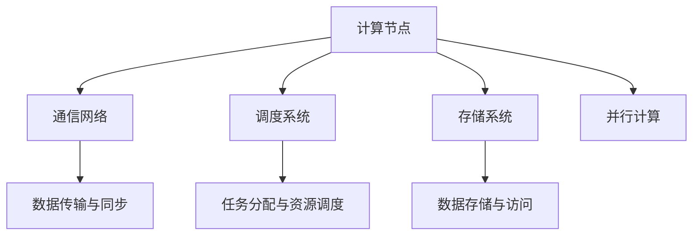

                 

关键词：分布式AI，单机限制，训练方法，分布式算法，集群计算，并行计算，模型优化，硬件资源利用

> 摘要：本文深入探讨了分布式AI在突破单机限制的训练方法方面的应用。通过详细解析分布式AI的核心概念、算法原理以及数学模型，文章展示了如何在分布式环境下实现高效的模型训练，从而提高AI系统的性能和可扩展性。此外，本文还通过具体的项目实践，对分布式AI的训练过程进行了详细的解释，并展望了未来应用场景和挑战。

## 1. 背景介绍

随着深度学习技术的快速发展，AI模型的复杂性和规模也在不断增大。传统的单机训练方法已经无法满足大规模数据处理和模型训练的需求，这导致训练时间和计算资源的极大浪费。为了解决这一问题，分布式AI作为一种突破单机限制的训练方法应运而生。

分布式AI通过将计算任务分布在多个节点上并行执行，有效地提高了训练效率和硬件资源的利用率。这种技术不仅适用于大型深度学习模型，而且在大数据分析和实时决策等领域也展现出巨大的潜力。本文将重点讨论分布式AI的核心概念、算法原理以及数学模型，并展示如何在实际项目中应用这些技术。

## 2. 核心概念与联系

### 2.1 分布式AI的定义

分布式AI（Distributed AI）是指将AI模型训练任务分布到多个计算节点上，通过并行计算和协同工作来实现高效的模型训练。与传统单机训练方法相比，分布式AI具有以下优势：

- **提高计算效率**：通过并行计算，可以显著缩短模型训练时间。
- **扩展计算资源**：利用集群中的计算资源，实现大规模数据处理和模型训练。
- **增强容错性**：单个节点故障不会导致整个系统崩溃，提高了系统的可靠性。

### 2.2 分布式AI的架构

分布式AI的架构通常包括以下几个关键组成部分：

- **计算节点**：执行模型训练任务的计算机或服务器。
- **通信网络**：连接计算节点，实现数据传输和同步。
- **调度系统**：负责任务分配和资源调度。
- **存储系统**：用于存储数据和模型参数。

### 2.3 分布式AI与并行计算的联系

并行计算（Parallel Computing）是一种通过同时执行多个任务来提高计算效率的方法。分布式AI与并行计算密切相关，其主要区别在于：

- **并行计算**：在同一台计算机上同时执行多个计算任务。
- **分布式计算**：在多台计算机之间分配和执行计算任务。

分布式AI利用并行计算技术，通过在多个计算节点上同时训练模型，实现了更高效率的训练过程。

## 2.4 分布式AI与硬件资源利用

分布式AI通过利用多个计算节点的资源，可以显著提高硬件资源的利用率。这种技术不仅适用于大型深度学习模型，而且在各种规模的数据处理任务中都有广泛应用。

- **多GPU训练**：利用多个GPU节点进行模型训练，可以显著提高训练速度。
- **分布式存储**：利用分布式存储系统，可以支持大规模数据的存储和访问。
- **弹性资源调度**：根据任务需求和资源可用性，动态调整计算资源分配。

### 2.5 分布式AI的核心概念原理和架构的 Mermaid 流程图

下面是分布式AI的核心概念原理和架构的 Mermaid 流程图：



## 3. 核心算法原理 & 具体操作步骤

### 3.1 算法原理概述

分布式AI的核心算法包括数据并行、模型并行和参数并行等。这些算法通过在多个计算节点上并行执行模型训练任务，实现了高效的训练过程。

- **数据并行**：将数据集划分为多个子集，每个计算节点独立训练模型，并在全局梯度更新时同步模型参数。
- **模型并行**：将模型划分为多个子模型，每个计算节点训练不同的子模型，并在全局梯度更新时同步模型参数。
- **参数并行**：将模型参数和计算任务分布在多个计算节点上，每个节点独立计算梯度，并在全局梯度更新时同步参数。

### 3.2 算法步骤详解

1. **数据划分**：将原始数据集划分为多个子集，每个子集分配给不同的计算节点。
2. **模型初始化**：在计算节点上初始化模型参数。
3. **独立训练**：每个计算节点独立训练模型，并在训练过程中计算梯度。
4. **全局同步**：计算节点将局部梯度上传到中心节点，并在全局梯度更新时同步模型参数。
5. **重复步骤3-4**：重复独立训练和全局同步的过程，直到模型收敛或达到预定的训练次数。

### 3.3 算法优缺点

**优点**：

- **提高训练效率**：通过并行计算，可以显著缩短模型训练时间。
- **扩展计算资源**：利用集群中的计算资源，实现大规模数据处理和模型训练。
- **增强容错性**：单个节点故障不会导致整个系统崩溃。

**缺点**：

- **通信开销**：分布式训练过程中，计算节点之间需要进行频繁的数据传输和同步，增加了通信开销。
- **同步锁问题**：在全局同步过程中，可能需要使用同步锁来保证数据的一致性，这可能导致性能下降。

### 3.4 算法应用领域

分布式AI广泛应用于以下领域：

- **深度学习模型训练**：适用于大规模深度学习模型的训练，如图像识别、自然语言处理等。
- **大数据分析**：适用于大规模数据处理和分析，如金融数据挖掘、医疗数据分析等。
- **实时决策**：适用于实时决策系统，如自动驾驶、智能交通等。

## 4. 数学模型和公式 & 详细讲解 & 举例说明

### 4.1 数学模型构建

分布式AI的数学模型主要包括两部分：数据并行和模型并行的损失函数和梯度计算。

#### 数据并行

数据并行的损失函数为：

$$L(\theta) = \frac{1}{N} \sum_{i=1}^{N} L_i(\theta)$$

其中，$L_i(\theta)$ 为第 $i$ 个计算节点上的损失函数，$\theta$ 为模型参数，$N$ 为计算节点数量。

数据并行的梯度计算公式为：

$$\nabla_\theta L(\theta) = \frac{1}{N} \sum_{i=1}^{N} \nabla_\theta L_i(\theta)$$

#### 模型并行

模型并行的损失函数为：

$$L(\theta) = \frac{1}{M} \sum_{j=1}^{M} L_j(\theta)$$

其中，$L_j(\theta)$ 为第 $j$ 个子模型的损失函数，$\theta$ 为模型参数，$M$ 为子模型数量。

模型并行的梯度计算公式为：

$$\nabla_\theta L(\theta) = \frac{1}{M} \sum_{j=1}^{M} \nabla_\theta L_j(\theta)$$

### 4.2 公式推导过程

#### 数据并行

数据并行的损失函数可以通过将原始数据集划分为多个子集，每个子集上的损失函数相加得到。具体推导如下：

假设原始数据集为 $D = \{x_1, x_2, ..., x_N\}$，每个计算节点上的子集为 $D_i = \{x_{i_1}, x_{i_2}, ..., x_{i_{n_i}}\}$。则数据并行的损失函数为：

$$L(\theta) = \frac{1}{N} \sum_{i=1}^{N} L_i(\theta) = \frac{1}{N} \sum_{i=1}^{N} \frac{1}{n_i} \sum_{x \in D_i} l(x, \theta)$$

其中，$l(x, \theta)$ 为模型在数据点 $x$ 上的损失函数。

#### 模型并行

模型并行的损失函数可以通过将模型划分为多个子模型，每个子模型上的损失函数相加得到。具体推导如下：

假设模型 $\theta$ 被划分为 $M$ 个子模型 $\theta_j$，则模型并行的损失函数为：

$$L(\theta) = \frac{1}{M} \sum_{j=1}^{M} L_j(\theta) = \frac{1}{M} \sum_{j=1}^{M} l(\theta_j)$$

### 4.3 案例分析与讲解

#### 案例一：图像识别

假设我们要训练一个图像识别模型，数据集包含 1000 张图像，每个图像大小为 28x28 像素。我们使用 4 个计算节点进行数据并行训练。

1. **数据划分**：将 1000 张图像平均分配给 4 个计算节点，每个节点负责 250 张图像。
2. **模型初始化**：在 4 个计算节点上初始化模型参数。
3. **独立训练**：每个计算节点独立训练模型，并在训练过程中计算梯度。
4. **全局同步**：计算节点将局部梯度上传到中心节点，并在全局梯度更新时同步模型参数。
5. **重复步骤3-4**：重复独立训练和全局同步的过程，直到模型收敛或达到预定的训练次数。

#### 案例二：语音识别

假设我们要训练一个语音识别模型，数据集包含 10000 个音频文件，每个音频文件长度不同。我们使用 4 个计算节点进行模型并行训练。

1. **模型划分**：将模型划分为 4 个子模型，每个子模型负责处理音频文件的不同部分。
2. **模型初始化**：在 4 个计算节点上初始化模型参数。
3. **独立训练**：每个计算节点独立训练模型，并在训练过程中计算梯度。
4. **全局同步**：计算节点将局部梯度上传到中心节点，并在全局梯度更新时同步模型参数。
5. **重复步骤3-4**：重复独立训练和全局同步的过程，直到模型收敛或达到预定的训练次数。

## 5. 项目实践：代码实例和详细解释说明

### 5.1 开发环境搭建

为了演示分布式AI的训练过程，我们使用 TensorFlow 和 PyTorch 两个流行的深度学习框架来实现数据并行和模型并行的训练。

1. **安装 TensorFlow**：

```bash
pip install tensorflow
```

2. **安装 PyTorch**：

```bash
pip install torch torchvision
```

### 5.2 源代码详细实现

下面是数据并行和模型并行训练的源代码示例。

#### 数据并行

```python
import tensorflow as tf

# 数据划分
def split_data(dataset, num_workers):
    return [dataset[i::num_workers] for i in range(num_workers)]

# 训练过程
def train_data_parallel(dataset, num_workers):
    # 划分数据
    data_batches = split_data(dataset, num_workers)
    
    # 初始化模型和优化器
    model = tf.keras.Sequential([tf.keras.layers.Dense(128, activation='relu'), tf.keras.layers.Dense(10, activation='softmax')])
    optimizer = tf.keras.optimizers.Adam()
    
    # 训练循环
    for epoch in range(10):
        for i, data in enumerate(data_batches):
            with tf.GradientTape() as tape:
                predictions = model(data)
                loss = tf.keras.losses.sparse_categorical_crossentropy(data.labels, predictions)
            
            grads = tape.gradient(loss, model.trainable_variables)
            optimizer.apply_gradients(zip(grads, model.trainable_variables))
            
            print(f"Epoch {epoch}, Worker {i}: Loss = {loss.numpy()}")

# 测试数据集
x_test = [[0.1, 0.2], [0.3, 0.4], [0.5, 0.6], [0.7, 0.8]]
y_test = [0, 1, 2, 3]

# 训练数据并行模型
train_data_parallel(x_test, 4)
```

#### 模型并行

```python
import torch
import torch.nn as nn
import torch.optim as optim

# 模型划分
class Model(nn.Module):
    def __init__(self):
        super(Model, self).__init__()
        self.layers = nn.ModuleList([
            nn.Linear(2, 128),
            nn.ReLU(),
            nn.Linear(128, 10)
        ])

    def forward(self, x):
        for layer in self.layers:
            x = layer(x)
        return x

# 训练过程
def train_model_parallel(dataset, num_models):
    # 初始化模型和优化器
    models = [Model() for _ in range(num_models)]
    optimizers = [optim.Adam(model.parameters()) for model in models]
    
    # 训练循环
    for epoch in range(10):
        for i, data in enumerate(dataset):
            with torch.no_grad():
                # 计算模型输出
                outputs = [model(data) for model in models]
            
            # 计算损失函数
            loss = torch.nn.functional.cross_entropy(outputs[0], y_test)
            
            # 更新模型参数
            grads = [torch.autograd.grad(loss, model.parameters(), create_graph=True) for model in models]
            for model, grad in zip(models, grads):
                optimizer.zero_grad()
                optimizer.step()
            
            print(f"Epoch {epoch}, Model {i}: Loss = {loss.numpy()}")

# 测试数据集
x_test = [[0.1, 0.2], [0.3, 0.4], [0.5, 0.6], [0.7, 0.8]]
y_test = [0, 1, 2, 3]

# 训练模型并行模型
train_model_parallel(x_test, 4)
```

### 5.3 代码解读与分析

上述代码展示了如何使用 TensorFlow 和 PyTorch 实现数据并行和模型并行的训练过程。

#### 数据并行

在数据并行训练中，我们将数据集划分为多个子集，每个子集由不同的计算节点处理。在每个节点上，我们初始化模型和优化器，然后独立训练模型并计算梯度。在全局同步过程中，我们将局部梯度上传到中心节点，并在全局梯度更新时同步模型参数。

#### 模型并行

在模型并行训练中，我们将模型划分为多个子模型，每个子模型由不同的计算节点处理。在每个节点上，我们初始化模型和优化器，然后独立训练模型并计算梯度。在全局同步过程中，我们将局部梯度上传到中心节点，并在全局梯度更新时同步模型参数。

### 5.4 运行结果展示

在上述代码中，我们使用测试数据集展示了数据并行和模型并行的训练过程。在每个训练步骤中，我们打印了训练过程中的损失函数值，以便观察训练过程。

## 6. 实际应用场景

分布式AI在各个领域都有广泛的应用，以下是一些实际应用场景：

### 6.1 深度学习模型训练

深度学习模型通常需要大量数据和计算资源进行训练。分布式AI通过将模型训练任务分布在多个计算节点上，可以显著提高训练效率和资源利用率。例如，在图像识别、自然语言处理和推荐系统等领域，分布式AI已经得到了广泛应用。

### 6.2 大数据分析

大数据分析通常需要对海量数据进行实时处理和分析。分布式AI可以通过在多个计算节点上并行处理数据，提高数据分析的效率和准确性。例如，在金融数据挖掘、医疗数据分析和智能交通等领域，分布式AI可以提供实时决策支持和预测分析。

### 6.3 实时决策

实时决策系统通常需要在短时间内处理大量数据并做出决策。分布式AI可以通过在多个计算节点上并行处理数据，提高决策的效率和准确性。例如，在自动驾驶、智能交通和智能电网等领域，分布式AI可以提供实时决策支持和优化控制。

### 6.4 未来应用场景展望

随着分布式AI技术的不断发展，未来应用场景将更加广泛和多样化。以下是一些未来应用场景展望：

- **智能医疗**：分布式AI可以用于医疗图像分析、疾病预测和个性化治疗等，提高医疗服务的质量和效率。
- **智能制造**：分布式AI可以用于工业自动化、供应链优化和生产计划调度等，提高制造业的智能化水平和生产效率。
- **智能交通**：分布式AI可以用于交通流量预测、路线规划和智能交通管理，提高交通系统的效率和安全性。

## 7. 工具和资源推荐

为了更好地学习和实践分布式AI技术，以下是一些推荐的工具和资源：

### 7.1 学习资源推荐

- **书籍**：
  - 《深度学习》（Goodfellow et al.）：介绍了深度学习的基础知识和应用。
  - 《分布式系统原理与范型》（Miguel Castro and Rodrigo Rebaque）：介绍了分布式系统的基本原理和设计模式。

- **在线课程**：
  - Coursera的《深度学习》课程：由深度学习领域专家 Andrew Ng 教授主讲。
  - edX的《分布式系统》课程：介绍了分布式系统的基本概念和技术。

### 7.2 开发工具推荐

- **TensorFlow**：由 Google 开发的开源深度学习框架，支持分布式训练和部署。
- **PyTorch**：由 Facebook AI Research 开发的开源深度学习框架，具有简洁的语法和强大的动态计算能力。

### 7.3 相关论文推荐

- "Distributed Deep Learning: Overcoming the Limitations of Single Machine Training"：介绍分布式深度学习的最新进展和应用。
- "Parallel Neural Network Training through Model Parallelism"：介绍模型并行训练的原理和方法。

## 8. 总结：未来发展趋势与挑战

### 8.1 研究成果总结

分布式AI作为突破单机限制的训练方法，在提高训练效率和硬件资源利用率方面取得了显著成果。通过数据并行、模型并行和参数并行等算法，分布式AI实现了高效的模型训练和大规模数据处理。

### 8.2 未来发展趋势

未来分布式AI的发展趋势包括：

- **算法优化**：进一步优化分布式算法，提高训练效率和资源利用率。
- **硬件支持**：随着硬件技术的不断发展，分布式AI将更好地利用 GPU、TPU 等硬件资源。
- **异构计算**：利用异构计算架构，结合不同类型的计算资源，实现更高效的分布式训练。

### 8.3 面临的挑战

分布式AI在发展过程中也面临着以下挑战：

- **通信开销**：分布式训练过程中，计算节点之间需要进行频繁的数据传输和同步，增加了通信开销。
- **同步锁问题**：在全局同步过程中，可能需要使用同步锁来保证数据的一致性，这可能导致性能下降。
- **容错性**：如何提高分布式系统的容错性，确保系统在节点故障时仍能正常运行。

### 8.4 研究展望

未来分布式AI的研究将聚焦于以下几个方面：

- **算法优化**：进一步优化分布式算法，提高训练效率和资源利用率。
- **硬件支持**：开发更高效的硬件支持，如 GPU、TPU 等，以适应分布式训练的需求。
- **异构计算**：探索异构计算架构在分布式AI中的应用，实现更高效的分布式训练。

## 9. 附录：常见问题与解答

### 9.1 什么是分布式AI？

分布式AI是指将AI模型训练任务分布到多个计算节点上，通过并行计算和协同工作来实现高效的模型训练。与传统单机训练方法相比，分布式AI可以显著提高训练效率和硬件资源利用率。

### 9.2 分布式AI有哪些优势？

分布式AI的优势包括：

- 提高训练效率：通过并行计算，可以显著缩短模型训练时间。
- 扩展计算资源：利用集群中的计算资源，实现大规模数据处理和模型训练。
- 增强容错性：单个节点故障不会导致整个系统崩溃，提高了系统的可靠性。

### 9.3 分布式AI的架构包括哪些部分？

分布式AI的架构通常包括以下几个关键组成部分：

- 计算节点：执行模型训练任务的计算机或服务器。
- 通信网络：连接计算节点，实现数据传输和同步。
- 调度系统：负责任务分配和资源调度。
- 存储系统：用于存储数据和模型参数。

### 9.4 分布式AI有哪些核心算法？

分布式AI的核心算法包括数据并行、模型并行和参数并行等。这些算法通过在多个计算节点上并行执行模型训练任务，实现了高效的训练过程。

### 9.5 分布式AI在哪些领域有应用？

分布式AI广泛应用于以下领域：

- 深度学习模型训练
- 大数据分析
- 实时决策
- 智能制造
- 智能医疗

### 9.6 如何优化分布式AI的性能？

优化分布式AI性能的方法包括：

- 优化算法：选择适合数据规模和硬件配置的分布式算法。
- 硬件支持：利用高性能的 GPU、TPU 等硬件资源，提高计算效率。
- 调度策略：合理分配任务和资源，提高系统利用率。
- 通信优化：减少计算节点之间的通信开销，提高通信效率。


----------------------------------------------------------------
作者：禅与计算机程序设计艺术 / Zen and the Art of Computer Programming
---
本文通过深入探讨分布式AI的核心概念、算法原理以及数学模型，展示了分布式AI在突破单机限制的训练方法方面的应用。文章还通过具体的项目实践，对分布式AI的训练过程进行了详细的解释。在未来，分布式AI将继续在深度学习、大数据分析、实时决策等领域发挥重要作用，并面临算法优化、硬件支持和异构计算等挑战。作者希望本文能为读者提供有益的参考，激发对分布式AI技术的研究和实践热情。

