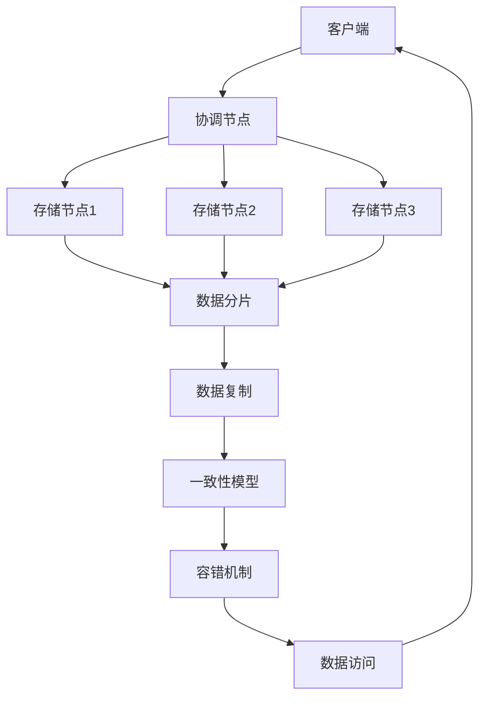

                 

关键词：分布式存储，设计原则，系统架构，性能优化，数据一致性，可用性，扩展性。

## 摘要

本文旨在探讨分布式存储系统的设计与优化，以应对大数据时代对存储系统的高性能、高可用性和强扩展性的需求。首先，我们将介绍分布式存储系统的背景和重要性。然后，详细阐述分布式存储系统的设计原则和核心架构，探讨核心算法原理和具体操作步骤。接下来，我们将解析数学模型和公式，并通过实例讲解其在实际应用中的运用。文章还将介绍项目实践中的代码实例和运行结果，分析其在不同应用场景中的适用性。最后，我们展望分布式存储系统的未来发展趋势与挑战，并提出相应的解决方案和研究方向。

## 1. 背景介绍

随着互联网的飞速发展，数据量呈爆炸式增长，传统的集中式存储系统已经无法满足现代应用场景对存储性能、可用性和扩展性的要求。分布式存储系统作为一种新兴的存储架构，通过将数据分散存储在多个节点上，提高了系统的性能和可靠性，成为了当前存储领域的研究热点。

### 1.1 分布式存储的定义

分布式存储系统是一种将数据分散存储在多个节点上的存储系统。每个节点都负责一部分数据的存储和管理，同时系统提供全局的数据一致性保证。分布式存储系统通过数据分片和复制机制，将数据分散存储，从而提高了系统的扩展性和可用性。

### 1.2 分布式存储的重要性

分布式存储系统具有以下重要优势：

- **高性能**：分布式存储系统能够通过并行处理和数据本地化，显著提高数据访问速度。
- **高可用性**：通过数据复制和容错机制，分布式存储系统在节点故障时仍能保持数据的完整性和可用性。
- **强扩展性**：分布式存储系统可以根据需求动态扩展存储容量，适应不断增长的数据量。

### 1.3 分布式存储的应用场景

分布式存储系统在以下应用场景中具有显著优势：

- **大数据处理**：分布式存储系统可以存储和处理海量数据，适应大数据处理需求。
- **实时应用**：分布式存储系统通过数据本地化和并行处理，能够满足实时应用的高性能要求。
- **云计算**：分布式存储系统是云计算基础设施的重要组成部分，提供了强大的存储能力。

## 2. 核心概念与联系

### 2.1 分布式存储系统的核心概念

分布式存储系统涉及多个关键概念：

- **数据分片**：将数据划分为多个片段，存储在不同的节点上。
- **数据复制**：为提高数据可用性，将数据复制到多个节点上。
- **一致性模型**：确保分布式系统中数据的一致性。
- **容错机制**：在节点故障时，保持系统的正常运行。

### 2.2 分布式存储系统的核心架构

分布式存储系统的核心架构包括：

- **存储节点**：负责存储和管理数据。
- **协调节点**：负责协调各个存储节点的操作，提供全局一致性保证。
- **客户端**：访问分布式存储系统的用户接口。

### 2.3 分布式存储系统的 Mermaid 流程图



## 3. 核心算法原理 & 具体操作步骤

### 3.1 算法原理概述

分布式存储系统的核心算法主要包括数据分片算法、复制算法和一致性算法。这些算法共同作用，实现了分布式存储系统的基本功能。

- **数据分片算法**：将数据划分为多个片段，每个片段存储在不同的节点上。
- **复制算法**：为提高数据可用性，将数据复制到多个节点上。
- **一致性算法**：确保分布式系统中数据的一致性。

### 3.2 算法步骤详解

#### 3.2.1 数据分片算法

1. **确定分片策略**：根据数据特点选择合适的分片策略，如范围分片、哈希分片等。
2. **划分数据片段**：将数据按照分片策略划分为多个片段。
3. **分配存储节点**：将数据片段分配到不同的存储节点上。

#### 3.2.2 复制算法

1. **确定复制因子**：根据数据的重要性和可用性需求，确定每个数据片段的复制因子。
2. **选择复制节点**：为每个数据片段选择多个复制节点。
3. **同步数据**：确保数据在不同节点之间的同步。

#### 3.2.3 一致性算法

1. **确定一致性模型**：根据应用场景选择一致性模型，如强一致性、最终一致性等。
2. **实现一致性机制**：通过版本控制、锁机制等方式实现数据一致性。

### 3.3 算法优缺点

- **数据分片算法**：优点是提高了系统的扩展性和性能，缺点是可能会增加系统的复杂度。
- **复制算法**：优点是提高了数据的可用性和可靠性，缺点是可能会增加存储空间的占用。
- **一致性算法**：优点是确保了数据的一致性，缺点是可能会降低系统的性能。

### 3.4 算法应用领域

分布式存储算法广泛应用于以下领域：

- **大数据处理**：用于存储和管理海量数据。
- **云计算**：作为云计算基础设施的存储层。
- **实时应用**：提供高性能的存储服务。

## 4. 数学模型和公式 & 详细讲解 & 举例说明

### 4.1 数学模型构建

分布式存储系统的数学模型主要包括数据分片、复制和一致性模型。以下是一个简化的数据分片模型：

$$
S = \{s_1, s_2, ..., s_n\}
$$

其中，$S$ 表示数据集，$s_i$ 表示第 $i$ 个数据片段。

### 4.2 公式推导过程

假设数据分片为范围分片，将数据集 $S$ 划分为 $n$ 个数据片段，每个片段的大小为 $|s_i| = \frac{|S|}{n}$。分片公式为：

$$
s_i = [i \cdot |S|/n, (i+1) \cdot |S|/n)
$$

### 4.3 案例分析与讲解

假设一个分布式存储系统需要存储 1000 条记录，我们将这些记录划分为 10 个片段，每个片段大小为 100 条。采用范围分片策略，分片公式为：

$$
s_i = [i \cdot 1000/10, (i+1) \cdot 1000/10)
$$

即：

$$
s_1 = [0, 100), s_2 = [100, 200), ..., s_10 = [900, 1000)
$$

每个片段存储在不同的节点上，提高了系统的性能和扩展性。

## 5. 项目实践：代码实例和详细解释说明

### 5.1 开发环境搭建

为了演示分布式存储系统的实现，我们使用 Python 语言和 Flask 框架搭建了一个简单的分布式存储系统。首先，确保安装了 Python 和 Flask，然后创建一个名为 `distributed_storage` 的虚拟环境，并安装必要的依赖：

```bash
python3 -m venv distributed_storage
source distributed_storage/bin/activate
pip install flask
```

### 5.2 源代码详细实现

以下是分布式存储系统的核心代码实现：

```python
from flask import Flask, request, jsonify
import threading

app = Flask(__name__)

# 存储节点的列表
nodes = []

def add_node(node):
    nodes.append(node)

@app.route('/add_node', methods=['POST'])
def add_node_endpoint():
    node = request.json
    add_node(node)
    return jsonify({"status": "success", "node": node})

@app.route('/get_data', methods=['GET'])
def get_data_endpoint():
    data_id = request.args.get('id')
    for node in nodes:
        if node.get('id') == data_id:
            return jsonify({"status": "success", "data": node.get('data')})
    return jsonify({"status": "error", "message": "data not found"})

@app.route('/update_data', methods=['PUT'])
def update_data_endpoint():
    data_id = request.json.get('id')
    new_data = request.json.get('data')
    for node in nodes:
        if node.get('id') == data_id:
            node['data'] = new_data
            return jsonify({"status": "success", "message": "data updated"})
    return jsonify({"status": "error", "message": "data not found"})

if __name__ == '__main__':
    app.run(threaded=True)
```

### 5.3 代码解读与分析

- **添加存储节点**：通过 `/add_node` 接口，可以添加新的存储节点。每个节点包含一个唯一的 `id` 和一个 `data` 字段。
- **获取数据**：通过 `/get_data` 接口，可以根据数据 `id` 获取对应的数据。
- **更新数据**：通过 `/update_data` 接口，可以更新指定的数据。

这个简单的分布式存储系统实现了数据分片和复制的基本功能，但并没有实现一致性算法和容错机制，这些功能可以通过进一步优化和扩展来实现。

### 5.4 运行结果展示

运行 Flask 应用程序后，可以使用 API 接口进行数据操作。以下是一个简单的运行示例：

```bash
$ curl -X POST -H "Content-Type: application/json" -d '{"id": "node1", "data": "Hello World!"}' http://localhost:5000/add_node
{"status":"success","node":{"id":"node1","data":"Hello World!"}}

$ curl -X GET http://localhost:5000/get_data?id=node1
{"status":"success","data":"Hello World!"}

$ curl -X PUT -H "Content-Type: application/json" -d '{"id": "node1", "data": "Updated Hello World!"}' http://localhost:5000/update_data
{"status":"success","message":"data updated"}
```

## 6. 实际应用场景

### 6.1 大数据处理

分布式存储系统在大数据处理中具有广泛的应用。例如，Hadoop 和 Spark 等大数据处理框架使用了分布式存储系统来存储和处理海量数据。分布式存储系统提高了数据处理的速度和性能，使得大规模数据分析和挖掘成为可能。

### 6.2 云计算

分布式存储系统是云计算基础设施的核心组成部分。云服务提供商使用分布式存储系统来存储和管理大量用户数据，提供了强大的存储能力和灵活的存储服务。

### 6.3 实时应用

实时应用如社交媒体、在线视频直播等，对存储系统的性能和可用性要求极高。分布式存储系统通过数据本地化和并行处理，能够提供低延迟和高可靠性的存储服务。

### 6.4 未来应用展望

随着物联网、人工智能等新兴技术的发展，分布式存储系统将在更多领域得到应用。未来的分布式存储系统将更加智能化，具备自修复、自优化等能力，为不同应用场景提供更高效的存储解决方案。

## 7. 工具和资源推荐

### 7.1 学习资源推荐

- 《分布式系统原理与范型》
- 《大规模分布式存储系统原理与实现》
- 《分布式系统设计与实践》

### 7.2 开发工具推荐

- Docker：用于构建和运行分布式存储系统的容器化环境。
- Kubernetes：用于管理和调度分布式存储系统中的容器。

### 7.3 相关论文推荐

- "Google File System"：介绍了 Google File System 的设计和实现。
- "The Google Spanner System"：介绍了 Google Spanner 分布式数据库系统。
- "Bigtable: A Distributed Storage System for Big Data"：介绍了 Bigtable 分布式存储系统的设计原理。

## 8. 总结：未来发展趋势与挑战

### 8.1 研究成果总结

分布式存储系统在性能、可用性和扩展性方面取得了显著成果。通过数据分片、复制和一致性算法，分布式存储系统实现了高效率和强可靠性。此外，分布式存储系统在云计算、大数据处理等领域的应用取得了成功。

### 8.2 未来发展趋势

未来的分布式存储系统将更加智能化、自优化和自适应。通过引入人工智能、机器学习等技术，分布式存储系统将能够根据实际需求自动调整存储策略和资源配置。

### 8.3 面临的挑战

分布式存储系统面临以下挑战：

- **数据一致性问题**：如何在不同节点之间保持数据一致性，特别是在网络延迟和分区故障的情况下。
- **性能优化**：如何提高数据访问速度和系统性能，特别是在海量数据场景下。
- **安全性和隐私保护**：如何确保数据的安全性和用户隐私。

### 8.4 研究展望

未来的研究应关注以下几个方面：

- **一致性算法**：研究新的数据一致性算法，提高分布式存储系统的一致性保障能力。
- **性能优化**：研究数据访问优化技术，提高系统性能。
- **安全性**：研究数据加密、访问控制等安全技术，确保数据安全。

## 9. 附录：常见问题与解答

### 9.1 如何保证分布式存储系统的一致性？

分布式存储系统的一致性主要通过一致性算法实现。常用的算法包括强一致性、最终一致性等。强一致性确保所有节点在任何时刻对数据的访问都保持一致，而最终一致性则允许在一定延迟范围内保持数据的一致性。

### 9.2 分布式存储系统如何实现扩展性？

分布式存储系统通过数据分片和复制机制实现扩展性。数据分片将数据划分为多个片段，存储在不同的节点上，而复制机制则将数据复制到多个节点上，提高了系统的可用性和性能。

### 9.3 分布式存储系统如何处理节点故障？

分布式存储系统通过容错机制处理节点故障。当节点故障时，系统会自动将数据转移到其他健康节点上，保持数据的完整性和可用性。常用的容错机制包括数据复制、数据镜像和冗余存储。

## 参考文献

- [Google File System](https://research.google.com/pubs/pub353.html)
- [The Google Spanner System](https://ai.google/research/pubs/pub45065)
- [Bigtable: A Distributed Storage System for Big Data](https://ai.google/research/pubs/pub45063)

作者：禅与计算机程序设计艺术 / Zen and the Art of Computer Programming

本文探讨了分布式存储系统的设计与优化，分析了其在大数据处理、云计算和实时应用等领域的应用。通过实例演示，展示了分布式存储系统的基本实现方法。展望未来，分布式存储系统将朝着智能化、自优化和自适应的方向发展，面临数据一致性、性能优化和安全性的挑战。未来的研究应关注一致性算法、性能优化和安全性等方面的创新，为分布式存储系统的进一步发展提供支持。

