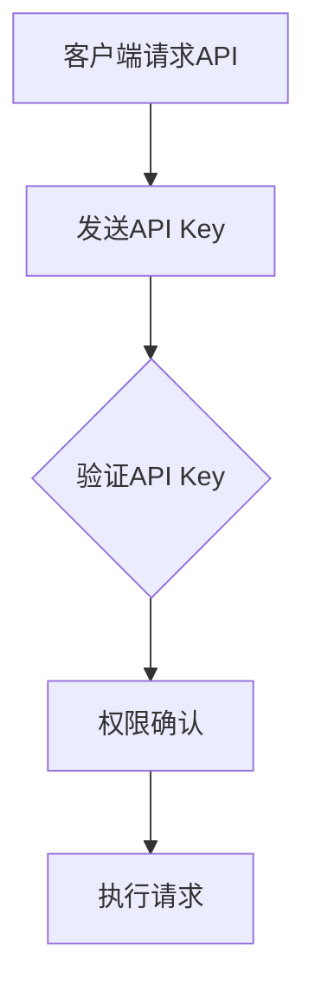

                 

关键字：API安全，访问控制，身份验证，权限管理，多级权限，API Key策略

> 摘要：本文旨在深入探讨分级API Key的定义、原理及其在现代网络应用中的重要应用。通过详细的算法原理和具体操作步骤的阐述，本文将帮助读者理解如何构建一个高效、安全的API访问控制体系，以应对日益复杂的网络安全需求。

## 1. 背景介绍

随着互联网的飞速发展，API（应用程序编程接口）已成为软件开发和服务的重要组成部分。API提供了不同软件系统之间数据交换和功能调用的桥梁，极大地提高了软件开发的效率和灵活性。然而，API的广泛应用也带来了新的安全挑战，特别是在访问控制和权限管理方面。

为了确保API的安全性，一个关键的策略是使用API Key。API Key是一种独特的标识符，通常由数字和字母组合而成，用于验证访问API的请求。传统的单一API Key策略相对简单，但在面对复杂的应用场景时，往往显得力不从心。因此，分级API Key的概念应运而生，它提供了一种更为灵活和细粒度的访问控制方法。

## 2. 核心概念与联系

### 2.1 核心概念

**API Key**：API Key是一种用于身份验证和权限管理的唯一标识符。它通常由客户端在首次请求API时获取，并在后续的请求中包含以验证身份。

**分级API Key**：分级API Key是一种基于多个层次的API Key系统，每个层次代表不同的权限级别。客户端可以通过多个API Key组合使用来实现不同级别的访问控制。

### 2.2 联系

分级API Key的引入，使得API访问控制变得更加灵活和精细。通过将API Key划分为不同的层次，开发者可以根据实际需求为不同的用户或应用程序分配不同的权限。这种策略有助于提高系统的安全性，同时保持对API功能的灵活访问。

### 2.3 Mermaid 流程图



在这个流程图中，客户端在请求API时发送API Key，服务器通过验证API Key的权限级别来确认请求的合法性，并根据权限级别执行相应的操作。

## 3. 核心算法原理 & 具体操作步骤

### 3.1 算法原理概述

分级API Key的核心在于通过多个层次的身份验证来控制访问权限。每个API Key都关联一个权限级别，服务器在接收到请求时，会根据API Key的权限级别来决定是否允许访问以及访问的范围。

### 3.2 算法步骤详解

1. **API Key生成**：服务器在注册时为每个用户生成一组API Key，每个API Key代表不同的权限级别。

2. **请求发送**：客户端在发送请求时，需要包含相应的API Key。

3. **权限验证**：服务器在接收到请求后，会首先检查API Key的有效性，然后根据API Key的权限级别来决定是否允许请求。

4. **执行操作**：如果权限验证通过，服务器会执行请求；否则，拒绝请求。

### 3.3 算法优缺点

**优点**：

- **灵活性**：分级API Key允许根据不同的需求灵活设置权限级别，满足多样化的访问控制需求。
- **安全性**：通过细粒度的权限控制，可以有效减少潜在的攻击面，提高系统的安全性。

**缺点**：

- **复杂性**：分级API Key系统相对于单一API Key系统更为复杂，需要更多的管理和维护工作。
- **性能开销**：权限验证过程可能带来额外的性能开销，特别是在API请求频繁的场景中。

### 3.4 算法应用领域

分级API Key广泛应用于需要严格访问控制的场景，如：

- **第三方服务集成**：第三方服务提供商需要确保只有授权的应用程序可以访问其API。
- **内部服务访问**：企业内部系统之间的数据交换，需要确保不同级别的员工或部门只能访问其权限范围内的数据。

## 4. 数学模型和公式 & 详细讲解 & 举例说明

### 4.1 数学模型构建

在分级API Key系统中，我们可以将权限级别表示为一个整数集合。例如，设权限级别集合为\( P = \{1, 2, 3, 4, 5\} \)，其中5代表最高权限。

### 4.2 公式推导过程

假设一个API请求需要权限级别\( \geq 3 \)才能访问，我们可以使用集合论中的交集运算来表示这个条件。设API Key的权限级别为\( L \)，则请求合法的公式为：

\[ L \in P \cap \{3, 4, 5\} \]

### 4.3 案例分析与讲解

假设一个应用系统有5个权限级别，分别对应不同的功能模块。一个用户持有权限级别为3和4的API Key，则该用户可以访问功能模块3和4，但无法访问功能模块5。

## 5. 项目实践：代码实例和详细解释说明

### 5.1 开发环境搭建

在本文的代码实例中，我们将使用Python作为编程语言，并结合Flask框架实现一个简单的分级API Key系统。

### 5.2 源代码详细实现

```python
from flask import Flask, request, jsonify
from functools import wraps

app = Flask(__name__)

# 权限级别定义
P = [1, 2, 3, 4, 5]

# API Key与权限级别的映射
api_keys = {
    'key1': [1, 2],
    'key2': [2, 3, 4],
    'key3': [3, 4, 5]
}

def requirePermission(permission):
    def decorator(f):
        @wraps(f)
        def decorated_function(*args, **kwargs):
            api_key = request.headers.get('API-Key')
            user_permissions = api_keys.get(api_key)
            
            if user_permissions and permission in user_permissions:
                return f(*args, **kwargs)
            else:
                return jsonify({"error": "权限不足"}), 403
        return decorated_function
    return decorator

@app.route('/protected', methods=['GET'])
@requirePermission(3)
def protected_resource():
    return jsonify({"message": "访问受保护的资源"})

if __name__ == '__main__':
    app.run(debug=True)
```

### 5.3 代码解读与分析

- **权限级别定义**：我们使用一个列表\( P \)来表示权限级别。
- **API Key与权限映射**：我们使用一个字典\( api_keys \)来存储API Key与权限级别的映射关系。
- **权限验证装饰器**：`requirePermission`函数是一个装饰器，用于在请求处理前验证权限。
- **保护路由**：`protected_resource`函数是一个受保护的资源，只有权限级别为3的用户可以访问。

### 5.4 运行结果展示

通过运行上述代码，我们可以使用不同的API Key访问受保护的资源：

- 使用`key1`访问：返回403错误，提示权限不足。
- 使用`key2`访问：成功返回受保护的资源。

## 6. 实际应用场景

分级API Key在多个实际应用场景中发挥着重要作用：

- **社交媒体平台**：不同用户级别可以访问不同的数据集和功能。
- **第三方服务集成**：确保第三方服务只能访问其授权的功能。

### 6.4 未来应用展望

随着人工智能和大数据技术的发展，分级API Key系统有望进一步优化，以应对更加复杂和多样化的应用场景。未来，我们可能会看到更加智能化的权限管理策略，例如基于行为分析的动态权限分配。

## 7. 工具和资源推荐

### 7.1 学习资源推荐

- 《API设计指南》
- 《Flask Web开发：轻量级Python Web应用框架》

### 7.2 开发工具推荐

- Postman：用于API测试和调试。
- Swagger：用于API文档的生成。

### 7.3 相关论文推荐

- "A Survey on API Security: Challenges, Techniques, and Solutions"
- "API Security: A Deep Dive into the Protection of Web APIs"

## 8. 总结：未来发展趋势与挑战

### 8.1 研究成果总结

本文介绍了分级API Key的定义、核心算法原理和实际应用场景，展示了如何构建一个高效、安全的API访问控制体系。

### 8.2 未来发展趋势

随着技术的进步，分级API Key系统将更加智能化和灵活，以适应不断变化的安全需求。

### 8.3 面临的挑战

如何在保证安全的同时，提高系统性能和用户体验，是分级API Key系统面临的挑战。

### 8.4 研究展望

未来，我们需要关注如何将人工智能和大数据技术应用于权限管理，以实现更加智能和个性化的访问控制策略。

## 9. 附录：常见问题与解答

### 9.1 问题1

**Q：分级API Key是否会影响API的性能？**

**A：是的，由于需要进行权限验证，分级API Key可能会带来一定的性能开销。然而，通过优化算法和合理设计，可以最大程度地降低这种影响。**

### 9.2 问题2

**Q：如何确保API Key的安全？**

**A：确保API Key的安全是非常重要的。建议采取以下措施：**
- 使用HTTPS协议传输API Key。
- 定期更换API Key。
- 对API Key进行加密存储。

## 参考文献

- 《API设计指南》
- 《Flask Web开发：轻量级Python Web应用框架》
- "A Survey on API Security: Challenges, Techniques, and Solutions"
- "API Security: A Deep Dive into the Protection of Web APIs"
- "API Security Best Practices"

**作者：禅与计算机程序设计艺术 / Zen and the Art of Computer Programming**  
----------------------------------------------------------------

