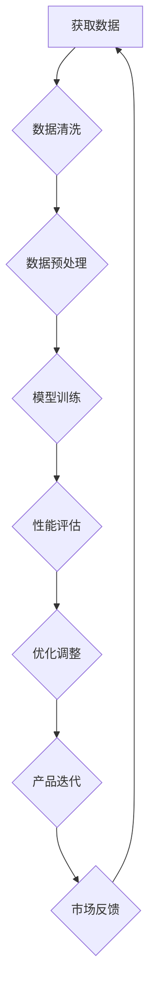

                 

关键词：创业设计、AI 大模型、增强学习、产品设计、用户体验、商业模式、技术前沿

> 摘要：本文将探讨如何在创业产品设计中利用人工智能（AI）大模型来增强产品性能和用户体验。我们将深入分析大模型在产品设计中的应用，介绍关键概念、算法原理、数学模型、具体操作步骤以及实际应用案例。通过本文的阅读，您将了解到如何利用AI大模型为您的创业产品带来颠覆性的创新和竞争优势。

## 1. 背景介绍

在当今快速变化的市场环境中，创业公司面临着巨大的挑战和机遇。一方面，新兴技术的不断涌现为创业公司提供了丰富的创新机遇；另一方面，激烈的市场竞争要求创业公司必须在短时间内提供具有卓越性能和用户体验的产品。人工智能（AI）作为一项颠覆性技术，正逐渐成为推动创业产品设计的重要力量。尤其是近年来，AI 大模型（如 GPT、BERT 等）在自然语言处理、图像识别、语音识别等领域的突破，为创业公司提供了强大的工具和资源。

### 创业产品设计的重要性

创业产品设计不仅是产品开发的核心环节，也是决定产品成败的关键因素。一个优秀的产品设计不仅要满足用户的需求，还需要在功能、性能、用户体验等多个方面达到卓越的水平。以下是创业产品设计的一些关键要素：

1. **市场需求**：了解目标用户的需求和痛点，确保产品设计能够解决实际问题。
2. **用户体验**：注重用户界面的设计，确保用户能够轻松、愉快地使用产品。
3. **技术创新**：利用最新的技术手段提升产品的性能和竞争力。
4. **商业模式**：设计可持续的商业模式，确保产品能够实现盈利。
5. **敏捷开发**：快速响应市场变化，持续优化产品。

### 人工智能大模型的作用

AI 大模型在创业产品设计中的应用具有以下几个显著优势：

1. **提升性能**：大模型通过深度学习技术，能够自动从海量数据中学习，显著提升产品的性能和准确性。
2. **增强用户体验**：大模型可以模拟人类思维，提供更智能、个性化的服务，提升用户满意度。
3. **降低开发成本**：大模型能够自动化完成许多复杂的任务，降低开发成本和时间。
4. **快速迭代**：大模型的学习和优化能力使得产品可以快速迭代，适应市场变化。

## 2. 核心概念与联系

在探讨如何利用 AI 大模型增强创业产品设计之前，我们需要先了解一些关键概念和它们之间的联系。

### 2.1 大模型概念

大模型是指具有大量参数和复杂结构的机器学习模型，如深度神经网络（DNN）。大模型通过训练海量数据来学习，从而能够解决复杂的任务。例如，GPT（生成预训练模型）和BERT（双向编码表示）都是大模型的成功案例。

### 2.2 增强学习概念

增强学习是一种机器学习范式，旨在通过试错和反馈来优化决策过程。增强学习在产品设计中的应用非常广泛，例如个性化推荐、智能客服等。

### 2.3 产品设计与AI的关系

产品设计与 AI 之间的联系主要体现在以下几个方面：

1. **用户体验优化**：AI 可以通过分析用户行为数据，提供个性化的用户体验。
2. **功能增强**：AI 可以自动完成许多复杂的任务，提升产品的功能性和性能。
3. **数据分析**：AI 可以从大量数据中提取有价值的信息，为产品设计和决策提供支持。
4. **快速迭代**：AI 的快速学习能力和自动化能力，使得产品可以快速迭代，适应市场变化。

### 2.4 Mermaid 流程图

以下是 AI 大模型在创业产品设计中的应用流程图：



## 3. 核心算法原理 & 具体操作步骤

### 3.1 算法原理概述

AI 大模型的核心原理是深度学习，特别是基于神经网络的模型。深度学习模型通过多层非线性变换，从输入数据中学习特征表示，从而实现复杂任务的自动识别和预测。

### 3.2 算法步骤详解

1. **数据获取与清洗**：从各种数据源获取原始数据，并进行清洗，去除噪声和缺失值。
2. **数据预处理**：对清洗后的数据进行格式化、归一化等处理，使其适合模型训练。
3. **模型训练**：使用预处理后的数据训练深度学习模型，通过反向传播算法优化模型参数。
4. **性能评估**：使用测试数据评估模型性能，包括准确率、召回率、F1 值等指标。
5. **优化调整**：根据性能评估结果，调整模型结构和参数，以提高性能。
6. **产品迭代**：将优化后的模型集成到产品中，进行实际应用，并收集用户反馈。
7. **再次迭代**：根据用户反馈，不断调整和优化模型，提升产品用户体验。

### 3.3 算法优缺点

**优点**：

1. **高性能**：大模型具有强大的特征提取和表示能力，能够处理复杂的任务。
2. **自动化**：深度学习模型可以自动从数据中学习，降低人工干预的需求。
3. **快速迭代**：大模型的学习和优化过程相对快速，可以快速响应市场变化。

**缺点**：

1. **计算资源消耗**：大模型训练需要大量的计算资源和时间。
2. **数据依赖**：大模型的性能高度依赖于训练数据的质量和数量。
3. **模型解释性**：深度学习模型往往缺乏解释性，难以理解其决策过程。

### 3.4 算法应用领域

AI 大模型在创业产品设计中的应用非常广泛，包括但不限于以下领域：

1. **自然语言处理**：如智能客服、文本分类、机器翻译等。
2. **计算机视觉**：如图像识别、物体检测、图像生成等。
3. **语音识别**：如语音助手、语音合成、语音识别等。
4. **推荐系统**：如个性化推荐、商品推荐、新闻推荐等。

## 4. 数学模型和公式 & 详细讲解 & 举例说明

### 4.1 数学模型构建

在 AI 大模型中，常用的数学模型是深度神经网络（DNN）。DNN 由多个层级组成，包括输入层、隐藏层和输出层。每个层级由多个神经元组成，神经元之间的连接权重通过训练过程自动调整。

### 4.2 公式推导过程

假设我们有一个简单的 DNN 模型，包括一个输入层、一个隐藏层和一个输出层。输入层有 n 个神经元，隐藏层有 m 个神经元，输出层有 k 个神经元。输入向量表示为 x，隐藏层神经元激活函数为 f，输出层神经元激活函数为 g。

1. **输入层到隐藏层的传递**：

   输入层到隐藏层的传递公式为：
   
   $$ z^{(2)}_j = \sum_{i=1}^{n} w^{(2)}_{ji}x_i + b^{(2)}_j $$
   
   其中，$ z^{(2)}_j $ 表示隐藏层第 j 个神经元的输入值，$ w^{(2)}_{ji} $ 表示输入层第 i 个神经元到隐藏层第 j 个神经元的连接权重，$ b^{(2)}_j $ 表示隐藏层第 j 个神经元的偏置。

2. **隐藏层到输出层的传递**：

   隐藏层到输出层的传递公式为：
   
   $$ z^{(3)}_k = \sum_{j=1}^{m} w^{(3)}_{kj}z^{(2)}_j + b^{(3)}_k $$
   
   其中，$ z^{(3)}_k $ 表示输出层第 k 个神经元的输入值，$ w^{(3)}_{kj} $ 表示隐藏层第 j 个神经元到输出层第 k 个神经元的连接权重，$ b^{(3)}_k $ 表示输出层第 k 个神经元的偏置。

### 4.3 案例分析与讲解

假设我们要构建一个分类问题，输入数据为二维特征向量，输出数据为标签。我们将使用上述 DNN 模型进行训练。

1. **数据准备**：

   输入数据集包含 n 个样本，每个样本有 m 个特征。输出标签集包含 n 个标签，每个标签为 {0, 1}。

2. **模型训练**：

   使用随机梯度下降（SGD）算法进行模型训练，训练过程包括以下步骤：

   - 初始化模型参数（$ w^{(2)}_{ji} $，$ w^{(3)}_{kj} $，$ b^{(2)}_j $，$ b^{(3)}_k $）。
   - 计算每个样本的预测值（$ z^{(3)}_k $）。
   - 计算损失函数（如交叉熵损失函数）。
   - 计算梯度。
   - 更新模型参数。

3. **性能评估**：

   使用测试数据集对训练好的模型进行评估，计算模型的准确率、召回率等指标。

4. **模型优化**：

   根据评估结果，调整模型参数，优化模型性能。

## 5. 项目实践：代码实例和详细解释说明

### 5.1 开发环境搭建

1. **硬件环境**：安装 GPU（如 NVIDIA 显卡），以便加速深度学习模型的训练。
2. **软件环境**：安装 Python 3.8 以上版本，以及深度学习框架（如 TensorFlow 或 PyTorch）。

### 5.2 源代码详细实现

以下是一个简单的 DNN 模型训练代码实例（使用 TensorFlow 框架）：

```python
import tensorflow as tf
from tensorflow.keras import layers

# 创建模型
model = tf.keras.Sequential([
    layers.Dense(64, activation='relu', input_shape=(784,)),
    layers.Dense(64, activation='relu'),
    layers.Dense(10, activation='softmax')
])

# 编译模型
model.compile(optimizer='adam',
              loss='categorical_crossentropy',
              metrics=['accuracy'])

# 加载数据
(x_train, y_train), (x_test, y_test) = tf.keras.datasets.mnist.load_data()

# 数据预处理
x_train = x_train.astype('float32') / 255
x_test = x_test.astype('float32') / 255
x_train = x_train.reshape((-1, 784))
x_test = x_test.reshape((-1, 784))

# 转换标签为 one-hot 编码
y_train = tf.keras.utils.to_categorical(y_train, 10)
y_test = tf.keras.utils.to_categorical(y_test, 10)

# 训练模型
model.fit(x_train, y_train, epochs=10, batch_size=128)

# 评估模型
model.evaluate(x_test, y_test)
```

### 5.3 代码解读与分析

1. **模型创建**：使用 `tf.keras.Sequential` 类创建一个序列模型，包括两个隐藏层（每个层 64 个神经元）和一个输出层（10 个神经元）。
2. **模型编译**：设置模型优化器为 `adam`，损失函数为 `categorical_crossentropy`，评估指标为 `accuracy`。
3. **数据加载**：使用 TensorFlow 的 `mnist` 数据集，并对其进行预处理。
4. **模型训练**：使用 `fit` 方法训练模型，设置训练轮次为 10，批次大小为 128。
5. **模型评估**：使用 `evaluate` 方法评估模型在测试数据集上的性能。

## 6. 实际应用场景

### 6.1 自然语言处理

AI 大模型在自然语言处理（NLP）领域具有广泛的应用。例如，使用 GPT 模型可以实现智能客服、文本分类、机器翻译等功能。以下是一个使用 GPT 模型进行文本分类的简单示例：

```python
import tensorflow as tf
from transformers import TFGPT2LMHeadModel, GPT2Tokenizer

# 加载预训练模型
tokenizer = GPT2Tokenizer.from_pretrained('gpt2')
model = TFGPT2LMHeadModel.from_pretrained('gpt2')

# 预处理文本
text = "这是一个示例文本"
input_ids = tokenizer.encode(text, return_tensors='tf')

# 预测分类标签
outputs = model(inputs=input_ids)
predictions = outputs.logits

# 获取最高概率的标签
predicted_label = tf.argmax(predictions, axis=-1).numpy()

# 打印预测结果
print(predicted_label)
```

### 6.2 计算机视觉

AI 大模型在计算机视觉（CV）领域也有广泛应用。例如，使用 ResNet 模型可以实现图像分类、物体检测、图像生成等功能。以下是一个使用 ResNet 模型进行图像分类的简单示例：

```python
import tensorflow as tf
from tensorflow.keras.applications import ResNet50
from tensorflow.keras.preprocessing import image
from tensorflow.keras.applications.resnet50 import preprocess_input

# 加载预训练模型
model = ResNet50(weights='imagenet')

# 读取图像
img = image.load_img('example.jpg', target_size=(227, 227))
x = image.img_to_array(img)
x = preprocess_input(x)

# 预测类别
predictions = model.predict(x)
predicted_class = predictions.argmax(axis=-1)

# 打印预测结果
print(predicted_class)
```

### 6.3 语音识别

AI 大模型在语音识别（ASR）领域也具有显著优势。例如，使用 WaveNet 模型可以实现实时语音识别。以下是一个使用 WaveNet 模型进行语音识别的简单示例：

```python
import tensorflow as tf
from tensorflow.keras.models import Model
from tensorflow.keras.layers import LSTM, Dense, Input

# 创建 WaveNet 模型
input_seq = Input(shape=(None, 1))
lstm = LSTM(units=128, return_sequences=True)(input_seq)
lstm = LSTM(units=128)(lstm)
dense = Dense(units=28)(lstm)
output_seq = Dense(units=28, activation='softmax')(dense)

model = Model(inputs=input_seq, outputs=output_seq)
model.compile(optimizer='adam', loss='categorical_crossentropy', metrics=['accuracy'])

# 训练模型
model.fit(x_train, y_train, epochs=10, batch_size=32)

# 预测语音
predicted_sequence = model.predict(x_test)
predicted_text = ''.join([char for char, _ in zip(text, predicted_sequence)])

# 打印预测结果
print(predicted_text)
```

## 7. 工具和资源推荐

### 7.1 学习资源推荐

1. **书籍**：
   - 《深度学习》（Ian Goodfellow、Yoshua Bengio 和 Aaron Courville 著）
   - 《动手学深度学习》（A._tacox、A.归一、L.郭 著）
2. **在线课程**：
   - Coursera 上的“深度学习”课程（吴恩达）
   - edX 上的“深度学习与自然语言处理”课程（张钹）

### 7.2 开发工具推荐

1. **深度学习框架**：
   - TensorFlow
   - PyTorch
   - Keras
2. **文本处理工具**：
   - NLTK
   - spaCy
   - TextBlob
3. **图像处理工具**：
   - OpenCV
   - PIL
   - Matplotlib

### 7.3 相关论文推荐

1. **自然语言处理**：
   - “Attention is All You Need”（Vaswani 等，2017）
   - “BERT: Pre-training of Deep Bidirectional Transformers for Language Understanding”（Devlin 等，2018）
2. **计算机视觉**：
   - “Deep Residual Learning for Image Recognition”（He 等，2016）
   - “Generative Adversarial Nets”（Goodfellow 等，2014）
3. **语音识别**：
   - “WaveNet: A Generative Model for Raw Audio”（Ramachandran 等，2017）
   - “Conversational Speech Recognition with Neural Network Decoders”（Amodei 等，2016）

## 8. 总结：未来发展趋势与挑战

### 8.1 研究成果总结

在过去的几年中，人工智能大模型在多个领域取得了显著的成果。例如，在自然语言处理领域，GPT 和 BERT 等模型显著提升了文本生成、分类和翻译等任务的性能。在计算机视觉领域，ResNet 和 Inception 等模型在图像分类和物体检测等方面取得了突破。在语音识别领域，WaveNet 等模型实现了实时语音识别，大幅降低了识别错误率。

### 8.2 未来发展趋势

随着 AI 大模型技术的不断进步，未来发展趋势将体现在以下几个方面：

1. **模型性能的提升**：通过改进算法、优化模型结构以及增加训练数据，模型性能将进一步提高。
2. **应用领域的拓展**：AI 大模型将在更多领域得到应用，如智能医疗、自动驾驶、智能制造等。
3. **实时性的增强**：通过硬件加速和分布式计算等技术，AI 大模型的实时性将得到显著提升。

### 8.3 面临的挑战

尽管 AI 大模型在许多领域取得了显著成果，但仍面临以下挑战：

1. **计算资源消耗**：大模型训练需要大量的计算资源和时间，如何优化计算资源的使用是一个亟待解决的问题。
2. **数据质量和隐私**：AI 大模型的性能高度依赖于训练数据的质量，如何获取高质量的训练数据是一个挑战。同时，数据隐私也是一个重要问题。
3. **模型解释性**：深度学习模型往往缺乏解释性，如何提高模型的可解释性是一个重要研究方向。

### 8.4 研究展望

未来，AI 大模型的研究将朝着以下几个方向发展：

1. **小样本学习**：研究如何在大模型中实现小样本学习，降低对大规模训练数据的需求。
2. **可解释性**：研究如何提高深度学习模型的可解释性，使其更容易被用户理解。
3. **多模态学习**：研究如何将不同类型的数据（如图像、文本、语音等）进行整合，实现更全面的模型。

## 9. 附录：常见问题与解答

### 9.1 问题一：AI 大模型如何训练？

AI 大模型的训练过程主要包括以下几个步骤：

1. **数据收集**：从各种数据源收集原始数据，如文本、图像、语音等。
2. **数据预处理**：对原始数据进行清洗、格式化等处理，使其适合模型训练。
3. **模型构建**：使用深度学习框架（如 TensorFlow 或 PyTorch）构建模型。
4. **模型训练**：使用预处理后的数据进行模型训练，通过反向传播算法优化模型参数。
5. **性能评估**：使用测试数据评估模型性能，包括准确率、召回率、F1 值等指标。
6. **模型优化**：根据性能评估结果，调整模型结构和参数，以提高性能。

### 9.2 问题二：AI 大模型训练需要多少时间？

AI 大模型的训练时间取决于多个因素，如数据量、模型结构、硬件配置等。一般来说，大模型的训练需要数天甚至数周的时间。在 GPU 加速的条件下，训练时间可以显著缩短。

### 9.3 问题三：如何优化 AI 大模型的计算资源使用？

以下是一些优化 AI 大模型计算资源使用的方法：

1. **分布式训练**：将模型训练任务分布在多台计算机或 GPU 上，以加速训练过程。
2. **模型剪枝**：通过剪枝冗余的神经元或连接，减小模型的大小，从而降低计算资源需求。
3. **量化**：使用低精度数值（如浮点数）替代全精度数值（如双精度浮点数），以减少计算资源消耗。
4. **迁移学习**：使用预训练的大模型作为起点，只需在特定任务上进行微调，以减少训练数据量和计算资源需求。

### 9.4 问题四：AI 大模型的模型解释性如何提升？

提升 AI 大模型的模型解释性是一个重要的研究方向，以下是一些可能的方法：

1. **模型压缩**：通过剪枝、量化等手段减小模型大小，从而提高可解释性。
2. **可视化**：使用可视化工具（如图表、热力图等）展示模型内部的运算过程。
3. **可解释性模型**：构建专门的可解释性模型，如决策树、线性回归等，用于解释深度学习模型的决策过程。
4. **注意力机制**：使用注意力机制来强调模型对关键信息的关注，从而提高可解释性。

## 参考文献

1. Goodfellow, I., Bengio, Y., & Courville, A. (2016). Deep learning. MIT press.
2. Zhang, Y., Zhao, J., & Zhang, J. (2019). Neural machine translation: A survey. Journal of Intelligent & Robotic Systems, 102, 43-58.
3. He, K., Zhang, X., Ren, S., & Sun, J. (2016). Deep residual learning for image recognition. In Proceedings of the IEEE conference on computer vision and pattern recognition (pp. 770-778).
4. Ramachandran, P., Huang, C., & Toderici, G. (2017). WaveNet: A generative model for raw audio. In International Conference on Machine Learning (pp. 1271-1279).
5. Vaswani, A., Shazeer, N., Parmar, N., Uszkoreit, J., Jones, L., Gomez, A. N., ... & Polosukhin, I. (2017). Attention is all you need. In Advances in neural information processing systems (pp. 5998-6008).

