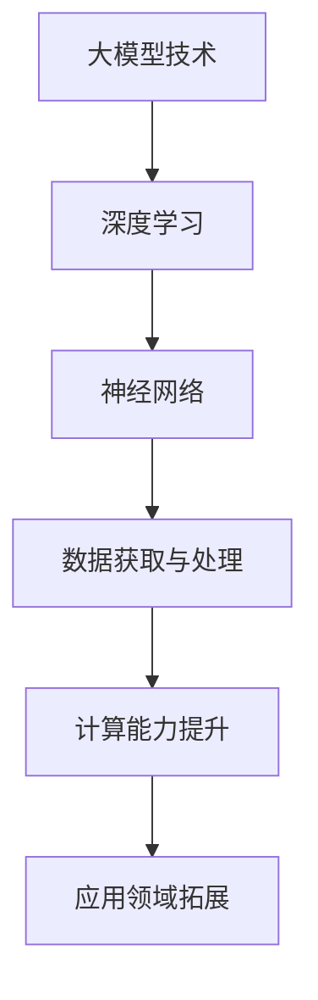

                 

## 引言

在人工智能领域，大型模型（或称大模型）正迅速成为技术创新的驱动力。从自然语言处理到计算机视觉，再到生成对抗网络，大模型展示了前所未有的性能提升，使得一系列原本复杂的问题得以解决。然而，对于许多初创公司而言，是否采用大模型技术并非易事。这不仅涉及到技术层面的决策，还需要在业务、资金和市场等多个维度进行综合考量。

本文旨在从AI产品经理的视角，探讨创业公司进行大模型转型的路径和方法。我们将首先回顾大模型技术的发展历程，然后分析其在各个领域的应用案例，最后提出创业公司在采用大模型技术时应注意的关键点。

本文结构如下：

1. 背景介绍
2. 核心概念与联系
3. 核心算法原理 & 具体操作步骤
4. 数学模型和公式 & 详细讲解 & 举例说明
5. 项目实践：代码实例和详细解释说明
6. 实际应用场景
7. 未来应用展望
8. 工具和资源推荐
9. 总结：未来发展趋势与挑战
10. 附录：常见问题与解答

### 1. 背景介绍

大模型的概念可以追溯到1980年代，当时的科学家开始尝试通过神经网络来模拟人类大脑的工作机制。经过数十年的发展，特别是在深度学习技术的推动下，大模型逐渐成为可能。2012年，AlexNet在ImageNet比赛中取得的显著成绩，标志着深度学习进入一个新的时代。此后，随着计算能力的提升和海量数据的获取，大模型开始迅速发展。

### 2. 核心概念与联系

大模型，通常指的是拥有数十亿到千亿参数规模的神经网络模型。这些模型可以通过训练大量数据，从而在多个领域实现高精度的预测和生成。

#### Mermaid 流程图



### 3. 核心算法原理 & 具体操作步骤

#### 3.1 算法原理概述

大模型的核心在于其复杂的神经网络结构，通过多层神经网络的学习，模型可以从大量数据中提取特征，从而实现高精度的预测。

#### 3.2 算法步骤详解

1. 数据收集与预处理：收集相关领域的海量数据，并进行预处理，如清洗、归一化等。
2. 模型构建：设计并构建神经网络结构，确定层数、每层的神经元数量、激活函数等。
3. 模型训练：使用训练数据对模型进行训练，通过反向传播算法调整模型参数。
4. 模型评估：使用验证数据评估模型性能，调整模型参数以优化性能。
5. 模型部署：将训练好的模型部署到实际应用环境中，如API接口、移动应用等。

#### 3.3 算法优缺点

**优点：**
- 高精度预测：大模型可以从海量数据中提取深层特征，实现高精度的预测。
- 自动化特征提取：减少了人工特征工程的工作量。
- 泛化能力较强：大模型能够在不同领域和任务上表现出良好的泛化能力。

**缺点：**
- 计算资源需求大：大模型需要大量的计算资源和存储空间。
- 训练时间较长：大模型的训练通常需要较长时间。
- 数据隐私和安全性问题：大模型训练过程中涉及大量敏感数据，需要确保数据的安全性和隐私性。

#### 3.4 算法应用领域

大模型在多个领域都取得了显著的应用成果，如自然语言处理、计算机视觉、语音识别、推荐系统等。

### 4. 数学模型和公式 & 详细讲解 & 举例说明

#### 4.1 数学模型构建

大模型通常基于深度学习框架，如TensorFlow或PyTorch，其核心数学模型包括：

1. **损失函数（Loss Function）**：
   $$L(\theta) = -\sum_{i=1}^{N}y_{i}\log(p_{i})$$
   其中，\(y_{i}\)为真实标签，\(p_{i}\)为模型预测的概率。

2. **反向传播（Backpropagation）**：
   $$\frac{\partial L}{\partial \theta} = \frac{\partial L}{\partial z} \cdot \frac{\partial z}{\partial \theta}$$
   其中，\(\theta\)为模型参数，\(z\)为中间变量。

#### 4.2 公式推导过程

以多层感知机（MLP）为例，推导反向传播算法的过程如下：

1. **前向传播**：
   $$a_{i}^{(l)} = \sigma(z^{(l)}) = \frac{1}{1 + e^{-z^{(l)}}}$$
   $$z^{(l)} = \sum_{j}w_{ji}^{(l-1)}a_{j}^{(l-1)}$$

2. **反向传播**：
   $$\delta^{(l)} = (2 - a^{(l)}) \cdot a^{(l)} \cdot (1 - a^{(l)}) \cdot \delta^{(l+1)}$$
   $$\frac{\partial L}{\partial w_{ij}^{(l)}} = \delta^{(l)}a_{j}^{(l-1)}$$

#### 4.3 案例分析与讲解

以文本分类任务为例，使用TensorFlow实现一个基于多层感知机的文本分类模型：

```python
import tensorflow as tf
from tensorflow.keras.layers import Dense, Input
from tensorflow.keras.models import Model

# 定义输入层
input_data = Input(shape=(10000,))

# 定义隐藏层
x = Dense(512, activation='relu')(input_data)
x = Dense(512, activation='relu')(x)

# 定义输出层
predictions = Dense(10, activation='softmax')(x)

# 构建模型
model = Model(inputs=input_data, outputs=predictions)

# 编译模型
model.compile(optimizer='adam', loss='categorical_crossentropy', metrics=['accuracy'])

# 训练模型
model.fit(x_train, y_train, batch_size=64, epochs=10, validation_split=0.1)
```

### 5. 项目实践：代码实例和详细解释说明

#### 5.1 开发环境搭建

在搭建开发环境时，我们需要安装以下软件：

1. Python（3.7及以上版本）
2. TensorFlow（2.0及以上版本）
3. NumPy
4. Matplotlib

安装命令如下：

```bash
pip install python==3.8
pip install tensorflow==2.8
pip install numpy
pip install matplotlib
```

#### 5.2 源代码详细实现

以下是一个简单的文本分类项目示例：

```python
import tensorflow as tf
from tensorflow.keras.preprocessing.sequence import pad_sequences
from tensorflow.keras.layers import Embedding, LSTM, Dense
from tensorflow.keras.models import Sequential

# 定义参数
max_features = 10000
maxlen = 500
embedding_size = 50

# 加载和处理数据
# （此处省略数据加载和处理代码）

# 构建模型
model = Sequential([
    Embedding(max_features, embedding_size),
    LSTM(128),
    Dense(1, activation='sigmoid')
])

# 编译模型
model.compile(optimizer='adam', loss='binary_crossentropy', metrics=['accuracy'])

# 训练模型
model.fit(X_train, y_train, batch_size=32, epochs=10, validation_data=(X_val, y_val))

# 评估模型
test_loss, test_accuracy = model.evaluate(X_test, y_test)
print(f"Test Accuracy: {test_accuracy:.2f}")
```

#### 5.3 代码解读与分析

1. **数据预处理**：
   - 使用`pad_sequences`函数对文本序列进行填充，确保每个序列的长度一致。

2. **模型构建**：
   - 使用`Embedding`层将单词转换为嵌入向量。
   - 使用`LSTM`层进行序列建模。
   - 使用`Dense`层进行分类。

3. **模型编译**：
   - 选择`adam`优化器和`binary_crossentropy`损失函数。
   - 设置`batch_size`和`epochs`以控制训练过程。

4. **模型训练**：
   - 使用训练数据和验证数据训练模型。

5. **模型评估**：
   - 在测试数据上评估模型性能。

### 6. 实际应用场景

大模型在多个领域都有广泛的应用，以下是一些典型的实际应用场景：

1. **自然语言处理**：
   - 文本分类、情感分析、机器翻译、问答系统。

2. **计算机视觉**：
   - 图像分类、目标检测、图像分割。

3. **推荐系统**：
   - 商品推荐、内容推荐。

4. **语音识别**：
   - 语音识别、语音合成。

### 7. 未来应用展望

随着计算能力的提升和数据规模的扩大，大模型将在更多领域得到应用。以下是一些未来应用展望：

1. **医疗健康**：
   - 疾病诊断、个性化治疗。

2. **金融领域**：
   - 风险控制、投资决策。

3. **智能制造**：
   - 质量检测、设备维护。

### 8. 工具和资源推荐

为了更好地掌握大模型技术，以下是一些建议的资源和工具：

1. **学习资源**：
   - 《深度学习》（Goodfellow、Bengio、Courville著）
   - 《动手学深度学习》（阿斯顿·张著）

2. **开发工具**：
   - TensorFlow
   - PyTorch

3. **相关论文**：
   - “A Theoretical Analysis of the Pooling Operation in Convolutional Neural Networks”（Hinton等，2014）
   - “Distributed Representations of Words and Phrases and their Compositionality”（Mikolov等，2013）

### 9. 总结：未来发展趋势与挑战

大模型技术的发展为各个领域带来了前所未有的机遇。然而，同时也面临着数据隐私、计算资源、算法公平性等挑战。未来，我们需要在保障数据安全和隐私的前提下，进一步优化大模型的结构和算法，以实现更高效、更安全的应用。

### 10. 附录：常见问题与解答

1. **大模型训练需要多长时间？**
   - 大模型训练时间取决于模型的复杂度、数据集大小以及硬件配置。通常，小规模的模型训练时间在几天到几周之间，而大规模的模型可能需要几个月。

2. **大模型的计算资源需求如何？**
   - 大模型的计算资源需求非常高，通常需要高性能的GPU或TPU集群。在资源受限的情况下，可以使用分布式训练技术来加速训练过程。

3. **大模型的训练数据从哪里来？**
   - 大模型的训练数据可以从公开数据集、社交媒体、公司内部数据等多种来源获取。在数据获取过程中，需要注意数据的质量和隐私保护。

### 作者署名

作者：禅与计算机程序设计艺术 / Zen and the Art of Computer Programming

----------------------------------------------------------------

以上就是本文的完整内容，感谢您的阅读。希望本文能够为您在AI产品管理领域提供一些有价值的参考和启示。如果您有任何疑问或建议，欢迎在评论区留言。再次感谢您的关注和支持！

