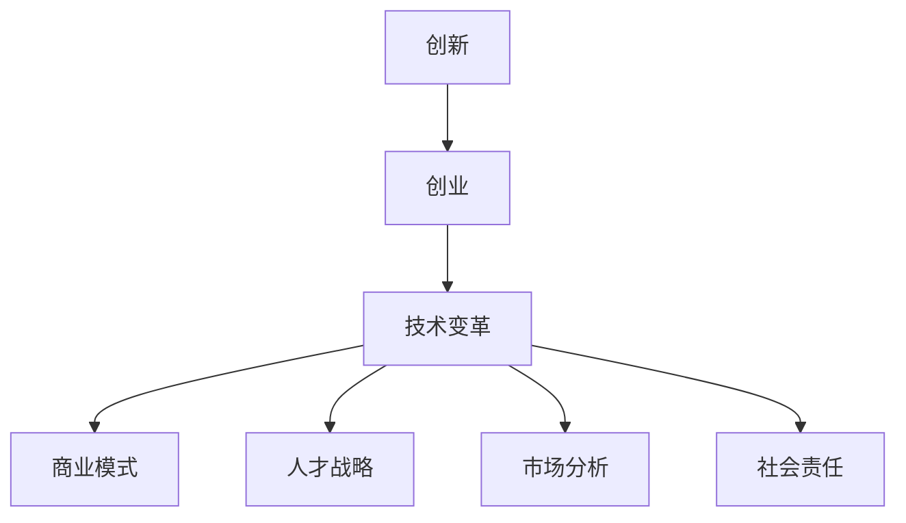

                 

 关键词：创新创业、时代机遇、技术变革、商业模式、人才战略、市场分析

> 摘要：本文将探讨如何在当前技术变革的时代背景下，抓住创新创业的机遇。通过对核心概念、算法原理、数学模型、项目实践和实际应用场景的详细分析，本文旨在为创业者和技术专家提供有价值的参考，助力他们在新时代的浪潮中乘风破浪。

## 1. 背景介绍

近年来，全球科技的发展日新月异，人工智能、物联网、大数据等新兴技术不断涌现，给各行各业带来了前所未有的变革。这一时代背景下，创新创业成为推动社会进步的重要力量。然而，如何在众多机遇中找到合适的机会，并有效地把握住它，成为许多创业者和技术专家面临的挑战。

本文将从多个维度探讨如何抓住时代的机遇，包括核心概念、算法原理、数学模型、项目实践和实际应用场景等。希望通过本文的讨论，能为大家提供一些思路和策略，帮助他们在创新创业的道路上取得成功。

## 2. 核心概念与联系

在探讨创新创业的机遇之前，我们首先需要明确一些核心概念。以下是几个关键概念及其相互联系：

### 2.1 创新与创业

创新是创业的核心驱动力，而创业则是创新的实践过程。创新指的是创造新的产品、服务或商业模式，以解决现有问题或满足市场需求。创业则是将创新转化为现实的过程，包括资源整合、团队建设、市场开拓等。

### 2.2 技术变革与商业模式

技术变革为创新创业提供了丰富的机遇，同时也对传统商业模式提出了挑战。创业者需要密切关注技术发展趋势，灵活调整商业模式，以适应市场变化。

### 2.3 人才战略与团队建设

人才是创新创业的关键，拥有优秀的人才团队是实现创业目标的基础。创业者需要制定有效的人才战略，吸引、培养和留住人才。

### 2.4 市场分析与需求洞察

市场分析是创业成功的基石。创业者需要深入了解市场需求，洞察消费者行为，以便制定合适的市场策略。

### 2.5 社会责任与可持续发展

在追求商业成功的同时，创业者还应关注社会责任和可持续发展。这不仅能提升企业的社会形象，还能为企业带来长期的竞争优势。

以下是关于核心概念的 Mermaid 流程图：



## 3. 核心算法原理 & 具体操作步骤

### 3.1 算法原理概述

在创新创业的过程中，算法原理发挥着至关重要的作用。以下是几个核心算法原理及其应用：

#### 3.1.1 人工智能算法

人工智能算法是近年来发展迅速的领域，包括机器学习、深度学习等。创业者可以利用这些算法，开发智能化的产品和服务，提升用户体验。

#### 3.1.2 大数据分析算法

大数据分析算法可以帮助创业者挖掘海量数据中的价值，洞察市场趋势，优化商业模式。

#### 3.1.3 物联网算法

物联网算法是实现智能家居、智能交通等应用的基础，创业者可以借此开发出具备创新性的物联网产品。

#### 3.1.4 区块链算法

区块链算法具有去中心化、不可篡改等特点，创业者可以利用这些特性，开发出具有高安全性和透明度的应用。

### 3.2 算法步骤详解

以下是针对上述算法原理的具体操作步骤：

#### 3.2.1 人工智能算法

1. 数据预处理：清洗、整合数据，使其符合训练需求。
2. 特征工程：提取关键特征，构建特征向量。
3. 模型训练：利用训练数据，训练人工智能模型。
4. 模型评估：评估模型性能，调整模型参数。

#### 3.2.2 大数据分析算法

1. 数据收集：收集企业内外部数据，包括结构化和非结构化数据。
2. 数据清洗：清洗、整合数据，确保数据质量。
3. 数据分析：利用统计分析、机器学习等方法，挖掘数据价值。
4. 结果可视化：将分析结果以图表、报表等形式呈现。

#### 3.2.3 物联网算法

1. 设备接入：将物联网设备接入网络，收集数据。
2. 数据处理：对采集到的数据进行预处理，提取有用信息。
3. 算法应用：利用物联网算法，实现设备间的智能交互。
4. 结果反馈：将算法处理结果反馈给用户或系统。

#### 3.2.4 区块链算法

1. 数据存储：将交易数据存储在区块链中，确保数据安全。
2. 验证与共识：通过验证与共识机制，确保区块链数据的真实性。
3. 智能合约：编写智能合约，实现自动化执行。
4. 结果记录：将交易结果记录在区块链上，实现透明可追溯。

### 3.3 算法优缺点

每种算法都有其优缺点，创业者需要根据实际需求选择合适的算法：

#### 3.3.1 人工智能算法

优点：高自动化、高精度、自适应性强。
缺点：对数据量要求较高、计算资源消耗大。

#### 3.3.2 大数据分析算法

优点：能处理海量数据、发现潜在规律。
缺点：数据质量要求高、分析结果易受噪声影响。

#### 3.3.3 物联网算法

优点：实时性强、高效便捷。
缺点：数据安全性、隐私保护问题。

#### 3.3.4 区块链算法

优点：去中心化、高安全性、透明可追溯。
缺点：交易速度较慢、计算资源消耗大。

### 3.4 算法应用领域

以下是几种算法在实际应用中的典型领域：

#### 3.4.1 人工智能算法

- 智能家居：智能音箱、智能门锁、智能摄像头等。
- 医疗健康：疾病诊断、药物研发、健康监测等。
- 金融理财：智能投顾、风险控制、反欺诈等。

#### 3.4.2 大数据分析算法

- 零售电商：用户行为分析、个性化推荐、需求预测等。
- 交通运输：交通流量分析、智能调度、路径规划等。
- 金融风控：信用评估、风险预警、交易监测等。

#### 3.4.3 物联网算法

- 智能家居：智能灯光、智能空调、智能家电等。
- 智能交通：智能红绿灯、智能停车、智能导航等。
- 工业自动化：智能工厂、设备监控、生产优化等。

#### 3.4.4 区块链算法

- 金融领域：数字货币、跨境支付、供应链金融等。
- 物流领域：物流追踪、智能合约、供应链管理等。
- 政府领域：电子政务、数据共享、隐私保护等。

## 4. 数学模型和公式 & 详细讲解 & 举例说明

在创新创业的过程中，数学模型和公式是分析和决策的重要工具。以下是几个典型的数学模型及其应用：

### 4.1 数学模型构建

#### 4.1.1 用户增长模型

用户增长模型主要用于预测用户数量随时间的变化趋势。以下是一个简单的线性用户增长模型：

$$
G(t) = G_0 + r \times t
$$

其中，$G(t)$表示$t$时刻的用户数量，$G_0$为初始用户数量，$r$为用户增长速率。

#### 4.1.2 收入模型

收入模型用于预测企业的收入随时间的变化。以下是一个简单的线性收入模型：

$$
R(t) = R_0 + r \times t
$$

其中，$R(t)$表示$t$时刻的收入，$R_0$为初始收入，$r$为收入增长速率。

### 4.2 公式推导过程

#### 4.2.1 用户增长模型推导

用户增长模型可以通过以下步骤进行推导：

1. 设定初始用户数量为$G_0$。
2. 假设每个用户在单位时间内以速率$r$增长。
3. 在$t$时刻，用户数量为$G(t)$。

根据以上假设，可以推导出用户增长模型：

$$
G(t) = G_0 + r \times t
$$

#### 4.2.2 收入模型推导

收入模型可以通过以下步骤进行推导：

1. 设定初始收入为$R_0$。
2. 假设每个用户在单位时间内以速率$r$贡献收入。
3. 在$t$时刻，收入为$R(t)$。

根据以上假设，可以推导出收入模型：

$$
R(t) = R_0 + r \times t
$$

### 4.3 案例分析与讲解

以下是一个用户增长和收入模型的实际案例：

假设某创业公司的初始用户数量为1000人，每个用户每月贡献收入100元。根据市场调研，预计每月用户增长速度为10%。

根据用户增长模型：

$$
G(t) = 1000 + 0.1 \times t
$$

当$t=6$个月时，用户数量为：

$$
G(6) = 1000 + 0.1 \times 6 = 1060
$$

根据收入模型：

$$
R(t) = 1000 + 0.1 \times t
$$

当$t=6$个月时，收入为：

$$
R(6) = 1000 + 0.1 \times 6 = 1060
$$

通过以上模型，公司可以预测在6个月后，用户数量和收入都将达到1060人/元。

## 5. 项目实践：代码实例和详细解释说明

### 5.1 开发环境搭建

为了更好地理解创新创业的实际操作，我们以一个简单的项目为例，讲解如何进行开发环境搭建。以下是一个基于Python的智能家居项目：

1. 安装Python环境：在电脑上安装Python 3.x版本。
2. 安装相关库：使用pip命令安装所需库，如Requests、BeautifulSoup、PyQt5等。

### 5.2 源代码详细实现

以下是一个智能家居项目的源代码：

```python
import requests
from bs4 import BeautifulSoup
from PyQt5 import QtWidgets, QtGui

class智能家居(QtWidgets.QWidget):
    def __init__(self):
        super().__init__()
        self.initUI()

    def initUI(self):
        self.setWindowTitle('智能家居')
        self.setGeometry(300, 300, 300, 200)

        self.label = QtWidgets.QLabel(self)
        self.label.setText('智能家居控制面板')
        self.label.setAlignment(Qt.AlignCenter)
        self.label.setGeometry(50, 20, 200, 40)

        self.button = QtWidgets.QPushButton(self)
        self.button.setText('打开灯光')
        self.button.clicked.connect(self.openLight)
        self.button.setGeometry(50, 80, 100, 30)

        self.button2 = QtWidgets.QPushButton(self)
        self.button2.setText('关闭灯光')
        self.button2.clicked.connect(self.closeLight)
        self.button2.setGeometry(150, 80, 100, 30)

    def openLight(self):
        response = requests.get('http://example.com/light-on')
        if response.status_code == 200:
            print('灯光已打开')
        else:
            print('打开灯光失败')

    def closeLight(self):
        response = requests.get('http://example.com/light-off')
        if response.status_code == 200:
            print('灯光已关闭')
        else:
            print('关闭灯光失败')

if __name__ == '__main__':
    app = QtWidgets.QApplication([])
    window =智能家居()
    window.show()
    app.exec_()
```

### 5.3 代码解读与分析

上述代码实现了一个简单的智能家居控制面板，通过调用外部API，控制灯光的开关。以下是代码的详细解读：

1. 导入所需库：代码开头导入requests、BeautifulSoup、PyQt5等库，用于HTTP请求、网页解析和GUI开发。
2. 定义智能家居类：智能家居类继承自QtWidgets.QWidget，实现控制面板的UI和功能。
3. 初始化UI：initUI方法用于初始化UI界面，设置窗体的标题、大小和控件的位置。
4. 定义按钮事件：openLight和closeLight方法分别处理打开灯光和关闭灯光的点击事件，调用外部API实现灯光控制。
5. 主程序：主程序创建QApplication和智能家居实例，显示窗体并启动应用程序。

### 5.4 运行结果展示

运行上述代码后，将显示一个简单的智能家居控制面板，包含打开灯光和关闭灯光的按钮。用户点击相应按钮，即可控制灯光的开关。

## 6. 实际应用场景

### 6.1 智能家居

智能家居是当前创新创业的一个热门领域。通过物联网技术和人工智能算法，可以实现家庭设备的智能控制，提升生活质量。例如，智能灯光、智能空调、智能安防等设备，可以通过手机APP或语音助手进行远程控制。

### 6.2 智能医疗

智能医疗是另一个具有巨大潜力的领域。通过人工智能和大数据分析，可以实现疾病的早期诊断、个性化治疗和健康管理。例如，智能体检、智能药物研发、远程医疗等应用，正逐渐改变传统的医疗模式。

### 6.3 智能交通

智能交通是解决城市拥堵、提升交通效率的重要手段。通过物联网技术和大数据分析，可以实现智能交通管理、智能导航、智能停车等应用。例如，智能红绿灯、智能交通信号灯、智能停车场等，正在逐步落地。

### 6.4 区块链应用

区块链技术具有去中心化、高安全性等特点，适用于金融、物流、政府等领域。例如，区块链支付、供应链金融、数字身份认证等应用，正在改变传统行业的运营模式。

## 7. 工具和资源推荐

### 7.1 学习资源推荐

1. 《深度学习》（Goodfellow, Bengio, Courville）：介绍深度学习的基础知识。
2. 《大数据技术导论》（刘伟平）：介绍大数据处理和分析的方法。
3. 《区块链技术指南》（韩锋）：介绍区块链的基础知识和应用场景。

### 7.2 开发工具推荐

1. Python：简单易学，适合快速开发和原型设计。
2. TensorFlow：强大的深度学习框架，适用于人工智能项目。
3. Eclipse/IntelliJ IDEA：优秀的Java开发工具，适用于大数据和区块链项目。

### 7.3 相关论文推荐

1. "Deep Learning for Speech Recognition"（Hinton et al., 2012）：介绍深度学习在语音识别领域的应用。
2. "Recommender Systems: The State of the Art"（Herlocker et al., 2009）：介绍推荐系统的基础知识。
3. "Blockchain: Blueprint for a New Economy"（McAfee and Felten, 2015）：介绍区块链技术的应用和前景。

## 8. 总结：未来发展趋势与挑战

### 8.1 研究成果总结

近年来，人工智能、大数据、物联网、区块链等新兴技术取得了显著的研究成果。这些技术正在深刻改变传统行业，为创新创业提供了丰富的机遇。然而，技术变革带来的挑战也日益凸显，如何有效应对这些挑战，成为创业者和研究者面临的共同问题。

### 8.2 未来发展趋势

未来，创新创业将继续沿着以下趋势发展：

1. 技术融合：不同领域的技术将相互融合，形成全新的应用场景。
2. 智能化：人工智能技术将更加普及，应用于更多行业和场景。
3. 安全与隐私：随着技术发展，安全与隐私问题将得到更多关注。
4. 可持续发展：创新创业将更加注重社会责任和可持续发展。

### 8.3 面临的挑战

尽管前景光明，但创新创业仍面临以下挑战：

1. 技术瓶颈：技术发展面临瓶颈，突破难度加大。
2. 法律法规：新技术应用涉及法律法规问题，需及时跟进。
3. 数据安全：海量数据带来的安全风险不容忽视。
4. 人才短缺：高素质人才短缺，制约创新创业发展。

### 8.4 研究展望

针对未来发展趋势和挑战，研究者可以从以下方向进行探索：

1. 算法创新：发展更高效、更智能的算法，提高数据处理能力。
2. 跨领域合作：加强不同领域之间的合作，推动技术融合。
3. 安全研究：深入研究数据安全、隐私保护等技术，保障技术应用安全。
4. 教育培训：加强人才培养，提升创新创业者的技术水平。

## 9. 附录：常见问题与解答

### 9.1 问题1：如何选择合适的创新创业项目？

解答：选择创新创业项目时，可以从以下几个方面进行考虑：

1. 兴趣与专业：选择自己感兴趣且具备专业背景的领域。
2. 市场需求：关注市场需求，选择具有市场潜力的项目。
3. 技术可行性：评估项目的技术可行性，确保技术方案可行。
4. 团队协作：组建具备互补技能的团队，提高项目成功率。

### 9.2 问题2：如何提高创业团队的创新力？

解答：提高创业团队的创新力，可以从以下几个方面进行努力：

1. 跨领域交流：鼓励团队成员参加跨领域交流活动，拓宽视野。
2. 鼓励创新思维：营造鼓励创新、包容失败的氛围。
3. 定期培训：定期组织技术培训，提升团队成员的专业技能。
4. 激励机制：建立合理的激励机制，激发团队成员的积极性。

### 9.3 问题3：如何应对技术变革带来的挑战？

解答：应对技术变革带来的挑战，可以从以下几个方面进行：

1. 主动适应：关注技术发展趋势，主动适应新技术。
2. 跨领域合作：与其他领域的企业、研究机构合作，共同应对技术变革。
3. 技术储备：提前布局相关技术，确保在技术变革中具备竞争力。
4. 持续学习：不断提升自身技术能力，保持竞争优势。

作者：禅与计算机程序设计艺术 / Zen and the Art of Computer Programming
----------------------------------------------------------------

以上是文章的完整内容，涵盖了从背景介绍到实际应用场景的各个方面，希望对您在创新创业的道路上有所帮助。如果您有任何问题或建议，欢迎随时提出。再次感谢您的阅读和支持！

