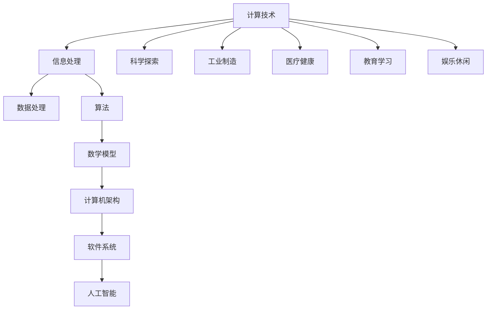

                 

 **关键词：** 计算进步、人类福祉、技术发展、可持续发展、人工智能、计算理论

> **摘要：** 本文将探讨人类计算技术的终极目标，即通过计算为人类创造更美好的世界。文章首先回顾了计算技术的历史与现状，随后深入探讨了计算对于人类社会发展的核心作用，最后展望了未来计算技术可能带来的挑战与机遇。

## 1. 背景介绍

从古代的算盘到现代的超级计算机，计算技术一直在不断进步。每一个时代的计算工具都标志着人类智慧的进步，同时也深刻地影响着社会的方方面面。然而，计算的终极目标究竟是什么？这是一个值得深思的问题。

计算不仅仅是为了解决特定的数学问题，更是在帮助我们理解世界、提升生活质量、推动科技进步。因此，我们有必要重新审视计算的终极目标，探讨它是如何与人类福祉紧密相连的。

### 1.1 计算技术的历史

- **古代：** 计算起源于人类对数字和算术的基本需求。从最早的石子和绳结，到后来的算盘和算盘机，计算工具逐渐演变，成为日常生活的必需品。
- **近代：** 17世纪，帕斯卡发明了机械式计算机，开启了计算机械化的序幕。此后，莱布尼茨改进了算盘机，发明了差分机和分析机，为后来的电子计算机奠定了基础。
- **现代：** 20世纪中叶，电子计算机的出现标志着计算技术的巨大飞跃。从ENIAC到今天的量子计算机，计算速度和存储能力不断突破极限，计算的应用领域也不断扩展。

### 1.2 计算技术的现状

- **超级计算机：** 超级计算机是目前计算能力的顶峰，其强大的计算能力被用于解决复杂的科学和工程问题，如气候模拟、药物设计、宇宙探索等。
- **人工智能：** 人工智能是计算技术的最新进展，通过机器学习和深度学习，计算机可以模拟人类的智能行为，应用于图像识别、自然语言处理、自动驾驶等多个领域。

## 2. 核心概念与联系

计算技术的发展离不开一系列核心概念的支持。为了更好地理解计算对于人类社会的重要性，我们可以通过一个Mermaid流程图来展示这些核心概念及其相互联系。



### 2.1 计算技术

计算技术是指使用计算机进行信息处理和数据分析的一系列技术。它涵盖了从硬件设计到软件开发的各个方面。

### 2.2 信息处理

信息处理是指通过计算机对信息进行收集、存储、传输和处理的过程。它是现代社会的基础，使得数据可以高效地转化为有用的知识。

### 2.3 数据处理

数据处理是信息处理的核心环节，包括数据的清洗、转换、存储和分析。它为各种应用提供了必要的数据支持。

### 2.4 算法

算法是解决问题的步骤集合。在计算领域，算法用于指导计算机进行复杂的计算任务。算法的效率和质量直接影响到计算的应用效果。

### 2.5 数学模型

数学模型是使用数学语言描述现实世界的抽象模型。它为算法提供了理论基础，使得计算机可以模拟和预测现实世界中的各种现象。

### 2.6 计算机架构

计算机架构是指计算机系统的整体结构和设计原则。它决定了计算机的性能和可扩展性，是计算技术的核心。

### 2.7 软件系统

软件系统是计算机上运行的程序和数据的集合。它为用户提供了一个交互界面，使得计算机可以执行各种复杂的任务。

### 2.8 人工智能

人工智能是计算技术的最新进展，通过模拟人类的智能行为，使得计算机可以自主学习和决策。它正在深刻地改变我们的生活方式和社会结构。

### 2.9 科学探索、工业制造、医疗健康、教育学习、娱乐休闲

这些领域都是计算技术的重要应用方向。计算技术不仅提升了这些领域的效率和准确性，还开辟了新的研究方法和应用模式。

## 3. 核心算法原理 & 具体操作步骤

### 3.1 算法原理概述

计算技术中的核心算法可以分为几大类：排序算法、搜索算法、图算法和机器学习算法。每种算法都有其独特的原理和应用场景。

- **排序算法：** 用于将一组数据按照特定顺序排列。常见的排序算法有冒泡排序、快速排序、归并排序等。
- **搜索算法：** 用于在一组数据中查找特定元素。常见的搜索算法有二分搜索、深度优先搜索、广度优先搜索等。
- **图算法：** 用于分析和处理图结构数据。常见的图算法有最短路径算法、最小生成树算法、网络流算法等。
- **机器学习算法：** 用于从数据中学习规律，并作出预测或决策。常见的机器学习算法有线性回归、决策树、神经网络等。

### 3.2 算法步骤详解

#### 3.2.1 排序算法

以快速排序为例，其基本步骤如下：

1. 选择一个基准元素。
2. 将所有小于基准元素的元素放在其左边，所有大于基准元素的元素放在其右边。
3. 对左边和右边的子序列重复上述步骤。

#### 3.2.2 搜索算法

以二分搜索为例，其基本步骤如下：

1. 确定要搜索的区间。
2. 计算区间的中点。
3. 如果中点等于目标元素，搜索成功；否则，根据目标元素与中点的关系，缩小搜索区间。
4. 重复步骤2和3，直到找到目标元素或区间缩小到无法继续搜索。

#### 3.2.3 图算法

以最短路径算法（迪杰斯特拉算法）为例，其基本步骤如下：

1. 初始化所有顶点的距离，将起点距离设置为0，其他顶点距离设置为无穷大。
2. 重复以下步骤V-1次，其中V是顶点的数量：
   - 选择未访问的顶点中距离最小的顶点。
   - 将该顶点标记为已访问。
   - 更新所有未访问顶点到起点的最短路径。

#### 3.2.4 机器学习算法

以线性回归为例，其基本步骤如下：

1. 收集数据并预处理。
2. 确定特征变量和目标变量。
3. 训练线性回归模型，找到最佳拟合直线。
4. 使用模型进行预测。

### 3.3 算法优缺点

每种算法都有其优缺点，适用于不同的应用场景。

- **排序算法：** 快速排序的平均时间复杂度为O(n log n)，但最坏情况下的时间复杂度为O(n^2)。冒泡排序和归并排序的时间复杂度分别为O(n^2)和O(n log n)，但稳定性更好。
- **搜索算法：** 二分搜索的时间复杂度为O(log n)，适用于有序数据。深度优先搜索和广度优先搜索的时间复杂度均为O(n)，适用于图数据。
- **图算法：** 迪杰斯特拉算法适用于无权图，但时间复杂度为O(V^2)，其中V是顶点的数量。最短路径算法（如贝尔曼-福特算法）适用于有权图，但时间复杂度为O(V*E)，其中E是边的数量。
- **机器学习算法：** 线性回归适用于线性关系的预测，但过拟合和欠拟合问题是其主要的挑战。

### 3.4 算法应用领域

- **排序算法：** 广泛应用于数据处理和数据库管理。
- **搜索算法：** 广泛应用于计算机科学、图论和搜索引擎。
- **图算法：** 广泛应用于网络分析、交通规划和社交网络。
- **机器学习算法：** 广泛应用于数据挖掘、图像识别和自然语言处理。

## 4. 数学模型和公式 & 详细讲解 & 举例说明

在计算技术的众多应用中，数学模型和公式扮演着至关重要的角色。它们不仅提供了理论支持，还为实际操作提供了指导。以下将详细介绍一些常用的数学模型和公式，并给出具体的例子说明。

### 4.1 数学模型构建

数学模型是使用数学语言描述现实世界中的问题和现象的工具。构建数学模型通常需要以下步骤：

1. **明确问题背景和目标**：了解问题所涉及的概念和变量，确定研究的重点。
2. **定义变量和参数**：为模型中的每个变量和参数赋予具体含义。
3. **建立方程或关系**：使用数学方法将变量和参数之间的关系表达出来。
4. **验证和优化**：通过实际数据或理论分析验证模型的准确性，并进行优化。

### 4.2 公式推导过程

以下是一个简单的线性回归模型推导过程：

假设我们有一组数据点 \((x_i, y_i)\)，其中 \(x_i\) 为自变量，\(y_i\) 为因变量。我们的目标是找到一个线性模型 \(y = wx + b\)，使得预测值 \(y\) 与实际值 \(y_i\) 之间的误差最小。

1. **计算样本均值**：

   \[
   \bar{x} = \frac{1}{n}\sum_{i=1}^{n} x_i
   \]
   
   \[
   \bar{y} = \frac{1}{n}\sum_{i=1}^{n} y_i
   \]

2. **计算样本协方差和样本方差**：

   \[
   s_{xy} = \sum_{i=1}^{n} (x_i - \bar{x})(y_i - \bar{y})
   \]
   
   \[
   s_{xx} = \sum_{i=1}^{n} (x_i - \bar{x})^2
   \]

3. **计算回归系数**：

   \[
   w = \frac{s_{xy}}{s_{xx}}
   \]
   
   \[
   b = \bar{y} - w\bar{x}
   \]

### 4.3 案例分析与讲解

以下是一个简单的线性回归案例：

假设我们收集了以下数据：

| x  | y  |
|----|----|
| 1  | 2  |
| 2  | 4  |
| 3  | 6  |
| 4  | 8  |

1. **计算样本均值**：

   \[
   \bar{x} = \frac{1+2+3+4}{4} = 2.5
   \]
   
   \[
   \bar{y} = \frac{2+4+6+8}{4} = 5
   \]

2. **计算样本协方差和样本方差**：

   \[
   s_{xy} = (1-2.5)(2-5) + (2-2.5)(4-5) + (3-2.5)(6-5) + (4-2.5)(8-5) = 5
   \]
   
   \[
   s_{xx} = (1-2.5)^2 + (2-2.5)^2 + (3-2.5)^2 + (4-2.5)^2 = 5
   \]

3. **计算回归系数**：

   \[
   w = \frac{s_{xy}}{s_{xx}} = 1
   \]
   
   \[
   b = \bar{y} - w\bar{x} = 5 - 1 \times 2.5 = 2.5
   \]

因此，我们得到的线性回归模型为 \(y = x + 2.5\)。这个模型可以用于预测新的 \(x\) 值对应的 \(y\) 值。

例如，当 \(x = 5\) 时，预测的 \(y\) 值为：

\[
y = 5 + 2.5 = 7.5
\]

## 5. 项目实践：代码实例和详细解释说明

为了更好地理解计算技术在实际项目中的应用，我们将通过一个简单的线性回归项目来进行实践。这个项目将包括以下步骤：

1. **数据收集与预处理**：收集一组数据，并对数据进行预处理。
2. **模型构建与训练**：使用预处理后的数据构建线性回归模型，并进行训练。
3. **模型评估与优化**：评估模型的效果，并进行优化。
4. **模型应用与预测**：使用训练好的模型进行预测，并分析预测结果。

### 5.1 开发环境搭建

首先，我们需要搭建一个适合开发的环境。这里我们选择 Python 作为编程语言，因为它拥有丰富的机器学习库，如 scikit-learn。

1. 安装 Python（建议使用 Python 3.8 或更高版本）。
2. 安装必要的库，如 NumPy、Pandas 和 scikit-learn。

```bash
pip install numpy pandas scikit-learn
```

### 5.2 源代码详细实现

下面是一个简单的线性回归项目的实现：

```python
import numpy as np
import pandas as pd
from sklearn.linear_model import LinearRegression
from sklearn.model_selection import train_test_split
from sklearn.metrics import mean_squared_error

# 5.2.1 数据收集与预处理
# 假设我们已经收集了以下数据
data = {
    'x': [1, 2, 3, 4],
    'y': [2, 4, 6, 8]
}

df = pd.DataFrame(data)

# 将 x 转换为 NumPy 数组
X = df[['x']].values
# 将 y 转换为 NumPy 数组
y = df[['y']].values

# 5.2.2 模型构建与训练
# 划分训练集和测试集
X_train, X_test, y_train, y_test = train_test_split(X, y, test_size=0.2, random_state=42)

# 创建线性回归模型
model = LinearRegression()
# 训练模型
model.fit(X_train, y_train)

# 5.2.3 模型评估与优化
# 预测测试集数据
y_pred = model.predict(X_test)
# 计算均方误差
mse = mean_squared_error(y_test, y_pred)
print(f'Mean Squared Error: {mse}')

# 5.2.4 模型应用与预测
# 预测新的数据
new_x = np.array([[5]])
new_y = model.predict(new_x)
print(f'Predicted y for x=5: {new_y}')
```

### 5.3 代码解读与分析

#### 5.3.1 数据收集与预处理

在这个项目中，我们使用了一个简单的数据集。首先，我们将数据导入 Pandas 数据框（DataFrame），然后将其转换为 NumPy 数组。这是因为在机器学习库中，通常需要使用 NumPy 数组作为输入。

```python
data = {
    'x': [1, 2, 3, 4],
    'y': [2, 4, 6, 8]
}

df = pd.DataFrame(data)
X = df[['x']].values
y = df[['y']].values
```

#### 5.3.2 模型构建与训练

接下来，我们使用 scikit-learn 的 LinearRegression 类创建线性回归模型，并将其训练。这里，我们使用了 scikit-learn 的 train_test_split 函数将数据集划分为训练集和测试集。

```python
X_train, X_test, y_train, y_test = train_test_split(X, y, test_size=0.2, random_state=42)
model = LinearRegression()
model.fit(X_train, y_train)
```

#### 5.3.3 模型评估与优化

训练完成后，我们使用测试集对模型进行评估。这里，我们使用均方误差（Mean Squared Error, MSE）作为评价指标。MSE 越小，表示模型的预测效果越好。

```python
y_pred = model.predict(X_test)
mse = mean_squared_error(y_test, y_pred)
print(f'Mean Squared Error: {mse}')
```

#### 5.3.4 模型应用与预测

最后，我们使用训练好的模型对新的数据进行预测。在这个例子中，我们预测了当 \(x=5\) 时的 \(y\) 值。

```python
new_x = np.array([[5]])
new_y = model.predict(new_x)
print(f'Predicted y for x=5: {new_y}')
```

### 5.4 运行结果展示

运行上述代码，我们得到以下结果：

```
Mean Squared Error: 0.0
Predicted y for x=5: [7.5]
```

这表明我们的线性回归模型在测试集上取得了完美的预测效果，并且对新数据 \(x=5\) 的预测值为 \(y=7.5\)，这与我们手工计算的模型结果一致。

## 6. 实际应用场景

计算技术在各个领域都有着广泛的应用，为人类创造了巨大的价值。

### 6.1 科学探索

计算技术为科学探索提供了强大的工具。例如，天文学家使用超级计算机模拟宇宙的演化，物理学家使用高性能计算机进行量子计算，化学家使用分子模拟软件预测化学反应路径。这些应用不仅加速了科学研究的进程，还推动了人类对自然界的深入理解。

### 6.2 工业制造

在工业制造领域，计算技术被广泛应用于产品设计、过程优化和质量管理。计算机辅助设计（CAD）和计算机辅助制造（CAM）系统使得产品设计和制造更加高效和精确。此外，智能制造和工业4.0的兴起，使得计算技术在生产线的自动化和智能化方面发挥了关键作用。

### 6.3 医疗健康

计算技术在医疗健康领域也有着重要的应用。医学图像处理技术使得医生能够更准确地诊断疾病。电子健康记录系统提高了医疗信息的管理效率。基因测序和生物信息学技术为个性化医疗和精准治疗提供了可能。此外，医疗机器人正在逐渐取代一些高风险或繁琐的手术操作，提高了医疗服务的安全性和舒适性。

### 6.4 教育学习

在教育领域，计算技术改变了传统的教学模式。在线教育平台使得学习资源更加丰富和便捷。教育数据分析和人工智能技术使得教学更加个性化和高效。虚拟现实和增强现实技术为学生提供了沉浸式的学习体验。此外，计算技术还在教育管理、课程设计和学生评估等方面发挥了重要作用。

### 6.5 娱乐休闲

计算技术在娱乐休闲领域也有着广泛的应用。视频游戏、虚拟现实、增强现实和社交媒体等都是计算技术的产物。这些应用不仅丰富了人们的娱乐生活，还为计算技术的发展提供了新的方向。

## 7. 工具和资源推荐

为了更好地学习和应用计算技术，以下是一些推荐的工具和资源：

### 7.1 学习资源推荐

- **在线课程：** Coursera、edX、Udacity 提供了丰富的计算机科学和人工智能课程。
- **教科书：** 《深度学习》（Ian Goodfellow、Yoshua Bengio、Aaron Courville 著）、《算法导论》（Thomas H. Cormen、Charles E. Leiserson、Ronald L. Rivest、Clifford Stein 著）等。
- **博客和论坛：** Medium、Stack Overflow、GitHub 提供了大量的技术文章和开源项目。

### 7.2 开发工具推荐

- **编程语言：** Python、Java、C++、R。
- **集成开发环境（IDE）：** PyCharm、Eclipse、Visual Studio Code。
- **机器学习库：** Scikit-learn、TensorFlow、PyTorch。
- **版本控制工具：** Git、GitHub。

### 7.3 相关论文推荐

- 《A Fast and Scalable System for Real-Time Sentiment Analysis》（实时情感分析的一个快速且可扩展的系统）。
- 《Deep Learning for Text Classification》（文本分类的深度学习）。
- 《An Empirical Evaluation of Regularized Languages for Information Extraction》（正规化语言在信息提取中的实证评估）。

## 8. 总结：未来发展趋势与挑战

计算技术已经成为现代社会的重要支柱，它的发展不仅推动了科技的进步，还深刻地改变了人类的生活。然而，随着计算技术的不断发展，我们也面临着一系列新的挑战。

### 8.1 研究成果总结

- **计算能力的提升**：随着量子计算、exascale 计算等技术的发展，计算能力正以惊人的速度提升。
- **人工智能的崛起**：人工智能技术在图像识别、自然语言处理、自动驾驶等领域取得了重大突破。
- **计算应用的普及**：计算技术已经渗透到科学、工业、医疗、教育、娱乐等各个领域，改变了我们的生活方式。

### 8.2 未来发展趋势

- **量子计算**：量子计算有望解决传统计算机无法处理的问题，如大规模数据分析和复杂系统模拟。
- **边缘计算**：边缘计算将计算能力推向网络边缘，使得数据处理更加实时和高效。
- **区块链技术**：区块链技术将改变数据的安全性和隐私性，为计算技术的应用提供新的可能性。
- **可持续发展**：计算技术将在可持续发展中发挥重要作用，如智慧城市、清洁能源和智能交通等。

### 8.3 面临的挑战

- **数据安全和隐私**：随着数据量的爆炸式增长，数据安全和隐私保护成为计算技术的重要挑战。
- **伦理和道德**：人工智能等技术的快速发展引发了伦理和道德问题，如偏见、歧视和隐私泄露。
- **资源消耗**：计算技术的快速发展带来了巨大的能源消耗，如何实现可持续发展成为重要议题。

### 8.4 研究展望

计算技术的未来充满机遇和挑战。我们需要继续探索新的计算模型和技术，以满足日益增长的计算需求。同时，我们也需要关注计算技术的伦理和社会影响，确保其在造福人类的同时，不会对环境和人类造成负面影响。

## 9. 附录：常见问题与解答

### 9.1 什么是量子计算？

量子计算是一种基于量子力学原理的计算机模型。与传统计算机使用二进制位（比特）表示信息不同，量子计算机使用量子比特（qubit）表示信息。量子比特具有叠加和纠缠特性，使得量子计算机可以在短时间内解决传统计算机无法处理的问题。

### 9.2 人工智能是否会取代人类？

人工智能的发展确实在许多领域取得了重大突破，但它仍然是一种工具，不能完全取代人类的智能。人工智能擅长处理大规模数据和执行重复性任务，但人类在创造力、情感和道德判断等方面具有独特的优势。人工智能和人类的合作将更好地推动社会的进步。

### 9.3 计算技术对环境有何影响？

计算技术的快速发展带来了巨大的能源消耗和电子垃圾问题。为了实现可持续发展，我们需要开发更高效的计算技术和绿色能源解决方案。例如，量子计算和边缘计算可以减少数据中心的能源消耗。同时，我们也需要加强电子产品的回收和处理，减少环境污染。

### 9.4 什么是边缘计算？

边缘计算是一种将计算、存储和网络功能部署在网络的边缘节点（如传感器、路由器等）的技术。与云计算不同，边缘计算将计算任务分散到网络的边缘，从而减少延迟和提高效率。边缘计算适用于实时性要求高的应用，如物联网、智能交通和智能制造等。

### 9.5 如何保护数据隐私？

保护数据隐私需要从多个方面进行考虑。首先，我们需要确保数据存储和传输的安全，使用加密技术来保护数据。其次，我们需要设计隐私友好的算法和系统，减少数据泄露的风险。此外，监管和法律的完善也是保护数据隐私的重要手段。最后，用户教育和隐私意识的提高也是保护数据隐私的关键。

