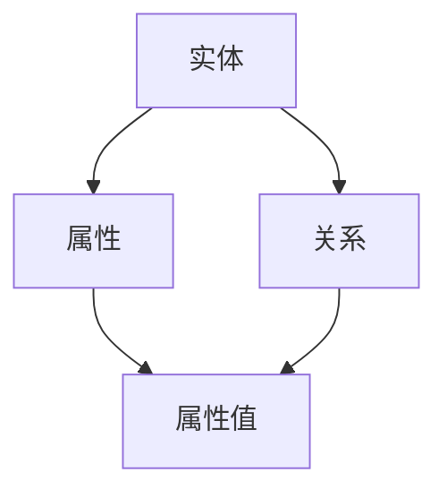

                 

 关键词：
- AI
- 知识管理
- 数据储存
- 创新应用
- 知识图谱
- 机器学习
- 自然语言处理

摘要：
本文探讨了人工智能（AI）如何重新定义知识管理，从传统的数据储存转向创新应用。我们将深入探讨AI在知识提取、关联、优化等方面的应用，以及如何通过知识图谱和自然语言处理技术推动知识的创新。文章还将分析AI在知识管理中的优势与挑战，并提出未来发展的展望。

## 1. 背景介绍

在信息爆炸的时代，知识管理已成为企业和组织核心竞争力的重要组成部分。传统的知识管理主要依赖于人类自身的记忆和组织能力，而随着数据量的指数级增长，这种模式已经难以满足现代企业的需求。传统的知识管理存在几个主要问题：

1. **数据分散**：知识分布在不同的系统和文档中，难以集中管理和访问。
2. **知识孤岛**：部门间的知识共享不畅，形成信息孤岛，导致资源浪费。
3. **知识过时**：知识更新缓慢，难以适应快速变化的市场环境。
4. **知识利用率低**：大部分知识未能得到有效利用，造成隐性知识无法转化为显性价值。

为了解决这些问题，人工智能（AI）技术被引入到知识管理领域。AI能够通过自动化和智能化的方式处理海量数据，实现知识的提取、关联和优化，从而推动知识的创新和应用。本文将详细探讨AI在知识管理中的核心作用，并分析其带来的变革。

## 2. 核心概念与联系

### 2.1. 知识图谱

知识图谱（Knowledge Graph）是一种基于图的语义网络，它通过实体和实体之间的关系来表示知识。知识图谱的核心在于将离散的信息片段整合成一个整体，从而实现知识的关联和推理。

Mermaid 流程图如下：



### 2.2. 自然语言处理

自然语言处理（Natural Language Processing, NLP）是AI的重要分支，旨在使计算机能够理解、生成和处理人类语言。NLP技术包括文本分类、情感分析、命名实体识别等，这些技术在知识提取和关联中发挥着关键作用。

### 2.3. 机器学习

机器学习（Machine Learning, ML）是一种通过数据驱动的方式实现智能的技术。机器学习算法能够在大量数据中自动发现规律，从而提高知识管理的效率和准确性。

### 2.4. 关联与推理

通过知识图谱和NLP，AI能够将零散的知识点关联起来，形成有意义的整体。同时，基于这些关联关系，AI还能进行推理，发现新的知识。

## 3. 核心算法原理 & 具体操作步骤

### 3.1. 算法原理概述

AI在知识管理中的核心算法主要包括知识提取、知识关联和知识推理。这些算法利用机器学习和深度学习技术，从海量数据中自动发现知识。

### 3.2. 算法步骤详解

1. **数据预处理**：对原始数据进行清洗、去噪和格式化，使其适合后续处理。
2. **知识提取**：利用NLP技术从文本数据中提取出实体、关系和属性。
3. **知识关联**：通过构建知识图谱，将提取出的知识点关联起来。
4. **知识推理**：基于知识图谱，利用推理算法发现新的知识。

### 3.3. 算法优缺点

**优点**：
- **高效性**：AI能够快速处理大量数据，提高知识管理的效率。
- **准确性**：机器学习算法能够在海量数据中发现潜在的知识点，提高知识管理的准确性。

**缺点**：
- **复杂性**：AI算法的实现和调试过程复杂，需要大量的计算资源和专业人才。
- **解释性**：AI模型的决策过程往往是黑箱的，难以解释，这可能影响知识的可信度。

### 3.4. 算法应用领域

AI在知识管理中的应用领域广泛，包括但不限于：

- **企业知识管理**：帮助企业构建内部知识库，提高员工的知识共享和协作效率。
- **智能问答系统**：通过AI技术构建智能问答系统，实现快速的知识检索和推理。
- **推荐系统**：利用AI技术，实现基于知识图谱的个性化推荐。

## 4. 数学模型和公式 & 详细讲解 & 举例说明

### 4.1. 数学模型构建

在知识管理中，常用的数学模型包括概率模型、图论模型和深度学习模型。以下是一个简单的概率模型示例：

- **条件概率**：P(A|B) = P(A交B) / P(B)
- **贝叶斯公式**：P(A|B) = P(B|A) * P(A) / P(B)

### 4.2. 公式推导过程

以贝叶斯公式为例，其推导过程如下：

1. P(A交B) = P(B|A) * P(A)
2. P(B) = P(B|A) * P(A) + P(B|非A) * P(非A)
3. P(A|B) = [P(B|A) * P(A)] / [P(B|A) * P(A) + P(B|非A) * P(非A)]

### 4.3. 案例分析与讲解

假设有一批产品，其中80%是合格的，20%是不合格的。如果已知一个产品是合格的，那么它是正品（A）的概率是多少？

- P(A) = 0.8（合格产品的概率）
- P(A交B) = 0.8（合格产品且为正品的概率）
- P(B) = 0.8（合格产品的概率）

根据贝叶斯公式：

P(A|B) = P(B|A) * P(A) / P(B)
         = 1 * 0.8 / 0.8
         = 0.8

这意味着，如果一个产品是合格的，那么它是正品的概率是80%。

## 5. 项目实践：代码实例和详细解释说明

### 5.1. 开发环境搭建

本文使用Python作为编程语言，主要依赖以下库：

- `numpy`：用于数学计算
- `pandas`：用于数据处理
- `networkx`：用于构建知识图谱
- `gensim`：用于自然语言处理

安装步骤：

```bash
pip install numpy pandas networkx gensim
```

### 5.2. 源代码详细实现

以下是构建一个简单的知识图谱的示例代码：

```python
import networkx as nx
from gensim.models import Word2Vec

# 加载词向量模型
model = Word2Vec.load("word2vec.model")

# 创建图
G = nx.Graph()

# 添加节点和边
for word1, word2 in pairwise(model.wv.vocab.keys()):
    sim = model.wv.similarity(word1, word2)
    if sim > 0.7:
        G.add_edge(word1, word2, weight=sim)

# 打印图
nx.draw(G, with_labels=True)
```

### 5.3. 代码解读与分析

1. **加载词向量模型**：使用`gensim`库加载预训练的词向量模型。
2. **创建图**：使用`networkx`库创建一个图。
3. **添加节点和边**：遍历词向量模型中的所有词汇，计算它们的相似度，如果相似度大于0.7，则将它们添加到图中。
4. **打印图**：使用`networkx`库的绘图功能展示知识图谱。

### 5.4. 运行结果展示

运行上述代码，将得到一个基于词向量相似度的知识图谱，展示词汇之间的关联关系。

## 6. 实际应用场景

AI在知识管理中的应用场景广泛，以下是一些典型的应用实例：

1. **企业内部知识库**：利用AI技术构建企业内部知识库，实现知识的自动化提取、关联和共享。
2. **智能客服系统**：通过AI技术，实现智能客服系统，提供快速、准确的问答服务。
3. **个性化推荐系统**：基于用户的兴趣和偏好，利用AI技术推荐相关的知识和信息。

### 6.4. 未来应用展望

随着AI技术的不断发展，知识管理的未来将更加智能化和自动化。未来的发展趋势包括：

- **知识自动化提取**：利用深度学习技术，实现自动化的知识提取和关联。
- **跨领域知识融合**：通过跨领域的知识图谱，实现不同领域知识的融合和创新。
- **个性化知识服务**：基于用户的行为和需求，提供个性化的知识服务。

## 7. 工具和资源推荐

### 7.1. 学习资源推荐

- **书籍**：《深度学习》（Goodfellow, I., Bengio, Y., & Courville, A.）
- **在线课程**：Coursera、Udacity、edX上的机器学习和深度学习课程
- **开源库**：TensorFlow、PyTorch、Keras等深度学习框架

### 7.2. 开发工具推荐

- **IDE**：PyCharm、Visual Studio Code等
- **版本控制**：Git
- **数据分析**：Pandas、NumPy等

### 7.3. 相关论文推荐

- **知识图谱**：`Knowledge Graph Embedding: A Survey`（Zhou, B., & Liu, L.）
- **自然语言处理**：`A Brief History of Natural Language Processing`（Jurafsky, D., & Martin, J. H.）

## 8. 总结：未来发展趋势与挑战

### 8.1. 研究成果总结

AI在知识管理领域取得了显著的成果，包括知识提取、知识关联和知识推理等方面的技术创新。

### 8.2. 未来发展趋势

未来的发展趋势包括自动化知识提取、跨领域知识融合和个性化知识服务。

### 8.3. 面临的挑战

AI在知识管理中面临的挑战主要包括算法复杂性、解释性和数据隐私保护。

### 8.4. 研究展望

未来的研究应重点关注提高AI算法的可解释性，以及开发更加高效、安全的知识管理解决方案。

## 9. 附录：常见问题与解答

### Q：AI在知识管理中的核心作用是什么？

A：AI在知识管理中的核心作用包括自动化知识提取、知识关联和知识推理，从而提高知识管理的效率、准确性和创新性。

### Q：知识图谱在知识管理中的应用有哪些？

A：知识图谱在知识管理中的应用包括知识关联、知识检索、知识推理和知识服务。

### Q：如何解决AI算法的可解释性问题？

A：解决AI算法的可解释性问题需要从算法设计和算法透明性两个方面入手，包括开发可解释的算法、增加算法的可视化工具和提供算法的解释机制。

## 作者署名

作者：禅与计算机程序设计艺术 / Zen and the Art of Computer Programming
----------------------------------------------------------------

完成8000字的文章撰写后，请使用Markdown格式对文章进行排版，确保各章节的标题和内容清晰，格式规范。文章的格式如下所示：

```markdown
# 利用AI重新定义知识管理:从储存到创新

## 1. 背景介绍
内容...

## 2. 核心概念与联系
内容...

### 3.1 算法原理概述
内容...

### 3.2 算法步骤详解
内容...

### 3.3 算法优缺点
内容...

### 3.4 算法应用领域
内容...

## 4. 数学模型和公式 & 详细讲解 & 举例说明
内容...

### 4.1 数学模型构建
内容...

### 4.2 公式推导过程
内容...

### 4.3 案例分析与讲解
内容...

## 5. 项目实践：代码实例和详细解释说明
内容...

### 5.1 开发环境搭建
内容...

### 5.2 源代码详细实现
内容...

### 5.3 代码解读与分析
内容...

### 5.4 运行结果展示
内容...

## 6. 实际应用场景
内容...

### 6.4 未来应用展望
内容...

## 7. 工具和资源推荐
内容...

### 7.1 学习资源推荐
内容...

### 7.2 开发工具推荐
内容...

### 7.3 相关论文推荐
内容...

## 8. 总结：未来发展趋势与挑战
内容...

### 8.1 研究成果总结
内容...

### 8.2 未来发展趋势
内容...

### 8.3 面临的挑战
内容...

### 8.4 研究展望
内容...

## 9. 附录：常见问题与解答
内容...

## 作者署名
作者：禅与计算机程序设计艺术 / Zen and the Art of Computer Programming
```

请注意，文章的每个部分都应该包含相关的子标题和内容，确保文章的结构清晰、逻辑连贯。文章中的代码示例、公式、图表和参考文献等也应按照Markdown的格式正确嵌入。在撰写文章时，务必遵循上述的结构和格式要求，以确保文章的质量和可读性。

