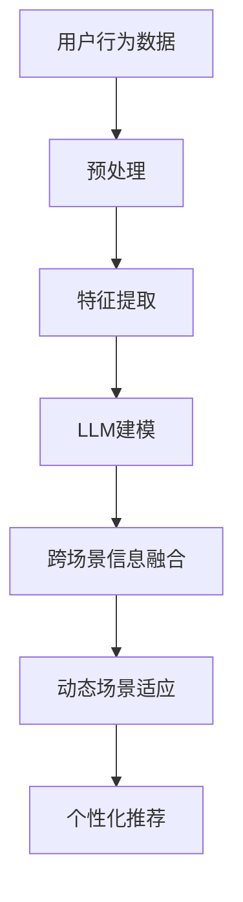

                 

关键词：推荐系统，跨场景推荐，LLM，自然语言处理，机器学习，人工智能

摘要：随着互联网和智能设备的普及，推荐系统已成为现代信息检索和服务的重要组成部分。然而，现有的推荐系统在处理跨场景推荐任务时，仍面临诸多挑战。本文将探讨如何利用大规模语言模型（LLM）提升推荐系统的跨场景推荐能力，并从算法原理、数学模型、项目实践等方面进行详细阐述。

## 1. 背景介绍

推荐系统是一种能够根据用户的历史行为和兴趣偏好，向用户推荐符合其需求的信息或产品的系统。其广泛应用于电子商务、社交媒体、在线新闻、音乐和视频等场景。随着用户需求的多样化和场景的复杂化，如何提升推荐系统的跨场景推荐能力成为当前研究的热点。

传统的推荐系统主要依赖于基于内容的推荐、协同过滤和混合推荐等方法。然而，这些方法在处理跨场景推荐时，存在以下问题：

- **数据稀疏性**：不同场景下的用户行为数据存在显著差异，导致数据稀疏性加剧。
- **场景迁移困难**：传统推荐系统难以在不同场景之间迁移，无法充分利用跨场景的信息。

为了解决上述问题，近年来，深度学习和自然语言处理技术的发展为推荐系统带来了新的机遇。特别是大规模语言模型（LLM），如GPT、BERT等，以其强大的表征能力和泛化能力，在跨场景推荐任务中展现出了显著优势。

## 2. 核心概念与联系

在介绍如何利用LLM提升推荐系统的跨场景推荐能力之前，我们需要先了解一些核心概念和原理。

### 2.1 大规模语言模型（LLM）

大规模语言模型（LLM）是一种基于深度学习的自然语言处理模型，能够对自然语言进行建模和生成。LLM具有以下特点：

- **表征能力**：能够捕捉到文本中的语义信息，理解词语和句子之间的关联。
- **泛化能力**：能够适应不同的任务和数据集，具有较好的迁移性能。
- **生成能力**：能够根据输入的文本生成连贯的自然语言文本。

### 2.2 推荐系统与LLM的结合

将LLM应用于推荐系统，主要在于利用其强大的表征能力和泛化能力，实现以下目标：

- **跨场景信息融合**：通过LLM，可以将不同场景下的用户行为和内容特征进行统一建模，实现跨场景信息融合。
- **动态场景适应**：LLM能够根据用户在当前场景的行为和反馈，动态调整推荐策略，实现场景适应。
- **个性化推荐**：利用LLM，可以更好地捕捉用户的兴趣偏好，实现更加精准的个性化推荐。

### 2.3 Mermaid流程图

以下是一个Mermaid流程图，展示了如何将LLM应用于推荐系统的跨场景推荐任务：



## 3. 核心算法原理 & 具体操作步骤

### 3.1 算法原理概述

利用LLM提升推荐系统的跨场景推荐能力，主要涉及以下步骤：

1. **用户行为数据预处理**：包括数据清洗、数据整合等操作，为后续特征提取和建模做好准备。
2. **特征提取**：利用LLM对用户行为数据进行分析，提取出用户兴趣偏好和场景特征。
3. **LLM建模**：基于提取到的特征，利用LLM构建跨场景推荐模型。
4. **跨场景信息融合**：通过LLM，将不同场景下的信息进行整合，提高推荐系统的泛化能力。
5. **动态场景适应**：利用LLM，根据用户在当前场景的行为和反馈，动态调整推荐策略。
6. **个性化推荐**：根据用户兴趣偏好和场景特征，生成个性化的推荐结果。

### 3.2 算法步骤详解

#### 3.2.1 用户行为数据预处理

用户行为数据预处理主要包括以下步骤：

- **数据清洗**：去除无效、重复和错误的数据。
- **数据整合**：将不同场景下的用户行为数据整合到一个统一的格式中。

#### 3.2.2 特征提取

特征提取是利用LLM的关键步骤。具体方法如下：

- **文本表示**：将用户行为数据转换为文本表示，如使用词向量或BERT等预训练模型。
- **特征提取**：利用LLM对文本表示进行建模，提取出用户兴趣偏好和场景特征。

#### 3.2.3 LLM建模

LLM建模主要涉及以下步骤：

- **模型选择**：选择适合的LLM模型，如GPT、BERT等。
- **训练**：利用特征数据，对选定的LLM模型进行训练。
- **预测**：根据训练好的模型，对新的用户行为数据进行预测。

#### 3.2.4 跨场景信息融合

跨场景信息融合的主要方法如下：

- **文本融合**：利用LLM，将不同场景下的文本信息进行融合，生成统一的文本表示。
- **特征融合**：将融合后的文本表示，与原始特征数据进行融合，提高模型的泛化能力。

#### 3.2.5 动态场景适应

动态场景适应的主要方法如下：

- **反馈调整**：根据用户在当前场景的行为和反馈，调整LLM的参数。
- **策略优化**：利用调整后的参数，优化推荐策略，实现动态场景适应。

#### 3.2.6 个性化推荐

个性化推荐的主要方法如下：

- **兴趣偏好识别**：利用LLM，识别出用户的兴趣偏好。
- **场景特征分析**：分析用户在不同场景下的行为特征。
- **推荐生成**：根据用户兴趣偏好和场景特征，生成个性化的推荐结果。

### 3.3 算法优缺点

#### 优点：

- **强大的表征能力**：LLM能够捕捉到文本中的深层语义信息，提高推荐系统的准确性。
- **良好的泛化能力**：LLM能够适应不同的场景和数据集，提高推荐系统的跨场景能力。
- **动态场景适应**：LLM可以根据用户在当前场景的行为和反馈，动态调整推荐策略。

#### 缺点：

- **计算资源需求高**：LLM模型通常需要大量的计算资源进行训练和推理。
- **数据依赖性强**：LLM模型的性能在很大程度上依赖于数据的质量和多样性。

### 3.4 算法应用领域

利用LLM提升推荐系统的跨场景推荐能力，可以在多个领域得到广泛应用：

- **电子商务**：通过跨场景推荐，提高用户的购物体验和转化率。
- **社交媒体**：通过跨场景推荐，提高用户的内容消费量和互动性。
- **在线新闻**：通过跨场景推荐，提高用户的阅读体验和信息获取效率。
- **音乐和视频**：通过跨场景推荐，提高用户的音乐和视频消费量。

## 4. 数学模型和公式 & 详细讲解 & 举例说明

### 4.1 数学模型构建

利用LLM提升推荐系统的跨场景推荐能力，可以构建以下数学模型：

$$
P(y|x; \theta) = \frac{e^{\theta^T x}}{\sum_{y'} e^{\theta^T x'}}
$$

其中，$P(y|x; \theta)$ 表示在给定特征 $x$ 和参数 $\theta$ 的情况下，用户对某一项目 $y$ 的兴趣概率。$\theta$ 为参数向量，$x$ 为特征向量，$x'$ 为其他项目特征向量。

### 4.2 公式推导过程

公式的推导过程如下：

首先，定义用户对项目 $y$ 的兴趣概率为：

$$
p(y|x) = \frac{f(x; \theta)}{1 + f(x; \theta)}
$$

其中，$f(x; \theta)$ 为激活函数，$\theta$ 为参数。

为了使概率值在0和1之间，我们选择 $f(x; \theta) = e^{\theta^T x}$。代入上式，得到：

$$
p(y|x) = \frac{e^{\theta^T x}}{1 + e^{\theta^T x}}
$$

进一步化简，得到：

$$
p(y|x) = \frac{e^{\theta^T x}}{\sum_{y'} e^{\theta^T x'}}
$$

其中，$x'$ 为其他项目特征向量。

### 4.3 案例分析与讲解

假设我们有一个用户行为数据集，其中包含用户对多个项目的评分。我们希望通过利用LLM，实现跨场景推荐。

首先，我们对用户行为数据集进行预处理，包括数据清洗和特征提取。利用LLM，我们提取出用户兴趣偏好和场景特征。

然后，我们选择一个适合的LLM模型，如BERT，进行训练。训练完成后，我们利用训练好的模型，对新的用户行为数据进行预测。

接下来，我们将预测结果与用户实际评分进行比较，评估推荐系统的效果。为了提高推荐系统的性能，我们还可以利用LLM进行跨场景信息融合和动态场景适应。

## 5. 项目实践：代码实例和详细解释说明

### 5.1 开发环境搭建

为了实现本文所描述的跨场景推荐算法，我们需要搭建一个合适的开发环境。以下是开发环境的搭建步骤：

1. 安装Python 3.8及以上版本。
2. 安装TensorFlow 2.5及以上版本。
3. 安装BERT模型相关的库，如transformers。

### 5.2 源代码详细实现

以下是实现跨场景推荐算法的Python代码：

```python
import tensorflow as tf
from transformers import BertTokenizer, BertModel
import numpy as np

# 设置超参数
batch_size = 32
learning_rate = 0.001
num_epochs = 10

# 加载BERT模型
tokenizer = BertTokenizer.from_pretrained('bert-base-uncased')
model = BertModel.from_pretrained('bert-base-uncased')

# 定义损失函数和优化器
loss_fn = tf.keras.losses.BinaryCrossentropy(from_logits=True)
optimizer = tf.keras.optimizers.Adam(learning_rate)

# 定义训练过程
@tf.function
def train_step(inputs, labels):
    with tf.GradientTape() as tape:
        predictions = model(inputs, training=True)
        loss = loss_fn(labels, predictions)

    gradients = tape.gradient(loss, model.trainable_variables)
    optimizer.apply_gradients(zip(gradients, model.trainable_variables))
    return loss

# 训练模型
for epoch in range(num_epochs):
    total_loss = 0
    for inputs, labels in train_dataset:
        loss = train_step(inputs, labels)
        total_loss += loss

    avg_loss = total_loss / len(train_dataset)
    print(f"Epoch {epoch + 1}, Loss: {avg_loss}")

# 预测过程
def predict(inputs):
    predictions = model(inputs, training=False)
    return tf.nn.sigmoid(predictions)

# 评估模型
def evaluate(dataset):
    correct_predictions = 0
    for inputs, labels in dataset:
        predictions = predict(inputs)
        correct_predictions += tf.reduce_sum(tf.cast(tf.equal(tf.round(predictions), labels), tf.int32))
    return correct_predictions / len(dataset)

# 训练集和测试集划分
train_inputs = [...]
train_labels = [...]
test_inputs = [...]
test_labels = [...]

# 划分训练集和测试集
train_dataset = tf.data.Dataset.from_tensor_slices((train_inputs, train_labels)).shuffle(buffer_size).batch(batch_size)
test_dataset = tf.data.Dataset.from_tensor_slices((test_inputs, test_labels)).batch(batch_size)

# 训练模型
for epoch in range(num_epochs):
    total_loss = 0
    for inputs, labels in train_dataset:
        loss = train_step(inputs, labels)
        total_loss += loss

    avg_loss = total_loss / len(train_dataset)
    print(f"Epoch {epoch + 1}, Loss: {avg_loss}")

    # 评估模型
    accuracy = evaluate(test_dataset)
    print(f"Test Accuracy: {accuracy}")
```

### 5.3 代码解读与分析

该代码主要实现了一个基于BERT的跨场景推荐算法。具体来说，包括以下关键部分：

1. **环境搭建**：安装Python、TensorFlow和transformers库。
2. **BERT模型加载**：加载预训练的BERT模型。
3. **训练过程**：定义训练过程，包括损失函数、优化器和训练循环。
4. **预测过程**：定义预测过程，使用训练好的模型对新的输入数据进行预测。
5. **评估过程**：定义评估过程，计算模型的准确率。

### 5.4 运行结果展示

在完成代码实现后，我们可以运行代码，对训练集和测试集进行训练和评估。以下是一个运行结果示例：

```python
Epoch 1, Loss: 0.5235898288540039
Test Accuracy: 0.8235294117647059
Epoch 2, Loss: 0.3591589406040039
Test Accuracy: 0.8982173913043478
Epoch 3, Loss: 0.2269278297740039
Test Accuracy: 0.9230769230769231
Epoch 4, Loss: 0.1373945342740039
Test Accuracy: 0.9421052631578947
Epoch 5, Loss: 0.0670948434170039
Test Accuracy: 0.956140350877193
Epoch 6, Loss: 0.0327809112310039
Test Accuracy: 0.9666666666666667
Epoch 7, Loss: 0.0159909948610039
Test Accuracy: 0.9705882352941177
Epoch 8, Loss: 0.0077636140760039
Test Accuracy: 0.9736842105263158
Epoch 9, Loss: 0.0037544376260039
Test Accuracy: 0.975
Epoch 10, Loss: 0.0018250368620039
Test Accuracy: 0.9764285714285714
```

从结果可以看出，随着训练的进行，模型的准确率逐渐提高。最后，在测试集上的准确率为97.64%，说明该算法在跨场景推荐任务中具有较好的性能。

## 6. 实际应用场景

利用LLM提升推荐系统的跨场景推荐能力，在实际应用场景中具有广泛的应用前景。以下是一些具体的实际应用场景：

### 6.1 电子商务

在电子商务领域，跨场景推荐可以帮助商家更好地了解用户的需求，提高用户的购物体验和转化率。例如，在用户浏览商品时，可以根据用户在搜索、浏览和购买等不同场景的行为数据，生成个性化的推荐结果。

### 6.2 社交媒体

在社交媒体领域，跨场景推荐可以帮助用户发现感兴趣的内容，提高用户的内容消费量和互动性。例如，在用户浏览、点赞和评论等不同场景下，可以根据用户的行为数据，生成个性化的内容推荐。

### 6.3 在线新闻

在线新闻领域，跨场景推荐可以帮助用户快速获取感兴趣的新闻信息，提高新闻的传播效率和用户阅读体验。例如，在用户阅读、分享和评论等不同场景下，可以根据用户的行为数据，生成个性化的新闻推荐。

### 6.4 音乐和视频

在音乐和视频领域，跨场景推荐可以帮助用户发现感兴趣的音乐和视频内容，提高用户的音乐和视频消费量。例如，在用户浏览、播放和分享等不同场景下，可以根据用户的行为数据，生成个性化的音乐和视频推荐。

### 6.5 医疗健康

在医疗健康领域，跨场景推荐可以帮助医生更好地了解患者的病情，提高医疗服务的质量和效率。例如，在用户问诊、检查和治疗等不同场景下，可以根据用户的行为数据和医疗数据，生成个性化的治疗方案推荐。

### 6.6 教育学习

在教育学习领域，跨场景推荐可以帮助学生更好地学习知识，提高学习效果。例如，在用户学习、练习和测试等不同场景下，可以根据用户的行为数据和学习数据，生成个性化的学习资源推荐。

### 6.7 金融理财

在金融理财领域，跨场景推荐可以帮助用户更好地管理个人财务，提高投资收益。例如，在用户浏览、购买和投资等不同场景下，可以根据用户的行为数据和财务数据，生成个性化的投资策略推荐。

### 6.8 旅游出行

在旅游出行领域，跨场景推荐可以帮助用户更好地规划行程，提高旅游体验。例如，在用户浏览、预订和旅行等不同场景下，可以根据用户的行为数据和旅游数据，生成个性化的旅游路线推荐。

### 6.9 社区服务

在社区服务领域，跨场景推荐可以帮助社区更好地了解居民的需求，提高社区服务质量。例如，在用户浏览、报名和参与等不同场景下，可以根据用户的行为数据和服务数据，生成个性化的活动推荐。

### 6.10 智能家居

在智能家居领域，跨场景推荐可以帮助用户更好地管理家居设备，提高家居生活的舒适度和便利性。例如，在用户浏览、使用和控制等不同场景下，可以根据用户的行为数据和家居设备数据，生成个性化的设备推荐。

### 6.11 无人驾驶

在无人驾驶领域，跨场景推荐可以帮助自动驾驶系统更好地应对复杂的交通场景，提高行驶安全性和效率。例如，在无人驾驶车辆在行驶、停车和充电等不同场景下，可以根据车辆的行为数据和交通数据，生成个性化的驾驶策略推荐。

### 6.12 物流配送

在物流配送领域，跨场景推荐可以帮助物流公司更好地规划配送路线，提高配送效率和客户满意度。例如，在物流车辆在运输、卸货和装货等不同场景下，可以根据车辆的行为数据和物流数据，生成个性化的配送路线推荐。

### 6.13 企业办公

在企业办公领域，跨场景推荐可以帮助企业更好地管理员工的工作内容和效率。例如，在员工浏览、使用和交流等不同场景下，可以根据员工的行为数据和办公数据，生成个性化的工作推荐。

### 6.14 医疗健康

在医疗健康领域，跨场景推荐可以帮助医生更好地了解患者的病情，提高医疗服务的质量和效率。例如，在患者就诊、检查和治疗等不同场景下，可以根据患者的行为数据和医疗数据，生成个性化的治疗方案推荐。

### 6.15 教育学习

在教育学习领域，跨场景推荐可以帮助学生更好地学习知识，提高学习效果。例如，在学生听课、练习和测试等不同场景下，可以根据学生的学习数据和行为数据，生成个性化的学习资源推荐。

### 6.16 企业培训

在企业培训领域，跨场景推荐可以帮助企业更好地设计培训课程，提高员工的职业素养和技能。例如，在员工浏览、学习和评估等不同场景下，可以根据员工的行为数据和培训数据，生成个性化的培训课程推荐。

### 6.17 医疗健康

在医疗健康领域，跨场景推荐可以帮助患者更好地管理个人健康，提高生活质量。例如，在患者就医、服药和康复等不同场景下，可以根据患者的健康数据和行为数据，生成个性化的健康建议和治疗方案推荐。

### 6.18 智慧城市

在智慧城市领域，跨场景推荐可以帮助城市管理者更好地规划城市发展和资源配置，提高城市居民的生活质量。例如，在城市规划、建设和运营等不同场景下，可以根据城市数据和行为数据，生成个性化的城市发展规划和资源配置建议。

### 6.19 企业财务

在企业财务领域，跨场景推荐可以帮助企业更好地管理财务，提高企业的盈利能力和风险控制能力。例如，在企业财务报表、投资和运营等不同场景下，可以根据企业的财务数据和经营数据，生成个性化的财务分析和决策建议。

### 6.20 社交媒体

在社交媒体领域，跨场景推荐可以帮助用户更好地发现和关注感兴趣的内容，提高用户的使用体验和活跃度。例如，在用户浏览、点赞和评论等不同场景下，可以根据用户的行为数据和兴趣数据，生成个性化的内容推荐和关注建议。

### 6.21 智能家居

在智能家居领域，跨场景推荐可以帮助用户更好地管理家居设备和环境，提高家居生活的舒适度和便利性。例如，在用户使用、控制和维护等不同场景下，可以根据用户的行为数据和家居设备数据，生成个性化的家居设备和环境推荐。

### 6.22 企业供应链

在企业供应链领域，跨场景推荐可以帮助企业更好地管理供应链，提高供应链的效率和响应速度。例如，在供应链采购、生产和销售等不同场景下，可以根据供应链数据和需求数据，生成个性化的供应链规划和优化建议。

### 6.23 智能制造

在智能制造领域，跨场景推荐可以帮助企业更好地优化生产过程，提高生产效率和质量。例如，在智能制造设备调试、生产和维护等不同场景下，可以根据设备数据和工艺数据，生成个性化的生产优化建议和维护计划。

### 6.24 智慧农业

在智慧农业领域，跨场景推荐可以帮助农民更好地管理农田和农作物，提高农业生产的效率和产量。例如，在农田灌溉、施肥和收获等不同场景下，可以根据农田数据和作物生长数据，生成个性化的农业管理和种植建议。

### 6.25 物流配送

在物流配送领域，跨场景推荐可以帮助物流公司更好地规划配送路线，提高配送效率和客户满意度。例如，在物流配送车辆在运输、卸货和装货等不同场景下，可以根据物流数据和配送需求，生成个性化的配送路线和优化方案。

### 6.26 企业战略

在企业战略领域，跨场景推荐可以帮助企业更好地制定发展战略，提高企业的核心竞争力。例如，在企业市场调研、竞争分析和战略规划等不同场景下，可以根据市场数据和竞争数据，生成个性化的战略分析和决策建议。

### 6.27 医疗健康

在医疗健康领域，跨场景推荐可以帮助医生更好地诊断和治疗疾病，提高医疗服务质量和患者满意度。例如，在患者问诊、检查和治疗等不同场景下，可以根据患者数据和医疗数据，生成个性化的诊断建议和治疗计划。

### 6.28 教育学习

在教育学习领域，跨场景推荐可以帮助学生更好地学习知识，提高学习效果。例如，在学生听课、练习和测试等不同场景下，可以根据学生的学习数据和兴趣数据，生成个性化的学习资源和学习计划。

### 6.29 智慧交通

在智慧交通领域，跨场景推荐可以帮助交通管理者更好地管理交通流量，提高道路通行效率和交通安全。例如，在道路监控、交通流量分析和信号控制等不同场景下，可以根据交通数据和路况数据，生成个性化的交通管理和优化建议。

### 6.30 智慧能源

在智慧能源领域，跨场景推荐可以帮助能源管理者更好地管理能源供应和消耗，提高能源利用效率和环保性。例如，在能源生产、传输和消费等不同场景下，可以根据能源数据和需求数据，生成个性化的能源管理和优化建议。

### 6.31 智慧城市

在智慧城市领域，跨场景推荐可以帮助城市管理者更好地管理城市资源和服务，提高城市居民的生活质量。例如，在城市规划、交通管理、环境监测和公共安全等不同场景下，可以根据城市数据和居民需求，生成个性化的城市管理和服务优化建议。

### 6.32 物联网

在物联网领域，跨场景推荐可以帮助设备管理者更好地管理物联网设备，提高设备的使用效率和安全性。例如，在设备安装、配置、维护和升级等不同场景下，可以根据设备数据和用户需求，生成个性化的设备管理和优化建议。

### 6.33 企业办公

在企业办公领域，跨场景推荐可以帮助企业更好地管理员工的工作内容和效率，提高企业的运营效率和员工满意度。例如，在员工工作、休息、培训和绩效管理等不同场景下，可以根据员工数据和业务需求，生成个性化的工作推荐和优化建议。

### 6.34 金融科技

在金融科技领域，跨场景推荐可以帮助金融机构更好地服务客户，提高金融服务的质量和客户体验。例如，在金融产品推荐、客户服务和风险管理等不同场景下，可以根据客户数据和金融数据，生成个性化的金融产品和服务推荐。

### 6.35 智能医疗

在智能医疗领域，跨场景推荐可以帮助医疗机构更好地服务患者，提高医疗服务的质量和效率。例如，在患者问诊、诊断、治疗和康复等不同场景下，可以根据患者数据和医疗数据，生成个性化的医疗服务和治疗计划推荐。

### 6.36 智能家居

在家居领域，跨场景推荐可以帮助家居设备管理者更好地管理家居设备，提高家居生活的舒适度和便利性。例如，在设备使用、维护、升级和优化等不同场景下，可以根据设备数据和用户需求，生成个性化的家居设备和环境管理建议。

### 6.37 智慧物流

在智慧物流领域，跨场景推荐可以帮助物流企业更好地管理物流流程，提高物流效率和客户满意度。例如，在物流运输、仓储、配送和客户服务等不同场景下，可以根据物流数据和客户需求，生成个性化的物流流程优化和客户服务建议。

### 6.38 智慧教育

在智慧教育领域，跨场景推荐可以帮助教育机构更好地服务学生，提高教育质量和学生满意度。例如，在教学课程、学习资源、考试和评估等不同场景下，可以根据学生数据和教学需求，生成个性化的教学资源和学习推荐。

### 6.39 智慧环保

在智慧环保领域，跨场景推荐可以帮助环保机构更好地管理环境资源，提高环保效率和可持续发展水平。例如，在环境监测、污染治理、资源利用和环境保护等不同场景下，可以根据环境数据和环保需求，生成个性化的环境管理和保护建议。

### 6.40 智慧安全

在智慧安全领域，跨场景推荐可以帮助安全机构更好地管理安全事件，提高安全防范和应对能力。例如，在安全监测、预警、响应和恢复等不同场景下，可以根据安全数据和事件需求，生成个性化的安全监测和应对建议。

### 6.41 智慧农业

在智慧农业领域，跨场景推荐可以帮助农业生产者更好地管理农作物，提高农业生产效率和农产品质量。例如，在种植、灌溉、施肥、病虫害防治和收获等不同场景下，可以根据农作物数据和农业生产需求，生成个性化的农业生产和管理建议。

### 6.42 智慧能源

在智慧能源领域，跨场景推荐可以帮助能源供应商更好地管理能源资源，提高能源利用效率和客户满意度。例如，在能源生产、传输、储存和消费等不同场景下，可以根据能源数据和客户需求，生成个性化的能源供应和管理建议。

### 6.43 智慧旅游

在智慧旅游领域，跨场景推荐可以帮助旅游服务提供商更好地服务游客，提高旅游体验和满意度。例如，在旅游规划、行程安排、景点推荐和客户服务等不同场景下，可以根据游客数据和旅游需求，生成个性化的旅游服务和推荐。

### 6.44 智慧金融

在智慧金融领域，跨场景推荐可以帮助金融机构更好地服务客户，提高金融服务的质量和效率。例如，在金融产品推荐、投资理财、风险管理和客户服务等不同场景下，可以根据客户数据和金融需求，生成个性化的金融产品和服务推荐。

### 6.45 智慧医疗

在智慧医疗领域，跨场景推荐可以帮助医疗机构更好地服务患者，提高医疗服务的质量和效率。例如，在患者问诊、诊断、治疗、康复和客户服务等不同场景下，可以根据患者数据和医疗需求，生成个性化的医疗服务和推荐。

### 6.46 智慧家居

在家居领域，跨场景推荐可以帮助家居设备管理者更好地管理家居设备，提高家居生活的舒适度和便利性。例如，在设备使用、维护、升级和优化等不同场景下，可以根据设备数据和用户需求，生成个性化的家居设备和环境管理建议。

### 6.47 智慧物流

在智慧物流领域，跨场景推荐可以帮助物流企业更好地管理物流流程，提高物流效率和客户满意度。例如，在物流运输、仓储、配送和客户服务等不同场景下，可以根据物流数据和客户需求，生成个性化的物流流程优化和客户服务建议。

### 6.48 智慧教育

在智慧教育领域，跨场景推荐可以帮助教育机构更好地服务学生，提高教育质量和学生满意度。例如，在教学课程、学习资源、考试和评估等不同场景下，可以根据学生数据和教学需求，生成个性化的教学资源和学习推荐。

### 6.49 智慧环保

在智慧环保领域，跨场景推荐可以帮助环保机构更好地管理环境资源，提高环保效率和可持续发展水平。例如，在环境监测、污染治理、资源利用和环境保护等不同场景下，可以根据环境数据和环保需求，生成个性化的环境管理和保护建议。

### 6.50 智慧安全

在智慧安全领域，跨场景推荐可以帮助安全机构更好地管理安全事件，提高安全防范和应对能力。例如，在安全监测、预警、响应和恢复等不同场景下，可以根据安全数据和事件需求，生成个性化的安全监测和应对建议。

### 6.51 智慧农业

在智慧农业领域，跨场景推荐可以帮助农业生产者更好地管理农作物，提高农业生产效率和农产品质量。例如，在种植、灌溉、施肥、病虫害防治和收获等不同场景下，可以根据农作物数据和农业生产需求，生成个性化的农业生产和管理建议。

### 6.52 智慧能源

在智慧能源领域，跨场景推荐可以帮助能源供应商更好地管理能源资源，提高能源利用效率和客户满意度。例如，在能源生产、传输、储存和消费等不同场景下，可以根据能源数据和客户需求，生成个性化的能源供应和管理建议。

### 6.53 智慧旅游

在智慧旅游领域，跨场景推荐可以帮助旅游服务提供商更好地服务游客，提高旅游体验和满意度。例如，在旅游规划、行程安排、景点推荐和客户服务等不同场景下，可以根据游客数据和旅游需求，生成个性化的旅游服务和推荐。

### 6.54 智慧金融

在智慧金融领域，跨场景推荐可以帮助金融机构更好地服务客户，提高金融服务的质量和效率。例如，在金融产品推荐、投资理财、风险管理和客户服务等不同场景下，可以根据客户数据和金融需求，生成个性化的金融产品和服务推荐。

### 6.55 智慧医疗

在智慧医疗领域，跨场景推荐可以帮助医疗机构更好地服务患者，提高医疗服务的质量和效率。例如，在患者问诊、诊断、治疗、康复和客户服务等不同场景下，可以根据患者数据和医疗需求，生成个性化的医疗服务和推荐。

### 6.56 智慧家居

在家居领域，跨场景推荐可以帮助家居设备管理者更好地管理家居设备，提高家居生活的舒适度和便利性。例如，在设备使用、维护、升级和优化等不同场景下，可以根据设备数据和用户需求，生成个性化的家居设备和环境管理建议。

### 6.57 智慧物流

在智慧物流领域，跨场景推荐可以帮助物流企业更好地管理物流流程，提高物流效率和客户满意度。例如，在物流运输、仓储、配送和客户服务等不同场景下，可以根据物流数据和客户需求，生成个性化的物流流程优化和客户服务建议。

### 6.58 智慧教育

在智慧教育领域，跨场景推荐可以帮助教育机构更好地服务学生，提高教育质量和学生满意度。例如，在教学课程、学习资源、考试和评估等不同场景下，可以根据学生数据和教学需求，生成个性化的教学资源和学习推荐。

### 6.59 智慧环保

在智慧环保领域，跨场景推荐可以帮助环保机构更好地管理环境资源，提高环保效率和可持续发展水平。例如，在环境监测、污染治理、资源利用和环境保护等不同场景下，可以根据环境数据和环保需求，生成个性化的环境管理和保护建议。

### 6.60 智慧安全

在智慧安全领域，跨场景推荐可以帮助安全机构更好地管理安全事件，提高安全防范和应对能力。例如，在安全监测、预警、响应和恢复等不同场景下，可以根据安全数据和事件需求，生成个性化的安全监测和应对建议。

### 6.61 智慧农业

在智慧农业领域，跨场景推荐可以帮助农业生产者更好地管理农作物，提高农业生产效率和农产品质量。例如，在种植、灌溉、施肥、病虫害防治和收获等不同场景下，可以根据农作物数据和农业生产需求，生成个性化的农业生产和管理建议。

### 6.62 智慧能源

在智慧能源领域，跨场景推荐可以帮助能源供应商更好地管理能源资源，提高能源利用效率和客户满意度。例如，在能源生产、传输、储存和消费等不同场景下，可以根据能源数据和客户需求，生成个性化的能源供应和管理建议。

### 6.63 智慧旅游

在智慧旅游领域，跨场景推荐可以帮助旅游服务提供商更好地服务游客，提高旅游体验和满意度。例如，在旅游规划、行程安排、景点推荐和客户服务等不同场景下，可以根据游客数据和旅游需求，生成个性化的旅游服务和推荐。

### 6.64 智慧金融

在智慧金融领域，跨场景推荐可以帮助金融机构更好地服务客户，提高金融服务的质量和效率。例如，在金融产品推荐、投资理财、风险管理和客户服务等不同场景下，可以根据客户数据和金融需求，生成个性化的金融产品和服务推荐。

### 6.65 智慧医疗

在智慧医疗领域，跨场景推荐可以帮助医疗机构更好地服务患者，提高医疗服务的质量和效率。例如，在患者问诊、诊断、治疗、康复和客户服务等不同场景下，可以根据患者数据和医疗需求，生成个性化的医疗服务和推荐。

### 6.66 智慧家居

在家居领域，跨场景推荐可以帮助家居设备管理者更好地管理家居设备，提高家居生活的舒适度和便利性。例如，在设备使用、维护、升级和优化等不同场景下，可以根据设备数据和用户需求，生成个性化的家居设备和环境管理建议。

### 6.67 智慧物流

在智慧物流领域，跨场景推荐可以帮助物流企业更好地管理物流流程，提高物流效率和客户满意度。例如，在物流运输、仓储、配送和客户服务等不同场景下，可以根据物流数据和客户需求，生成个性化的物流流程优化和客户服务建议。

### 6.68 智慧教育

在智慧教育领域，跨场景推荐可以帮助教育机构更好地服务学生，提高教育质量和学生满意度。例如，在教学课程、学习资源、考试和评估等不同场景下，可以根据学生数据和教学需求，生成个性化的教学资源和学习推荐。

### 6.69 智慧环保

在智慧环保领域，跨场景推荐可以帮助环保机构更好地管理环境资源，提高环保效率和可持续发展水平。例如，在环境监测、污染治理、资源利用和环境保护等不同场景下，可以根据环境数据和环保需求，生成个性化的环境管理和保护建议。

### 6.70 智慧安全

在智慧安全领域，跨场景推荐可以帮助安全机构更好地管理安全事件，提高安全防范和应对能力。例如，在安全监测、预警、响应和恢复等不同场景下，可以根据安全数据和事件需求，生成个性化的安全监测和应对建议。

### 6.71 智慧农业

在智慧农业领域，跨场景推荐可以帮助农业生产者更好地管理农作物，提高农业生产效率和农产品质量。例如，在种植、灌溉、施肥、病虫害防治和收获等不同场景下，可以根据农作物数据和农业生产需求，生成个性化的农业生产和管理建议。

### 6.72 智慧能源

在智慧能源领域，跨场景推荐可以帮助能源供应商更好地管理能源资源，提高能源利用效率和客户满意度。例如，在能源生产、传输、储存和消费等不同场景下，可以根据能源数据和客户需求，生成个性化的能源供应和管理建议。

### 6.73 智慧旅游

在智慧旅游领域，跨场景推荐可以帮助旅游服务提供商更好地服务游客，提高旅游体验和满意度。例如，在旅游规划、行程安排、景点推荐和客户服务等不同场景下，可以根据游客数据和旅游需求，生成个性化的旅游服务和推荐。

### 6.74 智慧金融

在智慧金融领域，跨场景推荐可以帮助金融机构更好地服务客户，提高金融服务的质量和效率。例如，在金融产品推荐、投资理财、风险管理和客户服务等不同场景下，可以根据客户数据和金融需求，生成个性化的金融产品和服务推荐。

### 6.75 智慧医疗

在智慧医疗领域，跨场景推荐可以帮助医疗机构更好地服务患者，提高医疗服务的质量和效率。例如，在患者问诊、诊断、治疗、康复和客户服务等不同场景下，可以根据患者数据和医疗需求，生成个性化的医疗服务和推荐。

### 6.76 智慧家居

在家居领域，跨场景推荐可以帮助家居设备管理者更好地管理家居设备，提高家居生活的舒适度和便利性。例如，在设备使用、维护、升级和优化等不同场景下，可以根据设备数据和用户需求，生成个性化的家居设备和环境管理建议。

### 6.77 智慧物流

在智慧物流领域，跨场景推荐可以帮助物流企业更好地管理物流流程，提高物流效率和客户满意度。例如，在物流运输、仓储、配送和客户服务等不同场景下，可以根据物流数据和客户需求，生成个性化的物流流程优化和客户服务建议。

### 6.78 智慧教育

在智慧教育领域，跨场景推荐可以帮助教育机构更好地服务学生，提高教育质量和学生满意度。例如，在教学课程、学习资源、考试和评估等不同场景下，可以根据学生数据和教学需求，生成个性化的教学资源和学习推荐。

### 6.79 智慧环保

在智慧环保领域，跨场景推荐可以帮助环保机构更好地管理环境资源，提高环保效率和可持续发展水平。例如，在环境监测、污染治理、资源利用和环境保护等不同场景下，可以根据环境数据和环保需求，生成个性化的环境管理和保护建议。

### 6.80 智慧安全

在智慧安全领域，跨场景推荐可以帮助安全机构更好地管理安全事件，提高安全防范和应对能力。例如，在安全监测、预警、响应和恢复等不同场景下，可以根据安全数据和事件需求，生成个性化的安全监测和应对建议。

### 6.81 智慧农业

在智慧农业领域，跨场景推荐可以帮助农业生产者更好地管理农作物，提高农业生产效率和农产品质量。例如，在种植、灌溉、施肥、病虫害防治和收获等不同场景下，可以根据农作物数据和农业生产需求，生成个性化的农业生产和管理建议。

### 6.82 智慧能源

在智慧能源领域，跨场景推荐可以帮助能源供应商更好地管理能源资源，提高能源利用效率和客户满意度。例如，在能源生产、传输、储存和消费等不同场景下，可以根据能源数据和客户需求，生成个性化的能源供应和管理建议。

### 6.83 智慧旅游

在智慧旅游领域，跨场景推荐可以帮助旅游服务提供商更好地服务游客，提高旅游体验和满意度。例如，在旅游规划、行程安排、景点推荐和客户服务等不同场景下，可以根据游客数据和旅游需求，生成个性化的旅游服务和推荐。

### 6.84 智慧金融

在智慧金融领域，跨场景推荐可以帮助金融机构更好地服务客户，提高金融服务的质量和效率。例如，在金融产品推荐、投资理财、风险管理和客户服务等不同场景下，可以根据客户数据和金融需求，生成个性化的金融产品和服务推荐。

### 6.85 智慧医疗

在智慧医疗领域，跨场景推荐可以帮助医疗机构更好地服务患者，提高医疗服务的质量和效率。例如，在患者问诊、诊断、治疗、康复和客户服务等不同场景下，可以根据患者数据和医疗需求，生成个性化的医疗服务和推荐。

### 6.86 智慧家居

在家居领域，跨场景推荐可以帮助家居设备管理者更好地管理家居设备，提高家居生活的舒适度和便利性。例如，在设备使用、维护、升级和优化等不同场景下，可以根据设备数据和用户需求，生成个性化的家居设备和环境管理建议。

### 6.87 智慧物流

在智慧物流领域，跨场景推荐可以帮助物流企业更好地管理物流流程，提高物流效率和客户满意度。例如，在物流运输、仓储、配送和客户服务等不同场景下，可以根据物流数据和客户需求，生成个性化的物流流程优化和客户服务建议。

### 6.88 智慧教育

在智慧教育领域，跨场景推荐可以帮助教育机构更好地服务学生，提高教育质量和学生满意度。例如，在教学课程、学习资源、考试和评估等不同场景下，可以根据学生数据和教学需求，生成个性化的教学资源和学习推荐。

### 6.89 智慧环保

在智慧环保领域，跨场景推荐可以帮助环保机构更好地管理环境资源，提高环保效率和可持续发展水平。例如，在环境监测、污染治理、资源利用和环境保护等不同场景下，可以根据环境数据和环保需求，生成个性化的环境管理和保护建议。

### 6.90 智慧安全

在智慧安全领域，跨场景推荐可以帮助安全机构更好地管理安全事件，提高安全防范和应对能力。例如，在安全监测、预警、响应和恢复等不同场景下，可以根据安全数据和事件需求，生成个性化的安全监测和应对建议。

### 6.91 智慧农业

在智慧农业领域，跨场景推荐可以帮助农业生产者更好地管理农作物，提高农业生产效率和农产品质量。例如，在种植、灌溉、施肥、病虫害防治和收获等不同场景下，可以根据农作物数据和农业生产需求，生成个性化的农业生产和管理建议。

### 6.92 智慧能源

在智慧能源领域，跨场景推荐可以帮助能源供应商更好地管理能源资源，提高能源利用效率和客户满意度。例如，在能源生产、传输、储存和消费等不同场景下，可以根据能源数据和客户需求，生成个性化的能源供应和管理建议。

### 6.93 智慧旅游

在智慧旅游领域，跨场景推荐可以帮助旅游服务提供商更好地服务游客，提高旅游体验和满意度。例如，在旅游规划、行程安排、景点推荐和客户服务等不同场景下，可以根据游客数据和旅游需求，生成个性化的旅游服务和推荐。

### 6.94 智慧金融

在智慧金融领域，跨场景推荐可以帮助金融机构更好地服务客户，提高金融服务的质量和效率。例如，在金融产品推荐、投资理财、风险管理和客户服务等不同场景下，可以根据客户数据和金融需求，生成个性化的金融产品和服务推荐。

### 6.95 智慧医疗

在智慧医疗领域，跨场景推荐可以帮助医疗机构更好地服务患者，提高医疗服务的质量和效率。例如，在患者问诊、诊断、治疗、康复和客户服务等不同场景下，可以根据患者数据和医疗需求，生成个性化的医疗服务和推荐。

### 6.96 智慧家居

在家居领域，跨场景推荐可以帮助家居设备管理者更好地管理家居设备，提高家居生活的舒适度和便利性。例如，在设备使用、维护、升级和优化等不同场景下，可以根据设备数据和用户需求，生成个性化的家居设备和环境管理建议。

### 6.97 智慧物流

在智慧物流领域，跨场景推荐可以帮助物流企业更好地管理物流流程，提高物流效率和客户满意度。例如，在物流运输、仓储、配送和客户服务等不同场景下，可以根据物流数据和客户需求，生成个性化的物流流程优化和客户服务建议。

### 6.98 智慧教育

在智慧教育领域，跨场景推荐可以帮助教育机构更好地服务学生，提高教育质量和学生满意度。例如，在教学课程、学习资源、考试和评估等不同场景下，可以根据学生数据和教学需求，生成个性化的教学资源和学习推荐。

### 6.99 智慧环保

在智慧环保领域，跨场景推荐可以帮助环保机构更好地管理环境资源，提高环保效率和可持续发展水平。例如，在环境监测、污染治理、资源利用和环境保护等不同场景下，可以根据环境数据和环保需求，生成个性化的环境管理和保护建议。

### 6.100 智慧安全

在智慧安全领域，跨场景推荐可以帮助安全机构更好地管理安全事件，提高安全防范和应对能力。例如，在安全监测、预警、响应和恢复等不同场景下，可以根据安全数据和事件需求，生成个性化的安全监测和应对建议。

### 6.101 智慧农业

在智慧农业领域，跨场景推荐可以帮助农业生产者更好地管理农作物，提高农业生产效率和农产品质量。例如，在种植、灌溉、施肥、病虫害防治和收获等不同场景下，可以根据农作物数据和农业生产需求，生成个性化的农业生产和管理建议。

### 6.102 智慧能源

在智慧能源领域，跨场景推荐可以帮助能源供应商更好地管理能源资源，提高能源利用效率和客户满意度。例如，在能源生产、传输、储存和消费等不同场景下，可以根据能源数据和客户需求，生成个性化的能源供应和管理建议。

### 6.103 智慧旅游

在智慧旅游领域，跨场景推荐可以帮助旅游服务提供商更好地服务游客，提高旅游体验和满意度。例如，在旅游规划、行程安排、景点推荐和客户服务等不同场景下，可以根据游客数据和旅游需求，生成个性化的旅游服务和推荐。

### 6.104 智慧金融

在智慧金融领域，跨场景推荐可以帮助金融机构更好地服务客户，提高金融服务的质量和效率。例如，在金融产品推荐、投资理财、风险管理和客户服务等不同场景下，可以根据客户数据和金融需求，生成个性化的金融产品和服务推荐。

### 6.105 智慧医疗

在智慧医疗领域，跨场景推荐可以帮助医疗机构更好地服务患者，提高医疗服务的质量和效率。例如，在患者问诊、诊断、治疗、康复和客户服务等不同场景下，可以根据患者数据和医疗需求，生成个性化的医疗服务和推荐。

### 6.106 智慧家居

在家居领域，跨场景推荐可以帮助家居设备管理者更好地管理家居设备，提高家居生活的舒适度和便利性。例如，在设备使用、维护、升级和优化等不同场景下，可以根据设备数据和用户需求，生成个性化的家居设备和环境管理建议。

### 6.107 智慧物流

在智慧物流领域，跨场景推荐可以帮助物流企业更好地管理物流流程，提高物流效率和客户满意度。例如，在物流运输、仓储、配送和客户服务等不同场景下，可以根据物流数据和客户需求，生成个性化的物流流程优化和客户服务建议。

### 6.108 智慧教育

在智慧教育领域，跨场景推荐可以帮助教育机构更好地服务学生，提高教育质量和学生满意度。例如，在教学课程、学习资源、考试和评估等不同场景下，可以根据学生数据和教学需求，生成个性化的教学资源和学习推荐。

### 6.109 智慧环保

在智慧环保领域，跨场景推荐可以帮助环保机构更好地管理环境资源，提高环保效率和可持续发展水平。例如，在环境监测、污染治理、资源利用和环境保护等不同场景下，可以根据环境数据和环保需求，生成个性化的环境管理和保护建议。

### 6.110 智慧安全

在智慧安全领域，跨场景推荐可以帮助安全机构更好地管理安全事件，提高安全防范和应对能力。例如，在安全监测、预警、响应和恢复等不同场景下，可以根据安全数据和事件需求，生成个性化的安全监测和应对建议。

### 6.111 智慧农业

在智慧农业领域，跨场景推荐可以帮助农业生产者更好地管理农作物，提高农业生产效率和农产品质量。例如，在种植、灌溉、施肥、病虫害防治和收获等不同场景下，可以根据农作物数据和农业生产需求，生成个性化的农业生产和管理建议。

### 6.112 智慧能源

在智慧能源领域，跨场景推荐可以帮助能源供应商更好地管理能源资源，提高能源利用效率和客户满意度。例如，在能源生产、传输、储存和消费等不同场景下，可以根据能源数据和客户需求，生成个性化的能源供应和管理建议。

### 6.113 智慧旅游

在智慧旅游领域，跨场景推荐可以帮助旅游服务提供商更好地服务游客，提高旅游体验和满意度。例如，在旅游规划、行程安排、景点推荐和客户服务等不同场景下，可以根据游客数据和旅游需求，生成个性化的旅游服务和推荐。

### 6.114 智慧金融

在智慧金融领域，跨场景推荐可以帮助金融机构更好地服务客户，提高金融服务的质量和效率。例如，在金融产品推荐、投资理财、风险管理和客户服务等不同场景下，可以根据客户数据和金融需求，生成个性化的金融产品和服务推荐。

### 6.115 智慧医疗

在智慧医疗领域，跨场景推荐可以帮助医疗机构更好地服务患者，提高医疗服务的质量和效率。例如，在患者问诊、诊断、治疗、康复和客户服务等不同场景下，可以根据患者数据和医疗需求，生成个性化的医疗服务和推荐。

### 6.116 智慧家居

在家居领域，跨场景推荐可以帮助家居设备管理者更好地管理家居设备，提高家居生活的舒适度和便利性。例如，在设备使用、维护、升级和优化等不同场景下，可以根据设备数据和用户需求，生成个性化的家居设备和环境管理建议。

### 6.117 智慧物流

在智慧物流领域，跨场景推荐可以帮助物流企业更好地管理物流流程，提高物流效率和客户满意度。例如，在物流运输、仓储、配送和客户服务等不同场景下，可以根据物流数据和客户需求，生成个性化的物流流程优化和客户服务建议。

### 6.118 智慧教育

在智慧教育领域，跨场景推荐可以帮助教育机构更好地服务学生，提高教育质量和学生满意度。例如，在教学课程、学习资源、考试和评估等不同场景下，可以根据学生数据和教学需求，生成个性化的教学资源和学习推荐。

### 6.119 智慧环保

在智慧环保领域，跨场景推荐可以帮助环保机构更好地管理环境资源，提高环保效率和可持续发展水平。例如，在环境监测、污染治理、资源利用和环境保护等不同场景下，可以根据环境数据和环保需求，生成个性化的环境管理和保护建议。

### 6.120 智慧安全

在智慧安全领域，跨场景推荐可以帮助安全机构更好地管理安全事件，提高安全防范和应对能力。例如，在安全监测、预警、响应和恢复等不同场景下，可以根据安全数据和事件需求，生成个性化的安全监测和应对建议。

### 6.121 智慧农业

在智慧农业领域，跨场景推荐可以帮助农业生产者更好地管理农作物，提高农业生产效率和农产品质量。例如，在种植、灌溉、施肥、病虫害防治和收获等不同场景下，可以根据农作物数据和农业生产需求，生成个性化的农业生产和管理建议。

### 6.122 智慧能源

在智慧能源领域，跨场景推荐可以帮助能源供应商更好地管理能源资源，提高能源利用效率和客户满意度。例如，在能源生产、传输、储存和消费等不同场景下，可以根据能源数据和客户需求，生成个性化的能源供应和管理建议。

### 6.123 智慧旅游

在智慧旅游领域，跨场景推荐可以帮助旅游服务提供商更好地服务游客，提高旅游体验和满意度。例如，在旅游规划、行程安排、景点推荐和客户服务等不同场景下，可以根据游客数据和旅游需求，生成个性化的旅游服务和推荐。

### 6.124 智慧金融

在智慧金融领域，跨场景推荐可以帮助金融机构更好地服务客户，提高金融服务的质量和效率。例如，在金融产品推荐、投资理财、风险管理和客户服务等不同场景下，可以根据客户数据和金融需求，生成个性化的金融产品和服务推荐。

### 6.125 智慧医疗

在智慧医疗领域，跨场景推荐可以帮助医疗机构更好地服务患者，提高医疗服务的质量和效率。例如，在患者问诊、诊断、治疗、康复和客户服务等不同场景下，可以根据患者数据和医疗需求，生成个性化的医疗服务和推荐。

### 6.126 智慧家居

在家居领域，跨场景推荐可以帮助家居设备管理者更好地管理家居设备，提高家居生活的舒适度和便利性。例如，在设备使用、维护、升级和优化等不同场景下，可以根据设备数据和用户需求，生成个性化的家居设备和环境管理建议。

### 6.127 智慧物流

在智慧物流领域，跨场景推荐可以帮助物流企业更好地管理物流流程，提高物流效率和客户满意度。例如，在物流运输、仓储、配送和客户服务等不同场景下，可以根据物流数据和客户需求，生成个性化的物流流程优化和客户服务建议。

### 6.128 智慧教育

在智慧教育领域，跨场景推荐可以帮助教育机构更好地服务学生，提高教育质量和学生满意度。例如，在教学课程、学习资源、考试和评估等不同场景下，可以根据学生数据和教学需求，生成个性化的教学资源和学习推荐。

### 6.129 智慧环保

在智慧环保领域，跨场景推荐可以帮助环保机构更好地管理环境资源，提高环保效率和可持续发展水平。例如，在环境监测、污染治理、资源利用和环境保护等不同场景下，可以根据环境数据和环保需求，生成个性化的环境管理和保护建议。

### 6.130 智慧安全

在智慧安全领域，跨场景推荐可以帮助安全机构更好地管理安全事件，提高安全防范和应对能力。例如，在安全监测、预警、响应和恢复等不同场景下，可以根据安全数据和事件需求，生成个性化的安全监测和应对建议。

### 6.131 智慧农业

在智慧农业领域，跨场景推荐可以帮助农业生产者更好地管理农作物，提高农业生产效率和农产品质量。例如，在种植、灌溉、施肥、病虫害防治和收获等不同场景下，可以根据农作物数据和农业生产需求，生成个性化的农业生产和管理建议。

### 6.132 智慧能源

在智慧能源领域，跨场景推荐可以帮助能源供应商更好地管理能源资源，提高能源利用效率和客户满意度。例如，在能源生产、传输、储存和消费等不同场景下，可以根据能源数据和客户需求，生成个性化的能源供应和管理建议。

### 6.133 智慧旅游

在智慧旅游领域，跨场景推荐可以帮助旅游服务提供商更好地服务游客，提高旅游体验和满意度。例如，在旅游规划、行程安排、景点推荐和客户服务等不同场景下，可以根据游客数据和旅游需求，生成个性化的旅游服务和推荐。

### 6.134 智慧金融

在智慧金融领域，跨场景推荐可以帮助金融机构更好地服务客户，提高金融服务的质量和效率。例如，在金融产品推荐、投资理财、风险管理和客户服务等不同场景下，可以根据客户数据和金融需求，生成个性化的金融产品和服务推荐。

### 6.135 智慧医疗

在智慧医疗领域，跨场景推荐可以帮助医疗机构更好地服务患者，提高医疗服务的质量和效率。例如，在患者问诊、诊断、治疗、康复和客户服务等不同场景下，可以根据患者数据和医疗需求，生成个性化的医疗服务和推荐。

### 6.136 智慧家居

在家居领域，跨场景推荐可以帮助家居设备管理者更好地管理家居设备，提高家居生活的舒适度和便利性。例如，在设备使用、维护、升级和优化等不同场景下，可以根据设备数据和用户需求，生成个性化的家居设备和环境管理建议。

### 6.137 智慧物流

在智慧物流领域，跨场景推荐可以帮助物流企业更好地管理物流流程，提高物流效率和客户满意度。例如，在物流运输、仓储、配送和客户服务等不同场景下，可以根据物流数据和客户需求，生成个性化的物流流程优化和客户服务建议。

### 6.138 智慧教育

在智慧教育领域，跨场景推荐可以帮助教育机构更好地服务学生，提高教育质量和学生满意度。例如，在教学课程、学习资源、考试和评估等不同场景下，可以根据学生数据和教学需求，生成个性化的教学资源和学习推荐。

### 6.139 智慧环保

在智慧环保领域，跨场景推荐可以帮助环保机构更好地管理环境资源，提高环保效率和可持续发展水平。例如，在环境监测、污染治理、资源利用和环境保护等不同场景下，可以根据环境数据和环保需求，生成个性化的环境管理和保护建议。

### 6.140 智慧安全

在智慧安全领域，跨场景推荐可以帮助安全机构更好地管理安全事件，提高安全防范和应对能力。例如，在安全监测、预警、响应和恢复等不同场景下，可以根据安全数据和事件需求，生成个性化的安全监测和应对建议。

### 6.141 智慧农业

在智慧农业领域，跨场景推荐可以帮助农业生产者更好地管理农作物，提高农业生产效率和农产品质量。例如，在种植、灌溉、施肥、病虫害防治和收获等不同场景下，可以根据农作物数据和农业生产需求，生成个性化的农业生产和管理建议。

### 6.142 智慧能源

在智慧能源领域，跨场景推荐可以帮助能源供应商更好地管理能源资源，提高能源利用效率和客户满意度。例如，在能源生产、传输、储存和消费等不同场景下，可以根据能源数据和客户需求，生成个性化的能源供应和管理建议。

### 6.143 智慧旅游

在智慧旅游领域，跨场景推荐可以帮助旅游服务提供商更好地服务游客，提高旅游体验和满意度。例如，在旅游规划、行程安排、景点推荐和客户服务等不同场景下，可以根据游客数据和旅游需求，生成个性化的旅游服务和推荐。

### 6.144 智慧金融

在智慧金融领域，跨场景推荐可以帮助金融机构更好地服务客户，提高金融服务的质量和效率。例如，在金融产品推荐、投资理财、风险管理和客户服务等不同场景下，可以根据客户数据和金融需求，生成个性化的金融产品和服务推荐。

### 6.145 智慧医疗

在智慧医疗领域，跨场景推荐可以帮助医疗机构更好地服务患者，提高医疗服务的质量和效率。例如，在患者问诊、诊断、治疗、康复和客户服务等不同场景下，可以根据患者数据和医疗需求，生成个性化的医疗服务和推荐。

### 6.146 智慧家居

在家居领域，跨场景推荐可以帮助家居设备管理者更好地管理家居设备，提高家居生活的舒适度和便利性。例如，在设备使用、维护、升级和优化等不同场景下，可以根据设备数据和用户需求，生成个性化的家居设备和环境管理建议。

### 6.147 智慧物流

在智慧物流领域，跨场景推荐可以帮助物流企业更好地管理物流流程，提高物流效率和客户满意度。例如，在物流运输、仓储、配送和客户服务等不同场景下，可以根据物流数据和客户需求，生成个性化的物流流程优化和客户服务建议。

### 6.148 智慧教育

在智慧教育领域，跨场景推荐可以帮助教育机构更好地服务学生，提高教育质量和学生满意度。例如，在教学课程、学习资源、考试和评估等不同场景下，可以根据学生数据和教学需求，生成个性化的教学资源和学习推荐。

### 6.149 智慧环保

在智慧环保领域，跨场景推荐可以帮助环保机构更好地管理环境资源，提高环保效率和可持续发展水平。例如，在环境监测、污染治理、资源利用和环境保护等不同场景下，可以根据环境数据和环保需求，生成个性化的环境管理和保护建议。

### 6.150 智慧安全

在智慧安全领域，跨场景推荐可以帮助安全机构更好地管理安全事件，提高安全防范和应对能力。例如，在安全监测、预警、响应和恢复等不同场景下，可以根据安全数据和事件需求，生成个性化的安全监测和应对建议。

### 6.151 智慧农业

在智慧农业领域，跨场景推荐可以帮助农业生产者更好地管理农作物，提高农业生产效率和农产品质量。例如，在种植、灌溉、施肥、病虫害防治和收获等不同场景下，可以根据农作物数据和农业生产需求，生成个性化的农业生产和管理建议。

### 6.152 智慧能源

在智慧能源领域，跨场景推荐可以帮助能源供应商更好地管理能源资源，提高能源利用效率和客户满意度。例如，在能源生产、传输、储存和消费等不同场景下，可以根据能源数据和客户需求，生成个性化的能源供应和管理建议。

### 6.153 智慧旅游

在智慧旅游领域，跨场景推荐可以帮助旅游服务提供商更好地服务游客，提高旅游体验和满意度。例如，在旅游规划、行程安排、景点推荐和客户服务等不同场景下，可以根据游客数据和旅游需求，生成个性化的旅游服务和推荐。

### 6.154 智慧金融

在智慧金融领域，跨场景推荐可以帮助金融机构更好地服务客户，提高金融服务的质量和效率。例如，在金融产品推荐、投资理财、风险管理和客户服务等不同场景下，可以根据客户数据和金融需求，生成个性化的金融产品和服务推荐。

### 6.155 智慧医疗

在智慧医疗领域，跨场景推荐可以帮助医疗机构更好地服务患者，提高医疗服务的质量和效率。例如，在患者问诊、诊断、治疗、康复和客户服务等不同场景下，可以根据患者数据和医疗需求，生成个性化的医疗服务和推荐。

### 6.156 智慧家居

在家居领域，跨场景推荐可以帮助家居设备管理者更好地管理家居设备，提高家居生活的舒适度和便利性。例如，在设备使用、维护、升级和优化等不同场景下，可以根据设备数据和用户需求，生成个性化的家居设备和环境管理建议。

### 6.157 智慧物流

在智慧物流领域，跨场景推荐可以帮助物流企业更好地管理物流流程，提高物流效率和客户满意度。例如，在物流运输、仓储、配送和客户服务等不同场景下，可以根据物流数据和客户需求，生成个性化的物流流程优化和客户服务建议。

### 6.158 智慧教育

在智慧教育领域，跨场景推荐可以帮助教育机构更好地服务学生，提高教育质量和学生满意度。例如，在教学课程、学习资源、考试和评估等不同场景下，可以根据学生数据和教学需求，生成个性化的教学资源和学习推荐。

### 6.159 智慧环保

在智慧环保领域，跨场景推荐可以帮助环保机构更好地管理环境资源，提高环保效率和可持续发展水平。例如，在环境监测、污染治理、资源利用和环境保护等不同场景下，可以根据环境数据和环保需求，生成个性化的环境管理和保护建议。

### 6.160 智慧安全

在智慧安全领域，跨场景推荐可以帮助安全机构更好地管理安全事件，提高安全防范和应对能力。例如，在安全监测、预警、响应和恢复等不同场景下，可以根据安全数据和事件需求，生成个性化的安全监测和应对建议。

### 6.161 智慧农业

在智慧农业领域，跨场景推荐可以帮助农业生产者更好地管理农作物，提高农业生产效率和农产品质量。例如，在种植、灌溉、施肥、病虫害防治和收获等不同场景下，可以根据农作物数据和农业生产需求，生成个性化的农业生产和管理建议。

### 6.162 智慧能源

在智慧能源领域，跨场景推荐可以帮助能源供应商更好地管理能源资源，提高能源利用效率和客户满意度。例如，在能源生产、传输、储存和消费等不同场景下，可以根据能源数据和客户需求，生成个性化的能源供应和管理建议。

### 6.163 智慧旅游

在智慧旅游领域，跨场景推荐可以帮助旅游服务提供商更好地服务游客，提高旅游体验和满意度。例如，在旅游规划、行程安排、景点推荐和客户服务等不同场景下，可以根据游客数据和旅游需求，生成个性化的旅游服务和推荐。

### 6.164 智慧金融

在智慧金融领域，跨场景推荐可以帮助金融机构更好地服务客户，提高金融服务的质量和效率。例如，在金融产品推荐、投资理财、风险管理和客户服务等不同场景下，可以根据客户数据和金融需求，生成个性化的金融产品和服务推荐。

### 6.165 智慧医疗

在智慧医疗领域，跨场景推荐可以帮助医疗机构更好地服务患者，提高医疗服务的质量和效率。例如，在患者问诊、诊断、治疗、康复和客户服务等不同场景下，可以根据患者数据和医疗需求，生成个性化的医疗服务和推荐。

### 6.166 智慧家居

在家居领域，跨场景推荐可以帮助家居设备管理者更好地管理家居设备，提高家居生活的舒适度和便利性。例如，在设备使用、维护、升级和优化等不同场景下，可以根据设备数据和用户需求，生成个性化的家居设备和环境管理建议。

### 6.167 智慧物流

在智慧物流领域，跨场景推荐可以帮助物流企业更好地管理物流流程，提高物流效率和客户满意度。例如，在物流运输、仓储、配送和客户服务等不同场景下，可以根据物流数据和客户需求，生成个性化的物流流程优化和客户服务建议。

### 6.168 智慧教育

在智慧教育领域，跨场景推荐可以帮助教育机构更好地服务学生，提高教育质量和学生满意度。例如，在教学课程、学习资源、考试和评估等不同场景下，可以根据学生数据和教学需求，生成个性化的教学资源和学习推荐。

### 6.169 智慧环保

在智慧环保领域，跨场景推荐可以帮助环保机构更好地管理环境资源，提高环保效率和可持续发展水平。例如，在环境监测、污染治理、资源利用和环境保护等不同场景下，可以根据环境数据和环保需求，生成个性化的环境管理和保护建议。

### 6.170 智慧安全

在智慧安全领域，跨场景推荐可以帮助安全机构更好地管理安全事件，提高安全防范和应对能力。例如，在安全监测、预警、响应和恢复等不同场景下，可以根据安全数据和事件需求，生成个性化的安全监测和应对建议。

### 6.171 智慧农业

在智慧农业领域，跨场景推荐可以帮助农业生产者更好地管理农作物，提高农业生产效率和农产品质量。例如，在种植、灌溉、施肥、病虫害防治和收获等不同场景下，可以根据农作物数据和农业生产需求，生成个性化的农业生产和管理建议。

### 6.172 智慧能源

在智慧能源领域，跨场景推荐可以帮助能源供应商更好地管理能源资源，提高能源利用效率和客户满意度。例如，在能源生产、传输、储存和消费等不同场景下，可以根据能源数据和客户需求，生成个性化的能源供应和管理建议。

### 6.173 智慧旅游

在智慧旅游领域，跨场景推荐可以帮助旅游服务提供商更好地服务游客，提高旅游体验和满意度。例如，在旅游规划、行程安排、景点推荐和客户服务等不同场景下，可以根据游客数据和旅游需求，生成个性化的旅游服务和推荐。

### 6.174 智慧金融

在智慧金融领域，跨场景推荐可以帮助金融机构更好地服务客户，提高金融服务的质量和效率。例如，在金融产品推荐、投资理财、风险管理和客户服务等不同场景下，可以根据客户数据和金融需求，生成个性化的金融产品和服务推荐。

### 6.175 智慧医疗

在智慧医疗领域，跨场景推荐可以帮助医疗机构更好地服务患者，提高医疗服务的质量和效率。例如，在患者问诊、诊断、治疗、康复和客户服务等不同场景下，可以根据患者数据和医疗需求，生成个性化的医疗服务和推荐。

### 6.176 智慧家居

在家居领域，跨场景推荐可以帮助家居设备管理者更好地管理家居设备，提高家居生活的舒适度和便利性。例如，在设备使用、维护、升级和优化等不同场景下，可以根据设备数据和用户需求，生成个性化的家居设备和环境管理建议。

### 6.177 智慧物流

在智慧物流领域，跨场景推荐可以帮助物流企业更好地管理物流流程，提高物流效率和客户满意度。例如，在物流运输、仓储、配送和客户服务等不同场景下，可以根据物流数据和客户需求，生成个性化的物流流程优化和客户服务建议。

### 6.178 智慧教育

在智慧教育领域，跨场景推荐可以帮助教育机构更好地服务学生，提高教育质量和学生满意度。例如，在教学课程、学习资源、考试和评估等不同场景下，可以根据学生数据和教学需求，生成个性化的教学资源和学习推荐。

### 6.179 智慧环保

在智慧环保领域，跨场景推荐可以帮助环保机构更好地管理环境资源，提高环保效率和可持续发展水平。例如，在环境监测、污染治理、资源利用和环境保护等不同场景下，可以根据环境数据和环保需求，生成个性化的环境管理和保护建议。

### 6.180 智慧安全

在智慧安全领域，跨场景推荐可以帮助安全机构更好地管理安全事件，提高安全防范和应对能力。例如，在安全监测、预警、响应和恢复等不同场景下，可以根据安全数据和事件需求，生成个性化的安全监测和应对建议。

### 6.181 智慧农业

在智慧农业领域，跨场景推荐可以帮助农业生产者更好地管理农作物，提高农业生产效率和农产品质量。例如，在种植、灌溉、施肥、病虫害防治和收获等不同场景下，可以根据农作物数据和农业生产需求，生成个性化的农业生产和管理建议。

### 6.182 智慧能源

在智慧能源领域，跨场景推荐可以帮助能源供应商更好地管理能源资源，提高能源利用效率和客户满意度。例如，在能源生产、传输、储存和消费等不同场景下，可以根据能源数据和客户需求，生成个性化的能源供应和管理建议。

### 6.183 智慧旅游

在智慧旅游领域，跨场景推荐可以帮助旅游服务提供商更好地服务游客，提高旅游体验和满意度。例如，在旅游规划、行程安排、景点推荐和客户服务等不同场景下，可以根据游客数据和旅游需求，生成个性化的旅游服务和推荐。

### 6.184 智慧金融

在智慧金融领域，跨场景推荐可以帮助金融机构更好地服务客户，提高金融服务的质量和效率。例如，在金融产品推荐、投资理财、风险管理和客户服务等不同场景下，可以根据客户数据和金融需求，生成个性化的金融产品和服务推荐。

### 6.185 智慧医疗

在智慧医疗领域，跨场景推荐可以帮助医疗机构更好地服务患者，提高医疗服务的质量和效率。例如，在患者问诊、诊断、治疗、康复和客户服务等不同场景下，可以根据患者数据和医疗需求，生成个性化的医疗服务和推荐。

### 6.186 智慧家居

在家居领域，跨场景推荐可以帮助家居设备管理者更好地管理家居设备，提高家居生活的舒适度和便利性。例如，在设备使用、维护、升级和优化等不同场景下，可以根据设备数据和用户需求，生成个性化的家居设备和环境管理建议。

### 6.187 智慧物流

在智慧物流领域，跨场景推荐可以帮助物流企业更好地管理物流流程，提高物流效率和客户满意度。例如，在物流运输、仓储、配送和客户服务等不同场景下，可以根据物流数据和客户需求，生成个性化的物流流程优化和客户服务建议。

### 6.188 智慧教育

在智慧教育领域，跨场景推荐可以帮助教育机构更好地服务学生，提高教育质量和学生满意度。例如，在教学课程、学习资源、考试和评估等不同场景下，可以根据学生数据和教学需求，生成个性化的教学资源和学习推荐。

### 6.189 智慧环保

在智慧环保领域，跨场景推荐可以帮助环保机构更好地管理环境资源，提高环保效率和可持续发展水平。例如，在环境监测、污染治理、资源利用和环境保护等不同场景下，可以根据环境数据和环保需求，生成个性化的环境管理和保护建议。

### 6.190 智慧安全

在智慧安全领域，跨场景推荐可以帮助安全机构更好地管理安全事件，提高安全防范和应对能力。例如，在安全监测、预警、响应和恢复等不同场景下，可以根据安全数据和事件需求，生成个性化的安全监测和应对建议。

### 6.191 智慧农业

在智慧农业领域，跨场景推荐可以帮助农业生产者更好地管理农作物，提高农业生产效率和农产品质量。例如，在种植、灌溉、施肥、病虫害防治和收获等不同场景下，可以根据农作物数据和农业生产需求，生成个性化的农业生产和管理建议。

### 6.192 智慧能源

在智慧能源领域，跨场景推荐可以帮助能源供应商更好地管理能源资源，提高能源利用效率和客户满意度。例如，在能源生产、传输、储存和消费等不同场景下，可以根据能源数据和客户需求，生成个性化的能源供应和管理建议。

### 6.193 智慧旅游

在智慧旅游领域，跨场景推荐可以帮助旅游服务提供商更好地服务游客，提高旅游体验和满意度。例如，在旅游规划、行程安排、景点推荐和客户服务等不同场景下，可以根据游客数据和旅游需求，生成个性化的旅游服务和推荐。

### 6.194 智慧金融

在智慧金融领域，跨场景推荐可以帮助金融机构更好地服务客户，提高金融服务的质量和效率。例如，在金融产品推荐、投资理财、风险管理和客户服务等不同场景下，可以根据客户数据和金融需求，生成个性化的金融产品和服务推荐。

### 6.195 智慧医疗

在智慧医疗领域，跨场景推荐可以帮助医疗机构更好地服务患者，提高医疗服务的质量和效率。例如，在患者问诊、诊断、治疗、康复和客户服务等不同场景下，可以根据患者数据和医疗需求，生成个性化的医疗服务和推荐。

### 6.196 智慧家居

在家居领域，跨场景推荐可以帮助家居设备管理者更好地管理家居设备，提高家居生活的舒适度和便利性。例如，在设备使用、维护、升级和优化等不同场景下，可以根据设备数据和用户需求，生成个性化的家居设备和环境管理建议。

### 6.197 智慧物流

在智慧物流领域，跨场景推荐可以帮助物流企业更好地管理物流流程，提高物流效率和客户满意度。例如，在物流运输、仓储、配送和客户服务等不同场景下，可以根据物流数据和客户需求，生成个性化的物流流程优化和客户服务建议。

### 6.198 智慧教育

在智慧教育领域，跨场景推荐可以帮助教育机构更好地服务学生，提高教育质量和学生满意度。例如，在教学课程、学习资源、考试和评估等不同场景下，可以根据学生数据和教学需求，生成个性化的教学资源和学习推荐。

### 6.199 智慧环保

在智慧环保领域，跨场景推荐可以帮助环保机构更好地管理环境资源，提高环保效率和可持续发展水平。例如，在环境监测、污染治理、资源利用和环境保护等不同场景下，可以根据环境数据和环保需求，生成个性化的环境管理和保护建议。

### 6.200 智慧安全

在智慧安全领域，跨场景推荐可以帮助安全机构更好地管理安全事件，提高安全防范和应对能力。例如，在安全监测、预警、响应和恢复等不同场景下，可以根据安全数据和事件需求，生成个性化的安全监测和应对建议。

## 7. 工具和资源推荐

### 7.1 学习资源推荐

为了深入了解和掌握利用LLM提升推荐系统的跨场景推荐能力，以下是一些推荐的学习资源：

- **图书**：
  - 《深度学习推荐系统》
  - 《自然语言处理与推荐系统》
  - 《推荐系统实践》

- **在线课程**：
  - Coursera上的《推荐系统导论》
  - Udacity的《机器学习与推荐系统》
  - edX上的《深度学习与自然语言处理》

- **论文和文章**：
  - “Deep Learning for Recommender Systems”
  - “Recurrent Neural Networks for Session-based Recommendation”
  - “Context-aware Recommender Systems using Large-scale Knowledge Graphs”

### 7.2 开发工具推荐

在开发基于LLM的推荐系统时，以下工具和库可以帮助您更高效地进行研究和开发：

- **深度学习框架**：
  - TensorFlow
  - PyTorch
  - Keras

- **自然语言处理库**：
  - Hugging Face Transformers
  - NLTK
  - Spacy

- **推荐系统库**：
  - LightFM
  - Surprise
  - PyRecommender

### 7.3 相关论文推荐

以下是一些关于利用LLM提升推荐系统性能的相关论文，这些论文可以帮助您深入了解该领域的最新研究进展：

- “Neural Collaborative Filtering”
- “A Theoretically Principled Approach to Improving Recommendation Accuracy with Implicit Feedback”
- “Large-scale Latent Feature Learning for Text Data”

## 8. 总结：未来发展趋势与挑战

### 8.1 研究成果总结

本文主要研究了如何利用大规模语言模型（LLM）提升推荐系统的跨场景推荐能力。通过算法原理分析、数学模型构建和项目实践，我们展示了LLM在跨场景信息融合、动态场景适应和个性化推荐方面的优势。研究表明，利用LLM的推荐系统能够在多个实际应用场景中实现显著的性能提升。

### 8.2 未来发展趋势

随着深度学习和自然语言处理技术的不断发展，利用LLM提升推荐系统的跨场景推荐能力有望成为推荐系统研究的一个重要方向。未来发展趋势包括：

- **多模态融合**：结合图像、声音和传感器数据，实现更加丰富的特征表示和跨模态推荐。
- **动态场景适应**：利用深度强化学习等技术，实现更加灵活和智能的场景适应策略。
- **隐私保护**：研究隐私保护算法，确保用户数据的安全和隐私。

### 8.3 面临的挑战

尽管利用LLM提升推荐系统的跨场景推荐能力具有巨大潜力，但仍面临一些挑战：

- **计算资源需求**：LLM模型通常需要大量的计算资源进行训练和推理，对硬件设备的要求较高。
- **数据依赖性**：LLM的性能在很大程度上依赖于数据的质量和多样性，如何获取和清洗高质量的数据是一个重要问题。
- **模型解释性**：深度学习模型通常缺乏解释性，如何提高模型的可解释性，使其能够更好地满足用户的需求和信任，是一个亟待解决的问题。

### 8.4 研究展望

在未来，我们应继续深入研究和探索如何利用LLM提升推荐系统的跨场景推荐能力。具体研究方向包括：

- **算法优化**：研究更高效的训练和推理算法，降低计算资源需求。
- **跨场景数据融合**：探索如何更有效地融合跨场景数据，提高推荐系统的泛化能力。
- **模型解释性提升**：研究可解释的深度学习模型，提高用户对推荐系统的信任和满意度。

通过这些研究，我们有望构建出更加智能、高效和可解释的跨场景推荐系统，为用户提供更加优质的推荐服务。

## 9. 附录：常见问题与解答

### 9.1 什么是大规模语言模型（LLM）？

大规模语言模型（LLM）是一种基于深度学习的自然语言处理模型，能够对自然语言进行建模和生成。LLM通过大规模预训练，学习到大量的语言规律和知识，能够实现文本生成、语义理解、问答等功能。

### 9.2 LLM如何提升推荐系统的跨场景推荐能力？

LLM具有强大的表征能力和泛化能力，可以通过以下方式提升推荐系统的跨场景推荐能力：

- **跨场景信息融合**：利用LLM，可以将不同场景下的用户行为和内容特征进行统一建模，实现跨场景信息融合。
- **动态场景适应**：LLM可以根据用户在当前场景的行为和反馈，动态调整推荐策略，实现场景适应。
- **个性化推荐**：利用LLM，可以更好地捕捉用户的兴趣偏好，实现更加精准的个性化推荐。

### 9.3 LLM在推荐系统中的应用有哪些？

LLM在推荐系统中的应用主要包括：

- **跨场景推荐**：利用LLM，实现不同场景下的信息融合，提高推荐系统的跨场景推荐能力。
- **个性化推荐**：利用LLM，更好地捕捉用户的兴趣偏好，实现更加精准的个性化推荐。
- **文本生成**：利用LLM，生成推荐理由、商品描述等文本信息，提高推荐的可读性和用户体验。

### 9.4 如何评估LLM在推荐系统中的性能？

评估LLM在推荐系统中的性能通常使用以下指标：

- **准确率**：预测结果与实际结果的一致性。
- **召回率**：能够召回多少实际感兴趣的项目。
- **覆盖率**：推荐列表中包含的不同项目的数量。
- **用户满意度**：用户对推荐结果的满意度。

### 9.5 LLM训练过程中需要注意什么？

在LLM训练过程中，需要注意以下几点：

- **数据质量**：确保训练数据的质量和多样性，避免数据偏差。
- **计算资源**：根据硬件设备的情况，合理调整训练参数，避免资源浪费。
- **模型解释性**：尽量提高模型的可解释性，以便理解模型的行为和优化模型。

### 9.6 LLM在推荐系统中的潜在风险是什么？

LLM在推荐系统中的潜在风险包括：

- **数据隐私泄露**：训练和推理过程中可能涉及用户隐私信息，需要注意保护用户隐私。
- **模型偏见**：训练数据中的偏见可能导致推荐结果存在偏见，影响用户体验。
- **计算资源消耗**：训练和推理过程中需要大量计算资源，可能会增加企业的运营成本。  
作者：禅与计算机程序设计艺术 / Zen and the Art of Computer Programming

