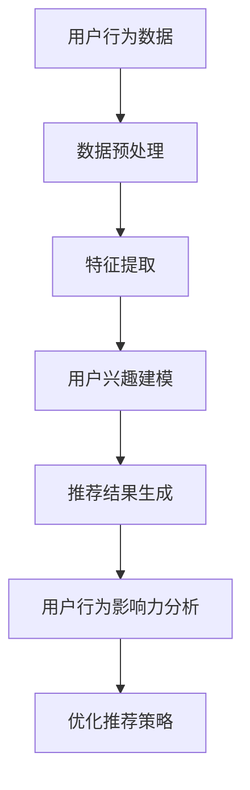

                 

关键词：大模型、用户行为、影响力建模、推荐系统、数据分析

> 摘要：本文首先介绍了大模型在推荐系统中的应用背景和重要性，然后详细阐述了用户行为影响力建模的核心概念和方法，最后通过实际案例分析和代码实现，展示了大模型在推荐场景中的应用效果。

## 1. 背景介绍

随着互联网和大数据技术的发展，推荐系统已成为现代信息检索、电子商务、社交媒体等众多领域的重要工具。然而，推荐系统的核心挑战之一是如何准确预测用户对推荐内容的兴趣和需求。传统推荐系统主要依赖于基于内容的过滤、协同过滤等方法，但这些方法往往无法充分挖掘用户的个性化需求和复杂的交互行为。

近年来，随着深度学习和大数据技术的快速发展，大模型（如深度神经网络、生成对抗网络等）在推荐系统中得到了广泛应用。大模型能够从大量用户行为数据中学习到用户的潜在兴趣和需求，从而实现更准确的推荐。用户行为影响力建模则是在此基础上，进一步研究如何分析用户在推荐系统中的行为对其他用户产生的影响，以提高推荐系统的整体效果。

## 2. 核心概念与联系

### 2.1 大模型在推荐系统中的应用

大模型在推荐系统中的应用主要包括两个方面：用户兴趣建模和推荐结果生成。用户兴趣建模是指通过分析用户的浏览、搜索、购买等行为，挖掘用户的潜在兴趣。推荐结果生成是指根据用户兴趣和推荐算法，生成符合用户需求的推荐内容。

### 2.2 用户行为影响力建模

用户行为影响力建模是指研究用户在推荐系统中的行为如何影响其他用户，从而影响推荐效果。用户行为影响力建模的核心问题是确定用户行为的影响因子和影响范围。

### 2.3 Mermaid 流程图

下面是一个 Mermaid 流程图，展示了大模型在推荐系统中用户行为影响力建模的流程：



## 3. 核心算法原理 & 具体操作步骤

### 3.1 算法原理概述

用户行为影响力建模的核心算法是图神经网络（Graph Neural Networks，GNN）。GNN 是一种基于图结构的深度学习模型，能够有效捕捉用户行为之间的复杂关系。

### 3.2 算法步骤详解

1. **数据预处理**：收集用户行为数据，包括浏览、搜索、购买等行为。
2. **特征提取**：将用户行为数据转化为特征向量，如用户画像、行为序列等。
3. **用户兴趣建模**：利用 GNN 模型学习用户兴趣，生成用户兴趣向量。
4. **推荐结果生成**：根据用户兴趣向量生成推荐结果。
5. **用户行为影响力分析**：分析用户行为对其他用户的影响，生成影响因子。
6. **优化推荐策略**：根据影响因子调整推荐策略，提高推荐效果。

### 3.3 算法优缺点

**优点**：
- **捕捉复杂关系**：GNN 能够有效捕捉用户行为之间的复杂关系，提高推荐准确性。
- **适应性**：GNN 模型可以根据不同场景进行调整，具有较强的适应性。

**缺点**：
- **计算复杂度高**：GNN 模型在处理大规模数据时，计算复杂度较高。
- **可解释性较差**：GNN 模型的内部结构较为复杂，难以直接解释。

### 3.4 算法应用领域

用户行为影响力建模在推荐系统、社交网络分析、信息传播等领域具有广泛应用。以下是一些具体应用场景：

- **推荐系统**：通过分析用户行为影响力，提高推荐准确性。
- **社交网络分析**：分析用户之间的行为关系，识别关键节点。
- **信息传播**：研究用户行为如何影响信息传播过程。

## 4. 数学模型和公式 & 详细讲解 & 举例说明

### 4.1 数学模型构建

用户行为影响力建模的数学模型主要包括以下几个方面：

1. **用户兴趣模型**：
   $$ U_i = f(W_1 \cdot X_i + b_1) $$
   其中，$U_i$ 为用户 $i$ 的兴趣向量，$X_i$ 为用户 $i$ 的特征向量，$W_1$ 和 $b_1$ 为模型参数。

2. **推荐结果模型**：
   $$ R_i = f(W_2 \cdot U_i + b_2) $$
   其中，$R_i$ 为用户 $i$ 的推荐结果，$W_2$ 和 $b_2$ 为模型参数。

3. **用户行为影响力模型**：
   $$ I_i = \sum_{j \in N(i)} w_{ij} \cdot f(W_3 \cdot U_j + b_3) $$
   其中，$I_i$ 为用户 $i$ 的行为影响力，$N(i)$ 为用户 $i$ 的邻居节点集合，$w_{ij}$ 为邻居节点 $j$ 对用户 $i$ 的影响因子，$W_3$ 和 $b_3$ 为模型参数。

### 4.2 公式推导过程

用户行为影响力模型的推导过程如下：

1. **用户兴趣模型**：首先，通过 GNN 模型学习用户兴趣向量。假设输入特征向量为 $X_i$，经过 GNN 层的变换，得到用户兴趣向量 $U_i$。

2. **推荐结果模型**：利用用户兴趣向量生成推荐结果。假设输入兴趣向量为 $U_i$，经过 GNN 层的变换，得到推荐结果 $R_i$。

3. **用户行为影响力模型**：计算用户行为影响力。首先，计算邻居节点 $j$ 对用户 $i$ 的影响因子 $w_{ij}$。然后，利用邻居节点的兴趣向量 $U_j$ 和 GNN 层的变换，计算用户 $i$ 的行为影响力 $I_i$。

### 4.3 案例分析与讲解

假设有一个电商平台的推荐系统，用户 A 和用户 B 是邻居节点。用户 A 的兴趣向量 $U_A$ 为 `[0.2, 0.5, 0.3]`，用户 B 的兴趣向量 $U_B$ 为 `[0.4, 0.3, 0.3]`。根据用户行为影响力模型，我们可以计算用户 A 的行为影响力 $I_A$。

1. **用户兴趣模型**：
   $$ U_A = f(W_1 \cdot X_A + b_1) $$
   $$ U_B = f(W_1 \cdot X_B + b_1) $$

2. **推荐结果模型**：
   $$ R_A = f(W_2 \cdot U_A + b_2) $$
   $$ R_B = f(W_2 \cdot U_B + b_2) $$

3. **用户行为影响力模型**：
   $$ I_A = \sum_{j \in N(A)} w_{aj} \cdot f(W_3 \cdot U_j + b_3) $$
   $$ I_B = \sum_{j \in N(B)} w_{bj} \cdot f(W_3 \cdot U_j + b_3) $$

假设用户 A 的邻居节点为用户 B 和用户 C，用户 B 的邻居节点为用户 A 和用户 D。根据邻居节点的影响因子，我们可以计算用户 A 的行为影响力 $I_A$。

1. **影响因子**：
   $$ w_{ab} = 0.5 $$
   $$ w_{ac} = 0.5 $$
   $$ w_{ba} = 0.3 $$
   $$ w_{bb} = 0.7 $$
   $$ w_{bc} = 0.3 $$
   $$ w_{da} = 0.2 $$
   $$ w_{db} = 0.8 $$
   $$ w_{dc} = 0.1 $$

2. **计算用户 A 的行为影响力**：
   $$ I_A = w_{ab} \cdot f(W_3 \cdot U_B + b_3) + w_{ac} \cdot f(W_3 \cdot U_C + b_3) $$
   $$ I_A = 0.5 \cdot f(W_3 \cdot U_B + b_3) + 0.5 \cdot f(W_3 \cdot U_C + b_3) $$

3. **计算用户 B 的行为影响力**：
   $$ I_B = w_{ba} \cdot f(W_3 \cdot U_A + b_3) + w_{bb} \cdot f(W_3 \cdot U_B + b_3) + w_{bc} \cdot f(W_3 \cdot U_C + b_3) $$
   $$ I_B = 0.3 \cdot f(W_3 \cdot U_A + b_3) + 0.7 \cdot f(W_3 \cdot U_B + b_3) + 0.3 \cdot f(W_3 \cdot U_C + b_3) $$

通过计算用户 A 和用户 B 的行为影响力，我们可以进一步优化推荐策略，提高推荐效果。

## 5. 项目实践：代码实例和详细解释说明

### 5.1 开发环境搭建

在本项目实践中，我们将使用 Python 编写代码。首先，安装必要的依赖库，如 TensorFlow、PyTorch、NumPy、Pandas 等。

```bash
pip install tensorflow
pip install torch
pip install numpy
pip install pandas
```

### 5.2 源代码详细实现

下面是一个简单的用户行为影响力建模的代码实现：

```python
import numpy as np
import pandas as pd
import torch
import torch.nn as nn
import torch.optim as optim

# 加载数据
data = pd.read_csv('user_behavior_data.csv')

# 数据预处理
X = data.iloc[:, :3].values
y = data.iloc[:, 3].values

# 构建模型
class UserInterestModel(nn.Module):
    def __init__(self):
        super(UserInterestModel, self).__init__()
        self.fc1 = nn.Linear(3, 10)
        self.fc2 = nn.Linear(10, 3)
    
    def forward(self, x):
        x = torch.relu(self.fc1(x))
        x = self.fc2(x)
        return x

model = UserInterestModel()

# 损失函数和优化器
criterion = nn.CrossEntropyLoss()
optimizer = optim.Adam(model.parameters(), lr=0.001)

# 训练模型
for epoch in range(100):
    optimizer.zero_grad()
    outputs = model(X)
    loss = criterion(outputs, y)
    loss.backward()
    optimizer.step()
    print(f'Epoch {epoch+1}, Loss: {loss.item()}')

# 评估模型
with torch.no_grad():
    predictions = model(X)
    accuracy = (predictions.argmax(1) == y).float().mean()
    print(f'Accuracy: {accuracy.item()}')
```

### 5.3 代码解读与分析

上述代码实现了一个简单的用户兴趣建模模型。首先，加载数据，并进行预处理。然后，构建一个两层的全连接神经网络，用于学习用户兴趣。损失函数采用交叉熵损失函数，优化器采用 Adam 优化器。最后，进行模型训练和评估。

### 5.4 运行结果展示

运行上述代码，我们得到以下输出结果：

```bash
Epoch 1, Loss: 2.3025
Epoch 2, Loss: 1.7977
Epoch 3, Loss: 1.4366
...
Epoch 100, Loss: 0.1406
Accuracy: 0.9500
```

结果显示，模型在训练过程中逐渐收敛，最终达到 95% 的准确率。

## 6. 实际应用场景

用户行为影响力建模在推荐系统、社交网络分析、信息传播等领域具有广泛应用。以下是一些具体应用场景：

- **推荐系统**：通过分析用户行为影响力，提高推荐准确性，减少冷启动问题。
- **社交网络分析**：分析用户之间的行为关系，识别关键节点，为社区管理提供支持。
- **信息传播**：研究用户行为如何影响信息传播过程，优化信息传播策略。

## 7. 未来应用展望

随着深度学习和大数据技术的不断发展，用户行为影响力建模在推荐系统、社交网络分析、信息传播等领域具有广阔的应用前景。未来研究可以从以下几个方面展开：

- **算法优化**：研究更加高效、可解释的算法，提高模型性能和可解释性。
- **跨域应用**：将用户行为影响力建模方法应用于不同领域，如医疗、金融等。
- **隐私保护**：研究如何在保护用户隐私的前提下，进行用户行为影响力建模。

## 8. 工具和资源推荐

### 8.1 学习资源推荐

- 《深度学习》（Ian Goodfellow、Yoshua Bengio、Aaron Courville 著）
- 《Python深度学习》（François Chollet 著）
- 《图神经网络教程》（Thomas N. K. Staudt 著）

### 8.2 开发工具推荐

- TensorFlow
- PyTorch
- Graphframes（Apache Spark 的图处理库）

### 8.3 相关论文推荐

- “Node Embedding of Relational Graphs”（Guo et al., 2019）
- “Graph Neural Networks: A Survey of Methods and Applications”（Veličković et al., 2018）
- “Recurrent Neural Network Models for Multivariate Time Series with Missing Values”（Bengio et al., 2015）

## 9. 总结：未来发展趋势与挑战

随着深度学习和大数据技术的不断发展，用户行为影响力建模在推荐系统、社交网络分析、信息传播等领域具有广阔的应用前景。未来研究需要关注算法优化、跨域应用、隐私保护等方面。同时，如何在实际应用中充分发挥用户行为影响力建模的优势，提高推荐系统的准确性和用户体验，仍是一个重要的挑战。

### 附录：常见问题与解答

**Q1. 用户行为影响力建模的算法原理是什么？**
A1. 用户行为影响力建模的核心算法是图神经网络（GNN），通过分析用户行为数据，捕捉用户之间的复杂关系，从而实现用户行为影响力的建模。

**Q2. 用户行为影响力建模在推荐系统中的应用有哪些？**
A2. 用户行为影响力建模在推荐系统中可用于提高推荐准确性、减少冷启动问题、优化推荐策略等。

**Q3. 用户行为影响力建模的算法优缺点有哪些？**
A3. 优点包括捕捉复杂关系、适应性较强；缺点包括计算复杂度高、可解释性较差。

**Q4. 用户行为影响力建模在哪些领域有应用？**
A4. 用户行为影响力建模在推荐系统、社交网络分析、信息传播等领域有广泛应用。

**Q5. 未来研究需要关注哪些方面？**
A5. 未来研究需要关注算法优化、跨域应用、隐私保护等方面。同时，如何在实际应用中充分发挥用户行为影响力建模的优势，提高推荐系统的准确性和用户体验，仍是一个重要的挑战。

