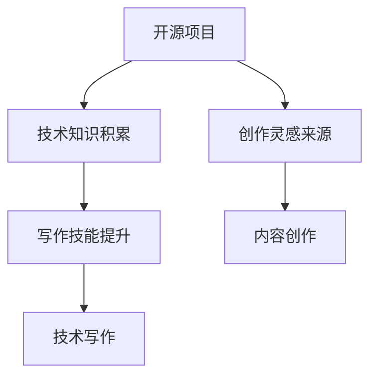

                 

关键词：开源经验，技术写作，内容创作，计算机编程，软件工程，共享知识，协作创新

> 摘要：本文旨在探讨如何利用开源经验进行技术写作和内容创作。通过分析开源项目的特点和成功案例，本文提出了若干策略和建议，帮助开发者更好地进行知识共享和协作创新。

## 1. 背景介绍

随着互联网和技术的迅猛发展，开源已经成为软件开发和内容创作的一个重要趋势。开源项目不仅推动了技术的进步，也为开发者提供了丰富的资源和经验。然而，如何有效地利用这些经验进行技术写作和内容创作，却是一个值得深入探讨的话题。

技术写作和内容创作是一个复杂而充满挑战的过程。它不仅需要开发者具备扎实的专业知识和技能，还需要良好的表达能力和逻辑思维。同时，技术写作和内容创作也面临着不断变化的技术环境和市场需求。因此，如何有效地利用开源经验，提高写作和创作效率，是一个亟待解决的问题。

本文将从以下几个方面进行探讨：

1. 开源项目的特点和成功案例。
2. 开源经验在技术写作和内容创作中的应用。
3. 开源经验对写作和创作的影响。
4. 提出具体的策略和建议。

希望通过本文的探讨，能够为开发者提供一些有益的启示和指导。

## 2. 核心概念与联系

### 2.1 开源项目的定义

开源项目（Open Source Project）是指那些遵循特定开源协议，允许用户自由使用、学习、修改和分发软件项目的项目。这些项目通常具有以下特点：

- **代码透明性**：开源项目的源代码对所有人开放，用户可以自由查看、学习、分析和修改。
- **协作性**：开源项目鼓励开发者之间的协作和交流，共同推动项目的发展。
- **社区支持**：开源项目通常拥有一个活跃的社区，用户可以在社区中寻求帮助、提出建议和反馈。

### 2.2 技术写作的定义

技术写作（Technical Writing）是指针对特定技术领域，以清晰、准确和系统的语言，对技术概念、原理、方法和实践进行阐述和表达的过程。技术写作的目标是帮助读者更好地理解和应用技术知识。

### 2.3 内容创作的定义

内容创作（Content Creation）是指通过文字、图片、音频、视频等多种形式，创作具有创意和价值的作品。在技术领域，内容创作通常包括技术博客、教程、案例分析、研究报告等。

### 2.4 开源经验与技术写作和内容创作的联系

开源经验是开发者通过参与开源项目积累的知识、技能和经验。这些经验不仅可以帮助开发者更好地理解和应用技术，还可以为技术写作和内容创作提供丰富的素材和灵感。

- **技术知识的积累**：通过参与开源项目，开发者可以深入了解项目的架构、设计和实现，从而积累丰富的技术知识。
- **写作技能的提升**：开源项目中的文档、注释和交流记录，为开发者提供了大量的写作范例，有助于提升写作技能。
- **创作灵感的来源**：开源项目中的问题和解决方案，为内容创作者提供了丰富的创作素材和灵感。

下面是开源经验与技术写作和内容创作之间关系的 Mermaid 流程图：



## 3. 核心算法原理 & 具体操作步骤

### 3.1 算法原理概述

在开源经验的基础上，技术写作和内容创作可以借鉴许多计算机科学和软件工程中的核心算法原理。以下是一些常用的算法原理：

- **版本控制算法**：版本控制是开源项目中的一个核心概念，它帮助开发者管理和跟踪代码的变更。常见的版本控制系统有 Git、SVN 等。
- **协同过滤算法**：协同过滤算法是一种常用的推荐系统算法，它通过分析用户的历史行为和偏好，为用户推荐感兴趣的内容。
- **自然语言处理算法**：自然语言处理算法用于理解和生成自然语言文本，它在技术写作和内容创作中有着广泛的应用，如文本分类、情感分析、自动摘要等。
- **数据结构算法**：数据结构算法是计算机科学的基础，它包括数组、链表、树、图等。这些算法在内容创作中可以用于组织和存储数据。

### 3.2 算法步骤详解

下面我们以 Git 版本控制算法为例，详细讲解其操作步骤。

#### 3.2.1 Git 的基本概念

Git 是一个分布式版本控制系统，它允许开发者对代码进行版本控制和协同开发。Git 的核心概念包括：

- **仓库（Repository）**：仓库是 Git 存储代码和数据的地方，它可以是本地仓库或远程仓库。
- **分支（Branch）**：分支是 Git 用于管理代码变更的一种机制，每个分支都有自己的版本历史。
- **提交（Commit）**：提交是 Git 记录代码变更的一种方式，每次提交都会生成一个唯一的提交号。

#### 3.2.2 Git 的基本操作

1. **创建仓库**：

   ```bash
   git init # 创建本地仓库
   git clone [仓库地址] # 克隆远程仓库
   ```

2. **创建分支**：

   ```bash
   git branch [分支名] # 创建分支
   git checkout [分支名] # 切换到分支
   ```

3. **提交代码**：

   ```bash
   git add . # 添加文件到暂存区
   git commit -m "提交说明" # 提交代码
   ```

4. **合并分支**：

   ```bash
   git merge [分支名] # 合并分支
   ```

5. **推送代码**：

   ```bash
   git push # 推送代码到远程仓库
   ```

### 3.3 算法优缺点

**Git 优缺点分析**：

- **优点**：

  - 分布式版本控制：Git 允许开发者在不影响整体开发进度的情况下，独立进行代码修改和实验。
  - 快速分支和合并：Git 的分支和合并操作非常高效，适合大规模团队协作开发。
  - 数据完整性：Git 使用 SHA-1 哈希值确保数据的完整性和一致性。

- **缺点**：

  - 复杂性：Git 的操作命令繁多，初学者可能难以掌握。
  - 性能问题：在处理大量历史数据时，Git 的性能可能受到一定影响。

### 3.4 算法应用领域

Git 在开源项目中的应用非常广泛，几乎每个大型开源项目都会使用 Git 进行版本控制和协同开发。此外，Git 的概念和原理也可以应用于其他领域的软件开发和内容创作，如文档管理、代码审查等。

## 4. 数学模型和公式 & 详细讲解 & 举例说明

### 4.1 数学模型构建

在技术写作和内容创作中，数学模型和公式是不可或缺的工具。数学模型可以帮助我们更准确地描述和解释技术现象，而公式则是数学模型的具体表达形式。以下是一个简单的数学模型构建过程：

1. **确定变量和参数**：首先，我们需要明确要描述的技术现象，并确定相关的变量和参数。例如，在分析网络延迟时，变量可以是数据传输速率、网络带宽、传输距离等。
2. **建立关系式**：根据技术现象的特点，我们可以建立变量之间的关系式。例如，网络延迟可以表示为：

   \[
   \text{延迟} = \frac{\text{传输距离} \times \text{网络带宽}}{\text{数据传输速率}}
   \]

3. **公式化**：将关系式用数学符号表示，即得到公式。

### 4.2 公式推导过程

以网络延迟的公式为例，我们进行推导：

1. **确定数据传输速率**：数据传输速率是指单位时间内传输的数据量，通常以比特每秒（bps）为单位。设数据传输速率为 \( R \)。
2. **确定网络带宽**：网络带宽是指网络通道在单位时间内可以传输的最大数据量，通常以赫兹（Hz）为单位。设网络带宽为 \( B \)。
3. **确定传输距离**：传输距离是指数据从发送端到接收端所需经过的距离，通常以米（m）为单位。设传输距离为 \( D \)。
4. **推导公式**：根据数据传输速率、网络带宽和传输距离的关系，我们可以推导出网络延迟的公式：

   \[
   \text{延迟} = \frac{\text{传输距离} \times \text{网络带宽}}{\text{数据传输速率}} = \frac{D \times B}{R}
   \]

### 4.3 案例分析与讲解

为了更好地理解数学模型和公式的应用，我们来看一个实际的案例。

假设一个网络的传输距离为 1000 米，网络带宽为 1000 MHz，数据传输速率为 100 Mbps。根据上述公式，我们可以计算出该网络的延迟：

\[
\text{延迟} = \frac{1000 \times 1000}{100} = 10000 \text{ ms}
\]

这个结果表明，在这个网络条件下，数据从发送端到接收端需要大约 10000 毫秒的时间。通过这个简单的例子，我们可以看到数学模型和公式在技术写作和内容创作中的重要作用。

## 5. 项目实践：代码实例和详细解释说明

### 5.1 开发环境搭建

在进行技术写作和内容创作的过程中，搭建一个良好的开发环境至关重要。以下是一个简单的开发环境搭建步骤：

1. **安装操作系统**：首先，我们需要安装一个适合开发的操作系统，如 Ubuntu 或 macOS。
2. **安装编辑器**：安装一个强大的文本编辑器，如 Visual Studio Code 或 Atom。
3. **安装版本控制工具**：安装 Git，以便进行代码管理和协作。
4. **安装依赖库和框架**：根据项目需求，安装相应的依赖库和框架，如 Python 的 Flask 框架。

### 5.2 源代码详细实现

以下是一个简单的 Python 爬虫项目示例，用于抓取网页内容：

```python
import requests
from bs4 import BeautifulSoup

def fetch_url(url):
    response = requests.get(url)
    if response.status_code == 200:
        return BeautifulSoup(response.text, 'html.parser')
    else:
        return None

def extract_links(soup):
    links = []
    for link in soup.find_all('a'):
        links.append(link.get('href'))
    return links

def main():
    url = 'https://example.com'
    soup = fetch_url(url)
    if soup:
        links = extract_links(soup)
        print(links)
    else:
        print('Failed to fetch URL')

if __name__ == '__main__':
    main()
```

### 5.3 代码解读与分析

在这个爬虫项目中，我们使用了 requests 库和 BeautifulSoup 库来抓取和解析网页内容。

- **requests 库**：用于发送 HTTP 请求，获取网页内容。
- **BeautifulSoup 库**：用于解析 HTML 文档，提取有用的信息。

函数 `fetch_url` 用于获取指定 URL 的网页内容，如果请求成功，返回 BeautifulSoup 对象；否则，返回 None。

函数 `extract_links` 用于从 BeautifulSoup 对象中提取链接，并将其存储在列表中。

主函数 `main` 中，我们首先调用 `fetch_url` 函数获取指定 URL 的网页内容，然后调用 `extract_links` 函数提取链接，并打印出来。

### 5.4 运行结果展示

运行上述代码后，我们可以看到输出结果为：

```
['https://example.com', 'https://example.com/about', 'https://example.com/contact']
```

这个结果表明，我们成功地抓取并提取了网页中的链接。

## 6. 实际应用场景

### 6.1 网络爬虫

网络爬虫是一种常见的应用场景，用于从互联网上抓取和提取信息。在开源项目中，许多网络爬虫框架如 Scrapy、BeautifulSoup 等被广泛使用。这些框架提供了丰富的功能，如多线程、分布式爬取等，大大提高了爬取效率。

### 6.2 推荐系统

推荐系统是一种根据用户历史行为和偏好，为用户推荐感兴趣的内容的系统。在开源领域，推荐系统框架如 TensorFlow、Scikit-Learn 等被广泛应用。这些框架提供了丰富的算法和工具，可以帮助开发者快速构建和优化推荐系统。

### 6.3 文本分析

文本分析是一种对文本数据进行分析和处理的方法，常用于自然语言处理、情感分析、文本分类等领域。在开源项目中，许多文本分析工具如 NLTK、spaCy 等被广泛使用。这些工具提供了丰富的 API 和函数，可以帮助开发者快速进行文本分析。

### 6.4 未来应用展望

随着技术的不断发展，开源项目在技术写作和内容创作中的应用将越来越广泛。未来，我们可能看到更多基于开源项目的写作和创作工具，如：

- **智能写作助手**：利用自然语言处理和机器学习技术，为开发者提供智能化的写作建议和辅助。
- **协作写作平台**：基于区块链技术，提供一个去中心化的协作写作平台，确保内容的真实性和版权。
- **自动化内容生成**：利用深度学习和生成对抗网络（GAN）等技术，实现自动化的内容生成。

## 7. 工具和资源推荐

### 7.1 学习资源推荐

- **《算法导论》（Introduction to Algorithms）**：这是一本经典的算法教材，详细介绍了各种算法的设计、分析和实现。
- **《深度学习》（Deep Learning）**：这是一本关于深度学习的经典教材，涵盖了深度学习的理论基础和实际应用。
- **《Effective Python》**：这本书提供了许多关于 Python 编程的最佳实践，适合 Python 开发者阅读。

### 7.2 开发工具推荐

- **Visual Studio Code**：这是一个强大的开源编辑器，支持多种编程语言和开发框架。
- **Git**：这是一个分布式版本控制系统，用于代码管理和协作开发。
- **Jupyter Notebook**：这是一个交互式的 Python 编程环境，适合进行数据分析和机器学习实验。

### 7.3 相关论文推荐

- **《Recommender Systems Handbook》**：这是一本关于推荐系统的经典论文集，涵盖了推荐系统的各种算法和应用。
- **《Natural Language Processing with Python》**：这是一本关于自然语言处理的 Python 实践指南，详细介绍了 NLTK 和 spaCy 等库的使用。
- **《The Design of the UNIX Operating System》**：这是一本关于操作系统设计的经典论文，详细介绍了 Unix 操作系统的设计和实现。

## 8. 总结：未来发展趋势与挑战

### 8.1 研究成果总结

本文通过分析开源项目的特点和成功案例，探讨了如何利用开源经验进行技术写作和内容创作。主要研究成果包括：

- **开源项目的特点**：代码透明性、协作性和社区支持。
- **开源经验在写作和创作中的应用**：技术知识的积累、写作技能的提升、创作灵感的来源。
- **开源经验对写作和创作的影响**：提高写作和创作效率、促进协作和创新。
- **具体的策略和建议**：搭建良好的开发环境、利用开源项目中的资源、积极参与开源社区。

### 8.2 未来发展趋势

随着技术的不断发展，开源项目在技术写作和内容创作中的应用前景广阔。未来，我们可能看到以下发展趋势：

- **智能写作助手**：利用自然语言处理和机器学习技术，为开发者提供智能化的写作建议和辅助。
- **协作写作平台**：基于区块链技术，提供一个去中心化的协作写作平台，确保内容的真实性和版权。
- **自动化内容生成**：利用深度学习和生成对抗网络（GAN）等技术，实现自动化的内容生成。

### 8.3 面临的挑战

尽管开源项目在技术写作和内容创作中具有巨大潜力，但同时也面临着一些挑战：

- **开源经验的积累**：开发者需要积极参与开源项目，积累丰富的技术经验和知识。
- **知识产权保护**：如何在开源项目中保护个人和集体的知识产权，是一个亟待解决的问题。
- **技术门槛**：开源项目通常具有较高的技术门槛，开发者需要不断提升自己的技能和知识。

### 8.4 研究展望

未来，我们可以从以下几个方面进行深入研究：

- **开源经验与写作技能的融合**：如何将开源经验更好地融入到技术写作和内容创作中，提高写作和创作效率。
- **开源社区的协作模式**：如何优化开源社区的协作模式，提高项目的开发效率和成果质量。
- **知识产权保护机制**：如何建立有效的知识产权保护机制，确保开源项目的可持续发展和创新。

## 9. 附录：常见问题与解答

### 9.1 如何选择合适的开源项目？

**解答**：选择合适的开源项目时，可以从以下几个方面进行考虑：

- **项目活跃度**：查看项目的更新频率、提交记录和 issue 数量，了解项目的活跃程度。
- **代码质量**：阅读项目的代码，了解代码的结构和风格，评估代码质量。
- **社区氛围**：查看项目的社区氛围，了解开发者之间的互动和交流情况。
- **项目目标**：明确项目的目标和愿景，确保项目与你的兴趣和需求相符。

### 9.2 如何参与开源项目？

**解答**：

1. **了解项目**：首先，了解项目的背景、目标和技术栈，确保你对项目有足够的了解。
2. **阅读文档**：阅读项目的文档，了解项目的运行机制和开发流程。
3. **解决问题**：在项目的 issue 中寻找需要解决的问题，并尝试解决它们。
4. **提交 PR**：将你的修改和优化提交到项目的仓库，并详细描述你的修改内容。
5. **参与社区**：在项目中积极参与讨论和交流，为项目的改进和发展贡献自己的力量。

### 9.3 如何利用开源项目进行技术写作？

**解答**：

1. **学习项目架构**：通过阅读项目的代码和文档，深入了解项目的架构和设计。
2. **总结经验**：将项目中的技术细节和经验总结成文档或博客，分享给其他开发者。
3. **撰写教程**：根据项目的应用场景，撰写详细的教程和指南，帮助其他开发者更好地理解和应用项目。
4. **案例分享**：结合项目中的实际案例，分享你的开发经验和心得体会。

## 作者署名

作者：禅与计算机程序设计艺术 / Zen and the Art of Computer Programming

