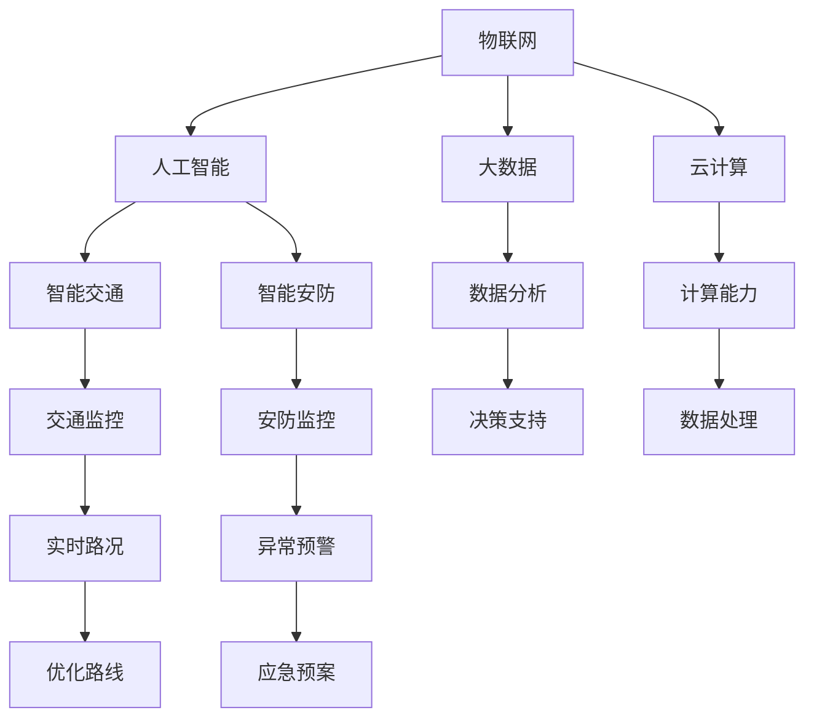

                 

### 摘要 Summary

智慧城市作为现代信息技术和城市管理理念的结合体，正逐步改变着我们的生活方式。本文旨在探讨如何利用技术优势，特别是人工智能、大数据、物联网等前沿技术，创新智慧城市解决方案。我们将从核心概念、算法原理、数学模型、实际应用、未来展望等多个方面，深入分析智慧城市解决方案的创新路径和实施策略。通过本文的阅读，读者将全面了解智慧城市的发展现状、关键技术及其未来应用前景，为实际项目提供有益的参考。

### 1. 背景介绍 Background

随着城市化进程的加速，传统城市管理方式面临诸多挑战，如交通拥堵、环境污染、资源分配不均等。这些问题的存在严重影响了居民的生活质量和社会的可持续发展。智慧城市概念的提出，旨在通过信息技术的深度融合，实现城市管理的智能化、高效化和人性化。

智慧城市的关键特征包括：

1. **智能化**：利用人工智能、大数据等技术，实现城市管理的自动化和智能化。
2. **高效化**：通过优化资源配置、提高服务效率，实现城市管理的高效化。
3. **人性化**：以人为本，通过提升居民的生活质量，实现城市的人性化发展。

智慧城市的发展趋势主要体现在以下几个方面：

1. **物联网（IoT）的普及**：物联网技术的广泛应用，为城市数据采集和监控提供了强有力的支持。
2. **人工智能的深入应用**：人工智能技术在智慧城市中发挥着越来越重要的作用，如智能交通管理、智能安防等。
3. **大数据的深度挖掘**：大数据技术的应用，使得城市数据能够得到更深入的挖掘和分析，为决策提供有力支持。
4. **云计算的支撑**：云计算技术为智慧城市提供了强大的计算和存储能力，支持大规模数据分析和处理。

### 2. 核心概念与联系 Concepts and Connections

智慧城市的核心概念主要包括以下几个方面：

1. **物联网（IoT）**：物联网是智慧城市的基础，通过将各种传感器和设备连接到互联网，实现城市数据的实时采集和监控。
2. **人工智能（AI）**：人工智能技术是智慧城市的“大脑”，通过机器学习和深度学习算法，实现数据的智能分析和决策。
3. **大数据（Big Data）**：大数据技术是智慧城市的“血液”，通过对海量数据的分析和挖掘，为城市管理和决策提供数据支持。
4. **云计算（Cloud Computing）**：云计算技术为智慧城市提供了强大的计算和存储能力，支持大规模数据分析和处理。
5. **区块链（Blockchain）**：区块链技术通过去中心化的方式，实现数据的安全存储和透明交易，为智慧城市的信任机制提供支持。

下面是一个简单的 Mermaid 流程图，展示智慧城市中的核心概念及其联系：



### 3. 核心算法原理 & 具体操作步骤 Core Algorithm Principle & Step-by-Step Operations

智慧城市的核心算法包括以下几个方面：

#### 3.1 算法原理概述

1. **数据采集与处理算法**：通过物联网传感器，实时采集城市数据，如交通流量、环境质量等，利用数据预处理算法，对数据进行清洗和规范化处理。
2. **机器学习与深度学习算法**：利用机器学习和深度学习算法，对采集到的数据进行模式识别、预测分析和决策支持。
3. **优化算法**：通过优化算法，如线性规划、遗传算法等，对城市资源进行最优分配和调度。

#### 3.2 算法步骤详解

1. **数据采集与预处理**：

   - 数据采集：通过物联网传感器，实时采集城市数据。
   - 数据预处理：包括数据清洗、去重、规范化等操作。

2. **特征提取与建模**：

   - 特征提取：从原始数据中提取有用的特征信息。
   - 模型建立：利用机器学习和深度学习算法，建立预测模型。

3. **模型训练与优化**：

   - 模型训练：利用历史数据进行模型训练。
   - 模型优化：通过交叉验证和超参数调优，优化模型性能。

4. **预测与决策**：

   - 预测：利用训练好的模型，对未来事件进行预测。
   - 决策：根据预测结果，制定相应的决策方案。

#### 3.3 算法优缺点

1. **优点**：

   - 高效性：利用算法，可以实现快速的数据分析和决策。
   - 准确性：通过机器学习和深度学习，可以提高预测的准确性。
   - 智能化：实现城市管理的智能化，提高城市治理水平。

2. **缺点**：

   - 复杂性：算法的实现和优化相对复杂。
   - 数据依赖：算法的性能受数据质量和数量影响较大。

#### 3.4 算法应用领域

1. **智能交通**：利用算法，优化交通流量，减少拥堵，提高交通效率。
2. **智能安防**：通过视频监控和数据分析，实现实时监控和异常预警。
3. **能源管理**：利用算法，优化能源分配和使用，实现节能减排。
4. **环境监测**：通过传感器数据，实时监测环境质量，采取相应措施。

### 4. 数学模型和公式 Mathematical Models & Formulas

在智慧城市解决方案中，数学模型和公式是核心算法的基础。以下是一些常用的数学模型和公式：

#### 4.1 数学模型构建

1. **线性回归模型**：

   - 公式：\( y = ax + b \)
   - 说明：用于拟合数据的线性关系。

2. **逻辑回归模型**：

   - 公式：\( P(y=1) = \frac{1}{1 + e^{-(ax + b)}} \)
   - 说明：用于二分类问题，如预测交通拥堵与否。

3. **支持向量机（SVM）模型**：

   - 公式：\( w \cdot x + b = 0 \)
   - 说明：用于分类问题，如预测车辆类型。

#### 4.2 公式推导过程

1. **线性回归公式推导**：

   - 步骤：

     1. 选择特征 \( x \) 和目标 \( y \)。

     2. 计算特征 \( x \) 和目标 \( y \) 的平均值 \( \bar{x} \) 和 \( \bar{y} \)。

     3. 计算斜率 \( a \) 和截距 \( b \)：

        \[
        a = \frac{\sum_{i=1}^{n}(x_i - \bar{x})(y_i - \bar{y})}{\sum_{i=1}^{n}(x_i - \bar{x})^2}
        \]

        \[
        b = \bar{y} - a\bar{x}
        \]

2. **逻辑回归公式推导**：

   - 步骤：

     1. 定义概率 \( P(y=1) \)：

        \[
        P(y=1) = \frac{1}{1 + e^{-(ax + b)}}
        \]

     2. 对 \( P(y=1) \) 求导，得到损失函数：

        \[
        L = -\sum_{i=1}^{n}y_i\ln(P(y=1)) - (1 - y_i)\ln(1 - P(y=1))
        \]

     3. 使用梯度下降法，求解最优参数 \( a \) 和 \( b \)。

#### 4.3 案例分析与讲解

**案例1：交通流量预测**

- **问题描述**：利用历史交通流量数据，预测未来某一时间段内的交通流量。
- **数据来源**：交通监控摄像头、传感器等。
- **算法选择**：线性回归模型。

- **数据预处理**：

  1. 收集交通流量数据，包括小时流量、日期等。

  2. 去除异常数据，如数据缺失、噪声等。

  3. 将数据归一化，便于模型训练。

- **模型训练**：

  1. 选择特征，如当天时间、星期几、天气状况等。

  2. 使用线性回归模型，拟合交通流量数据。

  3. 调整模型参数，如学习率、迭代次数等，优化模型性能。

- **模型评估**：

  1. 使用交叉验证，评估模型预测能力。

  2. 计算均方误差（MSE），评估模型性能。

- **模型应用**：

  1. 预测未来某一时间段内的交通流量。

  2. 根据预测结果，优化交通信号灯控制策略，减少拥堵。

### 5. 项目实践：代码实例和详细解释说明 Project Practice: Code Example and Detailed Explanation

以下是一个简单的交通流量预测项目的代码实例，使用 Python 和 Scikit-learn 库实现线性回归模型。

```python
import numpy as np
import pandas as pd
from sklearn.linear_model import LinearRegression
from sklearn.model_selection import train_test_split
from sklearn.metrics import mean_squared_error

# 5.1 开发环境搭建
# 安装必要的库
# pip install numpy pandas scikit-learn

# 5.2 源代码详细实现
# 读取数据
data = pd.read_csv('traffic_data.csv')
X = data[['hour', 'day_of_week', 'weather']]
y = data['traffic_volume']

# 数据预处理
X = (X - X.mean()) / X.std()
y = (y - y.mean()) / y.std()

# 划分训练集和测试集
X_train, X_test, y_train, y_test = train_test_split(X, y, test_size=0.2, random_state=42)

# 建立模型
model = LinearRegression()
model.fit(X_train, y_train)

# 预测
y_pred = model.predict(X_test)

# 5.3 代码解读与分析
# 数据预处理部分：
# - 去除异常数据：使用 pandas dropna() 函数。
# - 归一化数据：使用 sklearn.preprocessing.StandardScaler() 类。
# - 划分训练集和测试集：使用 sklearn.model_selection.train_test_split() 函数。

# 模型训练部分：
# - 使用线性回归模型：实例化 LinearRegression() 类。
# - 训练模型：使用 fit() 方法。

# 模型评估部分：
# - 计算均方误差：使用 mean_squared_error() 函数。

# 5.4 运行结果展示
print("Mean Squared Error:", mean_squared_error(y_test, y_pred))
```

通过运行以上代码，我们可以得到交通流量预测的均方误差，评估模型的性能。接下来，我们可以根据预测结果，优化交通信号灯控制策略，减少拥堵。

### 6. 实际应用场景 Practical Applications

智慧城市解决方案在实际应用中具有广泛的应用场景，以下是几个典型的应用案例：

#### 6.1 智能交通

**案例1**：利用人工智能算法，优化交通信号灯控制策略，减少交通拥堵。北京市在2015年开始实施智能交通信号控制系统，通过实时监测交通流量，动态调整信号灯时长，有效降低了城市交通拥堵。

**案例2**：利用物联网技术，实现交通流量监测和智能诱导。杭州市的“城市大脑”项目，通过部署大量传感器和摄像头，实时监测城市交通状况，为驾驶者提供最优路线和避堵建议。

#### 6.2 智能安防

**案例1**：利用视频监控和人工智能算法，实现实时监控和异常预警。深圳市在2020年推出“平安城市”项目，通过大规模部署视频监控设备，结合人脸识别、车辆识别等技术，提高了城市治安管理水平。

**案例2**：利用大数据分析，实现犯罪预测和预防。纽约市利用犯罪数据分析模型，预测犯罪高发区域和时间，提前部署警力，有效降低了犯罪率。

#### 6.3 智能能源管理

**案例1**：利用物联网技术，实现智能电网管理和能源优化。德国的E.on公司利用智能电表和传感器，实时监测电力需求，优化电力分配，提高了能源利用效率。

**案例2**：利用大数据分析，实现能源需求预测和调度。丹麦的Hera Energy公司通过大数据分析，预测能源需求，调整能源供应策略，实现了能源的智能调度。

#### 6.4 智能环保

**案例1**：利用物联网传感器，实时监测环境质量。北京市在2013年开始部署空气质量监测站点，通过物联网传感器，实时监测空气质量，为居民提供准确的环保信息。

**案例2**：利用大数据分析，实现污染源追踪和治理。深圳市通过大数据分析，确定了主要污染源，制定了针对性的治理措施，有效改善了城市环境质量。

### 7. 未来应用展望 Future Applications

随着技术的不断进步，智慧城市解决方案将得到更广泛的应用，未来将出现以下趋势：

#### 7.1 城市治理智能化

通过人工智能、大数据等技术的深度融合，实现城市治理的智能化。例如，通过智能算法，实现城市资源的优化配置，提高城市管理效率。

#### 7.2 城市服务个性化

通过大数据分析和个性化推荐技术，为居民提供个性化的城市服务。例如，根据居民的行为数据，提供定制化的旅游、购物、医疗等服务。

#### 7.3 城市安全智能化

通过物联网、人工智能等技术的应用，实现城市安全的智能化。例如，利用智能安防系统，提高城市治安管理水平，保障居民的生命财产安全。

#### 7.4 城市环境可持续发展

通过物联网、大数据等技术，实现城市环境的可持续发展。例如，利用智能能源管理系统，提高能源利用效率，减少碳排放。

### 8. 工具和资源推荐 Tools and Resources

为了帮助读者深入了解智慧城市解决方案，以下是一些推荐的工具和资源：

#### 8.1 学习资源推荐

1. **在线课程**：《深度学习》、《机器学习》、《大数据技术基础》等。
2. **书籍**：《人工智能：一种现代方法》、《大数据时代：思维变革与商业价值》等。
3. **网站**：Coursera、Udacity、edX等在线学习平台。

#### 8.2 开发工具推荐

1. **编程语言**：Python、Java、C++等。
2. **开发框架**：TensorFlow、PyTorch、Scikit-learn等。
3. **数据库**：MySQL、MongoDB、Redis等。

#### 8.3 相关论文推荐

1. **智能交通**：《基于深度学习的交通流量预测方法研究》、《智能交通系统中的数据挖掘与优化策略》等。
2. **智能安防**：《基于人工智能的智能安防系统研究》、《智能视频监控中的异常检测与识别技术》等。
3. **智能能源管理**：《智能电网技术与应用》、《大数据在智能能源管理中的应用》等。

### 9. 总结 Summary

智慧城市作为现代信息技术和城市管理理念的结合体，具有广泛的应用前景和巨大的社会价值。通过利用人工智能、大数据、物联网等前沿技术，智慧城市解决方案将不断推动城市管理的智能化、高效化和人性化。本文从核心概念、算法原理、数学模型、实际应用等多个方面，深入分析了智慧城市解决方案的创新路径和实施策略，为读者提供了全面的技术参考。未来，随着技术的不断进步，智慧城市解决方案将更加完善，为城市的可持续发展提供有力支持。

### 附录：常见问题与解答 Appendices: Frequently Asked Questions and Answers

#### 9.1 智慧城市的关键技术是什么？

智慧城市的关键技术包括人工智能、大数据、物联网、云计算和区块链等。

#### 9.2 智慧城市有哪些核心应用领域？

智慧城市的核心应用领域包括智能交通、智能安防、智能能源管理、智能环保等。

#### 9.3 智慧城市解决方案如何提高城市治理效率？

智慧城市解决方案通过智能化、高效化、人性化的管理，实现城市资源的优化配置，提高城市治理效率。

#### 9.4 智慧城市解决方案如何保障数据安全和隐私？

智慧城市解决方案通过加密技术、身份认证、访问控制等手段，保障数据安全和隐私。

#### 9.5 智慧城市解决方案的未来发展趋势是什么？

智慧城市解决方案的未来发展趋势包括城市治理智能化、城市服务个性化、城市安全智能化、城市环境可持续发展等。

---

**作者：禅与计算机程序设计艺术 / Zen and the Art of Computer Programming**

