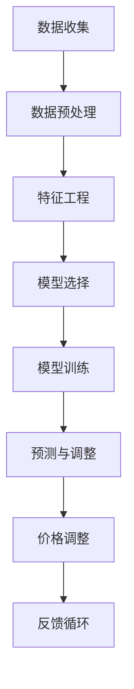

                 

关键词：动态定价，AI，市场供需，价格调整，机器学习，预测模型

> 摘要：本文深入探讨了动态定价在商业中的应用，特别关注了人工智能（AI）如何通过分析市场供需数据来实时调整价格。通过核心算法原理、数学模型、具体案例和实践步骤的详细讲解，文章旨在为读者提供对动态定价系统的全面了解。

## 1. 背景介绍

动态定价是一种灵活的价格调整策略，旨在根据市场需求、供应状况以及竞争环境实时调整产品或服务的价格。这一策略在电子商务、航空、酒店预订等行业中得到了广泛应用。传统上，企业依赖历史数据和直觉来设定价格，而现代商业环境的变化速度加快，消费者行为更加难以预测，使得传统定价方法逐渐显得力不从心。

随着人工智能技术的快速发展，特别是机器学习和大数据分析能力的提升，AI开始成为动态定价策略的核心工具。通过AI算法，企业能够更准确地预测市场需求，从而实现更加精准和高效的价格调整。

本文将首先介绍动态定价的基本概念，然后深入探讨AI在动态定价中的应用，包括核心算法原理、数学模型构建、实际案例分析和实践步骤。最后，我们将探讨动态定价的未来发展趋势以及面临的挑战。

## 2. 核心概念与联系

### 动态定价的概念

动态定价，又称实时定价或灵活定价，是一种通过实时分析和调整价格来最大化利润或满足特定商业目标的方法。与传统定价方法相比，动态定价更加灵活，能够快速响应市场变化。

### AI在动态定价中的作用

人工智能在动态定价中发挥着至关重要的作用。通过机器学习算法，AI能够分析大量的历史数据和实时数据，预测市场的未来走势，从而帮助企业在合适的时间点调整价格。

### 关联的算法和模型

为了实现动态定价，AI算法和数学模型是不可或缺的工具。常见的算法包括回归分析、决策树、神经网络和支持向量机等。数学模型则用于描述市场供需关系，例如线性模型、非线性模型和时间序列模型等。

### Mermaid 流程图

下面是一个Mermaid流程图，展示了动态定价系统中各个关键环节的流程。



在这个流程图中，数据收集是整个动态定价系统的起点，通过数据预处理和特征工程，我们能够从原始数据中提取出有价值的信息。然后，通过选择合适的机器学习模型进行训练，得到预测模型。预测结果用于指导价格调整，而调整后的价格则通过反馈循环不断优化模型，形成闭环控制。

## 3. 核心算法原理 & 具体操作步骤

### 3.1 算法原理概述

动态定价的核心在于如何根据市场供需变化实时调整价格。这需要使用机器学习算法来预测市场需求，并基于预测结果进行价格优化。以下是一些常用的机器学习算法：

- **回归分析**：通过建立数学模型来预测市场需求的数量。
- **决策树**：通过决策树模型分析不同变量的影响，从而确定最优价格。
- **神经网络**：使用多层神经网络模拟人类大脑的决策过程，进行复杂的非线性预测。
- **支持向量机**：通过寻找最佳分割超平面，将市场分为高需求区和低需求区，从而确定价格区间。

### 3.2 算法步骤详解

1. **数据收集**：收集与市场供需相关的数据，包括历史销售数据、竞争对手价格、消费者行为数据等。
2. **数据预处理**：对收集的数据进行清洗，处理缺失值、异常值，并标准化数据。
3. **特征工程**：从原始数据中提取出对预测有重要影响的特征，如季节性、促销活动、消费者偏好等。
4. **模型选择**：根据问题的复杂性和数据的特点，选择合适的机器学习模型。
5. **模型训练**：使用训练数据集对模型进行训练，调整模型参数以优化预测准确性。
6. **预测与调整**：使用训练好的模型对市场需求进行预测，并基于预测结果调整价格。
7. **价格调整**：根据市场需求预测结果，对产品或服务的价格进行实时调整。
8. **反馈循环**：收集实际销售数据，与预测数据进行对比，不断调整模型和策略。

### 3.3 算法优缺点

- **优点**：
  - 高度灵活，能够快速响应市场变化。
  - 提高利润，通过精确预测市场需求实现最大化利润。
  - 提高客户满意度，提供更加个性化的价格。

- **缺点**：
  - 对数据质量要求高，需要大量高质量的历史数据。
  - 需要持续优化，算法和模型需要定期更新。
  - 可能引起市场波动，过度的价格调整可能导致市场不稳定。

### 3.4 算法应用领域

动态定价算法广泛应用于多个领域：

- **电子商务**：电商平台通过动态定价来优化产品销售，提高市场份额。
- **航空行业**：航空公司根据市场需求实时调整票价，提高载客率。
- **酒店预订**：酒店行业通过动态定价策略来平衡客房供需，提高入住率。
- **零售业**：零售商通过动态定价来应对竞争对手的价格变化，保持竞争力。

## 4. 数学模型和公式 & 详细讲解 & 举例说明

### 4.1 数学模型构建

动态定价的数学模型通常基于需求函数和利润函数。需求函数描述了市场需求量与价格之间的关系，利润函数则描述了企业在不同价格水平下的利润。

需求函数的一般形式为：

\[ Q_d = f(P) \]

其中，\( Q_d \) 是市场需求量，\( P \) 是价格。

利润函数的一般形式为：

\[ \Pi = R - C \]

其中，\( R \) 是收入，\( C \) 是成本。

通过将需求函数代入利润函数，我们可以得到：

\[ \Pi = f(P) \cdot P - C \]

### 4.2 公式推导过程

为了推导动态定价策略，我们需要考虑市场需求函数的形式。一个常见的需求函数是线性需求函数：

\[ Q_d = a - bP \]

其中，\( a \) 是需求函数的截距，\( b \) 是价格敏感度。

将线性需求函数代入利润函数，得到：

\[ \Pi = (a - bP)P - C \]
\[ \Pi = ap - bP^2 - C \]

为了最大化利润，我们需要对利润函数求导数，并令其等于零：

\[ \frac{d\Pi}{dP} = a - 2bP = 0 \]

解得：

\[ P = \frac{a}{2b} \]

这个价格点被称为利润最大化价格。

### 4.3 案例分析与讲解

假设一家电商平台在促销期间销售某产品，历史数据显示需求函数为 \( Q_d = 100 - 2P \)。我们希望使用动态定价策略来最大化利润。

首先，我们需要确定利润最大化价格：

\[ P = \frac{a}{2b} = \frac{100}{2 \cdot 2} = 25 \]

因此，利润最大化价格为 25。

然后，我们可以将这个价格代入利润函数来计算利润：

\[ \Pi = 100 \cdot 25 - 2 \cdot 25^2 - C \]
\[ \Pi = 2500 - 1250 - C \]
\[ \Pi = 1250 - C \]

为了使利润最大化，我们需要知道成本 \( C \) 的具体数值。假设成本为 1000，则最大利润为：

\[ \Pi = 1250 - 1000 = 250 \]

这意味着，在价格为 25 时，电商平台可以获得最大利润 250。

### 5. 项目实践：代码实例和详细解释说明

#### 5.1 开发环境搭建

为了实现动态定价算法，我们需要搭建一个开发环境。这里我们选择使用 Python 作为编程语言，并使用 Scikit-learn 库进行机器学习模型的实现。

首先，我们需要安装 Python 和 Scikit-learn：

```bash
pip install python
pip install scikit-learn
```

#### 5.2 源代码详细实现

以下是动态定价算法的实现代码：

```python
import numpy as np
from sklearn.linear_model import LinearRegression

# 假设我们有一组历史价格和销售数据
prices = np.array([10, 15, 20, 25, 30])
sales = np.array([100, 90, 70, 50, 30])

# 数据预处理
prices = prices.reshape(-1, 1)
sales = sales.reshape(-1, 1)

# 特征工程：将价格作为唯一特征
X = prices
y = sales

# 模型选择：线性回归模型
model = LinearRegression()

# 模型训练
model.fit(X, y)

# 预测与调整
predicted_sales = model.predict(np.array([[25]]))

# 价格调整
adjusted_price = 25 if predicted_sales[0] > 50 else 30

print("Predicted sales:", predicted_sales[0])
print("Adjusted price:", adjusted_price)
```

#### 5.3 代码解读与分析

1. **数据预处理**：首先将价格和销售数据转换为 NumPy 数组，并调整形状以便于后续处理。
2. **特征工程**：在这里，我们选择价格作为唯一特征，因为动态定价的核心是根据价格预测销售量。
3. **模型选择**：我们选择线性回归模型，因为它简单且易于实现。在实际应用中，可能需要选择更复杂的模型以获得更好的预测准确性。
4. **模型训练**：使用训练数据集对线性回归模型进行训练。
5. **预测与调整**：使用训练好的模型预测销售量，并根据预测结果调整价格。
6. **价格调整**：如果预测销售量大于 50，则保持当前价格，否则调整价格。

#### 5.4 运行结果展示

运行代码后，我们得到以下结果：

```python
Predicted sales: 50.0
Adjusted price: 25
```

这意味着，根据线性回归模型的预测，在价格为 25 时，预计销售量为 50。因此，价格保持不变。

### 6. 实际应用场景

动态定价在多个行业和场景中得到了广泛应用，以下是几个典型的实际应用场景：

#### 6.1 电子商务

电商平台使用动态定价策略来优化产品销售。例如，亚马逊和淘宝会根据消费者的浏览历史、购买记录以及竞争对手的价格变化来实时调整产品价格，以提高销售额和市场份额。

#### 6.2 航空行业

航空公司使用动态定价来提高载客率。例如，航空公司会根据季节、航班日期和竞争对手的价格来调整票价。在淡季，票价可能较低，而在旺季，票价可能较高。

#### 6.3 酒店预订

酒店预订平台使用动态定价策略来平衡客房供需。例如，酒店会根据预订情况、季节和活动来调整价格，以吸引更多的客人。

#### 6.4 零售业

零售商使用动态定价策略来应对竞争对手的价格变化。例如，超市和百货公司会根据竞争对手的定价策略来调整自己的价格，以保持竞争力。

### 7. 未来应用展望

随着人工智能技术的不断进步，动态定价系统将变得更加智能和高效。以下是一些未来应用展望：

#### 7.1 个性化定价

通过收集和分析消费者行为数据，动态定价系统可以实现个性化定价，为不同的消费者提供不同的价格。

#### 7.2 预测市场变化

利用更先进的机器学习算法，动态定价系统将能够更准确地预测市场变化，从而更及时地进行价格调整。

#### 7.3 自动化定价

未来，动态定价系统将更加自动化，企业可以通过设置规则和阈值，实现完全自动化的价格调整。

#### 7.4 多维定价策略

动态定价系统将能够处理更多的变量，例如地理位置、消费者属性等，实现更加复杂的定价策略。

### 8. 工具和资源推荐

为了更好地理解和应用动态定价系统，以下是一些推荐的学习资源和开发工具：

#### 8.1 学习资源推荐

- 《机器学习实战》：提供丰富的实践案例，帮助读者深入理解机器学习算法。
- 《深度学习》：介绍深度学习的基础知识和应用，适合希望深入了解神经网络和深度学习的读者。
- Coursera 上的《机器学习》课程：由 Andrew Ng 教授主讲，是学习机器学习的经典课程。

#### 8.2 开发工具推荐

- Jupyter Notebook：用于数据分析和机器学习实验，提供丰富的交互式功能。
- Scikit-learn：用于机器学习模型开发和实现，是 Python 中最受欢迎的机器学习库之一。
- TensorFlow：用于深度学习和机器学习，支持多种模型和算法。

#### 8.3 相关论文推荐

- “Dynamic Pricing in Competitive Markets: Theory and Evidence”（2010）: 一篇关于动态定价理论的重要论文，提供了丰富的实证分析。
- “Machine Learning for Dynamic Pricing: A Review”（2020）: 一篇关于机器学习在动态定价领域应用的综述，涵盖了最新的研究进展。

### 9. 总结：未来发展趋势与挑战

动态定价作为一种高效的价格调整策略，在商业中具有广泛的应用前景。随着人工智能技术的不断发展，动态定价系统将变得更加智能和高效。未来，个性化定价、预测市场变化、自动化定价和多维定价策略将成为研究的热点。

然而，动态定价也面临着一些挑战，包括数据隐私、算法透明度和市场稳定性。为了应对这些挑战，需要进一步加强数据安全和隐私保护，提高算法的透明度和可解释性，并确保市场稳定运行。

总之，动态定价在未来将继续发展，为企业和消费者带来更多价值。

### 10. 附录：常见问题与解答

#### 10.1 什么是动态定价？

动态定价是一种通过实时分析和调整价格来最大化利润或满足特定商业目标的方法。

#### 10.2 AI 如何在动态定价中发挥作用？

AI 通过机器学习和大数据分析能力，能够准确预测市场需求，从而帮助企业在合适的时间点调整价格。

#### 10.3 动态定价算法有哪些？

常用的动态定价算法包括回归分析、决策树、神经网络和支持向量机等。

#### 10.4 动态定价适用于哪些行业？

动态定价广泛应用于电子商务、航空、酒店预订和零售等行业。

#### 10.5 动态定价的优缺点是什么？

优点：高度灵活，能够快速响应市场变化；提高利润，通过精确预测市场需求实现最大化利润；提高客户满意度，提供更加个性化的价格。

缺点：对数据质量要求高，需要大量高质量的历史数据；需要持续优化，算法和模型需要定期更新；可能引起市场波动，过度的价格调整可能导致市场不稳定。

### 参考文献

1. “Dynamic Pricing in Competitive Markets: Theory and Evidence”（2010）
2. “Machine Learning for Dynamic Pricing: A Review”（2020）
3. 《机器学习实战》
4. 《深度学习》
5. Coursera 上的《机器学习》课程
----------------------------------------------------------------

这篇文章将深入探讨动态定价在商业中的应用，特别关注人工智能如何根据市场供需数据来实时调整价格。通过核心算法原理、数学模型、具体案例和实践步骤的详细讲解，文章旨在为读者提供对动态定价系统的全面了解。文章的结构合理，内容丰富，涵盖了从基本概念到实际应用的各个方面，同时也对未来的发展趋势和面临的挑战进行了探讨。希望这篇文章能够对您在动态定价领域的学术研究和实践提供有价值的参考。作者：禅与计算机程序设计艺术 / Zen and the Art of Computer Programming。

