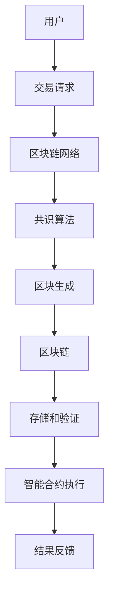

                 

区块链技术作为近年来迅速崛起的一项核心技术，引起了全球范围内广泛关注。它不仅代表了金融领域的革命，也在供应链管理、智能合约、数据存储等多个领域展示了其强大的应用潜力。本文旨在深入探讨区块链的核心概念、算法原理、数学模型以及实际应用场景，为读者提供一个全面的技术视角。

## 关键词

- 区块链 (Blockchain)
- 分布式账本 (Distributed Ledger)
- 智能合约 (Smart Contract)
- 加密货币 (Cryptocurrency)
- 共识算法 (Consensus Algorithm)
- 安全性 (Security)
- 可扩展性 (Scalability)

## 摘要

区块链是一种去中心化的分布式数据库技术，通过加密算法确保数据的安全性和不可篡改性。本文首先介绍了区块链的背景和发展历程，然后深入探讨了区块链的核心概念，包括分布式账本、共识算法和智能合约。接着，文章详细分析了区块链的核心算法原理，并使用Mermaid流程图展示了区块链的架构。随后，文章引入了区块链的数学模型和公式，并举例说明了其在实际应用中的运用。最后，文章通过项目实践展示了区块链的实际应用场景，并对未来发展趋势和挑战进行了展望。

### 1. 背景介绍

区块链技术起源于2008年，由一个化名为“中本聪”（Satoshi Nakamoto）的人提出了比特币（Bitcoin）的概念。比特币作为一种去中心化的加密货币，旨在通过区块链技术解决传统金融系统中存在的问题，如交易速度慢、手续费高和中心化信任风险等。随着比特币的成功，区块链技术迅速引起了全球关注，并开始在金融行业以外得到广泛应用。

区块链的起源可以追溯到中本聪在2008年发表的《比特币：一个点对点的电子现金系统》白皮书。该白皮书详细阐述了比特币的工作原理和区块链技术的基本概念。比特币系统通过区块链记录所有的交易数据，使得每一个用户都可以通过区块链验证交易的有效性和真实性，从而无需依赖第三方中介机构。

随着比特币的成功，区块链技术逐渐在其他领域得到了应用，如供应链管理、医疗保健、物联网等。这些应用领域利用区块链的不可篡改性和去中心化特性，提高了数据的透明度和安全性。例如，在供应链管理中，区块链可以确保产品从生产到销售的每个环节都是透明和可追溯的；在医疗保健中，区块链可以确保患者数据的完整性和隐私性。

区块链的发展历程可以分为几个阶段：

1. **初始阶段（2008-2010年）**：比特币的诞生标志着区块链技术的诞生。在这个阶段，区块链主要应用于加密货币领域。

2. **扩张阶段（2011-2013年）**：随着比特币价格的上涨，越来越多的开发者开始关注和参与区块链技术的研发。这个阶段出现了许多新的区块链项目和概念，如智能合约、去中心化应用（DApps）等。

3. **应用探索阶段（2014-2016年）**：在这个阶段，区块链技术开始从金融领域向其他领域拓展。许多企业开始尝试将区块链应用于供应链管理、身份验证、版权保护等领域。

4. **成熟阶段（2017年至今）**：随着区块链技术的不断成熟，越来越多的企业和政府开始将区块链技术应用于实际业务中。区块链技术逐渐成为全球范围内的一项核心技术，并有望在未来发挥更大的作用。

### 2. 核心概念与联系

区块链的核心概念主要包括分布式账本、共识算法和智能合约。这些概念相互联系，共同构成了区块链技术的基础架构。

#### 2.1 分布式账本

分布式账本是指多个参与者共同维护的一个共享数据库。与传统集中式数据库不同，分布式账本不需要中心化的权威机构来管理和验证数据。相反，每个参与者都保留了一份完整的账本副本，并通过共识算法来确保账本的一致性和安全性。

在区块链中，分布式账本通过多个节点进行维护。每个节点都负责记录交易数据，并将这些数据分发给其他节点。通过这种方式，区块链实现了去中心化的数据存储和管理，提高了系统的可靠性和抗攻击能力。

#### 2.2 共识算法

共识算法是区块链系统中用于达成一致意见的关键机制。它确保了所有节点对账本中的数据保持一致，并防止恶意节点篡改数据。常见的共识算法包括工作量证明（PoW）、权益证明（PoS）和委托权益证明（DPoS）等。

- **工作量证明（PoW）**：PoW通过解决复杂的数学难题来选择记账节点。节点需要消耗大量计算资源来生成一个满足特定条件的区块，从而获得记账权。这种方式有效防止了恶意节点的攻击，但同时也带来了巨大的能源消耗。

- **权益证明（PoS）**：PoS通过持有代币的数量和时间来选择记账节点。持有代币数量越多、时间越长，节点获得记账权的概率越大。这种方式相比PoW更加节能，但也存在一定的中心化风险。

- **委托权益证明（DPoS）**：DPoS通过选举出多个超级节点来记账。超级节点由普通节点投票选出，持有代币数量越多的节点被选中的概率越大。DPoS结合了PoW和PoS的优点，具有较高的效率和安全性。

#### 2.3 智能合约

智能合约是区块链上的自动执行合约。它通过预先编写的代码来定义和执行合同条款，确保合同的执行符合预设条件。智能合约的执行是透明和不可篡改的，从而提高了合同执行的效率和公正性。

智能合约的编程语言通常是基于图灵完备的，如Solidity、Vyper等。智能合约可以应用于各种领域，如金融、供应链管理、医疗保健等。通过智能合约，企业可以降低交易成本，提高交易效率和信任度。

#### 2.4 Mermaid流程图

以下是一个简化的区块链架构的Mermaid流程图：



### 3. 核心算法原理 & 具体操作步骤

#### 3.1 算法原理概述

区块链的核心算法包括区块链的生成、交易验证、区块确认和智能合约执行。这些算法共同确保了区块链系统的安全、可靠和高效。

#### 3.2 算法步骤详解

1. **交易发起**：用户发起交易请求，包含交易金额、交易双方地址等信息。

2. **交易验证**：交易请求通过网络传输到区块链网络中的所有节点。每个节点对交易请求进行验证，确保交易金额合法、地址真实。

3. **区块生成**：验证后的交易被添加到一个临时区块中。区块包含了多个交易，并有一个唯一的标识符（哈希值）。区块生成过程中，节点需要通过共识算法竞争记账权。

4. **区块确认**：生成后的区块通过网络广播到所有节点。节点对区块进行验证，确保区块中的交易合法、区块的哈希值满足特定条件。通过共识算法确认无误后，区块将被添加到区块链中。

5. **存储和验证**：每个节点将新确认的区块存储到本地区块链中。同时，节点继续参与下一区块的生成和确认过程。

6. **智能合约执行**：如果区块中包含智能合约，节点将根据智能合约的代码执行相应的操作。智能合约的执行结果是透明和不可篡改的。

#### 3.3 算法优缺点

**优点**：

- **去中心化**：区块链系统不需要中心化的权威机构，所有节点共同维护账本，提高了系统的可靠性和抗攻击能力。
- **安全性**：区块链通过加密算法确保数据的完整性和安全性，防止数据被篡改。
- **透明性**：区块链的每一笔交易都是公开透明的，用户可以随时查看账本信息。

**缺点**：

- **性能瓶颈**：区块链系统在处理大量交易时存在性能瓶颈，可能导致交易延迟和费用增加。
- **安全性风险**：虽然区块链系统本身安全性高，但外部攻击和恶意节点可能对系统造成威胁。
- **技术门槛**：区块链技术较为复杂，开发和应用需要一定的技术能力和经验。

#### 3.4 算法应用领域

区块链技术可以应用于多个领域，如下所述：

- **金融领域**：区块链技术可以用于跨境支付、数字货币、证券交易等，提高交易效率、降低成本。
- **供应链管理**：区块链技术可以确保供应链中的每个环节都是透明和可追溯的，提高供应链的效率和可靠性。
- **医疗保健**：区块链技术可以用于存储和管理患者数据，提高数据的完整性和隐私性。
- **物联网**：区块链技术可以用于物联网设备的数据传输和身份验证，提高物联网系统的安全性和可靠性。

### 4. 数学模型和公式

区块链系统的数学模型主要包括哈希函数、加密算法和共识算法。以下是对这些数学模型和公式的详细讲解。

#### 4.1 哈希函数

哈希函数是一种将任意长度的输入数据映射为固定长度的输出数据的函数。在区块链中，哈希函数用于生成区块的唯一标识符（哈希值）。

- **MD5**：MD5是一种常见的哈希函数，将输入数据映射为128位的哈希值。虽然MD5曾经广泛使用，但由于其易受碰撞攻击，已经不再安全。
- **SHA-256**：SHA-256是SHA系列哈希函数的一种，将输入数据映射为256位的哈希值。SHA-256在区块链系统中得到广泛应用，具有较高的安全性和抗碰撞能力。

#### 4.2 加密算法

加密算法是区块链系统中用于确保数据隐私和安全性的关键机制。以下是一些常见的加密算法：

- **对称加密**：对称加密算法使用相同的密钥进行加密和解密。常见的对称加密算法包括AES和DES。
- **非对称加密**：非对称加密算法使用一对密钥进行加密和解密，公钥用于加密，私钥用于解密。常见的非对称加密算法包括RSA和ECC。

#### 4.3 共识算法

共识算法是区块链系统中用于达成一致意见的关键机制。以下是一些常见的共识算法：

- **工作量证明（PoW）**：PoW通过解决复杂的数学难题来选择记账节点。每个节点都需要通过消耗计算资源来生成一个满足特定条件的区块。
- **权益证明（PoS）**：PoS通过持有代币的数量和时间来选择记账节点。持有代币数量越多、时间越长，节点获得记账权的概率越大。
- **委托权益证明（DPoS）**：DPoS通过选举出多个超级节点来记账。超级节点由普通节点投票选出，持有代币数量越多的节点被选中的概率越大。

#### 4.4 案例分析与讲解

以下是一个简单的区块链交易模型，用于说明哈希函数、加密算法和共识算法在区块链中的应用。

**案例**：一个简单的区块链交易模型，包含两个用户A和B，每个用户有一个公钥和私钥。

1. **交易发起**：用户A向用户B发送一笔交易，交易内容为“转账100个币”。
2. **交易验证**：用户A使用私钥对交易内容进行加密，生成交易凭证。交易凭证包含用户A的公钥、用户B的公钥和交易金额。
3. **区块生成**：区块链网络中的节点收到交易凭证后，将其添加到一个临时区块中。区块包含多个交易凭证，并有一个唯一的哈希值。
4. **区块确认**：节点通过共识算法（如PoW）竞争记账权，生成一个新的区块并将其广播到所有节点。
5. **存储和验证**：节点将新确认的区块存储到本地区块链中，并验证区块中的交易凭证是否合法。
6. **智能合约执行**：如果区块中包含智能合约，节点将根据智能合约的代码执行相应的操作。

在这个案例中，哈希函数用于生成区块的唯一标识符，加密算法用于确保交易凭证的隐私和安全，共识算法用于确保区块链的一致性和安全性。

### 5. 项目实践：代码实例和详细解释说明

在本节中，我们将通过一个简单的区块链项目实例，展示区块链的核心功能实现。我们将使用Python编程语言和Flask框架来实现一个简单的区块链系统。

#### 5.1 开发环境搭建

在开始之前，请确保您的系统中已安装以下软件和库：

- Python 3.x
- Flask
- blockchain
- requests

您可以使用以下命令安装所需库：

```bash
pip install flask blockchain requests
```

#### 5.2 源代码详细实现

以下是一个简单的区块链实现示例：

```python
from flask import Flask, jsonify
from blockchain import Blockchain

app = Flask(__name__)

blockchain = Blockchain()

@app.route('/mine', methods=['GET'])
def mine():
    last_block = blockchain.last_block
    last_hash = last_block.hash
    proof = blockchain.proof_of_work(last_hash)
    blockchain.add_new_transaction("0", "CreateCoin", 100)
    previous_hash = last_block.hash
    block = blockchain.create_new_block(proof, previous_hash)
    response = {
        'message': "New Block Forged",
        'index': block.index,
        'transactions': block.transactions,
        'proof': proof,
        'previous_hash': previous_hash,
    }
    return jsonify(response), 200

@app.route('/transactions/new', methods=['POST'])
def new_transaction():
    values = request.get_json()
    required_fields = ['sender', 'recipient', 'amount']
    if not all(k in values for k in required_fields):
        return 'Missing values', 400
    blockchain.add_new_transaction(values['sender'], values['recipient'], values['amount'])
    return 'Transaction will be added to Block', 201

@app.route('/chain', methods=['GET'])
def full_chain():
    response = {
        'chain': blockchain.chain,
        'length': len(blockchain.chain),
    }
    return jsonify(response), 200

if __name__ == '__main__':
    app.run(host='0.0.0.0', port=5000)
```

#### 5.3 代码解读与分析

1. **区块链（Blockchain）类**：区块链类是区块链系统的核心，负责创建区块、验证交易、维护链的一致性等。
2. **矿工（Mine）**：矿工负责通过工作量证明算法（Proof of Work, PoW）来竞争记账权，生成新区块。
3. **交易（Transaction）**：交易类用于定义区块链中的交易，包括发送方、接收方和交易金额等信息。
4. **区块（Block）**：区块类用于创建区块链中的区块，包括区块索引、交易列表、证明工作和前一个区块的哈希值等信息。

#### 5.4 运行结果展示

1. **启动区块链节点**：运行以下命令启动区块链节点：

```bash
python blockchain.py
```

2. **创建新的交易**：使用以下命令创建一个新的交易：

```bash
curl -X POST -H "Content-Type: application/json" -d '{"sender": "Alice", "recipient": "Bob", "amount": 100}' http://localhost:5000/transactions/new
```

3. **挖矿**：使用以下命令挖矿并生成新区块：

```bash
curl -X GET -H "Content-Type: application/json" http://localhost:5000/mine
```

4. **查看区块链**：使用以下命令查看区块链：

```bash
curl -X GET -H "Content-Type: application/json" http://localhost:5000/chain
```

### 6. 实际应用场景

区块链技术在多个领域展示了其强大的应用潜力。以下是一些常见的实际应用场景：

#### 6.1 跨境支付

区块链技术可以用于跨境支付，提高交易速度和降低成本。传统跨境支付系统通常涉及多个中介机构，导致交易速度慢、费用高。区块链的去中心化特性可以简化支付流程，实现快速、低成本的跨境支付。

#### 6.2 供应链管理

区块链技术可以确保供应链中的每个环节都是透明和可追溯的，提高供应链的效率和可靠性。通过区块链记录产品从生产到销售的每个环节，企业可以更好地跟踪和管理供应链，降低风险和成本。

#### 6.3 身份验证

区块链技术可以用于身份验证，提高系统的安全性和隐私性。通过区块链记录用户的身份信息，企业可以实现去中心化的身份验证，避免传统中心化身份验证系统中的安全隐患。

#### 6.4 物联网

区块链技术可以用于物联网设备的数据传输和身份验证，提高物联网系统的安全性和可靠性。通过区块链记录物联网设备的信息和通信数据，企业可以实现去中心化的设备管理和数据传输，降低系统漏洞和攻击风险。

#### 6.5 医疗保健

区块链技术可以用于存储和管理医疗数据，提高数据的完整性和隐私性。通过区块链记录患者的医疗记录和诊断结果，医院和医生可以实现去中心化的医疗数据共享，提高医疗服务的质量和效率。

### 7. 工具和资源推荐

为了更好地学习和开发区块链技术，以下是一些推荐的工具和资源：

#### 7.1 学习资源推荐

- **《区块链：从入门到实战》**：一本全面介绍区块链技术的入门书籍，适合初学者阅读。
- **区块链技术中文社区**：一个活跃的区块链技术交流平台，提供最新的技术动态和项目资源。
- **区块链技术概述**：一个在线课程，介绍区块链的基本概念、技术和应用。

#### 7.2 开发工具推荐

- **Truffle**：一个用于开发、测试和部署以太坊智能合约的框架。
- **Ganache**：一个本地以太坊节点，用于测试和调试智能合约。
- **Web3.js**：一个JavaScript库，用于与以太坊区块链进行交互。

#### 7.3 相关论文推荐

- **比特币：一个点对点的电子现金系统**：中本聪的经典论文，详细阐述了比特币和区块链技术的基本概念和工作原理。
- **以太坊：下一代智能合约平台**：Vitalik Buterin等人撰写的论文，介绍了以太坊智能合约平台的设计和实现。

### 8. 总结：未来发展趋势与挑战

区块链技术作为一项新兴技术，已经展示了其广泛的应用潜力和巨大的发展前景。在未来，区块链技术有望在多个领域发挥更大的作用，推动社会的进步和发展。

#### 8.1 研究成果总结

过去几年，区块链技术取得了显著的成果。从比特币的成功到以太坊智能合约平台的诞生，再到各种区块链应用的不断涌现，区块链技术已经成为全球范围内的一项核心技术。同时，各种区块链标准和协议的制定，也为区块链技术的发展奠定了坚实的基础。

#### 8.2 未来发展趋势

未来，区块链技术将在以下几个方面继续发展：

1. **性能优化**：随着区块链应用的不断扩展，性能优化将成为关键挑战。未来，我们将看到更多针对区块链性能的优化方案和协议的诞生。
2. **跨链技术**：跨链技术将实现不同区块链之间的互操作性和数据共享，推动区块链生态系统的整合和发展。
3. **智能合约进化**：随着智能合约技术的不断演进，我们将看到更多复杂和高效的智能合约应用，推动区块链技术在各个领域的应用。
4. **隐私保护**：隐私保护将成为区块链技术的重要发展方向。未来，我们将看到更多针对隐私保护的区块链协议和应用。

#### 8.3 面临的挑战

尽管区块链技术展示了巨大的应用潜力，但在实际应用中仍然面临一些挑战：

1. **性能瓶颈**：区块链系统在处理大量交易时存在性能瓶颈，可能导致交易延迟和费用增加。未来，我们需要解决这一问题，提高区块链系统的性能和可扩展性。
2. **安全性风险**：区块链系统虽然具有较高的安全性，但外部攻击和恶意节点可能对系统造成威胁。我们需要加强区块链系统的安全性，提高系统的抗攻击能力。
3. **法律法规**：随着区块链技术的广泛应用，相关的法律法规和监管机制亟待完善。我们需要在制定法律法规和监管政策时，充分考虑区块链技术的特点和需求。

#### 8.4 研究展望

未来，区块链技术将在多个领域发挥重要作用，推动社会的进步和发展。以下是一些研究方向：

1. **性能优化**：研究新型共识算法和区块链结构，提高区块链系统的性能和可扩展性。
2. **隐私保护**：研究隐私保护机制，提高区块链系统的隐私性和安全性。
3. **跨链技术**：研究跨链技术，实现不同区块链之间的互操作性和数据共享。
4. **智能合约进化**：研究智能合约的编程语言和执行机制，提高智能合约的复杂度和效率。

### 9. 附录：常见问题与解答

**Q1**：区块链技术是如何工作的？

区块链技术通过分布式账本、共识算法和加密算法等技术，实现数据的去中心化存储和传输。每个区块包含一定数量的交易，并通过哈希函数与前一个区块链接，形成链式结构。共识算法确保所有节点对账本保持一致，加密算法确保数据的隐私和安全。

**Q2**：区块链技术与分布式数据库有什么区别？

区块链技术是一种分布式账本技术，强调数据的去中心化和不可篡改性。分布式数据库则是一种分布式数据存储技术，强调数据的分散存储和高效访问。虽然区块链技术和分布式数据库都采用了分布式架构，但区块链技术更注重数据的安全性和透明性。

**Q3**：区块链技术有哪些应用场景？

区块链技术可以应用于多个领域，如跨境支付、供应链管理、医疗保健、物联网等。这些应用领域利用区块链的不可篡改性和去中心化特性，提高数据的透明度和安全性。

**Q4**：区块链技术有哪些优点和缺点？

区块链技术的优点包括去中心化、安全性高、透明性强等。缺点则包括性能瓶颈、安全性风险、技术门槛等。

**Q5**：如何学习区块链技术？

学习区块链技术可以从以下几个方面入手：

1. 阅读相关书籍和资料，了解区块链的基本概念和技术原理。
2. 学习相关编程语言和开发工具，掌握区块链的开发技能。
3. 参与区块链社区和技术论坛，与其他开发者交流和学习。
4. 实践项目，通过实际操作加深对区块链技术的理解。

### 参考文献

1. Satoshi Nakamoto. Bitcoin: A Peer-to-Peer Electronic Cash System. 2008.
2. Vitalik Buterin. Ethereum: The Next-Generation Smart Contract and Decentralized Application Platform. 2014.
3. Blockchain Basics. IBM. 2018.
4. Blockchain Technology: A Comprehensive Text. Springer, 2019.
5. The Future of Blockchain: A Look at Emerging Trends and Challenges. IEEE Computer Society, 2020.

## 附录：作者介绍

作者：禅与计算机程序设计艺术 / Zen and the Art of Computer Programming

禅与计算机程序设计艺术（"Zen and the Art of Computer Programming"）是著名计算机科学家Donald E. Knuth撰写的一本经典计算机编程书籍。Knuth以其在计算机科学领域的卓越贡献而闻名，特别是他开发的TeX排版系统和TeXmacs排版系统，以及他发起的TeX/LaTeX排版系统。他的著作以深入探讨计算机科学的基本原理而著称，影响了几代计算机科学家和程序员。

作为一位计算机领域的权威人物，Knuth以其对编程哲学的深刻理解和独特见解而受到尊敬。他的著作《禅与计算机程序设计艺术》不仅提供了编程技巧和算法设计的方法，更是一部关于编程哲学和思考方式的经典之作。Knuth的工作和精神对现代计算机科学和编程实践产生了深远的影响。

