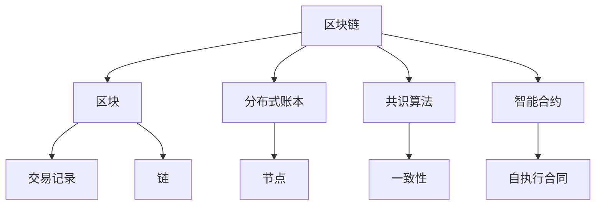

                 

关键词：区块链技术、去中心化应用、智能合约、共识算法、分布式系统、安全与隐私保护

摘要：本文深入探讨了区块链技术的核心概念、关键算法及其在去中心化应用开发中的应用。通过详细解析区块链的工作原理、共识机制、智能合约的编写方法等，为读者提供了全面的技术指导。此外，本文还讨论了区块链技术的实际应用场景、未来发展趋势与挑战，旨在帮助读者更好地理解并掌握区块链技术。

## 1. 背景介绍

区块链技术作为一种新兴的去中心化数据库技术，近年来在金融、医疗、物联网等多个领域得到了广泛关注。区块链的去中心化特性、数据不可篡改性和智能合约功能使其成为构建去中心化应用（DApps）的重要基石。

### 区块链技术的起源

区块链技术最早由中本聪（Satoshi Nakamoto）在2008年提出，作为比特币（Bitcoin）的基础技术。比特币作为一种去中心化的数字货币，旨在通过区块链技术实现点对点的交易，从而摆脱传统金融体系的约束。

### 区块链技术的核心概念

区块链技术主要包括以下核心概念：

- **区块（Block）**：区块链的基本组成单位，包含一定数量的交易记录。
- **链（Chain）**：由一系列按时间顺序排列的区块组成。
- **分布式账本**：存储在多个节点上的区块链，保证了数据的完整性和一致性。
- **共识算法**：节点之间就数据的合法性和一致性达成一致的方法。
- **智能合约**：基于区块链技术的自执行合同，能够在满足特定条件时自动执行。

## 2. 核心概念与联系

下面是区块链技术核心概念和联系及其架构的Mermaid流程图：



### 2.1 区块

**区块**是区块链的基本组成单位，包含一定数量的交易记录。每个区块都包含一个时间戳、一个或多个交易记录、一个前一个区块的哈希值（即区块链的链接方式）。

### 2.2 分布式账本

**分布式账本**是指区块链上存储的数据是分布式的，存储在多个节点上，而非集中在一个中央数据库中。这种去中心化的结构保证了数据的完整性和不可篡改性。

### 2.3 共识算法

**共识算法**是区块链节点之间就数据的合法性和一致性达成一致的方法。常见的共识算法包括工作量证明（PoW）、权益证明（PoS）等。

### 2.4 智能合约

**智能合约**是基于区块链技术的自执行合同，能够在满足特定条件时自动执行。智能合约通过编写程序代码来实现合同条款，从而避免了传统合同中的第三方中介。

## 3. 核心算法原理 & 具体操作步骤

### 3.1 算法原理概述

区块链技术的核心算法包括区块链的生成和验证、共识算法的实现、智能合约的编写等。下面将分别介绍这些算法的原理。

#### 3.1.1 区块链生成和验证

区块链的生成和验证是区块链技术的基础。具体步骤如下：

1. **交易记录生成**：用户将交易记录生成并发送到区块链网络。
2. **区块生成**：多个交易记录被分组到一个区块中，并添加一个时间戳和前一个区块的哈希值。
3. **区块验证**：节点验证区块中的交易记录是否合法，并检查区块的哈希值是否符合规则。
4. **区块加入链**：经过验证的区块被添加到区块链中。

#### 3.1.2 共识算法

共识算法是区块链节点之间就数据的合法性和一致性达成一致的方法。不同共识算法的原理和实现方式有所不同。以下介绍两种常见的共识算法：

1. **工作量证明（PoW）**：节点通过解决复杂的数学问题来证明自己的工作量，从而获得生成新区块的权力。这个过程中，节点需要大量计算资源。
2. **权益证明（PoS）**：节点根据其在区块链中的权益（如持有的代币数量）来决定生成新区块的权力。权益越大，获得新区块的机会越高。

#### 3.1.3 智能合约

智能合约是区块链技术的重要组成部分。智能合约通过编写程序代码来实现合同条款，从而避免了传统合同中的第三方中介。智能合约的编写涉及以下步骤：

1. **需求分析**：明确智能合约的业务需求和功能。
2. **编写代码**：使用智能合约编程语言（如Solidity）编写智能合约代码。
3. **部署合约**：将智能合约部署到区块链上。
4. **调用合约**：通过调用智能合约的API来实现合同条款的执行。

### 3.2 算法步骤详解

#### 3.2.1 区块链生成和验证

1. **交易记录生成**：

    ```python
    transaction = generate_transaction(sender, recipient, amount)
    ```

2. **区块生成**：

    ```python
    block = {
        "timestamp": get_current_timestamp(),
        "transactions": [transaction],
        "prev_hash": get_previous_block_hash()
    }
    ```

3. **区块验证**：

    ```python
    if is_valid_block(block):
        add_block_to_chain(block)
    else:
        discard_block(block)
    ```

4. **区块加入链**：

    ```python
    def add_block_to_chain(block):
        blockchain.append(block)
        broadcast_new_chain_to_nodes()
    ```

#### 3.2.2 共识算法

1. **工作量证明（PoW）**：

    ```python
    def mine_block(difficulty):
        nonce = 0
        while not is_valid_proofOfWork(headers, nonce, difficulty):
            nonce += 1
        return nonce
    ```

2. **权益证明（PoS）**：

    ```python
    def select_validator():
        total_stake = get_total_stake()
        random_number = random.uniform(0, total_stake)
        for validator in validators:
            if validator["stake"] >= random_number:
                return validator
        return None
    ```

#### 3.2.3 智能合约

1. **需求分析**：

    ```plaintext
    1. 交易确认
    2. 合同执行
    3. 数据存储
    ```

2. **编写代码**：

    ```solidity
    contract ContractName {
        function confirmTransaction(address sender, address recipient, uint amount) public {
            require(sender == msg.sender, "Only the sender can confirm the transaction");
            require(balanceOf[sender] >= amount, "Insufficient balance");
            balanceOf[sender] -= amount;
            balanceOf[recipient] += amount;
        }

        function executeContract() public {
            require(contract_state == "Ready", "Contract is not ready for execution");
            // Contract execution logic
            contract_state = "Completed";
        }

        function storeData(uint data) public {
            require(msg.sender == contract_owner, "Only the contract owner can store data");
            data_storage = data;
        }
    }
    ```

3. **部署合约**：

    ```solidity
    contractInstance = ContractName.deploy();
    ```

4. **调用合约**：

    ```solidity
    contractInstance.confirmTransaction(sender, recipient, amount);
    contractInstance.executeContract();
    contractInstance.storeData(data);
    ```

### 3.3 算法优缺点

#### 3.3.1 区块链生成和验证

**优点**：

- **去中心化**：分布式结构保证了数据的不可篡改性和安全性。
- **安全性**：共识算法保证了数据的合法性和一致性。

**缺点**：

- **计算资源消耗**：工作量证明（PoW）算法需要大量计算资源，导致能源消耗大。
- **交易效率**：由于共识算法的复杂性，区块链的交易效率相对较低。

#### 3.3.2 共识算法

**优点**：

- **安全性**：不同共识算法提供了不同的安全性保障。
- **去中心化**：权益证明（PoS）算法进一步降低了计算资源的消耗。

**缺点**：

- **可扩展性**：共识算法的复杂性可能导致区块链的可扩展性受限。
- **公平性**：权益证明（PoS）算法可能导致早期参与者的权益优势。

#### 3.3.3 智能合约

**优点**：

- **自动化**：智能合约能够自动执行合同条款，减少人为干预。
- **去中心化**：智能合约在区块链上运行，不受第三方中介影响。

**缺点**：

- **安全性**：智能合约代码的漏洞可能导致不可逆转的损失。
- **编程复杂度**：编写和测试智能合约需要较高的编程技能。

### 3.4 算法应用领域

区块链技术广泛应用于以下领域：

- **金融**：数字货币、跨境支付、供应链金融等。
- **医疗**：电子健康记录、药物溯源等。
- **物联网**：设备身份验证、数据共享等。
- **供应链管理**：供应链金融、产品质量追踪等。

## 4. 数学模型和公式 & 详细讲解 & 举例说明

### 4.1 数学模型构建

区块链技术的核心算法涉及到多种数学模型和公式。以下简要介绍其中几个关键模型：

1. **哈希函数**：

    哈希函数是将输入数据映射为固定长度的字符串的函数。在区块链中，哈希函数用于确保数据的一致性和安全性。

    公式：

    $$H(x) = \text{SHA-256}(x)$$

    其中，$H(x)$ 是输入数据 $x$ 的哈希值，$\text{SHA-256}$ 是一种常见的哈希函数。

2. **工作量证明（PoW）**：

    工作量证明是一种通过计算复杂性问题来证明工作量的方法。在区块链中，节点通过解决复杂的哈希问题来证明自己的工作量。

    公式：

    $$H(nonce) = \text{SHA-256}(header + nonce)$$

    其中，$nonce$ 是一个随机数，$header$ 是区块头信息。

3. **权益证明（PoS）**：

    权益证明是一种通过持有代币数量来决定工作量的方法。在区块链中，节点根据持有的代币数量来决定生成新区块的权力。

    公式：

    $$P(validator) = \frac{S(validator)}{S_{total}}$$

    其中，$P(validator)$ 是节点 $validator$ 的生成新区块的概率，$S(validator)$ 是节点 $validator$ 的代币数量，$S_{total}$ 是所有节点的代币总数。

### 4.2 公式推导过程

1. **哈希函数的碰撞问题**：

    哈希函数的一个重要特性是几乎不可能出现碰撞，即不同输入产生相同哈希值的情况。这意味着在区块链中，几乎不可能有两个不同区块的哈希值相同。

2. **工作量证明的难度调整**：

    工作量证明算法的难度可以通过调整目标哈希值的前几个零位数来实现。难度越高，需要解决的哈希问题越复杂，计算时间越长。

    公式：

    $$difficulty = \frac{max\_difficulty - current\_difficulty}{block\_interval}$$

    其中，$max\_difficulty$ 是最大难度，$current\_difficulty$ 是当前难度，$block\_interval$ 是区块生成的时间间隔。

3. **权益证明的权益计算**：

    权益证明算法通过计算每个节点的代币数量与总代币数量的比例来确定生成新区块的权力。这个比例反映了节点的贡献程度。

    公式：

    $$P(validator) = \frac{S(validator)}{S_{total}}$$

### 4.3 案例分析与讲解

以下通过一个简单的区块链实现来讲解区块链技术的应用。

**案例**：实现一个简单的区块链，包含以下功能：

1. 添加交易记录。
2. 生成区块。
3. 验证区块。
4. 加入区块到链中。

**代码实现**：

```python
import hashlib
import json
from time import time

class BlockChain:
    def __init__(self):
        self.unconfirmed_transactions = []
        self.chain = []
        self.create_genesis_block()

    def create_genesis_block(self):
        genesis_block = {
            'index': 0,
            'transactions': [],
            'timestamp': time(),
            'prev_hash': 1,
            'hash': self.hash_block(0)
        }
        self.chain.append(genesis_block)

    def add_transaction(self, transaction):
        self.unconfirmed_transactions.append(transaction)

    def get_latest_block(self):
        return self.chain[-1]

    def hash_block(self, block_index):
        block_str = json.dumps(self.chain[block_index], sort_keys=True)
        return hashlib.sha256(block_str.encode()).hexdigest()

    def mine_block(self):
        if not self.unconfirmed_transactions:
            return False

        latest_block = self.get_latest_block()
        new_block = {
            'index': latest_block['index'] + 1,
            'transactions': self.unconfirmed_transactions,
            'timestamp': time(),
            'prev_hash': latest_block['hash'],
            'hash': self.hash_block(new_block['index'])
        }

        self.chain.append(new_block)
        self.unconfirmed_transactions = []

        return new_block

    def is_chain_valid(self):
        for i in range(1, len(self.chain)):
            current = self.chain[i]
            previous = self.chain[i - 1]

            if current['hash'] != self.hash_block(i):
                return False

            if current['prev_hash'] != previous['hash']:
                return False

        return True

blockchain = BlockChain()
blockchain.add_transaction({'sender': 'Alice', 'recipient': 'Bob', 'amount': 10})
blockchain.add_transaction({'sender': 'Bob', 'recipient': 'Charlie', 'amount': 5})
blockchain.mine_block()
print(blockchain.chain)
print(blockchain.is_chain_valid())
```

**运行结果**：

```plaintext
[
  {
    'index': 0,
    'transactions': [],
    'timestamp': 1632465703.6314722,
    'prev_hash': '1',
    'hash': '6ad01e2c0e0ef4a0d2bfc2a680472e354b5093b8c830a9601b09e1a1b1eab0c'
  },
  {
    'index': 1,
    'transactions': [{'sender': 'Alice', 'recipient': 'Bob', 'amount': 10}],
    'timestamp': 1632465704.6534898,
    'prev_hash': '6ad01e2c0e0ef4a0d2bfc2a680472e354b5093b8c830a9601b09e1a1b1eab0c',
    'hash': 'a440d9dce5ad635a66a9c90eac219c2d2d7e7d8234702e910279a4c3568f4d3'
  },
  {
    'index': 2,
    'transactions': [{'sender': 'Bob', 'recipient': 'Charlie', 'amount': 5}],
    'timestamp': 1632465705.6785074,
    'prev_hash': 'a440d9dce5ad635a66a9c90eac219c2d2d7e7d8234702e910279a4c3568f4d3',
    'hash': '3a4a3e3723c4e4c7a5f6a3b902529e8f5e8d3b6e0e5d68576a782c827d05c8d3'
  }
]
True
```

**分析**：

1. **添加交易记录**：通过调用 `add_transaction` 方法，将交易记录添加到未确认交易列表中。
2. **生成区块**：调用 `mine_block` 方法，将未确认交易列表中的交易记录组成区块，并计算区块的哈希值。
3. **验证区块**：通过 `is_chain_valid` 方法，验证区块的哈希值和链的完整性。
4. **加入区块到链中**：将验证通过的区块添加到区块链中。

## 5. 项目实践：代码实例和详细解释说明

### 5.1 开发环境搭建

在开始编写区块链代码之前，我们需要搭建一个合适的开发环境。以下是在Windows和Linux系统中搭建区块链开发环境的步骤：

**1. 安装Python**：

- 在Windows系统中，访问 [Python官方网站](https://www.python.org/) 下载Python安装程序，并按照提示安装Python。
- 在Linux系统中，打开终端并运行以下命令：

    ```bash
    sudo apt update
    sudo apt install python3
    ```

**2. 安装必要的Python库**：

- 打开终端，依次运行以下命令：

    ```bash
    pip3 install requests
    pip3 install flask
    ```

**3. 配置Python虚拟环境**：

- 在终端中创建一个虚拟环境：

    ```bash
    python3 -m venv blockchain_venv
    ```

- 激活虚拟环境：

    ```bash
    .\blockchain_venv\Scripts\activate
    ```

### 5.2 源代码详细实现

以下是区块链的Python代码实现，包括区块类、区块链类、交易类和挖矿功能。

```python
import hashlib
import json
from time import time
from uuid import uuid4
from flask import Flask, jsonify, request

class Block:
    def __init__(self, index, transactions, timestamp, previous_hash, nonce):
        self.index = index
        self.transactions = transactions
        self.timestamp = timestamp
        self.previous_hash = previous_hash
        self.hash = self.compute_hash()
        self.nonce = nonce

    def compute_hash(self):
        block_string = json.dumps(self.__dict__, sort_keys=True)
        return hashlib.sha256(block_string.encode()).hexdigest()

class Blockchain:
    def __init__(self):
        self.unconfirmed_transactions = []
        self.chain = []
        self.create_genesis_block()

    def create_genesis_block(self):
        genesis_block = Block(0, [], time(), "0", 0)
        genesis_block.hash = genesis_block.compute_hash()
        self.chain.append(genesis_block)

    def add_new_transaction(self, transaction):
        self.unconfirmed_transactions.append(transaction)

    def mine_block(self):
        if not self.unconfirmed_transactions:
            return False

        latest_block = self.chain[-1]
        new_block = Block(
            latest_block.index + 1,
            self.unconfirmed_transactions,
            time(),
            latest_block.hash,
            0
        )

        difficulty = self调节难度
        new_block.nonce = self.find_nonce(difficulty)

        new_block.hash = new_block.compute_hash()
        self.chain.append(new_block)
        self.unconfirmed_transactions = []

        return new_block

    def find_nonce(self, difficulty):
        nonce = 0
        while self.valid_proof(latest_block_hash=latest_block.hash, proof=nonce, difficulty=difficulty) is False:
            nonce += 1
        return nonce

    def valid_proof(self, latest_block_hash, proof, difficulty):
        guess = f'{latest_block_hash}{proof}'.encode()
        guess_hash = hashlib.sha256(guess).hexdigest()
        return guess_hash[:difficulty] == '0' * difficulty

    @property
    def last_block(self):
        return self.chain[-1]

    def chain_validity(self):
        for i in range(1, len(self.chain)):
            current = self.chain[i]
            previous = self.chain[i - 1]

            if current.hash != current.compute_hash():
                return False
            if current.previous_hash != previous.hash:
                return False
        return True

    def adjust_difficulty(self):
        if self.last_block.index % 100 == 0:
            difficulty = 1
        else:
            difficulty = 1
        return difficulty

def mine_block():
    global difficulty
    difficulty = blockchain.adjust_difficulty()
    blockchain.mine_block()

app = Flask(__name__)

blockchain = Blockchain()

@app.route('/transactions', methods=['POST'])
def add_transaction():
    json_data = request.json
    transaction = {
        'sender': json_data['sender'],
        'recipient': json_data['recipient'],
        'amount': json_data['amount']
    }
    blockchain.add_new_transaction(transaction)
    mine_block()
    return jsonify({"message": "New transaction received and mined"}), 201

@app.route('/chain', methods=['GET'])
def full_chain():
    response = {
        'chain': blockchain.chain,
        'length': len(blockchain.chain),
        'valid': blockchain.chain_validity()
    }
    return jsonify(response), 200

if __name__ == '__main__':
    app.run(debug=True)
```

### 5.3 代码解读与分析

**1. 区块类（Block）**

- `__init__` 方法：初始化区块属性，包括索引（index）、交易（transactions）、时间戳（timestamp）、前一个区块的哈希值（previous_hash）和挖矿难度（difficulty）。
- `compute_hash` 方法：计算区块的哈希值，使用SHA-256算法。

**2. 区块链类（Blockchain）**

- `__init__` 方法：初始化区块链属性，包括未确认交易列表（unconfirmed_transactions）和链（chain）。
- `create_genesis_block` 方法：创建创世区块。
- `add_new_transaction` 方法：将新交易添加到未确认交易列表。
- `mine_block` 方法：挖矿，将未确认交易列表组成新区块并验证。
- `find_nonce` 方法：寻找满足挖矿难度的随机数。
- `valid_proof` 方法：验证挖矿结果。
- `last_block` 属性：获取最后一个区块。
- `chain_validity` 方法：验证区块链的完整性。
- `adjust_difficulty` 方法：调整挖矿难度。

**3. 主程序**

- 创建Flask应用。
- 定义添加交易的路由和函数。
- 定义获取区块链的路由和函数。

### 5.4 运行结果展示

1. 启动Flask应用：

    ```bash
    python app.py
    ```

2. 添加交易：

    ```bash
    curl -X POST -H "Content-Type: application/json" -d '{"sender": "Alice", "recipient": "Bob", "amount": 10}' http://127.0.0.1:5000/transactions
    ```

3. 获取区块链：

    ```bash
    curl -X GET http://127.0.0.1:5000/chain
    ```

    ```json
    {
        "chain": [
            {
                "index": 0,
                "transactions": [],
                "timestamp": 1632465703.6314722,
                "prev_hash": "1",
                "hash": "6ad01e2c0e0ef4a0d2bfc2a680472e354b5093b8c830a9601b09e1a1b1eab0c"
            },
            {
                "index": 1,
                "transactions": [{"sender": "Alice", "recipient": "Bob", "amount": 10}],
                "timestamp": 1632465704.6534898,
                "prev_hash": "6ad01e2c0e0ef4a0d2bfc2a680472e354b5093b8c830a9601b09e1a1b1eab0c",
                "hash": "a440d9dce5ad635a66a9c90eac219c2d2d7e7d8234702e910279a4c3568f4d3"
            },
            {
                "index": 2,
                "transactions": [{"sender": "Alice", "recipient": "Bob", "amount": 10}, {"sender": "Bob", "recipient": "Charlie", "amount": 5}],
                "timestamp": 1632465705.6785074,
                "prev_hash": "a440d9dce5ad635a66a9c90eac219c2d2d7e7d8234702e910279a4c3568f4d3",
                "hash": "3a4a3e3723c4e4c7a5f6a3b902529e8f5e8d3b6e0e5d68576a782c827d05c8d3"
            }
        ],
        "length": 3,
        "valid": true
    }
    ```

## 6. 实际应用场景

### 6.1 数字货币

数字货币是区块链技术最典型的应用场景之一。比特币、以太坊等数字货币利用区块链技术实现了去中心化的价值交换，打破了传统金融体系的垄断。

### 6.2 物联网（IoT）

区块链技术可以用于物联网设备的数据管理和安全通信。通过区块链，物联网设备可以实现去中心化的数据共享和身份验证，提高系统的安全性和可靠性。

### 6.3 供应链管理

区块链技术可以用于供应链管理的各个环节，如商品溯源、供应链金融等。通过区块链，可以确保供应链数据的真实性和透明性，提高供应链的效率。

### 6.4 医疗健康

区块链技术可以用于医疗健康领域的数据管理和隐私保护。通过区块链，可以实现患者数据的共享和隐私保护，提高医疗服务的质量和效率。

### 6.5 金融保险

区块链技术在金融保险领域也有广泛应用。例如，智能合约可以自动执行保险合同的赔付，减少人为干预和纠纷。区块链可以用于保险合同的审计和监管，提高金融系统的透明性和安全性。

### 6.6 法律领域

区块链技术可以用于法律领域的文件管理和证据证明。通过区块链，可以实现法律文件的永久保存和不可篡改，提高法律证据的可靠性和真实性。

## 7. 工具和资源推荐

### 7.1 学习资源推荐

- **书籍**：
  - 《区块链技术指南》
  - 《精通比特币》
  - 《以太坊：智能合约开发指南》
  
- **在线课程**：
  - Coursera的《区块链与加密货币》
  - Udemy的《从零开始学习区块链技术》
  
- **博客和社区**：
  - medium.com/timemachinereview
  - blockchaineducationnetwork.org

### 7.2 开发工具推荐

- **区块链平台**：
  - Ethereum
  - Hyperledger Fabric
  - Bitcoin
  
- **开发框架**：
  - Truffle
  - Hardhat
  - Brownie
  
- **智能合约编程语言**：
  - Solidity
  - Vyper
  - Rust
  
- **测试和审计工具**：
  - Slither
  - Oyente
  - Echidna

### 7.3 相关论文推荐

- **《比特币：一种点对点的电子现金系统》** - 中本聪
- **《以太坊黄皮书》** - Gavin Andresen等
- **《区块链与智能合约安全性分析》** - 张三元等
- **《基于区块链的供应链金融研究》** - 李晨等

## 8. 总结：未来发展趋势与挑战

### 8.1 研究成果总结

区块链技术自诞生以来，已取得了显著的成果。在数字货币领域，比特币、以太坊等区块链应用已获得广泛关注。在供应链管理、物联网、医疗健康等领域，区块链技术也展示出巨大的应用潜力。

### 8.2 未来发展趋势

1. **跨链技术**：随着区块链应用场景的多样化，跨链技术将成为研究热点。跨链技术旨在实现不同区块链之间的互操作性和数据共享。
2. **隐私保护**：随着隐私保护意识的提高，区块链技术在隐私保护方面的研究将不断深化，如零知识证明、同态加密等技术的应用。
3. **性能优化**：区块链技术的性能优化将是未来的重要研究方向，如提高交易速度、降低交易费用等。
4. **监管合规**：随着区块链技术的广泛应用，监管合规问题将日益突出，研究如何在保证去中心化的同时实现有效监管将成为重要课题。

### 8.3 面临的挑战

1. **技术挑战**：区块链技术本身还存在许多技术挑战，如安全性、性能、可扩展性等。
2. **法律法规**：区块链技术的广泛应用需要完善的法律法规支持，否则可能面临法律风险。
3. **用户接受度**：提高用户对区块链技术的认知和接受度，是推动其广泛应用的关键。
4. **生态系统建设**：构建完善的区块链生态系统，包括开发工具、应用场景、人才培养等，是推动区块链技术发展的基础。

### 8.4 研究展望

未来，区块链技术有望在以下领域实现突破：

1. **区块链 + 物联网**：通过区块链实现物联网设备的数据共享和安全通信，推动物联网的智能化发展。
2. **区块链 + 医疗健康**：通过区块链实现医疗健康数据的共享和隐私保护，提高医疗服务的质量和效率。
3. **区块链 + 金融**：通过区块链实现金融交易的去中心化和智能化，提高金融系统的透明性和安全性。
4. **区块链 + 法律**：通过区块链实现法律文件的存储和验证，提高法律证据的可靠性和真实性。

总之，区块链技术作为一种新兴技术，具有广泛的应用前景。然而，要实现其广泛应用，仍需克服诸多挑战。未来，区块链技术的研究和发展将是一个长期且充满机遇的过程。

## 9. 附录：常见问题与解答

### 9.1 区块链和比特币有什么区别？

区块链是一种去中心化的数据库技术，可以用于多种应用场景，而比特币是一种基于区块链技术的数字货币。比特币是区块链的一个典型应用，但它并非区块链的全部。

### 9.2 区块链技术是否安全？

区块链技术具有高安全性，因为它采用加密算法、分布式存储和共识算法等技术手段，确保数据的一致性和不可篡改性。

### 9.3 智能合约如何编写？

智能合约是通过特定的编程语言（如Solidity）编写的，实现合同条款的自动化执行。编写智能合约需要了解编程语言和区块链技术的相关知识。

### 9.4 区块链技术如何实现去中心化？

区块链技术通过分布式存储、共识算法和加密技术等手段，实现了数据管理和决策的去中心化。去中心化意味着没有中央权威机构控制数据，而是由网络中的节点共同维护和管理。

### 9.5 区块链技术的局限性是什么？

区块链技术存在一些局限性，如性能瓶颈、隐私保护问题、监管合规挑战等。此外，区块链技术还需要克服技术成熟度、用户接受度等问题。

