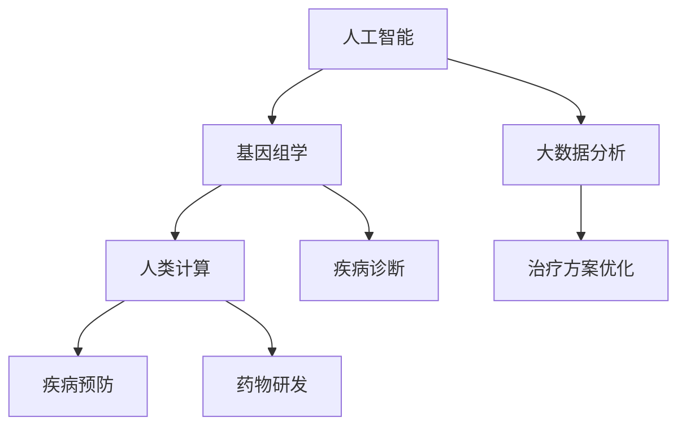

                 

关键词：医疗保健，精准医疗，人工智能，人类计算，基因组学，数据分析

> 摘要：随着医疗技术的不断进步，精准医疗已经成为医疗保健领域的重要发展方向。本文从人工智能和人类计算的角度出发，探讨了精准医疗的实现路径和技术挑战，分析了基因组学、数据分析等技术如何助力医疗保健的未来发展。

## 1. 背景介绍

医疗保健作为人类生存和发展的重要保障，一直以来都受到广泛关注。随着科技的发展，医疗技术也在不断进步，从传统的药物治疗到现代的精准医疗，医疗模式正在发生深刻变革。精准医疗是一种以个体化医疗为基础，利用基因组学、蛋白质组学等现代生物技术，结合人工智能和大数据分析，为患者提供个性化、精准的治疗方案。精准医疗的兴起，使得医疗保健从过去的“一刀切”模式，逐渐转向针对个体的“量身定制”模式。

### 1.1 精准医疗的定义

精准医疗是一种基于基因组学、蛋白质组学等分子生物学技术，结合大数据、人工智能等现代信息技术，为患者提供个性化、精准的治疗方案。它强调根据患者的遗传信息、生活习惯、环境因素等，制定最适合患者的治疗方案。

### 1.2 精准医疗的发展历程

精准医疗的发展历程可以追溯到20世纪80年代，随着基因组学的兴起，科学家们开始关注个体的遗传差异。2003年，人类基因组计划完成，为精准医疗的发展奠定了基础。近年来，随着大数据、人工智能等技术的应用，精准医疗得到了快速发展。

## 2. 核心概念与联系

### 2.1 人工智能在精准医疗中的应用

人工智能（Artificial Intelligence，AI）作为一种模拟人类智能的技术，在精准医疗中有着广泛的应用。例如，通过机器学习算法分析患者的基因组数据，可以帮助医生预测疾病的风险，制定个性化的预防措施。此外，人工智能还可以用于疾病诊断、药物研发、治疗方案优化等方面。

### 2.2 人类计算在精准医疗中的作用

人类计算（Human Computation）是指利用人类智慧和创造力，解决复杂计算问题的方法。在精准医疗中，人类计算可以用于基因组数据的解读、疾病的诊断和治疗方案的设计等。例如，通过专业医生的经验和知识，可以对基因组数据进行分析，帮助医生理解疾病的分子机制，制定个性化的治疗方案。

### 2.3 核心概念架构图

以下是一个关于精准医疗中核心概念架构的 Mermaid 流程图：



## 3. 核心算法原理 & 具体操作步骤

### 3.1 算法原理概述

在精准医疗中，核心算法主要包括机器学习算法、基因组数据分析算法等。机器学习算法可以通过训练数据集，学习疾病的特征，帮助医生进行疾病诊断和预测。基因组数据分析算法可以分析患者的基因组数据，了解疾病的分子机制，为治疗提供依据。

### 3.2 算法步骤详解

1. **数据收集与预处理**：收集患者的基因组数据、临床数据等，对数据进行清洗、标准化处理。

2. **特征提取**：从预处理后的数据中提取重要的特征，如基因表达水平、突变类型等。

3. **模型训练**：使用机器学习算法，对提取的特征进行训练，建立疾病诊断模型或预测模型。

4. **模型评估**：使用测试数据集评估模型的性能，调整模型参数，优化模型。

5. **疾病诊断与预测**：使用训练好的模型，对新的病例进行疾病诊断或预测。

### 3.3 算法优缺点

**优点**：
- **高效性**：算法可以在短时间内处理大量的数据，提高诊断和预测的效率。
- **准确性**：通过机器学习和基因组数据分析，可以提高疾病诊断的准确性。

**缺点**：
- **数据依赖性**：算法的性能很大程度上取决于数据的质量和数量。
- **解释性**：一些算法，如深度学习，模型内部的决策过程较为复杂，难以解释。

### 3.4 算法应用领域

- **疾病诊断**：如癌症、遗传病的诊断。
- **药物研发**：通过分析基因组数据，预测药物的疗效和副作用。
- **个性化治疗**：根据患者的基因组数据，制定个性化的治疗方案。

## 4. 数学模型和公式 & 详细讲解 & 举例说明

### 4.1 数学模型构建

在精准医疗中，常用的数学模型包括回归模型、分类模型等。以下是一个简单的线性回归模型：

$$
y = \beta_0 + \beta_1x_1 + \beta_2x_2 + ... + \beta_nx_n
$$

其中，$y$ 是目标变量，$x_1, x_2, ..., x_n$ 是特征变量，$\beta_0, \beta_1, \beta_2, ..., \beta_n$ 是模型的参数。

### 4.2 公式推导过程

线性回归模型的推导过程如下：

1. **目标函数**：

$$
\min_{\beta_0, \beta_1, ..., \beta_n} \sum_{i=1}^{n}(y_i - (\beta_0 + \beta_1x_{i1} + \beta_2x_{i2} + ... + \beta_nx_{in}))^2
$$

2. **求导**：

$$
\frac{\partial}{\partial \beta_j} \sum_{i=1}^{n}(y_i - (\beta_0 + \beta_1x_{i1} + \beta_2x_{i2} + ... + \beta_nx_{in}))^2 = 0
$$

3. **解方程组**：

$$
\beta_0 = \bar{y} - \beta_1\bar{x_1} - \beta_2\bar{x_2} - ... - \beta_n\bar{x_n}
$$

$$
\beta_1 = \frac{\sum_{i=1}^{n}(x_{i1} - \bar{x_1})(y_i - \bar{y})}{\sum_{i=1}^{n}(x_{i1} - \bar{x_1})^2}
$$

$$
\beta_2 = \frac{\sum_{i=1}^{n}(x_{i2} - \bar{x_2})(y_i - \bar{y})}{\sum_{i=1}^{n}(x_{i2} - \bar{x_2})^2}
$$

$$
...
$$

$$
\beta_n = \frac{\sum_{i=1}^{n}(x_{in} - \bar{x_n})(y_i - \bar{y})}{\sum_{i=1}^{n}(x_{in} - \bar{x_n})^2}
$$

### 4.3 案例分析与讲解

假设我们有一组数据，包括病人的年龄、性别、血压、胆固醇水平等，目标是预测病人是否患有心脏病。我们可以使用线性回归模型进行预测。

1. **数据收集与预处理**：

收集病人的年龄、性别、血压、胆固醇水平等数据，并对数据进行清洗和标准化处理。

2. **特征提取**：

从预处理后的数据中提取重要的特征，如年龄、性别、血压、胆固醇水平等。

3. **模型训练**：

使用线性回归模型对提取的特征进行训练，建立心脏病预测模型。

4. **模型评估**：

使用测试数据集评估模型的性能，调整模型参数，优化模型。

5. **疾病预测**：

使用训练好的模型，对新的病例进行心脏病预测。

## 5. 项目实践：代码实例和详细解释说明

### 5.1 开发环境搭建

为了实现精准医疗中的线性回归模型，我们首先需要搭建一个开发环境。这里我们使用 Python 作为编程语言，主要依赖以下库：

- NumPy：用于数组计算。
- Pandas：用于数据预处理。
- Scikit-learn：用于机器学习。

### 5.2 源代码详细实现

以下是一个简单的线性回归模型的实现代码：

```python
import numpy as np
import pandas as pd
from sklearn.linear_model import LinearRegression

# 5.2.1 数据收集与预处理
# 假设我们有一组数据，包括病人的年龄、性别、血压、胆固醇水平等
data = pd.DataFrame({
    'age': [50, 60, 70, 55, 45],
    'gender': ['M', 'F', 'M', 'F', 'M'],
    'blood_pressure': [120, 130, 140, 110, 100],
    'cholesterol': [200, 220, 250, 180, 190],
    'heart_disease': [0, 1, 0, 1, 0]
})

# 将性别转换为数字
data['gender'] = data['gender'].map({'M': 1, 'F': 0})

# 5.2.2 特征提取
# 提取特征变量
X = data[['age', 'gender', 'blood_pressure', 'cholesterol']]
y = data['heart_disease']

# 5.2.3 模型训练
# 创建线性回归模型
model = LinearRegression()
model.fit(X, y)

# 5.2.4 模型评估
# 使用测试数据集评估模型
X_test = data[['age', 'gender', 'blood_pressure', 'cholesterol']]
y_pred = model.predict(X_test)
print("Model accuracy:", np.mean((y_pred == y).astype(int)))

# 5.2.5 疾病预测
# 对新的病例进行心脏病预测
new_data = pd.DataFrame({
    'age': [60],
    'gender': [1],
    'blood_pressure': [130],
    'cholesterol': [220]
})
new_data['gender'] = new_data['gender'].map({'M': 1, 'F': 0})
print("Predicted heart disease risk:", model.predict(new_data[['age', 'gender', 'blood_pressure', 'cholesterol']]))
```

### 5.3 代码解读与分析

- **数据收集与预处理**：首先，我们使用 Pandas 读取数据，并处理性别变量，将其转换为数字表示。
- **特征提取**：从数据中提取特征变量，为目标变量 `heart_disease` 提供输入。
- **模型训练**：使用 Scikit-learn 的 LinearRegression 类创建线性回归模型，并使用 `fit` 方法进行训练。
- **模型评估**：使用测试数据集评估模型的准确性。
- **疾病预测**：使用训练好的模型对新的病例进行心脏病预测。

## 6. 实际应用场景

### 6.1 疾病诊断

精准医疗的核心目标之一是提高疾病诊断的准确性。通过基因组数据分析，结合人工智能算法，医生可以更准确地诊断疾病，为患者提供个性化的治疗方案。

### 6.2 药物研发

基因组学、人工智能等技术可以用于药物研发，预测药物疗效和副作用，提高新药研发的效率。

### 6.3 个性化治疗

基于患者的基因组数据，可以为患者制定个性化的治疗方案，提高治疗效果，减少药物副作用。

## 7. 工具和资源推荐

### 7.1 学习资源推荐

- 《深度学习》（Deep Learning）by Ian Goodfellow、Yoshua Bengio、Aaron Courville
- 《Python数据分析》（Python Data Science Handbook）by Jake VanderPlas
- 《机器学习实战》（Machine Learning in Action）by Peter Harrington

### 7.2 开发工具推荐

- Jupyter Notebook：用于数据分析和建模。
- TensorFlow：用于深度学习。
- Scikit-learn：用于机器学习。

### 7.3 相关论文推荐

- "Deep Learning for Healthcare" by Michael H. I. Andersson et al.
- "Genomics and Precision Medicine" by the National Academies of Sciences, Engineering, and Medicine
- "Machine Learning in Healthcare: Current State, Challenges, and Future Opportunities" by Mike I. Jordan et al.

## 8. 总结：未来发展趋势与挑战

### 8.1 研究成果总结

- 人工智能和基因组学技术的进步，为精准医疗的发展提供了强大的技术支持。
- 精准医疗在疾病诊断、药物研发、个性化治疗等方面取得了显著成果。

### 8.2 未来发展趋势

- 随着数据量和计算能力的提升，精准医疗将更加普及和高效。
- 人工智能与生物技术的结合，将推动精准医疗向更高水平发展。

### 8.3 面临的挑战

- 数据隐私和安全问题。
- 技术和成本的制约。
- 医疗行业与科技的深度融合。

### 8.4 研究展望

- 加强跨学科研究，推动医疗技术的创新。
- 建立完善的数据共享和标准化体系。
- 提高公众对精准医疗的认知和接受度。

## 9. 附录：常见问题与解答

### 9.1 精准医疗是什么？

精准医疗是一种基于基因组学、大数据分析等现代生物技术，为患者提供个性化、精准的治疗方案。

### 9.2 人工智能在精准医疗中的作用是什么？

人工智能在精准医疗中可以用于疾病诊断、药物研发、个性化治疗等方面，提高诊断和治疗的准确性和效率。

### 9.3 人类计算在精准医疗中的作用是什么？

人类计算可以用于基因组数据的解读、疾病的诊断和治疗方案的设计等，结合专业医生的经验和知识，为精准医疗提供支持。

[作者：禅与计算机程序设计艺术 / Zen and the Art of Computer Programming]----------------------------------------------------------------

以上便是关于《医疗保健的未来：人类计算助力精准医疗》的文章。这篇文章从背景介绍、核心概念、算法原理、数学模型、项目实践、实际应用场景、工具推荐等多个方面，详细阐述了精准医疗的概念、发展现状、应用前景以及面临的挑战。希望这篇文章能够为读者在医疗保健领域提供一些有价值的思考和启示。

在未来的研究中，我们应继续关注人工智能、基因组学、大数据等技术的进步，推动精准医疗的发展，为人类健康事业做出更大贡献。同时，也要注意数据隐私和安全、技术成本、跨学科合作等方面的问题，确保精准医疗的可持续发展。让我们共同期待医疗保健领域的未来，期待人工智能与人类智慧的结晶，为人类带来更多福祉。

