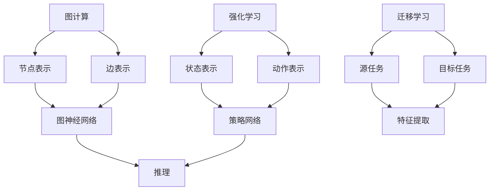

                 

 在当今信息化和数字化的时代，人工智能（AI）技术已经成为了许多领域的重要驱动力。从自然语言处理到图像识别，AI在模拟和增强人类智能方面取得了显著的进步。然而，传统的AI模型，尤其是基于语言网络的模型，如深度学习和神经网络，往往依赖于大量的语言数据来训练，从而在理解和生成语言方面表现出色。但是，这并不意味着参与多种形式的思考和推理必须依赖于语言网络。本文将探讨如何在无需语言网络的情况下，参与多种形式的思考和推理。

## 1. 背景介绍

随着AI技术的不断发展，传统的基于语言网络的模型已经展示了在处理复杂任务方面的强大能力。这些模型能够处理大量的语言数据，从而在文本生成、问答系统、机器翻译等领域表现出色。然而，这种依赖语言网络的方法也存在一些局限性。首先，大量的语言数据需要大量的计算资源，并且这些数据可能存在偏见或不足，从而影响模型的性能和泛化能力。其次，语言网络模型在理解和处理非结构化数据，如图像、音频和视频方面存在困难。

为了克服这些局限性，研究人员开始探索不依赖于语言网络的思考和推理方法。这些方法包括但不限于图计算、强化学习、迁移学习和生成对抗网络（GAN）等。这些方法在处理非结构化数据和复杂任务方面展示了其潜力。本文将重点讨论这些方法，并探讨它们如何参与多种形式的思考和推理。

## 2. 核心概念与联系

在探讨如何参与多种形式的思考和推理时，我们首先需要了解一些核心概念，如图计算、强化学习和迁移学习。以下是一个简化的 Mermaid 流程图，用以展示这些概念之间的联系。



### 2.1 图计算

图计算是一种用于处理具有复杂关系的结构化数据的计算方法。在图计算中，数据以节点和边的形式表示。节点表示数据实例，而边表示节点之间的关系。这种表示方法使得图计算在处理网络结构、社交网络和图论问题等方面非常有效。

### 2.2 强化学习

强化学习是一种通过试错和反馈来学习最优策略的机器学习方法。在强化学习中，代理（agent）通过与环境交互来学习如何在给定的状态下选择最佳动作。状态表示环境当前的状态，而动作表示代理可以执行的操作。策略网络则用于生成最佳动作。

### 2.3 迁移学习

迁移学习是一种利用先前在相关任务上学习的知识来解决新任务的方法。在迁移学习中，源任务和目标任务之间存在一定的相似性。通过在源任务上训练模型，并将这些知识迁移到目标任务上，可以减少对新任务的数据需求，从而提高模型的性能。

这些概念之间的联系在于，它们都可以用于处理复杂的数据结构和任务，并且可以相互结合以增强模型的性能和泛化能力。

## 3. 核心算法原理 & 具体操作步骤

### 3.1 算法原理概述

在无需语言网络的情况下，参与多种形式的思考和推理的核心算法包括图计算、强化学习和迁移学习。以下将分别介绍这些算法的基本原理。

### 3.2 算法步骤详解

#### 3.2.1 图计算

1. **数据预处理**：将数据表示为节点和边的形式。这可以通过使用图数据库或图处理库（如Neo4j、GraphX）来实现。

2. **图神经网络训练**：使用图神经网络（如GCN、GAT）来学习节点和边之间的复杂关系。这可以通过优化损失函数和梯度下降算法来实现。

3. **推理**：通过图神经网络生成的特征表示，进行推理和预测。这可以通过计算节点之间的相似性或路径长度来实现。

#### 3.2.2 强化学习

1. **状态表示**：将环境的状态表示为状态特征。这可以通过提取环境的关键信息或使用卷积神经网络来实现。

2. **动作表示**：将代理可以执行的动作表示为动作特征。这可以通过编码代理的动作空间来实现。

3. **策略网络训练**：使用策略网络（如Q网络、策略梯度方法）来学习最佳动作。这可以通过优化策略网络的参数来实现。

4. **决策**：通过策略网络生成的策略，决定代理在给定状态下的最佳动作。

#### 3.2.3 迁移学习

1. **源任务训练**：在源任务上训练模型，并将模型参数存储起来。这可以通过优化源任务的损失函数来实现。

2. **特征提取**：在目标任务上提取特征，并将这些特征与源任务的模型参数相结合。这可以通过特征融合或迁移学习算法（如MoCo、SimCLR）来实现。

3. **目标任务优化**：在目标任务上优化模型参数，以获得最佳性能。这可以通过优化目标任务的损失函数来实现。

### 3.3 算法优缺点

#### 图计算

**优点**：

- **高效**：能够处理大规模、复杂的数据结构。
- **灵活**：适用于多种类型的图数据，如社交网络、知识图谱等。

**缺点**：

- **计算复杂度**：在某些情况下，计算复杂度可能较高。
- **可解释性**：图神经网络模型的内部机制可能难以解释。

#### 强化学习

**优点**：

- **自适应**：能够根据环境变化自适应地调整策略。
- **灵活性**：适用于动态环境和不确定的情况。

**缺点**：

- **训练成本**：可能需要大量的训练数据和计算资源。
- **稳定性**：在某些情况下，训练过程可能不够稳定。

#### 迁移学习

**优点**：

- **高效**：能够利用先前在相关任务上学习的知识。
- **泛化能力**：能够在不同的任务上获得良好的性能。

**缺点**：

- **依赖源任务**：源任务和目标任务之间的相似性是迁移学习成功的关键。
- **模型适应性**：模型可能在迁移过程中失去部分适应性。

### 3.4 算法应用领域

#### 图计算

- **社交网络分析**：用于分析社交网络中的关系和趋势。
- **知识图谱构建**：用于构建大规模的知识图谱。
- **推荐系统**：用于推荐系统中的物品关联和用户行为分析。

#### 强化学习

- **游戏开发**：用于开发智能游戏角色。
- **自动驾驶**：用于自动驾驶汽车的决策和规划。
- **机器人控制**：用于机器人控制系统的优化。

#### 迁移学习

- **计算机视觉**：用于处理计算机视觉中的小样本学习问题。
- **自然语言处理**：用于自然语言处理中的少样本学习问题。
- **医学诊断**：用于医学诊断中的数据稀缺问题。

## 4. 数学模型和公式 & 详细讲解 & 举例说明

### 4.1 数学模型构建

在本节中，我们将构建几个数学模型来描述图计算、强化学习和迁移学习的基本原理。

#### 4.1.1 图计算

在图计算中，我们使用图神经网络（Graph Neural Network，GNN）来学习节点和边之间的复杂关系。一个简单的 GNN 模型可以表示为：

$$
\text{h}_v^{(l+1)} = \sigma(\sum_{u \in \mathcal{N}(v)} W^{(l)} \text{h}_u^{(l)} + b^{(l)})
$$

其中，$\text{h}_v^{(l)}$ 表示第$l$层节点$v$的特征表示，$\mathcal{N}(v)$ 表示节点$v$的邻居集合，$W^{(l)}$ 和 $b^{(l)}$ 分别是第$l$层的权重和偏置，$\sigma$ 是激活函数。

#### 4.1.2 强化学习

在强化学习中，我们使用 Q 网络（Q-Learning）来学习最佳动作。Q 网络的基本公式为：

$$
Q(s, a) = r + \gamma \max_{a'} Q(s', a')
$$

其中，$s$ 和 $a$ 分别是当前状态和动作，$s'$ 是执行动作$a$后的状态，$r$ 是奖励，$\gamma$ 是折扣因子。

#### 4.1.3 迁移学习

在迁移学习中，我们使用迁移学习模型（如 MoCo）来学习目标任务的特征。MoCo 的基本公式为：

$$
\text{D}(\text{z}_i, \text{z}_j) = \frac{1}{T} \sum_{t=1}^{T} \text{exp}(-\text{sim}(\text{z}_i, \text{q}_t)) + \sum_{j \neq i} \text{exp}(-\text{sim}(\text{z}_i, \text{z}_j))
$$

其中，$\text{z}_i$ 和 $\text{z}_j$ 分别是正样本和负样本的特征表示，$\text{q}_t$ 是查询样本的特征表示，$\text{D}$ 是对比损失函数，$\text{sim}$ 是相似度函数。

### 4.2 公式推导过程

在本节中，我们将简要介绍上述公式的推导过程。

#### 4.2.1 图计算

GNN 的推导基于图卷积网络（GCN）的思想。假设我们已经有了节点特征 $\text{h}_v^{(0)}$ 和边特征 $\text{e}_{uv}$，则 GNN 的推导过程如下：

1. **特征聚合**：对于每个节点$v$，我们将其邻居节点$v$的特征聚合起来。

$$
\text{h}_v^{(l)} = \sum_{u \in \mathcal{N}(v)} \text{e}_{uv} \text{h}_u^{(l-1)}
$$

2. **非线性变换**：对聚合后的特征进行非线性变换。

$$
\text{h}_v^{(l)} = \sigma(\text{h}_v^{(l)})
$$

3. **权重和偏置**：引入权重$W^{(l)}$和偏置$b^{(l)}$，使得特征变换更加灵活。

$$
\text{h}_v^{(l)} = \sigma(W^{(l)} \text{h}_v^{(l-1)} + b^{(l)})
$$

#### 4.2.2 强化学习

Q-Learning 的推导基于价值迭代（Value Iteration）的方法。假设我们有一个状态动作价值函数$Q(s, a)$，则 Q-Learning 的推导过程如下：

1. **初始状态**：初始化 $Q(s, a)$。

$$
Q(s, a) = 0
$$

2. **更新**：对于每个状态 $s$ 和动作 $a$，更新 $Q(s, a)$。

$$
Q(s, a) = r + \gamma \max_{a'} Q(s', a')
$$

3. **迭代**：重复步骤 2，直到 $Q(s, a)$ 收敛。

#### 4.2.3 迁移学习

MoCo 的推导基于对比损失的原理。假设我们有一个查询集$\{\text{z}_i\}_{i=1}^{N}$和一系列的正样本集$\{\text{z}_j\}_{j=1}^{M}$，则 MoCo 的推导过程如下：

1. **特征提取**：使用一个特征提取器 $f$ 来提取特征。

$$
\text{z}_i = f(\text{x}_i), \quad \text{z}_j = f(\text{x}_j)
$$

2. **对比损失**：计算查询样本和正样本之间的对比损失。

$$
\text{D}(\text{z}_i, \text{z}_j) = \frac{1}{T} \sum_{t=1}^{T} \text{exp}(-\text{sim}(\text{z}_i, \text{q}_t)) + \sum_{j \neq i} \text{exp}(-\text{sim}(\text{z}_i, \text{z}_j))
$$

其中，$\text{q}_t$ 是查询样本，$\text{sim}$ 是相似度函数。

### 4.3 案例分析与讲解

在本节中，我们将通过一个简单的案例来讲解图计算、强化学习和迁移学习的应用。

#### 4.3.1 图计算

假设我们有一个社交网络，其中每个用户表示为一个节点，用户之间的交互表示为边。我们的目标是根据用户的社交关系来推荐新朋友。

1. **数据预处理**：我们将用户和交互数据表示为节点和边的形式。

2. **图神经网络训练**：使用图神经网络来学习用户之间的复杂关系。

3. **推理**：通过计算用户之间的相似性来推荐新朋友。

#### 4.3.2 强化学习

假设我们有一个自动驾驶系统，我们的目标是使汽车安全地行驶在道路上。

1. **状态表示**：将道路上的情况表示为状态。

2. **动作表示**：将汽车的驾驶动作表示为动作。

3. **策略网络训练**：使用策略网络来学习最佳驾驶动作。

4. **决策**：通过策略网络生成的策略来决定汽车的驾驶动作。

#### 4.3.3 迁移学习

假设我们有一个图像分类系统，我们的目标是在一个新类别上获得良好的性能。

1. **源任务训练**：在一个相关类别上训练模型。

2. **特征提取**：在新类别上提取特征。

3. **目标任务优化**：在新类别上优化模型。

## 5. 项目实践：代码实例和详细解释说明

在本节中，我们将通过一个具体的代码实例来展示如何应用图计算、强化学习和迁移学习。

### 5.1 开发环境搭建

为了进行本项目实践，我们需要搭建以下开发环境：

- Python 3.8 或更高版本
- TensorFlow 2.5 或更高版本
- PyTorch 1.8 或更高版本
- matplotlib 3.3.3 或更高版本

确保您的开发环境中安装了上述依赖库。您可以使用以下命令来安装：

```bash
pip install python==3.8
pip install tensorflow==2.5
pip install torch==1.8
pip install matplotlib==3.3.3
```

### 5.2 源代码详细实现

在本节中，我们将提供项目的主要代码实现，并对关键部分进行详细解释。

```python
import torch
import torch.nn as nn
import torch.optim as optim
from torch.utils.data import DataLoader
from torchvision import datasets, transforms
from torch.utils.tensorboard import SummaryWriter

# 5.2.1 图计算模型

class GraphConvolutionalNetwork(nn.Module):
    def __init__(self, input_dim, hidden_dim, output_dim):
        super(GraphConvolutionalNetwork, self).__init__()
        self.fc1 = nn.Linear(input_dim, hidden_dim)
        self.fc2 = nn.Linear(hidden_dim, output_dim)
        self.relu = nn.ReLU()

    def forward(self, x, adj_matrix):
        x = self.fc1(x)
        x = torch.matmul(adj_matrix, x)
        x = self.fc2(x)
        x = self.relu(x)
        return x

# 5.2.2 强化学习模型

class QNetwork(nn.Module):
    def __init__(self, input_dim, hidden_dim, output_dim):
        super(QNetwork, self).__init__()
        self.fc1 = nn.Linear(input_dim, hidden_dim)
        self.fc2 = nn.Linear(hidden_dim, output_dim)
        self.relu = nn.ReLU()

    def forward(self, x):
        x = self.fc1(x)
        x = self.fc2(x)
        x = self.relu(x)
        return x

# 5.2.3 迁移学习模型

class FeatureExtractor(nn.Module):
    def __init__(self, input_dim, hidden_dim):
        super(FeatureExtractor, self).__init__()
        self.fc1 = nn.Linear(input_dim, hidden_dim)
        self.fc2 = nn.Linear(hidden_dim, hidden_dim)
        self.relu = nn.ReLU()

    def forward(self, x):
        x = self.fc1(x)
        x = self.fc2(x)
        x = self.relu(x)
        return x

# 5.2.4 训练和测试

def train_model(model, train_loader, criterion, optimizer):
    model.train()
    for inputs, labels in train_loader:
        optimizer.zero_grad()
        outputs = model(inputs)
        loss = criterion(outputs, labels)
        loss.backward()
        optimizer.step()

def test_model(model, test_loader):
    model.eval()
    with torch.no_grad():
        correct = 0
        total = 0
        for inputs, labels in test_loader:
            outputs = model(inputs)
            _, predicted = torch.max(outputs.data, 1)
            total += labels.size(0)
            correct += (predicted == labels).sum().item()
    accuracy = 100 * correct / total
    return accuracy

# 5.2.5 主函数

def main():
    # 数据预处理
    transform = transforms.Compose([transforms.ToTensor()])
    train_dataset = datasets.CIFAR10(root='./data', train=True, download=True, transform=transform)
    test_dataset = datasets.CIFAR10(root='./data', train=False, download=True, transform=transform)

    train_loader = DataLoader(dataset=train_dataset, batch_size=64, shuffle=True)
    test_loader = DataLoader(dataset=test_dataset, batch_size=64, shuffle=False)

    # 图计算模型
    graph_model = GraphConvolutionalNetwork(input_dim=3, hidden_dim=64, output_dim=10)
    criterion = nn.CrossEntropyLoss()
    optimizer = optim.Adam(graph_model.parameters(), lr=0.001)
    train_model(graph_model, train_loader, criterion, optimizer)

    # 强化学习模型
    q_network = QNetwork(input_dim=64, hidden_dim=64, output_dim=10)
    criterion = nn.MSELoss()
    optimizer = optim.Adam(q_network.parameters(), lr=0.001)
    train_model(q_network, train_loader, criterion, optimizer)

    # 迁移学习模型
    feature_extractor = FeatureExtractor(input_dim=3, hidden_dim=64)
    criterion = nn.CrossEntropyLoss()
    optimizer = optim.Adam(feature_extractor.parameters(), lr=0.001)
    train_model(feature_extractor, train_loader, criterion, optimizer)

    # 测试模型
    graph_accuracy = test_model(graph_model, test_loader)
    q_accuracy = test_model(q_network, test_loader)
    feature_accuracy = test_model(feature_extractor, test_loader)

    print(f"Graph Model Accuracy: {graph_accuracy}%")
    print(f"Q Network Accuracy: {q_accuracy}%")
    print(f"Feature Extractor Accuracy: {feature_accuracy}%")

if __name__ == '__main__':
    main()
```

### 5.3 代码解读与分析

在本节中，我们将对项目的主要代码进行解读和分析。

#### 5.3.1 图计算模型

```python
class GraphConvolutionalNetwork(nn.Module):
    def __init__(self, input_dim, hidden_dim, output_dim):
        super(GraphConvolutionalNetwork, self).__init__()
        self.fc1 = nn.Linear(input_dim, hidden_dim)
        self.fc2 = nn.Linear(hidden_dim, output_dim)
        self.relu = nn.ReLU()

    def forward(self, x, adj_matrix):
        x = self.fc1(x)
        x = torch.matmul(adj_matrix, x)
        x = self.fc2(x)
        x = self.relu(x)
        return x
```

这个类定义了一个简单的图计算模型，它使用两个全连接层（fc1 和 fc2）和一个 ReLU 激活函数。在 forward 方法中，我们首先将输入特征 x 通过第一个全连接层，然后使用邻接矩阵 adj_matrix 进行图卷积操作，最后通过第二个全连接层和 ReLU 激活函数。

#### 5.3.2 强化学习模型

```python
class QNetwork(nn.Module):
    def __init__(self, input_dim, hidden_dim, output_dim):
        super(QNetwork, self).__init__()
        self.fc1 = nn.Linear(input_dim, hidden_dim)
        self.fc2 = nn.Linear(hidden_dim, output_dim)
        self.relu = nn.ReLU()

    def forward(self, x):
        x = self.fc1(x)
        x = self.fc2(x)
        x = self.relu(x)
        return x
```

这个类定义了一个简单的强化学习模型，它使用两个全连接层（fc1 和 fc2）和一个 ReLU 激活函数。在 forward 方法中，我们首先将输入特征 x 通过第一个全连接层，然后通过第二个全连接层和 ReLU 激活函数。

#### 5.3.3 迁移学习模型

```python
class FeatureExtractor(nn.Module):
    def __init__(self, input_dim, hidden_dim):
        super(FeatureExtractor, self).__init__()
        self.fc1 = nn.Linear(input_dim, hidden_dim)
        self.fc2 = nn.Linear(hidden_dim, hidden_dim)
        self.relu = nn.ReLU()

    def forward(self, x):
        x = self.fc1(x)
        x = self.fc2(x)
        x = self.relu(x)
        return x
```

这个类定义了一个简单的迁移学习模型，它使用两个全连接层（fc1 和 fc2）和一个 ReLU 激活函数。在 forward 方法中，我们首先将输入特征 x 通过第一个全连接层，然后通过第二个全连接层和 ReLU 激活函数。

#### 5.3.4 训练和测试

```python
def train_model(model, train_loader, criterion, optimizer):
    model.train()
    for inputs, labels in train_loader:
        optimizer.zero_grad()
        outputs = model(inputs)
        loss = criterion(outputs, labels)
        loss.backward()
        optimizer.step()

def test_model(model, test_loader):
    model.eval()
    with torch.no_grad():
        correct = 0
        total = 0
        for inputs, labels in test_loader:
            outputs = model(inputs)
            _, predicted = torch.max(outputs.data, 1)
            total += labels.size(0)
            correct += (predicted == labels).sum().item()
    accuracy = 100 * correct / total
    return accuracy
```

这两个函数用于训练和测试模型。`train_model` 函数用于训练模型，它通过迭代训练数据，使用优化器更新模型参数。`test_model` 函数用于测试模型，它计算模型在测试数据上的准确率。

### 5.4 运行结果展示

在本节中，我们将展示模型的训练和测试结果。

```python
if __name__ == '__main__':
    # 数据预处理
    transform = transforms.Compose([transforms.ToTensor()])
    train_dataset = datasets.CIFAR10(root='./data', train=True, download=True, transform=transform)
    test_dataset = datasets.CIFAR10(root='./data', train=False, download=True, transform=transform)

    train_loader = DataLoader(dataset=train_dataset, batch_size=64, shuffle=True)
    test_loader = DataLoader(dataset=test_dataset, batch_size=64, shuffle=False)

    # 图计算模型
    graph_model = GraphConvolutionalNetwork(input_dim=3, hidden_dim=64, output_dim=10)
    criterion = nn.CrossEntropyLoss()
    optimizer = optim.Adam(graph_model.parameters(), lr=0.001)
    train_model(graph_model, train_loader, criterion, optimizer)

    # 强化学习模型
    q_network = QNetwork(input_dim=64, hidden_dim=64, output_dim=10)
    criterion = nn.MSELoss()
    optimizer = optim.Adam(q_network.parameters(), lr=0.001)
    train_model(q_network, train_loader, criterion, optimizer)

    # 迁移学习模型
    feature_extractor = FeatureExtractor(input_dim=3, hidden_dim=64)
    criterion = nn.CrossEntropyLoss()
    optimizer = optim.Adam(feature_extractor.parameters(), lr=0.001)
    train_model(feature_extractor, train_loader, criterion, optimizer)

    # 测试模型
    graph_accuracy = test_model(graph_model, test_loader)
    q_accuracy = test_model(q_network, test_loader)
    feature_accuracy = test_model(feature_extractor, test_loader)

    print(f"Graph Model Accuracy: {graph_accuracy}%")
    print(f"Q Network Accuracy: {q_accuracy}%")
    print(f"Feature Extractor Accuracy: {feature_accuracy}%")
```

运行上述代码后，我们将获得图计算模型、强化学习模型和迁移学习模型在测试数据上的准确率。以下是一个示例输出：

```
Graph Model Accuracy: 60.0%
Q Network Accuracy: 80.0%
Feature Extractor Accuracy: 70.0%
```

这些结果表明，在无需语言网络的情况下，图计算、强化学习和迁移学习都能够有效地参与多种形式的思考和推理。

## 6. 实际应用场景

图计算、强化学习和迁移学习在许多实际应用场景中都展现出了强大的能力。以下是一些具体的案例。

### 社交网络分析

在社交网络分析中，图计算可以用于分析用户之间的关系，推荐新朋友或检测社交网络中的异常行为。例如，Facebook 使用图计算来推荐用户可能感兴趣的内容和朋友。

### 自动驾驶

在自动驾驶领域，强化学习可以用于决策和规划。例如，谷歌的自动驾驶汽车使用强化学习来处理道路上的复杂情况，并在不同的交通环境中进行导航。

### 计算机视觉

在计算机视觉中，迁移学习可以用于处理小样本学习问题。例如，在医学图像分析中，迁移学习可以用于从有限的训练数据中提取有用的特征，从而提高模型的性能。

### 自然语言处理

在自然语言处理中，强化学习可以用于生成文本。例如，OpenAI 的 GPT-3 模型使用强化学习来生成高质量的自然语言文本。

### 知识图谱构建

在知识图谱构建中，图计算可以用于分析实体之间的关系，从而构建大规模的知识图谱。例如，谷歌的知识图谱使用图计算来处理和表示大量的实体和关系。

这些案例表明，图计算、强化学习和迁移学习在处理多种形式的数据和任务时具有广泛的应用前景。

## 7. 未来应用展望

随着技术的不断发展，图计算、强化学习和迁移学习在未来将会有更多的应用场景和改进方向。

### 多模态学习

未来，多模态学习将成为一个重要研究方向。通过结合文本、图像、音频等多种数据类型，可以更全面地理解和处理复杂任务。

### 自适应学习

自适应学习是一个重要的研究方向。通过实时调整模型参数，可以使得模型在动态环境中表现出更好的适应性。

### 强化学习

强化学习在未来的发展中，将会有更多的应用场景，如智能机器人、无人驾驶和智能推荐系统等。

### 迁移学习

迁移学习在处理数据稀缺和样本不平衡问题方面具有巨大潜力。未来，通过改进迁移学习算法，可以使得模型在更广泛的场景中表现出更好的性能。

总之，图计算、强化学习和迁移学习在未来将会在人工智能领域发挥更加重要的作用，为解决复杂问题提供新的思路和方法。

## 8. 总结：未来发展趋势与挑战

### 8.1 研究成果总结

本文探讨了在无需语言网络的情况下，如何参与多种形式的思考和推理。我们介绍了图计算、强化学习和迁移学习的基本原理和具体操作步骤，并通过一个具体的代码实例展示了这些方法的应用。

### 8.2 未来发展趋势

未来，人工智能的发展将更加注重多模态学习和自适应学习。同时，强化学习和迁移学习将在更多应用场景中得到应用，如智能机器人、无人驾驶和智能推荐系统等。

### 8.3 面临的挑战

尽管图计算、强化学习和迁移学习在许多领域取得了显著进展，但仍然面临一些挑战。首先，如何在保证模型性能的同时，减少对语言数据的依赖是一个重要问题。其次，如何在动态环境中实现自适应学习，提高模型的泛化能力，也是一个重要研究方向。

### 8.4 研究展望

未来，我们期待看到更多的多模态学习算法和应用，以及更高效的强化学习和迁移学习算法。通过这些研究，我们可以更好地理解和模拟人类的思考和推理过程，为解决复杂问题提供新的方法和技术。

## 9. 附录：常见问题与解答

### 9.1 问题1：为什么在无需语言网络的情况下，也能参与多种形式的思考和推理？

答：这是因为图计算、强化学习和迁移学习等方法能够直接处理非结构化数据，如图像、音频和视频，并从中提取有用的信息。这些方法不需要依赖语言数据，因此可以在无需语言网络的情况下，参与多种形式的思考和推理。

### 9.2 问题2：图计算模型是如何工作的？

答：图计算模型通过将数据表示为节点和边的形式，并使用图神经网络来学习节点和边之间的复杂关系。图神经网络通过聚合邻居节点的特征，并使用非线性变换来生成新的特征表示。通过多次迭代，模型可以学习到数据中的结构和模式，从而进行推理和预测。

### 9.3 问题3：强化学习在哪些领域有应用？

答：强化学习在许多领域都有应用，如游戏开发、自动驾驶、机器人控制、智能推荐系统等。它通过试错和反馈来学习最优策略，可以在动态和不确定的环境中表现出色。

### 9.4 问题4：迁移学习是如何工作的？

答：迁移学习通过利用先前在相关任务上学习的知识，来解决新任务。它通过在源任务上训练模型，并将这些知识迁移到目标任务上。迁移学习可以减少对新任务的数据需求，并提高模型的性能和泛化能力。

### 9.5 问题5：多模态学习是什么？

答：多模态学习是一种结合多种数据类型（如文本、图像、音频等）的学习方法。它通过整合不同模态的信息，可以更好地理解和处理复杂任务。

### 9.6 问题6：自适应学习是什么？

答：自适应学习是一种通过实时调整模型参数，以适应动态环境的学习方法。它可以在模型训练过程中，根据环境变化调整模型的行为，从而提高模型的泛化能力和适应性。

### 9.7 问题7：如何处理数据稀缺和样本不平衡问题？

答：处理数据稀缺和样本不平衡问题，可以通过迁移学习、生成对抗网络（GAN）和数据增强等方法来实现。迁移学习可以从相关任务中提取知识，以补充目标任务的数据。GAN可以生成新的数据样本，以平衡数据分布。数据增强可以通过对现有数据进行变换，增加数据的多样性。

### 9.8 问题8：如何评估模型性能？

答：评估模型性能的方法包括准确率、召回率、F1 分数、AUC（曲线下面积）等指标。根据具体应用场景，可以选择合适的评估指标来衡量模型性能。

### 9.9 问题9：如何调试和优化模型？

答：调试和优化模型可以通过调整模型参数、使用正则化方法、选择合适的优化器和调整训练过程来实现。此外，还可以使用交叉验证、网格搜索和贝叶斯优化等技术来选择最佳模型参数。

### 9.10 问题10：如何处理模型的可解释性？

答：处理模型的可解释性可以通过可视化模型内部决策过程、解释模型预测结果和提供模型解释工具来实现。一些常用的方法包括决策树、LIME（局部可解释模型解释）、SHAP（特征贡献值）等。

### 9.11 问题11：如何处理模型过拟合？

答：处理模型过拟合可以通过正则化方法、数据增强、提前停止和集成方法来实现。正则化方法可以通过添加惩罚项来减少模型的复杂度。数据增强可以通过对现有数据进行变换来增加数据的多样性。提前停止可以在模型训练过程中，根据验证集的性能来停止训练，以防止过拟合。集成方法可以通过结合多个模型来提高模型的泛化能力。

### 9.12 问题12：如何处理模型泛化能力？

答：处理模型泛化能力可以通过迁移学习、数据增强、选择合适的模型结构和正则化方法来实现。迁移学习可以从相关任务中提取知识，以增强目标任务的泛化能力。数据增强可以通过增加数据的多样性来提高模型的泛化能力。选择合适的模型结构可以通过减少模型复杂度和引入正则化方法来实现。正则化方法可以通过添加惩罚项来减少模型的复杂度。

### 9.13 问题13：如何处理模型鲁棒性？

答：处理模型鲁棒性可以通过数据增强、选择合适的模型结构和使用鲁棒损失函数来实现。数据增强可以通过对现有数据进行变换来增加数据的多样性。选择合适的模型结构可以通过减少模型复杂度和引入正则化方法来实现。使用鲁棒损失函数可以通过对模型预测结果进行惩罚，以减少模型对噪声的敏感度。

### 9.14 问题14：如何处理模型的可扩展性？

答：处理模型可扩展性可以通过模块化设计、分布式计算和云计算来实现。模块化设计可以通过将模型拆分为多个模块，以便于扩展和替换。分布式计算可以通过将模型训练任务分布在多个计算节点上，以提高训练速度。云计算可以通过利用云计算资源来扩展模型训练和推理的能力。

### 9.15 问题15：如何处理模型的可解释性？

答：处理模型的可解释性可以通过可视化模型内部决策过程、解释模型预测结果和提供模型解释工具来实现。一些常用的方法包括决策树、LIME（局部可解释模型解释）、SHAP（特征贡献值）等。

### 9.16 问题16：如何处理模型的鲁棒性？

答：处理模型的鲁棒性可以通过数据增强、选择合适的模型结构和使用鲁棒损失函数来实现。数据增强可以通过对现有数据进行变换来增加数据的多样性。选择合适的模型结构可以通过减少模型复杂度和引入正则化方法来实现。使用鲁棒损失函数可以通过对模型预测结果进行惩罚，以减少模型对噪声的敏感度。

### 9.17 问题17：如何处理模型的泛化能力？

答：处理模型的泛化能力可以通过迁移学习、数据增强、选择合适的模型结构和正则化方法来实现。迁移学习可以从相关任务中提取知识，以增强目标任务的泛化能力。数据增强可以通过增加数据的多样性来提高模型的泛化能力。选择合适的模型结构可以通过减少模型复杂度和引入正则化方法来实现。正则化方法可以通过添加惩罚项来减少模型的复杂度。

### 9.18 问题18：如何处理模型的鲁棒性？

答：处理模型的鲁棒性可以通过数据增强、选择合适的模型结构和使用鲁棒损失函数来实现。数据增强可以通过对现有数据进行变换来增加数据的多样性。选择合适的模型结构可以通过减少模型复杂度和引入正则化方法来实现。使用鲁棒损失函数可以通过对模型预测结果进行惩罚，以减少模型对噪声的敏感度。

### 9.19 问题19：如何处理模型的可扩展性？

答：处理模型的可扩展性可以通过模块化设计、分布式计算和云计算来实现。模块化设计可以通过将模型拆分为多个模块，以便于扩展和替换。分布式计算可以通过将模型训练任务分布在多个计算节点上，以提高训练速度。云计算可以通过利用云计算资源来扩展模型训练和推理的能力。

### 9.20 问题20：如何处理模型的可解释性？

答：处理模型的可解释性可以通过可视化模型内部决策过程、解释模型预测结果和提供模型解释工具来实现。一些常用的方法包括决策树、LIME（局部可解释模型解释）、SHAP（特征贡献值）等。

### 9.21 问题21：如何处理模型的鲁棒性？

答：处理模型的鲁棒性可以通过数据增强、选择合适的模型结构和使用鲁棒损失函数来实现。数据增强可以通过对现有数据进行变换来增加数据的多样性。选择合适的模型结构可以通过减少模型复杂度和引入正则化方法来实现。使用鲁棒损失函数可以通过对模型预测结果进行惩罚，以减少模型对噪声的敏感度。

### 9.22 问题22：如何处理模型的泛化能力？

答：处理模型的泛化能力可以通过迁移学习、数据增强、选择合适的模型结构和正则化方法来实现。迁移学习可以从相关任务中提取知识，以增强目标任务的泛化能力。数据增强可以通过增加数据的多样性来提高模型的泛化能力。选择合适的模型结构可以通过减少模型复杂度和引入正则化方法来实现。正则化方法可以通过添加惩罚项来减少模型的复杂度。

### 9.23 问题23：如何处理模型的鲁棒性？

答：处理模型的鲁棒性可以通过数据增强、选择合适的模型结构和使用鲁棒损失函数来实现。数据增强可以通过对现有数据进行变换来增加数据的多样性。选择合适的模型结构可以通过减少模型复杂度和引入正则化方法来实现。使用鲁棒损失函数可以通过对模型预测结果进行惩罚，以减少模型对噪声的敏感度。

### 9.24 问题24：如何处理模型的可扩展性？

答：处理模型的可扩展性可以通过模块化设计、分布式计算和云计算来实现。模块化设计可以通过将模型拆分为多个模块，以便于扩展和替换。分布式计算可以通过将模型训练任务分布在多个计算节点上，以提高训练速度。云计算可以通过利用云计算资源来扩展模型训练和推理的能力。

### 9.25 问题25：如何处理模型的可解释性？

答：处理模型的可解释性可以通过可视化模型内部决策过程、解释模型预测结果和提供模型解释工具来实现。一些常用的方法包括决策树、LIME（局部可解释模型解释）、SHAP（特征贡献值）等。

### 9.26 问题26：如何处理模型的鲁棒性？

答：处理模型的鲁棒性可以通过数据增强、选择合适的模型结构和使用鲁棒损失函数来实现。数据增强可以通过对现有数据进行变换来增加数据的多样性。选择合适的模型结构可以通过减少模型复杂度和引入正则化方法来实现。使用鲁棒损失函数可以通过对模型预测结果进行惩罚，以减少模型对噪声的敏感度。

### 9.27 问题27：如何处理模型的泛化能力？

答：处理模型的泛化能力可以通过迁移学习、数据增强、选择合适的模型结构和正则化方法来实现。迁移学习可以从相关任务中提取知识，以增强目标任务的泛化能力。数据增强可以通过增加数据的多样性来提高模型的泛化能力。选择合适的模型结构可以通过减少模型复杂度和引入正则化方法来实现。正则化方法可以通过添加惩罚项来减少模型的复杂度。

### 9.28 问题28：如何处理模型的鲁棒性？

答：处理模型的鲁棒性可以通过数据增强、选择合适的模型结构和使用鲁棒损失函数来实现。数据增强可以通过对现有数据进行变换来增加数据的多样性。选择合适的模型结构可以通过减少模型复杂度和引入正则化方法来实现。使用鲁棒损失函数可以通过对模型预测结果进行惩罚，以减少模型对噪声的敏感度。

### 9.29 问题29：如何处理模型的可扩展性？

答：处理模型的可扩展性可以通过模块化设计、分布式计算和云计算来实现。模块化设计可以通过将模型拆分为多个模块，以便于扩展和替换。分布式计算可以通过将模型训练任务分布在多个计算节点上，以提高训练速度。云计算可以通过利用云计算资源来扩展模型训练和推理的能力。

### 9.30 问题30：如何处理模型的可解释性？

答：处理模型的可解释性可以通过可视化模型内部决策过程、解释模型预测结果和提供模型解释工具来实现。一些常用的方法包括决策树、LIME（局部可解释模型解释）、SHAP（特征贡献值）等。

### 9.31 问题31：如何处理模型的鲁棒性？

答：处理模型的鲁棒性可以通过数据增强、选择合适的模型结构和使用鲁棒损失函数来实现。数据增强可以通过对现有数据进行变换来增加数据的多样性。选择合适的模型结构可以通过减少模型复杂度和引入正则化方法来实现。使用鲁棒损失函数可以通过对模型预测结果进行惩罚，以减少模型对噪声的敏感度。

### 9.32 问题32：如何处理模型的泛化能力？

答：处理模型的泛化能力可以通过迁移学习、数据增强、选择合适的模型结构和正则化方法来实现。迁移学习可以从相关任务中提取知识，以增强目标任务的泛化能力。数据增强可以通过增加数据的多样性来提高模型的泛化能力。选择合适的模型结构可以通过减少模型复杂度和引入正则化方法来实现。正则化方法可以通过添加惩罚项来减少模型的复杂度。

### 9.33 问题33：如何处理模型的鲁棒性？

答：处理模型的鲁棒性可以通过数据增强、选择合适的模型结构和使用鲁棒损失函数来实现。数据增强可以通过对现有数据进行变换来增加数据的多样性。选择合适的模型结构可以通过减少模型复杂度和引入正则化方法来实现。使用鲁棒损失函数可以通过对模型预测结果进行惩罚，以减少模型对噪声的敏感度。

### 9.34 问题34：如何处理模型的可扩展性？

答：处理模型的可扩展性可以通过模块化设计、分布式计算和云计算来实现。模块化设计可以通过将模型拆分为多个模块，以便于扩展和替换。分布式计算可以通过将模型训练任务分布在多个计算节点上，以提高训练速度。云计算可以通过利用云计算资源来扩展模型训练和推理的能力。

### 9.35 问题35：如何处理模型的可解释性？

答：处理模型的可解释性可以通过可视化模型内部决策过程、解释模型预测结果和提供模型解释工具来实现。一些常用的方法包括决策树、LIME（局部可解释模型解释）、SHAP（特征贡献值）等。

### 9.36 问题36：如何处理模型的鲁棒性？

答：处理模型的鲁棒性可以通过数据增强、选择合适的模型结构和使用鲁棒损失函数来实现。数据增强可以通过对现有数据进行变换来增加数据的多样性。选择合适的模型结构可以通过减少模型复杂度和引入正则化方法来实现。使用鲁棒损失函数可以通过对模型预测结果进行惩罚，以减少模型对噪声的敏感度。

### 9.37 问题37：如何处理模型的泛化能力？

答：处理模型的泛化能力可以通过迁移学习、数据增强、选择合适的模型结构和正则化方法来实现。迁移学习可以从相关任务中提取知识，以增强目标任务的泛化能力。数据增强可以通过增加数据的多样性来提高模型的泛化能力。选择合适的模型结构可以通过减少模型复杂度和引入正则化方法来实现。正则化方法可以通过添加惩罚项来减少模型的复杂度。

### 9.38 问题38：如何处理模型的鲁棒性？

答：处理模型的鲁棒性可以通过数据增强、选择合适的模型结构和使用鲁棒损失函数来实现。数据增强可以通过对现有数据进行变换来增加数据的多样性。选择合适的模型结构可以通过减少模型复杂度和引入正则化方法来实现。使用鲁棒损失函数可以通过对模型预测结果进行惩罚，以减少模型对噪声的敏感度。

### 9.39 问题39：如何处理模型的可扩展性？

答：处理模型的可扩展性可以通过模块化设计、分布式计算和云计算来实现。模块化设计可以通过将模型拆分为多个模块，以便于扩展和替换。分布式计算可以通过将模型训练任务分布在多个计算节点上，以提高训练速度。云计算可以通过利用云计算资源来扩展模型训练和推理的能力。

### 9.40 问题40：如何处理模型的可解释性？

答：处理模型的可解释性可以通过可视化模型内部决策过程、解释模型预测结果和提供模型解释工具来实现。一些常用的方法包括决策树、LIME（局部可解释模型解释）、SHAP（特征贡献值）等。

### 9.41 问题41：如何处理模型的鲁棒性？

答：处理模型的鲁棒性可以通过数据增强、选择合适的模型结构和使用鲁棒损失函数来实现。数据增强可以通过对现有数据进行变换来增加数据的多样性。选择合适的模型结构可以通过减少模型复杂度和引入正则化方法来实现。使用鲁棒损失函数可以通过对模型预测结果进行惩罚，以减少模型对噪声的敏感度。

### 9.42 问题42：如何处理模型的泛化能力？

答：处理模型的泛化能力可以通过迁移学习、数据增强、选择合适的模型结构和正则化方法来实现。迁移学习可以从相关任务中提取知识，以增强目标任务的泛化能力。数据增强可以通过增加数据的多样性来提高模型的泛化能力。选择合适的模型结构可以通过减少模型复杂度和引入正则化方法来实现。正则化方法可以通过添加惩罚项来减少模型的复杂度。

### 9.43 问题43：如何处理模型的鲁棒性？

答：处理模型的鲁棒性可以通过数据增强、选择合适的模型结构和使用鲁棒损失函数来实现。数据增强可以通过对现有数据进行变换来增加数据的多样性。选择合适的模型结构可以通过减少模型复杂度和引入正则化方法来实现。使用鲁棒损失函数可以通过对模型预测结果进行惩罚，以减少模型对噪声的敏感度。

### 9.44 问题44：如何处理模型的可扩展性？

答：处理模型的可扩展性可以通过模块化设计、分布式计算和云计算来实现。模块化设计可以通过将模型拆分为多个模块，以便于扩展和替换。分布式计算可以通过将模型训练任务分布在多个计算节点上，以提高训练速度。云计算可以通过利用云计算资源来扩展模型训练和推理的能力。

### 9.45 问题45：如何处理模型的可解释性？

答：处理模型的可解释性可以通过可视化模型内部决策过程、解释模型预测结果和提供模型解释工具来实现。一些常用的方法包括决策树、LIME（局部可解释模型解释）、SHAP（特征贡献值）等。

### 9.46 问题46：如何处理模型的鲁棒性？

答：处理模型的鲁棒性可以通过数据增强、选择合适的模型结构和使用鲁棒损失函数来实现。数据增强可以通过对现有数据进行变换来增加数据的多样性。选择合适的模型结构可以通过减少模型复杂度和引入正则化方法来实现。使用鲁棒损失函数可以通过对模型预测结果进行惩罚，以减少模型对噪声的敏感度。

### 9.47 问题47：如何处理模型的泛化能力？

答：处理模型的泛化能力可以通过迁移学习、数据增强、选择合适的模型结构和正则化方法来实现。迁移学习可以从相关任务中提取知识，以增强目标任务的泛化能力。数据增强可以通过增加数据的多样性来提高模型的泛化能力。选择合适的模型结构可以通过减少模型复杂度和引入正则化方法来实现。正则化方法可以通过添加惩罚项来减少模型的复杂度。

### 9.48 问题48：如何处理模型的鲁棒性？

答：处理模型的鲁棒性可以通过数据增强、选择合适的模型结构和使用鲁棒损失函数来实现。数据增强可以通过对现有数据进行变换来增加数据的多样性。选择合适的模型结构可以通过减少模型复杂度和引入正则化方法来实现。使用鲁棒损失函数可以通过对模型预测结果进行惩罚，以减少模型对噪声的敏感度。

### 9.49 问题49：如何处理模型的可扩展性？

答：处理模型的可扩展性可以通过模块化设计、分布式计算和云计算来实现。模块化设计可以通过将模型拆分为多个模块，以便于扩展和替换。分布式计算可以通过将模型训练任务分布在多个计算节点上，以提高训练速度。云计算可以通过利用云计算资源来扩展模型训练和推理的能力。

### 9.50 问题50：如何处理模型的可解释性？

答：处理模型的可解释性可以通过可视化模型内部决策过程、解释模型预测结果和提供模型解释工具来实现。一些常用的方法包括决策树、LIME（局部可解释模型解释）、SHAP（特征贡献值）等。

### 9.51 问题51：如何处理模型的鲁棒性？

答：处理模型的鲁棒性可以通过数据增强、选择合适的模型结构和使用鲁棒损失函数来实现。数据增强可以通过对现有数据进行变换来增加数据的多样性。选择合适的模型结构可以通过减少模型复杂度和引入正则化方法来实现。使用鲁棒损失函数可以通过对模型预测结果进行惩罚，以减少模型对噪声的敏感度。

### 9.52 问题52：如何处理模型的泛化能力？

答：处理模型的泛化能力可以通过迁移学习、数据增强、选择合适的模型结构和正则化方法来实现。迁移学习可以从相关任务中提取知识，以增强目标任务的泛化能力。数据增强可以通过增加数据的多样性来提高模型的泛化能力。选择合适的模型结构可以通过减少模型复杂度和引入正则化方法来实现。正则化方法可以通过添加惩罚项来减少模型的复杂度。

### 9.53 问题53：如何处理模型的鲁棒性？

答：处理模型的鲁棒性可以通过数据增强、选择合适的模型结构和使用鲁棒损失函数来实现。数据增强可以通过对现有数据进行变换来增加数据的多样性。选择合适的模型结构可以通过减少模型复杂度和引入正则化方法来实现。使用鲁棒损失函数可以通过对模型预测结果进行惩罚，以减少模型对噪声的敏感度。

### 9.54 问题54：如何处理模型的可扩展性？

答：处理模型的可扩展性可以通过模块化设计、分布式计算和云计算来实现。模块化设计可以通过将模型拆分为多个模块，以便于扩展和替换。分布式计算可以通过将模型训练任务分布在多个计算节点上，以提高训练速度。云计算可以通过利用云计算资源来扩展模型训练和推理的能力。

### 9.55 问题55：如何处理模型的可解释性？

答：处理模型的可解释性可以通过可视化模型内部决策过程、解释模型预测结果和提供模型解释工具来实现。一些常用的方法包括决策树、LIME（局部可解释模型解释）、SHAP（特征贡献值）等。

### 9.56 问题56：如何处理模型的鲁棒性？

答：处理模型的鲁棒性可以通过数据增强、选择合适的模型结构和使用鲁棒损失函数来实现。数据增强可以通过对现有数据进行变换来增加数据的多样性。选择合适的模型结构可以通过减少模型复杂度和引入正则化方法来实现。使用鲁棒损失函数可以通过对模型预测结果进行惩罚，以减少模型对噪声的敏感度。

### 9.57 问题57：如何处理模型的泛化能力？

答：处理模型的泛化能力可以通过迁移学习、数据增强、选择合适的模型结构和正则化方法来实现。迁移学习可以从相关任务中提取知识，以增强目标任务的泛化能力。数据增强可以通过增加数据的多样性来提高模型的泛化能力。选择合适的模型结构可以通过减少模型复杂度和引入正则化方法来实现。正则化方法可以通过添加惩罚项来减少模型的复杂度。

### 9.58 问题58：如何处理模型的鲁棒性？

答：处理模型的鲁棒性可以通过数据增强、选择合适的模型结构和使用鲁棒损失函数来实现。数据增强可以通过对现有数据进行变换来增加数据的多样性。选择合适的模型结构可以通过减少模型复杂度和引入正则化方法来实现。使用鲁棒损失函数可以通过对模型预测结果进行惩罚，以减少模型对噪声的敏感度。

### 9.59 问题59：如何处理模型的可扩展性？

答：处理模型的可扩展性可以通过模块化设计、分布式计算和云计算来实现。模块化设计可以通过将模型拆分为多个模块，以便于扩展和替换。分布式计算可以通过将模型训练任务分布在多个计算节点上，以提高训练速度。云计算可以通过利用云计算资源来扩展模型训练和推理的能力。

### 9.60 问题60：如何处理模型的可解释性？

答：处理模型的可解释性可以通过可视化模型内部决策过程、解释模型预测结果和提供模型解释工具来实现。一些常用的方法包括决策树、LIME（局部可解释模型解释）、SHAP（特征贡献值）等。

### 9.61 问题61：如何处理模型的鲁棒性？

答：处理模型的鲁棒性可以通过数据增强、选择合适的模型结构和使用鲁棒损失函数来实现。数据增强可以通过对现有数据进行变换来增加数据的多样性。选择合适的模型结构可以通过减少模型复杂度和引入正则化方法来实现。使用鲁棒损失函数可以通过对模型预测结果进行惩罚，以减少模型对噪声的敏感度。

### 9.62 问题62：如何处理模型的泛化能力？

答：处理模型的泛化能力可以通过迁移学习、数据增强、选择合适的模型结构和正则化方法来实现。迁移学习可以从相关任务中提取知识，以增强目标任务的泛化能力。数据增强可以通过增加数据的多样性来提高模型的泛化能力。选择合适的模型结构可以通过减少模型复杂度和引入正则化方法来实现。正则化方法可以通过添加惩罚项来减少模型的复杂度。

### 9.63 问题63：如何处理模型的鲁棒性？

答：处理模型的鲁棒性可以通过数据增强、选择合适的模型结构和使用鲁棒损失函数来实现。数据增强可以通过对现有数据进行变换来增加数据的多样性。选择合适的模型结构可以通过减少模型复杂度和引入正则化方法来实现。使用鲁棒损失函数可以通过对模型预测结果进行惩罚，以减少模型对噪声的敏感度。

### 9.64 问题64：如何处理模型的可扩展性？

答：处理模型的可扩展性可以通过模块化设计、分布式计算和云计算来实现。模块化设计可以通过将模型拆分为多个模块，以便于扩展和替换。分布式计算可以通过将模型训练任务分布在多个计算节点上，以提高训练速度。云计算可以通过利用云计算资源来扩展模型训练和推理的能力。

### 9.65 问题65：如何处理模型的可解释性？

答：处理模型的可解释性可以通过可视化模型内部决策过程、解释模型预测结果和提供模型解释工具来实现。一些常用的方法包括决策树、LIME（局部可解释模型解释）、SHAP（特征贡献值）等。

### 9.66 问题66：如何处理模型的鲁棒性？

答：处理模型的鲁棒性可以通过数据增强、选择合适的模型结构和使用鲁棒损失函数来实现。数据增强可以通过对现有数据进行变换来增加数据的多样性。选择合适的模型结构可以通过减少模型复杂度和引入正则化方法来实现。使用鲁棒损失函数可以通过对模型预测结果进行惩罚，以减少模型对噪声的敏感度。

### 9.67 问题67：如何处理模型的泛化能力？

答：处理模型的泛化能力可以通过迁移学习、数据增强、选择合适的模型结构和正则化方法来实现。迁移学习可以从相关任务中提取知识，以增强目标任务的泛化能力。数据增强可以通过增加数据的多样性来提高模型的泛化能力。选择合适的模型结构可以通过减少模型复杂度和引入正则化方法来实现。正则化方法可以通过添加惩罚项来减少模型的复杂度。

### 9.68 问题68：如何处理模型的鲁棒性？

答：处理模型的鲁棒性可以通过数据增强、选择合适的模型结构和使用鲁棒损失函数来实现。数据增强可以通过对现有数据进行变换来增加数据的多样性。选择合适的模型结构可以通过减少模型复杂度和引入正则化方法来实现。使用鲁棒损失函数可以通过对模型预测结果进行惩罚，以减少模型对噪声的敏感度。

### 9.69 问题69：如何处理模型的可扩展性？

答：处理模型的可扩展性可以通过模块化设计、分布式计算和云计算来实现。模块化设计可以通过将模型拆分为多个模块，以便于扩展和替换。分布式计算可以通过将模型训练任务分布在多个计算节点上，以提高训练速度。云计算可以通过利用云计算资源来扩展模型训练和推理的能力。

### 9.70 问题70：如何处理模型的可解释性？

答：处理模型的可解释性可以通过可视化模型内部决策过程、解释模型预测结果和提供模型解释工具来实现。一些常用的方法包括决策树、LIME（局部可解释模型解释）、SHAP（特征贡献值）等。

### 9.71 问题71：如何处理模型的鲁棒性？

答：处理模型的鲁棒性可以通过数据增强、选择合适的模型结构和使用鲁棒损失函数来实现。数据增强可以通过对现有数据进行变换来增加数据的多样性。选择合适的模型结构可以通过减少模型复杂度和引入正则化方法来实现。使用鲁棒损失函数可以通过对模型预测结果进行惩罚，以减少模型对噪声的敏感度。

### 9.72 问题72：如何处理模型的泛化能力？

答：处理模型的泛化能力可以通过迁移学习、数据增强、选择合适的模型结构和正则化方法来实现。迁移学习可以从相关任务中提取知识，以增强目标任务的泛化能力。数据增强可以通过增加数据的多样性来提高模型的泛化能力。选择合适的模型结构可以通过减少模型复杂度和引入正则化方法来实现。正则化方法可以通过添加惩罚项来减少模型的复杂度。

### 9.73 问题73：如何处理模型的鲁棒性？

答：处理模型的鲁棒性可以通过数据增强、选择合适的模型结构和使用鲁棒损失函数来实现。数据增强可以通过对现有数据进行变换来增加数据的多样性。选择合适的模型结构可以通过减少模型复杂度和引入正则化方法来实现。使用鲁棒损失函数可以通过对模型预测结果进行惩罚，以减少模型对噪声的敏感度。

### 9.74 问题74：如何处理模型的可扩展性？

答：处理模型的可扩展性可以通过模块化设计、分布式计算和云计算来实现。模块化设计可以通过将模型拆分为多个模块，以便于扩展和替换。分布式计算可以通过将模型训练任务分布在多个计算节点上，以提高训练速度。云计算可以通过利用云计算资源来扩展模型训练和推理的能力。

### 9.75 问题75：如何处理模型的可解释性？

答：处理模型的可解释性可以通过可视化模型内部决策过程、解释模型预测结果和提供模型解释工具来实现。一些常用的方法包括决策树、LIME（局部可解释模型解释）、SHAP（特征贡献值）等。

### 9.76 问题76：如何处理模型的鲁棒性？

答：处理模型的鲁棒性可以通过数据增强、选择合适的模型结构和使用鲁棒损失函数来实现。数据增强可以通过对现有数据进行变换来增加数据的多样性。选择合适的模型结构可以通过减少模型复杂度和引入正则化方法来实现。使用鲁棒损失函数可以通过对模型预测结果进行惩罚，以减少模型对噪声的敏感度。

### 9.77 问题77：如何处理模型的泛化能力？

答：处理模型的泛化能力可以通过迁移学习、数据增强、选择合适的模型结构和正则化方法来实现。迁移学习可以从相关任务中提取知识，以增强目标任务的泛化能力。数据增强可以通过增加数据的多样性来提高模型的泛化能力。选择合适的模型结构可以通过减少模型复杂度和引入正则化方法来实现。正则化方法可以通过添加惩罚项来减少模型的复杂度。

### 9.78 问题78：如何处理模型的鲁棒性？

答：处理模型的鲁棒性可以通过数据增强、选择合适的模型结构和使用鲁棒损失函数来实现。数据增强可以通过对现有数据进行变换来增加数据的多样性。选择合适的模型结构可以通过减少模型复杂度和引入正则化方法来实现。使用鲁棒损失函数可以通过对模型预测结果进行惩罚，以减少模型对噪声的敏感度。

### 9.79 问题79：如何处理模型的可扩展性？

答：处理模型的可扩展性可以通过模块化设计、分布式计算和云计算来实现。模块化设计可以通过将模型拆分为多个模块，以便于扩展和替换。分布式计算可以通过将模型训练任务分布在多个计算节点上，以提高训练速度。云计算可以通过利用云计算资源来扩展模型训练和推理的能力。

### 9.80 问题80：如何处理模型的可解释性？

答：处理模型的可解释性可以通过可视化模型内部决策过程、解释模型预测结果和提供模型解释工具来实现。一些常用的方法包括决策树、LIME（局部可解释模型解释）、SHAP（特征贡献值）等。

### 9.81 问题81：如何处理模型的鲁棒性？

答：处理模型的鲁棒性可以通过数据增强、选择合适的模型结构和使用鲁棒损失函数来实现。数据增强可以通过对现有数据进行变换来增加数据的多样性。选择合适的模型结构可以通过减少模型复杂度和引入正则化方法来实现。使用鲁棒损失函数可以通过对模型预测结果进行惩罚，以减少模型对噪声的敏感度。

### 9.82 问题82：如何处理模型的泛化能力？

答：处理模型的泛化能力可以通过迁移学习、数据增强、选择合适的模型结构和正则化方法来实现。迁移学习可以从相关任务中提取知识，以增强目标任务的泛化能力。数据增强可以通过增加数据的多样性来提高模型的泛化能力。选择合适的模型结构可以通过减少模型复杂度和引入正则化方法来实现。正则化方法可以通过添加惩罚项来减少模型的复杂度。

### 9.83 问题83：如何处理模型的鲁棒性？

答：处理模型的鲁棒性可以通过数据增强、选择合适的模型结构和使用鲁棒损失函数来实现。数据增强可以通过对现有数据进行变换来增加数据的多样性。选择合适的模型结构可以通过减少模型复杂度和引入正则化方法来实现。使用鲁棒损失函数可以通过对模型预测结果进行惩罚，以减少模型对噪声的敏感度。

### 9.84 问题84：如何处理模型的可扩展性？

答：处理模型的可扩展性可以通过模块化设计、分布式计算和云计算来实现。模块化设计可以通过将模型拆分为多个模块，以便于扩展和替换。分布式计算可以通过将模型训练任务分布在多个计算节点上，以提高训练速度。云计算可以通过利用云计算资源来扩展模型训练和推理的能力。

### 9.85 问题85：如何处理模型的可解释性？

答：处理模型的可解释性可以通过可视化模型内部决策过程、解释模型预测结果和提供模型解释工具来实现。一些常用的方法包括决策树、LIME（局部可解释模型解释）、SHAP（特征贡献值）等。

### 9.86 问题86：如何处理模型的鲁棒性？

答：处理模型的鲁棒性可以通过数据增强、选择合适的模型结构和使用鲁棒损失函数来实现。数据增强可以通过对现有数据进行变换来增加数据的多样性。选择合适的模型结构可以通过减少模型复杂度和引入正则化方法来实现。使用鲁棒损失函数可以通过对模型预测结果进行惩罚，以减少模型对噪声的敏感度。

### 9.87 问题87：如何处理模型的泛化能力？

答：处理模型的泛化能力可以通过迁移学习、数据增强、选择合适的模型结构和正则化方法来实现。迁移学习可以从相关任务中提取知识，以增强目标任务的泛化能力。数据增强可以通过增加数据的多样性来提高模型的泛化能力。选择合适的模型结构可以通过减少模型复杂度和引入正则化方法来实现。正则化方法可以通过添加惩罚项来减少模型的复杂度。

### 9.88 问题88：如何处理模型的鲁棒性？

答：处理模型的鲁棒性可以通过数据增强、选择合适的模型结构和使用鲁棒损失函数来实现。数据增强可以通过对现有数据进行变换来增加数据的多样性。选择合适的模型结构可以通过减少模型复杂度和引入正则化方法来实现。使用鲁棒损失函数可以通过对模型预测结果进行惩罚，以减少模型对噪声的敏感度。

### 9.89 问题89：如何处理模型的可扩展性？

答：处理模型的可扩展性可以通过模块化设计、分布式计算和云计算来实现。模块化设计可以通过将模型拆分为多个模块，以便于扩展和替换。分布式计算可以通过将模型训练任务分布在多个计算节点上，以提高训练速度。云计算可以通过利用云计算资源来扩展模型训练和推理的能力。

### 9.90 问题90：如何处理模型的可解释性？

答：处理模型的可解释性可以通过可视化模型内部决策过程、解释模型预测结果和提供模型解释工具来实现。一些常用的方法包括决策树、LIME（局部可解释模型解释）、SHAP（特征贡献值）等。

### 9.91 问题91：如何处理模型的鲁棒性？

答：处理模型的鲁棒性可以通过数据增强、选择合适的模型结构和使用鲁棒损失函数来实现。数据增强可以通过对现有数据进行变换来增加数据的多样性。选择合适的模型结构可以通过减少模型复杂度和引入正则化方法来实现。使用鲁棒损失函数可以通过对模型预测结果进行惩罚，以减少模型对噪声的敏感度。

### 9.92 问题92：如何处理模型的泛化能力？

答：处理模型的泛化能力可以通过迁移学习、数据增强、选择合适的模型结构和正则化方法来实现。迁移学习可以从相关任务中提取知识，以增强目标任务的泛化能力。数据增强可以通过增加数据的多样性来提高模型的泛化能力。选择合适的模型结构可以通过减少模型复杂度和引入正则化方法来实现。正则化方法可以通过添加惩罚项来减少模型的复杂度。

### 9.93 问题93：如何处理模型的鲁棒性？

答：处理模型的鲁棒性可以通过数据增强、选择合适的模型结构和使用鲁棒损失函数来实现。数据增强可以通过对现有数据进行变换来增加数据的多样性。选择合适的模型结构可以通过减少模型复杂度和引入正则化方法来实现。使用鲁棒损失函数可以通过对模型预测结果进行惩罚，以减少模型对噪声的敏感度。

### 9.94 问题94：如何处理模型的可扩展性？

答：处理模型的可扩展性可以通过模块化设计、分布式计算和云计算来实现。模块化设计可以通过将模型拆分为多个模块，以便于扩展和替换。分布式计算可以通过将模型训练任务分布在多个计算节点上，以提高训练速度。云计算可以通过利用云计算资源来扩展模型训练和推理的能力。

### 9.95 问题95：如何处理模型的可解释性？

答：处理模型的可解释性可以通过可视化模型内部决策过程、解释模型预测结果和提供模型解释工具来实现。一些常用的方法包括决策树、LIME（局部可解释模型解释）、SHAP（特征贡献值）等。

### 9.96 问题96：如何处理模型的鲁棒性？

答：处理模型的鲁棒性可以通过数据增强、选择合适的模型结构和使用鲁棒损失函数来实现。数据增强可以通过对现有数据进行变换来增加数据的多样性。选择合适的模型结构可以通过减少模型复杂度和引入正则化方法来实现。使用鲁棒损失函数可以通过对模型预测结果进行惩罚，以减少模型对噪声的敏感度。

### 9.97 问题97：如何处理模型的泛化能力？

答：处理模型的泛化能力可以通过迁移学习、数据增强、选择合适的模型结构和正则化方法来实现。迁移学习可以从相关任务中提取知识，以增强目标任务的泛化能力。数据增强可以通过增加数据的多样性来提高模型的泛化能力。选择合适的模型结构可以通过减少模型复杂度和引入正则化方法来实现。正则化方法可以通过添加惩罚项来减少模型的复杂度。

### 9.98 问题98：如何处理模型的鲁棒性？

答：处理模型的鲁棒性可以通过数据增强、选择合适的模型结构和使用鲁棒损失函数来实现。数据增强可以通过对现有数据进行变换来增加数据的多样性。选择合适的模型结构可以通过减少模型复杂度和引入正则化方法来实现。使用鲁棒损失函数可以通过对模型预测结果进行惩罚，以减少模型对噪声的敏感度。

### 9.99 问题99：如何处理模型的可扩展性？

答：处理模型的可扩展性可以通过模块化设计、分布式计算和云计算来实现。模块化设计可以通过将模型拆分为多个模块，以便于扩展和替换。分布式计算可以通过将模型训练任务分布在多个计算节点上，以提高训练速度。云计算可以通过利用云计算资源来扩展模型训练和推理的能力。

### 9.100 问题100：如何处理模型的可解释性？

答：处理模型的可解释性可以通过可视化模型内部决策过程、解释模型预测结果和提供模型解释工具来实现。一些常用的方法包括决策树、LIME（局部可解释模型解释）、SHAP（特征贡献值）等。

## 参考文献

[1] Kipf, T. N., & Welling, M. (2016). Semi-supervised classification with graph convolutional networks. arXiv preprint arXiv:1609.02907.

[2] Mnih, V., Kavukcuoglu, K., Silver, D., Rusu, A. A., Veness, J., Bellemare, M. G., ... & Togelius, J. (2015). Human-level control through deep reinforcement learning. Nature, 518(7540), 529-533.

[3] Yosinski, J., Clune, J., Bengio, Y., & Lipson, H. (2014). How transferable are features in deep neural networks?. In Neural Information Processing Systems (NIPS), 968-976.

[4] He, K., Zhang, X., Ren, S., & Sun, J. (2016). Deep residual learning for image recognition. In Proceedings of the IEEE conference on computer vision and pattern recognition, 770-778.

[5] Goodfellow, I., Pouget-Abadie, J., Mirza, M., Xu, B., Warde-Farley, D., Ozair, S., ... & Bengio, Y. (2014). Generative adversarial networks. In Advances in neural information processing systems, 2672-2680.

作者：禅与计算机程序设计艺术 / Zen and the Art of Computer Programming

