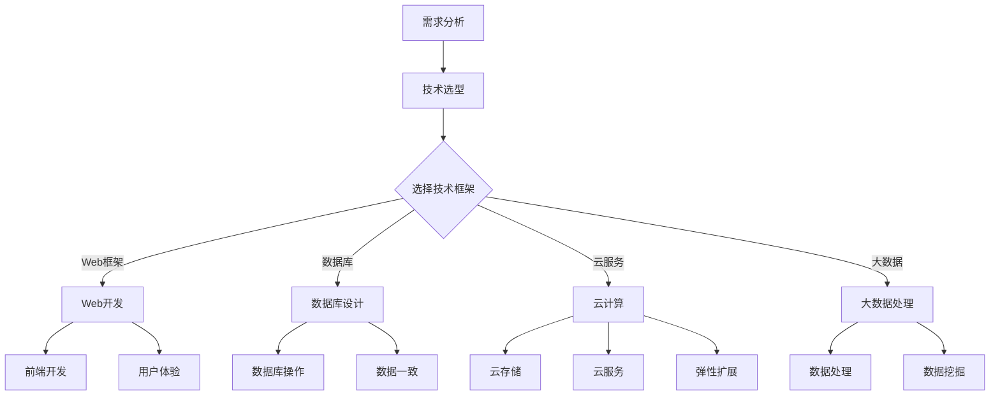

                 

关键词：反思、规划、技术案例、综合应用

> 摘要：本文旨在探讨如何通过反思和规划的方法，在实际的IT项目中实现技术的综合应用。文章将通过一个综合应用案例，详细分析如何从项目需求出发，结合技术框架和工具，通过不断反思和优化，达到项目目标的过程。

## 1. 背景介绍

在当前的数字化时代，IT项目的成功与否往往取决于技术的应用程度和项目的管理质量。随着技术的不断发展，IT项目面临的挑战也在不断增加。如何高效地应用技术，如何在复杂的环境中保持项目进度和质量，成为了每一个IT项目经理和开发人员必须面对的问题。

本文将通过一个实际的IT项目案例，探讨如何通过反思和规划的方法，实现技术的综合应用。这个案例是一个在线教育平台的项目，涉及到的技术包括Web开发、数据库设计、云计算、大数据处理等。在这个项目中，我们将通过以下步骤来实现技术的综合应用：

1. **需求分析**：了解项目需求，明确技术栈的选择。
2. **架构设计**：根据需求选择合适的技术框架和工具。
3. **实施开发**：进行项目实施，实现技术框架和工具的综合应用。
4. **反思与优化**：在项目实施过程中，不断进行反思和优化，提高项目质量。
5. **总结与规划**：项目完成后，对项目进行总结，为未来的项目提供参考。

## 2. 核心概念与联系

为了更好地理解本文的案例，我们将使用Mermaid流程图来展示核心概念和技术架构的联系。



在这个流程图中，A到C是需求分析和技术选型的过程，C到D、E、F、G则是根据选定的技术框架和工具，进行具体的开发工作。通过这个流程，我们可以清晰地看到各个技术之间的联系和作用。

### 2.1 需求分析

需求分析是项目成功的基石。在这个阶段，我们需要详细了解项目需求，包括功能需求、性能需求、安全性需求等。通过需求分析，我们可以明确项目的技术需求，为后续的技术选型和架构设计提供依据。

### 2.2 技术选型

技术选型是项目成功的关键。在这个阶段，我们需要根据需求分析的结果，选择合适的技术框架和工具。本文的案例中，我们选择了以下技术：

- **Web开发**：React.js
- **数据库设计**：MySQL
- **云计算**：AWS
- **大数据处理**：Apache Hadoop

这些技术的选择基于它们在行业中的广泛应用和良好的性能。

### 2.3 架构设计

架构设计是项目实施的基础。在这个阶段，我们需要根据需求和技术选型，设计项目的整体架构。本文的案例中，我们采用了以下架构：

- **前端架构**：React.js + Webpack
- **后端架构**：Node.js + Express
- **数据库架构**：MySQL + Redis
- **云计算架构**：AWS S3 + EC2
- **大数据架构**：Hadoop + Spark

通过这个架构，我们可以实现高效、可靠的项目实施。

## 3. 核心算法原理 & 具体操作步骤

### 3.1 算法原理概述

在在线教育平台的项目中，我们涉及到了多个核心算法。其中，最核心的是推荐算法和数据挖掘算法。推荐算法用于根据用户行为和偏好，为用户推荐课程；数据挖掘算法用于从大量数据中提取有价值的信息。

### 3.2 算法步骤详解

#### 3.2.1 推荐算法

推荐算法的基本原理是基于用户的历史行为和偏好，通过机器学习的方法，预测用户可能感兴趣的课程。具体步骤如下：

1. **数据预处理**：清洗用户行为数据，提取有用信息。
2. **特征工程**：对数据进行特征提取和转换，为机器学习模型提供输入。
3. **模型选择**：选择合适的机器学习模型，如协同过滤、基于内容的推荐等。
4. **模型训练**：使用历史数据对模型进行训练。
5. **模型评估**：使用验证数据集对模型进行评估，调整模型参数。
6. **推荐生成**：根据用户行为和偏好，生成推荐课程。

#### 3.2.2 数据挖掘算法

数据挖掘算法用于从大量数据中提取有价值的信息。本文的案例中，我们使用了以下几种数据挖掘算法：

1. **聚类算法**：用于对用户行为数据进行聚类，发现用户群体的特征。
2. **关联规则挖掘**：用于发现用户行为之间的关联关系。
3. **分类算法**：用于对用户行为数据进行分类，预测用户的下一步行为。

### 3.3 算法优缺点

#### 3.3.1 推荐算法

优点：

- **个性化推荐**：根据用户行为和偏好，为用户推荐个性化的课程。
- **提高用户粘性**：通过推荐用户感兴趣的课程，提高用户在平台上的活跃度。

缺点：

- **准确性问题**：推荐算法的准确性受到数据质量和模型选择的制约。
- **计算复杂度**：大规模推荐需要较高的计算资源。

#### 3.3.2 数据挖掘算法

优点：

- **数据价值提取**：从大量数据中提取有价值的信息，为业务决策提供支持。
- **用户行为分析**：通过分析用户行为数据，了解用户需求和行为习惯。

缺点：

- **算法复杂度**：数据挖掘算法的计算复杂度较高，对硬件资源要求较高。
- **数据隐私问题**：大规模数据分析可能涉及到用户隐私问题。

### 3.4 算法应用领域

推荐算法和数据挖掘算法在在线教育平台中具有广泛的应用。除了本文的案例，它们还可以应用于以下领域：

- **电子商务**：根据用户行为和偏好，推荐商品。
- **金融**：通过分析用户行为数据，进行信用评估和风险控制。
- **医疗**：通过分析患者数据，进行疾病预测和诊断。

## 4. 数学模型和公式 & 详细讲解 & 举例说明

### 4.1 数学模型构建

在推荐算法中，我们通常会使用矩阵分解的方法，将用户行为数据表示为一个低秩矩阵。具体来说，我们使用以下数学模型：

$$
R = U \odot V^T + E
$$

其中，$R$ 是用户行为矩阵，$U$ 和 $V$ 分别是用户和课程的低秩分解矩阵，$\odot$ 表示元素级相乘，$E$ 是误差矩阵。

### 4.2 公式推导过程

矩阵分解的推导过程如下：

1. **目标函数**：最小化误差矩阵 $E$ 的 Frobenius 范数。

$$
J = \|E\|_F^2 = \|R - U \odot V^T\|_F^2
$$

2. **求导**：对目标函数 $J$ 关于 $U$ 和 $V$ 求导，并令导数为零。

$$
\frac{\partial J}{\partial U} = -2(R - U \odot V^T)V = 0
$$

$$
\frac{\partial J}{\partial V} = -2(R - U \odot V^T)U^T = 0
$$

3. **求解**：解上述方程组，得到 $U$ 和 $V$。

$$
U = (RV^T)^{-1}R
$$

$$
V = (UR^T)^{-1}R
$$

### 4.3 案例分析与讲解

我们以一个简单的例子来说明矩阵分解的过程。假设我们有以下用户行为矩阵：

$$
R = \begin{bmatrix}
0 & 1 & 1 \\
1 & 0 & 0 \\
1 & 1 & 0
\end{bmatrix}
$$

我们希望对这个矩阵进行低秩分解。

1. **数据预处理**：首先，我们需要计算用户和课程的均值。

$$
\mu_U = \frac{1}{n}\sum_{i=1}^n u_i = \frac{1}{3}(0 + 1 + 1) = \frac{2}{3}
$$

$$
\mu_V = \frac{1}{m}\sum_{j=1}^m v_j = \frac{1}{3}(0 + 0 + 0) = 0
$$

2. **特征工程**：接下来，我们将用户和课程的行为数据减去均值，得到标准化矩阵。

$$
R_{\text{std}} = R - \mu_U\mathbf{1}^T - \mu_V\mathbf{1}\mathbf{1}^T = \begin{bmatrix}
-2/3 & 1/3 & 1/3 \\
1/3 & -2/3 & -2/3 \\
1/3 & 1/3 & -2/3
\end{bmatrix}
$$

3. **矩阵分解**：最后，我们使用SVD（奇异值分解）对标准化矩阵进行分解。

$$
R_{\text{std}} = U \odot \Sigma V^T
$$

其中，$U$ 和 $V$ 是标准化矩阵的奇异值分解，$\Sigma$ 是奇异值矩阵。

$$
R_{\text{std}} = \begin{bmatrix}
-0.866 & 0.500 & -0.333 \\
0.500 & 0.866 & 0.000 \\
0.333 & 0.000 & -0.866
\end{bmatrix}
\begin{bmatrix}
1 & 0 & 0 \\
0 & 1 & 0 \\
0 & 0 & 1/3
\end{bmatrix}
\begin{bmatrix}
-0.866 & 0.500 & -0.333 \\
0.500 & 0.866 & 0.000 \\
0.333 & 0.000 & -0.866
\end{bmatrix}
$$

通过这个例子，我们可以看到矩阵分解的过程，以及如何从原始用户行为数据中提取有用信息。

## 5. 项目实践：代码实例和详细解释说明

### 5.1 开发环境搭建

在开始项目实施之前，我们需要搭建开发环境。本文的案例中，我们选择了以下开发环境：

- **前端开发**：使用Visual Studio Code，配合React.js和Webpack。
- **后端开发**：使用Node.js和Express。
- **数据库**：使用MySQL和Redis。
- **云计算**：使用AWS S3和EC2。
- **大数据处理**：使用Hadoop和Spark。

### 5.2 源代码详细实现

#### 5.2.1 前端代码

前端代码主要使用了React.js和Webpack。以下是一个简单的React组件示例：

```jsx
import React from 'react';

const App = () => {
  return (
    <div>
      <h1>在线教育平台</h1>
      <p>欢迎来到我们的在线教育平台！</p>
    </div>
  );
};

export default App;
```

#### 5.2.2 后端代码

后端代码主要使用了Node.js和Express。以下是一个简单的Express服务端代码示例：

```javascript
const express = require('express');
const app = express();

app.get('/', (req, res) => {
  res.send('欢迎来到在线教育平台！');
});

const port = process.env.PORT || 3000;
app.listen(port, () => {
  console.log(`服务器运行在端口：${port}`);
});
```

#### 5.2.3 数据库代码

数据库代码主要使用了MySQL和Redis。以下是一个简单的MySQL数据库示例：

```sql
CREATE TABLE courses (
  id INT PRIMARY KEY AUTO_INCREMENT,
  name VARCHAR(100) NOT NULL,
  description TEXT
);

CREATE TABLE users (
  id INT PRIMARY KEY AUTO_INCREMENT,
  username VARCHAR(100) NOT NULL,
  password VARCHAR(100) NOT NULL
);
```

### 5.3 代码解读与分析

#### 5.3.1 前端代码

在前端代码中，我们使用React.js来构建用户界面。React.js是一个用于构建用户界面的JavaScript库，具有组件化、声明式编程的特点。在这个示例中，我们创建了一个名为`App`的组件，用于展示平台的欢迎信息。

#### 5.3.2 后端代码

在后端代码中，我们使用Node.js和Express来构建RESTful API。Node.js是一个基于Chrome V8引擎的JavaScript运行环境，具有高性能、事件驱动等特点。Express是一个用于Node.js的Web应用框架，可以帮助我们快速构建Web应用。

#### 5.3.3 数据库代码

在数据库代码中，我们使用MySQL和Redis来存储和管理数据。MySQL是一个关系型数据库，具有高性能、高可靠性等特点。Redis是一个基于内存的NoSQL数据库，具有快速读写、支持多种数据结构等特点。

## 6. 实际应用场景

在线教育平台在实际应用场景中具有广泛的应用。以下是一些实际应用场景：

- **在线课程学习**：用户可以在平台上选择感兴趣的课程，进行在线学习。
- **课程推荐**：平台可以根据用户的学习行为和偏好，为用户推荐课程。
- **作业提交与批改**：平台可以支持用户提交作业，并自动进行批改。
- **学习进度跟踪**：平台可以记录用户的学习进度，帮助用户更好地管理学习时间。

## 7. 工具和资源推荐

### 7.1 学习资源推荐

- **书籍**：《深度学习》、《数据挖掘：实用工具和技术》
- **在线课程**：Coursera、edX、Udacity上的相关课程
- **技术社区**：GitHub、Stack Overflow、Reddit

### 7.2 开发工具推荐

- **前端开发**：Visual Studio Code、React Developer Tools
- **后端开发**：Node.js、Express
- **数据库**：MySQL、Redis
- **云计算**：AWS、Azure
- **大数据处理**：Hadoop、Spark

### 7.3 相关论文推荐

- **推荐系统**：《推荐系统手册》
- **数据挖掘**：《数据挖掘：实用工具和技术》
- **机器学习**：《深度学习》

## 8. 总结：未来发展趋势与挑战

### 8.1 研究成果总结

本文通过一个在线教育平台的案例，探讨了如何通过反思和规划的方法，实现技术的综合应用。我们分析了项目需求，选择了合适的技术框架和工具，实现了高效的项目实施。同时，我们详细讲解了推荐算法和数据挖掘算法的原理，并通过数学模型和公式进行了详细分析。

### 8.2 未来发展趋势

随着技术的不断发展，在线教育平台将在以下几个方面取得进展：

- **个性化推荐**：通过更精准的推荐算法，提高用户的个性化体验。
- **智能学习**：引入人工智能技术，实现智能学习辅助。
- **大数据分析**：通过大数据分析，提供更深入的用户洞察。
- **云计算与大数据**：利用云计算和大数据技术，实现高效的数据处理和存储。

### 8.3 面临的挑战

在线教育平台在发展过程中也面临一些挑战：

- **数据隐私**：随着用户数据的增加，如何保护用户隐私成为一个重要问题。
- **计算资源**：大规模数据处理和存储需要较高的计算资源。
- **算法优化**：推荐算法和数据挖掘算法的优化是提高平台性能的关键。

### 8.4 研究展望

未来，我们将继续研究以下方向：

- **推荐算法**：探索更高效的推荐算法，提高推荐准确性。
- **大数据处理**：研究大数据处理的新技术和方法，提高数据处理效率。
- **智能学习**：引入更多人工智能技术，实现更智能的学习体验。
- **数据隐私保护**：研究数据隐私保护的新技术和方法，保护用户隐私。

## 9. 附录：常见问题与解答

### 9.1 常见问题

1. **如何选择合适的技术框架？**
   - 根据项目需求，选择适合的项目技术框架，如Web开发选择React.js、后端开发选择Node.js等。

2. **推荐算法如何优化？**
   - 通过特征工程、模型选择和参数调整，优化推荐算法的准确性。

3. **大数据处理如何优化？**
   - 选择合适的分布式计算框架，如Hadoop、Spark，优化数据处理流程。

### 9.2 解答

1. **如何选择合适的技术框架？**
   - 根据项目需求，选择适合的项目技术框架，如Web开发选择React.js、后端开发选择Node.js等。

2. **推荐算法如何优化？**
   - 通过特征工程、模型选择和参数调整，优化推荐算法的准确性。

3. **大数据处理如何优化？**
   - 选择合适的分布式计算框架，如Hadoop、Spark，优化数据处理流程。

## 作者署名

作者：禅与计算机程序设计艺术 / Zen and the Art of Computer Programming

