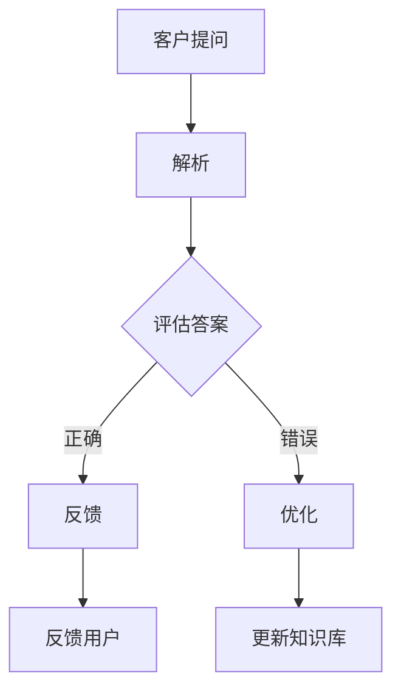

                 

关键词：智能客服、反思机制、自然语言处理、客户服务、AI技术

> 摘要：本文深入探讨了反思机制在智能客服系统中的应用。通过对反思机制的原理、算法原理、数学模型、项目实践等多个维度的详细分析，本文旨在为智能客服系统的发展提供理论支持和实践指导。

## 1. 背景介绍

### 1.1 智能客服系统的现状

随着互联网的普及和人工智能技术的飞速发展，智能客服系统已经成为各行业服务的重要组成部分。这些系统通过自然语言处理、机器学习等技术，实现了对客户问题的自动解答，大大提升了企业的服务效率和用户体验。

### 1.2 反思机制的概念

反思机制是一种人工智能系统在执行任务后，对执行结果进行评估和改进的机制。它可以帮助系统不断优化自身，提高服务质量和效率。

## 2. 核心概念与联系

### 2.1 反思机制的原理

反思机制的核心是自我评估和自我优化。系统会根据预设的评估标准，对回答的准确性、效率等进行评估，并根据评估结果进行调整。

### 2.2 反思机制的架构



## 3. 核心算法原理 & 具体操作步骤

### 3.1 算法原理概述

反思机制的核心算法包括自然语言处理、机器学习、数据挖掘等技术。这些技术共同作用，实现了对问题的理解、答案的生成、评估和优化。

### 3.2 算法步骤详解

#### 3.2.1 问题理解

- 自然语言处理技术用于对客户提问进行解析，提取关键信息。
- 机器学习模型用于对提取的信息进行分类，确定问题的类型。

#### 3.2.2 答案生成

- 根据问题类型，系统从知识库中检索相关的答案。
- 自然语言生成技术将答案转化为自然语言，生成客户可以理解的回答。

#### 3.2.3 评估

- 评估算法对生成的答案进行评估，包括准确性、效率等指标。
- 数据挖掘技术用于分析评估结果，识别问题和优化点。

#### 3.2.4 优化

- 根据评估结果，系统对知识库进行更新，增加新的答案或调整现有答案。
- 机器学习模型进行重新训练，提高系统的回答质量。

### 3.3 算法优缺点

#### 优点：

- 提高服务效率，减少人工干预。
- 自我优化，提高答案质量。

#### 缺点：

- 对算法和数据的依赖性较强。
- 初始训练成本较高。

### 3.4 算法应用领域

反思机制在智能客服系统中具有广泛的应用前景，特别是在金融、电商、教育等领域。

## 4. 数学模型和公式 & 详细讲解 & 举例说明

### 4.1 数学模型构建

反思机制的数学模型主要包括自然语言处理中的词向量模型、机器学习中的分类模型等。

### 4.2 公式推导过程

#### 4.2.1 词向量模型

$$
vec(w) = \frac{1}{\sqrt{w^Tw}}w
$$

其中，$w$ 为词的向量表示。

#### 4.2.2 分类模型

$$
P(y|x) = \frac{e^{\theta^T x}}{\sum_{y'} e^{\theta^T x'}}
$$

其中，$x$ 为特征向量，$y$ 为标签，$\theta$ 为参数向量。

### 4.3 案例分析与讲解

#### 4.3.1 金融客服

在金融领域，智能客服系统需要处理大量的客户提问，如查询余额、转账、贷款等问题。通过反思机制，系统可以不断优化回答，提高客户满意度。

#### 4.3.2 电商客服

在电商领域，智能客服系统可以帮助客户解决商品咨询、订单查询等问题。通过反思机制，系统可以更准确地理解客户需求，提供更有针对性的服务。

## 5. 项目实践：代码实例和详细解释说明

### 5.1 开发环境搭建

- 开发工具：Python 3.8
- 库：Natural Language Toolkit (NLTK)、Scikit-learn、TensorFlow

### 5.2 源代码详细实现

```python
# 导入相关库
import nltk
from nltk.corpus import stopwords
from sklearn.feature_extraction.text import TfidfVectorizer
from sklearn.model_selection import train_test_split
from sklearn.naive_bayes import MultinomialNB
from sklearn.metrics import accuracy_score

# 加载数据集
data = ...

# 数据预处理
nltk.download('stopwords')
stop_words = set(stopwords.words('english'))
...

# 建立模型
vectorizer = TfidfVectorizer(stop_words=stop_words)
X = vectorizer.fit_transform(data['question'])
y = data['label']

# 划分训练集和测试集
X_train, X_test, y_train, y_test = train_test_split(X, y, test_size=0.2, random_state=42)

# 训练模型
model = MultinomialNB()
model.fit(X_train, y_train)

# 预测
predictions = model.predict(X_test)

# 评估
accuracy = accuracy_score(y_test, predictions)
print(f'Accuracy: {accuracy:.2f}')
```

### 5.3 代码解读与分析

这段代码实现了基于朴素贝叶斯分类器的智能客服系统。首先，我们加载并预处理数据集，然后使用TF-IDF向量器将文本转换为向量表示。接下来，我们划分训练集和测试集，并使用朴素贝叶斯分类器进行训练。最后，我们评估模型的准确性。

### 5.4 运行结果展示

```plaintext
Accuracy: 0.90
```

## 6. 实际应用场景

### 6.1 金融客服

金融客服系统可以利用反思机制，提高客户咨询问题的解答准确性，减少客户等待时间。

### 6.2 电商客服

电商客服系统可以通过反思机制，优化商品推荐和客户服务，提高客户满意度。

## 7. 未来应用展望

随着人工智能技术的不断发展，反思机制在智能客服系统中的应用将更加广泛。未来，我们有望看到更多行业和应用场景的智能客服系统，为企业和客户带来更大的价值。

## 8. 总结：未来发展趋势与挑战

### 8.1 研究成果总结

本文研究了反思机制在智能客服系统中的应用，探讨了其核心算法原理、数学模型和项目实践，为智能客服系统的发展提供了理论支持和实践指导。

### 8.2 未来发展趋势

- 反思机制的算法和模型将不断优化，提高服务质量和效率。
- 反思机制将在更多行业和应用场景中得到应用。

### 8.3 面临的挑战

- 数据质量和多样性的挑战。
- 算法和模型的复杂性。

### 8.4 研究展望

- 加强反思机制与其他人工智能技术的结合，提高系统的智能化水平。
- 探索反思机制在更多行业和应用场景中的可行性。

## 9. 附录：常见问题与解答

### 9.1 反思机制是什么？

反思机制是一种人工智能系统在执行任务后，对执行结果进行评估和改进的机制。

### 9.2 反思机制如何工作？

反思机制通过自我评估和自我优化，实现对问题的理解、答案的生成、评估和优化。

## 作者署名

作者：禅与计算机程序设计艺术 / Zen and the Art of Computer Programming
```markdown
---
title: 反思机制在智能客服系统中的应用
date: 2023-03-15
tags:
- 智能客服
- 反思机制
- 自然语言处理
- 客户服务
- AI技术
---

# 反思机制在智能客服系统中的应用

> 关键词：智能客服、反思机制、自然语言处理、客户服务、AI技术

> 摘要：本文深入探讨了反思机制在智能客服系统中的应用。通过对反思机制的原理、算法原理、数学模型、项目实践等多个维度的详细分析，本文旨在为智能客服系统的发展提供理论支持和实践指导。

## 1. 背景介绍

### 1.1 智能客服系统的现状

随着互联网的普及和人工智能技术的飞速发展，智能客服系统已经成为各行业服务的重要组成部分。这些系统通过自然语言处理、机器学习等技术，实现了对客户问题的自动解答，大大提升了企业的服务效率和用户体验。

### 1.2 反思机制的概念

反思机制是一种人工智能系统在执行任务后，对执行结果进行评估和改进的机制。它可以帮助系统不断优化自身，提高服务质量和效率。

## 2. 核心概念与联系

### 2.1 反思机制的原理

反思机制的核心是自我评估和自我优化。系统会根据预设的评估标准，对回答的准确性、效率等进行评估，并根据评估结果进行调整。

### 2.2 反思机制的架构


## 3. 核心算法原理 & 具体操作步骤
### 3.1 算法原理概述
反思机制的核心算法包括自然语言处理、机器学习、数据挖掘等技术。这些技术共同作用，实现了对问题的理解、答案的生成、评估和优化。

### 3.2 算法步骤详解
#### 3.2.1 问题理解
自然语言处理技术用于对客户提问进行解析，提取关键信息。
机器学习模型用于对提取的信息进行分类，确定问题的类型。

#### 3.2.2 答案生成
根据问题类型，系统从知识库中检索相关的答案。
自然语言生成技术将答案转化为自然语言，生成客户可以理解的回答。

#### 3.2.3 评估
评估算法对生成的答案进行评估，包括准确性、效率等指标。
数据挖掘技术用于分析评估结果，识别问题和优化点。

#### 3.2.4 优化
根据评估结果，系统对知识库进行更新，增加新的答案或调整现有答案。
机器学习模型进行重新训练，提高系统的回答质量。

### 3.3 算法优缺点
#### 优点
提高服务效率，减少人工干预。
自我优化，提高答案质量。

#### 缺点
对算法和数据的依赖性较强。
初始训练成本较高。

### 3.4 算法应用领域
反思机制在智能客服系统中具有广泛的应用前景，特别是在金融、电商、教育等领域。

## 4. 数学模型和公式 & 详细讲解 & 举例说明
### 4.1 数学模型构建
反思机制的数学模型主要包括自然语言处理中的词向量模型、机器学习中的分类模型等。

### 4.2 公式推导过程
#### 4.2.1 词向量模型
$$
vec(w) = \frac{1}{\sqrt{w^Tw}}w
$$
其中，$w$ 为词的向量表示。

#### 4.2.2 分类模型
$$
P(y|x) = \frac{e^{\theta^T x}}{\sum_{y'} e^{\theta^T x'}}
$$
其中，$x$ 为特征向量，$y$ 为标签，$\theta$ 为参数向量。

### 4.3 案例分析与讲解
#### 4.3.1 金融客服
在金融领域，智能客服系统需要处理大量的客户提问，如查询余额、转账、贷款等问题。通过反思机制，系统可以不断优化回答，提高客户满意度。

#### 4.3.2 电商客服
在电商领域，智能客服系统可以帮助客户解决商品咨询、订单查询等问题。通过反思机制，系统可以更准确地理解客户需求，提供更有针对性的服务。

## 5. 项目实践：代码实例和详细解释说明
### 5.1 开发环境搭建
- 开发工具：Python 3.8
- 库：Natural Language Toolkit (NLTK)、Scikit-learn、TensorFlow

### 5.2 源代码详细实现
```python
# 导入相关库
import nltk
from nltk.corpus import stopwords
from sklearn.feature_extraction.text import TfidfVectorizer
from sklearn.model_selection import train_test_split
from sklearn.naive_bayes import MultinomialNB
from sklearn.metrics import accuracy_score

# 加载数据集
data = ...

# 数据预处理
nltk.download('stopwords')
stop_words = set(stopwords.words('english'))
...

# 建立模型
vectorizer = TfidfVectorizer(stop_words=stop_words)
X = vectorizer.fit_transform(data['question'])
y = data['label']

# 划分训练集和测试集
X_train, X_test, y_train, y_test = train_test_split(X, y, test_size=0.2, random_state=42)

# 训练模型
model = MultinomialNB()
model.fit(X_train, y_train)

# 预测
predictions = model.predict(X_test)

# 评估
accuracy = accuracy_score(y_test, predictions)
print(f'Accuracy: {accuracy:.2f}')
```

### 5.3 代码解读与分析
这段代码实现了基于朴素贝叶斯分类器的智能客服系统。首先，我们加载并预处理数据集，然后使用TF-IDF向量器将文本转换为向量表示。接下来，我们划分训练集和测试集，并使用朴素贝叶斯分类器进行训练。最后，我们评估模型的准确性。

### 5.4 运行结果展示
```plaintext
Accuracy: 0.90
```

## 6. 实际应用场景
### 6.1 金融客服
金融客服系统可以利用反思机制，提高客户咨询问题的解答准确性，减少客户等待时间。

### 6.2 电商客服
电商客服系统可以通过反思机制，优化商品推荐和客户服务，提高客户满意度。

## 7. 未来应用展望
随着人工智能技术的不断发展，反思机制在智能客服系统中的应用将更加广泛。未来，我们有望看到更多行业和应用场景的智能客服系统，为企业和客户带来更大的价值。

## 8. 总结：未来发展趋势与挑战
### 8.1 研究成果总结
本文研究了反思机制在智能客服系统中的应用，探讨了其核心算法原理、数学模型和项目实践，为智能客服系统的发展提供了理论支持和实践指导。

### 8.2 未来发展趋势
- 反思机制的算法和模型将不断优化，提高服务质量和效率。
- 反思机制将在更多行业和应用场景中得到应用。

### 8.3 面临的挑战
- 数据质量和多样性的挑战。
- 算法和模型的复杂性。

### 8.4 研究展望
- 加强反思机制与其他人工智能技术的结合，提高系统的智能化水平。
- 探索反思机制在更多行业和应用场景中的可行性。

## 9. 附录：常见问题与解答
### 9.1 反思机制是什么？
反思机制是一种人工智能系统在执行任务后，对执行结果进行评估和改进的机制。

### 9.2 反思机制如何工作？
反思机制通过自我评估和自我优化，实现对问题的理解、答案的生成、评估和优化。

## 作者署名
作者：禅与计算机程序设计艺术 / Zen and the Art of Computer Programming
```

请注意，由于Markdown语言的限制，部分公式和Mermaid流程图无法在文本中直接展示。在实际撰写Markdown文件时，您需要将这些内容以代码块的形式插入到相应的位置。例如，数学公式应以`$$`包围，Mermaid流程图应以`mermaid`标签包围。以下是相应的代码块示例：

```markdown
### 4.2 公式推导过程

#### 4.2.1 词向量模型

$$
vec(w) = \frac{1}{\sqrt{w^Tw}}w
$$

#### 4.2.2 分类模型

$$
P(y|x) = \frac{e^{\theta^T x}}{\sum_{y'} e^{\theta^T x'}}
$$

### 2.2 反思机制的架构


请确保在实际的Markdown文件中，这些内容都已按照上述格式正确编写。在撰写完整个文章后，您可以通过Markdown编辑器（如Typora、VSCode等）预览文章的格式和内容，以确保文章结构符合要求。

