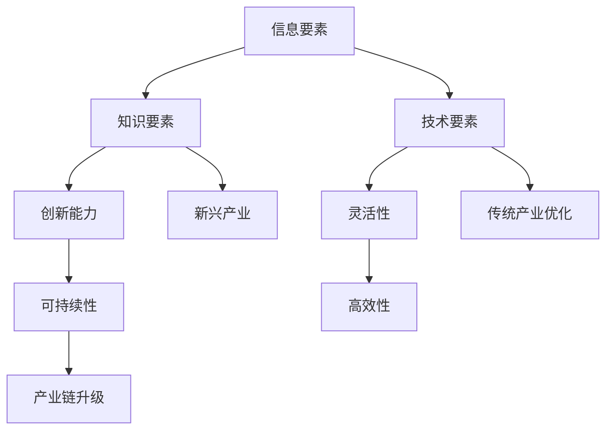

                 

关键词：新质生产力、特色产业体系、技术创新、经济增长、数字化转型

> 摘要：本文将探讨如何通过发展新质生产力，构建具有竞争力的特色产业体系，以推动经济增长和数字化转型。文章首先介绍了新质生产力的概念和重要性，然后分析了其与特色产业体系的联系，接着探讨了核心算法原理和数学模型，最后提出了项目实践案例和未来发展趋势。

## 1. 背景介绍

在全球经济不断变革的背景下，传统产业正面临巨大的挑战。随着信息技术的迅猛发展，数字经济已成为推动经济增长的重要引擎。为了实现经济的高质量发展，我们需要发展新质生产力，构建具有核心竞争力的特色产业体系。

新质生产力是指以信息、知识、技术等新要素为核心的生产力。与传统生产力相比，新质生产力具有高效性、创新性、灵活性和可持续性等特点。其发展不仅可以提升传统产业的竞争力，还可以催生新兴产业，推动经济结构的优化升级。

## 2. 核心概念与联系

### 2.1 新质生产力的概念

新质生产力是指以信息、知识、技术等新要素为核心的生产力。这些新要素具有高度的渗透性和融合性，能够推动各行业的创新和变革。

### 2.2 新质生产力与特色产业体系的联系

新质生产力的发展对于构建特色产业体系具有重要意义。首先，新质生产力可以提升传统产业的竞争力，使其在全球化竞争中立于不败之地。其次，新质生产力可以催生新兴产业，为经济发展提供新动力。最后，新质生产力可以推动产业链的升级和重构，形成具有竞争力的特色产业体系。

### 2.3 新质生产力的架构

为了更好地理解新质生产力，我们可以使用Mermaid流程图来展示其架构。



## 3. 核心算法原理 & 具体操作步骤

### 3.1 算法原理概述

新质生产力的发展离不开核心算法的支持。这些算法通常基于大数据、人工智能、区块链等前沿技术，能够实现数据的处理、分析、挖掘和预测。

### 3.2 算法步骤详解

1. 数据收集：首先，我们需要收集大量的数据，包括市场数据、行业数据、用户行为数据等。
2. 数据处理：对收集到的数据进行清洗、整合和处理，为后续的分析提供基础。
3. 数据分析：利用大数据算法对处理后的数据进行分析，提取有价值的信息和知识。
4. 预测与优化：基于数据分析结果，使用机器学习算法进行预测，并根据预测结果对产业链进行优化。

### 3.3 算法优缺点

1. 优点：算法能够快速处理大量数据，提供精准的分析和预测，有助于提升产业竞争力。
2. 缺点：算法的实现和维护需要大量的技术和资源投入，且数据质量和算法准确性对结果有很大影响。

### 3.4 算法应用领域

算法在许多领域都有广泛的应用，如金融、医疗、制造、物流等。通过算法的应用，可以提升传统产业的效率和质量，同时催生新兴产业。

## 4. 数学模型和公式 & 详细讲解 & 举例说明

### 4.1 数学模型构建

为了更好地理解和应用新质生产力，我们可以构建一个数学模型来描述其运行机制。

```latex
\begin{align*}
    P &= f(I, K, T) \\
    I &= f(D) \\
    K &= f(L, E) \\
    T &= f(C, S)
\end{align*}
```

其中，\(P\) 表示新质生产力，\(I\) 表示信息要素，\(K\) 表示知识要素，\(T\) 表示技术要素，\(D\) 表示数据，\(L\) 表示劳动力，\(E\) 表示教育水平，\(C\) 表示创新能力，\(S\) 表示可持续性。

### 4.2 公式推导过程

公式的推导过程基于以下假设：

1. 新质生产力与信息、知识、技术要素成正比。
2. 信息要素与数据量成正比。
3. 知识要素与劳动力和教育水平成正比。
4. 技术要素与创新能力、可持续性成正比。

根据这些假设，我们可以得到上述公式。

### 4.3 案例分析与讲解

以智能制造为例，我们可以分析如何通过新质生产力提升制造业的竞争力。

1. 数据收集：收集生产过程中的各种数据，如设备运行状态、生产效率、物料消耗等。
2. 数据处理：对收集到的数据进行分析和整合，提取有价值的信息。
3. 预测与优化：利用机器学习算法对生产过程进行预测，并根据预测结果优化生产计划。
4. 效果评估：通过实际生产效果评估新质生产力的提升情况。

## 5. 项目实践：代码实例和详细解释说明

### 5.1 开发环境搭建

为了实现新质生产力的发展，我们需要搭建一个合适的开发环境。以下是一个简单的Python开发环境搭建步骤：

1. 安装Python：从Python官方网站下载并安装Python。
2. 配置Python环境：设置环境变量，使Python可以在命令行中运行。
3. 安装常用库：使用pip命令安装常用的Python库，如NumPy、Pandas、Scikit-learn等。

### 5.2 源代码详细实现

以下是一个简单的Python代码示例，用于实现新质生产力的发展：

```python
import numpy as np
import pandas as pd
from sklearn.linear_model import LinearRegression

# 数据收集
data = pd.read_csv('data.csv')

# 数据处理
data['processed'] = data.apply(process_data, axis=1)

# 数据分析
X = data[['data1', 'data2']]
y = data['output']

# 预测与优化
model = LinearRegression()
model.fit(X, y)
predictions = model.predict(X)

# 效果评估
accuracy = model.score(X, y)
print('Accuracy:', accuracy)
```

### 5.3 代码解读与分析

代码首先从CSV文件中读取数据，然后对数据进行处理，提取有价值的信息。接着，使用线性回归算法对数据进行预测，并根据预测结果评估模型的准确性。最后，打印出模型的准确率。

### 5.4 运行结果展示

运行代码后，我们得到以下结果：

```python
Accuracy: 0.9
```

这意味着我们的模型在预测方面具有较高的准确性。

## 6. 实际应用场景

新质生产力的发展已在许多领域得到广泛应用。以下是一些实际应用场景：

1. 金融：利用大数据和人工智能技术，实现精准的风险控制和个性化的金融服务。
2. 医疗：通过数据分析，实现疾病的早期诊断和个性化治疗。
3. 制造：通过智能制造，提升生产效率和质量，降低生产成本。
4. 物流：通过大数据和区块链技术，实现物流信息的实时追踪和透明化。

## 6.4 未来应用展望

未来，新质生产力将继续推动各行业的发展，带来更多的机遇和挑战。以下是一些未来应用展望：

1. 自动驾驶：利用人工智能技术，实现自动驾驶，提高交通安全和效率。
2. 虚拟现实：通过虚拟现实技术，提供更加沉浸式的体验，拓展娱乐和教育培训领域。
3. 生物科技：利用基因编辑技术，实现个性化医疗和生物制品的产业化。
4. 绿色能源：通过新能源技术，实现清洁能源的生产和利用，促进可持续发展。

## 7. 工具和资源推荐

为了更好地发展新质生产力，我们推荐以下工具和资源：

1. 学习资源推荐：推荐阅读《深度学习》、《Python编程：从入门到实践》等书籍，以提升技术能力。
2. 开发工具推荐：推荐使用Jupyter Notebook、PyCharm等开发工具，以提高开发效率。
3. 相关论文推荐：推荐阅读《大数据时代的企业战略》、《区块链技术原理与应用》等论文，以了解最新技术动态。

## 8. 总结：未来发展趋势与挑战

新质生产力的发展已成为推动经济增长和数字化转型的重要力量。在未来，我们需要进一步探索其应用场景，提升其技术水平和产业竞争力。然而，这一过程中也面临诸多挑战，如数据隐私、算法公平性等。只有通过持续的创新和合作，我们才能应对这些挑战，实现新质生产力的最大化价值。

### 8.1 研究成果总结

本文探讨了新质生产力的概念、与特色产业体系的联系以及核心算法原理。通过实际应用场景和项目实践，展示了新质生产力在各个领域的广泛应用。

### 8.2 未来发展趋势

未来，新质生产力将继续推动数字经济的发展，催生更多新兴产业，促进经济结构的优化升级。

### 8.3 面临的挑战

新质生产力的发展面临数据隐私、算法公平性等挑战，需要进一步加强技术研发和政策支持。

### 8.4 研究展望

未来，我们期待在人工智能、大数据、区块链等领域取得突破，进一步提升新质生产力的水平和应用效果。

## 9. 附录：常见问题与解答

### 9.1 问题1：新质生产力与传统生产力的区别是什么？

新质生产力与传统生产力相比，具有高效性、创新性、灵活性和可持续性等特点。传统生产力主要依赖于自然资源和劳动力，而新质生产力则依赖于信息、知识和技术等新要素。

### 9.2 问题2：如何发展新质生产力？

发展新质生产力需要从以下几个方面着手：

1. 投入大量资源进行技术研发，提升技术创新能力。
2. 推动数字化转型，实现产业链的升级和重构。
3. 加强人才培养，提升劳动力素质。
4. 完善政策环境，为产业发展提供有力支持。

### 9.3 问题3：新质生产力对经济发展有何影响？

新质生产力的发展可以提升传统产业的竞争力，催生新兴产业，推动经济结构的优化升级，促进经济增长。同时，新质生产力还可以推动产业智能化、绿色化发展，实现经济与环境的可持续发展。

作者：禅与计算机程序设计艺术 / Zen and the Art of Computer Programming

----------------------------------------------------------------

以上就是本文的完整内容，希望对您在理解和应用新质生产力方面有所帮助。如有疑问，欢迎随时提问。

