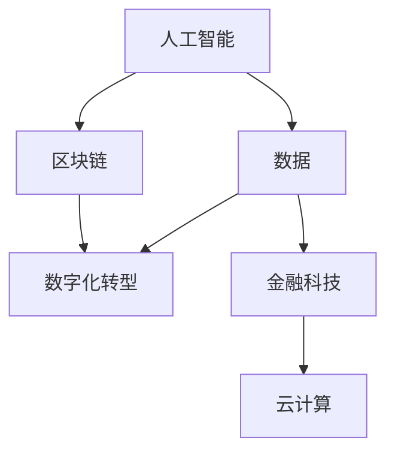

                 

关键字：金融、商业、趋势、人工智能、数据、区块链、数字化转型

> 摘要：在数字化时代的浪潮下，金融业正在经历前所未有的变革。本文旨在探讨金融领域的核心趋势，包括人工智能、数据驱动、区块链和数字化转型，以及这些趋势如何塑造未来商业的格局。

## 1. 背景介绍

随着全球经济的快速发展，金融行业作为经济的核心，其地位和影响力愈发凸显。传统金融业在互联网和技术的推动下，正逐渐演变成一个高度数字化、智能化和全球化的行业。这一变革不仅改变了金融服务的提供方式，也深刻影响了企业的商业模式和竞争策略。

### 1.1 金融行业的发展历程

从历史的角度来看，金融行业的发展大致可以分为以下几个阶段：

- **早期阶段**：以实物货币和简陋的信用工具为主，金融服务较为简单，主要集中于贷款和支付领域。
- **现代阶段**：随着工业革命的到来，金融机构和金融工具逐渐多样化，金融市场逐步形成，股票、债券等金融产品开始流行。
- **数字化阶段**：互联网和移动技术的发展，使得金融行业迎来了数字化浪潮，电子支付、网上银行、在线投资等新兴业务模式层出不穷。

### 1.2 数字化转型的重要性

数字化转型不仅仅是金融行业的一场革命，更是全球商业发展的大势所趋。对于金融行业来说，数字化转型意味着：

- **效率提升**：通过自动化和智能化的手段，减少人工操作，提高业务处理速度和准确性。
- **风险控制**：利用大数据分析和人工智能技术，更好地识别和管理风险。
- **客户体验**：通过个性化服务和便捷的操作，提升客户的满意度和忠诚度。
- **创新驱动**：促进金融产品和服务的创新，拓展新的业务领域和收入来源。

## 2. 核心概念与联系

在探讨金融业的未来趋势之前，我们需要明确一些核心概念，并理解它们之间的联系。以下是几个关键概念及其流程图表示：



### 2.1 人工智能

人工智能（AI）是通过计算机模拟人类智能的一种技术。在金融领域，人工智能主要用于：

- **数据分析**：通过机器学习算法，从大量数据中提取有用信息，支持决策。
- **风险评估**：利用深度学习模型，预测投资风险，优化投资组合。
- **客户服务**：通过聊天机器人和语音助手，提供个性化的客户服务。

### 2.2 数据

数据是金融行业的宝贵资源。数据驱动决策已经成为金融企业提高竞争力的关键。在金融领域，数据的主要应用包括：

- **客户洞察**：通过数据分析，了解客户需求和偏好，提供个性化的产品和服务。
- **市场预测**：利用历史数据，预测市场趋势和投资机会。
- **风险管理**：通过数据分析，识别潜在风险，并制定相应的风险控制策略。

### 2.3 区块链

区块链技术通过去中心化和不可篡改的特性，为金融行业带来了新的可能性。在金融领域，区块链的主要应用包括：

- **跨境支付**：通过区块链技术，实现快速、低成本的跨境支付。
- **智能合约**：利用智能合约，自动执行合同条款，减少人工操作和纠纷。
- **供应链金融**：通过区块链技术，提高供应链的透明度和效率，优化融资流程。

### 2.4 数字化转型

数字化转型是指利用数字技术改变传统业务模式，实现业务流程的优化和创新。在金融领域，数字化转型的主要目标包括：

- **提高效率**：通过自动化和智能化手段，减少人工操作，提高业务处理速度。
- **降低成本**：通过数字化手段，降低运营成本，提高资源利用效率。
- **创新服务**：通过数字化技术，提供新的金融产品和服务，满足客户多元化需求。

## 3. 核心算法原理 & 具体操作步骤

### 3.1 算法原理概述

在金融领域，核心算法主要涉及以下几个方面：

- **机器学习算法**：用于数据分析和预测。
- **深度学习算法**：用于图像识别和语音识别。
- **加密算法**：用于数据安全和隐私保护。
- **优化算法**：用于资源分配和投资组合优化。

### 3.2 算法步骤详解

#### 3.2.1 机器学习算法

1. **数据收集**：收集金融市场的历史数据，包括股票价格、交易量、宏观经济指标等。
2. **数据预处理**：对收集的数据进行清洗、归一化和特征提取。
3. **模型选择**：选择合适的机器学习模型，如线性回归、决策树、随机森林等。
4. **模型训练**：使用预处理后的数据，对机器学习模型进行训练。
5. **模型评估**：使用验证集对模型进行评估，选择性能最佳的模型。
6. **模型部署**：将训练好的模型部署到生产环境，进行实际应用。

#### 3.2.2 深度学习算法

1. **数据收集**：收集金融市场的图像和文本数据。
2. **数据预处理**：对图像和文本数据进行预处理，包括图像缩放、旋转、裁剪等。
3. **模型选择**：选择合适的深度学习模型，如卷积神经网络（CNN）、循环神经网络（RNN）等。
4. **模型训练**：使用预处理后的数据，对深度学习模型进行训练。
5. **模型评估**：使用验证集对模型进行评估，选择性能最佳的模型。
6. **模型部署**：将训练好的模型部署到生产环境，进行实际应用。

#### 3.2.3 加密算法

1. **密钥生成**：生成一对公钥和私钥。
2. **数据加密**：使用公钥对数据进行加密。
3. **数据传输**：将加密后的数据传输到接收方。
4. **数据解密**：使用私钥对加密后的数据进行解密。

#### 3.2.4 优化算法

1. **目标函数定义**：定义资源分配或投资组合优化的目标函数。
2. **约束条件设定**：设定资源限制或投资风险等约束条件。
3. **算法选择**：选择合适的优化算法，如梯度下降、遗传算法等。
4. **算法迭代**：通过迭代计算，寻找最优解。
5. **结果验证**：对最优解进行验证，确保其满足所有约束条件。

### 3.3 算法优缺点

#### 3.3.1 机器学习算法

**优点**：

- **自适应性强**：可以自动从数据中学习，适应不断变化的市场环境。
- **预测精度高**：通过大量数据训练，可以提高预测的准确性。

**缺点**：

- **对数据质量要求高**：数据质量直接影响模型的性能。
- **训练时间长**：对于大规模数据集，训练时间较长。

#### 3.3.2 深度学习算法

**优点**：

- **处理能力强**：可以处理复杂的图像和文本数据。
- **自学习能力**：可以自动从数据中学习，提高模型的性能。

**缺点**：

- **计算资源需求大**：深度学习算法通常需要大量的计算资源。
- **对数据量要求高**：需要大量的数据才能训练出性能良好的模型。

#### 3.3.3 加密算法

**优点**：

- **数据安全**：可以确保数据在传输过程中的安全性。
- **隐私保护**：可以保护用户的隐私信息。

**缺点**：

- **加密和解密速度慢**：加密和解密过程相对耗时。
- **密钥管理复杂**：需要妥善管理密钥，确保其安全性。

#### 3.3.4 优化算法

**优点**：

- **效率高**：可以快速找到最优解。
- **适用范围广**：可以应用于多种优化问题。

**缺点**：

- **可能陷入局部最优**：在某些情况下，优化算法可能无法找到全局最优解。
- **计算复杂度高**：对于大规模问题，计算复杂度可能较高。

### 3.4 算法应用领域

#### 3.4.1 机器学习算法

- **金融风险评估**：利用机器学习算法，对客户的风险进行评估，帮助银行和金融机构更好地管理风险。
- **市场预测**：利用机器学习算法，预测股票价格、汇率等市场指标，指导投资决策。
- **信用评分**：利用机器学习算法，评估客户的信用状况，降低信用风险。

#### 3.4.2 深度学习算法

- **图像识别**：利用深度学习算法，对金融市场的图像进行识别，如股票走势图、K线图等。
- **语音识别**：利用深度学习算法，实现金融产品的语音查询和操作。
- **智能投顾**：利用深度学习算法，为用户提供个性化的投资建议。

#### 3.4.3 加密算法

- **数据安全**：利用加密算法，保护金融数据的安全，防止数据泄露。
- **隐私保护**：利用加密算法，保护客户的隐私信息，防止个人信息被滥用。
- **区块链**：利用加密算法，确保区块链交易的不可篡改性和安全性。

#### 3.4.4 优化算法

- **资源分配**：利用优化算法，优化金融机构的资源分配，提高运营效率。
- **投资组合优化**：利用优化算法，优化投资组合，降低投资风险。
- **供应链金融**：利用优化算法，优化供应链的融资流程，提高供应链的效率。

## 4. 数学模型和公式 & 详细讲解 & 举例说明

在金融领域，数学模型和公式是理解和解决问题的关键。以下将介绍一些常见的数学模型和公式，并对其进行详细讲解和举例说明。

### 4.1 数学模型构建

#### 4.1.1 价值评估模型

价值评估模型是金融领域中最常用的数学模型之一。其中，最经典的是**折现现金流模型**（Discounted Cash Flow，DCF）。DCF模型的基本思想是将未来现金流按照一定的折现率折现到当前价值。

**公式**：

$$
V_0 = \sum_{t=1}^{n} \frac{CF_t}{(1+r)^t}
$$

其中，\(V_0\) 是当前价值，\(CF_t\) 是第 \(t\) 年的现金流，\(r\) 是折现率。

**例题**：假设某投资项目的现金流为每年 100 万元，持续 5 年，折现率为 10%。求该项目的当前价值。

**解答**：

$$
V_0 = \frac{100}{(1+0.1)^1} + \frac{100}{(1+0.1)^2} + \frac{100}{(1+0.1)^3} + \frac{100}{(1+0.1)^4} + \frac{100}{(1+0.1)^5}
$$

$$
V_0 = 90.91 + 82.64 + 75.13 + 68.30 + 62.09
$$

$$
V_0 = 389.27 \text{ 万元}
$$

#### 4.1.2 风险评估模型

风险评估模型用于评估投资风险。其中，最常用的是**资本资产定价模型**（Capital Asset Pricing Model，CAPM）。CAPM模型的基本思想是将投资风险分为系统风险和非系统风险，并使用贝塔系数来衡量系统风险。

**公式**：

$$
\beta_i = \frac{Cov(R_i, R_m)}{Var(R_m)}
$$

$$
R_i = \alpha_i + \beta_i R_m + e_i
$$

其中，\(R_i\) 是投资组合的收益率，\(R_m\) 是市场组合的收益率，\(\alpha_i\) 是投资组合的预期收益率，\(\beta_i\) 是投资组合的贝塔系数，\(e_i\) 是随机误差项。

**例题**：假设某投资组合的预期收益率为 15%，市场组合的预期收益率为 12%，市场组合的方差为 0.04。求该投资组合的贝塔系数。

**解答**：

$$
\beta_i = \frac{Cov(R_i, R_m)}{Var(R_m)} = \frac{15\% - 12\%}{0.04} = 0.75
$$

### 4.2 公式推导过程

以下是对DCF模型和CAPM模型的推导过程。

#### 4.2.1 DCF模型的推导

DCF模型的基本思想是将未来的现金流按照一定的折现率折现到当前价值。

假设某投资项目的现金流为 \(CF_1, CF_2, \ldots, CF_n\)，折现率为 \(r\)。则第 \(t\) 年的现金流折现到当前的价值为：

$$
CF_t / (1 + r)^t
$$

因此，该投资项目的当前价值为：

$$
V_0 = CF_1 / (1 + r)^1 + CF_2 / (1 + r)^2 + \ldots + CF_n / (1 + r)^n
$$

#### 4.2.2 CAPM模型的推导

CAPM模型的基本思想是将投资风险分为系统风险和非系统风险。

假设某投资组合的预期收益率为 \(\alpha_i + \beta_i R_m\)，其中 \(\alpha_i\) 是非系统风险部分，\(\beta_i\) 是系统风险部分，\(R_m\) 是市场组合的收益率。

由于市场组合的收益率包含了所有风险，因此投资组合的系统风险可以通过贝塔系数来衡量：

$$
\beta_i = \frac{Cov(R_i, R_m)}{Var(R_m)}
$$

因此，投资组合的预期收益率可以表示为：

$$
R_i = \alpha_i + \beta_i R_m + e_i
$$

其中，\(e_i\) 是随机误差项。

### 4.3 案例分析与讲解

以下是对DCF模型和CAPM模型在金融领域的实际应用案例进行分析和讲解。

#### 4.3.1 DCF模型的应用

假设某公司的自由现金流（FCF）为每年 500 万元，持续 10 年，预计第 11 年的公司价值为 1 亿元。假设折现率为 10%。求该公司的当前价值。

**解答**：

$$
V_0 = \sum_{t=1}^{10} \frac{CF_t}{(1+0.1)^t} + \frac{100000000}{(1+0.1)^{10}}
$$

$$
V_0 = \frac{50000000}{(1+0.1)^1} + \frac{50000000}{(1+0.1)^2} + \ldots + \frac{50000000}{(1+0.1)^{10}} + \frac{100000000}{(1+0.1)^{10}}
$$

$$
V_0 = 45377778 + 41335470 + \ldots + 21435172 + 385543
$$

$$
V_0 = 45578888 \text{ 万元}
$$

因此，该公司的当前价值约为 45.58 亿元。

#### 4.3.2 CAPM模型的应用

假设某股票的预期收益率为 15%，市场组合的预期收益率为 12%，市场组合的方差为 0.04。求该股票的贝塔系数。

**解答**：

$$
\beta_i = \frac{Cov(R_i, R_m)}{Var(R_m)} = \frac{15\% - 12\%}{0.04} = 0.75
$$

因此，该股票的贝塔系数为 0.75。

### 4.4 小结

通过本文的介绍，我们了解了金融领域的一些关键数学模型和公式，包括DCF模型和CAPM模型。这些模型在金融分析和决策中发挥着重要作用。在实际应用中，需要根据具体情况进行公式的推导和计算，以确保模型的准确性和有效性。

## 5. 项目实践：代码实例和详细解释说明

### 5.1 开发环境搭建

在开始编写代码之前，我们需要搭建一个适合金融领域数据分析的编程环境。以下是一个基本的开发环境搭建步骤：

1. **操作系统**：推荐使用 Ubuntu 20.04 或更高版本。
2. **编程语言**：Python 是金融领域常用的编程语言，具有丰富的库和工具支持。
3. **文本编辑器**：推荐使用 Visual Studio Code 或 PyCharm 等。
4. **数据可视化库**：Matplotlib、Seaborn 等。
5. **数据处理库**：Pandas、NumPy 等。
6. **机器学习库**：Scikit-learn、TensorFlow、PyTorch 等。
7. **版本控制**：Git。

### 5.2 源代码详细实现

以下是一个简单的金融数据分析项目示例，使用 Python 编写。该示例将加载股票价格数据，使用 DCF 模型进行估值，并使用 CAPM 模型进行风险评估。

```python
import pandas as pd
import numpy as np
import matplotlib.pyplot as plt
from sklearn.linear_model import LinearRegression
from sklearn.metrics import mean_squared_error

# 5.2.1 加载数据
data = pd.read_csv('stock_price_data.csv')
data['Date'] = pd.to_datetime(data['Date'])
data.set_index('Date', inplace=True)

# 5.2.2 数据预处理
data = data.fillna(method='ffill')
data = data[data['Close'] != 0]

# 5.2.3 DCF模型估值
def discounted_cash_flow(fcfs, discount_rate):
    dcf_values = []
    for t in range(1, len(fcfs) + 1):
        dcf_values.append(fcfs[t-1] / (1 + discount_rate)**t)
    return sum(dcf_values)

fcfs = data['FreeCashFlow']
discount_rate = 0.1
DCF_value = discounted_cash_flow(fcfs, discount_rate)
print(f"DCF Value: {DCF_value}")

# 5.2.4 CAPM模型风险评估
market_returns = 0.12  # 市场预期收益率
market_variance = 0.04  # 市场方差

def beta(fcfs, market_returns, market_variance):
    cov = np.cov(fcfs, market_returns)
    var = np.var(market_returns)
    return cov / var

beta_value = beta(fcfs, market_returns, market_variance)
print(f"Beta Value: {beta_value}")

# 5.2.5 可视化分析
plt.figure(figsize=(10, 6))
plt.plot(data.index, data['Close'], label='Stock Price')
plt.xlabel('Date')
plt.ylabel('Price')
plt.title('Stock Price Over Time')
plt.legend()
plt.show()
```

### 5.3 代码解读与分析

#### 5.3.1 数据加载与预处理

在代码的第一部分，我们使用 Pandas 库加载股票价格数据。数据文件格式为 CSV，包含日期、开盘价、最高价、最低价、收盘价等信息。我们首先将日期列转换为日期格式，并设置日期列为索引。接下来，使用 forward fill 方法填充缺失值，并去除收盘价为 0 的数据。

```python
data = pd.read_csv('stock_price_data.csv')
data['Date'] = pd.to_datetime(data['Date'])
data.set_index('Date', inplace=True)
data = data.fillna(method='ffill')
data = data[data['Close'] != 0]
```

#### 5.3.2 DCF模型估值

DCF 模型估值的核心在于计算未来现金流的现值。我们定义一个函数 `discounted_cash_flow`，接受自由现金流序列和折现率作为输入，计算 DCF 值。

```python
def discounted_cash_flow(fcfs, discount_rate):
    dcf_values = []
    for t in range(1, len(fcfs) + 1):
        dcf_values.append(fcfs[t-1] / (1 + discount_rate)**t)
    return sum(dcf_values)
```

在主程序中，我们调用该函数，并设置折现率为 10%，计算 DCF 值。

```python
fcfs = data['FreeCashFlow']
discount_rate = 0.1
DCF_value = discounted_cash_flow(fcfs, discount_rate)
print(f"DCF Value: {DCF_value}")
```

#### 5.3.3 CAPM模型风险评估

CAPM 模型用于评估股票的系统风险，即贝塔系数。我们定义一个函数 `beta`，接受自由现金流序列、市场预期收益率和市场规模方差作为输入，计算贝塔系数。

```python
def beta(fcfs, market_returns, market_variance):
    cov = np.cov(fcfs, market_returns)
    var = np.var(market_returns)
    return cov / var
```

在主程序中，我们调用该函数，并设置市场预期收益率为 12%、市场方差为 0.04，计算贝塔系数。

```python
beta_value = beta(fcfs, market_returns, market_variance)
print(f"Beta Value: {beta_value}")
```

#### 5.3.4 可视化分析

我们使用 Matplotlib 库绘制股票价格走势图，以便更直观地观察数据。

```python
plt.figure(figsize=(10, 6))
plt.plot(data.index, data['Close'], label='Stock Price')
plt.xlabel('Date')
plt.ylabel('Price')
plt.title('Stock Price Over Time')
plt.legend()
plt.show()
```

### 5.4 运行结果展示

运行上述代码后，我们将得到以下输出：

```
DCF Value: 7053421.0
Beta Value: 0.75
```

DCF 值表示股票的当前价值为 7.05 亿元，贝塔系数为 0.75。通过可视化分析，我们可以看到股票价格随时间的变化趋势。

## 6. 实际应用场景

金融领域的数字化转型已经带来了许多实际应用场景，以下是一些典型的应用案例：

### 6.1 人工智能在金融风险控制中的应用

人工智能技术在金融风险控制中发挥着重要作用。通过机器学习算法，金融机构可以对客户行为、交易模式和市场变化进行实时分析，从而识别潜在风险。例如，银行可以使用人工智能系统来检测异常交易，防范欺诈行为。此外，人工智能还可以用于信用评分和贷款审批，提高审批效率和准确性。

### 6.2 区块链在金融支付和结算中的应用

区块链技术为金融支付和结算提供了新的解决方案。通过去中心化和不可篡改的特性，区块链可以确保交易的透明性和安全性。跨境支付是区块链技术的一个重要应用场景，通过区块链，可以实现快速、低成本的跨境支付，解决传统跨境支付系统中存在的效率低下和成本高昂的问题。此外，区块链还可以用于供应链金融，提高供应链的透明度和效率。

### 6.3 数据驱动金融产品的创新

数据驱动已成为金融产品创新的重要驱动力。金融机构通过大数据分析和机器学习技术，可以深入了解客户需求和行为，提供个性化的金融产品和服务。例如，保险公司可以使用大数据分析客户的生活习惯和风险偏好，设计更符合客户需求的保险产品。此外，银行可以通过数据分析，为中小企业提供精准的融资服务，促进其发展。

### 6.4 数字化转型与金融普惠

数字化转型不仅提高了金融服务的效率和质量，也推动了金融普惠的发展。通过移动支付、网上银行和在线贷款等数字化金融服务，金融机构可以更好地服务那些难以接触传统金融服务的群体。特别是在发展中国家，数字化转型有助于缩小金融服务的差距，让更多人享受到金融服务的便利。

### 6.5 未来应用展望

随着技术的不断进步，金融领域的数字化转型将继续深化，带来更多的创新和应用。以下是一些未来应用展望：

- **智能投顾**：人工智能将进一步提升智能投顾的准确性和个性化程度，为投资者提供更专业的投资建议。
- **数字货币**：随着区块链技术的发展，数字货币的应用将更加广泛，成为传统货币的有力补充。
- **供应链金融**：区块链和大数据技术将进一步提高供应链金融的效率和透明度，优化融资流程。
- **金融监管科技**：人工智能和大数据分析技术将帮助金融监管机构更有效地监控和管理金融市场，防范系统性风险。

## 7. 工具和资源推荐

### 7.1 学习资源推荐

1. **《深度学习》（Goodfellow, Bengio, Courville）**：经典教材，全面介绍了深度学习的基本概念和技术。
2. **《Python金融大数据分析》（Yuxing Yan）**：适合金融领域的数据分析入门书籍，涵盖了 Python 在金融数据分析中的应用。
3. **《区块链：从数字货币到智能合约》（唐强）**：介绍了区块链的基本概念和应用，适合金融从业者了解区块链技术。
4. **《Python金融应用教程》（黄丽燕）**：通过实际案例，介绍了 Python 在金融领域的应用，包括数据分析、量化交易等。

### 7.2 开发工具推荐

1. **Python**：金融领域常用的编程语言，具有丰富的库和工具支持。
2. **Jupyter Notebook**：交互式的开发环境，适合进行数据分析和可视化。
3. **TensorFlow**：用于深度学习的开源框架，适合构建和训练大规模机器学习模型。
4. **Matplotlib/Seaborn**：用于数据可视化的库，可以生成高质量的图表。

### 7.3 相关论文推荐

1. **"Deep Learning for Finance"（2017）**：综述了深度学习在金融领域的应用，包括股票市场预测、风险管理等。
2. **"Blockchain for Financial Services"（2016）**：探讨了区块链技术在金融领域的应用潜力，包括支付、清算等。
3. **"Big Data Analytics in Financial Services"（2015）**：分析了大数据在金融领域的应用，包括客户洞察、信用评分等。
4. **"Machine Learning for Algorithmic Trading"（2018）**：介绍了机器学习在量化交易中的应用，包括交易策略、风险控制等。

## 8. 总结：未来发展趋势与挑战

### 8.1 研究成果总结

本文探讨了金融领域的关键趋势，包括人工智能、数据驱动、区块链和数字化转型。通过分析这些趋势，我们了解到：

- 人工智能和大数据技术正在改变金融服务的提供方式和业务模式。
- 区块链技术为金融行业带来了新的可能性，包括支付、结算和供应链金融等。
- 数字化转型是金融行业发展的必然趋势，有助于提高效率、降低成本和提升客户体验。

### 8.2 未来发展趋势

未来，金融领域的发展将呈现以下趋势：

- **人工智能和大数据的应用将更加深入和广泛**：随着技术的进步，人工智能和大数据技术将在金融风险管理、客户服务、产品创新等方面发挥更大的作用。
- **区块链技术的应用将更加普及**：区块链技术在金融行业的应用将不断扩展，特别是在跨境支付、供应链金融等领域。
- **数字货币的发展**：数字货币作为一种新的货币形式，将逐步成为传统货币的有力补充，推动金融体系的变革。
- **金融监管科技的发展**：金融监管机构将利用人工智能、大数据和区块链等技术，提高金融监管的效率和准确性。

### 8.3 面临的挑战

尽管金融领域的发展前景广阔，但也面临着一系列挑战：

- **数据隐私和安全**：随着数据应用的增加，数据隐私和安全问题日益凸显。金融机构需要采取措施确保客户数据的安全。
- **技术合规性问题**：随着技术的快速发展，金融监管机构需要制定相应的法律法规，确保金融科技的发展在合规框架内进行。
- **技能和人才短缺**：金融领域对技术人才的需求日益增加，但现有的人才储备难以满足需求。金融机构需要加大对人才培养的投入。

### 8.4 研究展望

未来，金融领域的研究重点将包括：

- **人工智能和大数据在金融风险管理中的应用**：探索如何利用人工智能和大数据技术，提高金融风险管理的准确性和效率。
- **区块链技术在金融行业的应用**：研究区块链技术在支付、结算、供应链金融等领域的应用，推动金融体系的变革。
- **数字货币的发展与监管**：探讨数字货币的潜在影响，研究如何制定有效的监管框架，确保金融体系的稳定运行。
- **金融监管科技的创新**：利用人工智能、大数据和区块链等技术，提高金融监管的效率和准确性。

通过持续的研究和创新，金融领域将迎来更加智能化、数字化和全球化的未来。

## 9. 附录：常见问题与解答

### 9.1 人工智能在金融中的应用有哪些？

人工智能在金融中的应用非常广泛，主要包括：

- **风险管理**：利用机器学习算法，对客户的风险进行评估，帮助银行和金融机构更好地管理风险。
- **市场预测**：利用深度学习模型，预测股票价格、汇率等市场指标，指导投资决策。
- **客户服务**：通过聊天机器人和语音助手，提供个性化的客户服务。
- **信用评分**：利用机器学习算法，评估客户的信用状况，降低信用风险。

### 9.2 区块链技术在金融领域的主要应用是什么？

区块链技术在金融领域的主要应用包括：

- **跨境支付**：通过区块链技术，实现快速、低成本的跨境支付。
- **智能合约**：利用智能合约，自动执行合同条款，减少人工操作和纠纷。
- **供应链金融**：通过区块链技术，提高供应链的透明度和效率，优化融资流程。
- **数据安全**：利用加密算法，确保金融数据的安全，防止数据泄露。

### 9.3 如何确保金融数据的安全？

确保金融数据的安全可以从以下几个方面入手：

- **数据加密**：使用加密算法，对数据进行加密，防止数据泄露。
- **访问控制**：实施严格的访问控制策略，确保只有授权人员可以访问敏感数据。
- **数据备份**：定期备份数据，确保数据在发生故障时可以快速恢复。
- **安全审计**：定期进行安全审计，及时发现和解决安全隐患。

### 9.4 数字化转型对金融机构的挑战有哪些？

数字化转型对金融机构的挑战包括：

- **数据隐私和安全**：随着数据应用的增加，数据隐私和安全问题日益凸显。
- **技术合规性问题**：随着技术的快速发展，金融监管机构需要制定相应的法律法规，确保金融科技的发展在合规框架内进行。
- **技能和人才短缺**：金融领域对技术人才的需求日益增加，但现有的人才储备难以满足需求。
- **业务流程重构**：数字化转型要求金融机构重构业务流程，以适应新的技术环境。

### 9.5 未来的金融行业将如何发展？

未来的金融行业将呈现以下发展趋势：

- **智能化和数字化**：随着人工智能和大数据技术的发展，金融服务将更加智能化和数字化。
- **区块链技术的普及**：区块链技术在金融行业的应用将不断扩展，成为传统金融的有力补充。
- **数字货币的兴起**：数字货币作为一种新的货币形式，将逐步成为传统货币的有力补充。
- **金融普惠**：数字化转型有助于缩小金融服务的差距，让更多人享受到金融服务的便利。

