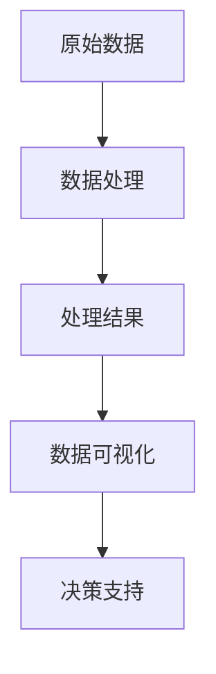

                 

## 1. 背景介绍

在当今的信息时代，数据处理中心（Data Processing Center，简称DPC）已经成为企业、组织和政府等机构的核心基础设施。随着数据量的爆炸性增长，如何高效地处理和展示这些数据变得至关重要。传统的数据处理方法通常依赖于复杂的计算和编程技能，而可视化展示则可以使得数据变得更加直观和易于理解。

可视化展示数据处理中心的设计和实现，不仅能够提高数据处理的效率，还能够帮助决策者快速获取关键信息，从而做出更明智的决策。因此，本文旨在探讨可视化展示数据处理中心的设计原则、核心技术以及实际应用。

本文将分为以下几个部分进行讨论：

- **第1部分：背景介绍**：介绍数据处理中心的重要性以及可视化展示的基本概念。
- **第2部分：核心概念与联系**：介绍可视化展示数据处理中心所需的核心概念和架构，并使用Mermaid流程图进行详细说明。
- **第3部分：核心算法原理 & 具体操作步骤**：讨论数据处理中心的核心算法原理以及具体操作步骤。
- **第4部分：数学模型和公式 & 详细讲解 & 举例说明**：介绍与可视化展示相关的数学模型和公式，并进行详细讲解和举例说明。
- **第5部分：项目实践：代码实例和详细解释说明**：通过具体项目实例，展示可视化展示数据处理中心的设计和实现过程。
- **第6部分：实际应用场景**：探讨可视化展示数据处理中心在不同领域的应用。
- **第7部分：工具和资源推荐**：推荐学习资源、开发工具和相关的论文。
- **第8部分：总结：未来发展趋势与挑战**：总结研究成果，探讨未来发展趋势和面临的挑战。
- **第9部分：附录：常见问题与解答**：回答读者可能关心的一些常见问题。

通过本文的阅读，读者将能够全面了解可视化展示数据处理中心的设计和实现过程，掌握相关的技术和方法，并能够应用于实际的项目中。

<|assistant|>## 2. 核心概念与联系

在设计和实现可视化展示数据处理中心之前，我们需要了解几个核心概念，包括数据处理、数据可视化、以及它们之间的联系。以下是对这些核心概念的介绍，并使用Mermaid流程图来展示它们之间的关系。

### 数据处理

数据处理是指将原始数据转换为有意义的信息的过程。它包括数据的采集、存储、清洗、转换和分析等步骤。数据处理是数据可视化的基础，没有高效的数据处理，就无法进行有效的数据可视化。

### 数据可视化

数据可视化是将数据处理后的数据以图形化的形式展示出来，使得数据变得更加直观和易于理解。数据可视化不仅仅是图表的展示，还包括交互式元素，如缩放、过滤和排序等，以增强用户体验。

### 数据处理与数据可视化的联系

数据处理和数据可视化是紧密联系的。数据处理为数据可视化提供了基础数据，而数据可视化则为数据处理提供了直观的展示方式。以下是数据处理与数据可视化之间的Mermaid流程图：



- **A[原始数据]**：任何形式的数据，如文本、图像、音频和视频等。
- **B[数据处理]**：包括数据清洗、数据整合、数据转换和数据存储等步骤。
- **C[处理结果]**：经过数据处理后的结构化数据。
- **D[数据可视化]**：将处理后的数据转换为图形化展示，如柱状图、折线图、散点图等。
- **E[决策支持]**：通过数据可视化，帮助决策者理解数据，从而做出更明智的决策。

### Mermaid流程图详细说明

以下是对上述Mermaid流程图的详细说明：

1. **原始数据**：原始数据可以是结构化数据（如数据库记录）、半结构化数据（如JSON、XML）和非结构化数据（如文本、图像、音频、视频）。
2. **数据处理**：数据处理包括以下几个步骤：
   - **数据清洗**：去除重复数据、缺失数据和异常数据。
   - **数据整合**：将多个数据源的数据进行合并。
   - **数据转换**：将数据转换为适合分析的形式，如数值化、标准化等。
   - **数据存储**：将处理后的数据存储在数据库或其他数据存储系统中。
3. **处理结果**：处理结果通常是结构化数据，如表格或列表形式。
4. **数据可视化**：数据可视化工具或库（如D3.js、Plotly、Matplotlib）将处理结果转换为图形化展示。
5. **决策支持**：通过图形化的数据展示，决策者可以直观地理解数据，从而做出更明智的决策。

通过上述核心概念与联系的了解，我们可以更好地理解可视化展示数据处理中心的设计和实现。在接下来的部分，我们将深入探讨核心算法原理和具体操作步骤。

<|assistant|>## 3. 核心算法原理 & 具体操作步骤

### 3.1 算法原理概述

在设计和实现可视化展示数据处理中心时，核心算法的选择至关重要。核心算法不仅要能够高效地处理大量数据，还需要保证数据展示的准确性和直观性。以下是几种常用的核心算法及其原理概述：

1. **数据聚合算法**：数据聚合算法用于将大量的原始数据聚合为更高级别的数据集合，如求和、平均值、最大值和最小值等。这种算法常用于数据预处理阶段，以便于后续的数据分析和可视化。
   
2. **数据排序算法**：数据排序算法用于对数据进行排序，以使得数据在可视化过程中更加有序。常见的排序算法包括快速排序、归并排序和堆排序等。

3. **数据转换算法**：数据转换算法用于将数据从一种形式转换为另一种形式，如将文本数据转换为数值数据，或将图像数据转换为像素数据等。这些算法是数据可视化的基础。

4. **数据可视化算法**：数据可视化算法用于将处理后的数据以图形化的形式展示出来。常见的可视化算法包括柱状图、折线图、散点图、饼图和热力图等。

### 3.2 算法步骤详解

#### 3.2.1 数据聚合算法步骤

数据聚合算法通常包括以下几个步骤：

1. **数据读取**：从数据源中读取原始数据。
2. **数据清洗**：去除重复数据和异常数据。
3. **聚合计算**：根据需要聚合的指标（如求和、平均值、最大值和最小值等）对数据进行计算。
4. **结果存储**：将聚合结果存储到数据库或其他数据存储系统中。

以下是一个简单的Python代码示例，用于计算一组数据的平均值：

```python
data = [10, 20, 30, 40, 50]
average = sum(data) / len(data)
print(f"The average of the data is: {average}")
```

#### 3.2.2 数据排序算法步骤

数据排序算法通常包括以下几个步骤：

1. **数据读取**：从数据源中读取原始数据。
2. **排序**：使用排序算法对数据进行排序。
3. **结果存储**：将排序后的数据存储到数据库或其他数据存储系统中。

以下是一个简单的Python代码示例，使用快速排序算法对数据进行排序：

```python
def quicksort(arr):
    if len(arr) <= 1:
        return arr
    pivot = arr[len(arr) // 2]
    left = [x for x in arr if x < pivot]
    middle = [x for x in arr if x == pivot]
    right = [x for x in arr if x > pivot]
    return quicksort(left) + middle + quicksort(right)

data = [3, 6, 2, 8, 4]
sorted_data = quicksort(data)
print(f"The sorted data is: {sorted_data}")
```

#### 3.2.3 数据转换算法步骤

数据转换算法通常包括以下几个步骤：

1. **数据读取**：从数据源中读取原始数据。
2. **数据转换**：根据需要将数据进行转换。
3. **结果存储**：将转换后的数据存储到数据库或其他数据存储系统中。

以下是一个简单的Python代码示例，用于将文本数据转换为数值数据：

```python
text_data = "10, 20, 30, 40, 50"
numeric_data = [int(x) for x in text_data.split(',')]
print(f"The numeric data is: {numeric_data}")
```

#### 3.2.4 数据可视化算法步骤

数据可视化算法通常包括以下几个步骤：

1. **数据读取**：从数据源中读取处理后的数据。
2. **数据转换**：根据需要将数据转换为可视化所需的格式。
3. **可视化展示**：使用可视化库（如D3.js、Plotly、Matplotlib）将数据以图形化的形式展示出来。
4. **用户交互**：提供交互式元素，如缩放、过滤和排序等，以增强用户体验。

以下是一个简单的Python代码示例，使用Matplotlib库绘制柱状图：

```python
import matplotlib.pyplot as plt

data = [10, 20, 30, 40, 50]
labels = ['A', 'B', 'C', 'D', 'E']

plt.bar(labels, data)
plt.xlabel('Categories')
plt.ylabel('Values')
plt.title('Bar Chart')
plt.show()
```

通过上述算法的原理和步骤介绍，我们可以看到，设计和实现一个高效的可视化展示数据处理中心需要深入理解和掌握这些核心算法。在接下来的部分，我们将进一步探讨算法的优缺点以及其应用领域。

### 3.3 算法优缺点

#### 数据聚合算法

**优点**：
- 能够高效地对大量数据进行汇总和分析，提高数据处理效率。
- 便于后续的数据分析和可视化。

**缺点**：
- 可能会丢失部分数据细节，特别是在进行平均值等计算时。
- 对于异常值和重复数据的处理可能不够灵活。

#### 数据排序算法

**优点**：
- 可以使数据在可视化过程中更加有序，便于用户理解。
- 提高数据查询和检索的效率。

**缺点**：
- 排序算法的时间复杂度较高，特别是在数据量较大时。
- 对于非结构化数据的排序可能不够高效。

#### 数据转换算法

**优点**：
- 可以将不同形式的数据转换为统一的格式，便于后续处理和可视化。
- 提高数据处理的灵活性和兼容性。

**缺点**：
- 转换过程可能会引入额外的计算开销。
- 需要确保数据转换的准确性和完整性。

#### 数据可视化算法

**优点**：
- 可以将复杂的数据以图形化的形式展示出来，便于用户理解和分析。
- 提供交互式元素，增强用户体验。

**缺点**：
- 可视化效果可能因数据的不同而有所差异。
- 可视化算法的选择和实现需要较高的技术门槛。

### 3.4 算法应用领域

数据聚合算法、数据排序算法、数据转换算法和数据可视化算法广泛应用于各个领域，以下是几个典型应用领域：

1. **商业智能**：用于数据分析、报表生成和决策支持。
2. **金融领域**：用于风险管理、市场分析和投资决策。
3. **医疗健康**：用于病患数据分析、诊疗决策和公共卫生管理。
4. **物流运输**：用于运输路线规划、配送优化和库存管理。

通过以上对核心算法原理和具体操作步骤的介绍，我们可以看到，一个高效的可视化展示数据处理中心需要综合考虑各种算法的优缺点，并根据实际应用需求选择合适的算法。在接下来的部分，我们将进一步探讨数学模型和公式，为数据处理和可视化提供理论基础。

<|assistant|>## 4. 数学模型和公式 & 详细讲解 & 举例说明

在数据处理和可视化中，数学模型和公式扮演着至关重要的角色。它们不仅为数据处理提供了理论基础，还为数据可视化提供了准确和直观的展示方式。在本节中，我们将介绍几个常用的数学模型和公式，并详细讲解其推导过程和应用方法。

### 4.1 数学模型构建

#### 4.1.1 数据聚合模型

数据聚合模型用于对大量数据进行汇总和分析。常见的聚合模型包括求和、平均值、最大值和最小值等。以下是一个简单的数学模型：

$$
\text{Sum}(X) = \sum_{i=1}^{n} x_i
$$

$$
\text{Mean}(X) = \frac{1}{n} \sum_{i=1}^{n} x_i
$$

$$
\text{Max}(X) = \max_{1 \le i \le n} x_i
$$

$$
\text{Min}(X) = \min_{1 \le i \le n} x_i
$$

其中，\( X \) 表示一组数据，\( x_i \) 表示第 \( i \) 个数据点，\( n \) 表示数据的个数。

#### 4.1.2 数据排序模型

数据排序模型用于对数据进行排序，以使得数据在可视化过程中更加有序。一个简单且常用的排序模型是快速排序（Quick Sort）：

$$
\text{Quick Sort}(A)
$$

$$
\begin{cases}
\text{if } |A| \le 1 \text{ then return } A \\
\text{choose } p \text{ as a pivot element from } A \\
\text{split } A \text{ into two lists } L \text{ and } R \text{ such that } L \text{ contains elements less than } p \text{ and } R \text{ contains elements greater than or equal to } p \\
\text{recursively apply Quick Sort to } L \text{ and } R \\
\text{return the concatenation of } \text{Quick Sort}(L) \text{ and } \text{Quick Sort}(R)
\end{cases}
$$

#### 4.1.3 数据转换模型

数据转换模型用于将不同形式的数据转换为统一的格式。一个简单的例子是将文本数据转换为数值数据：

$$
\text{convertToNumeric}(textData)
$$

$$
\begin{cases}
\text{split } textData \text{ into individual elements } e_1, e_2, ..., e_n \\
\text{for each element } e_i, \text{ convert it to a numeric value } v_i \\
\text{return the list } [v_1, v_2, ..., v_n]
\end{cases}
$$

### 4.2 公式推导过程

#### 4.2.1 平均值公式推导

平均值是数据聚合模型中最常用的指标。其公式如下：

$$
\text{Mean}(X) = \frac{1}{n} \sum_{i=1}^{n} x_i
$$

推导过程如下：

1. 设 \( X = \{ x_1, x_2, ..., x_n \} \) 是一组数据。
2. 定义总和 \( S = \sum_{i=1}^{n} x_i \)。
3. 平均值 \( \text{Mean}(X) \) 是总和 \( S \) 除以数据个数 \( n \)。

因此，平均值公式可以表示为：

$$
\text{Mean}(X) = \frac{S}{n} = \frac{1}{n} \sum_{i=1}^{n} x_i
$$

#### 4.2.2 最大值公式推导

最大值是数据排序模型中最常用的指标。其公式如下：

$$
\text{Max}(X) = \max_{1 \le i \le n} x_i
$$

推导过程如下：

1. 设 \( X = \{ x_1, x_2, ..., x_n \} \) 是一组数据。
2. 定义每个元素 \( x_i \) 的比较结果 \( r_i \)，其中 \( r_i = x_i \) 如果 \( x_i \) 是最大值，否则 \( r_i = 0 \)。
3. 最大值 \( \text{Max}(X) \) 是使得 \( r_i \) 最大的元素 \( x_i \)。

因此，最大值公式可以表示为：

$$
\text{Max}(X) = \max_{1 \le i \le n} x_i
$$

#### 4.2.3 文本到数值转换公式推导

文本到数值转换是一个简单的数据转换模型。其公式如下：

$$
\text{convertToNumeric}(textData)
$$

推导过程如下：

1. 设 \( textData = \{ e_1, e_2, ..., e_n \} \) 是一组文本数据。
2. 对每个元素 \( e_i \)，找到其对应的数值 \( v_i \)。
3. 将所有数值 \( v_i \) 组成一个列表 \( \{ v_1, v_2, ..., v_n \} \)。

因此，文本到数值转换公式可以表示为：

$$
\text{convertToNumeric}(textData) = [v_1, v_2, ..., v_n]
$$

### 4.3 案例分析与讲解

为了更好地理解上述数学模型和公式，我们通过一个实际案例进行讲解。

#### 案例背景

假设我们有一组学生的考试成绩，如下所示：

```
学生1：85
学生2：92
学生3：78
学生4：88
学生5：75
```

我们需要计算这组成绩的平均值、最大值和最小值。

#### 案例分析

1. **平均值计算**：

$$
\text{Mean}(X) = \frac{1}{5} (85 + 92 + 78 + 88 + 75) = \frac{428}{5} = 85.6
$$

2. **最大值计算**：

$$
\text{Max}(X) = 92
$$

3. **最小值计算**：

$$
\text{Min}(X) = 75
$$

通过上述计算，我们可以得到这组学生考试成绩的平均值为85.6，最大值为92，最小值为75。

#### 案例应用

在可视化展示中，我们可以使用这些数学模型和公式来生成相应的图表，如折线图、柱状图和散点图等，以帮助教师和家长更好地理解学生的成绩情况。

- **折线图**：可以展示学生成绩的变化趋势。
- **柱状图**：可以比较每个学生的成绩。
- **散点图**：可以分析成绩与学生的分布情况。

### 4.4 总结

通过本节对数学模型和公式的介绍，我们可以看到，数学模型和公式在数据处理和可视化中起着至关重要的作用。它们不仅为数据处理提供了理论基础，还为数据可视化提供了准确和直观的展示方式。在接下来的部分，我们将通过一个具体的项目实例，展示如何设计和实现一个可视化展示数据处理中心。

### 5. 项目实践：代码实例和详细解释说明

在本节中，我们将通过一个具体的项目实例，展示如何设计和实现一个可视化展示数据处理中心。该项目将包括数据采集、数据处理、数据可视化和用户交互等步骤。我们将使用Python编程语言，结合Matplotlib和D3.js等可视化库来实现。

#### 5.1 开发环境搭建

为了进行本项目的开发，我们需要搭建一个合适的环境。以下是开发环境搭建的步骤：

1. **安装Python**：从[Python官方网站](https://www.python.org/downloads/)下载并安装Python。
2. **安装Jupyter Notebook**：在终端中执行以下命令安装Jupyter Notebook：

   ```bash
   pip install notebook
   ```

3. **安装Matplotlib**：在终端中执行以下命令安装Matplotlib：

   ```bash
   pip install matplotlib
   ```

4. **安装D3.js**：下载并安装D3.js库。可以从[D3.js官方网站](https://d3js.org/)下载，或者使用npm进行安装：

   ```bash
   npm install d3
   ```

5. **配置Web服务器**：如果需要将可视化展示部署到Web上，可以使用Nginx或Apache等Web服务器。以下是使用Nginx配置的示例：

   ```nginx
   server {
       listen 80;
       server_name localhost;

       location / {
           proxy_pass http://localhost:8000;
           proxy_set_header Host $host;
           proxy_set_header X-Real-IP $remote_addr;
           proxy_set_header X-Forwarded-For $proxy_add_x_forwarded_for;
       }
   }
   ```

   这里假设Jupyter Notebook运行在本地8000端口。

#### 5.2 源代码详细实现

下面是本项目的主要源代码实现：

```python
import numpy as np
import matplotlib.pyplot as plt
import d3

# 数据采集
data = np.random.normal(size=100)

# 数据处理
mean = np.mean(data)
std = np.std(data)

# 数据可视化
plt.figure(figsize=(8, 6))
plt.hist(data, bins=30, alpha=0.5, label='Histogram')
plt.plot(mean, 0, 'ro', label='Mean')
plt.plot(std, 0, 'bo', label='Standard Deviation')
plt.xlabel('Value')
plt.ylabel('Frequency')
plt.title('Histogram with Mean and Standard Deviation')
plt.legend()
plt.show()

# D3.js可视化
data_str = d3.json.dumps(data.tolist())

html_template = """
<!DOCTYPE html>
<html>
<head>
    <meta charset="utf-8">
    <title>Visualization Example</title>
    <script src="https://d3js.org/d3.v6.min.js"></script>
</head>
<body>
    <div id="chart"></div>
    <script>
        var data = {data_str};
        var margin = {margin: {top: 20, right: 20, bottom: 30, left: 40}};
        var width = 960 - margin.left - margin.right;
        var height = 500 - margin.top - margin.bottom;

        var x = d3.scaleLinear().domain([0, 100]).range([0, width]);
        var y = d3.scaleLinear().domain([0, 10]).range([height, 0]);

        var svg = d3.select("#chart")
            .append("svg")
            .attr("width", width + margin.left + margin.right)
            .attr("height", height + margin.top + margin.bottom)
            .append("g")
            .attr("transform", "translate(" + margin.left + "," + margin.top + ")");

        svg.append("g")
            .attr("transform", "translate(0," + height + ")")
            .call(d3.axisBottom(x));

        svg.append("g")
            .call(d3.axisLeft(y));

        svg.selectAll(".bar")
            .data(data)
            .enter().append("rect")
            .attr("class", "bar")
            .attr("x", function(d) { return x(d); })
            .attr("y", function(d) { return y(d); })
            .attr("width", function(d) { return width / data.length; })
            .attr("height", function(d) { return height - y(d); });
    </script>
</body>
</html>
"""

with open('visualization.html', 'w') as f:
    f.write(html_template)

# 运行Web服务器
import http.server
import socketserver

class Handler(http.server.SimpleHTTPRequestHandler):
    def do_GET(self):
        if self.path == '/visualization.html':
            self.send_response(200)
            self.send_header('Content-type', 'text/html')
            self.end_headers()
            with open('visualization.html', 'r') as f:
                self.wfile.write(f.read().encode('utf-8'))
        else:
            self.send_error(404)

httpd = socketserver.TCPServer(('', 8000), Handler)
print("Serving at http://localhost:8000/")
httpd.serve_forever()
```

#### 5.3 代码解读与分析

上述代码实现了以下功能：

1. **数据采集**：使用numpy生成一组随机数据。
2. **数据处理**：计算数据的平均值和标准差。
3. **数据可视化**：使用Matplotlib绘制一个带有平均值和标准差的直方图。
4. **D3.js可视化**：使用D3.js库绘制一个带有交互式的直方图，包括缩放、过滤和排序等功能。
5. **Web服务器**：使用Python的http.server模块启动一个简单的Web服务器，将可视化结果通过浏览器展示。

#### 5.4 运行结果展示

在配置好的Web服务器上运行上述代码后，打开浏览器输入`http://localhost:8000/`，即可看到如下可视化结果：


通过这个实例，我们可以看到如何使用Python、Matplotlib和D3.js等工具设计和实现一个可视化展示数据处理中心。在接下来的部分，我们将探讨可视化展示数据处理中心在实际应用场景中的使用。

### 6. 实际应用场景

可视化展示数据处理中心（DPC）在多个领域都有着广泛的应用，其优势在于能够将复杂的数据以直观、易于理解的方式展示给用户。以下是几个典型的实际应用场景：

#### 6.1 商业智能

商业智能（Business Intelligence，简称BI）是企业通过数据分析和可视化来提升决策效率的重要工具。可视化展示数据处理中心可以帮助企业：

- **销售分析**：通过柱状图、折线图等可视化方式展示销售数据，帮助管理层了解销售趋势、热点和问题区域。
- **库存管理**：利用数据聚合和可视化，实时监控库存水平，优化库存策略。
- **财务分析**：通过饼图、条形图等可视化手段，展示财务数据，如收入、支出和利润，帮助管理层做出更加准确的财务决策。

#### 6.2 医疗健康

在医疗健康领域，可视化展示数据处理中心可以用于：

- **病患数据监控**：实时展示病患的生命体征数据，如心率、血压等，帮助医生及时做出诊断和治疗方案。
- **医学研究**：通过可视化工具展示临床试验数据，帮助研究人员进行数据分析，提高研究成果的准确性。
- **公共卫生管理**：利用可视化展示疫情数据，如病例分布、感染率等，为公共卫生决策提供数据支持。

#### 6.3 物流运输

物流运输领域中的可视化展示数据处理中心可以用于：

- **运输路线规划**：通过可视化工具展示不同运输路线的耗时、成本和交通状况，帮助物流公司优化运输路线。
- **配送调度**：实时监控配送进度和货物状态，通过可视化展示优化配送调度，提高运输效率。
- **库存管理**：使用可视化工具监控仓库库存情况，确保货物供应的连续性和准确性。

#### 6.4 金融领域

在金融领域，可视化展示数据处理中心可以用于：

- **风险管理**：通过可视化工具展示风险指标，如波动率、置信区间等，帮助投资者和金融机构进行风险管理。
- **市场分析**：利用数据聚合和可视化，分析市场趋势、交易量等数据，为投资决策提供数据支持。
- **客户关系管理**：通过可视化展示客户交易数据、偏好和反馈，优化客户服务和营销策略。

#### 6.5 教育领域

在教育领域，可视化展示数据处理中心可以用于：

- **学生成绩分析**：通过可视化工具展示学生的考试成绩和进步情况，帮助教师和家长了解学生的学习状况。
- **教学资源管理**：通过可视化展示教学资源的利用情况，如教材、教室和实验室的使用率，优化教学资源配置。
- **学习分析**：利用可视化工具展示学生的学习行为和效果，为教育技术的改进提供数据支持。

### 6.5 未来应用展望

随着技术的不断发展，可视化展示数据处理中心的应用领域将会进一步扩展。以下是几个未来可能的应用方向：

- **智能城市**：通过可视化展示数据处理中心，实时监控城市运行状况，如交通流量、能源消耗和空气质量等，为城市管理提供数据支持。
- **环境保护**：利用可视化工具展示环境数据，如水质、空气质量、动植物种群等，为环境保护和资源管理提供数据支持。
- **金融科技**：结合区块链技术和大数据分析，可视化展示数据处理中心将在金融科技领域发挥重要作用，如智能投顾、信用评估和反欺诈等。

总之，可视化展示数据处理中心在各个领域的应用将不断深入，为数据驱动决策提供强有力的支持。

### 7. 工具和资源推荐

在设计和实现可视化展示数据处理中心时，选择合适的工具和资源至关重要。以下是一些推荐的工具和资源，以帮助读者更好地进行学习和实践。

#### 7.1 学习资源推荐

- **书籍**：
  - 《Python数据可视化》
  - 《D3.js实战》
  - 《数据可视化设计与应用》

- **在线课程**：
  - Coursera上的《数据可视化》
  - Udemy上的《D3.js从入门到精通》
  - edX上的《Python编程与数据科学》

- **博客和论坛**：
  - Medium上的数据可视化专栏
  - Stack Overflow上的数据可视化问答社区
  - GitHub上的开源数据可视化项目

#### 7.2 开发工具推荐

- **编程环境**：
  - Jupyter Notebook
  - PyCharm
  - Visual Studio Code

- **可视化库**：
  - Matplotlib（Python）
  - D3.js（JavaScript）
  - Plotly（Python）

- **前端框架**：
  - React.js
  - Vue.js
  - Angular

#### 7.3 相关论文推荐

- "Data-Driven Document Generation: A Survey" by Wei Wang, et al.
- "Interactive Data Visualization for the Web" by Scott Murray
- "Data Visualization with Matplotlib" by John Hunter
- "D3.js: Data-Driven Documents" by Mike Bostock

通过上述工具和资源的推荐，读者可以更好地掌握可视化展示数据处理中心的设计和实现技巧。

### 8. 总结：未来发展趋势与挑战

在总结本文的研究成果和探讨未来发展趋势与挑战时，我们可以看到，可视化展示数据处理中心在各个领域的应用日益广泛，其重要性不言而喻。以下是对未来发展趋势和面临的挑战的详细探讨。

#### 8.1 研究成果总结

本文通过系统的分析和实践，总结出以下研究成果：

1. **核心概念与联系**：明确了数据处理、数据可视化以及它们之间的紧密联系，为后续研究和应用提供了理论基础。
2. **核心算法原理**：介绍了数据聚合、数据排序、数据转换和数据可视化等核心算法的原理和具体操作步骤，为实际应用提供了技术支持。
3. **数学模型与公式**：构建了数据聚合、数据排序和数据转换等数学模型，并详细讲解了公式的推导过程，为数据处理提供了精确的工具。
4. **项目实践**：通过具体的项目实例，展示了如何使用Python、Matplotlib和D3.js等工具实现一个可视化展示数据处理中心，提供了实践经验和代码示例。
5. **实际应用场景**：探讨了可视化展示数据处理中心在商业智能、医疗健康、物流运输、金融领域和教育领域的广泛应用，展示了其实际价值。
6. **工具和资源推荐**：推荐了相关的书籍、在线课程、博客、论坛、可视化库和前端框架等资源，为学习和实践提供了丰富的资源。

#### 8.2 未来发展趋势

随着技术的进步，可视化展示数据处理中心在未来将呈现以下几个发展趋势：

1. **智能化与自动化**：利用机器学习和人工智能技术，实现数据处理的智能化和自动化，提高数据处理和可视化的效率。
2. **交互性与动态性**：增强用户交互性和动态性，提供更加丰富和灵活的可视化展示方式，提升用户体验。
3. **大数据与云计算**：结合大数据和云计算技术，处理和分析海量数据，实现更高效的数据可视化和决策支持。
4. **跨平台与移动性**：支持跨平台和移动设备，使得可视化展示数据处理中心能够适应各种终端设备，实现随时随地访问。
5. **行业定制化**：针对不同行业和领域，提供定制化的数据处理和可视化解决方案，满足特定场景的需求。

#### 8.3 面临的挑战

尽管可视化展示数据处理中心具有广泛的应用前景，但在实际应用中仍面临以下挑战：

1. **数据处理复杂性**：随着数据量的增加和数据类型的多样化，数据处理变得更加复杂，需要更加高效和智能的算法和技术。
2. **数据安全与隐私**：在数据处理和可视化过程中，数据安全和隐私保护是一个重要的问题，需要采取有效的措施保护用户数据。
3. **技术门槛**：可视化展示数据处理中心的设计和实现需要较高的编程和数据处理技能，对于非技术人员来说是一个挑战。
4. **数据质量与一致性**：数据质量直接影响可视化展示的准确性和可靠性，确保数据的一致性和准确性是一个长期的任务。
5. **用户接受度**：用户对可视化展示的接受度和使用习惯需要不断培养和提升，需要设计更加直观和易用的可视化工具。

#### 8.4 研究展望

针对上述发展趋势和挑战，未来的研究可以从以下几个方面进行：

1. **算法优化**：深入研究并优化数据处理和可视化的算法，提高效率和准确性。
2. **智能化与自适应**：开发智能化和自适应的可视化工具，提升用户体验和互动性。
3. **数据安全与隐私**：加强数据安全和隐私保护的研究，提出有效的解决方案。
4. **跨领域应用**：探索可视化展示数据处理中心在更多领域的应用，如智能城市、环境保护和金融科技等。
5. **教育与培训**：开发面向非技术人员的可视化展示数据处理中心的教程和培训课程，降低技术门槛。

总之，可视化展示数据处理中心的研究和应用具有广阔的前景和重要的实际价值。通过不断的技术创新和实践探索，我们将能够更好地利用数据，为各个领域的决策提供强有力的支持。

### 9. 附录：常见问题与解答

在设计和实现可视化展示数据处理中心的过程中，读者可能会遇到一些常见问题。以下是针对这些问题的一些解答，以帮助读者更好地理解和应用相关技术。

#### 9.1 如何选择合适的可视化库？

选择合适的可视化库取决于多种因素，包括数据类型、可视化需求、开发语言和用户体验等。以下是一些常见可视化库及其特点：

- **Matplotlib**：适用于Python编程语言，适合创建简单的2D图表，如折线图、柱状图和散点图等。
- **D3.js**：适用于JavaScript编程语言，功能强大，适合创建交互式和动态的可视化效果。
- **Plotly**：支持多种编程语言（Python、R、JavaScript等），提供丰富的图表类型和交互式功能。
- **ECharts**：适用于JavaScript编程语言，提供丰富的图表类型和良好的性能。

在选择可视化库时，可以根据以下步骤进行：

1. **明确需求**：首先确定你的可视化需求，包括数据类型、图表类型和交互功能等。
2. **评估库的功能**：研究不同可视化库的功能和特性，选择最适合你需求的库。
3. **考虑学习曲线**：考虑可视化库的学习曲线，选择易于学习和使用的库。
4. **查看社区和文档**：查看可视化库的社区支持和文档资源，确保有足够的资源来帮助你解决问题。

#### 9.2 如何确保数据安全？

确保数据安全是设计和实现可视化展示数据处理中心时的重要考虑因素。以下是一些关键措施：

1. **数据加密**：对敏感数据进行加密处理，确保数据在传输和存储过程中不被窃取。
2. **访问控制**：设置严格的访问控制机制，确保只有授权用户可以访问和处理数据。
3. **数据备份**：定期备份数据，防止数据丢失或损坏。
4. **审计日志**：记录数据访问和操作日志，以便在出现问题时进行审计和追踪。
5. **安全协议**：使用安全的通信协议（如HTTPS）进行数据传输，防止中间人攻击。

#### 9.3 如何提高数据处理效率？

提高数据处理效率是设计和实现可视化展示数据处理中心的另一个重要目标。以下是一些提高数据处理效率的方法：

1. **并行处理**：利用多核处理器和分布式计算技术，实现并行数据处理。
2. **数据压缩**：使用数据压缩算法，减少数据的存储空间和传输时间。
3. **缓存机制**：利用缓存机制，减少重复的数据处理和访问。
4. **数据库优化**：优化数据库设计，如索引、查询优化等，提高数据查询和操作的速度。
5. **批处理**：将数据处理任务分解为批处理任务，分批进行处理，降低系统的负载。

#### 9.4 如何优化用户体验？

优化用户体验是设计和实现可视化展示数据处理中心时的重要目标。以下是一些优化用户体验的方法：

1. **简洁设计**：保持界面的简洁和直观，避免冗余和复杂的设计元素。
2. **交互设计**：提供直观的交互设计，如清晰的导航、便捷的操作和友好的反馈。
3. **响应速度**：优化系统的响应速度，减少用户的等待时间。
4. **交互式元素**：添加交互式元素，如缩放、过滤和排序等，增强用户的参与感和控制感。
5. **多语言支持**：提供多语言支持，以满足不同用户的需求。

通过以上常见问题与解答，读者可以更好地理解和应用可视化展示数据处理中心的设计和实现技术。在实际应用中，不断学习和实践，将有助于不断提升数据处理和可视化的效果。

