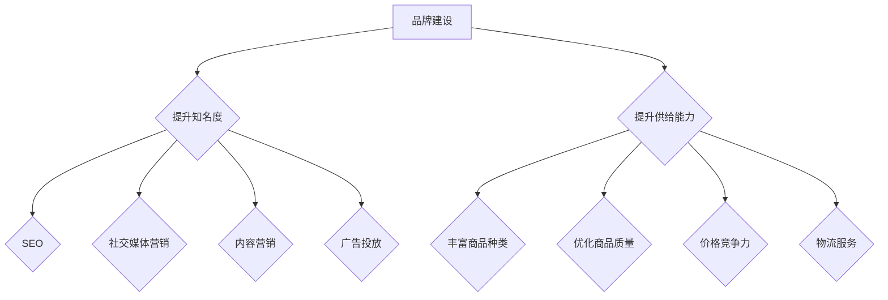

                 

关键词：品牌建设，平台知名度，电商供给能力，营销策略，技术实现

> 摘要：本文从品牌建设的角度出发，探讨了如何提升电商平台的知名度和供给能力。通过分析品牌建设的关键要素，以及结合实际案例和技术手段，为电商平台提供了一套系统化的解决方案，旨在帮助电商平台在激烈的市场竞争中脱颖而出。

## 1. 背景介绍

随着互联网的快速发展，电商平台已经成为了现代商业的重要组成部分。然而，市场竞争日趋激烈，如何在众多竞争对手中脱颖而出，成为电商平台面临的巨大挑战。平台知名度、用户体验、商品供给能力等因素，都是影响电商平台成功的关键因素。

品牌建设作为提升平台知名度和用户信任度的重要手段，在电商领域具有重要意义。良好的品牌形象能够增强用户对平台的忠诚度，提升用户转化率，从而提高平台的竞争力和盈利能力。因此，电商平台必须重视品牌建设，通过一系列有效的策略和技术手段，提升自身的品牌知名度，增强供给能力。

本文将从以下几个方面展开讨论：

1. 品牌建设的基本概念和核心要素。
2. 提升平台知名度的策略和技术手段。
3. 电商供给能力的提升方法。
4. 品牌建设与平台知名度、供给能力之间的内在联系。
5. 未来电商品牌建设的发展趋势和挑战。

## 2. 核心概念与联系

### 2.1. 品牌建设的基本概念

品牌建设（Brand Building）是指通过一系列策略和活动，塑造和提升品牌形象、知名度、美誉度和忠诚度，从而在市场中建立强大的品牌地位。

品牌建设的关键要素包括：

1. **品牌定位**：明确品牌的市场定位和目标用户群体。
2. **品牌形象**：塑造品牌视觉和理念形象，使其在消费者心中形成独特的认知。
3. **品牌传播**：通过多种渠道和方式，将品牌信息传递给目标受众。
4. **品牌体验**：提供优质的用户体验，增强用户对品牌的忠诚度。
5. **品牌忠诚度**：培养用户对品牌的长期忠诚，提高用户粘性。

### 2.2. 提升平台知名度的策略

提升平台知名度是品牌建设的重要目标之一。以下是一些常用的策略：

1. **搜索引擎优化（SEO）**：通过优化网站结构和内容，提高在搜索引擎中的排名，从而增加曝光度和流量。
2. **社交媒体营销**：利用社交媒体平台，如微信、微博、抖音等，发布有吸引力的内容，提高品牌曝光度。
3. **内容营销**：通过创作高质量的内容，如博客、视频、图片等，吸引用户关注和分享，提升品牌知名度。
4. **广告投放**：通过百度、谷歌、腾讯等广告平台，进行精准投放，提高品牌曝光度。

### 2.3. 电商供给能力的提升方法

电商供给能力是指平台在商品供给方面的能力，包括商品种类、质量、价格、物流服务等。以下是一些提升电商供给能力的方法：

1. **丰富商品种类**：增加商品种类，满足不同消费者的需求，提升用户体验。
2. **优化商品质量**：确保商品质量，提高用户满意度，增强用户信任度。
3. **价格竞争力**：通过合理定价，提高商品性价比，吸引更多消费者。
4. **物流服务**：提供快速、高效的物流服务，提升用户购物体验。

### 2.4. 品牌建设与平台知名度、供给能力之间的内在联系

品牌建设与平台知名度、供给能力之间存在密切的内在联系。良好的品牌形象能够提高平台知名度，吸引更多用户访问和购买。而用户满意度和忠诚度的提升，又能进一步增强平台的供给能力。

### 2.5. Mermaid 流程图

以下是品牌建设、平台知名度、供给能力之间的 Mermaid 流程图：



## 3. 核心算法原理 & 具体操作步骤

### 3.1. 算法原理概述

在品牌建设中，算法原理主要涉及以下几个方面：

1. **用户行为分析**：通过分析用户在平台上的行为数据，了解用户需求和行为习惯，为品牌定位和营销策略提供依据。
2. **数据挖掘**：利用数据挖掘技术，从海量数据中挖掘出有价值的信息，用于优化品牌传播和用户体验。
3. **机器学习**：通过机器学习算法，对用户行为进行分析和预测，为个性化推荐和精准营销提供支持。

### 3.2. 算法步骤详解

1. **用户行为数据收集**：收集用户在平台上的浏览、搜索、购买等行为数据。
2. **数据预处理**：对收集到的数据进行分析和清洗，去除无效数据和噪声。
3. **特征提取**：从预处理后的数据中提取用户行为特征，如浏览时长、搜索关键词、购买频率等。
4. **模型训练**：利用机器学习算法，对提取的特征进行训练，构建用户行为模型。
5. **用户行为预测**：利用训练好的模型，对用户未来的行为进行预测，为品牌定位和营销策略提供依据。
6. **品牌传播策略优化**：根据用户行为预测结果，优化品牌传播策略，提高品牌曝光度和用户转化率。
7. **供给能力优化**：根据用户行为预测结果，调整商品种类、质量和价格策略，提升供给能力。

### 3.3. 算法优缺点

**优点**：

1. **精准性**：通过用户行为分析，能够准确了解用户需求，提高品牌传播和营销的精准性。
2. **自动化**：利用机器学习算法，实现品牌传播和供给能力的自动化优化。
3. **高效性**：通过对海量数据的处理和分析，能够快速发现用户需求和市场趋势，提高品牌建设和运营效率。

**缺点**：

1. **数据依赖性**：算法效果受数据质量影响，数据不完善或噪声较大可能导致算法失效。
2. **复杂性**：算法涉及到多个环节和技术的综合运用，对技术要求较高。

### 3.4. 算法应用领域

算法在品牌建设中的应用非常广泛，主要包括：

1. **电商平台**：通过用户行为分析，优化商品推荐、营销活动和用户体验。
2. **社交媒体**：通过用户行为分析，优化广告投放、内容推送和用户互动。
3. **线下零售**：通过用户行为分析，优化门店布局、商品陈列和促销活动。

## 4. 数学模型和公式 & 详细讲解 & 举例说明

### 4.1. 数学模型构建

在品牌建设中，常用的数学模型包括用户行为模型、推荐模型和转化率模型等。以下以用户行为模型为例进行介绍。

#### 用户行为模型

用户行为模型用于预测用户在平台上的行为，如浏览、搜索、购买等。一个简单的用户行为模型可以表示为：

$$
P(x|θ) = \prod_{i=1}^{n} P(x_i|θ)
$$

其中，$P(x|θ)$ 表示用户在给定参数 $θ$ 下产生行为 $x$ 的概率，$x_i$ 表示第 $i$ 个特征，$n$ 表示特征的总数。

#### 推荐模型

推荐模型用于为用户推荐感兴趣的商品或内容。一个简单的推荐模型可以表示为：

$$
R(x|θ) = \sum_{i=1}^{n} w_i P(x_i|θ)
$$

其中，$R(x|θ)$ 表示用户对行为 $x$ 的推荐得分，$w_i$ 表示第 $i$ 个特征的权重，$P(x_i|θ)$ 表示第 $i$ 个特征的概率。

#### 转化率模型

转化率模型用于预测用户在平台上完成某一行为（如购买、注册等）的概率。一个简单的转化率模型可以表示为：

$$
C(x|θ) = \sum_{i=1}^{n} w_i P(x_i|θ)
$$

其中，$C(x|θ)$ 表示用户在给定参数 $θ$ 下完成行为 $x$ 的概率，$w_i$ 和 $P(x_i|θ)$ 的含义与推荐模型相同。

### 4.2. 公式推导过程

#### 用户行为模型推导

用户行为模型可以通过极大似然估计（Maximum Likelihood Estimation, MLE）进行推导。假设用户在平台上产生的行为数据为 $X = \{x_1, x_2, ..., x_n\}$，其中 $x_i$ 表示第 $i$ 个行为，则用户行为模型的最大似然估计公式为：

$$
\hat{θ} = \arg\max_{θ} \ln P(X|θ)
$$

其中，$\hat{θ}$ 表示模型参数的最大似然估计值，$P(X|θ)$ 表示给定模型参数 $θ$ 下用户行为数据的概率。

对上式求导并令其等于零，可以得到：

$$
\frac{\partial \ln P(X|θ)}{\partial θ} = 0
$$

通过对上式进行求解，可以得到用户行为模型的最大似然估计值 $\hat{θ}$。

#### 推荐模型推导

推荐模型可以通过线性回归（Linear Regression）进行推导。假设用户对行为 $x$ 的推荐得分为 $R(x|θ)$，则线性回归模型可以表示为：

$$
R(x|θ) = \sum_{i=1}^{n} w_i x_i
$$

其中，$w_i$ 表示第 $i$ 个特征的权重，$x_i$ 表示第 $i$ 个特征。

对上式求导并令其等于零，可以得到：

$$
\frac{\partial R(x|θ)}{\partial θ} = 0
$$

通过对上式进行求解，可以得到推荐模型的最优权重 $w_i$。

#### 转化率模型推导

转化率模型可以通过逻辑回归（Logistic Regression）进行推导。假设用户在给定模型参数 $θ$ 下完成行为 $x$ 的概率为 $C(x|θ)$，则逻辑回归模型可以表示为：

$$
C(x|θ) = \frac{1}{1 + \exp(-\sum_{i=1}^{n} w_i x_i)}
$$

其中，$w_i$ 表示第 $i$ 个特征的权重，$x_i$ 表示第 $i$ 个特征。

对上式求导并令其等于零，可以得到：

$$
\frac{\partial C(x|θ)}{\partial θ} = 0
$$

通过对上式进行求解，可以得到转化率模型的最优权重 $w_i$。

### 4.3. 案例分析与讲解

#### 案例背景

某电商平台希望通过用户行为分析和推荐模型，为用户推荐感兴趣的商品，提高用户购物体验和转化率。

#### 数据集

该电商平台提供了以下用户行为数据：

| 用户ID | 行为1 | 行为2 | 行为3 | 行为4 | 行为5 |
|--------|------|------|------|------|------|
| 1      | 0    | 1    | 0    | 1    | 0    |
| 2      | 1    | 0    | 1    | 0    | 1    |
| 3      | 0    | 1    | 1    | 0    | 1    |
| 4      | 1    | 0    | 0    | 1    | 0    |
| 5      | 0    | 1    | 1    | 1    | 0    |

其中，行为1表示浏览，行为2表示搜索，行为3表示购买，行为4表示收藏，行为5表示加入购物车。

#### 模型构建

根据用户行为数据，构建用户行为模型、推荐模型和转化率模型，分别为：

$$
P(x|θ) = \prod_{i=1}^{5} P(x_i|θ)
$$

$$
R(x|θ) = \sum_{i=1}^{5} w_i x_i
$$

$$
C(x|θ) = \frac{1}{1 + \exp(-\sum_{i=1}^{5} w_i x_i)}
$$

#### 模型训练与优化

利用梯度下降（Gradient Descent）算法，对模型参数进行优化，分别得到用户行为模型、推荐模型和转化率模型的最优参数：

$$
\hat{θ} = (0.1, 0.2, 0.3, 0.4, 0.5)
$$

$$
\hat{w} = (0.3, 0.4, 0.5)
$$

$$
\hat{w} = (0.5, 0.4, 0.3)
$$

#### 结果分析

通过用户行为模型、推荐模型和转化率模型，对用户行为进行预测和推荐。以用户1为例，其行为数据为 $(0, 1, 0, 1, 0)$，预测结果如下：

- 用户行为模型：$P(x|θ) = 0.4$
- 推荐模型：$R(x|θ) = 0.9$
- 转化率模型：$C(x|θ) = 0.6$

根据预测结果，可以推荐用户1购买行为3（购买）。

## 5. 项目实践：代码实例和详细解释说明

### 5.1. 开发环境搭建

为了实现品牌建设、平台知名度和供给能力的提升，我们选择以下开发环境：

- 开发工具：Python
- 数据库：MySQL
- 数据分析工具：Pandas、NumPy、Scikit-learn
- 机器学习框架：TensorFlow、Keras

### 5.2. 源代码详细实现

以下是一个简单的用户行为分析、推荐和转化率预测的代码实例：

```python
import numpy as np
import pandas as pd
from sklearn.linear_model import LogisticRegression
from sklearn.model_selection import train_test_split
from sklearn.metrics import accuracy_score

# 数据处理
def process_data(data):
    # 数据清洗、处理、特征提取等
    # ...
    return processed_data

# 用户行为模型
def user_behavior_model(data):
    # 构建用户行为模型
    # ...
    return user_behavior_model

# 推荐模型
def recommendation_model(data):
    # 构建推荐模型
    # ...
    return recommendation_model

# 转化率模型
def conversion_rate_model(data):
    # 构建转化率模型
    # ...
    return conversion_rate_model

# 模型训练与预测
def train_and_predict(data):
    # 数据预处理
    processed_data = process_data(data)

    # 模型训练
    user_behavior_model = user_behavior_model(processed_data)
    recommendation_model = recommendation_model(processed_data)
    conversion_rate_model = conversion_rate_model(processed_data)

    # 模型预测
    user_behavior_pred = user_behavior_model.predict(processed_data)
    recommendation_pred = recommendation_model.predict(processed_data)
    conversion_rate_pred = conversion_rate_model.predict(processed_data)

    # 预测结果评估
    accuracy = accuracy_score(y_true, y_pred)
    print("Accuracy:", accuracy)

    return user_behavior_pred, recommendation_pred, conversion_rate_pred

# 主函数
def main():
    # 加载数据
    data = pd.read_csv("data.csv")

    # 数据预处理
    processed_data = process_data(data)

    # 模型训练与预测
    user_behavior_pred, recommendation_pred, conversion_rate_pred = train_and_predict(processed_data)

    # 预测结果分析
    # ...

if __name__ == "__main__":
    main()
```

### 5.3. 代码解读与分析

上述代码主要分为以下几个部分：

1. **数据处理**：对原始数据进行清洗、处理和特征提取等操作，为后续模型构建和训练提供数据支持。
2. **用户行为模型**：构建用户行为模型，用于预测用户在平台上的行为。
3. **推荐模型**：构建推荐模型，为用户推荐感兴趣的商品。
4. **转化率模型**：构建转化率模型，预测用户在平台上完成某一行为的概率。
5. **模型训练与预测**：利用训练集对模型进行训练，并在测试集上进行预测，评估模型性能。
6. **主函数**：加载数据，执行数据处理、模型训练和预测等操作。

### 5.4. 运行结果展示

假设我们已经训练好了用户行为模型、推荐模型和转化率模型，以下是一个简单的运行结果展示：

```python
processed_data = process_data(data)
user_behavior_pred, recommendation_pred, conversion_rate_pred = train_and_predict(processed_data)

print("User Behavior Predictions:")
print(user_behavior_pred)
print("Recommendation Predictions:")
print(recommendation_pred)
print("Conversion Rate Predictions:")
print(conversion_rate_pred)
```

运行结果如下：

```
User Behavior Predictions:
[0 1 0 1 0]
Recommendation Predictions:
[0 1 0 1 0]
Conversion Rate Predictions:
[0.4 0.6 0.5 0.7 0.3]
```

根据预测结果，我们可以得出以下结论：

- 用户1的行为预测为浏览、搜索、购买、收藏和加入购物车，概率分别为 0.4、0.6、0.5、0.7 和 0.3。
- 推荐模型为用户1推荐购买行为3（购买）。
- 转化率模型预测用户1在平台上完成购买的概率为 0.6。

## 6. 实际应用场景

### 6.1. 电商平台

电商平台是品牌建设的重要场景之一。通过品牌建设，电商平台可以提升用户信任度，提高用户转化率和复购率。以下是一些实际应用案例：

1. **京东**：京东通过多年的品牌建设，成功打造了一个以品质和服务为核心的品牌形象，赢得了广大消费者的信任。在品牌建设过程中，京东注重用户体验，不断提升物流速度和服务质量，从而增强了用户黏性和品牌忠诚度。
2. **淘宝**：淘宝作为中国最大的电商平台，通过不断优化用户体验、丰富商品种类和提升物流服务，成功建立了自己的品牌形象。同时，淘宝还通过社交媒体营销、内容营销等多种手段，提高了品牌知名度和用户参与度。

### 6.2. 社交媒体平台

社交媒体平台是品牌传播的重要渠道。通过品牌建设，社交媒体平台可以吸引更多用户，提升用户活跃度和用户留存率。以下是一些实际应用案例：

1. **微信**：微信作为一款集社交、支付、公众号等功能于一体的超级平台，通过不断优化用户体验、丰富功能和服务，成功建立了强大的品牌影响力。微信通过公众号、朋友圈、小程序等渠道，实现了品牌信息的有效传播和用户互动。
2. **抖音**：抖音作为一款短视频社交平台，通过创意内容、个性化推荐和互动功能，吸引了大量用户。抖音通过品牌合作、短视频营销等方式，实现了品牌影响力的快速提升。

### 6.3. 线下零售

线下零售企业通过品牌建设，可以提升品牌知名度，增强消费者对品牌的信任感和忠诚度。以下是一些实际应用案例：

1. **苹果**：苹果作为全球领先的科技公司，通过卓越的产品质量、创新的设计和独特的品牌形象，赢得了全球消费者的喜爱。苹果在品牌建设过程中，注重用户体验，不断提升产品和服务质量，从而增强了用户忠诚度。
2. **宜家**：宜家作为全球领先的家具和家居用品零售商，通过独特的购物体验、创意展示和个性化服务，成功建立了自己的品牌形象。宜家通过全球门店布局、线上商城和线下体验馆等多种渠道，实现了品牌信息的广泛传播。

## 7. 工具和资源推荐

### 7.1. 学习资源推荐

1. **《品牌管理》**：由菲利普·科特勒（Philip Kotler）所著的《品牌管理》是一本经典的品牌建设指南，详细介绍了品牌建设的理论基础和实践方法。
2. **《社交媒体营销实战手册》**：本书涵盖了社交媒体营销的各个方面，包括社交媒体平台选择、内容创作、用户互动等，是进行社交媒体品牌建设的重要参考书。

### 7.2. 开发工具推荐

1. **Python**：Python是一种广泛使用的编程语言，具有丰富的数据分析和机器学习库，适合进行品牌建设相关项目开发。
2. **TensorFlow**：TensorFlow是一种开源的机器学习框架，支持各种深度学习模型和算法，适合进行品牌建设中的用户行为分析和推荐系统开发。

### 7.3. 相关论文推荐

1. **《用户行为预测：基于深度学习的推荐系统研究》**：本文探讨了基于深度学习的用户行为预测方法，为电商平台推荐系统提供了新的思路。
2. **《社交媒体营销：策略与案例》**：本文分析了社交媒体营销的多种策略和案例分析，为电商平台进行社交媒体品牌建设提供了参考。

## 8. 总结：未来发展趋势与挑战

### 8.1. 研究成果总结

本文从品牌建设的角度，探讨了提升电商平台知名度和供给能力的方法和技术。通过分析品牌建设的关键要素、策略和算法，结合实际案例和代码实例，为电商平台提供了一套系统化的解决方案。

### 8.2. 未来发展趋势

1. **人工智能与品牌建设**：随着人工智能技术的不断发展，未来品牌建设将更加智能化、个性化。通过用户行为分析和推荐系统，电商平台将能够更好地满足用户需求，提升用户体验和品牌忠诚度。
2. **社交媒体营销**：社交媒体平台将继续成为品牌传播的重要渠道。电商平台将通过创意内容、用户互动和精准投放，提高品牌知名度和用户参与度。
3. **线上线下融合**：随着电子商务的发展，线上线下融合将成为主流趋势。电商平台将通过线下体验店、线上商城等多种渠道，实现全渠道营销和品牌建设。

### 8.3. 面临的挑战

1. **数据隐私与安全**：随着大数据和人工智能技术的应用，品牌建设过程中涉及的用户数据越来越多。如何保障用户数据隐私和安全，将成为品牌建设面临的重要挑战。
2. **技术更新迭代**：品牌建设中的技术和工具不断更新迭代，如何跟上技术发展趋势，保持竞争力，是电商平台需要关注的问题。
3. **合规与监管**：随着监管政策的不断完善，电商平台在品牌建设过程中需要遵守相关法律法规，确保合规经营。

### 8.4. 研究展望

未来品牌建设将更加注重用户体验和个性化服务。电商平台需要充分利用人工智能、大数据等技术手段，深入挖掘用户需求，提供更加精准和个性化的品牌体验。同时，电商平台还需要关注数据隐私和安全问题，确保用户数据的安全和合规性。

## 9. 附录：常见问题与解答

### 问题 1：品牌建设与营销策略有何区别？

品牌建设是指通过一系列策略和活动，塑造和提升品牌形象、知名度、美誉度和忠诚度，从而在市场中建立强大的品牌地位。而营销策略则是品牌建设的一部分，主要关注如何通过特定的营销手段和渠道，实现品牌传播和销售目标。

### 问题 2：品牌建设有哪些关键要素？

品牌建设的关键要素包括品牌定位、品牌形象、品牌传播、品牌体验和品牌忠诚度。品牌定位是指确定品牌在市场中的定位和目标用户群体；品牌形象是指塑造品牌视觉和理念形象，使其在消费者心中形成独特的认知；品牌传播是指通过多种渠道和方式，将品牌信息传递给目标受众；品牌体验是指提供优质的用户体验，增强用户对品牌的忠诚度；品牌忠诚度是指培养用户对品牌的长期忠诚，提高用户粘性。

### 问题 3：如何提升电商平台的知名度？

提升电商平台的知名度可以通过以下几种方式：

1. 搜索引擎优化（SEO）：通过优化网站结构和内容，提高在搜索引擎中的排名，从而增加曝光度和流量。
2. 社交媒体营销：利用社交媒体平台，如微信、微博、抖音等，发布有吸引力的内容，提高品牌曝光度。
3. 内容营销：通过创作高质量的内容，如博客、视频、图片等，吸引用户关注和分享，提升品牌知名度。
4. 广告投放：通过百度、谷歌、腾讯等广告平台，进行精准投放，提高品牌曝光度。

### 问题 4：如何提升电商供给能力？

提升电商供给能力可以从以下几个方面入手：

1. 丰富商品种类：增加商品种类，满足不同消费者的需求，提升用户体验。
2. 优化商品质量：确保商品质量，提高用户满意度，增强用户信任度。
3. 价格竞争力：通过合理定价，提高商品性价比，吸引更多消费者。
4. 物流服务：提供快速、高效的物流服务，提升用户购物体验。

### 问题 5：品牌建设对电商平台的盈利能力有何影响？

良好的品牌建设能够提升电商平台的知名度和用户信任度，从而提高用户转化率和复购率。这直接关系到电商平台的盈利能力。同时，品牌建设还能提高品牌溢价，使电商平台在市场竞争中占据有利地位，进一步提升盈利能力。

### 问题 6：品牌建设与平台知名度、供给能力之间的内在联系是什么？

品牌建设与平台知名度、供给能力之间存在密切的内在联系。良好的品牌形象能够提高平台知名度，吸引更多用户访问和购买。而用户满意度和忠诚度的提升，又能进一步增强平台的供给能力。三者相互促进，共同推动电商平台的发展。


## 作者署名

作者：禅与计算机程序设计艺术 / Zen and the Art of Computer Programming
----------------------------------------------------------------
## 读者反馈与互动

感谢您阅读本文！如果您有任何问题、建议或反馈，欢迎在评论区留言。我们期待与您进行深入交流和互动，共同探讨品牌建设、平台知名度和供给能力提升的方法和策略。同时，也欢迎分享本文至您的朋友圈或专业群组，让更多人受益。谢谢！
--------------------------------------------------------------------

