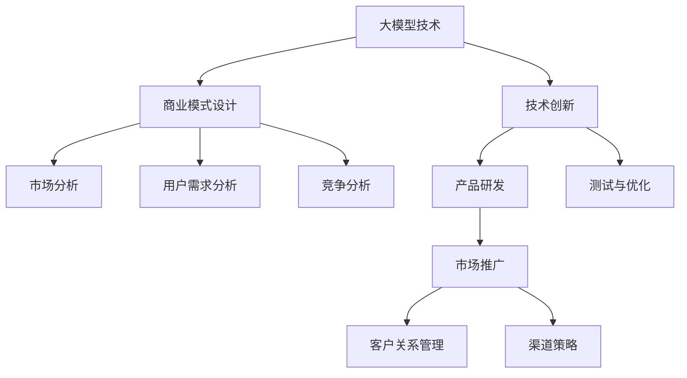

                 

关键词：商业模式，大模型，创业，路线图，策略，市场分析，技术创新，风险管理，案例研究

> 摘要：本文将深入探讨大模型创业的商业模式，从市场分析、技术创新、风险管理和案例分析等多个角度，提供一套全面、实用的创业路线图。通过阐述大模型在当今科技行业的重要性，本文旨在为有志于在这一领域创业的科技人士提供指导和建议。

## 1. 背景介绍

### 大模型的崛起

随着深度学习和人工智能技术的飞速发展，大模型成为当今科技领域的关键驱动因素。这些模型拥有庞大的参数量和复杂的架构，能够处理海量的数据，并从中提取有价值的信息。代表性的大模型包括GPT-3、BERT和ImageNet等，它们在语言生成、文本理解、图像识别等领域展现了卓越的性能。

### 商业价值的凸显

大模型不仅在学术界受到广泛关注，其在商业领域的应用也日益增多。从自然语言处理、图像识别到推荐系统，大模型能够为各类应用场景带来显著的效率和效果提升。这引发了创业者和投资者对大模型商业模式的浓厚兴趣。

### 创业的热潮

大模型技术的崛起带动了一波创业热潮。众多创业者瞄准了这一领域，试图通过创新的产品和服务，抢占市场份额。然而，成功的商业模式不仅依赖于技术优势，还需充分考虑市场环境、用户需求和风险管理等多个因素。

## 2. 核心概念与联系

### 大模型的概念与架构

大模型是指具有数百万甚至数十亿参数的深度学习模型，其架构复杂，需要大量的计算资源和数据支持。常见的架构包括Transformer、CNN和RNN等。

### 商业模式的核心要素

商业模式的核心要素包括价值主张、客户关系、渠道策略、客户获取、客户服务和客户关系管理。这些要素共同构成了企业的盈利模式，决定了企业在市场中的竞争地位。

### 商业模式与技术的互动关系

商业模式与技术的互动关系体现在以下几个方面：

- 技术创新驱动商业模式创新：随着技术的进步，新的商业模式不断涌现，如基于AI的自动化服务、个性化推荐等。
- 商业模式影响技术创新：商业模式的需求和预期效果，会影响技术的研发方向和应用场景。

### Mermaid 流程图



## 3. 核心算法原理 & 具体操作步骤

### 3.1 算法原理概述

大模型的算法原理主要包括深度学习、神经网络、优化算法等。深度学习是一种多层次的学习方式，通过逐层提取特征，实现从原始数据到高级抽象表示的转换。神经网络则是由大量神经元组成的计算模型，通过调整神经元之间的连接权重，实现对数据的拟合。优化算法则用于调整模型的参数，以最小化损失函数。

### 3.2 算法步骤详解

1. 数据收集与预处理：收集大量高质量的数据，并进行清洗、归一化等预处理操作，以供模型训练。
2. 模型设计：根据应用场景，设计合适的模型架构，如Transformer、CNN等。
3. 模型训练：利用训练数据，通过优化算法训练模型，调整参数，以最小化损失函数。
4. 模型评估：使用验证数据集评估模型性能，调整模型参数，以提高准确性。
5. 模型部署：将训练好的模型部署到生产环境中，进行实际应用。

### 3.3 算法优缺点

优点：

- 强大的表示能力：大模型能够处理复杂的任务，提取丰富的特征。
- 高效性：通过并行计算和分布式训练，提高模型训练速度。
- 自适应能力：大模型能够自适应不同的数据分布和任务场景。

缺点：

- 计算资源需求高：大模型需要大量的计算资源和数据支持。
- 难以解释：大模型的决策过程复杂，难以解释和调试。
- 数据隐私问题：大模型训练过程中涉及大量用户数据，存在数据隐私和安全问题。

### 3.4 算法应用领域

大模型在多个领域具有广泛应用，包括：

- 自然语言处理：文本生成、机器翻译、情感分析等。
- 计算机视觉：图像识别、图像生成、目标检测等。
- 推荐系统：基于内容的推荐、协同过滤等。
- 金融领域：风险管理、市场预测等。

## 4. 数学模型和公式 & 详细讲解 & 举例说明

### 4.1 数学模型构建

大模型的数学模型主要包括两部分：前向传播和反向传播。

前向传播：输入数据通过模型层层的变换，最终生成输出。

反向传播：通过计算输出与实际结果的差异，反向传播误差，更新模型参数。

### 4.2 公式推导过程

前向传播公式：

$$
Z^{[l]} = W^{[l]} \cdot A^{[l-1]} + b^{[l]}
$$

$$
A^{[l]} = \sigma(Z^{[l]})
$$

反向传播公式：

$$
\delta^{[l]} = \frac{\partial J}{\partial Z^{[l]}} \odot \delta^{[l+1]}
$$

$$
\frac{\partial J}{\partial Z^{[l]}} = \sigma'(Z^{[l]}) \odot \frac{\partial J}{\partial A^{[l+1]}}
$$

$$
\frac{\partial J}{\partial W^{[l]}} = A^{[l-1]T} \odot \delta^{[l]}
$$

$$
\frac{\partial J}{\partial b^{[l]}} = \delta^{[l]}
$$

### 4.3 案例分析与讲解

以GPT-3为例，分析其数学模型和训练过程。

GPT-3是基于Transformer架构的大模型，其训练过程主要包括：

1. 数据预处理：将文本数据转化为单词序列，并构建词汇表。
2. 模型初始化：随机初始化模型参数。
3. 训练过程：通过前向传播和反向传播，逐步调整模型参数，以最小化损失函数。
4. 模型评估：使用验证数据集评估模型性能，调整学习率和超参数。

## 5. 项目实践：代码实例和详细解释说明

### 5.1 开发环境搭建

- 硬件环境：高性能计算服务器，配备GPU。
- 软件环境：Python、TensorFlow或PyTorch等深度学习框架。

### 5.2 源代码详细实现

以下是一个简单的GPT-2模型训练的代码示例：

```python
import tensorflow as tf
from tensorflow.keras.layers import Embedding, LSTM, Dense
from tensorflow.keras.models import Sequential

# 模型架构
model = Sequential([
    Embedding(vocab_size, embedding_dim),
    LSTM(units, return_sequences=True),
    LSTM(units, return_sequences=True),
    Dense(vocab_size, activation='softmax')
])

# 模型编译
model.compile(optimizer='adam', loss='categorical_crossentropy', metrics=['accuracy'])

# 模型训练
model.fit(x_train, y_train, epochs=10, batch_size=64)
```

### 5.3 代码解读与分析

- `Embedding` 层：将单词转化为向量表示。
- `LSTM` 层：用于处理序列数据，提取特征。
- `Dense` 层：输出层，实现预测。

### 5.4 运行结果展示

运行结果会显示模型在训练集和验证集上的准确率。根据性能调整模型参数，以提高模型效果。

## 6. 实际应用场景

### 6.1 自然语言处理

大模型在自然语言处理领域具有广泛应用，如文本生成、机器翻译、情感分析等。

### 6.2 计算机视觉

大模型在计算机视觉领域同样表现出色，如图像识别、图像生成、目标检测等。

### 6.3 推荐系统

大模型可以用于推荐系统的建设，实现个性化推荐。

### 6.4 未来应用展望

随着大模型技术的不断进步，未来将在更多领域展现其应用价值，如医疗、金融、教育等。

## 7. 工具和资源推荐

### 7.1 学习资源推荐

- 《深度学习》（Goodfellow, Bengio, Courville）：系统介绍深度学习的基础知识和应用。
- 《Python深度学习》（François Chollet）：详细介绍如何使用Python和TensorFlow实现深度学习。

### 7.2 开发工具推荐

- TensorFlow：Google开源的深度学习框架，支持多种操作系统。
- PyTorch：Facebook开源的深度学习框架，易于使用和调试。

### 7.3 相关论文推荐

- "Attention Is All You Need"（Vaswani et al., 2017）：介绍Transformer架构。
- "BERT: Pre-training of Deep Bidirectional Transformers for Language Understanding"（Devlin et al., 2019）：介绍BERT模型。

## 8. 总结：未来发展趋势与挑战

### 8.1 研究成果总结

大模型技术在近年来取得了显著成果，推动了人工智能领域的发展。然而，仍有许多挑战需要克服，如计算资源需求、模型解释性、数据隐私等。

### 8.2 未来发展趋势

随着技术的不断进步，大模型将在更多领域发挥重要作用。未来发展趋势包括：

- 模型压缩与优化：提高模型效率，降低计算资源需求。
- 模型解释性：提高模型的可解释性，增强用户信任。
- 跨模态学习：整合不同类型的数据，实现更复杂的任务。

### 8.3 面临的挑战

大模型技术在发展过程中面临以下挑战：

- 计算资源需求：大模型训练需要大量计算资源，如何高效利用资源成为关键。
- 数据隐私：大模型训练过程中涉及大量用户数据，如何保护用户隐私成为重要问题。
- 模型安全：大模型可能被用于恶意攻击，如何确保模型安全成为挑战。

### 8.4 研究展望

未来研究应关注以下方向：

- 模型压缩与优化：提高模型效率，降低计算资源需求。
- 模型解释性：提高模型的可解释性，增强用户信任。
- 跨模态学习：整合不同类型的数据，实现更复杂的任务。

## 9. 附录：常见问题与解答

### 9.1 大模型训练需要哪些资源？

大模型训练需要高性能计算服务器和GPU，以及大量高质量的数据。

### 9.2 如何确保大模型的安全性？

确保大模型的安全性需要从数据保护、模型优化和监控等方面进行综合考虑。

### 9.3 大模型在医疗领域的应用有哪些？

大模型在医疗领域可以应用于疾病诊断、药物研发、健康管理等。

## 作者署名

作者：禅与计算机程序设计艺术 / Zen and the Art of Computer Programming
```

