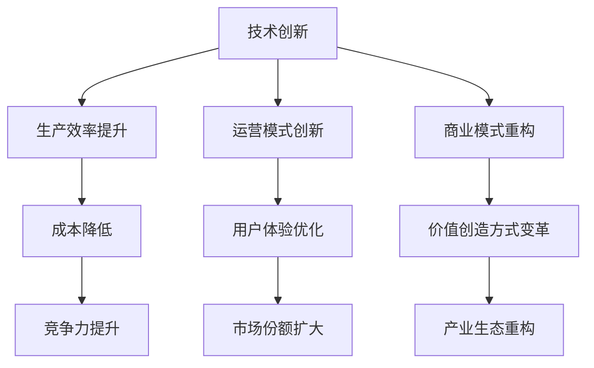
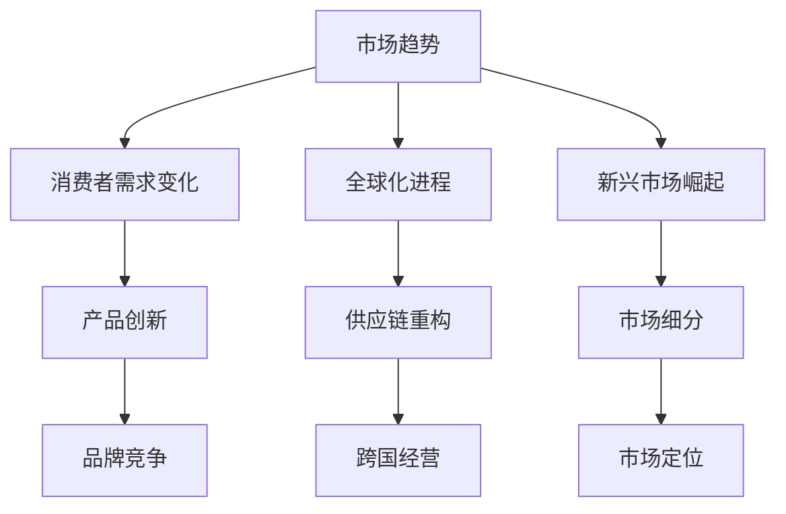
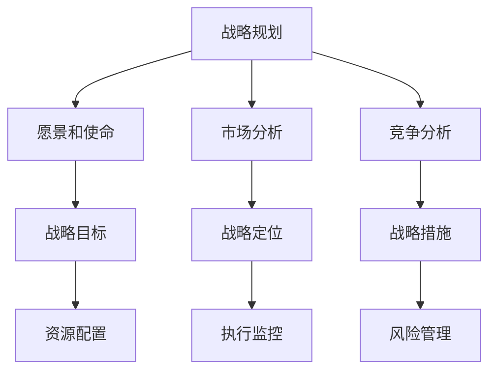
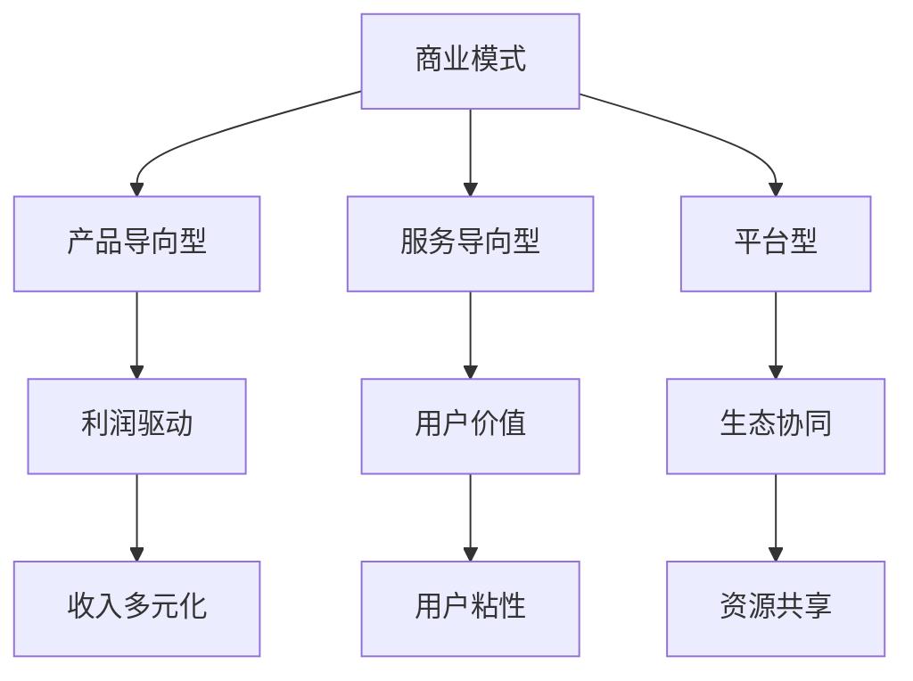

                 

关键词：商业竞争、格局变化、市场趋势、技术创新、战略规划、商业模式、产业链重构

> 摘要：本文将从技术视角深入探讨商业领域的竞争格局变化，分析市场趋势、技术创新、战略规划和商业模式的重要性，以及产业链重构对商业竞争带来的影响。通过对典型案例的分析，揭示未来商业竞争的新趋势和面临的挑战。

## 1. 背景介绍

随着科技的飞速发展，商业领域正经历着一场前所未有的变革。在过去几十年里，互联网、大数据、人工智能等技术的崛起，不仅改变了传统产业的运营模式，也重塑了市场的竞争格局。企业面临着前所未有的机遇和挑战，如何在激烈的市场竞争中脱颖而出，成为每个企业都需要深思的问题。

商业竞争格局的变化主要体现在以下几个方面：

- **技术创新**：技术的不断进步，如云计算、物联网、区块链等，正在深刻改变企业的生产方式、运营模式和商业模式。
- **市场趋势**：消费者需求的不断变化，全球化进程的加速，以及新兴市场的崛起，都在推动市场趋势的演变。
- **战略规划**：企业需要制定更加灵活和前瞻性的战略规划，以应对市场变化和竞争对手的挑战。
- **商业模式**：新的商业模式不断涌现，如共享经济、平台经济等，改变了企业的盈利方式和价值创造方式。

## 2. 核心概念与联系

### 2.1 技术创新

技术创新是驱动商业竞争格局变化的核心力量。以下是一个简单的 Mermaid 流程图，展示了技术创新在商业领域的主要应用和影响。



### 2.2 市场趋势

市场趋势的变化直接影响企业的战略决策和市场定位。以下是一个 Mermaid 流程图，展示了市场趋势对商业领域的影响。



### 2.3 战略规划

战略规划是企业应对竞争格局变化的必要手段。以下是一个 Mermaid 流程图，展示了战略规划的关键要素。



### 2.4 商业模式

商业模式的创新是企业在竞争中取得优势的关键。以下是一个 Mermaid 流程图，展示了不同类型的商业模式及其特点。



## 3. 核心算法原理 & 具体操作步骤

### 3.1 算法原理概述

在商业领域，数据分析和机器学习算法已成为制定战略规划和优化业务流程的关键工具。以下是一个简单的算法原理概述，用于说明如何通过数据分析和机器学习来优化商业决策。

- **数据收集**：从各种渠道收集企业内外部的数据，包括市场数据、销售数据、客户反馈等。
- **数据预处理**：清洗和整合数据，确保数据的质量和一致性。
- **特征工程**：提取和构建能够代表业务特征的数据变量。
- **模型选择**：根据业务目标和数据特征，选择合适的机器学习模型。
- **模型训练**：使用历史数据进行模型训练，调整模型参数。
- **模型评估**：通过交叉验证和性能指标评估模型效果。
- **模型部署**：将训练好的模型部署到生产环境中，进行实时数据分析和决策支持。

### 3.2 算法步骤详解

#### 3.2.1 数据收集

数据收集是整个数据分析过程的基础。企业可以通过以下方式收集数据：

- **内部数据**：包括销售数据、客户数据、财务数据等，通常存储在企业内部系统中。
- **外部数据**：包括市场数据、行业报告、社交媒体数据等，可以通过公开数据源获取。

#### 3.2.2 数据预处理

数据预处理是确保数据质量的关键步骤。主要任务包括：

- **数据清洗**：处理缺失值、异常值和重复数据。
- **数据整合**：将来自不同数据源的数据进行整合，确保数据的一致性。
- **数据转换**：将数据转换成适合分析的形式，如归一化、标准化等。

#### 3.2.3 特征工程

特征工程是提高模型性能的关键。主要任务包括：

- **特征提取**：从原始数据中提取具有代表性的特征。
- **特征选择**：通过筛选和评估，选择对模型性能有显著影响的特征。
- **特征构造**：通过组合和变换，构建新的特征，以提高模型的泛化能力。

#### 3.2.4 模型选择

模型选择应根据业务目标和数据特征进行。常见的机器学习模型包括：

- **监督学习模型**：如线性回归、逻辑回归、决策树、随机森林等。
- **无监督学习模型**：如聚类、降维、关联规则挖掘等。
- **深度学习模型**：如神经网络、卷积神经网络、循环神经网络等。

#### 3.2.5 模型训练

模型训练是使用历史数据来训练模型，调整模型参数的过程。训练过程中需要注意：

- **数据划分**：将数据划分为训练集和测试集，避免过拟合。
- **参数调整**：通过交叉验证和网格搜索等方法，调整模型参数，以提高模型性能。

#### 3.2.6 模型评估

模型评估是评估模型性能和可靠性的过程。常用的评估指标包括：

- **准确率**：模型预测正确的比例。
- **召回率**：模型预测为正类的实际正类比例。
- **F1 分数**：准确率和召回率的加权平均。
- **ROC 曲线和 AUC 值**：评估模型对正负样本的分类能力。

#### 3.2.7 模型部署

模型部署是将训练好的模型部署到生产环境中，进行实时数据分析和决策支持的过程。部署过程中需要注意：

- **模型解释性**：确保模型对业务决策有较好的解释性。
- **实时性能**：确保模型在实时数据上的处理能力。
- **持续优化**：根据新数据持续调整和优化模型。

### 3.3 算法优缺点

#### 3.3.1 优点

- **高效性**：通过数据分析和机器学习，可以快速发现数据中的规律和趋势，为业务决策提供有力支持。
- **灵活性**：可以根据业务需求，灵活选择和调整模型，适应不同的业务场景。
- **智能化**：利用机器学习算法，可以实现自动化和智能化的数据分析，减少人工干预。

#### 3.3.2 缺点

- **数据依赖性**：数据质量和数量直接影响模型的性能，数据缺失或错误会导致模型失效。
- **复杂性**：数据分析和机器学习过程涉及多个步骤和复杂的算法，需要专业的技术团队支持。
- **解释性挑战**：深度学习等复杂模型往往缺乏解释性，难以解释预测结果的原因。

### 3.4 算法应用领域

数据分析和机器学习算法在商业领域的应用非常广泛，主要包括：

- **市场预测**：通过分析历史销售数据和市场趋势，预测未来的销售量和市场变化。
- **客户细分**：通过分析客户数据，将客户划分为不同的群体，提供个性化的产品和服务。
- **风险管理**：通过分析财务数据和市场信息，预测潜在的风险，制定相应的风险管理策略。
- **供应链优化**：通过分析供应链数据，优化供应链流程，提高供应链的效率和灵活性。
- **运营优化**：通过分析运营数据，优化业务流程，提高生产效率和降低成本。

## 4. 数学模型和公式 & 详细讲解 & 举例说明

### 4.1 数学模型构建

在商业领域，常用的数学模型包括线性回归、逻辑回归、决策树、支持向量机等。以下是一个简单的线性回归模型构建过程。

#### 4.1.1 线性回归模型

线性回归模型的基本形式为：

$$y = \beta_0 + \beta_1 x_1 + \beta_2 x_2 + ... + \beta_n x_n + \epsilon$$

其中，$y$ 是因变量，$x_1, x_2, ..., x_n$ 是自变量，$\beta_0, \beta_1, \beta_2, ..., \beta_n$ 是模型参数，$\epsilon$ 是误差项。

#### 4.1.2 模型参数估计

模型参数估计通常使用最小二乘法（Ordinary Least Squares, OLS）：

$$\hat{\beta} = (X'X)^{-1}X'Y$$

其中，$X$ 是自变量的设计矩阵，$Y$ 是因变量的观测值，$\hat{\beta}$ 是参数估计值。

### 4.2 公式推导过程

线性回归模型的公式推导如下：

#### 4.2.1 模型设定

假设我们有 $n$ 个样本点 $(x_{i1}, x_{i2}, ..., x_{in}, y_i)$，其中 $i = 1, 2, ..., n$。

#### 4.2.2 最小化误差平方和

我们的目标是找到一组参数 $\beta_0, \beta_1, ..., \beta_n$，使得预测值 $y_i' = \beta_0 + \beta_1 x_{i1} + ... + \beta_n x_{in}$ 与实际观测值 $y_i$ 的误差平方和最小。

$$SSQ = \sum_{i=1}^{n} (y_i - y_i')^2$$

#### 4.2.3 求导数

对 $SSQ$ 关于 $\beta_0, \beta_1, ..., \beta_n$ 分别求导数，并令导数为零，得到：

$$\frac{\partial SSQ}{\partial \beta_0} = -2 \sum_{i=1}^{n} (y_i - y_i') = 0$$

$$\frac{\partial SSQ}{\partial \beta_1} = -2 \sum_{i=1}^{n} (y_i - y_i') x_{i1} = 0$$

...

$$\frac{\partial SSQ}{\partial \beta_n} = -2 \sum_{i=1}^{n} (y_i - y_i') x_{in} = 0$$

#### 4.2.4 解方程组

将上述方程组化简，得到：

$$\sum_{i=1}^{n} y_i = \sum_{i=1}^{n} y_i'$$

$$\sum_{i=1}^{n} y_i x_{i1} = \sum_{i=1}^{n} y_i' x_{i1}$$

...

$$\sum_{i=1}^{n} y_i x_{in} = \sum_{i=1}^{n} y_i' x_{in}$$

将 $y_i'$ 替换为 $\beta_0 + \beta_1 x_{i1} + ... + \beta_n x_{in}$，得到：

$$\sum_{i=1}^{n} y_i = \sum_{i=1}^{n} (\beta_0 + \beta_1 x_{i1} + ... + \beta_n x_{in})$$

$$\sum_{i=1}^{n} y_i x_{i1} = \sum_{i=1}^{n} (\beta_0 + \beta_1 x_{i1} + ... + \beta_n x_{in}) x_{i1}$$

...

$$\sum_{i=1}^{n} y_i x_{in} = \sum_{i=1}^{n} (\beta_0 + \beta_1 x_{i1} + ... + \beta_n x_{in}) x_{in}$$

化简上述方程组，得到：

$$n \beta_0 + \sum_{i=1}^{n} x_{i1} \beta_1 + ... + \sum_{i=1}^{n} x_{in} \beta_n = \sum_{i=1}^{n} y_i$$

$$\sum_{i=1}^{n} x_{i1} \beta_1 + ... + \sum_{i=1}^{n} x_{in} \beta_n = \sum_{i=1}^{n} x_{i1} y_i$$

...

$$\sum_{i=1}^{n} x_{i1} \beta_n + ... + \sum_{i=1}^{n} x_{in} \beta_n = \sum_{i=1}^{n} x_{in} y_i$$

将上述方程组写成矩阵形式，得到：

$$X'X \beta = X'Y$$

其中，$X$ 是自变量的设计矩阵，$Y$ 是因变量的观测值，$\beta$ 是参数向量。

#### 4.2.5 求解参数

使用矩阵求逆，得到：

$$\beta = (X'X)^{-1}X'Y$$

### 4.3 案例分析与讲解

#### 4.3.1 案例背景

某公司销售部门希望预测下一季度的销售额，以便制定销售计划和库存管理策略。公司收集了过去五年的季度销售额数据，以及影响销售额的一些因素，如广告支出、促销活动、市场趋势等。

#### 4.3.2 数据预处理

- **数据清洗**：检查数据是否存在缺失值、异常值和重复值，并进行处理。
- **数据转换**：将类别变量转换为数值变量，如将广告支出、促销活动等转换为二进制变量。
- **数据标准化**：对数值变量进行归一化或标准化处理，以便于模型训练。

#### 4.3.3 特征工程

- **特征提取**：根据业务经验和数据特征，提取对销售额有显著影响的特征，如广告支出、促销活动等。
- **特征选择**：使用信息增益、卡方检验等方法，选择对销售额有显著影响的特征。

#### 4.3.4 模型训练

- **模型选择**：选择线性回归模型作为预测模型。
- **模型训练**：使用历史数据进行模型训练，调整模型参数。

#### 4.3.5 模型评估

- **交叉验证**：使用交叉验证方法，评估模型在训练集和测试集上的性能。
- **性能指标**：计算模型的均方误差（Mean Squared Error, MSE）、均方根误差（Root Mean Squared Error, RMSE）等性能指标。

#### 4.3.6 模型部署

- **模型解释性**：分析模型对销售额的预测结果，了解影响销售额的主要因素。
- **模型部署**：将训练好的模型部署到生产环境中，进行实时销售额预测。

## 5. 项目实践：代码实例和详细解释说明

### 5.1 开发环境搭建

- **编程语言**：Python
- **数据分析库**：Pandas、NumPy、Scikit-learn
- **可视化库**：Matplotlib、Seaborn

### 5.2 源代码详细实现

```python
import pandas as pd
import numpy as np
from sklearn.linear_model import LinearRegression
from sklearn.model_selection import train_test_split
from sklearn.metrics import mean_squared_error

# 数据加载
data = pd.read_csv('sales_data.csv')

# 数据预处理
# 数据清洗、转换、标准化等操作...

# 特征工程
# 特征提取、选择等操作...

# 数据划分
X = data[['广告支出', '促销活动', '市场趋势']]
y = data['销售额']
X_train, X_test, y_train, y_test = train_test_split(X, y, test_size=0.2, random_state=42)

# 模型训练
model = LinearRegression()
model.fit(X_train, y_train)

# 模型评估
y_pred = model.predict(X_test)
mse = mean_squared_error(y_test, y_pred)
rmse = np.sqrt(mse)
print(f'MSE: {mse}, RMSE: {rmse}')

# 模型解释性
print(f'Coefficients: {model.coef_}')
print(f'Intercept: {model.intercept_}')

# 模型部署
# 将模型部署到生产环境中，进行实时销售额预测...
```

### 5.3 代码解读与分析

- **数据加载**：使用 Pandas 库读取数据，并将其存储为 DataFrame 对象。
- **数据预处理**：对数据进行清洗、转换和标准化等操作，以确保数据质量。
- **特征工程**：根据业务需求和数据特征，提取和选择对销售额有显著影响的特征。
- **数据划分**：将数据划分为训练集和测试集，用于模型训练和评估。
- **模型训练**：使用线性回归模型对训练数据进行训练，得到模型参数。
- **模型评估**：使用测试数据评估模型性能，计算均方误差（MSE）和均方根误差（RMSE）等性能指标。
- **模型解释性**：分析模型参数，了解影响销售额的主要因素。
- **模型部署**：将训练好的模型部署到生产环境中，进行实时销售额预测。

## 6. 实际应用场景

### 6.1 市场预测

市场预测是企业制定战略规划和业务决策的重要依据。通过数据分析和机器学习算法，企业可以预测未来的市场需求、销售趋势和竞争态势，从而制定更有针对性的市场策略。

#### 案例分析

某家电企业通过收集历史销售数据、市场趋势数据和相关行业数据，利用线性回归和决策树算法进行市场预测。通过对不同算法的对比和评估，企业选择了决策树算法，并成功预测了未来三个季度的销售额。根据预测结果，企业调整了生产计划和库存管理策略，有效降低了库存成本，提高了市场竞争力。

### 6.2 客户细分

客户细分是精准营销和个性化服务的基础。通过数据分析和机器学习算法，企业可以分析客户特征和行为，将客户划分为不同的群体，提供个性化的产品和服务。

#### 案例分析

某电商企业通过收集客户购买行为、浏览行为和社交媒体互动数据，利用聚类算法和关联规则挖掘算法对客户进行细分。通过对不同细分群体的行为分析和偏好分析，企业制定了个性化的营销策略，提高了客户满意度和复购率。

### 6.3 风险管理

风险管理是企业运营的重要环节。通过数据分析和机器学习算法，企业可以预测潜在的风险，制定相应的风险管理策略，降低风险损失。

#### 案例分析

某金融企业通过收集客户信用记录、交易记录和社交媒体数据，利用逻辑回归和支持向量机算法进行信用风险评估。通过对客户信用风险的预测和评估，企业制定了相应的信用政策和风险控制措施，降低了信用风险损失。

## 7. 未来应用展望

随着科技的不断进步，商业领域的竞争格局将继续发生变化。以下是一些未来应用展望：

- **人工智能**：人工智能技术将在商业领域得到更广泛的应用，如智能客服、智能供应链管理、智能工厂等。
- **区块链**：区块链技术将改变企业的运营模式和商业模式，如去中心化的交易系统、智能合约等。
- **物联网**：物联网技术将实现设备之间的互联互通，提高企业的生产效率和管理水平。
- **5G**：5G技术的普及将推动物联网、人工智能等技术的发展，为商业领域带来新的机遇和挑战。

## 8. 工具和资源推荐

### 8.1 学习资源推荐

- **书籍**：《Python数据分析实战》、《机器学习实战》、《深度学习》
- **在线课程**：Coursera、Udacity、edX 等平台上的相关课程
- **论坛和社区**：Stack Overflow、GitHub、Reddit 等

### 8.2 开发工具推荐

- **编程语言**：Python、R、Java
- **数据分析库**：Pandas、NumPy、Scikit-learn、TensorFlow、PyTorch
- **可视化库**：Matplotlib、Seaborn、Plotly

### 8.3 相关论文推荐

- **论文集**：《人工智能应用与展望》、《大数据分析技术与应用》、《区块链技术与应用》
- **期刊**：《计算机科学》、《数据挖掘》、《人工智能学报》

## 9. 总结：未来发展趋势与挑战

### 9.1 研究成果总结

本文通过对商业领域竞争格局变化的深入分析，揭示了技术创新、市场趋势、战略规划和商业模式创新在商业领域的重要性。同时，本文介绍了数据分析和机器学习算法在商业领域中的应用，并通过案例分析和代码实例，展示了如何利用技术手段优化商业决策。

### 9.2 未来发展趋势

- **技术融合**：不同技术之间的融合将推动商业领域的创新，如人工智能与物联网、区块链与大数据等。
- **数据驱动**：数据将成为企业最重要的资产，数据分析和机器学习算法将在商业决策中发挥更大作用。
- **平台化**：平台经济将成为企业竞争的主要形式，企业将专注于核心业务，通过平台整合外部资源。

### 9.3 面临的挑战

- **数据隐私**：随着数据应用的普及，数据隐私和安全问题将越来越重要。
- **算法解释性**：复杂的算法和模型往往缺乏解释性，如何提高算法的可解释性是一个重要挑战。
- **技术人才**：随着技术应用的普及，对技术人才的需求将越来越大，企业需要加大人才培养和引进力度。

### 9.4 研究展望

- **技术发展**：继续关注人工智能、区块链、物联网等前沿技术的发展趋势，探索其在商业领域的应用潜力。
- **跨学科研究**：加强跨学科研究，结合经济学、管理学、社会学等多学科知识，推动商业领域的创新。
- **政策研究**：关注相关政策法规的制定和实施，为企业提供良好的发展环境。

## 10. 附录：常见问题与解答

### 10.1 问题 1

**问题**：如何确保数据的质量和一致性？

**解答**：确保数据质量的一致性需要从数据源、数据收集、数据存储等各个环节进行控制。具体措施包括：

- **数据源控制**：选择可靠的数据源，对数据源的可靠性和权威性进行评估。
- **数据收集**：制定详细的数据收集规范，确保数据的完整性和准确性。
- **数据存储**：使用数据库管理系统，对数据进行分类、存储和管理，确保数据的一致性和完整性。

### 10.2 问题 2

**问题**：如何选择合适的机器学习模型？

**解答**：选择合适的机器学习模型需要考虑业务目标和数据特征。以下是一些选择模型的建议：

- **业务目标**：根据业务目标，确定需要解决的问题类型，如分类、回归、聚类等。
- **数据特征**：分析数据特征，确定数据类型（数值型、类别型等）和数据分布情况。
- **模型性能**：通过交叉验证和模型评估方法，评估不同模型的性能，选择性能最佳的模型。

### 10.3 问题 3

**问题**：如何提高模型的可解释性？

**解答**：提高模型的可解释性是机器学习领域的一个重要挑战。以下是一些提高模型可解释性的方法：

- **模型选择**：选择具有较高解释性的模型，如线性回归、决策树等。
- **模型可视化**：使用可视化工具，如热力图、决策树图等，展示模型的工作原理和内部结构。
- **特征重要性分析**：分析特征对模型预测的影响，确定关键特征，提高模型的可解释性。
- **模型解释性工具**：使用模型解释性工具，如 LIME、SHAP 等，分析模型对每个样本的预测原因。

----------------------------------------------------------------

以上是本文的完整内容，希望对您在商业领域的竞争格局变化方面提供一些有价值的见解和思考。如果您有任何疑问或建议，请随时留言，我会尽快回复您。作者：禅与计算机程序设计艺术 / Zen and the Art of Computer Programming。

