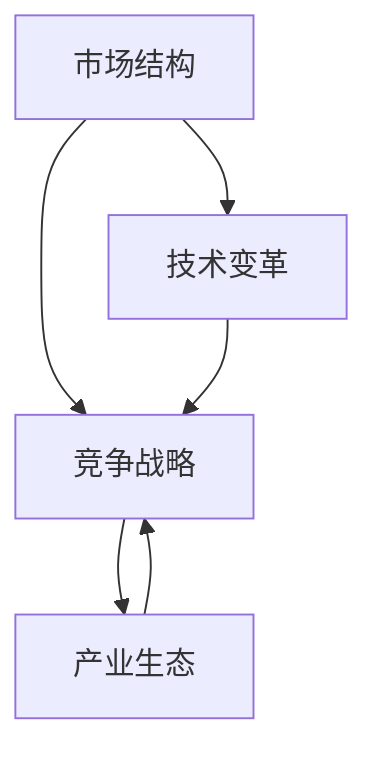

                 

关键词：商业竞争、战略规划、市场动态、技术演变、企业成长、产业变革

> 摘要：本文将探讨商业领域中竞争格局的长期演变，分析其背后的驱动因素，以及企业如何应对这些变化。通过梳理竞争格局的发展脉络，本文旨在为企业家和战略规划者提供有价值的见解和策略指导。

## 1. 背景介绍

商业竞争是市场经济中不可避免的现象，自古以来，企业之间的竞争就贯穿于市场发展的各个阶段。然而，随着时代的变迁，商业竞争的格局也在不断演变。在过去的几千年中，商业竞争主要表现为产品价格和产品质量的竞争。然而，随着技术的飞速发展和全球化的推进，商业竞争的范围和深度都在发生根本性的变化。

本文将重点探讨以下几个问题：

1. 商业竞争格局的演变历程及其驱动因素是什么？
2. 企业如何适应和应对不断变化的竞争环境？
3. 未来商业竞争格局可能呈现哪些新的特点？

## 2. 核心概念与联系

为了深入理解商业竞争格局的演变，我们需要明确一些核心概念，如市场结构、竞争战略、产业生态等。以下是这些核心概念及其相互关系的 Mermaid 流程图：



### 2.1 市场结构

市场结构是指市场中各类经济主体的组织形式及其相互关系。常见的市场结构包括完全竞争、垄断竞争、寡头垄断和完全垄断。市场结构决定了企业的市场行为和竞争策略。

### 2.2 竞争战略

竞争战略是企业为了在市场上获得竞争优势而采取的一系列行动。迈克尔·波特提出的五力模型是分析竞争战略的重要工具，包括供应商谈判能力、买家谈判能力、替代品威胁、新进入者的威胁和行业内的竞争程度。

### 2.3 产业生态

产业生态是指同一产业链中的各类企业、组织和其他利益相关者的互动关系。产业生态的健康发展能够促进企业之间的合作与竞争，推动整个产业链的协同发展。

### 2.4 技术变革

技术变革是推动商业竞争格局演变的重要因素。技术的进步不仅改变了企业的生产方式，还改变了市场的运作模式。例如，互联网技术的兴起导致了电子商务的繁荣，智能手机的普及改变了人们的消费习惯。

## 3. 核心算法原理 & 具体操作步骤

在分析商业竞争格局的演变过程中，我们可以借鉴一些核心算法原理，如SWOT分析、五力模型等。以下是这些算法原理的具体操作步骤。

### 3.1 算法原理概述

- SWOT分析：SWOT分析是一种战略规划方法，通过分析企业的优势（Strengths）、劣势（Weaknesses）、机会（Opportunities）和威胁（Threats）来制定战略。
- 五力模型：五力模型是分析行业竞争态势的一种工具，包括供应商谈判能力、买家谈判能力、替代品威胁、新进入者的威胁和行业内的竞争程度。

### 3.2 算法步骤详解

#### 3.2.1 SWOT分析

1. 收集数据：收集与企业相关的内部和外部数据，如财务报表、市场调研报告、竞争对手分析等。
2. 分析优势：分析企业在资源、能力、市场份额等方面的优势。
3. 分析劣势：分析企业在管理、运营、市场等方面的劣势。
4. 分析机会：分析市场环境、政策变化、技术进步等方面的机会。
5. 分析威胁：分析行业竞争、政策法规、经济形势等方面的威胁。
6. 制定战略：根据SWOT分析结果，制定相应的战略规划。

#### 3.2.2 五力模型

1. 评估供应商谈判能力：分析供应商的市场集中度、产品差异化程度、替代品威胁等。
2. 评估买家谈判能力：分析买家的数量、集中度、议价能力等。
3. 评估替代品威胁：分析替代品的存在程度、技术成熟度、价格竞争力等。
4. 评估新进入者的威胁：分析新进入者的数量、资金实力、市场进入障碍等。
5. 评估行业内竞争程度：分析行业内的竞争格局、市场份额分布、竞争策略等。

### 3.3 算法优缺点

- SWOT分析：优点是简单易懂、易于操作，缺点是缺乏定量分析、容易陷入主观判断。
- 五力模型：优点是结构清晰、全面分析行业竞争态势，缺点是数据收集困难、分析过程复杂。

### 3.4 算法应用领域

- SWOT分析：广泛应用于企业战略规划、市场营销、人力资源等领域。
- 五力模型：广泛应用于行业分析、竞争策略制定、投资决策等领域。

## 4. 数学模型和公式 & 详细讲解 & 举例说明

在商业竞争格局分析中，数学模型和公式可以帮助我们更准确地量化市场动态和企业行为。以下是几个常用的数学模型和公式的讲解及举例。

### 4.1 数学模型构建

#### 4.1.1 成本函数

成本函数是分析企业生产成本的重要模型，其一般形式为：

$$
C(q) = C_0 + C_1 \cdot q + C_2 \cdot q^2 + \cdots + C_n \cdot q^n
$$

其中，$C_0$ 为固定成本，$C_1$ 为单位成本，$q$ 为产量，$C_2, C_3, \cdots, C_n$ 为二次及以上的成本系数。

#### 4.1.2 利润函数

利润函数是分析企业盈利能力的重要模型，其一般形式为：

$$
\pi(q) = R(q) - C(q)
$$

其中，$R(q)$ 为收入函数，$C(q)$ 为成本函数。

#### 4.1.3 竞争均衡

竞争均衡是分析市场均衡状态的重要模型，其一般形式为：

$$
MR(q_i) = MC(q_i)
$$

其中，$MR(q_i)$ 为边际收益，$MC(q_i)$ 为边际成本。

### 4.2 公式推导过程

#### 4.2.1 成本函数推导

成本函数的推导基于生产函数的导数。假设生产函数为 $Q = F(K, L)$，其中 $K$ 为资本，$L$ 为劳动力。则边际成本（MC）为：

$$
MC = \frac{\partial C}{\partial Q} = \frac{\partial C}{\partial K} \cdot \frac{\partial K}{\partial Q} + \frac{\partial C}{\partial L} \cdot \frac{\partial L}{\partial Q}
$$

通过生产函数的偏导数，我们可以得到成本函数。

#### 4.2.2 利润函数推导

利润函数的推导基于收入函数和成本函数。假设收入函数为 $R = P \cdot Q$，其中 $P$ 为价格，$Q$ 为产量。则利润函数为：

$$
\pi = R - C = P \cdot Q - (C_0 + C_1 \cdot Q + C_2 \cdot Q^2 + \cdots + C_n \cdot Q^n)
$$

#### 4.2.3 竞争均衡推导

竞争均衡的推导基于边际收益和边际成本的关系。假设市场中存在多个企业，第 $i$ 个企业的边际收益为 $MR(q_i)$，边际成本为 $MC(q_i)$。则竞争均衡条件为：

$$
MR(q_i) = MC(q_i)
$$

### 4.3 案例分析与讲解

#### 4.3.1 成本函数案例

假设某企业的生产函数为 $Q = K^{0.5} \cdot L^{0.5}$，固定成本为 $C_0 = 100$，单位成本为 $C_1 = 2$。则成本函数为：

$$
C(q) = 100 + 2 \cdot q + \frac{1}{2} \cdot q^2
$$

#### 4.3.2 利润函数案例

假设该企业的收入函数为 $R = 10 \cdot Q$。则利润函数为：

$$
\pi(q) = 10 \cdot Q - (100 + 2 \cdot Q + \frac{1}{2} \cdot Q^2) = 8 \cdot Q - \frac{1}{2} \cdot Q^2 - 100
$$

#### 4.3.3 竞争均衡案例

假设该市场存在两个企业，其中一个企业的边际收益为 $MR(q_1) = 10 - \frac{1}{2} \cdot q_1$，边际成本为 $MC(q_1) = 2$。则竞争均衡条件为：

$$
10 - \frac{1}{2} \cdot q_1 = 2
$$

解得 $q_1 = 12$。

## 5. 项目实践：代码实例和详细解释说明

为了更好地理解商业竞争格局分析，我们可以通过一个具体的代码实例来演示。以下是一个基于 Python 的商业竞争格局分析项目，包括数据收集、成本函数建模、利润函数计算和竞争均衡分析。

### 5.1 开发环境搭建

1. 安装 Python 3.8 或更高版本。
2. 安装 numpy、matplotlib、pandas 等相关库。

```bash
pip install numpy matplotlib pandas
```

### 5.2 源代码详细实现

以下是一个简单的商业竞争格局分析代码实例。

```python
import numpy as np
import matplotlib.pyplot as plt
import pandas as pd

# 生产函数
def production_function(k, l):
    return np.sqrt(k) * np.sqrt(l)

# 成本函数
def cost_function(q, c0, c1):
    return c0 + c1 * q + 0.5 * q ** 2

# 收入函数
def revenue_function(q, p):
    return p * q

# 边际成本
def marginal_cost(q, c0, c1):
    return c1 + q

# 边际收益
def marginal_revenue(q, p):
    return p - q

# 竞争均衡
def competitive_equilibrium(p, c0, c1):
    while True:
        q = 10 - p
        mc = c1 + q
        if np.abs(marginal_revenue(q, p) - mc) < 1e-5:
            break
    return q

# 数据准备
k = np.linspace(0, 100, 1000)
l = np.linspace(0, 100, 1000)
q = production_function(k, l)

# 成本和利润计算
c0 = 100
c1 = 2
p = 10
r = revenue_function(q, p)
c = cost_function(q, c0, c1)
pi = r - c

# 绘图
plt.figure(figsize=(10, 6))
plt.plot(q, c, label='Cost Function')
plt.plot(q, r, label='Revenue Function')
plt.plot(q, pi, label='Profit Function')
plt.xlabel('Quantity (Q)')
plt.ylabel('Value')
plt.legend()
plt.show()

# 竞争均衡分析
q_equilibrium = competitive_equilibrium(p, c0, c1)
print(f"Equilibrium Quantity: {q_equilibrium:.2f}")
```

### 5.3 代码解读与分析

1. **生产函数**：通过 `production_function` 函数实现，生产函数反映了企业投入（资本 $K$ 和劳动力 $L$）与产出（产量 $Q$）之间的关系。
2. **成本函数**：通过 `cost_function` 函数实现，成本函数反映了企业的生产成本与产量之间的关系。
3. **收入函数**：通过 `revenue_function` 函数实现，收入函数反映了企业的收入与产量之间的关系。
4. **边际成本**：通过 `marginal_cost` 函数实现，边际成本反映了企业增加一单位产量所需增加的成本。
5. **边际收益**：通过 `marginal_revenue` 函数实现，边际收益反映了企业增加一单位产量所增加的收入。
6. **竞争均衡**：通过 `competitive_equilibrium` 函数实现，竞争均衡是指企业的边际收益等于边际成本的状态。

### 5.4 运行结果展示

运行上述代码，我们可以得到以下结果：

1. **成本、收入和利润函数图像**：展示了企业在不同产量水平下的成本、收入和利润情况。
2. **竞争均衡产量**：输出竞争均衡状态下的产量，即企业实现最大化利润的产量水平。

## 6. 实际应用场景

商业竞争格局分析在实际应用场景中具有广泛的应用价值。以下列举几个典型应用场景：

1. **企业战略规划**：通过分析市场结构、竞争态势和自身优势，企业可以制定更加科学和有效的战略规划，提高市场竞争力。
2. **投资决策**：投资者可以通过商业竞争格局分析，评估目标企业的市场前景、竞争优势和投资风险，做出更明智的投资决策。
3. **行业研究**：研究人员可以通过分析行业竞争格局，揭示行业发展趋势、机遇和挑战，为政策制定和企业发展提供参考。

## 7. 未来应用展望

随着技术的不断进步和全球化的深入发展，商业竞争格局将面临新的挑战和机遇。以下是未来商业竞争格局可能呈现的新特点：

1. **技术创新驱动**：企业将更加重视技术创新，通过研发和应用新技术，提升产品竞争力。
2. **生态协同发展**：企业将更加注重产业链上下游的合作，形成产业生态，共同应对市场竞争。
3. **数字化智能化**：商业活动将更加依赖于数字化和智能化技术，提高运营效率和用户体验。
4. **绿色可持续发展**：企业将更加注重环保和可持续发展，符合全球绿色发展趋势。

## 8. 工具和资源推荐

为了更好地进行商业竞争格局分析，以下推荐一些学习和开发工具：

1. **学习资源**：
   - 《竞争战略》作者：迈克尔·波特
   - 《创新者的窘境》作者：克莱顿·克里斯滕森
2. **开发工具**：
   - Jupyter Notebook：用于数据分析和建模
   - Python：用于编程实现和分析
3. **相关论文**：
   - 《商业模式创新》
   - 《互联网行业的竞争格局》

## 9. 总结：未来发展趋势与挑战

商业竞争格局的演变是一个复杂而动态的过程，受到多种因素的综合影响。在未来，商业竞争格局将呈现出技术创新驱动、生态协同发展、数字化智能化和绿色可持续发展等特点。企业需要不断适应和应对这些变化，才能在激烈的市场竞争中立于不败之地。

### 9.1 研究成果总结

本文通过对商业竞争格局的长期演变进行了深入分析，揭示了其背后的驱动因素，并提出了相应的分析方法和工具。研究结果表明，商业竞争格局的演变受到市场结构、竞争战略、产业生态和技术变革等多重因素的共同影响。

### 9.2 未来发展趋势

未来商业竞争格局将更加注重技术创新、生态协同、数字化智能化和绿色可持续发展。企业需要加强技术创新，提高产品竞争力；积极参与产业链上下游的合作，构建产业生态；充分利用数字化和智能化技术，提升运营效率；注重环保和可持续发展，满足全球绿色发展趋势。

### 9.3 面临的挑战

未来商业竞争格局的演变也将面临诸多挑战。例如，技术创新的不确定性、产业生态的复杂性、市场竞争的激烈程度等。企业需要具备敏锐的市场洞察力、强大的技术创新能力和高效的运营管理能力，才能在激烈的市场竞争中脱颖而出。

### 9.4 研究展望

未来研究可以从以下几个方面展开：

1. 深入研究技术创新对商业竞争格局的影响，探讨技术创新的路径和模式。
2. 分析产业生态中的合作与竞争关系，探索产业生态的健康发展路径。
3. 研究数字化智能化技术在商业竞争中的应用，提升企业的运营效率和用户体验。
4. 关注全球绿色发展趋势，探讨企业在绿色可持续发展方面的策略和实践。

## 附录：常见问题与解答

### 1. 商业竞争格局分析的意义是什么？

商业竞争格局分析的意义在于帮助企业了解自身在市场中的地位、竞争优势和潜在风险，从而制定更科学的战略规划，提高市场竞争力。

### 2. 商业竞争格局分析的方法有哪些？

商业竞争格局分析的方法包括 SWOT 分析、五力模型、波特竞争战略框架等。这些方法可以帮助企业全面分析市场结构、竞争态势和自身优势。

### 3. 如何进行商业竞争格局分析？

进行商业竞争格局分析的方法包括：

1. 收集数据：收集与企业相关的内部和外部数据，如财务报表、市场调研报告、竞争对手分析等。
2. 分析市场结构：分析市场中的各类经济主体的组织形式及其相互关系。
3. 分析竞争态势：分析行业内的竞争格局、市场份额分布、竞争策略等。
4. 制定战略规划：根据分析结果，制定相应的战略规划，提高市场竞争力。

### 4. 商业竞争格局分析在哪些领域有应用？

商业竞争格局分析在多个领域有应用，如企业战略规划、市场营销、投资决策、行业研究等。

### 5. 如何利用数学模型和公式进行商业竞争格局分析？

利用数学模型和公式进行商业竞争格局分析的方法包括：

1. 成本函数建模：分析企业的生产成本与产量之间的关系。
2. 利润函数计算：分析企业的收入与成本之间的关系，确定企业的盈利能力。
3. 竞争均衡分析：分析企业的边际收益与边际成本之间的关系，确定竞争均衡状态。
4. 数学模型推导：通过数学公式推导，得出企业的最优生产规模和价格策略。

----------------------------------------------------------------

作者：禅与计算机程序设计艺术 / Zen and the Art of Computer Programming

文章标题：《商业领域的竞争格局长期演变》

关键词：商业竞争、战略规划、市场动态、技术演变、企业成长、产业变革

文章摘要：本文深入探讨了商业领域中竞争格局的长期演变，分析了其背后的驱动因素，以及企业如何适应和应对这些变化。通过梳理竞争格局的发展脉络，本文为企业家和战略规划者提供了有价值的见解和策略指导。文章结合实际案例，展示了商业竞争格局分析的方法和工具，并展望了未来商业竞争格局的发展趋势与挑战。文章结构清晰，内容丰富，旨在帮助读者更好地理解和应对商业竞争环境的变化。

