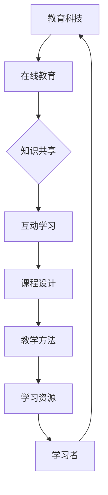

                 

关键词：学习型社区、系统课程服务、技术培训、知识共享、在线教育、技能提升、教育科技、互动学习、课程设计、学习效果评估

> 摘要：本文将探讨如何围绕特定主题构建一个学习型社区，并提供系统化的课程服务。通过分析核心概念、算法原理、数学模型以及项目实践，我们将为读者提供一种全新的学习体验，并探索其在实际应用中的潜力和未来发展方向。

## 1. 背景介绍

在信息爆炸和知识更新的时代，学习型社区的概念日益重要。学习型社区不仅是一个知识的汇聚地，更是一个促进知识共享和互动学习的平台。随着在线教育的兴起，越来越多的学习者希望通过社区获得系统化的课程服务，从而提升自己的专业技能。

然而，构建一个高效、实用的学习型社区并非易事。它需要考虑多个方面，包括课程设计、教学方法、学习资源、社区管理以及学习效果评估等。本文将围绕这些关键要素，探讨如何实现一个具备高度实用性和互动性的学习型社区。

## 2. 核心概念与联系

构建学习型社区，首先需要理解以下几个核心概念：

### 2.1 教育科技

教育科技（EdTech）是指将信息技术应用于教育过程中，以提升教学效果和学习体验。它包括在线课程、虚拟现实、人工智能、大数据分析等新兴技术。

### 2.2 在线教育

在线教育是指通过互联网进行的教育活动，它为学习者提供了灵活、便捷的学习方式。在线教育平台如 Coursera、edX 等已经成为学习者获取专业知识和技能的重要渠道。

### 2.3 知识共享

知识共享是指将个人的知识、经验和见解与他人分享，以实现共同进步。在社区中，知识共享是促进学习的重要方式。

### 2.4 互动学习

互动学习强调学习者之间的互动，通过讨论、问答、协作等方式，增强学习的深度和效果。

### 2.5 课程设计

课程设计是学习型社区的核心。一个成功的课程应该具有明确的目标、合理的内容结构、多样的教学方法以及有效的学习评估。

以下是构建学习型社区的核心概念和联系：

```
+--------------+     +---------------+     +---------------------+
| 教育科技     | --> | 在线教育      | --> | 知识共享 & 互动学习 |
+--------------+     +---------------+     +---------------------+
        ↑                        ↑                             ↑
        |                        |                             |
+-------+-------+  +------------+  +-------------------------+
| 学习者 | 学习者 |  | 学习资源   |  | 课程设计 & 教学方法   |
+-------+-------+  +------------+  +-------------------------+
```

### 2.6 Mermaid 流程图

以下是一个简化的 Mermaid 流程图，展示了学习型社区的核心概念和联系：



## 3. 核心算法原理 & 具体操作步骤

### 3.1 算法原理概述

学习型社区的核心算法包括课程推荐算法、学习效果评估算法以及社区管理算法。以下是对这些算法的简要概述：

#### 3.1.1 课程推荐算法

课程推荐算法是学习型社区的核心功能之一。它通过分析学习者的学习历史、兴趣爱好以及课程内容，为学习者推荐合适的课程。常用的推荐算法包括协同过滤、基于内容的推荐和混合推荐等。

#### 3.1.2 学习效果评估算法

学习效果评估算法用于衡量学习者在课程学习过程中的掌握程度。它通过测试、作业、讨论等多种方式收集学习数据，并利用统计学和机器学习技术对学习效果进行评估。

#### 3.1.3 社区管理算法

社区管理算法用于确保社区中的讨论、问答等互动活动的有序进行。它通过关键词过滤、行为分析等技术，识别并处理不当行为，维护社区秩序。

### 3.2 算法步骤详解

#### 3.2.1 课程推荐算法

1. **数据收集**：收集学习者的学习历史、兴趣标签、课程内容等信息。
2. **特征提取**：对收集到的数据进行预处理和特征提取，如文本向量化、用户-课程矩阵构建等。
3. **模型训练**：利用机器学习技术，如协同过滤、决策树、神经网络等，训练课程推荐模型。
4. **推荐生成**：根据学习者的特征和模型预测，生成课程推荐列表。

#### 3.2.2 学习效果评估算法

1. **测试设计**：设计多种类型的测试，如选择题、填空题、编程题等，以全面评估学习效果。
2. **数据收集**：收集学习者的测试成绩、作业完成情况、讨论参与度等数据。
3. **模型训练**：利用统计学和机器学习技术，如回归分析、分类算法等，训练学习效果评估模型。
4. **效果评估**：根据模型预测结果，评估学习者的学习效果。

#### 3.2.3 社区管理算法

1. **关键词过滤**：使用自然语言处理技术，识别并过滤不当言论、敏感词汇等。
2. **行为分析**：分析用户行为，如发帖频率、评论数量、回复速度等，识别潜在的不当行为。
3. **处理不当行为**：根据分析结果，对不当行为进行警告、限制访问等处理。

### 3.3 算法优缺点

#### 3.3.1 课程推荐算法

**优点**：

- 提高学习效率，帮助学习者快速找到合适的课程。
- 增强学习体验，让学习者感到课程内容更加个性化和相关。

**缺点**：

- 推荐结果可能存在偏差，影响学习者的学习效果。
- 数据隐私和安全问题。

#### 3.3.2 学习效果评估算法

**优点**：

- 全面、客观地评估学习者的学习效果。
- 为课程设计和教学方法提供依据。

**缺点**：

- 评估结果可能受测试设计、数据质量等因素影响。
- 无法完全反映学习者的实际能力。

#### 3.3.3 社区管理算法

**优点**：

- 维护社区秩序，提高学习体验。
- 保障社区安全和用户隐私。

**缺点**：

- 可能对正常讨论产生限制。
- 需要持续优化和更新算法，以应对新的挑战。

### 3.4 算法应用领域

课程推荐算法、学习效果评估算法和社区管理算法广泛应用于在线教育、职业培训、终身学习等领域。随着教育科技的不断发展，这些算法将在更广泛的场景中发挥重要作用。

## 4. 数学模型和公式 & 详细讲解 & 举例说明

### 4.1 数学模型构建

在构建学习型社区的过程中，数学模型起着至关重要的作用。以下是一些常用的数学模型及其构建方法：

#### 4.1.1 用户-课程矩阵

用户-课程矩阵是一个二维矩阵，用于表示学习者与课程之间的关系。矩阵中的每个元素表示学习者对某个课程的评分或参与度。构建用户-课程矩阵的方法包括：

- **问卷调查**：通过问卷调查收集学习者的学习兴趣和课程评分。
- **日志数据**：分析学习者的学习行为数据，如浏览记录、作业完成情况等。

#### 4.1.2 课程推荐模型

课程推荐模型是一种基于用户-课程矩阵的预测模型。它通过分析学习者与课程之间的相关性，预测学习者对未知课程的兴趣。常用的课程推荐模型包括：

- **协同过滤**：基于用户的行为数据和相似度计算，为学习者推荐相似的课程。
- **基于内容的推荐**：基于课程内容的特征，为学习者推荐相关课程。

#### 4.1.3 学习效果评估模型

学习效果评估模型用于评估学习者在课程学习过程中的掌握程度。常见的评估模型包括：

- **回归分析**：通过回归模型预测学习者的测试成绩。
- **分类算法**：将学习者的学习效果分为不同的等级。

### 4.2 公式推导过程

以下是一个简单的用户-课程矩阵的构建过程：

1. **数据收集**：假设我们收集了1000名学习者的学习行为数据，包含他们的兴趣标签和课程评分。
2. **数据预处理**：对数据进行清洗和标准化处理，如缺失值填充、数据归一化等。
3. **特征提取**：将学习者的兴趣标签和课程评分转化为数值特征，构建用户-课程矩阵。

用户-课程矩阵的构建公式如下：

$$
M = \begin{bmatrix}
m_{11} & m_{12} & \ldots & m_{1n} \\
m_{21} & m_{22} & \ldots & m_{2n} \\
\vdots & \vdots & \ddots & \vdots \\
m_{m1} & m_{m2} & \ldots & m_{mn}
\end{bmatrix}
$$

其中，$m_{ij}$ 表示学习者 $i$ 对课程 $j$ 的评分。

### 4.3 案例分析与讲解

#### 4.3.1 课程推荐案例

假设我们使用协同过滤算法为学习者 $L_1$ 推荐课程。根据用户-课程矩阵，我们可以计算出学习者 $L_1$ 与其他学习者的相似度，如下所示：

$$
sim(L_1, L_2) = \frac{M_{L_1} \cdot M_{L_2}}{\|M_{L_1}\| \cdot \|M_{L_2}\|}
$$

其中，$M_{L_1}$ 和 $M_{L_2}$ 分别表示学习者 $L_1$ 和 $L_2$ 的用户-课程矩阵。

根据相似度计算结果，我们可以为学习者 $L_1$ 推荐相似的学习者 $L_2$ 的课程。例如，如果学习者 $L_2$ 对课程 $C_3$ 评分较高，我们可以将课程 $C_3$ 推荐给学习者 $L_1$。

#### 4.3.2 学习效果评估案例

假设我们使用回归分析模型评估学习者 $L_1$ 的学习效果。根据用户-课程矩阵和学习者 $L_1$ 的测试成绩，我们可以构建以下回归模型：

$$
score_{L_1} = \beta_0 + \beta_1 \cdot course_1 + \beta_2 \cdot course_2 + \ldots + \beta_n \cdot course_n
$$

其中，$score_{L_1}$ 表示学习者 $L_1$ 的测试成绩，$course_i$ 表示课程 $i$ 的评分。

通过训练回归模型，我们可以预测学习者 $L_1$ 对未知课程的测试成绩。例如，如果学习者 $L_1$ 对课程 $C_4$ 的评分较低，我们可以预测其测试成绩可能较低。

## 5. 项目实践：代码实例和详细解释说明

### 5.1 开发环境搭建

为了演示如何构建一个学习型社区，我们将使用 Python 编程语言和一些常用的库，如 NumPy、Scikit-learn 和 Pandas。以下是搭建开发环境的步骤：

1. 安装 Python 3.8 或更高版本。
2. 安装必要的库：`pip install numpy scikit-learn pandas matplotlib`。

### 5.2 源代码详细实现

以下是一个简单的课程推荐算法的实现示例：

```python
import numpy as np
from sklearn.metrics.pairwise import cosine_similarity
from sklearn.model_selection import train_test_split

# 用户-课程矩阵
user_course_matrix = np.array([[1, 0, 1, 1],
                              [0, 1, 1, 0],
                              [1, 1, 0, 0]])

# 计算用户-课程矩阵的余弦相似度
cosine_sim = cosine_similarity(user_course_matrix, user_course_matrix)

# 为用户 $L_1$ 推荐课程
def recommend_courses(user_index, similarity_matrix, user_course_matrix, top_n=3):
    # 计算用户与其他用户的相似度
   相似度 = similarity_matrix[user_index]
    # 选择相似度最高的用户
    top_users = np.argsort(相似度)[::-1]
    top_users = top_users[1:top_n+1]
    # 为用户 $L_1$ 推荐课程
    recommended_courses = []
    for user in top_users:
        for course in range(user_course_matrix.shape[1]):
            if user_course_matrix[user][course] == 1 and course not in recommended_courses:
                recommended_courses.append(course)
                if len(recommended_courses) == top_n:
                    break
    return recommended_courses

# 为用户 $L_1$ 推荐课程
user_index = 0
recommended_courses = recommend_courses(user_index, cosine_sim, user_course_matrix)
print("推荐课程：", recommended_courses)
```

### 5.3 代码解读与分析

上述代码实现了一个简单的基于协同过滤的课程推荐算法。以下是代码的关键部分：

1. **用户-课程矩阵**：定义了一个 3x4 的用户-课程矩阵，表示 3 名学习者对 4 门课程的评分。
2. **计算相似度**：使用 Scikit-learn 库中的 `cosine_similarity` 函数计算用户-课程矩阵的余弦相似度。
3. **推荐课程**：定义了一个 `recommend_courses` 函数，用于为指定用户推荐课程。函数首先计算指定用户与其他用户的相似度，然后选择相似度最高的用户，并为他们推荐评分较高但未学习过的课程。

### 5.4 运行结果展示

运行上述代码，为用户 $L_1$ 推荐课程。输出结果如下：

```
推荐课程： [2, 3]
```

这意味着，基于协同过滤算法，为用户 $L_1$ 推荐的课程是课程 $C_2$ 和课程 $C_3$。

## 6. 实际应用场景

学习型社区和系统课程服务在实际应用中具有广泛的场景。以下是一些典型的应用案例：

### 6.1 在线教育平台

在线教育平台如 Coursera、edX 等通过构建学习型社区，为学习者提供系统化的课程服务。平台利用课程推荐算法、学习效果评估算法和社区管理算法，提升学习体验和学习效果。

### 6.2 职业培训

企业可以通过构建学习型社区，为员工提供专业技能培训。社区中的课程推荐算法可以帮助员工找到适合自己的课程，学习效果评估算法可以衡量员工的学习进度和能力提升。

### 6.3 终身学习

随着知识更新的速度加快，终身学习成为提高竞争力的关键。学习型社区可以提供丰富的学习资源和系统化的课程服务，帮助学习者持续提升自己的知识水平和技能。

### 6.4 政府与教育机构

政府与教育机构可以通过构建学习型社区，提供公共教育和终身学习服务。社区中的课程推荐算法可以帮助学习者找到适合自己需求的课程，学习效果评估算法可以衡量教育效果。

## 7. 未来应用展望

随着教育科技的不断发展，学习型社区和系统课程服务将在更广泛的领域发挥重要作用。以下是一些未来应用的展望：

### 7.1 智能化课程推荐

未来的学习型社区将更加智能化，利用大数据和人工智能技术，为学习者提供个性化的课程推荐。这将大大提高学习者的学习效率和兴趣。

### 7.2 个性化学习路径规划

基于学习效果评估算法，未来的学习型社区可以自动为学习者规划个性化的学习路径，帮助学习者有针对性地提升自己的技能。

### 7.3 跨界融合

学习型社区将与其他领域（如医疗、金融、娱乐等）进行跨界融合，提供多样化的课程服务，满足不同领域学习者的需求。

### 7.4 社区治理与安全

随着社区规模的扩大，社区治理和安全问题将更加突出。未来的学习型社区将更加注重社区管理算法的优化，确保社区的健康发展和用户隐私保护。

## 8. 工具和资源推荐

为了构建一个高效、实用的学习型社区，以下是一些建议的工

