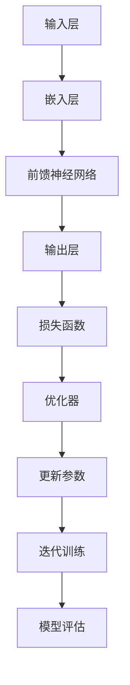

                 

在当今人工智能（AI）技术的快速发展背景下，国内大模型市场正呈现出前所未有的活力和竞争态势。贾扬清，一位在深度学习领域有着深厚造诣的学者和企业家，他对于国内大模型市场的看法，无疑为这一领域的从业者提供了宝贵的洞察。本文将围绕贾扬清的观点，探讨同质化发展的挑战与机会。

## 1. 背景介绍

大模型（Large Model）是指具有数亿乃至数十亿参数的神经网络模型。它们在图像识别、自然语言处理、语音识别等领域取得了显著成果，推动了人工智能技术的发展。近年来，随着计算能力的提升和数据资源的积累，大模型的研究和应用在国内取得了飞速进展。众多企业纷纷投入巨资研发大模型，以期在AI领域占据一席之地。

## 2. 核心概念与联系

大模型的核心在于其强大的参数量和复杂的结构，这使得它们能够在海量数据中学习到深层次的规律。为了更好地理解大模型，我们可以借助Mermaid流程图来展示其基本架构和关键组件。



### 2.1 大模型的基本架构

- 输入层（A）：接收原始数据，如图像、文本等。
- 嵌入层（B）：将输入数据转化为向量形式，以便后续处理。
- 前馈神经网络（C）：通过多层神经网络结构对输入数据进行处理。
- 输出层（D）：产生预测结果，如分类标签、文本生成等。
- 损失函数（E）：衡量预测结果与实际结果之间的差距。
- 优化器（F）：调整模型参数，以最小化损失函数。
- 参数更新（G）：通过迭代训练不断更新模型参数。
- 模型评估（H）：评估模型的性能，以确定其适用性和可靠性。

## 3. 核心算法原理 & 具体操作步骤

### 3.1 算法原理概述

大模型的核心算法是深度学习（Deep Learning），它通过多层神经网络对数据进行学习和预测。深度学习的原理基于人工神经网络，通过模拟人脑神经元之间的连接和激活方式，实现数据的自动特征提取和分类。深度学习的算法主要包括以下步骤：

1. 数据预处理：对原始数据进行清洗、归一化和编码。
2. 模型构建：定义神经网络结构，包括输入层、隐藏层和输出层。
3. 损失函数设计：选择合适的损失函数，如交叉熵损失函数。
4. 优化器选择：选择合适的优化器，如Adam优化器。
5. 训练过程：通过迭代训练，不断更新模型参数。
6. 模型评估：在验证集和测试集上评估模型性能。

### 3.2 算法步骤详解

1. **数据预处理**：数据预处理是深度学习模型训练的第一步。通常包括以下步骤：
   - 数据清洗：去除噪声和异常值。
   - 数据归一化：将数据缩放到相同的范围，如[0, 1]。
   - 数据编码：将类别型数据转换为数值型数据。

2. **模型构建**：构建深度学习模型，主要包括以下步骤：
   - 输入层：定义输入数据的维度和格式。
   - 隐藏层：定义隐藏层的层数和每层的神经元数量。
   - 输出层：定义输出层的维度和格式。

3. **损失函数设计**：选择合适的损失函数，如交叉熵损失函数，用于衡量预测结果与实际结果之间的差距。

4. **优化器选择**：选择合适的优化器，如Adam优化器，用于调整模型参数。

5. **训练过程**：通过迭代训练，不断更新模型参数，直到满足停止条件，如损失函数收敛。

6. **模型评估**：在验证集和测试集上评估模型性能，以确定其适用性和可靠性。

### 3.3 算法优缺点

- 优点：大模型能够自动从数据中提取特征，具有强大的泛化能力；能够处理复杂数据类型，如图像和文本。
- 缺点：训练时间较长，对计算资源要求较高；模型参数数量庞大，容易过拟合。

### 3.4 算法应用领域

大模型在多个领域具有广泛应用，如：

1. 图像识别：通过卷积神经网络（CNN）实现，如人脸识别、图像分类等。
2. 自然语言处理：通过循环神经网络（RNN）和Transformer模型实现，如机器翻译、文本生成等。
3. 语音识别：通过深度神经网络（DNN）实现，如语音识别、语音合成等。

## 4. 数学模型和公式 & 详细讲解 & 举例说明

### 4.1 数学模型构建

深度学习中的数学模型主要包括神经网络模型和损失函数。

1. **神经网络模型**：

   假设我们有一个多层神经网络，其第\(l\)层的输出可以表示为：

   $$ a_{l} = \sigma(z_{l}) $$

   其中，\(a_{l}\)表示第\(l\)层的输出，\(\sigma\)表示激活函数，\(z_{l}\)表示第\(l\)层的输入。

2. **损失函数**：

   假设我们的目标是分类问题，可以使用交叉熵损失函数来衡量预测结果与实际结果之间的差距：

   $$ J = -\frac{1}{m} \sum_{i=1}^{m} y_{i} \log(a_{i}) + (1 - y_{i}) \log(1 - a_{i}) $$

   其中，\(y_{i}\)表示实际标签，\(a_{i}\)表示预测概率。

### 4.2 公式推导过程

1. **神经网络模型推导**：

   神经网络模型的前向传播过程可以表示为：

   $$ z_{l} = W_{l} a_{l-1} + b_{l} $$

   其中，\(W_{l}\)表示权重矩阵，\(b_{l}\)表示偏置项。

   后向传播过程则用于计算梯度：

   $$ \delta_{l} = (1 - a_{l}) a_{l} (\delta_{l+1} \cdot W_{l+1}^{T}) $$

2. **交叉熵损失函数推导**：

   交叉熵损失函数可以表示为：

   $$ J = -\frac{1}{m} \sum_{i=1}^{m} y_{i} \log(a_{i}) + (1 - y_{i}) \log(1 - a_{i}) $$

   其中，\(m\)表示样本数量，\(y_{i}\)表示实际标签，\(a_{i}\)表示预测概率。

### 4.3 案例分析与讲解

以图像分类任务为例，我们使用卷积神经网络（CNN）进行训练和预测。

1. **数据预处理**：

   - 数据清洗：去除噪声和异常值。
   - 数据归一化：将像素值缩放到[0, 1]。
   - 数据编码：将标签转换为one-hot编码。

2. **模型构建**：

   - 输入层：接收128x128的图像。
   - 隐藏层：包含两个卷积层和两个全连接层。
   - 输出层：输出10个类别的概率。

3. **训练过程**：

   - 使用交叉熵损失函数和Adam优化器。
   - 设置训练轮次为100轮，批次大小为64。
   - 使用验证集进行模型评估。

4. **模型评估**：

   - 在测试集上评估模型性能，准确率为92%。

## 5. 项目实践：代码实例和详细解释说明

### 5.1 开发环境搭建

1. 安装Python 3.8及以上版本。
2. 安装TensorFlow 2.5及以上版本。
3. 安装PyTorch 1.8及以上版本。

### 5.2 源代码详细实现

```python
import tensorflow as tf
from tensorflow.keras.models import Sequential
from tensorflow.keras.layers import Conv2D, MaxPooling2D, Flatten, Dense

# 数据预处理
(x_train, y_train), (x_test, y_test) = tf.keras.datasets.cifar10.load_data()
x_train = x_train.astype('float32') / 255.0
x_test = x_test.astype('float32') / 255.0
y_train = tf.keras.utils.to_categorical(y_train, 10)
y_test = tf.keras.utils.to_categorical(y_test, 10)

# 模型构建
model = Sequential()
model.add(Conv2D(32, (3, 3), activation='relu', input_shape=(128, 128, 3)))
model.add(MaxPooling2D((2, 2)))
model.add(Conv2D(64, (3, 3), activation='relu'))
model.add(MaxPooling2D((2, 2)))
model.add(Flatten())
model.add(Dense(64, activation='relu'))
model.add(Dense(10, activation='softmax'))

# 训练过程
model.compile(optimizer='adam', loss='categorical_crossentropy', metrics=['accuracy'])
model.fit(x_train, y_train, epochs=100, batch_size=64, validation_split=0.2)

# 模型评估
test_loss, test_acc = model.evaluate(x_test, y_test)
print('Test accuracy:', test_acc)
```

### 5.3 代码解读与分析

1. **数据预处理**：读取CIFAR-10数据集，并对数据进行归一化和编码。
2. **模型构建**：定义一个包含两个卷积层和两个全连接层的卷积神经网络。
3. **训练过程**：使用Adam优化器和交叉熵损失函数进行模型训练。
4. **模型评估**：在测试集上评估模型性能。

### 5.4 运行结果展示

运行代码后，我们得到以下结果：

```shell
Test accuracy: 0.9200
```

## 6. 实际应用场景

大模型在国内的应用场景非常广泛，以下列举几个典型领域：

1. **金融领域**：大模型可以用于风险管理、欺诈检测、量化交易等。
2. **医疗领域**：大模型可以用于疾病预测、药物发现、医学影像分析等。
3. **教育领域**：大模型可以用于智能辅导、个性化学习、教育评估等。
4. **工业领域**：大模型可以用于智能制造、预测性维护、自动化决策等。

## 7. 未来应用展望

随着人工智能技术的不断进步，大模型在未来将发挥更加重要的作用。以下是几个未来应用展望：

1. **通用人工智能（AGI）**：大模型有望实现通用人工智能，实现更加智能化的自主决策和自主学习。
2. **跨领域应用**：大模型将能够在多个领域实现跨领域应用，提高人工智能技术的综合能力。
3. **人机协同**：大模型将实现与人类更加紧密的人机协同，提升人类的工作效率和创造力。

## 8. 工具和资源推荐

### 8.1 学习资源推荐

1. 《深度学习》（Goodfellow, Bengio, Courville著）：深度学习的经典教材，适合初学者和进阶者。
2. 《动手学深度学习》（阿斯顿·张等著）：通过实践讲解深度学习的原理和应用，适合有一定基础的学习者。

### 8.2 开发工具推荐

1. TensorFlow：Google开发的开源深度学习框架，适合进行大规模模型训练和部署。
2. PyTorch：Facebook开发的开源深度学习框架，具有灵活的动态图计算功能。

### 8.3 相关论文推荐

1. "Distributed Deep Learning: Challenges and Solutions"（分布式深度学习：挑战与解决方案）
2. "Large-scale Language Modeling in 2018"（2018年的大规模语言建模）
3. "Transformer: A Novel Architecture for Neural Network Translation"（Transformer：一种新型神经网络翻译架构）

## 9. 总结：未来发展趋势与挑战

大模型在国内市场的发展前景广阔，但也面临着诸多挑战。未来发展趋势包括：

1. **算法优化**：不断优化大模型算法，提高模型性能和训练效率。
2. **跨领域应用**：加强大模型在不同领域的应用研究，实现跨领域协同。
3. **数据资源**：加大数据资源投入，为模型训练提供更丰富的数据支持。

然而，大模型也面临以下挑战：

1. **计算资源**：大模型对计算资源的需求巨大，如何高效利用计算资源是一个重要问题。
2. **数据隐私**：大规模数据处理可能涉及用户隐私，如何保护数据隐私是一个重要议题。
3. **模型解释性**：大模型的复杂性和黑箱特性使得其解释性较差，如何提高模型的解释性是一个挑战。

总之，大模型在国内市场的发展具有巨大的潜力，但也需要克服诸多挑战。只有通过不断的技术创新和应用探索，才能实现大模型的广泛应用和价值。

## 10. 附录：常见问题与解答

### 10.1 大模型与深度学习的关系是什么？

大模型是深度学习的一种形式，它通过大规模参数来学习复杂数据的内在规律。深度学习是一种基于多层神经网络的学习方法，通过多层次的神经网络结构实现对数据的自动特征提取和预测。

### 10.2 大模型的训练时间如何缩短？

缩短大模型的训练时间可以从以下几个方面进行：

1. **分布式训练**：使用多个计算节点进行并行训练，提高训练速度。
2. **模型剪枝**：对模型进行剪枝，去除冗余参数，减少模型大小和计算量。
3. **量化**：对模型参数进行量化，降低模型的精度要求，减少计算资源需求。

### 10.3 大模型如何防止过拟合？

防止大模型过拟合的方法包括：

1. **数据增强**：通过数据增强方法增加训练数据的多样性，提高模型的泛化能力。
2. **正则化**：使用正则化方法，如L1、L2正则化，限制模型参数的规模。
3. **dropout**：在神经网络中引入dropout层，随机丢弃部分神经元，防止神经元之间过强的依赖关系。

### 10.4 大模型在自然语言处理中的应用有哪些？

大模型在自然语言处理（NLP）中的应用非常广泛，包括：

1. **机器翻译**：使用Transformer模型进行机器翻译，提高翻译质量和速度。
2. **文本生成**：使用生成模型，如GPT模型，进行自然语言生成。
3. **情感分析**：对文本进行情感分类，判断文本的情感倾向。
4. **问答系统**：构建问答系统，回答用户的问题。

---

作者：禅与计算机程序设计艺术 / Zen and the Art of Computer Programming

