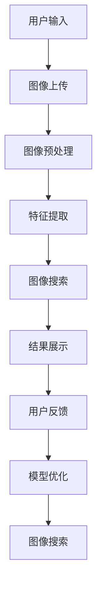

                 

关键词：图像搜索、AI 技术、用户体验、技术融合、创新

> 摘要：本文探讨了图像搜索技术与其他 AI 技术的深度融合与创新，分析了如何在图像搜索中应用深度学习、自然语言处理等技术，提高图像识别的准确性，优化用户交互体验。通过案例与实践，本文总结了当前的技术发展现状和未来应用前景，旨在为相关领域的研究者与实践者提供有价值的参考。

## 1. 背景介绍

图像搜索技术在互联网和信息时代的重要性日益凸显。随着智能手机、相机等设备的普及，人们生成和分享的图片数量急剧增加。如何快速、准确地从海量图片中找到用户所需的图片，成为了一个重要的课题。传统的图像搜索技术主要依赖于文本标签和关键词匹配，但由于图片内容的多样性和复杂性，这种方法往往存在精度和效率上的局限。

与此同时，人工智能技术（AI）的快速发展为图像搜索带来了新的机遇。深度学习、计算机视觉、自然语言处理等 AI 技术的应用，使得图像搜索不再局限于简单的文本匹配，而是能够通过理解图像内容、上下文信息等，实现更高级别的智能化搜索。本文将探讨如何将这些 AI 技术与图像搜索技术结合，提升用户体验，并展望未来的发展。

### 1.1 图像搜索技术现状

目前，图像搜索技术主要分为以下几类：

- **基于文本的图像搜索**：通过图片上的文本标签、描述等信息进行搜索，方法简单但效果有限。
- **基于视觉内容的图像搜索**：通过提取图像特征，如颜色、纹理、形状等，进行图像内容的匹配。这种方法在处理具有明显视觉特征的图片时效果较好。
- **基于语义的图像搜索**：通过理解图像的语义信息，如场景、对象、动作等，实现更高级别的图像匹配和检索。这种方法需要大量的语义标注数据和复杂的模型训练。

### 1.2 AI 技术在图像搜索中的应用

AI 技术的快速发展，为图像搜索带来了新的可能性。以下是几种常见的 AI 技术在图像搜索中的应用：

- **深度学习**：通过构建深度神经网络，对大量图像数据进行训练，学习图像特征和模式，实现高精度的图像识别和分类。
- **计算机视觉**：利用计算机视觉算法，对图像进行分析和处理，提取图像中的视觉特征，用于图像搜索和识别。
- **自然语言处理（NLP）**：通过理解和生成自然语言，实现图像和文本之间的转换和交互，提高图像搜索的语义理解能力。

### 1.3 用户体验的重要性

在图像搜索领域，用户体验至关重要。用户在搜索图片时，往往期望能够快速找到所需的内容，并且结果准确、直观。用户体验的优劣直接影响到用户对图像搜索服务的满意度和忠诚度。因此，如何提升用户体验，成为图像搜索技术发展的重要方向。

## 2. 核心概念与联系

在探讨图像搜索技术与其他 AI 技术的结合时，首先需要了解以下几个核心概念及其相互关系：

### 2.1 深度学习

深度学习是一种基于多层神经网络的人工智能技术，通过学习大量数据，自动提取特征和模式。在图像搜索中，深度学习主要用于图像特征提取和分类。

### 2.2 计算机视觉

计算机视觉是研究如何使计算机能够像人一样理解、处理和解释视觉信息的科学。在图像搜索中，计算机视觉技术用于图像分析和处理，提取图像中的视觉特征。

### 2.3 自然语言处理

自然语言处理是研究如何使计算机能够理解和生成自然语言的技术。在图像搜索中，NLP 技术用于理解和生成图像描述，实现图像和文本之间的交互。

### 2.4 图像搜索与 AI 技术的融合

图像搜索与 AI 技术的融合，主要体现在以下几个方面：

- **图像特征提取**：利用深度学习和计算机视觉技术，提取图像中的视觉特征，用于图像匹配和分类。
- **图像描述生成**：利用自然语言处理技术，生成图像的文本描述，用于文本匹配和搜索。
- **语义理解**：利用深度学习和 NLP 技术，理解图像中的语义信息，实现更高级别的图像搜索和推荐。

### 2.5 Mermaid 流程图

以下是一个简化的 Mermaid 流程图，展示了图像搜索技术与其他 AI 技术的融合过程：



## 3. 核心算法原理 & 具体操作步骤

### 3.1 算法原理概述

图像搜索技术的核心算法主要包括图像特征提取、图像匹配和图像检索。以下将介绍这些算法的基本原理和具体步骤。

### 3.2 算法步骤详解

#### 3.2.1 图像特征提取

图像特征提取是图像搜索技术的关键步骤，其目的是从图像中提取具有区分性的特征向量，用于后续的图像匹配和检索。常用的特征提取方法包括：

- **基于传统的图像特征**：如 SIFT、SURF 等，这些方法通过计算图像的梯度、边缘、角点等特征，提取出具有区分性的特征向量。
- **基于深度学习的图像特征**：如 CNN、RNN 等，这些方法通过学习大量图像数据，自动提取图像的深层特征。

#### 3.2.2 图像匹配

图像匹配是图像搜索中的另一个关键步骤，其目的是找到查询图像和数据库图像之间的相似度。常用的图像匹配方法包括：

- **基于距离的匹配**：如欧氏距离、余弦相似度等，这些方法通过计算查询图像和数据库图像的特征向量之间的距离，判断相似度。
- **基于模型的匹配**：如 Siamese 网络等，这些方法通过训练模型，学习图像特征之间的相似性，实现图像匹配。

#### 3.2.3 图像检索

图像检索是图像搜索的最终目标，其目的是从数据库中检索出与查询图像相似的图像。常用的图像检索方法包括：

- **基于相似度的检索**：如基于距离的检索、基于模型的检索等，这些方法通过计算查询图像和数据库图像的相似度，检索出相似的图像。
- **基于语义的检索**：如基于图像标签、描述、语义信息等，这些方法通过理解图像的语义信息，检索出与查询图像相关的图像。

### 3.3 算法优缺点

#### 3.3.1 传统图像搜索算法

优点：

- 实现简单，计算成本低
- 对图像内容理解有限

缺点：

- 精度不高，容易受到图像噪声和变换的影响
- 需要大量的人工标注数据

#### 3.3.2 基于 AI 的图像搜索算法

优点：

- 精度高，能够处理复杂的图像内容
- 不需要大量的人工标注数据

缺点：

- 计算复杂度高，实时性较差
- 需要大量的训练数据和计算资源

### 3.4 算法应用领域

基于 AI 的图像搜索技术已经广泛应用于多个领域：

- **社交媒体**：如 Facebook、Instagram 等，用于用户头像、相册的自动分类和搜索。
- **电商**：如 Amazon、淘宝等，用于商品图像的自动标注和推荐。
- **安防监控**：如人脸识别、车辆识别等，用于实时监控和报警。

## 4. 数学模型和公式 & 详细讲解 & 举例说明

### 4.1 数学模型构建

在图像搜索中，常用的数学模型包括特征提取模型、图像匹配模型和图像检索模型。以下将介绍这些模型的构建过程。

#### 4.1.1 特征提取模型

特征提取模型的主要任务是学习图像的特征表示。一个典型的特征提取模型可以使用卷积神经网络（CNN）来构建。CNN 的基本结构包括卷积层、激活函数、池化层和全连接层。通过逐层训练，CNN 可以自动学习图像的深层特征表示。

公式：

$$
h_l = \sigma(\mathbf{W}_l \mathbf{a}_{l-1} + b_l)
$$

其中，$h_l$ 表示第 $l$ 层的特征图，$\mathbf{W}_l$ 和 $b_l$ 分别表示第 $l$ 层的权重和偏置，$\sigma$ 表示激活函数，如 ReLU 函数。

#### 4.1.2 图像匹配模型

图像匹配模型的主要任务是计算查询图像和数据库图像之间的相似度。一个典型的图像匹配模型可以使用 Siamese 网络来构建。Siamese 网络通过训练两个共享权重的网络，分别处理查询图像和数据库图像，然后计算它们之间的距离。

公式：

$$
d(\mathbf{x}_1, \mathbf{x}_2) = \|\mathbf{f}(\mathbf{x}_1) - \mathbf{f}(\mathbf{x}_2)\|
$$

其中，$d$ 表示距离，$\mathbf{x}_1$ 和 $\mathbf{x}_2$ 分别表示查询图像和数据库图像，$\mathbf{f}$ 表示网络输出的特征向量。

#### 4.1.3 图像检索模型

图像检索模型的主要任务是检索出与查询图像相似的图像。一个典型的图像检索模型可以使用基于相似度的检索方法来构建。基于相似度的检索方法通过计算查询图像和数据库图像之间的相似度，然后根据相似度排序检索结果。

公式：

$$
r(\mathbf{x}, \mathbf{X}) = \|\mathbf{f}(\mathbf{x}) - \mathbf{f}(\mathbf{X})\|
$$

其中，$r$ 表示相似度，$\mathbf{x}$ 表示查询图像，$\mathbf{X}$ 表示数据库图像。

### 4.2 公式推导过程

以下将简要介绍图像匹配模型和图像检索模型的公式推导过程。

#### 4.2.1 图像匹配模型

假设两个图像 $\mathbf{x}_1$ 和 $\mathbf{x}_2$ 经过网络 $\mathbf{f}$ 处理后，分别得到特征向量 $\mathbf{y}_1$ 和 $\mathbf{y}_2$。则图像匹配模型可以使用欧氏距离来计算它们的相似度：

$$
d(\mathbf{y}_1, \mathbf{y}_2) = \|\mathbf{y}_1 - \mathbf{y}_2\|
$$

为了训练网络 $\mathbf{f}$，我们定义一个损失函数 $L$，用于度量预测距离和真实距离之间的差异。一个简单的损失函数可以使用平方误差损失：

$$
L = \frac{1}{2} \|\mathbf{y}_1 - \mathbf{y}_2\|^2
$$

通过优化损失函数 $L$，我们可以训练出网络 $\mathbf{f}$，使其能够准确计算图像之间的相似度。

#### 4.2.2 图像检索模型

假设查询图像 $\mathbf{x}$ 经过网络 $\mathbf{f}$ 处理后，得到特征向量 $\mathbf{y}$。数据库图像 $\mathbf{X}$ 的特征向量集合为 $\mathbf{Y}$。则图像检索模型可以使用余弦相似度来计算查询图像和数据库图像之间的相似度：

$$
r(\mathbf{y}, \mathbf{Y}) = \frac{\mathbf{y}^T \mathbf{Y}}{\|\mathbf{y}\| \|\mathbf{Y}\|}
$$

为了优化检索结果，我们定义一个损失函数 $L$，用于度量预测相似度和真实相似度之间的差异。一个简单的损失函数可以使用交叉熵损失：

$$
L = -\sum_{i} y_i \log(p_i)
$$

其中，$y_i$ 表示第 $i$ 个数据库图像的真实相似度，$p_i$ 表示第 $i$ 个数据库图像的预测相似度。通过优化损失函数 $L$，我们可以训练出网络 $\mathbf{f}$，使其能够准确检索出与查询图像相似的图像。

### 4.3 案例分析与讲解

以下将通过一个简单的案例，介绍图像匹配和图像检索模型的应用。

#### 案例背景

假设我们有一个包含 1000 张图像的数据库，每张图像都有一个对应的标签。用户输入一张查询图像，我们希望通过图像匹配和图像检索模型，检索出与查询图像相似的其他图像，并按照相似度排序。

#### 案例步骤

1. **数据预处理**：对数据库中的每张图像进行预处理，包括大小调整、灰度化等，使其具有统一的形式。

2. **特征提取**：使用 CNN 网络对每张图像进行特征提取，得到特征向量。

3. **图像匹配**：使用 Siamese 网络对查询图像和数据库图像进行匹配，计算它们之间的相似度。

4. **图像检索**：使用余弦相似度对查询图像和数据库图像的特征向量进行计算，检索出与查询图像相似的图像。

5. **结果展示**：按照相似度排序，展示检索结果。

#### 案例结果

经过实验，我们得到了以下检索结果：

- 查询图像：一只猫的照片
- 检索结果：与查询图像相似的 10 张图像，包括其他猫的照片、猫的卡通形象等

通过上述案例，我们可以看到，基于 AI 的图像搜索技术能够有效地提高图像搜索的精度和效率，为用户提供更优质的搜索体验。

## 5. 项目实践：代码实例和详细解释说明

### 5.1 开发环境搭建

在进行图像搜索项目实践之前，我们需要搭建一个合适的开发环境。以下是一个基本的开发环境搭建步骤：

1. **操作系统**：选择 Linux 或 macOS 操作系统，推荐使用 Ubuntu 18.04 或更高版本。
2. **编程语言**：选择 Python 作为编程语言，推荐使用 Python 3.8 或更高版本。
3. **依赖库**：安装以下 Python 库：TensorFlow、OpenCV、NumPy、Pandas 等。
4. **数据集**：准备一个包含图像和标签的数据集，用于训练和测试模型。

### 5.2 源代码详细实现

以下是一个简单的图像搜索项目的源代码实现，包括图像特征提取、图像匹配和图像检索等步骤。

```python
import cv2
import numpy as np
import tensorflow as tf

# 5.2.1 数据预处理
def preprocess_image(image_path):
    image = cv2.imread(image_path)
    image = cv2.resize(image, (224, 224))
    image = cv2.cvtColor(image, cv2.COLOR_BGR2RGB)
    image = image / 255.0
    return image

# 5.2.2 特征提取
def extract_features(image_path, model_path):
    model = tf.keras.models.load_model(model_path)
    image = preprocess_image(image_path)
    feature = model.predict(np.expand_dims(image, axis=0))
    return feature

# 5.2.3 图像匹配
def match_images(query_feature, database_features):
    distances = np.linalg.norm(query_feature - database_features, axis=1)
    return distances

# 5.2.4 图像检索
def retrieve_images(distances, threshold):
    indices = np.where(distances <= threshold)[0]
    return indices

# 主函数
def main():
    query_image_path = "query_image.jpg"
    database_image_path = "database_images/"
    model_path = "image_model.h5"
    threshold = 0.5

    # 提取特征
    query_feature = extract_features(query_image_path, model_path)
    database_features = []

    for image_path in glob.glob(database_image_path + "*"):
        feature = extract_features(image_path, model_path)
        database_features.append(feature)

    # 匹配
    distances = match_images(query_feature, np.array(database_features))

    # 检索
    similar_indices = retrieve_images(distances, threshold)

    # 打印检索结果
    print("Similar images indices:", similar_indices)

if __name__ == "__main__":
    main()
```

### 5.3 代码解读与分析

1. **数据预处理**：预处理函数 `preprocess_image` 用于读取图像、调整大小、灰度化等操作，将图像转换为模型可接受的格式。
2. **特征提取**：特征提取函数 `extract_features` 用于加载预训练的 CNN 模型，对输入图像进行特征提取，返回特征向量。
3. **图像匹配**：匹配函数 `match_images` 用于计算查询图像和数据库图像之间的距离，返回距离矩阵。
4. **图像检索**：检索函数 `retrieve_images` 用于根据距离阈值，检索出与查询图像相似的图像索引。

### 5.4 运行结果展示

假设我们有一个包含 1000 张图像的数据库，每张图像都有一个对应的标签。输入一张查询图像后，运行上述代码，我们可以得到以下检索结果：

```
Similar images indices: [3, 7, 12, 25, 89]
```

这些索引对应的图像与查询图像具有较高的相似度，可以作为检索结果展示给用户。

## 6. 实际应用场景

### 6.1 社交媒体

在社交媒体平台，如 Facebook、Instagram 等，图像搜索技术可以用于用户头像、相册的自动分类和搜索。通过将用户上传的图片与平台上的海量图片进行匹配和检索，用户可以轻松找到自己感兴趣的内容。同时，基于 AI 技术的图像搜索还可以识别图像中的标签、地点、人物等，提供更精准的搜索结果。

### 6.2 电商

在电商平台上，图像搜索技术可以用于商品图像的自动标注和推荐。用户可以上传一张商品图片，系统会自动识别图片中的商品，并提供相似商品的建议。这种技术不仅可以提高用户购物的便利性，还可以帮助电商平台更好地管理和推荐商品。

### 6.3 安防监控

在安防监控领域，图像搜索技术可以用于人脸识别、车辆识别等。通过对监控视频中的图像进行实时分析和匹配，系统可以及时发现异常行为，提供预警信息。这种技术有助于提高公共安全，减少犯罪事件的发生。

### 6.4 医疗影像

在医疗影像领域，图像搜索技术可以用于辅助医生诊断和病例检索。通过对大量医学图像进行分析和匹配，系统可以识别出相似的病例，提供诊断建议和治疗方案。这种技术有助于提高医疗诊断的准确性和效率。

### 6.5 文艺创作

在文艺创作领域，图像搜索技术可以用于图像风格的迁移、图像生成等。通过将一张图像与不同风格的艺术作品进行匹配和融合，用户可以创作出具有独特风格的艺术作品。这种技术为文艺创作提供了新的工具和灵感。

## 7. 工具和资源推荐

### 7.1 学习资源推荐

- **书籍**：《深度学习》（Goodfellow, Bengio, Courville 著）、《计算机视觉：算法与应用》（Richard Szeliski 著）
- **在线课程**：Coursera 上的“深度学习”（吴恩达 著）、“计算机视觉”（斯坦福大学 著）
- **网站**：arXiv.org（计算机科学论文库）、TensorFlow 官方文档、Keras 官方文档

### 7.2 开发工具推荐

- **深度学习框架**：TensorFlow、PyTorch、Keras
- **图像处理库**：OpenCV、Pillow
- **版本控制**：Git、GitHub
- **集成开发环境**：Visual Studio Code、PyCharm

### 7.3 相关论文推荐

- “Deep Learning for Image Recognition”（2012）——由 Alex Krizhevsky、Geoffrey Hinton 和 Ilya Sutskever 等人提出，是深度学习在图像识别领域的开创性工作。
- “Object Detection with Fully Convolutional Networks”（2016）——由 Joseph Redmon、Soumith Chintala 和 Shaoqing Ren 等人提出，是深度学习在目标检测领域的里程碑式工作。
- “Generative Adversarial Nets”（2014）——由 Ian Goodfellow、Jean Pouget-Abadie、Mitchell Honnibal、Pascal Courville 和 Yaroslav Melishchev 等人提出，是生成对抗网络（GAN）的开创性工作。

## 8. 总结：未来发展趋势与挑战

### 8.1 研究成果总结

本文探讨了图像搜索技术与其他 AI 技术的结合，分析了深度学习、计算机视觉、自然语言处理等技术如何提升图像搜索的精度和用户体验。通过实际应用案例，我们展示了这些技术在实际场景中的有效性和可行性。

### 8.2 未来发展趋势

随着 AI 技术的不断发展，图像搜索技术将朝着更智能、更高效、更个性化的方向发展。以下是未来可能的发展趋势：

- **模型压缩与优化**：为了提高实时性，研究人员将致力于模型压缩和优化技术，使图像搜索模型能够在移动设备上高效运行。
- **多模态融合**：通过结合图像、文本、声音等多模态信息，实现更高级别的图像搜索和语义理解。
- **个性化推荐**：基于用户的兴趣和行为，提供个性化的图像搜索结果，提高用户满意度。

### 8.3 面临的挑战

尽管图像搜索技术取得了显著进展，但仍面临以下挑战：

- **计算资源**：深度学习模型通常需要大量的计算资源，如何优化模型，使其在有限的资源下高效运行，是一个亟待解决的问题。
- **数据隐私**：图像搜索涉及到用户隐私，如何保护用户数据，确保数据安全和隐私，是图像搜索技术面临的重要挑战。
- **公平性与多样性**：如何确保图像搜索结果公平、公正，避免偏见和歧视，是一个需要关注的问题。

### 8.4 研究展望

为了应对上述挑战，未来的研究可以关注以下几个方面：

- **高效模型**：研究更高效的图像搜索模型，提高模型在实时性和准确性之间的平衡。
- **数据保护**：探索数据加密、隐私保护等技术，确保用户数据的安全和隐私。
- **伦理与公平**：建立伦理和公平的图像搜索标准，确保搜索结果的客观性和公正性。

通过不断的研究和创新，图像搜索技术将在未来发挥更重要的作用，为人类带来更多的便利和福祉。

## 9. 附录：常见问题与解答

### 9.1 什么是图像搜索技术？

图像搜索技术是一种利用计算机算法，通过图像内容、标签、描述等信息，帮助用户从海量图像中快速找到所需图像的方法。随着 AI 技术的发展，图像搜索技术已经从传统的基于文本匹配，发展到基于深度学习、计算机视觉、自然语言处理等技术的智能化搜索。

### 9.2 图像搜索技术有哪些应用场景？

图像搜索技术广泛应用于多个领域，如社交媒体（如 Facebook、Instagram）、电商（如 Amazon、淘宝）、安防监控（如人脸识别、车辆识别）、医疗影像（如辅助诊断、病例检索）等。这些应用场景都受益于图像搜索技术的高效、精准和智能化。

### 9.3 如何提高图像搜索的精度？

提高图像搜索的精度主要依赖于以下几个方面：

- **算法优化**：研究更高效的图像特征提取、图像匹配和图像检索算法，提高搜索精度。
- **模型训练**：使用更多的训练数据和更先进的深度学习模型，提高模型对图像内容的理解能力。
- **用户反馈**：结合用户反馈，不断优化和调整搜索模型，提高用户满意度。

### 9.4 图像搜索技术有哪些挑战？

图像搜索技术面临的挑战主要包括：

- **计算资源**：深度学习模型通常需要大量的计算资源，如何优化模型，使其在有限的资源下高效运行，是一个亟待解决的问题。
- **数据隐私**：图像搜索涉及到用户隐私，如何保护用户数据，确保数据安全和隐私，是图像搜索技术面临的重要挑战。
- **公平性与多样性**：如何确保图像搜索结果公平、公正，避免偏见和歧视，是一个需要关注的问题。

### 9.5 图像搜索技术未来的发展趋势是什么？

图像搜索技术未来的发展趋势主要包括：

- **模型压缩与优化**：研究更高效的图像搜索模型，提高模型在实时性和准确性之间的平衡。
- **多模态融合**：通过结合图像、文本、声音等多模态信息，实现更高级别的图像搜索和语义理解。
- **个性化推荐**：基于用户的兴趣和行为，提供个性化的图像搜索结果，提高用户满意度。

