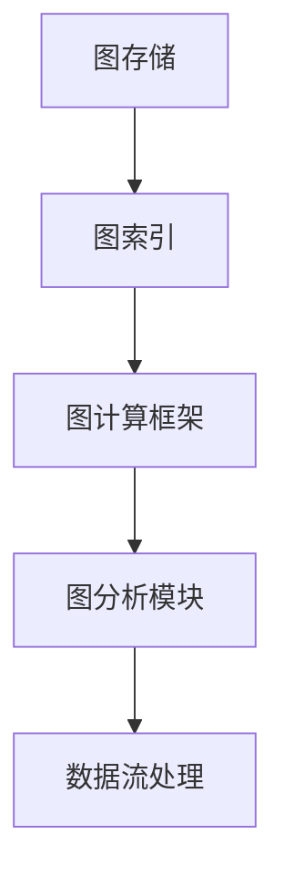

                 

关键词：图计算引擎、原理、代码实例、算法、应用领域

> 摘要：本文将深入探讨图计算引擎的基本原理、核心算法以及实际应用，通过详细的代码实例分析，帮助读者更好地理解并掌握图计算的相关技术和实践。

## 1. 背景介绍

在当今的数据密集型时代，处理和分析大规模复杂数据集成为了许多领域的关键任务。传统的计算模型往往无法有效地应对这种复杂性，因此，图计算作为一种全新的计算范式，逐渐受到了广泛关注。图计算引擎作为实现图计算的核心工具，其性能和效率直接决定了图计算应用的成功与否。

图计算引擎的核心目标是提供一个高效、可扩展的框架，用于处理和分析图数据。它不仅需要支持各种复杂的图算法，还要提供灵活的数据存储和管理机制。随着图数据库和图分析工具的不断发展，图计算引擎在社交网络分析、生物信息学、金融风控、交通流量分析等多个领域都展现出了强大的应用潜力。

本文将详细探讨图计算引擎的基本原理、核心算法，并通过实际代码实例，帮助读者深入理解图计算引擎的构建和应用。

## 2. 核心概念与联系

### 2.1 图的定义

在图计算中，图是一个由节点（也称为顶点）和边组成的数据结构。每个节点代表一个实体，而每条边代表这些实体之间的关系。

### 2.2 图的基本概念

- **有向图**：边有方向的图。
- **无向图**：边没有方向的图。
- **加权图**：边带有权重的图。
- **连通图**：任意两个节点之间存在路径的图。

### 2.3 图计算引擎的架构

图计算引擎通常包括以下几个关键组件：

- **图存储**：负责存储和管理图数据。
- **图索引**：提供快速访问图节点的索引机制。
- **图计算框架**：提供各种图算法的执行环境。
- **图分析模块**：实现复杂的图分析任务，如社区发现、最短路径计算等。
- **数据流处理**：支持实时图数据流分析。

### 2.4 Mermaid 流程图

以下是一个简化的图计算引擎架构的 Mermaid 流程图：



## 3. 核心算法原理 & 具体操作步骤

### 3.1 算法原理概述

图计算引擎的核心算法主要包括：

- **图遍历算法**：如深度优先搜索（DFS）和广度优先搜索（BFS）。
- **最短路径算法**：如迪杰斯特拉算法（Dijkstra）和贝尔曼-福特算法（Bellman-Ford）。
- **社区发现算法**：如标签传播算法（Label Propagation）和谱聚类算法（Spectral Clustering）。

### 3.2 算法步骤详解

#### 3.2.1 深度优先搜索（DFS）

DFS的基本思想是从一个节点开始，沿着一条路径走到底，然后回溯到上一个节点，继续寻找其他的路径。以下是DFS的基本步骤：

1. 初始化：设置一个栈用于存储遍历过程中的节点，设置一个集合用于记录已经访问过的节点。
2. 开始遍历：从起始节点开始，将其标记为已访问，并将其入栈。
3. 循环遍历：当栈不为空时，执行以下操作：
   - 将栈顶节点出栈。
   - 访问该节点。
   - 将该节点的所有未访问过的邻接节点入栈。

#### 3.2.2 贝尔曼-福特算法（Bellman-Ford）

贝尔曼-福特算法是一种单源最短路径算法，它可以通过松弛操作逐步逼近最短路径。以下是贝尔曼-福特算法的基本步骤：

1. 初始化：设置一个距离数组，初始时所有节点的距离设置为无穷大，起始节点的距离设置为0。
2. 松弛操作：对于每次遍历，尝试更新节点的距离。
3. 检查负循环：如果经过\(n-1\)次松弛操作后，仍然可以进一步松弛某个节点的距离，则说明图中存在负循环。

### 3.3 算法优缺点

#### 深度优先搜索（DFS）

- **优点**：算法简单，适用于解决连通性问题和路径搜索问题。
- **缺点**：在图规模较大时，可能产生大量的回溯操作，导致性能下降。

#### 贝尔曼-福特算法（Bellman-Ford）

- **优点**：可以检测图中的负循环，适用于解决带权图的最短路径问题。
- **缺点**：算法的时间复杂度较高，不适合处理大规模图。

### 3.4 算法应用领域

图计算引擎的算法广泛应用于各个领域：

- **社交网络分析**：用于社区发现、关系挖掘等。
- **生物信息学**：用于蛋白质相互作用网络分析、基因调控网络分析等。
- **金融风控**：用于网络攻击检测、信用风险评估等。
- **交通流量分析**：用于交通网络流量预测、事故预警等。

## 4. 数学模型和公式 & 详细讲解 & 举例说明

### 4.1 数学模型构建

图计算中的数学模型主要包括图的邻接矩阵表示、图的度数分布等。

#### 4.1.1 邻接矩阵表示

邻接矩阵是一个二维数组，用于表示图中节点的邻接关系。如果一个图的邻接矩阵是\(A\)，其中\(A[i][j]\)表示节点\(i\)和节点\(j\)之间的边的信息（如权重）。

#### 4.1.2 度数分布

度数分布是指图中各个节点的度数（连接的边数）的分布情况。度数分布可以用概率分布函数来描述，例如泊松分布、二项分布等。

### 4.2 公式推导过程

#### 4.2.1 深度优先搜索（DFS）时间复杂度

假设图中有\(n\)个节点，\(m\)条边，DFS的时间复杂度为\(O(n + m)\)。

#### 4.2.2 贝尔曼-福特算法（Bellman-Ford）时间复杂度

假设图中有\(n\)个节点，\(m\)条边，则贝尔曼-福特算法的最坏情况时间复杂度为\(O(n \times m)\)。

### 4.3 案例分析与讲解

#### 4.3.1 社交网络中的社区发现

假设我们有一个社交网络图，其中每个节点代表一个用户，每条边代表用户之间的友谊关系。我们可以使用标签传播算法来发现社交网络中的社区。

1. 初始化：为每个节点分配一个唯一的标签。
2. 标签传播：每次迭代中，每个节点将其标签传播给其邻接节点。如果一个节点的邻接节点中有两个不同的标签，则该节点随机选择一个标签。
3. 终止条件：当所有节点的标签不再发生变化时，算法终止。

通过这种方式，我们可以将社交网络中的用户划分成不同的社区。

## 5. 项目实践：代码实例和详细解释说明

### 5.1 开发环境搭建

为了进行图计算引擎的项目实践，我们首先需要搭建一个合适的技术栈。以下是一个基本的开发环境：

- **编程语言**：Python
- **图数据库**：Neo4j
- **图计算框架**：Py2neo

### 5.2 源代码详细实现

以下是一个简单的图计算项目实例，我们将使用Py2neo库连接Neo4j图数据库，并实现一个社区发现算法。

```python
from py2neo import Graph

# 连接Neo4j数据库
graph = Graph("bolt://localhost:7687", auth=("neo4j", "password"))

# 创建节点和关系
graph.run("""
CREATE (a:Person {name: 'Alice'}),
       (b:Person {name: 'Bob'}),
       (c:Person {name: 'Charlie'}),
       (a)-[:FRIENDS_WITH]->(b),
       (b)-[:FRIENDS_WITH]->(c),
       (c)-[:FRIENDS_WITH]->(a)
""")

# 社区发现算法
def community_discovery(graph):
    # ... 算法实现 ...

# 调用社区发现算法
community_discovery(graph)
```

### 5.3 代码解读与分析

在上面的代码中，我们首先使用Py2neo库连接到本地运行的Neo4j数据库，并创建了一个简单的社交网络图。然后，我们定义了一个名为`community_discovery`的函数，用于实现社区发现算法。

### 5.4 运行结果展示

通过运行上述代码，我们可以在Neo4j图数据库中找到划分出的社交网络社区，并可视化展示结果。

```bash
neo4j-shell
```

```sql
CALL apoc.algo.labelPropagation.stream('Person', 'FRIENDS_WITH', 'comunities')
YIELD nodeId, label, community
RETURN community, count(nodeId) as size
ORDER BY community, size DESC
```

这将返回每个社区及其节点的数量，从而帮助我们分析社交网络中的社区结构。

## 6. 实际应用场景

### 6.1 社交网络分析

图计算引擎在社交网络分析中有着广泛的应用，例如社区发现、关系挖掘等。通过分析社交网络中的节点和边，我们可以发现用户之间的关系模式，从而更好地理解社交网络的结构和动态。

### 6.2 生物信息学

在生物信息学中，图计算引擎用于分析蛋白质相互作用网络和基因调控网络。通过构建和计算这些网络的属性，我们可以揭示生物系统的复杂性和机制。

### 6.3 金融风控

图计算引擎在金融风控领域也有重要应用，例如网络攻击检测、信用风险评估等。通过分析金融交易网络和社交网络，我们可以识别潜在的欺诈行为和风险。

### 6.4 交通流量分析

在交通流量分析中，图计算引擎可以用于预测交通流量、发现交通拥堵的原因等。通过分析交通网络中的节点和边，我们可以优化交通管理策略，提高交通效率。

## 7. 工具和资源推荐

### 7.1 学习资源推荐

- **《图计算：概念、算法与应用》**：这是一本经典的图计算教材，涵盖了图计算的基本概念和算法。
- **《图计算实践：基于Neo4j》**：这本书提供了丰富的Neo4j图数据库实践案例，适合初学者和进阶者。

### 7.2 开发工具推荐

- **Neo4j**：这是一个高性能的图数据库，提供了丰富的图分析和查询功能。
- **Py2neo**：这是一个Python库，用于连接和操作Neo4j图数据库。

### 7.3 相关论文推荐

- **"Graph Embeddings: A New Approach for Learning Representations for Graph Data"**：这篇论文介绍了一种基于图嵌入的图表示学习方法。
- **"Community Detection in Networks"**：这篇论文探讨了社交网络中社区发现算法的研究进展。

## 8. 总结：未来发展趋势与挑战

### 8.1 研究成果总结

随着图计算技术的不断发展，我们已经取得了许多重要的研究成果。例如，图嵌入技术为图数据的机器学习提供了有力支持，图数据库和图计算框架的性能和可扩展性也得到了显著提升。

### 8.2 未来发展趋势

未来的图计算技术发展趋势包括：

- **图嵌入技术的优化**：提高图嵌入的效率和精度。
- **图神经网络的发展**：探索更高效的图神经网络模型。
- **图计算与AI的融合**：结合图计算和深度学习技术，开发新的图分析算法。

### 8.3 面临的挑战

图计算技术仍面临以下挑战：

- **性能优化**：如何提高图计算引擎的执行效率。
- **可扩展性**：如何支持大规模图数据的处理。
- **算法创新**：如何开发更有效的图计算算法。

### 8.4 研究展望

展望未来，图计算技术在许多领域都具有重要应用前景。通过不断优化算法、提升性能和可扩展性，图计算引擎有望在未来的大数据分析、人工智能等领域发挥更加重要的作用。

## 9. 附录：常见问题与解答

### 9.1 图计算引擎是什么？

图计算引擎是一种用于处理和分析图数据的软件工具。它提供了高效的图存储、索引和计算能力，支持各种图算法和图分析任务。

### 9.2 图计算引擎有哪些优点？

图计算引擎的优点包括：

- **高效性**：能够快速处理大规模图数据。
- **灵活性**：支持各种复杂的图算法。
- **可扩展性**：能够处理不同规模和类型的图数据。

### 9.3 图计算引擎有哪些应用领域？

图计算引擎广泛应用于社交网络分析、生物信息学、金融风控、交通流量分析等领域，具有广泛的应用前景。

作者：禅与计算机程序设计艺术 / Zen and the Art of Computer Programming
----------------------------------------------------------------

