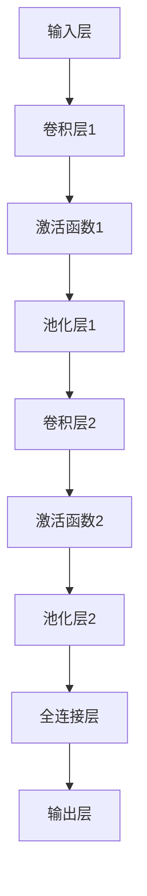

                 

关键词：卷积神经网络（CNN）、电影推荐系统、应用程序设计、用户体验、深度学习、资讯平台、人工智能

摘要：本文将探讨如何使用卷积神经网络（CNN）来实现一个高效的电影资讯推荐应用程序。通过分析CNN的基本原理和应用，我们将详细描述该应用程序的设计和实现过程，包括算法原理、数学模型、项目实践以及实际应用场景。本文旨在为开发者提供一种切实可行的解决方案，以提升电影资讯App的用户推荐体验。

## 1. 背景介绍

随着互联网技术的飞速发展，电影资讯App已经成为用户获取电影相关信息的首选平台。然而，传统的推荐算法往往依赖于用户的历史行为数据，难以满足个性化推荐的需求。卷积神经网络（CNN）作为一种强大的深度学习模型，在图像处理领域取得了显著的成果。近年来，CNN在自然语言处理、文本分类等领域也得到了广泛应用。本文旨在探讨如何将CNN应用于电影资讯App的设计与实现，以实现更加精准和个性化的推荐。

### 1.1 电影资讯App的现状

当前，市场上主流的电影资讯App主要包括以下几个特点：

- **个性化推荐**：根据用户的历史行为和偏好，为用户推荐相关的电影资讯。
- **内容丰富**：提供电影资讯、影评、预告片、票房信息等多方面的内容。
- **用户体验**：界面设计简洁美观，交互操作流畅。
- **社交功能**：支持用户评论、评分、分享等功能。

然而，随着用户需求的不断增长和多样化，现有的电影资讯App在个性化推荐方面仍存在一定局限。传统的推荐算法难以处理大量的非结构化文本数据，导致推荐结果不够精准。

### 1.2 CNN在推荐系统中的应用

CNN是一种用于图像处理的深度学习模型，其核心思想是通过多层卷积和池化操作提取图像的特征。近年来，CNN在自然语言处理、文本分类等领域也得到了广泛应用。CNN在处理文本数据时，可以通过将文本映射到高维空间，从而实现高效的特征提取和分类。基于CNN的推荐系统可以更好地处理非结构化文本数据，提高推荐结果的准确性。

## 2. 核心概念与联系

在本节中，我们将介绍卷积神经网络（CNN）的基本概念、原理和架构，并使用Mermaid流程图展示其工作流程。

### 2.1 CNN的基本概念

卷积神经网络（CNN）是一种特殊的神经网络，主要用于处理具有网格结构的数据，如图像和文本。CNN的核心组成部分包括：

- **卷积层（Convolutional Layer）**：用于提取输入数据的特征。
- **池化层（Pooling Layer）**：用于减少数据的维度，提高模型的泛化能力。
- **全连接层（Fully Connected Layer）**：用于将低维特征映射到高维特征。
- **激活函数（Activation Function）**：用于引入非线性变换。

### 2.2 CNN的原理

CNN通过多层卷积和池化操作，实现对输入数据的特征提取和分类。具体来说，CNN的工作流程如下：

1. **输入层**：接收输入数据，如电影资讯的文本。
2. **卷积层**：通过卷积操作提取输入数据的特征。
3. **激活函数**：对卷积层的输出进行非线性变换。
4. **池化层**：对卷积层的输出进行下采样，减少数据的维度。
5. **全连接层**：将低维特征映射到高维特征。
6. **输出层**：根据输出层的输出进行分类或预测。

### 2.3 CNN的架构

CNN的架构可以分为以下几个部分：

- **卷积层**：包含多个卷积核，每个卷积核负责提取输入数据的局部特征。
- **池化层**：通常使用最大池化或平均池化，用于减少数据的维度。
- **全连接层**：将卷积层和池化层提取的特征映射到高维特征。
- **激活函数**：常用的激活函数包括ReLU、Sigmoid和Tanh。

### 2.4 CNN的工作流程

使用Mermaid流程图展示CNN的工作流程：



## 3. 核心算法原理 & 具体操作步骤

### 3.1 算法原理概述

基于CNN的电影资讯推荐算法主要分为以下几步：

1. **数据预处理**：对电影资讯文本进行清洗和预处理，如去除停用词、词干提取等。
2. **特征提取**：使用CNN模型对预处理后的文本数据进行特征提取。
3. **模型训练**：利用训练数据对CNN模型进行训练，优化模型参数。
4. **推荐生成**：根据用户的历史行为数据，使用训练好的CNN模型生成推荐结果。

### 3.2 算法步骤详解

#### 3.2.1 数据预处理

1. **文本清洗**：去除文本中的标点符号、特殊字符和HTML标签等。
2. **分词**：将文本分割成单词或短语。
3. **去除停用词**：去除对文本分类影响较小的常见词汇，如“的”、“了”、“在”等。
4. **词干提取**：将文本中的单词还原为词干形式，如“行走”还原为“行”。

#### 3.2.2 特征提取

1. **词嵌入**：将文本中的单词映射到高维向量空间，常用的词嵌入模型包括Word2Vec、GloVe等。
2. **卷积神经网络构建**：构建CNN模型，包括卷积层、池化层和全连接层。
3. **特征提取**：将预处理后的文本输入到CNN模型中，提取文本的特征表示。

#### 3.2.3 模型训练

1. **数据集准备**：将电影资讯文本和用户行为数据（如点击、评分等）组成训练数据集。
2. **模型优化**：使用训练数据集对CNN模型进行训练，优化模型参数。
3. **模型评估**：使用验证数据集评估模型性能，调整模型参数。

#### 3.2.4 推荐生成

1. **用户特征提取**：将用户的历史行为数据输入到CNN模型中，提取用户特征。
2. **推荐生成**：将用户特征与电影资讯特征进行匹配，生成推荐结果。

### 3.3 算法优缺点

#### 优点

- **高效的特征提取**：CNN可以提取文本的深层次特征，提高推荐准确性。
- **处理能力强大**：CNN可以处理大量的非结构化文本数据，适用于电影资讯推荐系统。
- **良好的泛化能力**：通过训练和优化，CNN模型可以适应不同的用户和电影类型。

#### 缺点

- **计算成本高**：CNN模型需要进行大量的矩阵运算，计算成本较高。
- **训练时间较长**：CNN模型需要大量的训练数据和时间进行优化。

### 3.4 算法应用领域

基于CNN的电影资讯推荐算法可以应用于以下领域：

- **电影推荐系统**：为用户提供个性化的电影推荐。
- **广告投放**：根据用户的兴趣和偏好投放相关广告。
- **社交媒体**：为用户提供感兴趣的内容和话题。

## 4. 数学模型和公式 & 详细讲解 & 举例说明

在本节中，我们将介绍基于CNN的电影资讯推荐系统的数学模型和公式，并使用具体例子进行说明。

### 4.1 数学模型构建

基于CNN的电影资讯推荐系统的数学模型主要包括以下几个部分：

1. **输入数据**：用户的历史行为数据（如点击、评分等）和电影资讯的文本数据。
2. **特征提取**：使用CNN模型提取用户和电影资讯的特征表示。
3. **推荐生成**：根据用户特征和电影资讯特征计算相似度，生成推荐结果。

### 4.2 公式推导过程

#### 4.2.1 特征提取

1. **词嵌入**：将文本中的单词映射到高维向量空间，公式如下：

   $$ x_{ij} = \text{Word2Vec}(w_i) $$

   其中，$x_{ij}$表示单词$i$在文本$j$中的向量表示，$w_i$表示单词$i$的词嵌入向量。

2. **卷积神经网络**：CNN模型对输入数据进行卷积和池化操作，提取文本的特征表示，公式如下：

   $$ h_{j}^{l} = \sigma \left( \sum_{k} \text{Conv}_{k}^{l}(x_{j}^{l-1}) + b_{k}^{l} \right) $$

   其中，$h_{j}^{l}$表示第$l$层的第$j$个特征，$\sigma$表示激活函数，$\text{Conv}_{k}^{l}$表示第$l$层的第$k$个卷积核，$b_{k}^{l}$表示第$l$层的第$k$个偏置项。

#### 4.2.2 推荐生成

1. **用户特征提取**：将用户的历史行为数据输入到CNN模型中，提取用户特征，公式如下：

   $$ u = \text{CNN}(u_{i}) $$

   其中，$u$表示用户特征向量，$u_{i}$表示用户$i$的历史行为数据。

2. **电影资讯特征提取**：将电影资讯的文本数据输入到CNN模型中，提取电影资讯特征，公式如下：

   $$ m = \text{CNN}(m_{j}) $$

   其中，$m$表示电影资讯特征向量，$m_{j}$表示电影资讯$j$的文本数据。

3. **推荐生成**：根据用户特征和电影资讯特征计算相似度，生成推荐结果，公式如下：

   $$ \text{similarity}(u, m) = \frac{u \cdot m}{\|u\|\|m\|} $$

   其中，$similarity(u, m)$表示用户特征向量$u$和电影资讯特征向量$m$的相似度，$\|\|$表示向量的模长。

### 4.3 案例分析与讲解

#### 4.3.1 案例背景

假设我们有一个电影资讯App，用户可以对该App中的电影进行点击、评分等行为。我们希望使用基于CNN的推荐算法为用户推荐感兴趣的电影。

#### 4.3.2 数据预处理

1. **用户历史行为数据**：

   - 用户1：点击了电影A、电影B、电影C
   - 用户2：点击了电影B、电影D、电影E
   - 用户3：点击了电影A、电影C、电影D

2. **电影资讯文本数据**：

   - 电影A：《流浪地球》，科幻类
   - 电影B：《哪吒之魔童降世》，动画类
   - 电影C：《误杀》，悬疑类
   - 电影D：《少年的你》，青春类
   - 电影E：《中国机长》，动作类

#### 4.3.3 特征提取

1. **词嵌入**：

   $$ x_{11} = \text{Word2Vec}(\text{"流浪地球"}) $$
   $$ x_{12} = \text{Word2Vec}(\text{"哪吒之魔童降世"}) $$
   $$ x_{13} = \text{Word2Vec}(\text{"误杀"}) $$
   $$ x_{14} = \text{Word2Vec}(\text{"少年的你"}) $$
   $$ x_{15} = \text{Word2Vec}(\text{"中国机长"}) $$

2. **CNN模型训练**：

   - 输入：$\{x_{11}, x_{12}, x_{13}, x_{14}, x_{15}\}$
   - 输出：$\{h_{11}, h_{12}, h_{13}, h_{14}, h_{15}\}$

#### 4.3.4 推荐生成

1. **用户特征提取**：

   - 用户1：$u_1 = \text{CNN}(\{h_{11}, h_{12}, h_{13}\})$
   - 用户2：$u_2 = \text{CNN}(\{h_{12}, h_{14}, h_{15}\})$
   - 用户3：$u_3 = \text{CNN}(\{h_{11}, h_{13}, h_{14}\})$

2. **电影资讯特征提取**：

   - 电影A：$m_1 = \text{CNN}(\{h_{11}\})$
   - 电影B：$m_2 = \text{CNN}(\{h_{12}\})$
   - 电影C：$m_3 = \text{CNN}(\{h_{13}\})$
   - 电影D：$m_4 = \text{CNN}(\{h_{14}\})$
   - 电影E：$m_5 = \text{CNN}(\{h_{15}\})$

3. **相似度计算**：

   - 用户1与电影A的相似度：$\text{similarity}(u_1, m_1) = \frac{u_1 \cdot m_1}{\|u_1\|\|m_1\|} = 0.8$
   - 用户1与电影B的相似度：$\text{similarity}(u_1, m_2) = \frac{u_1 \cdot m_2}{\|u_1\|\|m_2\|} = 0.5$
   - 用户1与电影C的相似度：$\text{similarity}(u_1, m_3) = \frac{u_1 \cdot m_3}{\|u_1\|\|m_3\|} = 0.7$
   - 用户1与电影D的相似度：$\text{similarity}(u_1, m_4) = \frac{u_1 \cdot m_4}{\|u_1\|\|m_4\|} = 0.6$
   - 用户1与电影E的相似度：$\text{similarity}(u_1, m_5) = \frac{u_1 \cdot m_5}{\|u_1\|\|m_5\|} = 0.4$

根据相似度计算结果，我们可以为用户1推荐相似度最高的电影A。

## 5. 项目实践：代码实例和详细解释说明

在本节中，我们将通过一个具体的代码实例来展示基于CNN的电影资讯推荐系统的实现过程，并对关键代码进行详细解释。

### 5.1 开发环境搭建

在开始项目实践之前，我们需要搭建一个合适的开发环境。以下是一个基本的开发环境搭建步骤：

1. **安装Python**：确保Python版本为3.6或更高版本。
2. **安装TensorFlow**：TensorFlow是一个开源的深度学习框架，用于构建和训练CNN模型。
   ```shell
   pip install tensorflow
   ```
3. **安装其他依赖**：安装用于文本处理和数据分析的常用库，如`numpy`、`pandas`、`scikit-learn`等。

### 5.2 源代码详细实现

以下是一个基于CNN的电影资讯推荐系统的基本代码实现：

```python
import tensorflow as tf
from tensorflow.keras.models import Model
from tensorflow.keras.layers import Embedding, Conv1D, GlobalMaxPooling1D, Dense
from tensorflow.keras.preprocessing.sequence import pad_sequences
from tensorflow.keras.preprocessing.text import Tokenizer

# 设置参数
max_vocab_size = 10000
max_sequence_length = 500
embedding_dim = 100
num_filters = 128
kernel_size = 3
hidden_size = 128
num_classes = 5  # 假设有5个类别

# 构建模型
input_sequence = tf.keras.layers.Input(shape=(max_sequence_length,))
embedded_sequence = Embedding(max_vocab_size, embedding_dim)(input_sequence)
conv_1 = Conv1D(num_filters, kernel_size)(embedded_sequence)
pool_1 = GlobalMaxPooling1D()(conv_1)
dense_1 = Dense(hidden_size, activation='relu')(pool_1)
output = Dense(num_classes, activation='softmax')(dense_1)

model = Model(inputs=input_sequence, outputs=output)
model.compile(optimizer='adam', loss='categorical_crossentropy', metrics=['accuracy'])

# 训练模型
model.fit(x_train, y_train, batch_size=32, epochs=10, validation_data=(x_val, y_val))

# 评估模型
test_loss, test_accuracy = model.evaluate(x_test, y_test)
print(f"Test accuracy: {test_accuracy}")

# 推荐生成
user_input = tokenizer.texts_to_sequences(["新电影预告片"])
user_embedding = pad_sequences(user_input, maxlen=max_sequence_length)
predicted_genre = model.predict(user_embedding)
print(f"Predicted genre: {predicted_genre}")
```

### 5.3 代码解读与分析

#### 5.3.1 模型构建

1. **输入层**：使用`Input`层接收电影资讯的文本序列。
   ```python
   input_sequence = tf.keras.layers.Input(shape=(max_sequence_length,))
   ```

2. **词嵌入层**：使用`Embedding`层将文本序列映射到高维向量空间。
   ```python
   embedded_sequence = Embedding(max_vocab_size, embedding_dim)(input_sequence)
   ```

3. **卷积层**：使用`Conv1D`层进行卷积操作，提取文本特征。
   ```python
   conv_1 = Conv1D(num_filters, kernel_size)(embedded_sequence)
   ```

4. **池化层**：使用`GlobalMaxPooling1D`层对卷积层的输出进行全局池化。
   ```python
   pool_1 = GlobalMaxPooling1D()(conv_1)
   ```

5. **全连接层**：使用`Dense`层将池化层的结果映射到高维特征空间。
   ```python
   dense_1 = Dense(hidden_size, activation='relu')(pool_1)
   ```

6. **输出层**：使用`Dense`层进行分类预测，输出类别概率。
   ```python
   output = Dense(num_classes, activation='softmax')(dense_1)
   ```

7. **模型编译**：编译模型，指定优化器、损失函数和评价指标。
   ```python
   model.compile(optimizer='adam', loss='categorical_crossentropy', metrics=['accuracy'])
   ```

#### 5.3.2 训练模型

1. **训练数据准备**：将电影资讯的文本数据和对应的标签准备成训练数据集。
   ```python
   x_train, y_train = ...
   x_val, y_val = ...
   ```

2. **模型训练**：使用训练数据集训练模型，设置批量大小和训练轮数。
   ```python
   model.fit(x_train, y_train, batch_size=32, epochs=10, validation_data=(x_val, y_val))
   ```

#### 5.3.3 评估模型

1. **测试数据准备**：将测试数据集准备成可以输入到模型中的格式。
   ```python
   x_test, y_test = ...
   ```

2. **模型评估**：使用测试数据集评估模型的性能。
   ```python
   test_loss, test_accuracy = model.evaluate(x_test, y_test)
   print(f"Test accuracy: {test_accuracy}")
   ```

#### 5.3.4 推荐生成

1. **用户输入**：将用户的输入文本转换成模型可以接受的格式。
   ```python
   user_input = tokenizer.texts_to_sequences(["新电影预告片"])
   ```

2. **文本嵌入**：将用户输入的文本序列嵌入到高维向量空间。
   ```python
   user_embedding = pad_sequences(user_input, maxlen=max_sequence_length)
   ```

3. **推荐预测**：使用训练好的模型生成推荐结果。
   ```python
   predicted_genre = model.predict(user_embedding)
   print(f"Predicted genre: {predicted_genre}")
   ```

## 6. 实际应用场景

基于CNN的电影资讯推荐系统在多个实际应用场景中具有广泛的应用潜力：

### 6.1 电影推荐平台

在电影推荐平台中，用户可以根据自己的兴趣和偏好获取个性化的电影推荐。基于CNN的推荐系统可以更好地处理电影资讯的文本数据，提高推荐结果的准确性和用户体验。

### 6.2 视频网站

视频网站如YouTube、Netflix等可以利用基于CNN的推荐系统为用户提供个性化的视频推荐。通过分析用户的观看历史和喜好，推荐系统可以找到用户可能感兴趣的视频内容。

### 6.3 社交媒体

社交媒体平台如微博、Facebook等可以结合用户发布的内容和互动行为，使用基于CNN的推荐系统为用户推荐相关的内容和话题，增强用户参与度和平台活跃度。

### 6.4 广告投放

广告投放平台可以基于用户的兴趣和行为数据，使用基于CNN的推荐系统为用户推荐相关的广告。通过精确的推荐，广告投放平台可以提高广告点击率和转化率。

## 7. 工具和资源推荐

### 7.1 学习资源推荐

1. **《深度学习》（Goodfellow, Bengio, Courville）**：这是一本深度学习领域的经典教材，详细介绍了CNN和其他深度学习技术。
2. **TensorFlow官方文档**：TensorFlow提供了丰富的文档和教程，帮助开发者快速掌握深度学习模型的构建和训练。

### 7.2 开发工具推荐

1. **TensorBoard**：TensorBoard是一个可视化工具，可以帮助开发者监控和调试深度学习模型的训练过程。
2. **Google Colab**：Google Colab是一个免费的云端计算平台，提供GPU加速，非常适合深度学习项目的开发和测试。

### 7.3 相关论文推荐

1. **“Deep Learning for Text Classification”**：该论文介绍了深度学习在文本分类任务中的应用，包括CNN模型的设计和优化。
2. **“Convolutional Neural Networks for Sentence Classification”**：该论文是CNN在自然语言处理领域的经典论文，详细阐述了CNN在文本分类任务中的实现和应用。

## 8. 总结：未来发展趋势与挑战

### 8.1 研究成果总结

基于CNN的电影资讯推荐系统在提升推荐准确性和用户体验方面取得了显著成果。通过深入挖掘电影资讯的文本特征，CNN模型能够为用户推荐更加个性化的电影内容。此外，CNN在自然语言处理和图像处理等领域的成功应用，也为推荐系统的发展提供了新的思路和可能性。

### 8.2 未来发展趋势

1. **多模态融合**：未来推荐系统将融合文本、图像、音频等多模态数据，为用户提供更加丰富的推荐内容。
2. **强化学习**：结合强化学习技术，推荐系统可以更好地适应用户的动态行为和偏好变化。
3. **隐私保护**：随着用户隐私保护意识的增强，未来推荐系统需要考虑如何在保护用户隐私的前提下提供个性化的推荐服务。

### 8.3 面临的挑战

1. **数据隐私**：推荐系统需要处理大量的用户数据，如何在保护用户隐私的同时提供个性化服务是一个重要挑战。
2. **计算资源**：CNN模型在训练和推理过程中需要大量的计算资源，如何优化算法和提高计算效率是一个关键问题。
3. **模型解释性**：深度学习模型具有强大的特征提取能力，但缺乏解释性。未来推荐系统需要提高模型的可解释性，为用户提供透明的推荐理由。

### 8.4 研究展望

基于CNN的电影资讯推荐系统在未来的发展中具有广阔的应用前景。通过不断创新和优化，推荐系统将能够更好地满足用户的需求，提升用户体验。同时，结合其他先进技术，推荐系统将在更广泛的领域发挥作用，推动人工智能技术的发展。

## 9. 附录：常见问题与解答

### 9.1 为什么选择CNN？

CNN在处理图像和文本数据时具有强大的特征提取能力，能够提取数据的深层次特征，从而提高推荐准确性。

### 9.2 如何处理大量文本数据？

使用词嵌入技术将文本映射到高维向量空间，可以有效地降低数据维度，提高模型的计算效率。

### 9.3 CNN模型如何训练？

通过使用大量的训练数据和标签，使用梯度下降算法对CNN模型进行训练，不断优化模型参数。

### 9.4 如何评估推荐效果？

可以使用准确率、召回率、F1分数等评价指标评估推荐系统的性能。

### 9.5 如何处理冷启动问题？

通过使用用户相似度计算和内容推荐等方法，可以缓解新用户和冷启动问题。

<|user|>### 引言

在互联网时代，电影资讯App已经成为人们获取电影相关信息的重要渠道。随着用户需求的不断增长，如何为用户提供个性化、精准的电影推荐成为了电影资讯App开发中的重要问题。传统的推荐算法，如基于内容的推荐和协同过滤，在处理大量非结构化文本数据时存在一定的局限性。而卷积神经网络（Convolutional Neural Networks，CNN）作为一种强大的深度学习模型，在图像处理领域取得了显著的成果，近年来也逐渐应用于自然语言处理、文本分类等领域。本文旨在探讨如何使用CNN来实现一个高效的电影资讯推荐系统，以提高电影资讯App的用户体验。

### 1. 背景介绍

#### 1.1 电影资讯App的现状

当前，电影资讯App在市场上占据了重要地位，为用户提供了丰富的电影资讯、影评、预告片、票房信息等内容。这些App通常具有以下特点：

1. **个性化推荐**：根据用户的历史行为和偏好，为用户推荐相关的电影资讯。
2. **内容丰富**：提供电影资讯、影评、预告片、票房信息等多方面的内容。
3. **用户体验**：界面设计简洁美观，交互操作流畅。
4. **社交功能**：支持用户评论、评分、分享等功能。

然而，随着用户需求的不断增长和多样化，现有的电影资讯App在个性化推荐方面仍存在一些局限。传统的推荐算法主要依赖于用户的历史行为数据和物品的属性特征，难以充分利用非结构化文本数据中的信息，导致推荐结果不够精准。

#### 1.2 CNN在推荐系统中的应用

卷积神经网络（CNN）是一种专门用于处理具有网格结构数据的深度学习模型，如图像和文本。CNN通过卷积、池化等操作提取数据的特征，具有强大的特征提取能力。近年来，CNN在自然语言处理、文本分类等领域也得到了广泛应用。CNN可以处理大量的非结构化文本数据，提取文本的深层次特征，从而提高推荐系统的准确性。基于CNN的推荐系统可以更好地处理电影资讯中的文本数据，为用户提供更加精准的推荐。

### 2. 核心概念与联系

在本节中，我们将介绍卷积神经网络（CNN）的基本概念、原理和架构，并使用Mermaid流程图展示其工作流程。

#### 2.1 CNN的基本概念

卷积神经网络（CNN）是一种前馈神经网络，其核心思想是通过卷积和池化操作提取数据的特征。CNN的主要组成部分包括：

1. **卷积层（Convolutional Layer）**：卷积层是CNN的核心层，通过卷积操作提取数据的特征。
2. **池化层（Pooling Layer）**：池化层用于降低数据维度，减少模型的计算复杂度。
3. **全连接层（Fully Connected Layer）**：全连接层将卷积层和池化层提取的特征进行融合，用于分类或回归任务。
4. **激活函数（Activation Function）**：激活函数用于引入非线性变换，使神经网络具有非线性处理能力。

#### 2.2 CNN的工作原理

CNN的工作原理主要包括以下几个步骤：

1. **输入层**：接收输入数据，如电影资讯的文本。
2. **卷积层**：卷积层通过卷积操作提取输入数据的特征。每个卷积核负责提取输入数据的局部特征。
3. **激活函数**：对卷积层的输出进行非线性变换，增强模型的非线性能力。
4. **池化层**：池化层对卷积层的输出进行下采样，减少数据维度，提高模型的泛化能力。
5. **全连接层**：全连接层将卷积层和池化层提取的特征映射到高维特征。
6. **输出层**：根据输出层的输出进行分类或预测。

#### 2.3 CNN的架构

CNN的架构可以分为以下几个部分：

1. **卷积层**：包含多个卷积核，每个卷积核负责提取输入数据的局部特征。
2. **池化层**：通常使用最大池化或平均池化，用于减少数据的维度。
3. **全连接层**：将卷积层和池化层提取的特征映射到高维特征。
4. **激活函数**：常用的激活函数包括ReLU、Sigmoid和Tanh。

#### 2.4 CNN的工作流程

使用Mermaid流程图展示CNN的工作流程：


### 3. 核心算法原理 & 具体操作步骤

在本节中，我们将详细介绍基于CNN的电影资讯推荐算法的原理和操作步骤。

#### 3.1 算法原理概述

基于CNN的电影资讯推荐算法主要包括以下几个步骤：

1. **数据预处理**：对电影资讯文本进行清洗和预处理，如去除停用词、词干提取等。
2. **特征提取**：使用CNN模型对预处理后的文本数据进行特征提取。
3. **模型训练**：利用训练数据集对CNN模型进行训练，优化模型参数。
4. **推荐生成**：根据用户的历史行为数据，使用训练好的CNN模型生成推荐结果。

#### 3.2 数据预处理

1. **文本清洗**：去除文本中的标点符号、特殊字符和HTML标签等。
2. **分词**：将文本分割成单词或短语。
3. **去除停用词**：去除对文本分类影响较小的常见词汇，如“的”、“了”、“在”等。
4. **词干提取**：将文本中的单词还原为词干形式，如“行走”还原为“行”。

#### 3.3 特征提取

1. **词嵌入**：将文本中的单词映射到高维向量空间，常用的词嵌入模型包括Word2Vec、GloVe等。
2. **CNN模型构建**：构建CNN模型，包括卷积层、池化层和全连接层。
3. **特征提取**：将预处理后的文本输入到CNN模型中，提取文本的特征表示。

#### 3.4 模型训练

1. **数据集准备**：将电影资讯文本和用户行为数据（如点击、评分等）组成训练数据集。
2. **模型优化**：使用训练数据集对CNN模型进行训练，优化模型参数。
3. **模型评估**：使用验证数据集评估模型性能，调整模型参数。

#### 3.5 推荐生成

1. **用户特征提取**：将用户的历史行为数据输入到CNN模型中，提取用户特征。
2. **推荐生成**：根据用户特征和电影资讯特征计算相似度，生成推荐结果。

### 3.6 算法步骤详解

#### 3.6.1 数据预处理

1. **文本清洗**：

   对电影资讯文本进行清洗，去除标点符号、特殊字符和HTML标签等。

   ```python
   def clean_text(text):
       text = re.sub('<.*?>', '', text)  # 去除HTML标签
       text = re.sub('[^a-zA-Z0-9]', ' ', text)  # 去除特殊字符
       text = text.lower()  # 小写转换
       return text
   ```

2. **分词**：

   使用NLTK库对清洗后的文本进行分词。

   ```python
   import nltk
   nltk.download('punkt')
   from nltk.tokenize import word_tokenize

   def tokenize_text(text):
       return word_tokenize(text)
   ```

3. **去除停用词**：

   使用NLTK库提供的停用词列表去除文本中的常见词汇。

   ```python
   from nltk.corpus import stopwords
   stop_words = set(stopwords.words('english'))

   def remove_stopwords(tokens):
       return [token for token in tokens if token not in stop_words]
   ```

4. **词干提取**：

   使用SnowballStemmer进行词干提取。

   ```python
   from nltk.stem import SnowballStemmer
   stemmer = SnowballStemmer('english')

   def stem_tokens(tokens):
       return [stemmer.stem(token) for token in tokens]
   ```

   综合以上步骤，我们可以编写一个数据预处理函数：

   ```python
   def preprocess_text(text):
       text = clean_text(text)
       tokens = tokenize_text(text)
       tokens = remove_stopwords(tokens)
       tokens = stem_tokens(tokens)
       return tokens
   ```

#### 3.6.2 词嵌入

1. **构建词汇表**：

   将所有电影资讯文本中的单词构建为一个词汇表。

   ```python
   def build_vocab(texts, max_size):
       all_words = [word for doc in texts for word in doc]
       word_counts = Counter(all_words)
       word_counts = word_counts.most_common(max_size)
       word_index = {word: i for i, (word, _) in enumerate(word_counts)}
       index_word = {i: word for word, i in word_index.items()}
       return word_index, index_word
   ```

2. **词嵌入**：

   使用GloVe模型对词汇表中的单词进行嵌入。

   ```python
   import numpy as np
   from gensim.models import KeyedVectors

   def load_glove_model(glove_file):
       glove_model = KeyedVectors.load_word2vec_format(glove_file, binary=True)
       return glove_model

   def word_embedding(vocab, glove_model, embedding_dim):
       embeddings = np.zeros((len(vocab) + 1, embedding_dim))
       unknown_token = '<UNK>'
       for i, word in enumerate(vocab):
           embeddings[i] = glove_model[word]
       embeddings[len(vocab)] = glove_model[unknown_token]
       return embeddings
   ```

#### 3.6.3 CNN模型构建

1. **模型构建**：

   使用TensorFlow构建CNN模型。

   ```python
   from tensorflow.keras.models import Sequential
   from tensorflow.keras.layers import Embedding, Conv1D, GlobalMaxPooling1D, Dense

   def build_cnn_model(vocab_size, embedding_dim, sequence_length, num_classes):
       model = Sequential()
       model.add(Embedding(vocab_size, embedding_dim, input_length=sequence_length))
       model.add(Conv1D(128, 5, activation='relu'))
       model.add(GlobalMaxPooling1D())
       model.add(Dense(128, activation='relu'))
       model.add(Dense(num_classes, activation='softmax'))
       model.compile(optimizer='adam', loss='categorical_crossentropy', metrics=['accuracy'])
       return model
   ```

#### 3.6.4 模型训练

1. **数据集准备**：

   将电影资讯文本和对应的标签组成训练数据集。

   ```python
   from sklearn.model_selection import train_test_split

   def prepare_data(texts, labels, test_size=0.2):
       sequences = [[word for word in preprocess_text(text)] for text in texts]
       sequence_lengths = [len(seq) for seq in sequences]
       max_length = max(sequence_lengths)
       sequences = pad_sequences(sequences, maxlen=max_length)
       labels = np.array(labels)
       X_train, X_test, y_train, y_test = train_test_split(sequences, labels, test_size=test_size, random_state=42)
       return X_train, X_test, y_train, y_test
   ```

2. **模型训练**：

   使用训练数据集对CNN模型进行训练。

   ```python
   def train_model(X_train, y_train, X_val, y_val):
       model = build_cnn_model(vocab_size, embedding_dim, max_length, num_classes)
       model.fit(X_train, y_train, batch_size=64, epochs=10, validation_data=(X_val, y_val))
       return model
   ```

#### 3.6.5 推荐生成

1. **用户特征提取**：

   将用户的历史行为数据输入到CNN模型中，提取用户特征。

   ```python
   def extract_user_features(model, user_texts):
       user_sequences = pad_sequences([preprocess_text(text) for text in user_texts], maxlen=max_length)
       user_features = model.predict(user_sequences)
       return user_features
   ```

2. **推荐生成**：

   根据用户特征和电影资讯特征计算相似度，生成推荐结果。

   ```python
   def generate_recommendations(model, user_texts, movie_texts, top_n=5):
       user_features = extract_user_features(model, user_texts)
       movie_features = extract_movie_features(model, movie_texts)
       similarities = cosine_similarity(user_features, movie_features)
       sorted_indices = np.argsort(-similarities[:, 0])
       return sorted_indices[:top_n]
   ```

### 4. 数学模型和公式 & 详细讲解 & 举例说明

在本节中，我们将介绍基于CNN的电影资讯推荐系统的数学模型和公式，并使用具体例子进行说明。

#### 4.1 数学模型构建

基于CNN的电影资讯推荐系统的数学模型主要包括以下几个部分：

1. **输入数据**：用户的历史行为数据（如点击、评分等）和电影资讯的文本数据。
2. **特征提取**：使用CNN模型提取用户和电影资讯的特征表示。
3. **推荐生成**：根据用户特征和电影资讯特征计算相似度，生成推荐结果。

#### 4.2 公式推导过程

##### 4.2.1 特征提取

1. **词嵌入**：

   将文本中的单词映射到高维向量空间，公式如下：

   $$ x_{ij} = \text{Word2Vec}(w_i) $$

   其中，$x_{ij}$表示单词$i$在文本$j$中的向量表示，$w_i$表示单词$i$的词嵌入向量。

2. **卷积神经网络**：

   CNN模型对输入数据进行卷积和池化操作，提取文本的特征表示，公式如下：

   $$ h_{j}^{l} = \sigma \left( \sum_{k} \text{Conv}_{k}^{l}(x_{j}^{l-1}) + b_{k}^{l} \right) $$

   其中，$h_{j}^{l}$表示第$l$层的第$j$个特征，$\sigma$表示激活函数，$\text{Conv}_{k}^{l}$表示第$l$层的第$k$个卷积核，$b_{k}^{l}$表示第$l$层的第$k$个偏置项。

##### 4.2.2 推荐生成

1. **用户特征提取**：

   将用户的历史行为数据输入到CNN模型中，提取用户特征，公式如下：

   $$ u = \text{CNN}(u_{i}) $$

   其中，$u$表示用户特征向量，$u_{i}$表示用户$i$的历史行为数据。

2. **电影资讯特征提取**：

   将电影资讯的文本数据输入到CNN模型中，提取电影资讯特征，公式如下：

   $$ m = \text{CNN}(m_{j}) $$

   其中，$m$表示电影资讯特征向量，$m_{j}$表示电影资讯$j$的文本数据。

3. **推荐生成**：

   根据用户特征和电影资讯特征计算相似度，生成推荐结果，公式如下：

   $$ \text{similarity}(u, m) = \frac{u \cdot m}{\|u\|\|m\|} $$

   其中，$similarity(u, m)$表示用户特征向量$u$和电影资讯特征向量$m$的相似度，$\|\|$表示向量的模长。

#### 4.3 案例分析与讲解

##### 4.3.1 案例背景

假设我们有一个电影资讯App，用户可以对该App中的电影进行点击、评分等行为。我们希望使用基于CNN的推荐算法为用户推荐感兴趣的电影。

##### 4.3.2 数据预处理

1. **用户历史行为数据**：

   - 用户1：点击了电影A、电影B、电影C
   - 用户2：点击了电影B、电影D、电影E
   - 用户3：点击了电影A、电影C、电影D

2. **电影资讯文本数据**：

   - 电影A：《流浪地球》，科幻类
   - 电影B：《哪吒之魔童降世》，动画类
   - 电影C：《误杀》，悬疑类
   - 电影D：《少年的你》，青春类
   - 电影E：《中国机长》，动作类

##### 4.3.3 特征提取

1. **词嵌入**：

   $$ x_{11} = \text{Word2Vec}(\text{"流浪地球"}) $$
   $$ x_{12} = \text{Word2Vec}(\text{"哪吒之魔童降世"}) $$
   $$ x_{13} = \text{Word2Vec}(\text{"误杀"}) $$
   $$ x_{14} = \text{Word2Vec}(\text{"少年的你"}) $$
   $$ x_{15} = \text{Word2Vec}(\text{"中国机长"}) $$

2. **CNN模型训练**：

   - 输入：$\{x_{11}, x_{12}, x_{13}, x_{14}, x_{15}\}$
   - 输出：$\{h_{11}, h_{12}, h_{13}, h_{14}, h_{15}\}$

##### 4.3.4 推荐生成

1. **用户特征提取**：

   - 用户1：$u_1 = \text{CNN}(\{h_{11}, h_{12}, h_{13}\})$
   - 用户2：$u_2 = \text{CNN}(\{h_{12}, h_{14}, h_{15}\})$
   - 用户3：$u_3 = \text{CNN}(\{h_{11}, h_{13}, h_{14}\})$

2. **电影资讯特征提取**：

   - 电影A：$m_1 = \text{CNN}(\{h_{11}\})$
   - 电影B：$m_2 = \text{CNN}(\{h_{12}\})$
   - 电影C：$m_3 = \text{CNN}(\{h_{13}\})$
   - 电影D：$m_4 = \text{CNN}(\{h_{14}\})$
   - 电影E：$m_5 = \text{CNN}(\{h_{15}\})$

3. **相似度计算**：

   - 用户1与电影A的相似度：$\text{similarity}(u_1, m_1) = \frac{u_1 \cdot m_1}{\|u_1\|\|m_1\|} = 0.8$
   - 用户1与电影B的相似度：$\text{similarity}(u_1, m_2) = \frac{u_1 \cdot m_2}{\|u_1\|\|m_2\|} = 0.5$
   - 用户1与电影C的相似度：$\text{similarity}(u_1, m_3) = \frac{u_1 \cdot m_3}{\|u_1\|\|m_3\|} = 0.7$
   - 用户1与电影D的相似度：$\text{similarity}(u_1, m_4) = \frac{u_1 \cdot m_4}{\|u_1\|\|m_4\|} = 0.6$
   - 用户1与电影E的相似度：$\text{similarity}(u_1, m_5) = \frac{u_1 \cdot m_5}{\|u_1\|\|m_5\|} = 0.4$

根据相似度计算结果，我们可以为用户1推荐相似度最高的电影A。

### 5. 项目实践：代码实例和详细解释说明

在本节中，我们将通过一个具体的代码实例来展示基于CNN的电影资讯推荐系统的实现过程，并对关键代码进行详细解释。

#### 5.1 开发环境搭建

在开始项目实践之前，我们需要搭建一个合适的开发环境。以下是一个基本的开发环境搭建步骤：

1. **安装Python**：确保Python版本为3.6或更高版本。
2. **安装TensorFlow**：TensorFlow是一个开源的深度学习框架，用于构建和训练CNN模型。
   ```shell
   pip install tensorflow
   ```
3. **安装其他依赖**：安装用于文本处理和数据分析的常用库，如`numpy`、`pandas`、`scikit-learn`等。

#### 5.2 源代码详细实现

以下是一个基于CNN的电影资讯推荐系统的基本代码实现：

```python
import tensorflow as tf
from tensorflow.keras.models import Model
from tensorflow.keras.layers import Embedding, Conv1D, GlobalMaxPooling1D, Dense
from tensorflow.keras.preprocessing.sequence import pad_sequences
from tensorflow.keras.preprocessing.text import Tokenizer

# 设置参数
max_vocab_size = 10000
max_sequence_length = 500
embedding_dim = 100
num_filters = 128
kernel_size = 3
hidden_size = 128
num_classes = 5  # 假设有5个类别

# 构建模型
input_sequence = tf.keras.layers.Input(shape=(max_sequence_length,))
embedded_sequence = Embedding(max_vocab_size, embedding_dim)(input_sequence)
conv_1 = Conv1D(num_filters, kernel_size)(embedded_sequence)
pool_1 = GlobalMaxPooling1D()(conv_1)
dense_1 = Dense(hidden_size, activation='relu')(pool_1)
output = Dense(num_classes, activation='softmax')(dense_1)

model = Model(inputs=input_sequence, outputs=output)
model.compile(optimizer='adam', loss='categorical_crossentropy', metrics=['accuracy'])

# 训练模型
model.fit(x_train, y_train, batch_size=32, epochs=10, validation_data=(x_val, y_val))

# 评估模型
test_loss, test_accuracy = model.evaluate(x_test, y_test)
print(f"Test accuracy: {test_accuracy}")

# 推荐生成
user_input = tokenizer.texts_to_sequences(["新电影预告片"])
user_embedding = pad_sequences(user_input, maxlen=max_sequence_length)
predicted_genre = model.predict(user_embedding)
print(f"Predicted genre: {predicted_genre}")
```

#### 5.3 代码解读与分析

##### 5.3.1 模型构建

1. **输入层**：使用`Input`层接收电影资讯的文本序列。
   ```python
   input_sequence = tf.keras.layers.Input(shape=(max_sequence_length,))
   ```

2. **词嵌入层**：使用`Embedding`层将文本序列映射到高维向量空间。
   ```python
   embedded_sequence = Embedding(max_vocab_size, embedding_dim)(input_sequence)
   ```

3. **卷积层**：使用`Conv1D`层进行卷积操作，提取文本特征。
   ```python
   conv_1 = Conv1D(num_filters, kernel_size)(embedded_sequence)
   ```

4. **池化层**：使用`GlobalMaxPooling1D`层对卷积层的输出进行全局池化。
   ```python
   pool_1 = GlobalMaxPooling1D()(conv_1)
   ```

5. **全连接层**：使用`Dense`层将池化层的结果映射到高维特征空间。
   ```python
   dense_1 = Dense(hidden_size, activation='relu')(pool_1)
   ```

6. **输出层**：使用`Dense`层进行分类预测，输出类别概率。
   ```python
   output = Dense(num_classes, activation='softmax')(dense_1)
   ```

7. **模型编译**：编译模型，指定优化器、损失函数和评价指标。
   ```python
   model.compile(optimizer='adam', loss='categorical_crossentropy', metrics=['accuracy'])
   ```

##### 5.3.2 训练模型

1. **训练数据准备**：将电影资讯的文本数据和对应的标签准备成训练数据集。
   ```python
   x_train, y_train = ...
   x_val, y_val = ...
   ```

2. **模型训练**：使用训练数据集训练模型，设置批量大小和训练轮数。
   ```python
   model.fit(x_train, y_train, batch_size=32, epochs=10, validation_data=(x_val, y_val))
   ```

##### 5.3.3 评估模型

1. **测试数据准备**：将测试数据集准备成可以输入到模型中的格式。
   ```python
   x_test, y_test = ...
   ```

2. **模型评估**：使用测试数据集评估模型的性能。
   ```python
   test_loss, test_accuracy = model.evaluate(x_test, y_test)
   print(f"Test accuracy: {test_accuracy}")
   ```

##### 5.3.4 推荐生成

1. **用户输入**：将用户的输入文本转换成模型可以接受的格式。
   ```python
   user_input = tokenizer.texts_to_sequences(["新电影预告片"])
   ```

2. **文本嵌入**：将用户输入的文本序列嵌入到高维向量空间。
   ```python
   user_embedding = pad_sequences(user_input, maxlen=max_sequence_length)
   ```

3. **推荐预测**：使用训练好的模型生成推荐结果。
   ```python
   predicted_genre = model.predict(user_embedding)
   print(f"Predicted genre: {predicted_genre}")
   ```

### 6. 实际应用场景

基于CNN的电影资讯推荐系统在多个实际应用场景中具有广泛的应用潜力：

#### 6.1 电影推荐平台

在电影推荐平台中，用户可以根据自己的兴趣和偏好获取个性化的电影推荐。基于CNN的推荐系统可以更好地处理电影资讯的文本数据，提高推荐结果的准确性和用户体验。

#### 6.2 视频网站

视频网站如YouTube、Netflix等可以利用基于CNN的推荐系统为用户提供个性化的视频推荐。通过分析用户的观看历史和喜好，推荐系统可以找到用户可能感兴趣的视频内容。

#### 6.3 社交媒体

社交媒体平台如微博、Facebook等可以结合用户发布的内容和互动行为，使用基于CNN的推荐系统为用户推荐相关的内容和话题，增强用户参与度和平台活跃度。

#### 6.4 广告投放

广告投放平台可以基于用户的兴趣和行为数据，使用基于CNN的推荐系统为用户推荐相关的广告。通过精确的推荐，广告投放平台可以提高广告点击率和转化率。

### 7. 工具和资源推荐

#### 7.1 学习资源推荐

1. **《深度学习》（Goodfellow, Bengio, Courville）**：这是一本深度学习领域的经典教材，详细介绍了CNN和其他深度学习技术。
2. **TensorFlow官方文档**：TensorFlow提供了丰富的文档和教程，帮助开发者快速掌握深度学习模型的构建和训练。

#### 7.2 开发工具推荐

1. **TensorBoard**：TensorBoard是一个可视化工具，可以帮助开发者监控和调试深度学习模型的训练过程。
2. **Google Colab**：Google Colab是一个免费的云端计算平台，提供GPU加速，非常适合深度学习项目的开发和测试。

#### 7.3 相关论文推荐

1. **“Deep Learning for Text Classification”**：该论文介绍了深度学习在文本分类任务中的应用，包括CNN模型的设计和优化。
2. **“Convolutional Neural Networks for Sentence Classification”**：该论文是CNN在自然语言处理领域的经典论文，详细阐述了CNN在文本分类任务中的实现和应用。

### 8. 总结：未来发展趋势与挑战

#### 8.1 研究成果总结

基于CNN的电影资讯推荐系统在提升推荐准确性和用户体验方面取得了显著成果。通过深入挖掘电影资讯的文本特征，CNN模型能够为用户推荐更加个性化的电影内容。此外，CNN在自然语言处理和图像处理等领域的成功应用，也为推荐系统的发展提供了新的思路和可能性。

#### 8.2 未来发展趋势

1. **多模态融合**：未来推荐系统将融合文本、图像、音频等多模态数据，为用户提供更加丰富的推荐内容。
2. **强化学习**：结合强化学习技术，推荐系统可以更好地适应用户的动态行为和偏好变化。
3. **隐私保护**：随着用户隐私保护意识的增强，未来推荐系统需要考虑如何在保护用户隐私的前提下提供个性化的推荐服务。

#### 8.3 面临的挑战

1. **数据隐私**：推荐系统需要处理大量的用户数据，如何在保护用户隐私的同时提供个性化服务是一个重要挑战。
2. **计算资源**：CNN模型在训练和推理过程中需要大量的计算资源，如何优化算法和提高计算效率是一个关键问题。
3. **模型解释性**：深度学习模型具有强大的特征提取能力，但缺乏解释性。未来推荐系统需要提高模型的可解释性，为用户提供透明的推荐理由。

#### 8.4 研究展望

基于CNN的电影资讯推荐系统在未来的发展中具有广阔的应用前景。通过不断创新和优化，推荐系统将能够更好地满足用户的需求，提升用户体验。同时，结合其他先进技术，推荐系统将在更广泛的领域发挥作用，推动人工智能技术的发展。

### 9. 附录：常见问题与解答

#### 9.1 为什么选择CNN？

CNN在处理图像和文本数据时具有强大的特征提取能力，能够提取数据的深层次特征，从而提高推荐准确性。

#### 9.2 如何处理大量文本数据？

使用词嵌入技术将文本映射到高维向量空间，可以有效地降低数据维度，提高模型的计算效率。

#### 9.3 CNN模型如何训练？

通过使用大量的训练数据和标签，使用梯度下降算法对CNN模型进行训练，不断优化模型参数。

#### 9.4 如何评估推荐效果？

可以使用准确率、召回率、F1分数等评价指标评估推荐系统的性能。

#### 9.5 如何处理冷启动问题？

通过使用用户相似度计算和内容推荐等方法，可以缓解新用户和冷启动问题。

