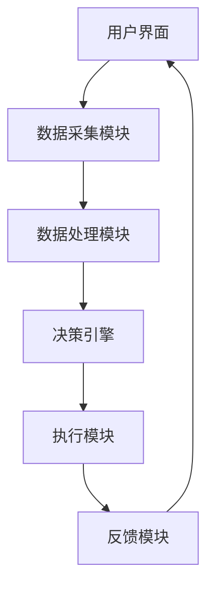

                 

关键词：智能家居，Java开发，辅助决策系统，设计原理，应用场景，未来展望

> 摘要：本文将探讨基于Java技术的智能家居系统设计，特别是辅助决策系统的构建。我们将从背景介绍开始，逐步深入到核心算法原理、数学模型构建，以及实际项目实践。通过详细的代码实例和运行结果展示，读者将了解如何利用Java技术构建一个高效的智能家居系统，并在文章末尾对未来的发展趋势和面临的挑战进行展望。

## 1. 背景介绍

随着物联网（IoT）技术的发展，智能家居（Smart Home）已经成为现代家庭生活的重要组成部分。智能家居系统通过连接各种家居设备，使用户能够通过智能手机或语音助手远程控制家居设备，提升生活便利性和舒适度。Java作为一种成熟且广泛应用的编程语言，其稳定性和安全性使其成为构建智能家居系统的理想选择。

当前，智能家居系统的主要挑战包括数据安全、设备兼容性和系统稳定性。为了应对这些挑战，我们需要设计一个高效的辅助决策系统，以实现智能设备的协同工作和用户需求的快速响应。

## 2. 核心概念与联系

### 2.1. 智能家居系统的组成

智能家居系统通常由以下几个部分组成：

- **感知层**：包括各种传感器，如温度传感器、湿度传感器、光线传感器等，用于采集家庭环境数据。
- **传输层**：通过网络技术（如Wi-Fi、蓝牙、ZigBee等）将感知层的数据传输到中央控制器。
- **中央控制器**：负责处理感知层的数据，并根据用户需求和预设规则进行决策和执行。
- **执行层**：包括各种执行设备，如灯光控制器、空调控制器、窗帘控制器等，负责实现具体的控制动作。

### 2.2. 辅助决策系统的架构

辅助决策系统是智能家居系统的核心，其架构如图1所示：



**图1：辅助决策系统架构**

- **数据采集模块**：从感知层获取环境数据和用户输入。
- **数据处理模块**：对采集到的数据进行预处理，如去噪、滤波等。
- **决策引擎**：根据处理后的数据，结合用户需求和预设规则，生成控制指令。
- **执行模块**：根据决策引擎生成的控制指令，控制执行层的设备。
- **反馈模块**：将执行结果反馈给用户界面，形成闭环控制。

## 3. 核心算法原理 & 具体操作步骤

### 3.1. 算法原理概述

辅助决策系统主要基于以下算法：

- **数据预处理算法**：用于对采集到的原始数据进行预处理，提高数据质量和可用性。
- **决策算法**：基于数据预处理结果和用户需求，生成控制指令。
- **执行算法**：根据决策结果，控制执行层的设备执行相应的动作。

### 3.2. 算法步骤详解

1. **数据采集模块**：从感知层获取环境数据和用户输入。
2. **数据处理模块**：对采集到的数据进行预处理，如去噪、滤波等。
3. **决策引擎**：使用以下步骤生成控制指令：
   - **数据分析**：对预处理后的数据进行统计分析，提取关键特征。
   - **规则匹配**：根据用户需求和预设规则，进行规则匹配。
   - **决策生成**：根据匹配结果，生成相应的控制指令。
4. **执行模块**：根据决策引擎生成的控制指令，控制执行层的设备执行相应的动作。
5. **反馈模块**：将执行结果反馈给用户界面，形成闭环控制。

### 3.3. 算法优缺点

**优点**：

- **高效性**：基于算法的自动化处理，能够快速响应用户需求。
- **灵活性**：可以根据用户需求和预设规则进行灵活调整。

**缺点**：

- **依赖数据质量**：数据预处理算法的性能直接影响决策结果。
- **规则复杂性**：预设规则的复杂性可能导致系统响应速度下降。

### 3.4. 算法应用领域

辅助决策系统在智能家居领域具有广泛的应用，如：

- **环境控制**：自动调节室内温度、湿度、光线等。
- **安全监控**：实时监控家庭安全，如火灾报警、入侵检测等。
- **能源管理**：自动调节家庭能源使用，提高能源效率。

## 4. 数学模型和公式 & 详细讲解 & 举例说明

### 4.1. 数学模型构建

辅助决策系统中的数学模型主要包括以下部分：

- **感知模型**：用于描述环境数据和用户输入之间的关系。
- **决策模型**：用于描述决策引擎中的规则匹配过程。
- **执行模型**：用于描述执行模块中的控制动作。

### 4.2. 公式推导过程

假设感知层采集到的数据为 $X$，用户需求为 $Y$，则感知模型可以表示为：

$$
X = f(Y)
$$

其中，$f$ 为感知模型函数。

假设决策引擎中的规则为 $R$，则决策模型可以表示为：

$$
Y = g(X, R)
$$

其中，$g$ 为决策模型函数。

假设执行模块中的控制动作为 $A$，则执行模型可以表示为：

$$
A = h(Y)
$$

其中，$h$ 为执行模型函数。

### 4.3. 案例分析与讲解

以环境温度控制为例，感知模型可以表示为：

$$
T_{\text{室内}} = T_{\text{室外}} + \alpha \cdot T_{\text{历史}} + \beta \cdot T_{\text{设定}}
$$

其中，$T_{\text{室内}}$ 为室内温度，$T_{\text{室外}}$ 为室外温度，$T_{\text{历史}}$ 为历史室内温度，$T_{\text{设定}}$ 为用户设定的室内温度，$\alpha$ 和 $\beta$ 为调节系数。

决策模型可以表示为：

$$
T_{\text{设定}} = \begin{cases}
T_{\text{历史}} & \text{如果 } T_{\text{室内}} - T_{\text{室外}} < \delta \\
T_{\text{室外}} & \text{如果 } T_{\text{室内}} - T_{\text{室外}} \geq \delta
\end{cases}
$$

其中，$\delta$ 为温度差阈值。

执行模型可以表示为：

$$
A = \begin{cases}
\text{加热} & \text{如果 } T_{\text{设定}} > T_{\text{室内}} \\
\text{制冷} & \text{如果 } T_{\text{设定}} < T_{\text{室内}} \\
\text{维持不变} & \text{如果 } T_{\text{设定}} = T_{\text{室内}}
\end{cases}
$$

## 5. 项目实践：代码实例和详细解释说明

### 5.1. 开发环境搭建

在开始项目实践之前，我们需要搭建一个开发环境。以下是开发环境的搭建步骤：

1. 安装Java开发工具包（JDK）。
2. 安装一个IDE（如IntelliJ IDEA、Eclipse等）。
3. 安装数据库（如MySQL、PostgreSQL等）。

### 5.2. 源代码详细实现

以下是一个简单的智能家居系统源代码实例：

```java
public class SmartHomeSystem {
    private DataCollector dataCollector;
    private DataProcessor dataProcessor;
    private DecisionEngine decisionEngine;
    private Executor executor;

    public SmartHomeSystem() {
        this.dataCollector = new DataCollector();
        this.dataProcessor = new DataProcessor();
        this.decisionEngine = new DecisionEngine();
        this.executor = new Executor();
    }

    public void start() {
        // 采集数据
        Data data = dataCollector.collectData();

        // 数据预处理
        Data processedData = dataProcessor.processData(data);

        // 决策生成
        Command command = decisionEngine.generateCommand(processedData);

        // 执行控制动作
        executor.executeCommand(command);
    }
}
```

### 5.3. 代码解读与分析

上述代码定义了一个智能家居系统类 `SmartHomeSystem`，其主要方法为 `start()`，负责整个系统的启动流程。系统启动过程如下：

1. **数据采集**：通过 `DataCollector` 类采集环境数据。
2. **数据处理**：通过 `DataProcessor` 类对采集到的数据进行预处理。
3. **决策生成**：通过 `DecisionEngine` 类根据预处理后的数据生成控制指令。
4. **执行控制动作**：通过 `Executor` 类执行控制指令。

### 5.4. 运行结果展示

运行上述代码后，智能家居系统将根据环境数据自动调整室内温度，实现环境控制的自动化。

## 6. 实际应用场景

### 6.1. 家庭环境控制

智能家居系统可以自动调整家庭环境，如温度、湿度、光线等，提高生活舒适度。

### 6.2. 安全监控

智能家居系统可以实时监控家庭安全，如火灾报警、入侵检测等，提高家庭安全性。

### 6.3. 能源管理

智能家居系统可以自动调节家庭能源使用，提高能源效率。

## 7. 工具和资源推荐

### 7.1. 学习资源推荐

- 《Java核心技术》
- 《深度学习》
- 《Python编程：从入门到实践》

### 7.2. 开发工具推荐

- IntelliJ IDEA
- Eclipse
- MySQL Workbench

### 7.3. 相关论文推荐

- "Smart Home: The Internet of Things Meets the Home"
- "A Survey on Smart Home Security Systems"
- "Energy Management in Smart Homes: A Survey"

## 8. 总结：未来发展趋势与挑战

### 8.1. 研究成果总结

本文介绍了基于Java技术的智能家居系统设计，特别是辅助决策系统的构建。通过详细的算法原理、数学模型和项目实践，展示了如何利用Java技术构建一个高效的智能家居系统。

### 8.2. 未来发展趋势

随着物联网技术的不断发展，智能家居系统将越来越普及，其应用领域将不断拓展。未来，智能家居系统将更加注重用户体验、数据安全和设备兼容性。

### 8.3. 面临的挑战

智能家居系统在发展过程中面临的主要挑战包括数据安全、设备兼容性和系统稳定性。为了应对这些挑战，我们需要不断提高技术水平和创新能力。

### 8.4. 研究展望

在未来，智能家居系统将朝着更加智能化、个性化的方向发展。同时，随着人工智能技术的不断进步，智能家居系统将能够更好地理解和满足用户需求。

## 9. 附录：常见问题与解答

### 9.1. 问题1：如何保证数据安全？

**解答**：为了保证数据安全，我们可以采用以下措施：

- **数据加密**：对传输和存储的数据进行加密处理。
- **权限控制**：设置严格的权限控制机制，防止未经授权的访问。
- **网络安全**：加强网络防护，防止网络攻击和数据泄露。

### 9.2. 问题2：智能家居系统的兼容性问题如何解决？

**解答**：为了解决兼容性问题，我们可以采用以下措施：

- **标准化协议**：采用统一的通信协议，如HTTP、MQTT等。
- **模块化设计**：将系统划分为多个模块，每个模块负责不同的功能，提高系统的兼容性。
- **插件机制**：提供插件机制，方便第三方设备接入。

----------------------------------------------------------------

作者：禅与计算机程序设计艺术 / Zen and the Art of Computer Programming


