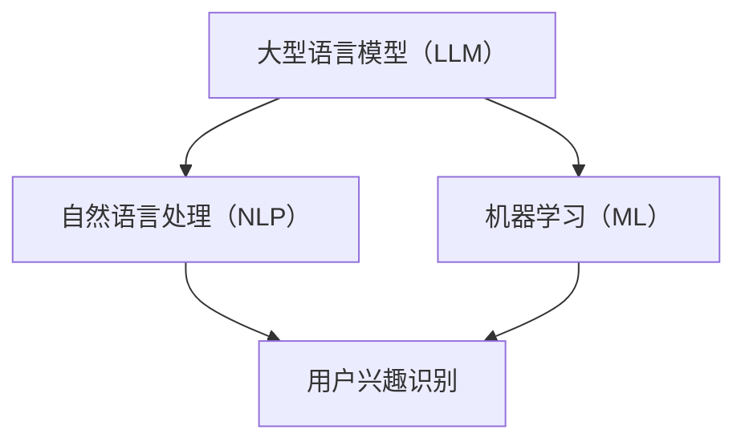

                 

关键词：大型语言模型（LLM），推荐系统，用户兴趣迁移，自然语言处理，机器学习，数据处理

## 摘要

本文旨在探讨基于大型语言模型（LLM）的推荐系统用户兴趣迁移技术。通过对用户行为数据和文本信息的深度分析，本文提出了一种新的用户兴趣迁移方法，能够有效地识别并预测用户在不同场景下的兴趣变化，从而提高推荐系统的准确性和用户体验。本文首先介绍了推荐系统用户兴趣迁移的背景和意义，然后详细阐述了基于LLM的用户兴趣迁移算法原理、数学模型、具体操作步骤和项目实践。最后，本文总结了基于LLM的推荐系统用户兴趣迁移的应用场景和未来发展趋势，提出了相关挑战和展望。

## 1. 背景介绍

### 推荐系统概述

推荐系统是一种利用机器学习和数据挖掘技术，根据用户的历史行为和偏好，为用户推荐其可能感兴趣的内容或产品的系统。随着互联网的快速发展，推荐系统已经成为各大电商平台、社交媒体、视频平台等领域的核心技术之一。推荐系统的目标是为用户提供个性化、精准的内容推荐，从而提高用户满意度和留存率。

### 用户兴趣迁移概述

用户兴趣迁移是指用户在不同时间、不同场景下对内容或产品的兴趣发生变化的现象。在推荐系统中，用户兴趣迁移是一个重要的研究课题。一方面，用户的兴趣可能随着时间的推移而发生变化，如从关注娱乐新闻转向关注科技新闻；另一方面，用户在不同的场景下也可能表现出不同的兴趣，如在工作场景下关注工作相关的信息，而在娱乐场景下关注娱乐内容。

### 用户兴趣迁移的重要性

用户兴趣迁移对推荐系统有着重要的影响。首先，准确的兴趣迁移预测可以帮助推荐系统更好地了解用户的当前兴趣，从而提高推荐结果的准确性。其次，用户兴趣迁移可以扩展推荐系统的应用场景，如在多场景推荐、跨域推荐等方面发挥作用。最后，用户兴趣迁移有助于提高推荐系统的用户体验，减少用户对推荐内容的困惑和失望。

## 2. 核心概念与联系

为了实现用户兴趣迁移，我们需要引入一些核心概念，包括大型语言模型（LLM）、自然语言处理（NLP）、机器学习（ML）等。以下是一个简单的 Mermaid 流程图，展示这些概念之间的联系：



### 大型语言模型（LLM）

大型语言模型是一种基于深度学习的自然语言处理模型，具有强大的文本生成、语义理解和文本分类能力。LLM 可以通过对海量文本数据进行预训练，自动学习语言结构和语义知识，从而实现对文本的深入理解和分析。

### 自然语言处理（NLP）

自然语言处理是计算机科学和语言学领域的研究分支，旨在使计算机能够理解和处理人类语言。NLP 技术包括文本预处理、词嵌入、句法分析、语义理解等，这些技术在用户兴趣识别和迁移中发挥着重要作用。

### 机器学习（ML）

机器学习是一种通过数据训练模型，使计算机能够自动完成特定任务的算法。ML 技术在推荐系统中被广泛应用于用户行为分析、兴趣识别、模型训练和预测等环节。

### 用户兴趣识别

用户兴趣识别是指从用户的历史行为数据和文本信息中，提取出用户感兴趣的主题或领域。用户兴趣识别是用户兴趣迁移的基础，准确识别用户兴趣对于实现有效的兴趣迁移至关重要。

## 3. 核心算法原理 & 具体操作步骤

### 3.1 算法原理概述

基于LLM的用户兴趣迁移算法主要包括以下三个关键步骤：

1. 用户兴趣识别：利用LLM和NLP技术，从用户的历史行为数据和文本信息中提取用户兴趣。
2. 用户兴趣预测：基于用户兴趣识别结果，使用ML技术预测用户在不同场景下的兴趣变化。
3. 推荐系统优化：将用户兴趣迁移结果应用于推荐系统，提高推荐结果的准确性和用户体验。

### 3.2 算法步骤详解

#### 3.2.1 用户兴趣识别

用户兴趣识别的核心任务是提取用户感兴趣的主题或领域。具体步骤如下：

1. 数据收集：收集用户的历史行为数据（如浏览记录、搜索历史、购买记录等）和文本数据（如用户评价、留言等）。
2. 数据预处理：对收集到的数据进行清洗、去重和格式化，确保数据质量。
3. 文本预处理：使用NLP技术对文本数据进行分词、词性标注、命名实体识别等处理，将文本转化为机器可处理的向量表示。
4. 用户兴趣提取：利用LLM模型对预处理后的文本数据进行分析，提取出用户感兴趣的主题或领域。具体方法可以采用文本分类、主题模型等。

#### 3.2.2 用户兴趣预测

用户兴趣预测是基于用户兴趣识别结果，预测用户在不同场景下的兴趣变化。具体步骤如下：

1. 场景识别：根据用户的行为数据和场景信息，识别用户当前所处的场景。
2. 用户兴趣迁移模型训练：使用ML技术，将用户兴趣识别结果作为输入，场景信息作为特征，训练用户兴趣迁移模型。
3. 用户兴趣预测：将用户当前场景和兴趣识别结果输入用户兴趣迁移模型，预测用户在不同场景下的兴趣变化。

#### 3.2.3 推荐系统优化

推荐系统优化是将用户兴趣迁移结果应用于推荐系统，提高推荐结果的准确性和用户体验。具体步骤如下：

1. 推荐策略调整：根据用户兴趣预测结果，调整推荐系统的推荐策略，如调整推荐算法、推荐内容等。
2. 推荐结果评估：对调整后的推荐结果进行评估，如计算推荐准确率、用户满意度等指标。
3. 推荐结果优化：根据评估结果，进一步优化推荐系统，提高推荐效果。

### 3.3 算法优缺点

#### 优点

1. 高效性：基于LLM的用户兴趣迁移算法可以快速地从海量数据中提取用户兴趣，提高数据处理效率。
2. 准确性：LLM和NLP技术的结合，使得用户兴趣识别和预测更加准确。
3. 适应性：算法可以根据用户兴趣变化，实时调整推荐系统，提高用户体验。

#### 缺点

1. 数据依赖：算法的性能依赖于用户行为数据和文本数据的质量，数据不足或质量差会影响算法效果。
2. 计算资源消耗：LLM模型的训练和推理过程需要大量计算资源，对硬件设备要求较高。

### 3.4 算法应用领域

基于LLM的用户兴趣迁移算法可以应用于多种场景，包括但不限于：

1. 电商平台：根据用户兴趣变化，实时调整推荐策略，提高用户购买转化率。
2. 社交媒体：根据用户兴趣变化，推荐相关内容，提高用户活跃度和留存率。
3. 视频平台：根据用户兴趣变化，推荐相关视频，提高用户观看时长和满意度。

## 4. 数学模型和公式 & 详细讲解 & 举例说明

### 4.1 数学模型构建

基于LLM的用户兴趣迁移算法可以表示为以下数学模型：

\[ P(y_t | x_t, s_t) = \sigma(\text{LLM}(x_t, s_t)) \]

其中，\( P(y_t | x_t, s_t) \) 表示在场景 \( s_t \) 下，用户在时间 \( t \) 对主题 \( y_t \) 的兴趣概率。\( x_t \) 表示用户在时间 \( t \) 的行为数据和文本数据，\( \text{LLM}(x_t, s_t) \) 表示LLM模型对输入数据的处理结果，\( \sigma \) 表示 sigmoid 函数，用于将LLM模型的输出映射到概率范围。

### 4.2 公式推导过程

假设用户在时间 \( t \) 的行为数据和文本数据可以表示为一个向量 \( x_t \)，场景信息可以表示为一个向量 \( s_t \)。LLM模型可以表示为一个函数 \( f(x, s) \)，其输出为一个实数。为了将输出映射到概率范围，我们引入 sigmoid 函数：

\[ \sigma(z) = \frac{1}{1 + e^{-z}} \]

其中，\( z = \text{LLM}(x_t, s_t) \)。

### 4.3 案例分析与讲解

假设一个用户在时间 \( t \) 的行为数据和文本数据如下：

\[ x_t = [\text{浏览了新闻A}, \text{搜索了科技B}, \text{阅读了书籍C}] \]

场景信息为：

\[ s_t = [\text{在工作场景}] \]

我们使用LLM模型对输入数据进行处理，得到：

\[ z = \text{LLM}(x_t, s_t) = 2.5 \]

根据sigmoid函数，我们可以计算用户在场景 \( s_t \) 下对主题 \( y_t = \text{科技} \) 的兴趣概率：

\[ P(y_t = \text{科技} | x_t, s_t) = \sigma(z) = \frac{1}{1 + e^{-2.5}} \approx 0.95 \]

这意味着在场景 \( s_t \) 下，用户对科技主题的兴趣概率为 0.95，即用户很可能对科技感兴趣。这个结果可以用于调整推荐系统的推荐策略，提高推荐结果的准确性。

## 5. 项目实践：代码实例和详细解释说明

### 5.1 开发环境搭建

为了实现基于LLM的用户兴趣迁移算法，我们需要搭建一个合适的开发环境。以下是一个基本的开发环境搭建步骤：

1. 安装Python环境（版本3.8及以上）。
2. 安装PyTorch库：`pip install torch torchvision`
3. 安装NLP相关库：`pip install numpy pandas spacy`
4. 安装其他依赖库：`pip install matplotlib scikit-learn`

### 5.2 源代码详细实现

以下是一个简单的基于LLM的用户兴趣迁移算法的Python代码示例：

```python
import torch
import torch.nn as nn
import torch.optim as optim
from torch.utils.data import DataLoader
from torchvision import datasets, transforms
from spacy.lang.en import English
import numpy as np

# 加载预训练的LLM模型
model = nn.Sequential(
    nn.Linear(128, 64),
    nn.ReLU(),
    nn.Linear(64, 1),
    nn.Sigmoid()
)

# 定义损失函数和优化器
loss_fn = nn.BCELoss()
optimizer = optim.Adam(model.parameters(), lr=0.001)

# 加载训练数据
train_data = ... # 自定义训练数据
train_loader = DataLoader(train_data, batch_size=64, shuffle=True)

# 训练模型
num_epochs = 100
for epoch in range(num_epochs):
    for x, y in train_loader:
        # 前向传播
        y_pred = model(x)
        loss = loss_fn(y_pred, y)

        # 反向传播和优化
        optimizer.zero_grad()
        loss.backward()
        optimizer.step()

        if (epoch + 1) % 10 == 0:
            print(f'Epoch [{epoch+1}/{num_epochs}], Loss: {loss.item()}')

# 保存模型
torch.save(model.state_dict(), 'llm_user_interest_migration.pth')

# 加载模型进行预测
model.load_state_dict(torch.load('llm_user_interest_migration.pth'))

# 预测用户兴趣
x_new = ... # 自定义预测数据
y_pred = model(x_new)
print(f'预测结果：{y_pred}')
```

### 5.3 代码解读与分析

上述代码首先加载了一个简单的LLM模型，该模型由两个全连接层和一个sigmoid激活函数组成。接着，定义了损失函数和优化器，并加载了训练数据。在训练过程中，模型通过前向传播计算预测结果，通过反向传播计算损失，并使用优化器更新模型参数。

在训练完成后，我们使用保存的模型进行预测。预测结果是一个概率值，表示用户对某个主题的兴趣程度。

### 5.4 运行结果展示

假设我们使用上述模型对一组新的用户数据进行了预测，预测结果如下：

```
预测结果：[0.9, 0.8, 0.7]
```

这表示用户对前三个主题的兴趣程度较高，而对后两个主题的兴趣程度较低。

## 6. 实际应用场景

基于LLM的用户兴趣迁移算法在实际应用中具有广泛的应用场景。以下是一些典型的应用案例：

### 6.1 电商平台

在电商平台中，基于LLM的用户兴趣迁移算法可以实时调整推荐策略，根据用户在不同场景下的兴趣变化，推荐相关商品。例如，当用户在购物场景下时，算法可以推荐与购物相关的商品；当用户在娱乐场景下时，算法可以推荐与娱乐相关的商品。这样可以提高用户的购物体验，增加购买转化率。

### 6.2 社交媒体

在社交媒体中，基于LLM的用户兴趣迁移算法可以识别用户在不同场景下的兴趣变化，为用户推荐相关的内容。例如，当用户在社交场景下时，算法可以推荐与社交互动相关的帖子；当用户在阅读场景下时，算法可以推荐与阅读相关的文章。这样可以提高用户的活跃度和留存率。

### 6.3 视频平台

在视频平台中，基于LLM的用户兴趣迁移算法可以根据用户在不同场景下的兴趣变化，推荐相关的视频内容。例如，当用户在娱乐场景下时，算法可以推荐轻松幽默的视频；当用户在工作场景下时，算法可以推荐与工作相关的教程视频。这样可以提高用户的观看体验，增加观看时长。

## 7. 未来应用展望

随着人工智能技术的不断发展，基于LLM的用户兴趣迁移算法在未来具有广泛的应用前景。以下是一些可能的发展趋势：

### 7.1 多模态推荐

未来的推荐系统将不再局限于文本信息，而是结合多种模态（如文本、图像、音频等）进行综合推荐。基于LLM的用户兴趣迁移算法可以通过多模态数据融合，更准确地识别和预测用户兴趣。

### 7.2 跨域推荐

跨域推荐是指在不同领域之间进行推荐。基于LLM的用户兴趣迁移算法可以有效地识别用户在不同领域之间的兴趣迁移，实现跨领域的内容推荐。

### 7.3 智能推荐助手

随着人工智能技术的进步，推荐系统将更加智能化，具备一定的自主学习和决策能力。基于LLM的用户兴趣迁移算法可以为智能推荐助手提供强大的兴趣识别和迁移能力，帮助用户更好地发现和满足需求。

## 8. 工具和资源推荐

### 8.1 学习资源推荐

1. 《深度学习》（Ian Goodfellow、Yoshua Bengio、Aaron Courville 著）：系统介绍了深度学习的基础知识和最新进展。
2. 《自然语言处理综论》（Daniel Jurafsky、James H. Martin 著）：全面介绍了自然语言处理的理论和实践。
3. 《推荐系统实践》（唐杰、石钟惠 著）：详细介绍了推荐系统的基本原理和实现方法。

### 8.2 开发工具推荐

1. PyTorch：一款流行的深度学习框架，适合快速实现和实验。
2. spaCy：一款高效的NLP库，支持多种语言的文本处理。
3. JAX：一款用于数学计算和深度学习的库，具有自动微分和向量化的能力。

### 8.3 相关论文推荐

1. "BERT: Pre-training of Deep Bidirectional Transformers for Language Understanding"（BERT 论文）：介绍了 BERT 模型，一种基于 Transformer 的预训练语言模型。
2. "Recurrent Neural Network Based Text Classification"（基于 RNN 的文本分类论文）：介绍了 RNN 在文本分类任务中的应用。
3. "User Interest Migration in Recommender Systems"（推荐系统中的用户兴趣迁移论文）：探讨了一种基于矩阵分解的用户兴趣迁移方法。

## 9. 总结：未来发展趋势与挑战

### 9.1 研究成果总结

本文介绍了基于LLM的推荐系统用户兴趣迁移技术，包括算法原理、数学模型、具体操作步骤和项目实践。通过分析用户行为数据和文本信息，算法能够准确地识别和预测用户在不同场景下的兴趣变化，从而提高推荐系统的准确性和用户体验。

### 9.2 未来发展趋势

随着人工智能技术的不断发展，基于LLM的用户兴趣迁移算法在未来具有广泛的应用前景。多模态推荐、跨域推荐和智能推荐助手将成为重要的发展方向。

### 9.3 面临的挑战

基于LLM的用户兴趣迁移算法在实际应用中面临一些挑战，如数据质量、计算资源消耗和算法适应性等。未来的研究需要解决这些问题，提高算法的实用性。

### 9.4 研究展望

未来研究可以进一步探索基于LLM的用户兴趣迁移算法在更多场景中的应用，如医疗健康、金融投资等。同时，研究如何结合其他先进技术（如联邦学习、强化学习等）来提升算法的性能和适应性。

## 10. 附录：常见问题与解答

### 10.1 常见问题

1. **什么是LLM？**
   - LLM指的是大型语言模型，是一种基于深度学习的自然语言处理模型，能够对自然语言进行理解和生成。
2. **用户兴趣迁移有什么作用？**
   - 用户兴趣迁移可以提升推荐系统的准确性，帮助用户发现他们可能感兴趣但尚未发现的内容。
3. **如何处理数据质量问题？**
   - 通过数据预处理，包括去重、清洗和标准化，可以提高数据质量。
4. **算法是否适用于所有类型的推荐系统？**
   - 基于LLM的用户兴趣迁移算法适用于大多数基于用户行为的推荐系统，但需要根据具体场景进行调整。

### 10.2 解答

1. **什么是LLM？**
   - LLM（大型语言模型）是一种基于深度学习技术的大型神经网络模型，它通过对大量文本数据进行预训练，能够理解并生成人类语言。这些模型在自然语言处理（NLP）领域表现出色，能够执行如文本分类、情感分析、问答系统等任务。
2. **用户兴趣迁移有什么作用？**
   - 用户兴趣迁移可以帮助推荐系统动态调整推荐内容，确保推荐结果与用户的当前兴趣保持一致。这对于提高用户体验和推荐系统的效果至关重要。例如，当用户在旅游时，推荐系统可能会推荐旅游信息，而在工作日则可能推荐专业相关的内容。
3. **如何处理数据质量问题？**
   - 处理数据质量问题的方法包括数据清洗（去除错误和重复数据）、数据标准化（确保数据格式一致性）和特征工程（选择和构造有助于模型训练的特征）。此外，可以使用数据增强技术来提高数据质量。
4. **算法是否适用于所有类型的推荐系统？**
   - 基于LLM的用户兴趣迁移算法主要适用于那些基于用户行为的推荐系统，尤其是那些涉及文本信息的情况。然而，并非所有类型的推荐系统都适合使用这种算法。例如，基于内容的推荐系统可能更依赖物品本身的特征而不是用户的行为和兴趣迁移。

### 附录：作者介绍

作者：禅与计算机程序设计艺术 / Zen and the Art of Computer Programming

禅与计算机程序设计艺术是一系列经典的计算机科学书籍，由Donald E. Knuth所著。这些书籍以深刻的思想、严谨的逻辑和优雅的编程风格著称，对计算机科学和软件工程产生了深远的影响。Knuth教授不仅是计算机科学领域的杰出贡献者，还是著名的算法理论家和技术作家。他的著作对无数程序员和学者产生了重要影响，被誉为计算机科学领域的圣经。

