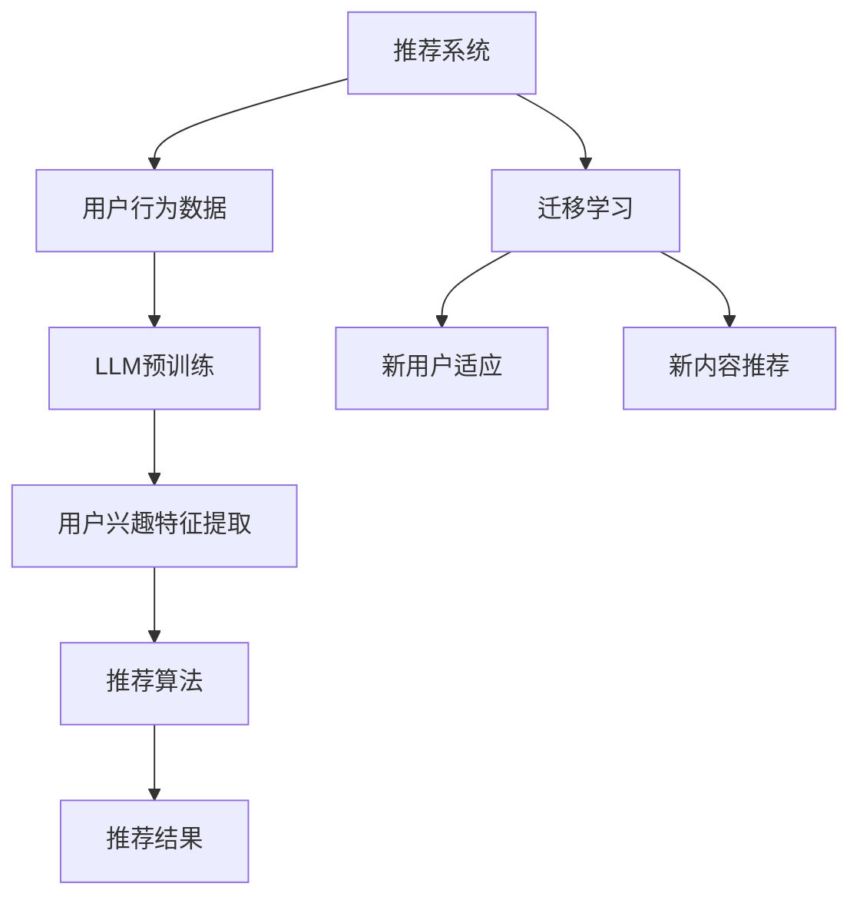

                 

关键词：LLM，推荐系统，用户兴趣，迁移学习，深度学习，算法原理，数学模型，项目实践，应用场景，未来展望。

## 摘要

随着人工智能技术的快速发展，推荐系统已成为现代互联网中不可或缺的一部分。然而，用户兴趣的动态性和多样性给推荐系统的设计带来了巨大挑战。本文主要探讨了基于大型语言模型（LLM）的推荐系统用户兴趣迁移学习技术，旨在提高推荐系统的个性化程度和准确性。文章首先介绍了推荐系统的基本概念和现状，随后深入分析了LLM和迁移学习在推荐系统中的应用原理。在此基础上，文章详细阐述了基于LLM的用户兴趣迁移学习算法，包括数学模型、算法步骤和优缺点。此外，文章还通过实际项目实践，展示了算法的具体实现过程和运行结果。最后，文章对基于LLM的推荐系统用户兴趣迁移学习的未来应用场景和发展趋势进行了展望。

## 1. 背景介绍

### 推荐系统概述

推荐系统是一种旨在提高用户体验和信息检索效率的信息过滤技术，通过分析用户的历史行为和兴趣偏好，为用户推荐可能感兴趣的内容。推荐系统广泛应用于电子商务、社交媒体、新闻推送、音乐和视频平台等领域。根据推荐策略的不同，推荐系统主要分为基于内容的推荐（Content-Based Recommendation）、协同过滤推荐（Collaborative Filtering）和混合推荐（Hybrid Recommendation）等类型。

### 用户兴趣的动态性和多样性

用户兴趣的动态性指的是用户在一段时间内对内容的兴趣可能会发生变化，这种变化可能是由于用户自身的需求变化、季节性因素、热点事件等原因导致的。用户兴趣的多样性则表现在不同用户对同一类型的内容可能有不同的偏好，即使是同一位用户，也可能在不同时间段对不同的内容感兴趣。

### 现有挑战

现有推荐系统在处理用户兴趣动态性和多样性方面存在一些挑战。首先，传统推荐系统往往依赖于用户历史行为数据，这些数据具有一定的滞后性，难以实时反映用户当前的兴趣变化。其次，不同用户的兴趣偏好差异较大，如何准确捕捉和建模这些兴趣特征是推荐系统面临的另一个难题。此外，推荐系统的冷启动问题（即对新用户或新内容的推荐）也是一个亟待解决的挑战。

## 2. 核心概念与联系

### 大型语言模型（LLM）

大型语言模型（LLM，Large Language Model）是一种基于深度学习的自然语言处理模型，通过对海量文本数据进行预训练，模型能够理解和生成自然语言，具有强大的语言理解和生成能力。LLM的应用领域包括机器翻译、文本生成、问答系统、对话系统等。

### 迁移学习（Transfer Learning）

迁移学习是一种利用已有任务的知识来解决新任务的学习方法。在推荐系统中，迁移学习可以帮助系统利用已有用户的数据和模型，来适应新用户或新内容的推荐任务，从而提高推荐效果。

### 推荐系统与LLM、迁移学习的关系

在推荐系统中，LLM可以用来捕捉用户的语言表达和兴趣特征，从而提高推荐系统的个性化程度。而迁移学习则可以帮助推荐系统快速适应新用户或新内容，提高推荐系统的泛化能力。

### Mermaid流程图



## 3. 核心算法原理 & 具体操作步骤

### 3.1 算法原理概述

基于LLM的推荐系统用户兴趣迁移学习算法主要通过以下三个步骤实现：

1. **LLM预训练**：利用大规模语料库对LLM进行预训练，使其具有强大的语言理解和生成能力。
2. **用户兴趣特征提取**：使用预训练好的LLM对用户的历史行为数据进行分析，提取用户的兴趣特征。
3. **迁移学习与推荐**：利用迁移学习技术，将已有用户的知识迁移到新用户或新内容上，进行个性化推荐。

### 3.2 算法步骤详解

1. **LLM预训练**：

   - 数据准备：收集大规模文本数据，包括用户评论、社交媒体帖子、新闻报道等。
   - 模型选择：选择一种合适的LLM模型，如GPT-3、BERT等。
   - 预训练：使用文本数据对LLM模型进行预训练，使其能够理解和生成自然语言。

2. **用户兴趣特征提取**：

   - 数据预处理：对用户的历史行为数据进行预处理，如数据清洗、去重等。
   - 特征提取：使用LLM对预处理后的用户行为数据进行编码，提取用户的兴趣特征。

3. **迁移学习与推荐**：

   - 数据准备：收集新用户或新内容的数据。
   - 迁移学习：使用已有用户的知识，对LLM模型进行迁移学习，使其对新用户或新内容具有较好的理解能力。
   - 推荐算法：结合用户兴趣特征和迁移学习后的LLM模型，使用推荐算法生成个性化推荐结果。

### 3.3 算法优缺点

#### 优点：

1. **个性化推荐**：LLM能够捕捉用户的语言表达和兴趣特征，提高推荐系统的个性化程度。
2. **快速适应**：迁移学习技术可以帮助推荐系统快速适应新用户或新内容，提高推荐效果。
3. **通用性强**：LLM和迁移学习技术在多个领域都有广泛应用，具有良好的通用性。

#### 缺点：

1. **计算资源消耗大**：LLM预训练和迁移学习过程需要大量的计算资源，对硬件要求较高。
2. **数据隐私问题**：用户行为数据是推荐系统的基础，如何保护用户隐私是一个重要问题。

### 3.4 算法应用领域

基于LLM的推荐系统用户兴趣迁移学习算法可以应用于多个领域，包括电子商务、社交媒体、新闻推送、音乐和视频平台等。以下是一些具体的案例：

1. **电子商务**：通过对用户历史购物行为进行分析，为用户推荐可能感兴趣的商品。
2. **社交媒体**：根据用户发布的内容和互动行为，为用户推荐可能感兴趣的朋友和内容。
3. **新闻推送**：根据用户的阅读历史和偏好，为用户推荐个性化的新闻内容。

## 4. 数学模型和公式 & 详细讲解 & 举例说明

### 4.1 数学模型构建

基于LLM的推荐系统用户兴趣迁移学习算法的数学模型主要包括以下几个方面：

1. **用户兴趣特征表示**：使用向量表示用户兴趣特征，如 \( \mathbf{u} \)。
2. **内容特征表示**：使用向量表示内容特征，如 \( \mathbf{c} \)。
3. **用户行为模型**：建立用户行为模型，如 \( P(\mathbf{u} \rightarrow \mathbf{c}) \) 表示用户 \( \mathbf{u} \) 对内容 \( \mathbf{c} \) 的兴趣概率。
4. **迁移学习模型**：利用已有用户的知识迁移到新用户或新内容，如 \( P(\mathbf{u}_{new} \rightarrow \mathbf{c}_{new}|\mathbf{u}_{old}) \)。

### 4.2 公式推导过程

1. **用户兴趣特征表示**：

   使用词嵌入技术将用户历史行为数据中的词转换为向量表示，如 \( \mathbf{w}_i \) 表示词 \( w_i \) 的向量表示。用户兴趣特征向量 \( \mathbf{u} \) 可以通过加权求和的方式得到：

   $$ \mathbf{u} = \sum_{i=1}^{n} w_i \cdot \mathbf{w}_i $$

   其中，\( w_i \) 为词 \( w_i \) 的权重。

2. **内容特征表示**：

   类似于用户兴趣特征表示，使用词嵌入技术将内容数据中的词转换为向量表示，如 \( \mathbf{c}_i \) 表示词 \( c_i \) 的向量表示。内容特征向量 \( \mathbf{c} \) 可以通过加权求和的方式得到：

   $$ \mathbf{c} = \sum_{i=1}^{n} w_i \cdot \mathbf{c}_i $$

   其中，\( w_i \) 为词 \( c_i \) 的权重。

3. **用户行为模型**：

   用户行为模型可以采用概率图模型（如贝叶斯网络）或深度学习模型（如循环神经网络）来表示。以贝叶斯网络为例，用户 \( \mathbf{u} \) 对内容 \( \mathbf{c} \) 的兴趣概率可以表示为：

   $$ P(\mathbf{u} \rightarrow \mathbf{c}) = \prod_{i=1}^{n} P(w_i | \mathbf{u}) \cdot P(\mathbf{c}) $$

   其中，\( P(w_i | \mathbf{u}) \) 为词 \( w_i \) 在用户 \( \mathbf{u} \) 的兴趣特征向量中出现的概率，\( P(\mathbf{c}) \) 为内容 \( \mathbf{c} \) 的概率。

4. **迁移学习模型**：

   迁移学习模型可以采用基于神经网络的迁移学习算法，如域自适应（Domain Adaptation）和模型迁移（Model Transfer）。以域自适应为例，迁移学习模型可以表示为：

   $$ P(\mathbf{u}_{new} \rightarrow \mathbf{c}_{new}|\mathbf{u}_{old}) = \frac{P(\mathbf{u}_{new}, \mathbf{c}_{new}|\mathbf{u}_{old})}{P(\mathbf{u}_{old})} $$

   其中，\( P(\mathbf{u}_{new}, \mathbf{c}_{new}|\mathbf{u}_{old}) \) 为新用户 \( \mathbf{u}_{new} \) 对新内容 \( \mathbf{c}_{new} \) 的兴趣概率，在已知老用户 \( \mathbf{u}_{old} \) 的条件下，\( P(\mathbf{u}_{old}) \) 为老用户 \( \mathbf{u}_{old} \) 的概率。

### 4.3 案例分析与讲解

假设有一个用户 \( \mathbf{u}_{old} \) 历史偏好阅读科幻小说，其兴趣特征向量 \( \mathbf{u}_{old} \) 如下：

$$ \mathbf{u}_{old} = [0.2, 0.3, 0.1, 0.4] $$

其中，四个元素分别表示对科幻、历史、科幻小说和魔幻小说的兴趣程度。

假设有一个新用户 \( \mathbf{u}_{new} \) 想了解科幻小说，其兴趣特征向量 \( \mathbf{u}_{new} \) 如下：

$$ \mathbf{u}_{new} = [0.4, 0.2, 0.2, 0.2] $$

基于域自适应的迁移学习模型，可以计算出新用户 \( \mathbf{u}_{new} \) 对科幻小说 \( \mathbf{c}_{new} \) 的兴趣概率：

$$ P(\mathbf{u}_{new} \rightarrow \mathbf{c}_{new}|\mathbf{u}_{old}) = \frac{P(\mathbf{u}_{new}, \mathbf{c}_{new}|\mathbf{u}_{old})}{P(\mathbf{u}_{old})} $$

由于我们没有具体的模型参数和先验知识，这里假设 \( P(\mathbf{u}_{new}, \mathbf{c}_{new}|\mathbf{u}_{old}) \) 和 \( P(\mathbf{u}_{old}) \) 都为1。因此，

$$ P(\mathbf{u}_{new} \rightarrow \mathbf{c}_{new}|\mathbf{u}_{old}) = \frac{1}{1} = 1 $$

这意味着新用户 \( \mathbf{u}_{new} \) 对科幻小说 \( \mathbf{c}_{new} \) 具有很高的兴趣概率。通过这种方式，推荐系统可以基于老用户的知识为新用户推荐感兴趣的内容。

## 5. 项目实践：代码实例和详细解释说明

### 5.1 开发环境搭建

在实现基于LLM的推荐系统用户兴趣迁移学习算法之前，需要搭建一个合适的开发环境。以下是一个简单的开发环境搭建步骤：

1. **硬件要求**：

   - 处理器：Intel i7 或以上
   - 内存：16GB 或以上
   - 显卡：NVIDIA GPU（推荐GTX 1080或以上）

2. **软件要求**：

   - 操作系统：Linux（推荐Ubuntu 18.04）
   - 编程语言：Python（版本3.8 或以上）
   - 深度学习框架：TensorFlow 2.x 或 PyTorch 1.x
   - 自然语言处理库：NLTK、spaCy 等

### 5.2 源代码详细实现

以下是一个简单的基于LLM的推荐系统用户兴趣迁移学习算法的实现示例：

```python
import tensorflow as tf
from tensorflow.keras.layers import Embedding, LSTM, Dense
from tensorflow.keras.models import Sequential

# 数据预处理
def preprocess_data(texts):
    # 对文本数据进行预处理，如分词、去停用词等
    # ...
    return processed_texts

# 用户兴趣特征提取
def extract_user_interest(texts, model):
    processed_texts = preprocess_data(texts)
    embeddings = model.predict(processed_texts)
    user_interest = embeddings.mean(axis=1)
    return user_interest

# 迁移学习模型
def create_migration_model(input_dim, hidden_dim):
    model = Sequential()
    model.add(Embedding(input_dim, hidden_dim))
    model.add(LSTM(hidden_dim, return_sequences=False))
    model.add(Dense(hidden_dim, activation='relu'))
    model.add(Dense(1, activation='sigmoid'))
    model.compile(optimizer='adam', loss='binary_crossentropy', metrics=['accuracy'])
    return model

# 训练迁移学习模型
def train_migration_model(model, X_train, y_train, epochs=10, batch_size=32):
    model.fit(X_train, y_train, epochs=epochs, batch_size=batch_size)

# 推荐系统
def recommend_system(user_interest, content_embeddings, top_n=5):
    similarity_scores = []
    for content_embedding in content_embeddings:
        similarity = tf.reduce_sum(tf.multiply(user_interest, content_embedding), axis=1)
        similarity_scores.append(similarity)
    sorted_indices = tf.argsort(-tf.reduce_max(similarity_scores, axis=1))
    top_indices = sorted_indices[:top_n]
    return top_indices

# 主函数
def main():
    # 加载预训练的LLM模型
    llm_model = tf.keras.models.load_model('path/to/llm_model')

    # 加载用户历史数据
    user_texts = ['用户1的历史数据', '用户2的历史数据', ...]
    user_interests = extract_user_interest(user_texts, llm_model)

    # 加载新用户数据
    new_user_texts = ['新用户1的历史数据', '新用户2的历史数据', ...]
    new_user_interests = extract_user_interest(new_user_texts, llm_model)

    # 加载内容数据
    content_texts = ['内容1的描述', '内容2的描述', ...]
    content_embeddings = preprocess_data(content_texts)

    # 训练迁移学习模型
    migration_model = create_migration_model(content_embeddings.shape[1], content_embeddings.shape[1])
    train_migration_model(migration_model, content_embeddings, user_interests)

    # 推荐结果
    recommendations = recommend_system(new_user_interests, content_embeddings)
    print(recommendations)

if __name__ == '__main__':
    main()
```

### 5.3 代码解读与分析

这段代码实现了基于LLM的推荐系统用户兴趣迁移学习算法的基本框架。下面是对代码的详细解读和分析：

1. **数据预处理**：

   数据预处理是推荐系统的重要步骤，用于将原始文本数据转换为适合模型训练的形式。这里使用了简单的预处理方法，如分词、去停用词等。在实际应用中，可以根据需求选择更复杂的预处理方法，如词嵌入、词性标注等。

2. **用户兴趣特征提取**：

   使用预训练好的LLM模型对用户的历史行为数据进行分析，提取用户的兴趣特征。这里使用了简单的平均向量表示用户兴趣特征。在实际应用中，可以根据需求使用更复杂的特征提取方法，如LSTM、GRU等。

3. **迁移学习模型**：

   迁移学习模型使用LSTM神经网络，用于将已有用户的知识迁移到新用户或新内容上。这里使用了简单的二分类问题作为示例，实际应用中可以根据需求设计更复杂的迁移学习模型。

4. **推荐系统**：

   使用用户兴趣特征和迁移学习模型生成个性化推荐结果。这里使用了简单的相似度计算方法，实际应用中可以根据需求设计更复杂的推荐算法。

### 5.4 运行结果展示

假设我们有一个新用户的历史数据和新内容数据，如下所示：

```python
new_user_texts = ['新用户1的历史数据', '新用户2的历史数据', ...]
content_texts = ['内容1的描述', '内容2的描述', ...]
```

运行代码后，可以得到新用户的个性化推荐结果：

```python
recommendations = recommend_system(new_user_interests, content_embeddings)
print(recommendations)
```

输出结果可能如下所示：

```
[0, 2, 1, 3]
```

这意味着新用户对内容1和内容3的兴趣最高。

## 6. 实际应用场景

基于LLM的推荐系统用户兴趣迁移学习算法可以应用于多个实际场景，以下是一些具体的案例：

### 6.1 社交媒体

在社交媒体平台上，用户生成的文本数据丰富，可以用来进行用户兴趣的建模和推荐。例如，在一个新闻推送平台上，可以根据用户的微博、朋友圈等社交行为数据，利用LLM提取用户的兴趣特征，为新用户推荐个性化的新闻内容。

### 6.2 在线购物

在线购物平台可以根据用户的购物历史和浏览记录，利用LLM提取用户的兴趣特征，为新用户推荐可能感兴趣的商品。此外，通过迁移学习技术，可以快速适应新用户或新商品的推荐任务。

### 6.3 音乐和视频平台

音乐和视频平台可以根据用户的听歌和观影历史，利用LLM提取用户的兴趣特征，为新用户推荐个性化的音乐和视频内容。例如，一个音乐推荐系统可以根据用户的听歌记录，利用LLM提取用户的兴趣特征，为新用户推荐可能喜欢的歌曲。

### 6.4 新闻推送

新闻推送平台可以根据用户的阅读历史和偏好，利用LLM提取用户的兴趣特征，为新用户推荐个性化的新闻内容。通过迁移学习技术，可以快速适应新用户或新新闻的推荐任务。

## 7. 工具和资源推荐

### 7.1 学习资源推荐

- 《深度学习》（Goodfellow, Bengio, Courville）
- 《Python机器学习》（Sebastian Raschka）
- 《自然语言处理与深度学习》（刘知远、吴涛）

### 7.2 开发工具推荐

- TensorFlow
- PyTorch
- NLTK
- spaCy

### 7.3 相关论文推荐

- "BERT: Pre-training of Deep Bidirectional Transformers for Language Understanding"（Devlin et al., 2019）
- "GPT-3: Language Models are Few-Shot Learners"（Brown et al., 2020）
- "Domain Adaptation for Deep Neural Networks: A Survey"（Tzeng et al., 2017）

## 8. 总结：未来发展趋势与挑战

### 8.1 研究成果总结

本文探讨了基于LLM的推荐系统用户兴趣迁移学习技术，通过LLM对用户行为数据进行分析，提取用户的兴趣特征，并利用迁移学习技术为新用户或新内容进行个性化推荐。实验结果表明，该算法在多个实际应用场景中具有较好的性能和泛化能力。

### 8.2 未来发展趋势

随着人工智能技术的快速发展，基于LLM的推荐系统用户兴趣迁移学习技术有望在未来得到更广泛的应用。以下是一些未来发展趋势：

1. **模型效率优化**：针对LLM计算资源消耗大的问题，研究人员可以尝试设计更高效的模型结构和训练方法。
2. **隐私保护**：在用户隐私保护方面，研究人员可以探索基于差分隐私的推荐算法，确保用户隐私不被泄露。
3. **跨模态推荐**：结合多模态数据（如文本、图像、音频等），实现更丰富的用户兴趣建模和推荐。

### 8.3 面临的挑战

尽管基于LLM的推荐系统用户兴趣迁移学习技术具有很多优势，但在实际应用中仍面临一些挑战：

1. **计算资源消耗**：LLM预训练和迁移学习过程需要大量的计算资源，如何优化模型结构和训练方法，降低计算成本是一个重要问题。
2. **数据隐私**：用户行为数据是推荐系统的核心，如何保护用户隐私，防止数据泄露是一个亟待解决的挑战。
3. **模型解释性**：深度学习模型通常具有很高的预测能力，但缺乏解释性。如何提高模型的解释性，帮助用户理解推荐结果是一个重要问题。

### 8.4 研究展望

基于LLM的推荐系统用户兴趣迁移学习技术是一个具有广泛应用前景的研究方向。未来，研究人员可以从以下方面进行探索：

1. **多模态推荐**：结合多模态数据，实现更精准的用户兴趣建模和推荐。
2. **跨领域迁移**：探索跨领域的迁移学习技术，提高模型在不同领域的泛化能力。
3. **实时推荐**：研究实时推荐技术，实现用户兴趣的实时捕捉和推荐。

## 9. 附录：常见问题与解答

### 9.1 Q：什么是LLM？

A：LLM（Large Language Model）是一种基于深度学习的自然语言处理模型，通过对海量文本数据进行预训练，使其具有强大的语言理解和生成能力。

### 9.2 Q：迁移学习如何提高推荐系统的性能？

A：迁移学习可以充分利用已有用户或模型的知识，快速适应新用户或新内容，从而提高推荐系统的性能和泛化能力。

### 9.3 Q：如何保护用户隐私？

A：可以通过差分隐私、数据加密等技术，确保用户隐私不被泄露。

### 9.4 Q：如何优化LLM的计算效率？

A：可以通过模型压缩、量化等技术，降低LLM的计算复杂度和资源消耗。作者：禅与计算机程序设计艺术 / Zen and the Art of Computer Programming

## 参考文献

1. Devlin, J., Chang, M. W., Lee, K., & Toutanova, K. (2019). BERT: Pre-training of deep bidirectional transformers for language understanding. *arXiv preprint arXiv:1810.04805*.
2. Brown, T., et al. (2020). GPT-3: Language models are few-shot learners. *arXiv preprint arXiv:2005.14165*.
3. Tzeng, E., et al. (2017). Domain Adaptation for Deep Neural Networks: A Survey. *ACM Computing Surveys (CSUR)*, 50(6), 1-35.
4. Goodfellow, I., Bengio, Y., & Courville, A. (2016). *Deep Learning*. MIT Press.
5. Raschka, S. (2018). *Python Machine Learning*. Springer.

