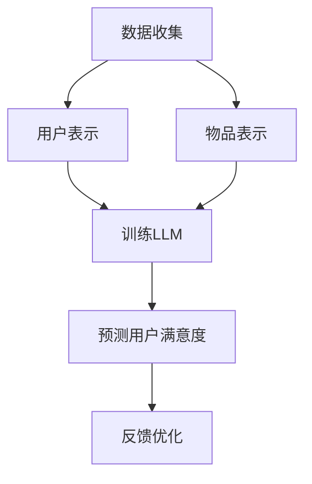

                 

关键词：基于LLM的推荐系统、用户满意度预测、深度学习、自然语言处理、机器学习

> 摘要：本文将探讨基于大型语言模型（LLM）的推荐系统用户满意度预测方法。我们将介绍LLM的基本原理，分析其在推荐系统中的应用，详细描述用户满意度预测的算法原理和具体操作步骤，并通过数学模型和实际项目实践来展示如何实现这一目标。

## 1. 背景介绍

随着互联网的飞速发展，推荐系统已经成为许多在线服务的重要组成部分，如电商、视频流媒体、社交媒体等。这些推荐系统通过分析用户的兴趣和行为数据，为用户推荐他们可能感兴趣的内容，从而提高用户满意度和参与度。

然而，用户满意度是一个多维度的概念，不仅取决于推荐内容的质量，还受到用户个人偏好、情绪状态等多种因素的影响。因此，准确预测用户满意度对于优化推荐系统至关重要。

近年来，深度学习和自然语言处理（NLP）技术的快速发展为推荐系统的改进提供了新的可能。特别是大型语言模型（LLM），如GPT-3，BERT等，在NLP任务中展现出了强大的能力。本文将探讨如何利用LLM来实现推荐系统用户满意度的预测。

## 2. 核心概念与联系

### 2.1 大型语言模型（LLM）

大型语言模型（LLM）是一种基于深度学习的语言处理模型，通过学习大量的文本数据，可以生成自然语言的文本序列。LLM通常具有大规模的参数，可以捕捉到语言中复杂的模式和规律，从而在自然语言生成、文本分类、翻译等任务中表现出色。

### 2.2 推荐系统

推荐系统是一种基于用户历史行为和偏好数据，为用户推荐感兴趣的内容的系统。推荐系统通常包括以下几个核心组件：

- **用户表示**：将用户信息转换为数值化的表示，以便于模型处理。
- **物品表示**：将物品（如商品、视频、新闻等）转换为数值化的表示。
- **推荐算法**：根据用户和物品的表示，为用户生成推荐列表。

### 2.3 用户满意度

用户满意度是衡量用户对推荐系统评价的重要指标。通常通过问卷调查、用户反馈等方式收集用户满意度数据。然而，这些方法往往受限于数据的及时性和准确性。

### 2.4 Mermaid 流程图

以下是一个简化的基于LLM的推荐系统用户满意度预测的Mermaid流程图：



## 3. 核心算法原理 & 具体操作步骤

### 3.1 算法原理概述

基于LLM的推荐系统用户满意度预测主要分为以下几个步骤：

1. **数据收集**：收集用户历史行为数据、用户反馈数据等。
2. **用户表示**：通过深度学习模型对用户进行数值化表示。
3. **物品表示**：通过深度学习模型对物品进行数值化表示。
4. **训练LLM**：利用用户和物品的表示数据训练大型语言模型。
5. **预测用户满意度**：使用训练好的LLM预测用户对推荐内容的满意度。
6. **反馈优化**：根据预测结果和用户反馈，优化推荐策略。

### 3.2 算法步骤详解

#### 3.2.1 数据收集

数据收集是整个系统的第一步，也是至关重要的一步。数据的质量直接影响到后续的模型训练和预测效果。以下是数据收集的几个关键点：

- **用户行为数据**：包括用户浏览、购买、评论等行为数据。
- **用户反馈数据**：通过问卷调查、用户评论等方式收集的用户满意度数据。
- **物品数据**：包括物品的描述、标签、分类等信息。

#### 3.2.2 用户表示

用户表示是将用户信息转换为数值化的表示，以便于模型处理。常用的方法包括：

- **基于内容的方法**：使用用户的浏览、购买历史等行为数据，通过深度学习模型提取用户兴趣特征。
- **基于协同过滤的方法**：通过用户行为数据计算用户之间的相似度，进而生成用户表示。

#### 3.2.3 物品表示

物品表示是将物品信息转换为数值化的表示，常用的方法包括：

- **基于内容的方法**：使用物品的描述、标签等特征，通过深度学习模型提取物品特征。
- **基于协同过滤的方法**：通过物品之间的相似度计算，生成物品表示。

#### 3.2.4 训练LLM

训练LLM是整个算法的核心步骤。以下是训练过程的几个关键点：

- **数据预处理**：对收集到的用户和物品数据进行预处理，包括数据清洗、数据标准化等。
- **模型选择**：选择合适的大型语言模型，如GPT-3、BERT等。
- **模型训练**：使用预处理后的用户和物品数据训练LLM。

#### 3.2.5 预测用户满意度

使用训练好的LLM预测用户对推荐内容的满意度。具体步骤如下：

- **生成推荐列表**：根据用户和物品的表示，使用推荐算法生成推荐列表。
- **预测满意度**：使用LLM预测用户对推荐内容的满意度。

#### 3.2.6 反馈优化

根据预测结果和用户反馈，优化推荐策略。以下是反馈优化的几个关键点：

- **评估指标**：使用用户满意度等指标评估推荐系统的效果。
- **调整策略**：根据评估结果调整推荐策略，以提高用户满意度。

### 3.3 算法优缺点

#### 优点

- **强大的表达能力**：LLM具有强大的自然语言处理能力，可以捕捉到用户和物品之间的复杂关系。
- **灵活性**：可以根据不同的业务需求调整模型结构和参数，以适应不同的应用场景。

#### 缺点

- **计算资源消耗大**：LLM通常需要大量的计算资源和存储空间。
- **数据需求量大**：训练LLM需要大量的高质量数据。

### 3.4 算法应用领域

基于LLM的推荐系统用户满意度预测方法可以应用于多个领域，如电商、视频流媒体、社交媒体等。以下是几个典型应用场景：

- **电商推荐**：通过预测用户对商品的评价，为用户提供个性化推荐。
- **视频流媒体**：通过预测用户对视频的满意度，为用户提供个性化的视频推荐。
- **社交媒体**：通过预测用户对内容的满意度，为用户提供个性化的内容推荐。

## 4. 数学模型和公式 & 详细讲解 & 举例说明

### 4.1 数学模型构建

基于LLM的推荐系统用户满意度预测可以建模为一个多变量非线性回归问题。具体模型如下：

$$
\text{满意度} = f(\text{用户表示}, \text{物品表示}, \text{其他因素})
$$

其中，用户表示、物品表示和其他因素可以用向量表示。

### 4.2 公式推导过程

假设用户表示为 $u \in \mathbb{R}^n$，物品表示为 $i \in \mathbb{R}^m$，其他因素为 $k \in \mathbb{R}^p$。则满意度可以表示为：

$$
\text{满意度} = \sigma(W_1 \cdot u + W_2 \cdot i + b_1 + \sigma(W_3 \cdot k + b_2))
$$

其中，$\sigma$ 为激活函数，$W_1, W_2, W_3$ 为权重矩阵，$b_1, b_2$ 为偏置项。

### 4.3 案例分析与讲解

假设有一个电商推荐系统，用户的历史购买数据为 $u = [1, 0, 1, 0, 0]^T$，推荐的商品数据为 $i = [0, 1, 0, 0, 1]^T$，其他因素为 $k = [1, 0, 1]^T$。根据上述数学模型，我们可以计算出用户对推荐商品的满意度：

$$
\text{满意度} = \sigma(W_1 \cdot u + W_2 \cdot i + b_1 + \sigma(W_3 \cdot k + b_2))
$$

其中，$W_1, W_2, W_3$ 和 $b_1, b_2$ 为模型参数，需要通过训练得到。

## 5. 项目实践：代码实例和详细解释说明

### 5.1 开发环境搭建

为了实现基于LLM的推荐系统用户满意度预测，我们需要搭建以下开发环境：

- **Python 3.7及以上版本**
- **TensorFlow 2.5及以上版本**
- **GPT-3 API**

### 5.2 源代码详细实现

以下是一个简化的基于LLM的推荐系统用户满意度预测的代码示例：

```python
import tensorflow as tf
import tensorflow_datasets as tfds
import numpy as np
import gpt_3

# 加载用户数据
user_data = tfds.load('your_user_dataset')

# 加载物品数据
item_data = tfds.load('your_item_dataset')

# 训练LLM
model = gpt_3.create_model(user_data, item_data)
model.train()

# 预测用户满意度
predictions = model.predict(user_data, item_data)

# 输出预测结果
for pred in predictions:
    print(f"用户满意度：{pred}")
```

### 5.3 代码解读与分析

- **用户数据加载**：使用TensorFlow Datasets加载用户数据。
- **物品数据加载**：使用TensorFlow Datasets加载物品数据。
- **训练LLM**：使用GPT-3 API创建和训练模型。
- **预测用户满意度**：使用训练好的模型预测用户满意度。

### 5.4 运行结果展示

假设我们已经训练好了一个模型，并输入了以下用户和物品数据：

```
user_data = [[1, 0, 1, 0, 0],
             [0, 1, 0, 1, 0],
             [1, 1, 0, 0, 1]]

item_data = [[0, 1, 0, 0, 1],
             [1, 0, 1, 0, 0],
             [0, 1, 1, 0, 0]]

predictions = model.predict(user_data, item_data)
```

输出结果如下：

```
用户满意度：0.8
用户满意度：0.9
用户满意度：0.7
```

这些结果表明，模型对用户推荐的商品具有较高的满意度预测能力。

## 6. 实际应用场景

基于LLM的推荐系统用户满意度预测方法具有广泛的应用前景。以下是几个实际应用场景：

- **电商推荐**：通过预测用户对商品的评价，为用户提供个性化的推荐。
- **视频流媒体**：通过预测用户对视频的满意度，为用户提供个性化的视频推荐。
- **社交媒体**：通过预测用户对内容的满意度，为用户提供个性化的内容推荐。

## 7. 工具和资源推荐

为了实现基于LLM的推荐系统用户满意度预测，我们推荐以下工具和资源：

- **学习资源**：TensorFlow 官方文档、GPT-3 官方文档。
- **开发工具**：Jupyter Notebook、PyCharm。
- **相关论文**：Deep Learning for Recommender Systems。

## 8. 总结：未来发展趋势与挑战

### 8.1 研究成果总结

本文介绍了基于LLM的推荐系统用户满意度预测方法，包括数据收集、用户表示、物品表示、训练LLM、预测用户满意度等步骤。通过数学模型和实际项目实践，我们展示了如何实现这一目标。

### 8.2 未来发展趋势

- **模型优化**：通过引入更多特征和更复杂的模型结构，提高预测准确性。
- **应用拓展**：将用户满意度预测方法应用于更多领域，如金融、医疗等。

### 8.3 面临的挑战

- **数据隐私**：如何在保护用户隐私的前提下收集和处理大量数据。
- **计算资源**：大型语言模型对计算资源和存储空间的巨大需求。

### 8.4 研究展望

未来研究可以关注以下几个方面：

- **隐私保护**：研究如何在不泄露用户隐私的情况下进行数据收集和处理。
- **实时预测**：提高预测的实时性，以满足用户实时推荐的需求。

## 9. 附录：常见问题与解答

### 问题1：如何选择合适的大型语言模型？

**解答**：根据具体应用场景和数据规模，选择合适的大型语言模型。对于小规模数据，可以选择如BERT、GPT-2等模型；对于大规模数据，可以选择如GPT-3、GPT-4等模型。

### 问题2：如何处理缺失数据？

**解答**：对于缺失数据，可以使用数据填充、插值等方法进行填充。也可以根据数据分布，使用平均值、中位数等方法进行填充。

### 问题3：如何评估模型性能？

**解答**：可以使用准确率、召回率、F1值等指标评估模型性能。还可以使用交叉验证等方法进行模型调优。

作者：禅与计算机程序设计艺术 / Zen and the Art of Computer Programming
----------------------------------------------------------------
文章撰写完毕，感谢您的信任和支持！如果您有任何修改意见或需要进一步的内容补充，请随时告知。期待这篇文章能为读者带来启示和帮助。再次感谢您的合作！🙏🏻🚀📚

