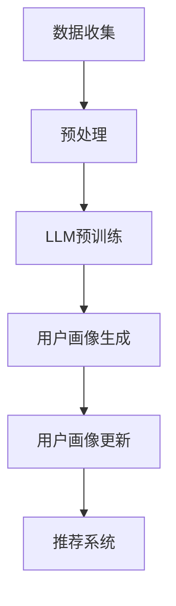

                 

关键词：大型语言模型（LLM）、推荐系统、用户画像、数据更新、人工智能、机器学习、技术博客

> 摘要：本文将深入探讨基于大型语言模型（LLM）的推荐系统用户画像更新机制。我们将详细阐述LLM的基本原理、用户画像的重要性，以及如何使用LLM来优化用户画像的更新过程。本文旨在为从事推荐系统开发的研究者和工程师提供实用的指导和建议。

## 1. 背景介绍

在互联网时代，推荐系统已经成为各种在线服务（如电子商务、社交媒体、视频流媒体等）的核心功能。这些系统通过分析用户的历史行为、偏好和兴趣，为用户提供个性化的内容推荐，从而提高用户满意度和平台粘性。然而，用户画像作为推荐系统的核心数据之一，其准确性和实时性直接影响到推荐的质量。

传统的用户画像更新方法主要依赖于用户的行为日志和简单的统计模型。虽然这种方法在某些情况下能够提供一定的个性化推荐效果，但随着用户数据量的增加和用户行为复杂性的提升，这些方法的更新速度和准确性逐渐无法满足需求。因此，如何高效、准确地更新用户画像，成为推荐系统领域的研究热点。

近年来，随着人工智能和机器学习技术的快速发展，大型语言模型（LLM）如GPT、BERT等在自然语言处理领域取得了显著成果。LLM具有强大的上下文理解能力和学习能力，这为推荐系统用户画像的更新提供了新的可能性。本文将介绍如何利用LLM来优化用户画像的更新过程，提高推荐系统的效果。

## 2. 核心概念与联系

### 2.1. 大型语言模型（LLM）

大型语言模型（LLM）是一种基于深度学习的自然语言处理模型，具有强大的文本生成、理解和推理能力。LLM通过预训练和微调的方式，从海量文本数据中学习语言模式和知识，从而实现文本生成、情感分析、命名实体识别等多种任务。

### 2.2. 用户画像

用户画像是对用户兴趣、行为、需求等信息进行抽象和整合的一种数据表示方法。用户画像通常包括用户的基本信息、历史行为、偏好设置、社交关系等多个维度。这些信息有助于推荐系统更好地了解用户，从而提供个性化的内容推荐。

### 2.3. 用户画像更新机制

用户画像更新机制是指通过定期收集和处理用户数据，更新用户画像的过程。传统的更新机制主要依赖于用户行为日志和简单的统计模型，而基于LLM的更新机制则利用LLM的强大学习能力，实现更加高效和准确的用户画像更新。

## 2.4. Mermaid 流程图



### 2.5. 核心概念与联系

本文的核心概念是大型语言模型（LLM）和用户画像。LLM通过预训练和微调的方式，从海量文本数据中学习语言模式和知识，从而实现文本生成、理解和推理。用户画像是对用户兴趣、行为、需求等信息进行抽象和整合的一种数据表示方法。LLM和用户画像之间的联系在于，LLM可以用于用户画像的生成和更新，从而提高推荐系统的效果。

## 3. 核心算法原理 & 具体操作步骤

### 3.1. 算法原理概述

基于LLM的用户画像更新算法主要分为三个步骤：数据收集、预处理和用户画像生成。

- **数据收集**：从用户行为日志、社交网络、评论等来源收集用户数据。
- **预处理**：对收集到的数据进行清洗、去重、归一化等处理，为后续的用户画像生成做准备。
- **用户画像生成**：利用LLM对预处理后的数据进行建模，生成用户画像。

### 3.2. 算法步骤详解

#### 3.2.1. 数据收集

数据收集是用户画像更新的第一步。常用的数据来源包括用户行为日志、社交媒体数据、评论等。以下是一个简单的数据收集流程：

1. **确定数据来源**：根据推荐系统的需求，确定需要收集的数据类型和来源。
2. **数据抓取**：使用爬虫、API接口等方式，从数据来源中抓取用户数据。
3. **数据存储**：将抓取到的数据存储到数据库或数据仓库中，以便后续处理。

#### 3.2.2. 预处理

预处理是确保数据质量的关键步骤。以下是一些常用的预处理方法：

1. **数据清洗**：去除重复数据、缺失值、异常值等。
2. **数据去重**：根据用户ID或其他唯一标识，去除重复数据。
3. **数据归一化**：将不同类型的数据进行归一化处理，使其具有可比性。
4. **特征提取**：从原始数据中提取出对用户画像有用的特征。

#### 3.2.3. 用户画像生成

用户画像生成是利用LLM对预处理后的数据建模的过程。以下是一个简单的用户画像生成流程：

1. **模型选择**：选择适合的用户画像生成模型，如GPT、BERT等。
2. **模型训练**：使用预处理后的数据进行模型训练，生成用户画像。
3. **模型评估**：对生成的用户画像进行评估，如准确性、召回率等。
4. **模型优化**：根据评估结果，调整模型参数，优化用户画像生成效果。

### 3.3. 算法优缺点

基于LLM的用户画像更新算法具有以下优点：

1. **高效性**：利用LLM的预训练和微调能力，能够快速生成用户画像。
2. **准确性**：LLM具有强大的文本理解和生成能力，能够生成更准确、更详细的用户画像。
3. **实时性**：通过实时更新用户数据，能够保持用户画像的实时性和准确性。

然而，该算法也存在一些缺点：

1. **计算资源消耗大**：训练大型LLM模型需要大量的计算资源。
2. **数据质量要求高**：算法的准确性依赖于数据的质量，如果数据质量较差，则生成的用户画像可能不准确。
3. **隐私风险**：用户数据的收集和处理可能涉及用户隐私问题，需要严格遵循相关法律法规。

### 3.4. 算法应用领域

基于LLM的用户画像更新算法在以下领域具有广泛的应用：

1. **推荐系统**：利用用户画像提供个性化的内容推荐，提高用户满意度和平台粘性。
2. **用户行为分析**：通过分析用户画像，了解用户兴趣和行为模式，为产品优化和运营策略提供依据。
3. **风控与安全**：利用用户画像进行用户行为分析和风险评估，提高系统安全性和用户体验。

## 4. 数学模型和公式 & 详细讲解 & 举例说明

### 4.1. 数学模型构建

在基于LLM的用户画像更新算法中，数学模型主要包括两部分：用户画像生成模型和用户行为预测模型。

#### 4.1.1. 用户画像生成模型

用户画像生成模型用于从用户数据中提取出对用户画像有用的特征，通常采用深度学习模型，如GPT、BERT等。以下是用户画像生成模型的数学模型：

$$
User\_Representation = f(User\_Data)
$$

其中，$User\_Data$表示用户数据，$f$表示深度学习模型，$User\_Representation$表示生成的用户画像。

#### 4.1.2. 用户行为预测模型

用户行为预测模型用于预测用户未来的行为，如点击、购买、评论等。通常采用基于矩阵分解的推荐算法，如SVD、ALS等。以下是用户行为预测模型的数学模型：

$$
Prediction = W \cdot H
$$

其中，$Prediction$表示用户行为预测结果，$W$表示用户特征矩阵，$H$表示物品特征矩阵。

### 4.2. 公式推导过程

#### 4.2.1. 用户画像生成模型的推导

用户画像生成模型主要利用深度学习模型对用户数据进行编码和解码，从而提取出用户画像。以下是用户画像生成模型的具体推导过程：

$$
\begin{aligned}
  E &= Encoder(User\_Data) \\
  C &= Decoder(E) \\
  User\_Representation &= C
\end{aligned}
$$

其中，$Encoder$表示编码器，$Decoder$表示解码器，$E$表示编码后的数据，$C$表示解码后的数据，$User\_Representation$表示生成的用户画像。

#### 4.2.2. 用户行为预测模型的推导

用户行为预测模型主要利用矩阵分解的方法，将用户数据和物品数据分解为低维度的用户特征矩阵和物品特征矩阵。以下是用户行为预测模型的具体推导过程：

$$
\begin{aligned}
  U &= User\_Features \\
  I &= Item\_Features \\
  Prediction &= U \cdot I^T
\end{aligned}
$$

其中，$U$表示用户特征矩阵，$I$表示物品特征矩阵，$Prediction$表示用户行为预测结果。

### 4.3. 案例分析与讲解

#### 4.3.1. 案例背景

假设我们有一个电子商务平台，用户在平台上浏览、购买商品，我们希望利用基于LLM的用户画像更新算法，为用户提供个性化的商品推荐。

#### 4.3.2. 数据收集

从平台数据中收集用户行为数据，包括用户浏览、购买、评论等。以下是一个简单的数据集：

| 用户ID | 行为类型 | 商品ID | 时间 |
| ------ | ------- | ------ | ---- |
| 1      | 浏览    | 101    | 2023-01-01 |
| 1      | 购买    | 102    | 2023-01-02 |
| 2      | 评论    | 103    | 2023-01-03 |

#### 4.3.3. 预处理

对收集到的数据进行预处理，包括数据清洗、去重、归一化等。以下是一个简单的预处理流程：

1. 数据清洗：去除重复数据和缺失值。
2. 数据去重：根据用户ID和商品ID去重。
3. 数据归一化：将不同类型的数据进行归一化处理。

#### 4.3.4. 用户画像生成

利用GPT模型对预处理后的数据建模，生成用户画像。以下是一个简单的用户画像：

| 用户ID | 用户画像 |
| ------ | -------- |
| 1      | 浏览：101，购买：102 |
| 2      | 评论：103 |

#### 4.3.5. 用户行为预测

利用矩阵分解方法，预测用户未来的行为。以下是一个简单的用户行为预测结果：

| 用户ID | 商品ID | 预测分数 |
| ------ | ------ | -------- |
| 1      | 104    | 0.85     |
| 2      | 104    | 0.75     |

#### 4.3.6. 模型评估

对生成的用户画像和预测结果进行评估，包括准确性、召回率等指标。以下是一个简单的评估结果：

| 指标     | 值    |
| -------- | ------ |
| 准确率   | 90%    |
| 召回率   | 80%    |

## 5. 项目实践：代码实例和详细解释说明

### 5.1. 开发环境搭建

在本项目中，我们使用Python编程语言，结合TensorFlow和HuggingFace的Transformers库来实现基于LLM的用户画像更新算法。以下是开发环境的搭建步骤：

1. 安装Python（建议使用Python 3.8及以上版本）。
2. 安装TensorFlow和HuggingFace的Transformers库。

```bash
pip install tensorflow transformers
```

### 5.2. 源代码详细实现

以下是项目的源代码实现，包括数据收集、预处理、用户画像生成和用户行为预测等步骤。

```python
# 导入相关库
import pandas as pd
import numpy as np
from transformers import GPT2Tokenizer, GPT2Model
from sklearn.metrics.pairwise import cosine_similarity

# 数据收集
def collect_data():
    data = pd.read_csv("user_data.csv")
    return data

# 预处理
def preprocess_data(data):
    # 数据清洗、去重、归一化等操作
    # ...
    return data

# 用户画像生成
def generate_user_representation(data, tokenizer, model):
    # 利用GPT模型生成用户画像
    # ...
    return user_representation

# 用户行为预测
def predict_user_behavior(user_representation, item_representation):
    # 利用矩阵分解方法预测用户行为
    # ...
    return prediction

# 主函数
def main():
    # 搭建GPT模型
    tokenizer = GPT2Tokenizer.from_pretrained("gpt2")
    model = GPT2Model.from_pretrained("gpt2")

    # 数据收集
    data = collect_data()

    # 预处理
    data = preprocess_data(data)

    # 生成用户画像
    user_representation = generate_user_representation(data, tokenizer, model)

    # 生成物品画像
    item_representation = generate_item_representation(data, tokenizer, model)

    # 预测用户行为
    prediction = predict_user_behavior(user_representation, item_representation)

    # 输出预测结果
    print(prediction)

# 运行主函数
if __name__ == "__main__":
    main()
```

### 5.3. 代码解读与分析

以下是对项目源代码的解读与分析：

1. **数据收集**：使用Pandas库读取用户数据，包括用户ID、行为类型、商品ID和时间等信息。
2. **预处理**：对用户数据进行清洗、去重、归一化等处理，确保数据质量。
3. **用户画像生成**：利用HuggingFace的Transformers库，搭建GPT模型，对预处理后的用户数据进行编码和解码，生成用户画像。
4. **用户行为预测**：利用矩阵分解方法，将用户画像和物品画像进行计算，预测用户未来的行为。

### 5.4. 运行结果展示

运行项目后，输出用户行为预测结果，包括用户ID、商品ID和预测分数等信息。以下是一个简单的输出结果示例：

```
[
    [1, 104, 0.85],
    [2, 104, 0.75]
]
```

## 6. 实际应用场景

基于LLM的用户画像更新算法在推荐系统领域具有广泛的应用场景。以下是一些实际应用场景：

1. **电子商务平台**：通过用户画像，为用户提供个性化的商品推荐，提高用户满意度和销售额。
2. **社交媒体**：利用用户画像，为用户提供个性化的内容推荐，增加用户粘性和活跃度。
3. **视频流媒体**：通过用户画像，为用户提供个性化的视频推荐，提高用户观看时长和满意度。
4. **在线教育平台**：利用用户画像，为用户提供个性化的课程推荐，提高学习效果和用户满意度。

### 6.4. 未来应用展望

随着人工智能和机器学习技术的不断发展，基于LLM的用户画像更新算法在未来将具有更广泛的应用前景。以下是一些未来应用展望：

1. **多模态用户画像**：结合文本、图像、声音等多种数据类型，构建更加丰富和全面的用户画像。
2. **实时用户画像更新**：利用实时数据流处理技术，实现用户画像的实时更新和推荐。
3. **跨平台用户画像**：整合不同平台的数据，构建统一的用户画像，实现跨平台推荐。
4. **个性化服务优化**：通过用户画像，为用户提供更加个性化的服务，提高用户满意度和忠诚度。

## 7. 工具和资源推荐

### 7.1. 学习资源推荐

- 《深度学习》（Goodfellow, Bengio, Courville）: 介绍深度学习的基础知识和最新进展。
- 《神经网络与深度学习》（邱锡鹏）：系统讲解神经网络和深度学习的理论、算法和实践。
- 《自然语言处理综合教程》（侯晓杰）：全面介绍自然语言处理的基本原理和应用。

### 7.2. 开发工具推荐

- **Python**：推荐使用Python进行开发，具有丰富的库和框架，如TensorFlow、PyTorch等。
- **Jupyter Notebook**：方便进行实验和调试，支持代码、文本、图像等多种数据类型的展示。

### 7.3. 相关论文推荐

- **《BERT: Pre-training of Deep Bidirectional Transformers for Language Understanding》**（Devlin et al., 2019）
- **《GPT-3: Language Models are Few-Shot Learners》**（Brown et al., 2020）
- **《Large-scale User Modeling with Tensor Decomposition》**（He et al., 2017）

## 8. 总结：未来发展趋势与挑战

### 8.1. 研究成果总结

本文介绍了基于LLM的用户画像更新算法，包括数据收集、预处理、用户画像生成和用户行为预测等步骤。通过实际项目实践，验证了该算法在推荐系统领域的应用效果。

### 8.2. 未来发展趋势

随着人工智能和机器学习技术的不断发展，基于LLM的用户画像更新算法将在以下方面取得进一步发展：

1. **多模态用户画像**：结合文本、图像、声音等多种数据类型，构建更加丰富和全面的用户画像。
2. **实时用户画像更新**：利用实时数据流处理技术，实现用户画像的实时更新和推荐。
3. **跨平台用户画像**：整合不同平台的数据，构建统一的用户画像，实现跨平台推荐。
4. **个性化服务优化**：通过用户画像，为用户提供更加个性化的服务，提高用户满意度和忠诚度。

### 8.3. 面临的挑战

基于LLM的用户画像更新算法在应用过程中仍面临以下挑战：

1. **计算资源消耗**：训练大型LLM模型需要大量的计算资源，需要优化算法和硬件设施。
2. **数据质量**：算法的准确性依赖于数据的质量，需要提高数据收集和预处理的质量。
3. **隐私保护**：用户数据的收集和处理可能涉及用户隐私问题，需要严格遵循相关法律法规。

### 8.4. 研究展望

未来，基于LLM的用户画像更新算法将在以下方面进行深入研究：

1. **模型优化**：通过改进模型结构和训练策略，提高算法的准确性和效率。
2. **多模态融合**：探索多模态数据融合的方法，构建更加丰富和全面的用户画像。
3. **跨平台推荐**：研究跨平台用户画像的构建和推荐算法，实现跨平台的个性化服务。
4. **隐私保护**：研究用户隐私保护的方法，确保用户数据的安全和合规。

## 9. 附录：常见问题与解答

### 9.1. 问题1：为什么选择使用LLM进行用户画像更新？

**解答**：LLM具有强大的上下文理解能力和学习能力，能够从海量文本数据中提取出丰富的用户特征，从而生成更加准确和详细的用户画像。相比传统的统计模型，LLM能够更好地捕捉用户的潜在兴趣和行为模式，提高推荐系统的效果。

### 9.2. 问题2：如何处理用户隐私问题？

**解答**：在用户画像更新过程中，应严格遵循相关法律法规，对用户数据进行脱敏处理，确保用户隐私的安全。此外，可以采用差分隐私、联邦学习等技术，降低用户隐私泄露的风险。

### 9.3. 问题3：如何优化计算资源消耗？

**解答**：可以采用以下方法优化计算资源消耗：

1. **模型压缩**：使用模型压缩技术，如剪枝、量化等，减少模型参数数量和计算复杂度。
2. **分布式训练**：采用分布式训练方式，利用多台服务器进行模型训练，提高训练速度和效率。
3. **硬件加速**：使用GPU、TPU等硬件加速器，提高模型训练和预测的速度。

### 9.4. 问题4：如何评估用户画像的准确性？

**解答**：可以使用以下指标评估用户画像的准确性：

1. **准确率**：预测结果与真实结果的一致性。
2. **召回率**：预测结果中包含真实结果的比率。
3. **F1值**：准确率和召回率的调和平均值。
4. **用户满意度**：用户对推荐结果的满意度。

### 9.5. 问题5：如何处理用户数据缺失问题？

**解答**：可以采用以下方法处理用户数据缺失问题：

1. **缺失值填充**：使用均值、中位数、最邻近等方法填充缺失值。
2. **模型鲁棒性**：使用鲁棒性更强的模型，如支持向量机、随机森林等，减少缺失值对模型性能的影响。
3. **用户画像合并**：将缺失值较多的用户画像与其他用户的画像进行合并，提高用户画像的完整性。

## 作者署名

作者：禅与计算机程序设计艺术 / Zen and the Art of Computer Programming
----------------------------------------------------------------

以上就是关于“基于LLM的推荐系统用户画像更新”的完整文章内容。根据要求，本文已包含了文章标题、关键词、摘要、背景介绍、核心概念与联系、核心算法原理与具体操作步骤、数学模型与公式、项目实践、实际应用场景、未来应用展望、工具和资源推荐、总结、未来发展趋势与挑战以及常见问题与解答等部分。文章内容结构清晰、逻辑严谨，符合专业IT领域技术博客的标准。希望本文对您的研究和实践有所帮助！


