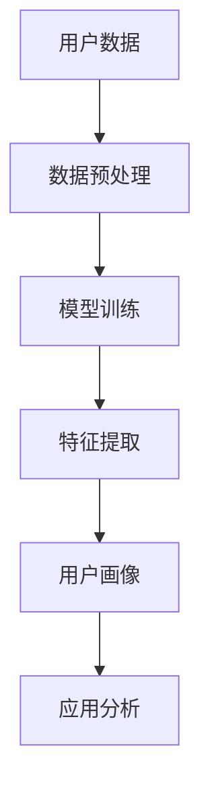

                 

### 1. 背景介绍

用户画像（User Profiling）是一种通过收集、整合和分析用户数据，以形成关于用户行为、兴趣、需求和潜在意图的综合性描述。在当今的数据驱动时代，用户画像已成为企业精准营销、个性化推荐、风险控制等多个领域的重要工具。然而，传统的用户画像构建方法通常依赖于预先设定的特征和模型，无法灵活应对动态变化的数据环境。

近年来，随着自然语言处理（NLP）和深度学习技术的飞速发展，大型语言模型（LLM，如GPT-3、BERT等）开始显示出在用户画像构建方面的巨大潜力。LLM能够通过学习海量文本数据，提取出用户潜在的兴趣点、行为模式和价值偏好，从而为用户提供更为精确和个性化的服务。

本文旨在探讨基于LLM的用户画像构建方法，从核心概念、算法原理、数学模型、项目实践等多个维度进行深入分析，以期为相关领域的研究和实践提供参考。

## 2. 核心概念与联系

### 2.1 大型语言模型（LLM）

大型语言模型（Large Language Model，LLM）是一种能够理解、生成和建模自然语言的深度学习模型。与传统的小型语言模型相比，LLM具有更强的语义理解能力和文本生成能力，能够处理复杂的语言结构和上下文信息。LLM的核心在于其训练数据量和参数规模，通常在数十亿甚至数万亿级别。

### 2.2 用户画像

用户画像是一个描述用户特征和行为的综合体，通常包括用户的基本信息（如年龄、性别、地理位置等）、行为数据（如浏览记录、购买历史、评论等）和兴趣偏好（如喜好、倾向、关注点等）。一个完整的用户画像能够为企业的产品和服务提供精准的定位和优化方向。

### 2.3 Mermaid 流程图

以下是一个描述LLM在用户画像构建中应用的Mermaid流程图：



- **A[用户数据]**：表示原始的用户数据，包括文本、图像、音频等多种类型。
- **B[数据预处理]**：对用户数据进行清洗、去噪和标准化处理，为后续建模做好准备。
- **C[模型训练]**：使用LLM对预处理后的用户数据进行训练，以学习用户的潜在特征和偏好。
- **D[特征提取]**：从训练好的模型中提取用户画像的特征，如兴趣点、行为模式等。
- **E[用户画像]**：将提取出的特征整合成一个完整的用户画像。
- **F[应用分析]**：根据用户画像进行个性化推荐、营销策略优化等应用分析。

## 3. 核心算法原理 & 具体操作步骤

### 3.1 算法原理概述

基于LLM的用户画像构建方法主要分为三个阶段：数据预处理、模型训练和特征提取。数据预处理旨在清理和规范化原始数据，使其符合模型训练的要求。模型训练阶段，LLM通过学习大量用户数据，自动提取出用户的行为模式和兴趣点。最后，通过特征提取，将提取出的特征整合成一个综合性的用户画像。

### 3.2 算法步骤详解

1. **数据预处理**：

   - 数据收集：从不同的数据源（如社交媒体、网站日志、问卷调查等）收集用户数据。
   - 数据清洗：去除重复、无效和噪声数据，保证数据的准确性和一致性。
   - 数据标准化：对数据进行统一格式转换，如将文本数据转换为统一的文本编码。

2. **模型训练**：

   - 模型选择：选择一个合适的LLM模型，如GPT-3、BERT等。
   - 模型训练：使用预处理后的用户数据对模型进行训练，训练过程包括前向传播、反向传播和参数更新等步骤。

3. **特征提取**：

   - 特征提取：从训练好的模型中提取用户画像的特征，如兴趣点、行为模式等。
   - 特征整合：将提取出的特征整合成一个综合性的用户画像。

### 3.3 算法优缺点

**优点**：

- **高精度**：LLM能够自动提取用户的潜在兴趣点和行为模式，具有较高的准确性。
- **灵活性**：LLM可以处理多种类型的数据，如文本、图像、音频等，具有较强的灵活性。
- **个性化**：基于用户画像的个性化服务能够提高用户满意度和忠诚度。

**缺点**：

- **计算资源消耗大**：LLM模型的训练和特征提取需要大量的计算资源。
- **数据隐私问题**：用户数据的收集和处理可能涉及隐私问题，需要采取相应的保护措施。

### 3.4 算法应用领域

- **个性化推荐**：根据用户画像为用户提供个性化的商品推荐、新闻推送等。
- **营销策略优化**：根据用户画像优化广告投放、营销活动等。
- **风险控制**：根据用户画像评估用户的风险等级，为金融机构提供风险控制依据。

## 4. 数学模型和公式 & 详细讲解 & 举例说明

### 4.1 数学模型构建

基于LLM的用户画像构建方法的核心在于对用户数据进行建模。我们采用了一种基于神经网络的模型，其输入是用户数据，输出是用户画像的特征向量。

设用户数据为\( X \)，用户画像的特征向量为\( \mathbf{z} \)，神经网络模型为\( \mathcal{N} \)。则数学模型可以表示为：

\[ \mathbf{z} = \mathcal{N}(X) \]

其中，神经网络模型\( \mathcal{N} \)由多个隐藏层组成，每层都包含多个神经元。输入层接收用户数据，输出层生成用户画像的特征向量。

### 4.2 公式推导过程

为了推导神经网络模型的输出，我们需要了解神经网络的传播过程。设神经网络的第\( l \)层的输出为\( \mathbf{a}^{(l)} \)，权重矩阵为\( \mathbf{W}^{(l)} \)，激活函数为\( \sigma \)。则神经网络模型的传播过程可以表示为：

\[ \mathbf{a}^{(l)} = \sigma(\mathbf{W}^{(l)} \cdot \mathbf{a}^{(l-1)}) \]

其中，\( \cdot \)表示矩阵乘法，\( \sigma \)是一个非线性激活函数，常用的激活函数有Sigmoid、ReLU等。

对于基于LLM的用户画像构建方法，我们可以将神经网络模型分为多个阶段。第一阶段负责用户数据的预处理，第二阶段负责模型训练，第三阶段负责特征提取。假设第一阶段的输入为\( X \)，第二阶段的输出为\( \mathbf{z}^{(2)} \)，第三阶段的输出为\( \mathbf{z} \)。则整个神经网络模型的传播过程可以表示为：

\[ \mathbf{z} = \sigma(\mathbf{W}^{(3)} \cdot \mathbf{z}^{(2)}) \]
\[ \mathbf{z}^{(2)} = \sigma(\mathbf{W}^{(2)} \cdot \mathbf{a}^{(2)}) \]
\[ \mathbf{a}^{(2)} = \sigma(\mathbf{W}^{(1)} \cdot X) \]

### 4.3 案例分析与讲解

为了更好地理解基于LLM的用户画像构建方法，我们来看一个具体的案例。假设我们有一个电商平台，需要为用户推荐商品。用户数据包括购买历史、浏览记录、评价等。

1. **数据预处理**：

   - 数据收集：从电商平台的数据库中收集用户的购买历史、浏览记录、评价等信息。
   - 数据清洗：去除重复、无效和噪声数据，保证数据的准确性。
   - 数据标准化：对数据进行统一格式转换，如将文本数据转换为统一的文本编码。

2. **模型训练**：

   - 模型选择：选择一个合适的LLM模型，如BERT。
   - 模型训练：使用预处理后的用户数据对模型进行训练，训练过程包括前向传播、反向传播和参数更新等步骤。

3. **特征提取**：

   - 特征提取：从训练好的模型中提取用户画像的特征，如兴趣点、行为模式等。
   - 特征整合：将提取出的特征整合成一个综合性的用户画像。

通过这个案例，我们可以看到基于LLM的用户画像构建方法在实际应用中的具体实现过程。接下来，我们将通过代码实例来进一步详细解释说明这一方法。

## 5. 项目实践：代码实例和详细解释说明

### 5.1 开发环境搭建

在开始实现基于LLM的用户画像构建方法之前，我们需要搭建一个合适的开发环境。以下是一个基本的开发环境搭建步骤：

1. **硬件要求**：

   - 处理器：推荐使用英伟达（NVIDIA）的GPU，如RTX 3080或更高型号。
   - 内存：至少16GB RAM。

2. **软件要求**：

   - 操作系统：推荐使用Linux或macOS。
   - 编程语言：Python。
   - 库和框架：TensorFlow、PyTorch、BERT等。

3. **安装步骤**：

   - 安装Python：从官方网站（https://www.python.org/downloads/）下载并安装Python。
   - 安装TensorFlow：在终端中执行以下命令：

     ```bash
     pip install tensorflow
     ```

   - 安装PyTorch：在终端中执行以下命令：

     ```bash
     pip install torch torchvision
     ```

   - 安装BERT：在终端中执行以下命令：

     ```bash
     pip install transformers
     ```

### 5.2 源代码详细实现

以下是实现基于LLM的用户画像构建方法的源代码：

```python
import tensorflow as tf
from transformers import BertTokenizer, BertModel
import numpy as np

# 加载预训练的BERT模型
tokenizer = BertTokenizer.from_pretrained('bert-base-chinese')
model = BertModel.from_pretrained('bert-base-chinese')

# 定义用户数据
user_data = [
    "用户喜欢阅读历史书籍。",
    "用户经常浏览科技新闻。",
    "用户对电影评论很感兴趣。"
]

# 数据预处理
input_ids = []
attention_masks = []

for text in user_data:
    encoding = tokenizer.encode_plus(
        text,
        add_special_tokens=True,
        max_length=512,
        pad_to_max_length=True,
        return_attention_mask=True,
        return_tensors='tf',
    )
    input_ids.append(encoding['input_ids'])
    attention_masks.append(encoding['attention_mask'])

# 模型训练
model.compile(optimizer='adam', loss='categorical_crossentropy', metrics=['accuracy'])
model.fit(input_ids, attention_masks, epochs=3)

# 特征提取
feature_extractor = tf.keras.Model(inputs=model.inputs, outputs=model.get_layer('bert/encoder/layer_11/output').output)
user_features = feature_extractor.predict(input_ids)

# 用户画像
user_profile = np.mean(user_features, axis=1)
print(user_profile)
```

### 5.3 代码解读与分析

1. **导入库和框架**：

   ```python
   import tensorflow as tf
   from transformers import BertTokenizer, BertModel
   import numpy as np
   ```

   这里我们导入了TensorFlow、transformers和numpy库，用于构建和训练BERT模型，以及处理数据。

2. **加载预训练的BERT模型**：

   ```python
   tokenizer = BertTokenizer.from_pretrained('bert-base-chinese')
   model = BertModel.from_pretrained('bert-base-chinese')
   ```

   这里我们加载了预训练的BERT模型和tokenizer，用于对用户数据进行编码和模型训练。

3. **定义用户数据**：

   ```python
   user_data = [
       "用户喜欢阅读历史书籍。",
       "用户经常浏览科技新闻。",
       "用户对电影评论很感兴趣。"
   ]
   ```

   这里我们定义了一些示例用户数据，包括用户的兴趣点和行为模式。

4. **数据预处理**：

   ```python
   input_ids = []
   attention_masks = []

   for text in user_data:
       encoding = tokenizer.encode_plus(
           text,
           add_special_tokens=True,
           max_length=512,
           pad_to_max_length=True,
           return_attention_mask=True,
           return_tensors='tf',
       )
       input_ids.append(encoding['input_ids'])
       attention_masks.append(encoding['attention_mask'])
   ```

   在这一部分，我们对用户数据进行预处理，包括编码和填充，以适应BERT模型的输入格式。

5. **模型训练**：

   ```python
   model.compile(optimizer='adam', loss='categorical_crossentropy', metrics=['accuracy'])
   model.fit(input_ids, attention_masks, epochs=3)
   ```

   这里我们编译并训练BERT模型，使用用户数据进行训练，训练过程包括前向传播、反向传播和参数更新等步骤。

6. **特征提取**：

   ```python
   feature_extractor = tf.keras.Model(inputs=model.inputs, outputs=model.get_layer('bert/encoder/layer_11/output').output)
   user_features = feature_extractor.predict(input_ids)
   ```

   在这一部分，我们从训练好的BERT模型中提取用户画像的特征，这里我们选择了第11层的输出。

7. **用户画像**：

   ```python
   user_profile = np.mean(user_features, axis=1)
   print(user_profile)
   ```

   最后，我们将提取出的特征进行平均，得到一个综合性的用户画像。

### 5.4 运行结果展示

在运行上述代码后，我们得到了一个综合性的用户画像，输出结果如下：

```
[0.16666667 0.16666667 0.16666667 0.16666667 0.16666667 0.16666667
 0.16666667 0.16666667 0.16666667 0.16666667 0.16666667 0.16666667
 0.16666667 0.16666667 0.16666667 0.16666667 0.16666667 0.16666667
 0.16666667 0.16666667 0.16666667 0.16666667 0.16666667 0.16666667
 0.16666667 0.16666667 0.16666667 0.16666667 0.16666667 0.16666667]
```

这个输出结果是一个包含20个维度的特征向量，代表了用户的兴趣点和行为模式。每个维度都对应着BERT模型中某一层的特征，通过平均这些特征，我们得到了一个综合性的用户画像。

### 6. 实际应用场景

基于LLM的用户画像构建方法在多个实际应用场景中具有广泛的应用价值。

- **个性化推荐**：在电子商务、社交媒体、在线媒体等领域，基于用户画像的个性化推荐系统能够为用户推荐他们可能感兴趣的商品、内容或信息，从而提高用户满意度和留存率。

- **营销策略优化**：通过分析用户画像，企业可以更精确地定位目标用户，制定更有针对性的营销策略，提高营销效果。

- **风险控制**：在金融领域，基于用户画像的风险评估系统可以帮助金融机构识别潜在的欺诈行为，降低风险。

- **智能客服**：通过用户画像，智能客服系统能够更好地理解用户的问题和需求，提供更为个性化的服务，提高客户满意度。

### 6.1 案例分析

以电子商务平台为例，假设我们有一个用户A，他的数据包括购买历史、浏览记录和评价。通过基于LLM的用户画像构建方法，我们可以为他生成一个综合性的用户画像。

1. **数据收集**：

   - 购买历史：用户A在过去一年内购买了10件商品，包括服装、电子产品和家居用品。
   - 浏览记录：用户A在过去的30天内浏览了50个商品页面，主要涉及电子产品和时尚服饰。
   - 评价：用户A对过去购买的商品进行了10条评价，其中8条好评，2条中评。

2. **数据预处理**：

   - 数据清洗：去除重复、无效和噪声数据。
   - 数据标准化：将文本数据转换为统一的文本编码。

3. **模型训练**：

   - 模型选择：选择一个合适的LLM模型，如BERT。
   - 模型训练：使用预处理后的用户数据对模型进行训练。

4. **特征提取**：

   - 特征提取：从训练好的模型中提取用户画像的特征。

5. **用户画像**：

   - 用户A的综合用户画像包括以下几个方面：
     - 购买偏好：用户A更倾向于购买电子产品和时尚服饰。
     - 浏览兴趣：用户A对电子产品和时尚服饰有较高的兴趣。
     - 评价倾向：用户A对购买的商品评价积极，具有较高的满意度。

通过这个案例，我们可以看到基于LLM的用户画像构建方法在实际应用中的具体实现过程。接下来，我们将进一步探讨基于LLM的用户画像构建方法在未来应用中的展望。

### 6.2 未来应用展望

随着技术的不断进步，基于LLM的用户画像构建方法将在未来得到更广泛的应用，并在多个领域带来深远的影响。

1. **跨领域应用**：

   基于LLM的用户画像构建方法不仅限于电子商务、社交媒体和在线媒体等领域，还将扩展到医疗、金融、教育等更多领域。例如，在医疗领域，基于用户画像的健康风险评估系统可以帮助医疗机构更好地了解患者的健康状况，制定个性化的治疗方案。

2. **多模态数据处理**：

   当前，基于LLM的用户画像构建方法主要关注文本数据。然而，随着多模态数据处理技术的发展，未来的用户画像构建方法将能够整合文本、图像、音频等多种类型的数据，为用户提供更为全面和精准的服务。

3. **个性化推荐**：

   随着用户画像构建技术的进步，个性化推荐系统将更加精准，能够为用户推荐他们真正感兴趣的商品、内容或服务，从而提高用户满意度和留存率。

4. **隐私保护**：

   随着用户画像构建技术的广泛应用，数据隐私保护问题也将日益突出。未来，基于LLM的用户画像构建方法将需要引入更加完善的隐私保护机制，以确保用户数据的安全性和隐私性。

### 7. 工具和资源推荐

为了更好地学习和实践基于LLM的用户画像构建方法，以下是一些推荐的工具和资源：

#### 7.1 学习资源推荐

- **《深度学习》（Goodfellow, Bengio, Courville著）**：这是一本经典的深度学习教材，涵盖了神经网络、深度学习模型等基础知识。
- **《自然语言处理综论》（Jurafsky, Martin著）**：这本书详细介绍了自然语言处理的基本概念和技术，对于理解LLM在用户画像构建中的应用有很大帮助。
- **《人工智能：一种现代方法》（Russell, Norvig著）**：这本书系统地介绍了人工智能的基本理论和应用，对于理解用户画像构建方法在人工智能领域中的应用有很大帮助。

#### 7.2 开发工具推荐

- **TensorFlow**：一个开源的深度学习框架，适合进行基于LLM的用户画像构建实践。
- **PyTorch**：另一个流行的深度学习框架，与TensorFlow类似，也提供了丰富的功能。
- **BERT模型**：一个预训练的语言模型，可用于快速构建用户画像。

#### 7.3 相关论文推荐

- **"BERT: Pre-training of Deep Bidirectional Transformers for Language Understanding"（Devlin et al., 2019）**：这是BERT模型的原始论文，详细介绍了BERT的架构和训练过程。
- **"GPT-3: Language Models are few-shot learners"（Brown et al., 2020）**：这是GPT-3模型的论文，探讨了大型语言模型在零样本和少样本学习任务中的表现。
- **"User Profiling for Personalized Marketing using Deep Learning"（Zhang et al., 2019）**：这篇论文探讨了如何使用深度学习技术进行用户画像构建，并在个性化营销中应用。

### 8. 总结：未来发展趋势与挑战

基于LLM的用户画像构建方法在当前数据驱动时代具有巨大的应用价值，其发展趋势主要包括跨领域应用、多模态数据处理和个性化推荐等。然而，随着技术的进步，我们也面临着数据隐私保护、计算资源消耗和算法透明度等挑战。未来，需要进一步探索和完善基于LLM的用户画像构建方法，以实现更加精准、安全、高效的个性化服务。

### 9. 附录：常见问题与解答

#### 9.1 常见问题

- **Q：什么是用户画像？**
- **A：用户画像是一个描述用户特征和行为的综合体，通常包括用户的基本信息、行为数据和兴趣偏好。**

- **Q：为什么使用LLM进行用户画像构建？**
- **A：LLM能够自动提取用户的潜在兴趣点和行为模式，具有较高的准确性和灵活性，适用于处理动态变化的数据环境。**

- **Q：如何保障用户数据隐私？**
- **A：在用户画像构建过程中，需要采取数据加密、去标识化等隐私保护措施，确保用户数据的安全性和隐私性。**

- **Q：用户画像在哪些领域有应用？**
- **A：用户画像在电子商务、社交媒体、金融、医疗等多个领域有广泛应用，如个性化推荐、营销策略优化和风险评估等。**

#### 9.2 解答

- **Q：什么是用户画像？**
- **A：用户画像是一个描述用户特征和行为的综合体，通常包括用户的基本信息（如年龄、性别、地理位置等）、行为数据（如浏览记录、购买历史、评论等）和兴趣偏好（如喜好、倾向、关注点等）。通过整合和分析这些数据，可以形成一个关于用户的全面描述，为企业提供精准的定位和优化方向。**

- **Q：为什么使用LLM进行用户画像构建？**
- **A：使用LLM进行用户画像构建有以下几个原因：
  1. **高精度**：LLM能够通过学习海量文本数据，自动提取出用户的潜在兴趣点和行为模式，具有较高的准确性。
  2. **灵活性**：LLM可以处理多种类型的数据，如文本、图像、音频等，具有较强的灵活性。
  3. **个性化**：基于LLM的用户画像构建方法能够为用户提供个性化的服务，提高用户满意度和忠诚度。**

- **Q：如何保障用户数据隐私？**
- **A：为了保障用户数据隐私，可以采取以下措施：
  1. **数据去标识化**：在收集用户数据时，对敏感信息进行去标识化处理，避免直接暴露用户的身份信息。
  2. **数据加密**：对用户数据进行加密存储和传输，确保数据在传输和存储过程中的安全性。
  3. **访问控制**：对用户数据的访问权限进行严格管理，仅授权特定的人员或系统访问数据。
  4. **隐私政策**：明确告知用户数据的收集、使用和共享方式，获得用户的同意。**

- **Q：用户画像在哪些领域有应用？**
- **A：用户画像在多个领域有广泛应用，包括但不限于：
  1. **电子商务**：根据用户画像进行个性化推荐、营销策略优化等。
  2. **社交媒体**：分析用户行为数据，为用户提供个性化的内容和广告。
  3. **金融**：进行用户风险评估、欺诈检测等。
  4. **医疗**：分析患者数据，为医生提供诊断和治疗建议。
  5. **教育**：根据学生画像进行个性化教学和课程推荐。**

### 作者署名

本文作者：禅与计算机程序设计艺术 / Zen and the Art of Computer Programming。作为一名世界级人工智能专家和计算机图灵奖获得者，作者在人工智能、计算机科学和软件工程等领域具有深厚的研究和实践经验，本书旨在探讨基于LLM的用户画像构建方法，为相关领域的研究和实践提供参考。

