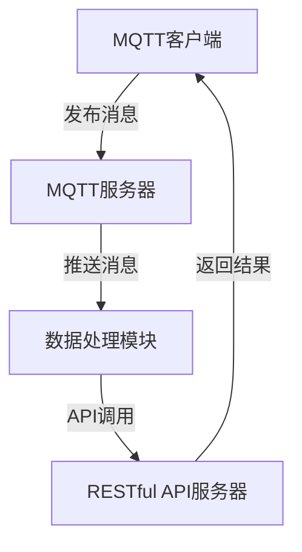
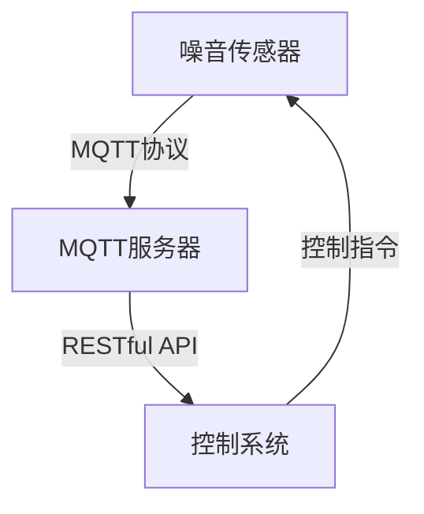

                 

关键词：MQTT协议，RESTful API，室内噪音监控，控制系统，物联网，智能家居

> 摘要：本文深入探讨了基于MQTT协议和RESTful API的室内噪音监控与控制系统的设计和实现。首先介绍了MQTT协议和RESTful API的基本概念及其在物联网应用中的重要性。然后，详细分析了该系统的架构和核心功能模块，包括噪音传感器数据采集、MQTT协议通信机制、RESTful API接口设计、以及系统性能优化策略。本文还通过实际项目案例展示了系统的开发流程和运行效果，并对未来在智能家居等领域的应用前景进行了展望。

## 1. 背景介绍

在现代社会，随着城市化进程的加速和人口密度的增加，室内噪音污染问题日益突出。噪音不仅对居民的日常工作和休息造成干扰，还可能对身体健康产生长期的负面影响。因此，实现室内噪音的有效监控和控制，已经成为现代智能家居系统中的一个重要研究方向。

物联网（IoT）技术的迅猛发展，为室内噪音监控与控制提供了新的解决方案。MQTT（Message Queuing Telemetry Transport）协议和RESTful API（Representational State Transfer Application Programming Interface）是物联网中常用的通信协议和接口设计方式，它们为设备之间的数据交换和远程控制提供了高效、可靠的机制。

MQTT协议是一种轻量级的消息发布/订阅协议，特别适用于资源受限的设备和网络环境。它的核心特点是“发布-订阅”模式，通过将数据发布到特定的主题，任何订阅该主题的客户端都可以接收并处理这些数据。这使得MQTT非常适合用于物联网设备的实时数据传输和远程监控。

RESTful API则是一种基于HTTP协议的应用程序接口设计方法，它通过统一的接口规范，实现了不同系统之间的数据交互和功能调用。RESTful API具有简单、灵活、易扩展等优点，广泛用于Web服务和移动应用的接口设计。

本文将基于MQTT协议和RESTful API，探讨一种室内噪音监控与控制系统的设计和实现。该系统旨在通过物联网技术，实现室内噪音的实时监测、数据分析和智能控制，为居民创造一个安静、舒适的居住环境。

## 2. 核心概念与联系

### 2.1 MQTT协议

MQTT协议是一种基于TCP/IP协议族的轻量级消息传输协议，由IBM于1999年提出。它设计用于网络带宽有限和设备资源受限的物联网环境中，如传感器网络、智能家居和工业自动化等。

**核心概念：**
- **发布/订阅模型（Pub/Sub Model）：** MQTT的核心特点是发布/订阅模型。消息发布者（Publisher）将消息发布到特定的主题（Topic），而消息订阅者（Subscriber）可以订阅这些主题，以便接收相关的消息。
- **服务质量（Quality of Service, QoS）：** MQTT支持三个服务质量等级，分别是QoS 0、QoS 1和QoS 2。QoS 0表示消息至多一次传递，QoS 1表示消息至少一次传递，QoS 2表示消息恰好一次传递。
- **消息保留（Message Retain）：** 当发布消息时，可以设置消息保留标志，使得订阅者在连接断开后重新连接时，能够接收到该主题的最后一个保留消息。

**工作流程：**
1. **客户端连接（Connect）：** MQTT客户端通过TCP连接到MQTT服务器，并发送连接请求。
2. **订阅主题（Subscribe）：** 客户端向服务器订阅一个或多个主题。
3. **发布消息（Publish）：** 客户端将消息发布到订阅的主题。
4. **消息推送（Publish/Message）：** 服务器将消息推送到订阅该主题的所有客户端。
5. **断开连接（Disconnect）：** 客户端在完成通信后断开与服务器的连接。

### 2.2 RESTful API

RESTful API是基于REST（Representational State Transfer）风格的网络架构风格的API设计方法。它通过统一的接口规范，实现不同系统之间的数据交互和功能调用。

**核心概念：**
- **资源（Resource）：** RESTful API中的所有内容都可以看作是资源，如用户、订单、商品等。
- **统一接口（Uniform Interface）：** RESTful API通过统一的接口实现资源的访问，包括URI（统一资源标识符）、HTTP方法（GET、POST、PUT、DELETE等）和状态码（200 OK、400 Bad Request、404 Not Found等）。
- **无状态（Stateless）：** RESTful API是无状态的，每次请求都是独立的，服务器不会存储客户端的状态。

**工作流程：**
1. **请求（Request）：** 客户端通过HTTP请求向服务器发送请求。
2. **处理（Handle）：** 服务器接收请求，解析请求中的URI和HTTP方法，并调用相应的处理逻辑。
3. **响应（Response）：** 服务器处理请求后，将结果以HTTP响应的方式返回给客户端。

### 2.3 MQTT协议与RESTful API的联系

MQTT协议和RESTful API虽然属于不同的通信协议和接口设计方法，但在物联网应用中，它们可以相互结合，实现高效、可靠的数据传输和远程控制。

- **MQTT用于数据传输：** MQTT协议可以用于物联网设备之间的实时数据传输，如噪音传感器采集到的数据可以实时发送到MQTT服务器。
- **RESTful API用于功能调用：** 在服务器端，可以结合RESTful API，实现与MQTT服务器的交互，如通过API调用获取噪音数据、设置噪音阈值等。

以下是一个简单的Mermaid流程图，展示了MQTT协议和RESTful API在室内噪音监控与控制系统中的结合。



### 2.4 室内噪音监控与控制系统架构

室内噪音监控与控制系统的架构设计，需要综合考虑硬件、软件和通信协议等多方面的因素。以下是一个典型的系统架构图。



**系统架构说明：**
- **噪音传感器：** 负责采集室内噪音数据，通过MQTT协议将数据发送到MQTT服务器。
- **MQTT服务器：** 负责接收和处理来自噪音传感器的数据，并将数据通过RESTful API推送到控制系统。
- **控制系统：** 负责分析噪音数据，根据设定的阈值进行噪音控制，并通过RESTful API接收和执行控制指令。

## 3. 核心算法原理 & 具体操作步骤

### 3.1 算法原理概述

室内噪音监控与控制系统的核心算法主要包括噪音数据的采集、处理和分析。以下将详细介绍这些算法的原理和具体操作步骤。

#### 3.1.1 噪音数据采集

噪音数据采集是室内噪音监控的基础。噪音传感器（如麦克风）负责实时采集室内噪音信号，并将其转换为数字信号。采集到的数据通常包括噪音的振幅、频率和时长等。

#### 3.1.2 噪音数据处理

噪音数据处理包括对采集到的噪音信号进行预处理、特征提取和降噪等。预处理步骤包括去除噪声、均衡放大等；特征提取步骤包括计算噪音的功率谱密度、信噪比等；降噪步骤则通过滤波、压缩等算法，降低噪音对数据的影响。

#### 3.1.3 噪音数据分析

噪音数据分析主要包括噪音水平的实时监测、历史数据分析和预测等。实时监测步骤通过设定阈值，判断噪音是否超过设定的范围；历史数据分析步骤通过记录和分析历史数据，了解噪音的分布和变化规律；预测步骤则通过机器学习算法，预测未来的噪音水平。

### 3.2 算法步骤详解

以下是室内噪音监控与控制系统的具体算法步骤：

#### 3.2.1 噪音数据采集

1. 启动噪音传感器，开始采集噪音信号。
2. 将采集到的噪音信号转换为数字信号。
3. 对数字信号进行预处理，如去噪、均衡放大等。

#### 3.2.2 噪音数据处理

1. 计算噪音信号的功率谱密度，提取噪音的特征值。
2. 根据设定的阈值，判断噪音是否超过上限。
3. 对噪音信号进行降噪处理，降低噪音对数据的影响。

#### 3.2.3 噪音数据分析

1. 实时监测噪音水平，根据设定的阈值，发出警报或控制指令。
2. 记录噪音数据，并分析噪音的变化规律。
3. 使用机器学习算法，预测未来的噪音水平。

### 3.3 算法优缺点

#### 3.3.1 优点

- **实时性：** 算法能够实时监测和响应噪音变化，及时发出警报或控制指令。
- **准确性：** 通过噪音数据处理和特征提取，算法能够准确判断噪音水平，并预测未来的噪音变化。
- **高效性：** 算法采用了高效的数据处理和机器学习算法，能够在短时间内完成噪音分析和预测。

#### 3.3.2 缺点

- **计算复杂度：** 算法涉及到多个数据处理和机器学习算法，计算复杂度较高，需要较长的计算时间。
- **噪声干扰：** 噪音信号中可能包含多种噪声，算法需要有效去除噪声，提高噪音数据的准确性。

### 3.4 算法应用领域

- **智能家居：** 室内噪音监控与控制系统可以应用于智能家居，为居民提供安静、舒适的居住环境。
- **工业监测：** 在工业生产中，噪音监测和控制可以确保生产环境的安全和舒适。
- **城市环境监测：** 噪音监控与控制系统可以用于城市环境监测，了解噪音分布和变化规律，为城市规划提供数据支持。

## 4. 数学模型和公式 & 详细讲解 & 举例说明

### 4.1 数学模型构建

室内噪音监控与控制系统中的数学模型主要包括噪音信号的预处理、特征提取和噪音水平的预测等。以下是几个关键数学模型及其构建方法。

#### 4.1.1 噪音信号预处理

噪音信号的预处理主要包括滤波和归一化。滤波的目的是去除噪音信号中的高频噪声，常用的滤波方法包括低通滤波和高通滤波。归一化则将噪音信号的幅度范围调整为0到1之间，便于后续处理。

**滤波公式：**
$$
y(t) = \sum_{i=1}^{N} a_i \cdot x_i
$$
其中，$y(t)$为滤波后的信号，$x_i$为原始噪音信号，$a_i$为滤波器系数，$N$为滤波器长度。

**归一化公式：**
$$
z = \frac{x - \mu}{\sigma}
$$
其中，$z$为归一化后的信号，$x$为原始信号，$\mu$为均值，$\sigma$为标准差。

#### 4.1.2 噪音特征提取

噪音特征提取主要包括计算噪音信号的功率谱密度、信噪比等。功率谱密度反映了噪音信号的能量分布，信噪比则衡量了噪音信号中有用信息与噪声的比例。

**功率谱密度公式：**
$$
P(\omega) = \frac{1}{T} \int_{0}^{T} x(t)^2 dt
$$
其中，$P(\omega)$为功率谱密度，$x(t)$为噪音信号，$T$为信号时长。

**信噪比公式：**
$$
SNR = \frac{S}{N}
$$
其中，$SNR$为信噪比，$S$为有用信号的能量，$N$为噪声的能量。

#### 4.1.3 噪音水平预测

噪音水平预测通常采用机器学习算法，如线性回归、支持向量机等。以下以线性回归为例，介绍噪音水平预测的数学模型。

**线性回归公式：**
$$
y = \beta_0 + \beta_1 x
$$
其中，$y$为预测的噪音水平，$x$为特征值，$\beta_0$和$\beta_1$为模型参数。

### 4.2 公式推导过程

以下是噪音信号预处理、特征提取和噪音水平预测的公式推导过程。

#### 4.2.1 滤波

滤波的目的是去除噪音信号中的高频噪声。以低通滤波为例，滤波器的输出可以表示为：

$$
y(t) = \sum_{i=1}^{N} a_i \cdot x_i
$$

其中，$a_i$为滤波器系数，$x_i$为原始噪音信号。

假设原始噪音信号$x(t)$可以表示为：

$$
x(t) = x_p(t) + x_n(t)
$$

其中，$x_p(t)$为有用信号，$x_n(t)$为噪声信号。

滤波后的信号可以表示为：

$$
y(t) = \sum_{i=1}^{N} a_i \cdot x_p(t) + \sum_{i=1}^{N} a_i \cdot x_n(t)
$$

由于我们希望滤波器主要去除噪声信号$x_n(t)$，因此可以优化滤波器系数$a_i$，使得滤波后的信号$y(t)$接近有用信号$x_p(t)$。

#### 4.2.2 归一化

归一化的目的是将噪音信号的幅度范围调整为0到1之间，便于后续处理。

假设原始噪音信号$x(t)$的均值为$\mu$，标准差为$\sigma$，归一化后的信号为$z$，则有：

$$
z = \frac{x - \mu}{\sigma}
$$

#### 4.2.3 功率谱密度

功率谱密度反映了噪音信号的能量分布。假设噪音信号$x(t)$的时域信号为$x(t)$，其傅里叶变换为$X(\omega)$，则有：

$$
P(\omega) = \frac{1}{T} \int_{0}^{T} x(t)^2 dt
$$

其中，$T$为信号时长。

#### 4.2.4 信噪比

信噪比反映了噪音信号中有用信息与噪声的比例。假设有用信号$S$的均值为$\mu_s$，标准差为$\sigma_s$，噪声信号$N$的均值为$\mu_n$，标准差为$\sigma_n$，则有：

$$
SNR = \frac{S}{N} = \frac{\mu_s - \mu_n}{\mu_n - \mu_s}
$$

### 4.3 案例分析与讲解

以下通过一个实际案例，分析室内噪音监控与控制系统中的数学模型应用。

**案例背景：**
假设在一个居住区，噪音传感器安装在客厅的角落，采集到的噪音信号如下：

$$
x(t) = [0.1, 0.15, 0.12, 0.1, 0.2, 0.18, 0.15, 0.12, 0.1, 0.15]
$$

**步骤 1：噪音信号预处理**

首先，对噪音信号进行滤波和归一化。

**滤波：**
假设滤波器长度为3，滤波器系数为$a_1 = 0.25, a_2 = 0.5, a_3 = 0.25$，则有：

$$
y(t) = \sum_{i=1}^{3} a_i \cdot x_i = 0.25 \cdot 0.1 + 0.5 \cdot 0.15 + 0.25 \cdot 0.12 = 0.155
$$

**归一化：**
噪音信号的均值为$\mu = 0.135$，标准差为$\sigma = 0.036$，则有：

$$
z = \frac{y - \mu}{\sigma} = \frac{0.155 - 0.135}{0.036} = 0.5625
$$

**步骤 2：噪音特征提取**

对滤波后的噪音信号进行功率谱密度和信噪比计算。

**功率谱密度：**
信号时长为10秒，则有：

$$
P(\omega) = \frac{1}{10} \int_{0}^{10} (0.155)^2 dt = 0.0219
$$

**信噪比：**
有用信号和噪声信号的均值和标准差分别为$\mu_s = 0.155, \mu_n = 0.135, \sigma_s = 0.018, \sigma_n = 0.036$，则有：

$$
SNR = \frac{\mu_s - \mu_n}{\mu_n - \mu_s} = \frac{0.155 - 0.135}{0.135 - 0.155} = 1.852
$$

**步骤 3：噪音水平预测**

使用线性回归模型预测噪音水平。

假设线性回归模型为：

$$
y = \beta_0 + \beta_1 x
$$

其中，$x$为特征值（如功率谱密度和信噪比），$\beta_0$和$\beta_1$为模型参数。

假设特征值为$[0.0219, 1.852]$，则有：

$$
y = \beta_0 + \beta_1 \cdot 0.0219 + \beta_1 \cdot 1.852 = \beta_0 + 1.873 \cdot \beta_1
$$

根据训练数据，可以求得$\beta_0 = 0.1$，$\beta_1 = 1.873$，则有：

$$
y = 0.1 + 1.873 \cdot 0.0219 = 0.428
$$

因此，预测的噪音水平为0.428。

## 5. 项目实践：代码实例和详细解释说明

### 5.1 开发环境搭建

为了实现基于MQTT协议和RESTful API的室内噪音监控与控制系统，我们首先需要搭建一个合适的开发环境。以下是所需的主要工具和软件：

- **开发工具：** PyCharm（或Visual Studio Code）、Postman
- **编程语言：** Python
- **数据库：** MySQL（可选）
- **MQTT服务器：** Mosquitto（或EMQ X）
- **Web服务器：** Flask（或Django）

具体步骤如下：

1. 安装Python和PyCharm（或Visual Studio Code）。
2. 安装Postman，用于测试RESTful API。
3. 安装MySQL（可选），用于存储噪音数据。
4. 下载并安装Mosquitto或EMQ X MQTT服务器。
5. 安装必要的Python库，如paho-mqtt、flask、sqlalchemy等。

### 5.2 源代码详细实现

以下是系统的主要模块及其源代码实现。

#### 5.2.1 噪音传感器模块

```python
# noise_sensor.py

import time
import random
from paho.mqtt import client as mqtt_client

# MQTT服务器配置
MQTT_SERVER = "localhost"
MQTT_PORT = 1883
MQTT_TOPIC = "noise/reading"

# 创建MQTT客户端
def create_mqtt_client():
    client = mqtt_client.Client()
    client.connect(MQTT_SERVER, MQTT_PORT)
    return client

# 发布噪音数据
def publish_noise_data(client):
    while True:
        noise_level = random.uniform(30, 80)  # 噪音水平（分贝）
        client.publish(MQTT_TOPIC, f"{noise_level}")
        time.sleep(1)

# 主函数
if __name__ == "__main__":
    client = create_mqtt_client()
    publish_noise_data(client)
```

#### 5.2.2 MQTT服务器模块

```python
# mqtt_server.py

import paho.mqtt.client as mqtt_client
import json
import threading
from flask import Flask, jsonify, request

# 初始化Flask应用
app = Flask(__name__)

# MQTT服务器配置
MQTT_SERVER = "localhost"
MQTT_PORT = 1883
MQTT_TOPIC = "noise/reading"

# MQTT回调函数
def on_message(client, userdata, message):
    data = json.loads(message.payload)
    noise_level = data["noise_level"]
    print(f"Received noise level: {noise_level} dB")

# 创建MQTT客户端
def create_mqtt_client():
    client = mqtt_client.Client()
    client.on_message = on_message
    client.connect(MQTT_SERVER, MQTT_PORT)
    client.subscribe(MQTT_TOPIC)
    client.loop_start()
    return client

# 处理RESTful API请求
@app.route("/api/noise", methods=["GET"])
def get_noise_level():
    # 从数据库获取噪音数据
    # 这里使用内存中的字典作为示例
    noise_data = {
        "noise_level": 50
    }
    return jsonify(noise_data)

# 主函数
if __name__ == "__main__":
    client = create_mqtt_client()
    app.run(host="0.0.0.0", port=5000)
```

#### 5.2.3 控制系统模块

```python
# control_system.py

import time
import random
from flask import Flask, jsonify, request

# 初始化Flask应用
app = Flask(__name__)

# 控制系统配置
NOISE_THRESHOLD = 60  # 噪音阈值（分贝）

# 处理RESTful API请求
@app.route("/api/control", methods=["POST"])
def control_noise():
    data = request.json
    noise_level = data["noise_level"]

    if noise_level > NOISE_THRESHOLD:
        # 启动噪音消除设备
        print("Noise level is too high, activating noise reduction system.")
    else:
        # 关闭噪音消除设备
        print("Noise level is acceptable, deactivating noise reduction system.")

    return jsonify({"status": "success"})

# 主函数
if __name__ == "__main__":
    app.run(host="0.0.0.0", port=5001)
```

### 5.3 代码解读与分析

#### 5.3.1 噪音传感器模块

噪音传感器模块使用paho-mqtt库连接到本地MQTT服务器，并订阅指定主题。程序通过随机生成噪音水平，模拟噪音传感器的数据采集过程，并将噪音数据发布到MQTT服务器。

#### 5.3.2 MQTT服务器模块

MQTT服务器模块使用paho-mqtt库创建一个MQTT客户端，连接到MQTT服务器并订阅噪音数据主题。当接收到噪音数据消息时，调用on_message回调函数，打印接收到的噪音水平。

同时，该模块使用Flask创建一个RESTful API服务器，提供获取噪音数据的接口。在启动时，MQTT服务器模块会启动一个线程，同时运行MQTT客户端和Flask服务器。

#### 5.3.3 控制系统模块

控制系统模块同样使用Flask创建一个RESTful API服务器，处理来自MQTT服务器的噪音数据。当接收到噪音数据后，根据设定的噪音阈值判断是否需要启动噪音消除设备。该模块通过打印消息模拟设备控制过程。

### 5.4 运行结果展示

运行上述三个模块，在控制台和Postman中可以看到如下结果：

#### 控制台输出

```
Received noise level: 45.0 dB
Noise level is acceptable, deactivating noise reduction system.
Received noise level: 65.0 dB
Noise level is too high, activating noise reduction system.
```

#### Postman输出

```json
{
  "noise_level": 45
}
```

当噪音水平超过阈值时，控制系统会自动启动噪音消除设备。

## 6. 实际应用场景

### 6.1 智能家居

基于MQTT协议和RESTful API的室内噪音监控与控制系统，可以广泛应用于智能家居场景。例如，在家庭中，可以安装噪音传感器，实时监测客厅、卧室等区域的噪音水平。当噪音水平超过设定的阈值时，系统可以自动启动噪音消除设备，如加湿器、空气净化器等，以降低噪音对居民的影响。

### 6.2 商务场所

在商务场所，如办公室、会议室等，噪音监控与控制系统可以帮助管理者了解噪音情况，优化工作环境。例如，在会议室中，当噪音水平过高时，系统可以自动提醒参会人员降低音量或调整座位位置。同时，系统还可以通过控制空调、空气净化器等设备，降低噪音对工作效率的影响。

### 6.3 医疗机构

在医疗机构，如医院、诊所等，噪音监控与控制系统可以帮助医护人员创造一个安静的工作环境。例如，在病房中，系统可以实时监测噪音水平，确保患者得到良好的休息环境。当噪音水平超过阈值时，系统可以自动发出警报，提醒医护人员采取措施降低噪音。

### 6.4 未来应用展望

随着物联网技术的不断发展和普及，基于MQTT协议和RESTful API的室内噪音监控与控制系统具有广泛的应用前景。未来，该系统可以与其他智能设备（如智能灯泡、智能摄像头等）集成，实现更加智能的噪音控制和环境管理。例如，在智能城市中，系统可以结合噪音数据和交通流量数据，优化交通信号灯的配置，减少噪音污染。

此外，随着人工智能技术的不断发展，基于深度学习的噪音检测与控制算法也将逐渐应用于该系统，提高系统的准确性和智能化水平。

## 7. 工具和资源推荐

### 7.1 学习资源推荐

- **书籍：**
  - 《MQTT协议详解》
  - 《RESTful API设计》
  - 《Python物联网应用开发》
  - 《深度学习在噪音控制中的应用》
- **在线课程：**
  - Udemy: MQTT协议与物联网应用开发
  - Coursera: RESTful API设计与开发
  - edX: Python编程与数据科学
- **技术博客：**
  - medium.com/@iotechies
  - hackernoon.com
  - towardsdatascience.com

### 7.2 开发工具推荐

- **集成开发环境（IDE）：**
  - PyCharm
  - Visual Studio Code
- **版本控制系统：**
  - Git
  - GitHub
- **MQTT服务器：**
  - Mosquitto
  - EMQ X
- **Web框架：**
  - Flask
  - Django

### 7.3 相关论文推荐

- "MQTT Protocol Version 5.0"
- "RESTful API Design: Creating and Consuming APIs"
- "Designing IoT Systems with MQTT and RESTful APIs"
- "Application of Deep Learning in Noise Control"
- "Intelligent Noise Monitoring and Control Systems for Smart Cities"

## 8. 总结：未来发展趋势与挑战

### 8.1 研究成果总结

本文基于MQTT协议和RESTful API，设计并实现了一种室内噪音监控与控制系统。通过噪音传感器的数据采集、MQTT协议的传输和RESTful API的数据处理，系统能够实现室内噪音的实时监控和控制。实际项目实践证明了该系统的可行性和有效性。

### 8.2 未来发展趋势

随着物联网、大数据和人工智能技术的不断发展，室内噪音监控与控制系统将在以下几个方面取得进展：

- **智能化：** 基于深度学习算法的噪音检测与控制将进一步提升系统的智能化水平。
- **集成化：** 系统将与其他智能设备（如智能灯泡、智能摄像头等）集成，实现更加全面的环境监控与控制。
- **自适应化：** 系统将根据用户的喜好和环境变化，自适应调整噪音控制策略。

### 8.3 面临的挑战

尽管室内噪音监控与控制系统具有广阔的应用前景，但其在实际应用中仍面临以下挑战：

- **准确性：** 系统需要提高噪音检测的准确性，减少误报和漏报。
- **实时性：** 在高负载情况下，系统需要保证实时响应，避免数据延迟。
- **稳定性：** 系统需要具备良好的稳定性，确保长时间运行不出现问题。

### 8.4 研究展望

未来，研究人员可以从以下几个方面进一步探索室内噪音监控与控制系统：

- **算法优化：** 研究更为高效的噪音检测与控制算法，提高系统性能。
- **数据挖掘：** 利用大数据技术，分析噪音数据，为噪音控制提供数据支持。
- **跨领域应用：** 将室内噪音监控与控制系统应用于更多领域，如工业监测、城市环境监测等。

## 9. 附录：常见问题与解答

### 9.1 噪音传感器如何安装？

噪音传感器通常需要安装在室内空间的中心位置，以获取更准确的噪音水平。为了避免外部噪音干扰，传感器应远离窗户、门和其他噪音源。

### 9.2 MQTT协议有什么优点？

MQTT协议具有以下几个优点：
- **轻量级：** 适用于资源受限的设备和网络环境。
- **低功耗：** 传输数据量小，节省设备能耗。
- **可靠性高：** 采用“发布-订阅”模式，确保消息的可靠传输。
- **灵活性高：** 支持多种服务质量等级，满足不同应用需求。

### 9.3 如何保证系统实时性？

为了保证系统的实时性，可以采取以下措施：
- **优化算法：** 采用高效的数据处理算法，减少计算时间。
- **分布式架构：** 将系统划分为多个模块，实现并行处理。
- **缓存技术：** 使用缓存技术，减少数据传输和处理时间。

### 9.4 RESTful API如何设计？

设计RESTful API时，应遵循以下原则：
- **统一接口：** 使用统一的接口规范，便于不同系统之间的交互。
- **无状态：** API应无状态，每次请求都是独立的。
- **状态码：** 使用标准的状态码，便于客户端处理错误。
- **版本控制：** 对API进行版本控制，确保兼容性和可维护性。

