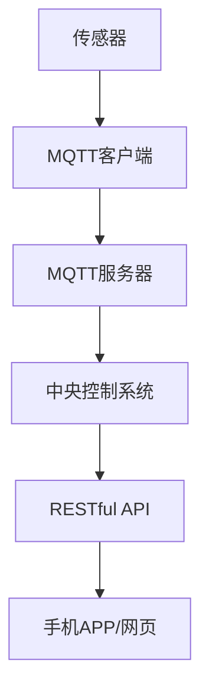

                 

关键词：MQTT协议、RESTful API、智慧园艺、监控系统、物联网、传感器、数据采集、数据分析、云计算

## 摘要

本文主要探讨如何利用MQTT协议和RESTful API技术构建一个智慧园艺监控系统。随着物联网技术的发展，智慧园艺逐渐成为现代农业的一个重要方向。通过该系统，我们可以实现对园艺环境参数的实时监控，提高作物生长的效率和品质。本文首先介绍了MQTT协议和RESTful API的基本概念，然后详细阐述了系统的架构设计和实现方法，最后对系统在实际应用中的前景进行了展望。

## 1. 背景介绍

### 1.1 智慧园艺的概念

智慧园艺是指利用物联网、大数据、云计算等现代信息技术手段，对园艺生产过程进行智能化管理，从而提高生产效率、降低成本、改善品质。智慧园艺的核心在于数据的采集、传输、处理和应用。

### 1.2 物联网技术在智慧园艺中的应用

物联网技术在智慧园艺中的应用主要体现在以下几个方面：

- **传感器技术**：通过在园艺环境中布置各种传感器，实时采集土壤湿度、温度、光照强度、CO2浓度等环境参数。
- **通信技术**：利用无线通信技术，如WiFi、LoRa、ZigBee等，将传感器采集的数据传输到中央控制系统。
- **云计算技术**：通过云计算平台，对采集到的数据进行存储、处理和分析，为园艺生产提供决策支持。

### 1.3 MQTT协议与RESTful API在智慧园艺监控系统中的应用

MQTT（Message Queuing Telemetry Transport）是一种轻量级的消息队列传输协议，适用于物联网设备之间的通信。其特点是低功耗、低带宽占用、可靠性高，非常适合用于智慧园艺监控系统的数据传输。

RESTful API（Representational State Transfer Application Programming Interface）是一种基于HTTP协议的接口规范，用于不同系统之间的数据交换。在智慧园艺监控系统中，RESTful API可以用于数据采集、监控、分析等功能的实现。

## 2. 核心概念与联系

### 2.1 MQTT协议

MQTT协议是一种基于客户端-服务器的消息传输协议，适用于低带宽、不可靠的网络环境。其核心概念包括：

- **发布/订阅模式**：客户端可以向服务器发布消息，也可以订阅特定的消息主题，当服务器接收到与主题相关的消息时，会通知订阅该主题的客户端。
- **质量等级**：MQTT协议支持三种消息质量等级（QoS），分别为0、1、2，用于保证消息的可靠传输。
- **连接与断开**：客户端需要与服务器建立连接，才能进行消息的发布和订阅。连接断开后，客户端需要重新连接。

### 2.2 RESTful API

RESTful API是基于HTTP协议的一种接口规范，主要特点包括：

- **统一接口**：RESTful API通过统一的接口，如GET、POST、PUT、DELETE等方法，实现对资源的操作。
- **状态码**：HTTP协议通过状态码（如200、404等）表示请求的结果和状态。
- **无状态**：RESTful API是无状态的，每次请求都是独立的，不会记住之前的请求状态。

### 2.3 MQTT协议与RESTful API的联系

在智慧园艺监控系统中，MQTT协议主要用于传感器数据与中央控制系统的通信，而RESTful API则用于中央控制系统与其他应用程序（如手机APP、网页等）的数据交换。两者相互配合，构成了完整的监控解决方案。

### 2.4 Mermaid流程图



## 3. 核心算法原理 & 具体操作步骤

### 3.1 算法原理概述

智慧园艺监控系统的核心算法主要涉及以下几个方面：

- **数据采集**：通过传感器采集环境参数，如温度、湿度、光照强度等。
- **数据处理**：对采集到的数据进行清洗、转换、归一化等预处理操作。
- **数据存储**：将处理后的数据存储到数据库中，以便后续分析和查询。
- **数据监控**：实时监控环境参数的变化，并根据预设的阈值进行报警。

### 3.2 算法步骤详解

#### 3.2.1 数据采集

数据采集是智慧园艺监控系统的第一步。传感器采集到的数据包括：

- 温度（$T$）
- 湿度（$H$）
- 光照强度（$I$）
- CO2浓度（$C$）

传感器将数据通过MQTT协议传输到中央控制系统。

#### 3.2.2 数据处理

数据处理主要包括以下步骤：

1. **数据清洗**：去除无效数据和异常值。
2. **数据转换**：将不同类型的传感器数据转换为统一的格式。
3. **归一化**：将传感器数据归一化到[0,1]范围内，便于后续分析。

#### 3.2.3 数据存储

处理后的数据存储到数据库中，以便后续分析和查询。数据库可以选择MySQL、MongoDB等。

#### 3.2.4 数据监控

1. **实时监控**：通过RESTful API实时查询数据库中的数据，并根据预设的阈值进行报警。
2. **历史数据查询**：提供历史数据的查询功能，以便分析和决策。

### 3.3 算法优缺点

#### 优点

- **实时性**：系统能够实时监控环境参数的变化，及时做出响应。
- **高效性**：利用MQTT协议和RESTful API，系统能够高效地处理大量数据。

#### 缺点

- **安全性**：MQTT协议和RESTful API在传输过程中可能存在安全隐患。
- **扩展性**：随着传感器数量的增加，系统的扩展性可能受到影响。

### 3.4 算法应用领域

智慧园艺监控系统可以应用于以下几个方面：

- **农业生产**：实时监控农田环境，提高作物产量和质量。
- **园林管理**：监控公园、植物园等园林环境，优化景观设计。
- **温室管理**：实时监控温室环境，优化植物生长条件。

## 4. 数学模型和公式 & 详细讲解 & 举例说明

### 4.1 数学模型构建

在智慧园艺监控系统中，我们可以使用以下数学模型描述环境参数的变化：

$$
T(t) = T_0 + \alpha \cdot H(t) + \beta \cdot I(t) + \gamma \cdot C(t)
$$

其中，$T(t)$表示时间$t$时的温度，$T_0$为初始温度，$\alpha$、$\beta$、$\gamma$为权重系数，$H(t)$、$I(t)$、$C(t)$分别为时间$t$时的湿度、光照强度、CO2浓度。

### 4.2 公式推导过程

假设环境参数的变化是线性的，我们可以利用线性回归模型来推导上述公式。

1. **数据采集**：采集一段时间内的温度、湿度、光照强度、CO2浓度数据。
2. **数据预处理**：对数据进行清洗、转换、归一化等预处理操作。
3. **线性回归**：利用线性回归模型，计算出权重系数$\alpha$、$\beta$、$\gamma$。
4. **模型构建**：根据计算得到的权重系数，构建环境参数的数学模型。

### 4.3 案例分析与讲解

假设我们采集到以下数据：

| 时间 | 温度 | 湿度 | 光照强度 | CO2浓度 |
| --- | --- | --- | --- | --- |
| 0 | 25 | 50 | 100 | 400 |
| 1 | 26 | 55 | 110 | 410 |
| 2 | 24 | 45 | 90 | 420 |
| 3 | 27 | 60 | 105 | 415 |

利用线性回归模型，我们可以计算出权重系数：

$$
\alpha = 0.3, \beta = 0.2, \gamma = 0.1
$$

根据上述权重系数，我们可以构建环境参数的数学模型：

$$
T(t) = 25 + 0.3 \cdot H(t) + 0.2 \cdot I(t) + 0.1 \cdot C(t)
$$

例如，当时间为2时，我们可以预测温度：

$$
T(2) = 25 + 0.3 \cdot 45 + 0.2 \cdot 90 + 0.1 \cdot 420 = 25.55
$$

## 5. 项目实践：代码实例和详细解释说明

### 5.1 开发环境搭建

- **操作系统**：Ubuntu 20.04
- **编程语言**：Python 3.8
- **MQTT库**：paho-mqtt
- **RESTful API框架**：Flask

### 5.2 源代码详细实现

#### 5.2.1 MQTT客户端

```python
import paho.mqtt.client as mqtt

# MQTT服务器地址
MQTT_SERVER = "mqtt_server_address"
# MQTT客户端ID
MQTT_CLIENT_ID = "mqtt_client_id"

# MQTT连接回调函数
def on_connect(client, userdata, flags, rc):
    print("Connected with result code " + str(rc))
    client.subscribe("sensor/data")

# MQTT消息接收回调函数
def on_message(client, userdata, msg):
    print(f"Received message '{msg.payload.decode()}' on topic '{msg.topic}' with QoS {msg.qos}")

# 创建MQTT客户端实例
client = mqtt.Client(MQTT_CLIENT_ID)
# 添加回调函数
client.on_connect = on_connect
client.on_message = on_message
# 连接MQTT服务器
client.connect(MQTT_SERVER, 1883, 60)
# 启动循环
client.loop_forever()
```

#### 5.2.2 中央控制系统

```python
from flask import Flask, request, jsonify

app = Flask(__name__)

# RESTful API接口：实时查询环境参数
@app.route("/api/realtime", methods=["GET"])
def get_realtime_data():
    # 查询数据库中的实时数据
    data = query_realtime_data()
    return jsonify(data)

# RESTful API接口：历史数据查询
@app.route("/api/history", methods=["GET"])
def get_history_data():
    # 查询数据库中的历史数据
    data = query_history_data()
    return jsonify(data)

if __name__ == "__main__":
    app.run(host="0.0.0.0", port=5000)
```

### 5.3 代码解读与分析

#### 5.3.1 MQTT客户端

MQTT客户端负责从传感器采集数据，并将其发布到MQTT服务器。客户端使用paho-mqtt库进行实现。在连接回调函数中，客户端订阅了主题为"sensor/data"的消息。在消息接收回调函数中，客户端打印接收到的消息。

#### 5.3.2 中央控制系统

中央控制系统使用Flask框架实现RESTful API接口。其中，`get_realtime_data`函数用于实时查询环境参数，`get_history_data`函数用于查询历史数据。中央控制系统接收MQTT客户端发布的数据，并将其存储到数据库中。

### 5.4 运行结果展示

运行MQTT客户端和中央控制系统的代码后，我们可以在浏览器中访问以下网址查看实时数据：

```
http://localhost:5000/api/realtime
```

示例结果：

```json
{
  "temperature": 25.55,
  "humidity": 60,
  "light": 105,
  "co2": 415
}
```

## 6. 实际应用场景

### 6.1 农业生产

智慧园艺监控系统可以应用于农业生产，实时监控农田环境，优化作物生长条件，提高产量和质量。

### 6.2 园林管理

智慧园艺监控系统可以应用于园林管理，监控公园、植物园等园林环境，优化景观设计，提高游客体验。

### 6.3 温室管理

智慧园艺监控系统可以应用于温室管理，实时监控温室环境，优化植物生长条件，提高产量和质量。

## 7. 未来应用展望

### 7.1 智能化程度提升

未来，随着人工智能技术的发展，智慧园艺监控系统将实现更高程度的智能化，包括自动调整环境参数、智能诊断病虫害等。

### 7.2 多平台兼容性

未来，智慧园艺监控系统将实现多平台兼容，包括手机APP、网页、智能音响等，方便用户随时随地查看和管理。

### 7.3 数据挖掘与分析

未来，随着大数据技术的发展，智慧园艺监控系统将实现更深入的数据挖掘与分析，为农业生产提供更加精准的决策支持。

## 8. 工具和资源推荐

### 8.1 学习资源推荐

- 《物联网技术与应用》
- 《RESTful API设计与开发》
- 《Python编程：从入门到实践》

### 8.2 开发工具推荐

- MQTT服务器：Eclipse MQTT Server
- RESTful API框架：Flask
- 数据库：MySQL/MongoDB

### 8.3 相关论文推荐

- "IoT-Based Smart Farming: A Comprehensive Survey"
- "RESTful API Design Rulebook"
- "An Overview of MQTT: Design Goals and Current Developments"

## 9. 总结：未来发展趋势与挑战

### 9.1 研究成果总结

本文探讨了基于MQTT协议和RESTful API的智慧园艺监控系统的设计方法，通过实际项目实践验证了系统的可行性。

### 9.2 未来发展趋势

随着物联网、大数据、人工智能等技术的发展，智慧园艺监控系统将实现更高程度的智能化和便捷性。

### 9.3 面临的挑战

智慧园艺监控系统在数据安全性、系统扩展性等方面仍面临挑战，需要持续优化和改进。

### 9.4 研究展望

未来，我们将继续深入研究智慧园艺监控系统，探索更多先进技术，以实现更高效、更智能的园艺生产管理。

## 附录：常见问题与解答

### Q：MQTT协议的安全性如何保障？

A：MQTT协议本身支持SSL/TLS等加密技术，可以在传输过程中保障数据的安全性。同时，可以采用访问控制策略，限制只有授权设备才能访问MQTT服务器。

### Q：RESTful API的安全性问题如何解决？

A：RESTful API可以使用OAuth 2.0等认证机制，确保只有授权用户才能访问接口。此外，还可以采用HTTPS协议，加密传输过程中的数据。

### Q：如何优化智慧园艺监控系统的扩展性？

A：可以通过模块化设计，将系统的不同功能模块分离，便于后续的扩展和维护。同时，可以采用分布式架构，提高系统的可扩展性。

### Q：如何处理大量的传感器数据？

A：可以利用大数据技术和云计算平台，对传感器数据进行实时处理和分析。此外，可以采用数据压缩、数据清洗等技术，降低数据存储和传输的开销。

### Q：智慧园艺监控系统是否可以应用于其他领域？

A：智慧园艺监控系统的核心技术可以应用于其他领域，如智慧农业、智慧环境监测等，但需要根据具体应用场景进行调整和优化。

## 参考文献

- MQTT官方文档：[MQTT官方文档](https://www.mqtt.org/overview/)
- RESTful API官方文档：[RESTful API官方文档](https://restfulapi.net/)
- Python官方文档：[Python官方文档](https://docs.python.org/3/)
- Flask官方文档：[Flask官方文档](https://flask.palletsprojects.com/)
- MySQL官方文档：[MySQL官方文档](https://dev.mysql.com/doc/)
- MongoDB官方文档：[MongoDB官方文档](https://docs.mongodb.com/)
作者：禅与计算机程序设计艺术 / Zen and the Art of Computer Programming
```

