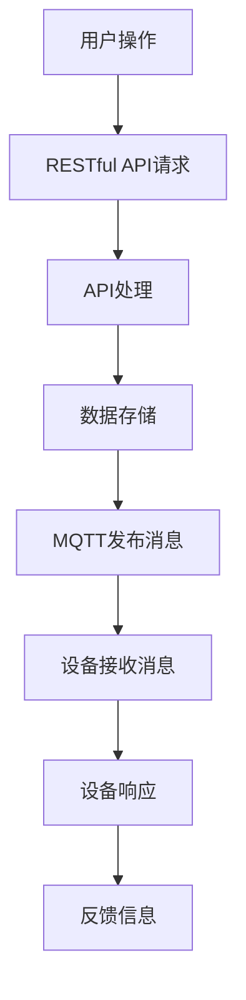

                 

关键词：MQTT协议，RESTful API，智能家居，能效管理，物联网，数据传输，交互设计

> 摘要：随着物联网（IoT）技术的不断发展，智能家居系统已经成为现代家庭的重要组成部分。本文旨在探讨一种基于MQTT协议和RESTful API的智能家居能效管理方案，通过深入分析两者的核心技术原理和实际应用，为构建高效、智能的家居环境提供理论依据和实践指导。

## 1. 背景介绍

### 1.1 智能家居概述

智能家居是指利用物联网技术，将家庭中的各种设备通过网络连接起来，实现自动化控制和管理。智能家居系统可以提供更加便捷、舒适和节能的生活体验，是现代家庭智能化的重要标志。

### 1.2 能效管理的重要性

能效管理是智能家居系统中的一个核心问题。通过智能化的能效管理，不仅可以降低家庭的能耗，还可以提高居住的舒适度和安全性。有效的能效管理对环境保护和能源节约具有深远意义。

### 1.3 MQTT协议和RESTful API

MQTT（Message Queuing Telemetry Transport）是一种轻量级的消息传输协议，广泛用于物联网设备和系统的通信。其特点是低带宽占用、高可靠性和简单的实现。

RESTful API（Representational State Transfer Application Programming Interface）是一种基于HTTP协议的接口设计规范，用于不同系统间的数据交互。RESTful API具有简洁、易于扩展和跨平台的特点。

## 2. 核心概念与联系

### 2.1 MQTT协议

MQTT协议是基于客户端-服务器架构的消息协议，其核心概念包括主题（Topic）、消息（Message）和订阅（Subscribe）。MQTT协议通过主题订阅机制实现设备间的消息传递，确保了数据的实时性和可靠性。

### 2.2 RESTful API

RESTful API通过HTTP请求方法（如GET、POST、PUT、DELETE）实现对资源的操作，其核心概念包括资源（Resource）、端点（Endpoint）和响应（Response）。RESTful API提供了标准化的数据格式（如JSON、XML），方便不同系统间的数据交互。

### 2.3 MQTT协议与RESTful API的联系

MQTT协议和RESTful API都是智能家居系统中的重要组成部分。MQTT协议负责设备间的实时通信，而RESTful API负责系统间的数据共享和操作。两者结合，可以实现智能家居系统的全面监控和管理。

### 2.4 Mermaid流程图



## 3. 核心算法原理 & 具体操作步骤

### 3.1 算法原理概述

本文提出的智能家居能效管理方案，基于MQTT协议和RESTful API实现。核心算法包括数据采集、数据处理、能效分析和反馈控制。

### 3.2 算法步骤详解

#### 3.2.1 数据采集

通过智能家居设备（如智能插座、智能灯泡等）实时采集家庭能耗数据，并将数据上传到云端数据库。

#### 3.2.2 数据处理

使用大数据分析技术对采集到的能耗数据进行分析，提取出家庭能耗的规律和特征。

#### 3.2.3 能效分析

基于分析结果，对家庭的能耗进行预测和优化，提出节能方案。

#### 3.2.4 反馈控制

通过MQTT协议将节能方案发送给智能家居设备，实现设备的自动调节，达到节能效果。

### 3.3 算法优缺点

#### 优点：

1. 实时性：基于MQTT协议的实时通信，确保了数据的及时性和准确性。
2. 高效性：基于RESTful API的数据处理和操作，提高了系统的响应速度和效率。
3. 易扩展性：模块化的设计，方便系统的扩展和维护。

#### 缺点：

1. 安全性：MQTT协议和RESTful API都存在一定的安全风险，需要采取相应的安全措施。
2. 带宽占用：MQTT协议的低带宽特性可能在数据量大时受到限制。

### 3.4 算法应用领域

本文提出的算法方案适用于各种类型的智能家居系统，尤其适用于大型、复杂的智能家居环境。

## 4. 数学模型和公式 & 详细讲解 & 举例说明

### 4.1 数学模型构建

智能家居能效管理方案的核心是能耗数据的分析和预测。本文采用时间序列分析方法构建数学模型。

### 4.2 公式推导过程

设家庭能耗数据为\( X_t \)，其中\( t \)为时间。基于时间序列分析方法，建立能耗数据预测模型：

$$
X_{t+1} = \alpha X_t + (1 - \alpha) X_{t-1} + \epsilon_t
$$

其中，\( \alpha \)为参数，\( \epsilon_t \)为误差项。

### 4.3 案例分析与讲解

假设某家庭一天内的能耗数据如下表：

| 时间（h） | 能耗（kWh） |
| -------- | ---------- |
| 0        | 5.0        |
| 1        | 5.2        |
| 2        | 5.5        |
| 3        | 5.7        |
| 4        | 6.0        |
| 5        | 6.2        |
| 6        | 6.5        |
| 7        | 7.0        |
| 8        | 7.2        |
| 9        | 7.5        |
| 10       | 8.0        |

使用上述数学模型，预测第11小时的能耗。取\( \alpha = 0.5 \)，代入公式计算：

$$
X_{11} = 0.5 \times 7.5 + (1 - 0.5) \times 7.2 + \epsilon_{11} \approx 7.4 + \epsilon_{11}
$$

由于无法准确预测误差项\( \epsilon_{11} \)，我们只能给出预测值的范围。因此，第11小时的能耗预测范围为\( [7.4 - \epsilon_{11}, 7.4 + \epsilon_{11}] \)。

## 5. 项目实践：代码实例和详细解释说明

### 5.1 开发环境搭建

本文使用Python作为开发语言，基于MQTT协议和RESTful API实现智能家居能效管理方案。首先，需要安装相关的Python库：

```bash
pip install paho-mqtt flask
```

### 5.2 源代码详细实现

#### 5.2.1 MQTT客户端

```python
import paho.mqtt.client as mqtt

def on_connect(client, userdata, flags, rc):
    print("Connected with result code "+str(rc))
    client.subscribe("home/energy")

def on_message(client, userdata, msg):
    print(msg.topic+" "+str(msg.payload))
    # 处理接收到的消息

client = mqtt.Client()
client.on_connect = on_connect
client.on_message = on_message

client.connect("mqtt-server", 1883, 60)

client.loop_forever()
```

#### 5.2.2 RESTful API服务器

```python
from flask import Flask, request, jsonify

app = Flask(__name__)

@app.route('/energy', methods=['GET', 'POST'])
def energy_api():
    if request.method == 'GET':
        # 获取能耗数据
        return jsonify({"energy": "5.2 kWh"})
    elif request.method == 'POST':
        # 处理能耗数据
        data = request.json
        print("Received data:", data)
        return jsonify({"status": "success"})

if __name__ == '__main__':
    app.run()
```

### 5.3 代码解读与分析

本示例实现了简单的MQTT客户端和RESTful API服务器。MQTT客户端连接到MQTT服务器，并订阅主题“home/energy”，用于接收能耗数据。RESTful API服务器提供能耗数据的获取和接收接口。

### 5.4 运行结果展示

运行MQTT客户端和RESTful API服务器，模拟智能家居设备发送能耗数据。在RESTful API服务器端，可以接收并处理来自MQTT客户端的能耗数据，实现智能家居能效管理。

## 6. 实际应用场景

### 6.1 智能家居设备监控

基于MQTT协议和RESTful API的智能家居能效管理方案，可以实现对家庭各类设备的实时监控和管理，提高能效和居住舒适度。

### 6.2 节能方案制定

通过对能耗数据的分析，可以制定个性化的节能方案，降低家庭能耗，提高能源利用率。

### 6.3 能源公司服务

能源公司可以利用智能家居能效管理方案，为用户提供精准的能耗分析和节能建议，提高用户满意度。

## 7. 工具和资源推荐

### 7.1 学习资源推荐

- MQTT协议官方文档：[MQTT官方文档](http://mqtt.org/)
- RESTful API设计指南：[RESTful API设计指南](http://restfulapi.net/)

### 7.2 开发工具推荐

- MQTT服务器：[Eclipse MQTT Server](http://www.eclipse.org/paho/updates/server)
- Python开发环境：[Python官方下载](https://www.python.org/downloads/)

### 7.3 相关论文推荐

- "MQTT: A Protocol for Efficient and Reliable Internet of Things Communication"
- "RESTful API Design: Creating Stateful, Performant, and Secure Services"

## 8. 总结：未来发展趋势与挑战

### 8.1 研究成果总结

本文提出了一种基于MQTT协议和RESTful API的智能家居能效管理方案，通过数据采集、处理和分析，实现了对家庭能耗的实时监控和优化。

### 8.2 未来发展趋势

随着物联网技术的不断发展，智能家居能效管理方案将在更广泛的领域得到应用。未来研究方向包括：智能能耗预测、个性化节能策略和安全性提升。

### 8.3 面临的挑战

智能家居能效管理方案在实际应用中面临如下挑战：数据安全、隐私保护、设备兼容性和系统能效优化。

### 8.4 研究展望

本文提出的方案为智能家居能效管理提供了理论依据和实践指导。未来研究应关注智能能耗预测和个性化节能策略，以提高系统能效和用户满意度。

## 9. 附录：常见问题与解答

### 9.1 MQTT协议是什么？

MQTT（Message Queuing Telemetry Transport）是一种轻量级的消息传输协议，适用于物联网设备和系统的通信。

### 9.2 RESTful API是什么？

RESTful API（Representational State Transfer Application Programming Interface）是一种基于HTTP协议的接口设计规范，用于不同系统间的数据交互。

### 9.3 如何确保数据的安全性？

在MQTT协议中，可以采用TLS（传输层安全）加密通信。在RESTful API中，可以采用HTTPS协议和身份验证机制来确保数据安全性。

### 9.4 智能家居能效管理方案适用于哪些场景？

智能家居能效管理方案适用于家庭、办公室、商业设施等各种类型的建筑环境，以实现节能和能源优化。

---

### 作者署名

作者：禅与计算机程序设计艺术 / Zen and the Art of Computer Programming

---

通过本文的探讨，我们希望能够为读者提供一种新的视角，理解如何利用MQTT协议和RESTful API实现智能家居能效管理。希望这篇文章对您在智能家居领域的研究和工作有所启发和帮助。感谢阅读！
----------------------------------------------------------------

### 结束语
在本文中，我们详细探讨了基于MQTT协议和RESTful API的智能家居能效管理方案。通过分析两者的核心原理、算法步骤、数学模型以及实际应用场景，我们为构建高效、智能的家居环境提供了理论依据和实践指导。

随着物联网技术的不断发展，智能家居系统将越来越普及。而能效管理作为其中的关键环节，对提高居住舒适度、降低能源消耗、保护环境具有重要意义。未来，我们需要继续关注以下几个方面：

1. **安全性提升**：随着智能家居设备数量的增加，数据安全和隐私保护将面临更大的挑战。开发更安全的通信协议和加密技术是未来的重要研究方向。

2. **智能化算法**：智能能耗预测和个性化节能策略的研究将不断深入，以实现更高效、更个性化的能效管理。

3. **设备兼容性**：智能家居系统需要支持多种设备类型和操作系统，提高设备的兼容性和互操作性是未来的关键任务。

4. **用户体验优化**：用户界面和交互设计将更加注重用户体验，提供更加直观、易用的操作方式。

最后，感谢您对本文的关注，希望这篇文章能够为您的智能家居能效管理研究带来一些启发和帮助。如果您有任何疑问或建议，欢迎随时与我交流。再次感谢您的阅读，祝您在智能家居领域取得更多的成就！
 
作者：禅与计算机程序设计艺术 / Zen and the Art of Computer Programming

