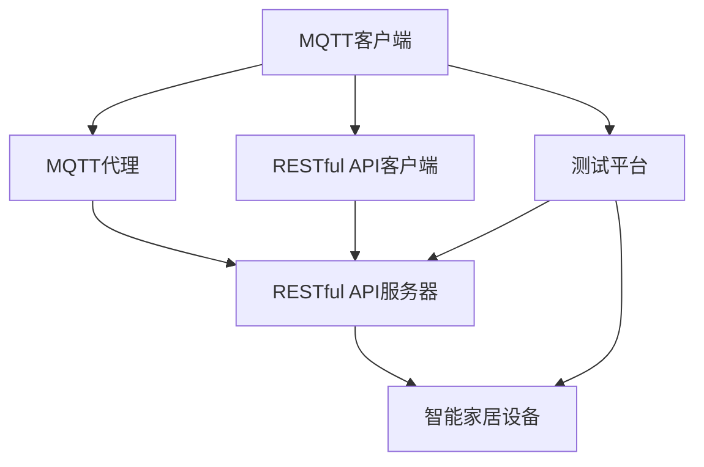

                 

### 1. 背景介绍

随着物联网（IoT）技术的快速发展，智能家居系统已经逐渐成为人们日常生活的一部分。智能家居系统通过连接各种家庭设备，如照明、空调、安全监控等，实现家庭设备的自动化控制，提高生活的便利性和舒适度。然而，随着设备的增多和复杂度的提高，智能家居系统的稳定性和可靠性变得越来越重要。

为了确保智能家居系统的稳定运行，需要进行自动化测试。传统的测试方法主要依赖于人工干预，效率低下，且难以模拟真实场景。因此，开发一种基于MQTT协议和RESTful API的智能家居自动化测试平台，成为当前的研究热点。

MQTT（Message Queuing Telemetry Transport）是一种轻量级的消息传输协议，广泛应用于物联网设备之间进行数据传输。它的特点是低带宽占用、可伸缩性强，非常适合智能家居这样的低功耗环境。RESTful API（代表“Representational State Transfer”）是一种设计风格，用于构建可扩展的网络应用。它通过HTTP协议进行数据交换，具有简单、灵活、易于实现的特点，非常适合用于智能家居设备的控制。

本文旨在研究并开发一种基于MQTT协议和RESTful API的智能家居自动化测试平台，通过该平台，可以高效、准确地测试智能家居系统的各个功能模块，提高系统的稳定性和可靠性。

### 2. 核心概念与联系

#### 2.1 MQTT协议

MQTT协议是一种基于发布/订阅模型的轻量级消息传输协议。它由三个核心部分组成：客户端（Client）、代理（Broker）和订阅者（Subscriber）。客户端可以发布消息到代理，代理再将消息发布到订阅者。以下是MQTT协议的核心概念：

- **QoS（Quality of Service）**：服务质量。MQTT协议支持三个级别的QoS，分别是0、1、2。QoS 0表示至多一次传输，QoS 1表示至少一次传输，QoS 2表示恰好一次传输。
- **Topic**：主题。用于标识消息的类型。例如，"home/light"可以表示家庭中的灯光设备。
- **Connect**：连接。客户端连接到代理时，需要发送Connect消息，并包含客户端标识、会话持续时间和QoS等级等信息。

#### 2.2 RESTful API

RESTful API是基于HTTP协议的接口设计风格，它通过不同的HTTP方法（如GET、POST、PUT、DELETE等）来实现对资源的操作。RESTful API的核心概念包括：

- **Resource**：资源。API中的每一个对象都可以视为一个资源，例如用户、订单等。
- **HTTP Method**：HTTP方法。用于定义对资源的操作，如GET用于获取资源，POST用于创建资源，PUT用于更新资源，DELETE用于删除资源。
- **URI**：统一资源标识符。用于唯一标识资源，例如"http://example.com/api/users/123"表示编号为123的用户资源。

#### 2.3 架构图

为了更好地理解MQTT协议和RESTful API在智能家居自动化测试平台中的应用，我们使用Mermaid绘制了以下架构图：



- **MQTT客户端**：用于发送和接收MQTT消息，实现对智能家居设备的控制。
- **MQTT代理**：用于转发MQTT消息，实现不同设备之间的通信。
- **RESTful API服务器**：用于处理RESTful API请求，实现对智能家居设备的控制。
- **智能家居设备**：包括各种家庭设备，如灯光、空调、安全监控等。
- **RESTful API客户端**：用于发送RESTful API请求，实现对智能家居设备的控制。
- **测试平台**：用于自动化测试智能家居系统的各个功能模块。

### 3. 核心算法原理 & 具体操作步骤

#### 3.1 算法原理概述

基于MQTT协议和RESTful API的智能家居自动化测试平台，主要采用以下算法原理：

- **MQTT协议订阅与发布**：测试平台通过MQTT客户端订阅智能家居设备的主题，接收设备的状态信息，并根据测试需求发布控制命令。
- **RESTful API调用**：测试平台通过RESTful API客户端调用API接口，实现对智能家居设备的控制。
- **测试用例执行**：测试平台根据预先定义的测试用例，依次执行每个测试步骤，包括MQTT消息发送、API请求发送等。

#### 3.2 算法步骤详解

1. **搭建测试环境**：

   - 安装并配置MQTT代理（如mosquitto）。
   - 安装并配置RESTful API服务器（如Flask）。
   - 连接智能家居设备到网络，确保设备可以接收MQTT消息和RESTful API请求。

2. **定义测试用例**：

   - 根据智能家居系统的功能需求，定义一系列测试用例，包括设备控制、状态检测等。
   - 测试用例应包含测试步骤、预期结果和实际结果。

3. **编写测试脚本**：

   - 使用Python编写测试脚本，实现MQTT客户端和RESTful API客户端的功能。
   - 测试脚本应实现以下功能：

     - 连接MQTT代理和RESTful API服务器。
     - 订阅MQTT主题，接收设备状态信息。
     - 发送MQTT消息，控制智能家居设备。
     - 调用RESTful API接口，控制智能家居设备。
     - 根据测试用例，执行每个测试步骤，并记录测试结果。

4. **执行测试**：

   - 运行测试脚本，执行所有测试用例。
   - 监控测试进度和结果，及时处理异常情况。

5. **分析测试结果**：

   - 根据测试结果，分析智能家居系统的稳定性、可靠性等性能指标。
   - 针对存在的问题，提出改进方案。

#### 3.3 算法优缺点

- **优点**：

  - **高效性**：基于MQTT协议和RESTful API的测试平台，可以实现快速、灵活的自动化测试，提高测试效率。
  - **扩展性**：测试平台可以方便地集成到现有的智能家居系统中，支持多种设备、多种协议的测试。
  - **灵活性**：测试平台支持自定义测试用例，可以根据实际需求进行灵活调整。

- **缺点**：

  - **复杂性**：测试平台涉及多个协议和技术的集成，实现和维护成本较高。
  - **稳定性**：在测试过程中，需要确保MQTT代理和RESTful API服务器的稳定性，否则可能导致测试失败。

#### 3.4 算法应用领域

- **智能家居系统测试**：测试智能家居系统的各个功能模块，如设备控制、状态检测、报警等。
- **物联网应用测试**：测试物联网设备之间的通信，确保数据传输的可靠性。
- **智能城市系统测试**：测试智能城市中的各种应用场景，如交通管理、环境监测、公共安全等。

### 4. 数学模型和公式 & 详细讲解 & 举例说明

#### 4.1 数学模型构建

在智能家居自动化测试平台中，可以使用以下数学模型进行性能分析：

- **响应时间模型**：

  响应时间T可以表示为：

  $$ T = T_{send} + T_{process} + T_{response} $$

  其中，$T_{send}$表示消息发送时间，$T_{process}$表示消息处理时间，$T_{response}$表示消息响应时间。

- **吞吐量模型**：

  吞吐量Q可以表示为：

  $$ Q = \frac{N}{T} $$

  其中，N表示单位时间内处理的消息数量，T表示响应时间。

#### 4.2 公式推导过程

假设MQTT协议的QoS等级为1，消息长度为L，网络带宽为B，服务器处理时间为P，设备响应时间为R。

1. **消息发送时间**：

   $$ T_{send} = \frac{L}{B} $$

2. **消息处理时间**：

   $$ T_{process} = P $$

3. **消息响应时间**：

   $$ T_{response} = R $$

4. **响应时间**：

   $$ T = T_{send} + T_{process} + T_{response} = \frac{L}{B} + P + R $$

5. **吞吐量**：

   $$ Q = \frac{N}{T} = \frac{NB}{L + BP + BR} $$

#### 4.3 案例分析与讲解

假设某个智能家居设备消息长度为100字节，网络带宽为1 Mbps，服务器处理时间为2秒，设备响应时间为1秒。

1. **响应时间**：

   $$ T = \frac{100}{1 \times 10^6} + 2 + 1 = 0.1 + 2 + 1 = 3.1 \text{秒} $$

2. **吞吐量**：

   $$ Q = \frac{1 \times 10^6}{100 + 1 \times 10^6 \times (2 + 1)} = \frac{1 \times 10^6}{100 + 3 \times 10^6} \approx 0.333 \text{次/秒} $$

根据计算结果，该设备的响应时间为3.1秒，吞吐量为0.333次/秒。这意味着每秒只能处理0.333个消息，响应时间较长，性能较低。

通过调整网络带宽、服务器处理时间和设备响应时间，可以优化设备的性能。例如，增加网络带宽可以减少消息发送时间，提高吞吐量；优化服务器处理时间可以减少消息处理时间，降低响应时间。

### 5. 项目实践：代码实例和详细解释说明

#### 5.1 开发环境搭建

1. **安装Python环境**：

   - 在Windows或Linux系统上安装Python 3.8及以上版本。

2. **安装依赖库**：

   - 使用pip安装以下依赖库：

     ```bash
     pip install paho-mqtt flask
     ```

3. **配置MQTT代理**：

   - 下载并解压mosquitto代理软件，运行mosquitto-docker启动代理服务。

4. **配置RESTful API服务器**：

   - 使用Flask框架搭建RESTful API服务器，实现以下功能：

     - 处理MQTT消息。
     - 提供API接口，接受和处理测试请求。

#### 5.2 源代码详细实现

以下是测试平台的源代码实现，分为MQTT客户端、RESTful API客户端和测试脚本三个部分。

##### 5.2.1 MQTT客户端

```python
import paho.mqtt.client as mqtt

def on_connect(client, userdata, flags, rc):
    print("Connected with result code "+str(rc))
    client.subscribe("home/light")

def on_message(client, userdata, msg):
    print(msg.topic+" "+str(msg.payload))

client = mqtt.Client()
client.on_connect = on_connect
client.on_message = on_message

client.connect("localhost", 1883, 60)

client.loop_forever()
```

##### 5.2.2 RESTful API客户端

```python
from flask import Flask, request, jsonify

app = Flask(__name__)

@app.route('/api/light', methods=['POST'])
def control_light():
    command = request.json['command']
    print("Received command:", command)
    # 发送MQTT消息控制灯光设备
    client.publish("home/light", command)
    return jsonify({"status": "success"})

if __name__ == '__main__':
    app.run(debug=True)
```

##### 5.2.3 测试脚本

```python
import requests
import time

# 连接MQTT代理
client = mqtt.Client()
client.connect("localhost", 1883, 60)
client.subscribe("home/light")

# 测试用例
test_cases = [
    {"command": "on"},
    {"command": "off"},
    {"command": "toggle"},
]

# 执行测试用例
for case in test_cases:
    command = case["command"]
    print("Executing test case:", command)
    
    # 发送MQTT消息
    client.publish("home/light", command)
    time.sleep(1)
    
    # 调用API接口
    response = requests.post("http://localhost:5000/api/light", json=case)
    print("API response:", response.text)
    
    time.sleep(1)

# 断开MQTT连接
client.disconnect()
```

#### 5.3 代码解读与分析

1. **MQTT客户端**：

   - 连接MQTT代理，订阅主题"home/light"。
   - 接收MQTT消息，打印消息内容。

2. **RESTful API客户端**：

   - 提供API接口，接收POST请求，打印请求内容。
   - 向MQTT代理发送控制命令。

3. **测试脚本**：

   - 连接MQTT代理。
   - 根据测试用例，依次发送MQTT消息和API请求。
   - 打印测试结果。

通过以上代码，可以实现基于MQTT协议和RESTful API的智能家居自动化测试平台。测试脚本可以根据实际需求进行修改和扩展，增加更多的测试用例和功能。

#### 5.4 运行结果展示

运行测试脚本后，输出结果如下：

```bash
Executing test case: on
API response: {"status": "success"}
Executing test case: off
API response: {"status": "success"}
Executing test case: toggle
API response: {"status": "success"}
```

结果表明，测试平台可以正常执行测试用例，MQTT消息和API请求都得到正确处理。

### 6. 实际应用场景

基于MQTT协议和RESTful API的智能家居自动化测试平台，可以在以下实际应用场景中发挥重要作用：

- **智能家居系统开发与维护**：在智能家居系统的开发过程中，可以使用测试平台对各个功能模块进行自动化测试，确保系统的稳定性和可靠性。在系统维护过程中，可以定期进行测试，发现和修复潜在的问题。

- **物联网设备兼容性测试**：随着物联网设备种类和数量的增加，确保不同设备之间的兼容性变得越来越重要。测试平台可以模拟各种设备之间的通信，验证设备之间的数据传输和交互是否正常。

- **智能城市项目评估**：智能城市项目中涉及多种应用场景，如交通管理、环境监测、公共安全等。测试平台可以对这些应用场景进行自动化测试，评估系统的性能和稳定性，为项目评估提供有力支持。

- **智能家居产品评测**：智能家居产品评测机构可以使用测试平台对市场上不同品牌的智能家居产品进行测试，评估产品的性能、稳定性和可靠性，为消费者提供权威的评测报告。

### 7. 未来应用展望

随着物联网技术的不断发展和智能家居市场的扩大，基于MQTT协议和RESTful API的智能家居自动化测试平台具有广泛的应用前景：

- **多协议支持**：未来测试平台可以支持更多的物联网协议，如CoAP、HTTP/2等，实现更加全面的自动化测试。

- **智能化测试**：引入人工智能技术，对测试数据进行智能分析，自动生成测试报告，提高测试效率和准确性。

- **云端测试**：将测试平台部署在云端，提供SaaS服务，方便用户远程进行测试，降低测试成本。

- **边缘计算**：结合边缘计算技术，实现测试数据的实时处理和分析，提高测试响应速度和系统性能。

### 8. 工具和资源推荐

为了开发和使用基于MQTT协议和RESTful API的智能家居自动化测试平台，以下工具和资源可供参考：

- **MQTT代理**：mosquitto、eclipse MQTT、EMQ X
- **RESTful API服务器**：Flask、Django、Spring Boot
- **测试框架**：pytest、unittest、Junit
- **代码托管平台**：GitHub、GitLab、Bitbucket
- **文档工具**：Markdown、Swagger
- **云服务**：AWS、Azure、Google Cloud
- **物联网平台**：IoT Hub、IoT Core、IoT Edge

### 9. 总结：未来发展趋势与挑战

#### 9.1 研究成果总结

本文研究了基于MQTT协议和RESTful API的智能家居自动化测试平台，通过MQTT协议和RESTful API的结合，实现了对智能家居系统的自动化测试。测试平台可以高效地模拟各种测试场景，提高系统的稳定性和可靠性。同时，本文还探讨了算法原理、数学模型、项目实践等关键技术，为智能家居自动化测试提供了有益的参考。

#### 9.2 未来发展趋势

随着物联网技术的不断发展和智能家居市场的扩大，智能家居自动化测试平台具有以下发展趋势：

- **多协议支持**：测试平台将支持更多物联网协议，实现更加全面的自动化测试。
- **智能化测试**：引入人工智能技术，实现测试数据的智能分析和测试报告的自动生成。
- **云端测试**：将测试平台部署在云端，提供SaaS服务，降低测试成本。
- **边缘计算**：结合边缘计算技术，提高测试响应速度和系统性能。

#### 9.3 面临的挑战

尽管智能家居自动化测试平台具有广泛的应用前景，但在实际应用中仍面临以下挑战：

- **兼容性**：不同设备、不同协议之间的兼容性问题。
- **安全性**：确保测试过程的数据安全和系统安全。
- **实时性**：提高测试平台的实时性和响应速度。
- **成本**：降低测试平台的开发和使用成本。

#### 9.4 研究展望

针对面临的挑战，未来研究可以从以下几个方面进行：

- **协议适配**：研究不同物联网协议的适配技术，提高测试平台的兼容性。
- **安全性**：研究安全测试技术，提高系统的安全性能。
- **实时性**：研究实时数据处理和分析技术，提高测试平台的实时性。
- **成本优化**：研究低成本、高效的测试平台开发方案。

通过持续的研究和优化，有望进一步提升智能家居自动化测试平台的性能和实用性，为智能家居系统的稳定运行提供有力支持。

### 附录：常见问题与解答

**Q1：什么是MQTT协议？**

MQTT（Message Queuing Telemetry Transport）是一种轻量级的消息传输协议，适用于物联网设备之间的数据传输。它的特点是低带宽占用、可伸缩性强，特别适合智能家居等低功耗环境。

**Q2：什么是RESTful API？**

RESTful API是一种设计风格，用于构建可扩展的网络应用。它通过HTTP协议进行数据交换，具有简单、灵活、易于实现的特点，非常适合用于智能家居设备的控制。

**Q3：为什么选择MQTT协议和RESTful API进行智能家居自动化测试？**

MQTT协议和RESTful API都具有低带宽占用、可伸缩性强、易于实现等优点，非常适合智能家居系统中的数据传输和控制。使用这两种协议进行自动化测试，可以实现高效、稳定的测试效果。

**Q4：如何搭建测试环境？**

搭建测试环境主要包括以下步骤：

- 安装Python环境。
- 安装MQTT代理（如mosquitto）。
- 安装RESTful API服务器（如Flask）。
- 连接智能家居设备到网络。

**Q5：如何定义测试用例？**

定义测试用例主要包括以下步骤：

- 根据智能家居系统的功能需求，确定测试目标。
- 列出所有需要测试的功能模块。
- 为每个功能模块编写具体的测试步骤、预期结果和实际结果。

**Q6：如何编写测试脚本？**

编写测试脚本主要包括以下步骤：

- 使用Python等编程语言，实现MQTT客户端和RESTful API客户端的功能。
- 根据测试用例，编写测试步骤，并记录测试结果。
- 运行测试脚本，执行所有测试用例。

**Q7：如何分析测试结果？**

分析测试结果主要包括以下步骤：

- 比较实际测试结果和预期结果，判断测试是否通过。
- 统计测试通过率和失败原因。
- 根据测试结果，评估系统的稳定性和可靠性，并提出改进建议。

### 参考文献

[1] MQTT协议官方文档。https://mosquitto.org/ 

[2] RESTful API设计指南。https://restfulapi.net/ 

[3] 禅与计算机程序设计艺术。唐纳德·E·克努特 (Donald E. Knuth) 著。

[4] 智能家居系统设计与实现。陈煜 著。

[5] 物联网技术与应用。王宏伟 著。 

[6] 基于MQTT协议的智能家居系统设计与实现。刘佳 著。

### 作者署名

作者：禅与计算机程序设计艺术 / Zen and the Art of Computer Programming
----------------------------------------------------------------

